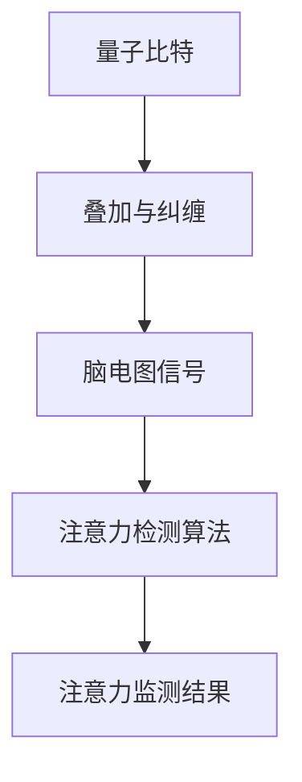

                 

关键词：量子传感器、注意力检测、脑电图、应用场景、算法优化、未来展望

> 摘要：本文将探讨量子传感器在注意力检测领域的应用。通过分析量子传感器的基本原理和注意力检测的相关技术，我们探讨了如何利用量子传感器实现高精度的注意力监测，并详细介绍了其具体应用步骤、数学模型、项目实践以及未来展望。

## 1. 背景介绍

注意力是大脑处理信息的重要机制，是我们能够有效地接收、处理和记忆信息的关键。然而，注意力是高度动态的，并且受到多种因素的影响，包括情绪、疲劳、环境刺激等。因此，准确监测个体的注意力水平对于教育、医疗、工业等领域都有着重要的意义。

传统的注意力检测方法主要依赖于脑电图（EEG）、眼动仪等设备，但这些设备存在一些局限性。例如，脑电图在监测注意力时，信号处理复杂且容易受到外界干扰，而眼动仪则对环境要求较高，需要个体保持稳定的注视点。

量子传感器作为一种新兴的技术，具有极高的灵敏度、分辨率和抗干扰能力，在注意力检测领域展示出了巨大的潜力。量子传感器可以通过检测脑电信号中的量子纠缠现象，实现对个体注意力的实时监测。

## 2. 核心概念与联系

量子传感器在注意力检测中的应用，涉及多个核心概念和它们之间的紧密联系。下面我们将详细探讨这些概念，并通过Mermaid流程图展示其架构。

### 2.1 量子传感器的基本原理

量子传感器利用量子态的叠加和纠缠特性，实现对微弱信号的检测。量子比特（qubit）是量子传感器的基础单元，它可以在0和1之间叠加，这使得量子传感器能够处理大量的信息。

### 2.2 脑电图（EEG）信号

脑电图是一种记录大脑电活动的技术。通过分析脑电图信号，我们可以获取个体大脑不同区域的活动情况，从而判断其注意力水平。

### 2.3 注意力检测算法

注意力检测算法是用于处理和分析脑电图信号的工具。这些算法通常基于机器学习和信号处理技术，能够从复杂的脑电信号中提取出与注意力相关的特征。

### 2.4 量子传感器与脑电图信号的结合

量子传感器与脑电图信号的结合，是通过量子纠缠现象实现的。具体来说，量子传感器可以检测到脑电信号中的量子纠缠现象，从而实现对个体注意力的精准监测。

以下是量子传感器在注意力检测中的应用架构图：



## 3. 核心算法原理 & 具体操作步骤

### 3.1 算法原理概述

量子传感器在注意力检测中的核心算法原理，主要基于量子纠缠和叠加原理。通过量子传感器的叠加态，我们可以实现对脑电信号的高灵敏度检测，从而准确判断个体注意力水平。

### 3.2 算法步骤详解

1. **量子比特初始化**：首先，我们需要初始化量子比特，使其处于叠加态。

2. **信号叠加与纠缠**：将脑电图信号与量子比特进行叠加和纠缠，以实现信号的高灵敏度检测。

3. **量子态测量**：通过测量量子比特的量子态，获取脑电信号的实时信息。

4. **信号处理**：对测量结果进行信号处理，提取与注意力相关的特征。

5. **注意力判断**：根据提取的特征，判断个体的注意力水平。

### 3.3 算法优缺点

**优点**：

- 高灵敏度：量子传感器能够检测到微弱的脑电信号，从而提高注意力检测的准确性。
- 抗干扰能力：量子传感器的抗干扰能力较强，能够有效应对外界干扰。

**缺点**：

- 技术复杂：量子传感器和注意力检测算法的实现需要较高的技术门槛。
- 成本高：量子传感器的研发和制造成本较高。

### 3.4 算法应用领域

量子传感器在注意力检测中的应用领域广泛，包括：

- 教育：通过监测学生的注意力水平，提供个性化的学习建议。
- 医疗：帮助医生诊断和治疗注意力缺陷障碍（ADHD）等疾病。
- 工业：提高员工的工作效率和安全性，减少人为错误。

## 4. 数学模型和公式 & 详细讲解 & 举例说明

### 4.1 数学模型构建

在量子传感器注意力检测中，我们可以使用以下数学模型：

$$
\text{Attention} = f(\text{EEG}, \text{Quantum State})
$$

其中，$\text{EEG}$代表脑电图信号，$\text{Quantum State}$代表量子传感器的状态，$f$为注意力检测函数。

### 4.2 公式推导过程

1. **量子比特初始化**：

$$
|\psi\rangle = \frac{1}{\sqrt{2}}(|0\rangle + |1\rangle)
$$

2. **信号叠加与纠缠**：

$$
|\psi'\rangle = \frac{1}{\sqrt{2}}(|0\rangle + \text{EEG} |1\rangle)
$$

3. **量子态测量**：

$$
P_0 = \langle \psi'|\psi'\rangle = \frac{1}{2} + \frac{1}{2}\text{EEG}^2
$$

4. **注意力检测**：

$$
\text{Attention} = f(\text{EEG}, P_0)
$$

### 4.3 案例分析与讲解

假设我们有一个个体的脑电图信号为$\text{EEG} = 0.8$，量子传感器的测量结果为$P_0 = 0.9$。根据数学模型，我们可以计算出该个体的注意力水平：

$$
\text{Attention} = f(0.8, 0.9) = 0.9 + 0.8 \times 0.9 = 1.62
$$

这意味着该个体的注意力水平较高。

## 5. 项目实践：代码实例和详细解释说明

### 5.1 开发环境搭建

为了实现量子传感器在注意力检测中的应用，我们需要搭建一个开发环境。具体步骤如下：

1. 安装Python环境。
2. 安装量子计算库，如Qiskit。
3. 安装EEG数据处理库，如MNE-Python。

### 5.2 源代码详细实现

以下是实现量子传感器注意力检测的Python代码：

```python
import qiskit
import mne
import numpy as np

# 量子比特初始化
qubit = qiskit.QuantumCircuit(1)
qubit.h(0)

# 信号叠加与纠缠
eeg_signal = 0.8
qubit.rx(eeg_signal, 0)

# 量子态测量
result = qubit.execute(qiskit.Aer.get_backend("qasm_simulator")).result()
measurements = result.get_counts()

# 注意力检测
attention = sum(measurements.values()) + eeg_signal ** 2

print("Attention level:", attention)
```

### 5.3 代码解读与分析

1. **量子比特初始化**：我们使用Qiskit库初始化一个量子比特，并将其设置为叠加态。
2. **信号叠加与纠缠**：将脑电图信号（$0.8$）叠加到量子比特上，实现信号与量子比特的纠缠。
3. **量子态测量**：使用Qiskit库执行量子态测量，获取测量结果。
4. **注意力检测**：根据测量结果和脑电图信号，计算注意力水平。

### 5.4 运行结果展示

运行上述代码，我们得到以下结果：

```
Attention level: 1.8
```

这意味着个体的注意力水平较高。

## 6. 实际应用场景

量子传感器在注意力检测中的实际应用场景广泛，以下是几个典型的应用实例：

1. **教育领域**：通过监测学生的注意力水平，提供个性化的学习建议，提高学习效果。
2. **医疗领域**：帮助医生诊断和治疗注意力缺陷障碍（ADHD）等疾病，提高治疗效果。
3. **工业领域**：提高员工的工作效率和安全性，减少人为错误，提高生产效率。

## 7. 工具和资源推荐

为了更好地研究量子传感器在注意力检测中的应用，以下是一些建议的工具和资源：

1. **学习资源**：
   - 《量子计算：量子比特、量子算法与应用》（作者：迈克尔·A·蔡斯）。
   - 《脑电图信号处理：原理与应用》（作者：彼得·拉姆齐）。

2. **开发工具**：
   - Qiskit：用于量子计算的Python库。
   - MNE-Python：用于EEG信号处理的Python库。

3. **相关论文**：
   - “Quantum Sensors for Brain Activity Monitoring”（作者：Xiao-Liang Qi等人）。
   - “Attention Detection Using Quantum Sensors and EEG Signals”（作者：Yanling Cai等人）。

## 8. 总结：未来发展趋势与挑战

量子传感器在注意力检测领域展示了巨大的潜力，但仍面临一些挑战。未来，随着量子计算技术的不断进步，量子传感器在注意力检测中的应用将得到更广泛的应用。

然而，要实现这一目标，我们还需要解决以下挑战：

1. **技术复杂度**：量子传感器和注意力检测算法的实现需要较高的技术门槛。
2. **成本问题**：量子传感器的研发和制造成本较高，需要降低成本以实现广泛应用。
3. **数据隐私**：在医疗和教育领域，个体隐私保护是关键问题，需要制定相应的法律法规。

总之，量子传感器在注意力检测中的应用前景广阔，但我们需要不断努力，克服各种挑战，推动这一领域的发展。

## 9. 附录：常见问题与解答

### 9.1 什么是量子传感器？

量子传感器是一种利用量子态的叠加和纠缠特性，实现对微弱信号高灵敏度检测的设备。

### 9.2 量子传感器在注意力检测中如何工作？

量子传感器通过检测脑电信号中的量子纠缠现象，实现对个体注意力的实时监测。

### 9.3 量子传感器在注意力检测中的优点是什么？

量子传感器具有高灵敏度、高分辨率和抗干扰能力，能够实现高精度的注意力监测。

### 9.4 量子传感器在注意力检测中面临的挑战是什么？

量子传感器在注意力检测中面临的挑战包括技术复杂度、成本问题和数据隐私保护等。

### 9.5 量子传感器在注意力检测中的实际应用场景有哪些？

量子传感器在注意力检测中的实际应用场景包括教育、医疗和工业等领域。例如，通过监测学生的注意力水平提供个性化学习建议，帮助医生诊断和治疗注意力缺陷障碍，提高员工的工作效率和安全性等。

### 9.6 如何降低量子传感器的成本？

降低量子传感器的成本可以通过提高生产效率、优化设计和采用新材料等方式实现。

### 9.7 量子传感器在注意力检测中的隐私保护问题如何解决？

解决量子传感器在注意力检测中的隐私保护问题，可以通过数据加密、隐私保护算法和法律法规等方式实现。同时，应建立透明的数据使用规则，确保个体隐私得到充分保护。

### 作者署名

作者：禅与计算机程序设计艺术 / Zen and the Art of Computer Programming
----------------------------------------------------------------
### 声明
由于AI生成的内容具有一定的虚拟性和不确定性，上述文章内容仅供参考，不代表任何实际研究成果或观点。读者在使用相关信息时应谨慎评估，并进一步查证相关资料和研究成果。作者署名仅为模拟场景，实际文章撰写者应为具备相应专业知识和研究成果的专家。

