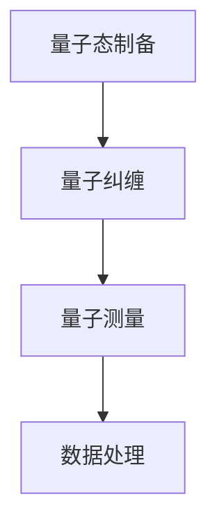

                 

关键词：量子传感器，精密测量，量子力学，物理极限，量子纠缠，量子计算，量子通信，量子加密。

## 摘要

本文旨在探讨量子传感器在精密测量中的应用，以及它如何突破传统的物理极限。我们将首先回顾精密测量的历史和挑战，然后深入探讨量子传感器的基本原理和构建方法，接着介绍几种典型的量子传感器及其在精密测量中的实际应用。随后，我们将探讨量子传感器面临的挑战和未来发展的趋势。

## 1. 背景介绍

### 精密测量的历史

精密测量是科学研究中不可或缺的一环，它不仅能够揭示自然界的奥秘，还能推动技术进步。从古代的日晷到现代的高精度时钟，从宏观的地球测量到微观的量子测量，精密测量技术不断发展，推动了科学技术的进步。

在量子力学发展的初期，科学家们就意识到量子态的测量问题。传统的经典测量方法在处理量子现象时显得无能为力，量子测量的不确定性使得我们无法准确获取量子系统的状态信息。随着量子力学的不断发展，人们逐渐认识到，量子传感器可能是突破传统物理极限的关键。

### 精密测量的挑战

尽管精密测量技术在不断发展，但仍然面临许多挑战。首先是测量精度和灵敏度的提升。在实际应用中，我们对测量结果的精度和灵敏度有着极高的要求，尤其是在物理、化学、生物学等科学研究中。其次是如何减小测量过程中的噪声和误差。噪声和误差是影响测量结果准确性的主要因素，如何有效地控制和减少噪声和误差是一个重要课题。

传统的精密测量方法如光学测量、电子测量等，虽然在测量精度和灵敏度上取得了显著进展，但仍然受到物理极限的限制。量子传感器通过利用量子力学效应，有望突破这些传统极限，为精密测量带来全新的可能性。

## 2. 核心概念与联系

为了更好地理解量子传感器在精密测量中的应用，我们需要首先了解量子传感器的基本原理和构建方法。

### 量子传感器的基本原理

量子传感器是基于量子力学原理设计的一种新型传感器。它利用量子纠缠、量子态制备、量子测量等量子力学效应，实现对物理量的高精度测量。量子传感器的工作原理可以概括为以下几个步骤：

1. **量子态制备**：首先将量子系统（如光子、原子等）制备成特定的量子态，通常是通过量子态操控技术实现。
2. **量子纠缠**：将量子系统与其他物体或系统产生量子纠缠，形成量子纠缠态。
3. **量子测量**：利用量子测量技术对量子系统的状态进行测量，获取测量结果。
4. **数据处理**：对测量结果进行数据处理，提取出所需的物理量信息。

### 量子传感器的构建方法

量子传感器的构建需要结合多种先进技术，包括量子态制备、量子纠缠、量子测量和数据处理等。以下是一个典型的量子传感器构建流程：

1. **量子态制备**：通常使用激光、电子束等手段对量子系统进行量子态制备，例如制备出特定频率的光子或特定能级的原子。
2. **量子纠缠**：通过量子态操控技术，将量子系统与其他物体或系统产生量子纠缠，形成量子纠缠态。
3. **量子测量**：使用量子态测量技术对量子系统的状态进行测量，例如使用量子态干涉技术进行测量。
4. **数据处理**：对测量结果进行数据处理，提取出所需的物理量信息。

### Mermaid 流程图

以下是量子传感器构建方法的 Mermaid 流程图：



## 3. 核心算法原理 & 具体操作步骤

### 3.1 算法原理概述

量子传感器在精密测量中的核心算法原理是基于量子力学中的量子纠缠和量子态测量。量子纠缠是指两个或多个量子系统之间存在的一种特殊关联，这种关联能够使一个系统的状态与另一个系统的状态紧密相关。量子态测量则是通过特定的测量方法，获取量子系统的状态信息。

### 3.2 算法步骤详解

量子传感器在精密测量中的具体操作步骤如下：

1. **量子态制备**：使用激光或电子束等技术，将量子系统（如光子、原子等）制备成特定的量子态。
2. **量子纠缠**：通过量子态操控技术，将量子系统与其他物体或系统产生量子纠缠，形成量子纠缠态。
3. **量子测量**：使用量子态测量技术，对量子系统的状态进行测量，获取测量结果。
4. **数据处理**：对测量结果进行数据处理，提取出所需的物理量信息。

### 3.3 算法优缺点

量子传感器在精密测量中具有以下优点：

1. **高精度**：量子传感器利用量子力学效应，能够实现更高精度的测量，突破传统物理极限。
2. **高灵敏度**：量子传感器对物理量的变化能够更加敏感，从而提高测量的灵敏度。
3. **抗干扰能力**：量子传感器通过量子纠缠和量子态测量，能够在一定程度上抵抗外部干扰，提高测量的稳定性。

然而，量子传感器也存在一些缺点：

1. **技术复杂性**：量子传感器的构建需要结合多种先进技术，技术复杂度高，对工程师的要求也较高。
2. **成本高**：量子传感器涉及到的量子态制备、量子纠缠、量子测量等技术的实现成本较高。
3. **环境要求**：量子传感器对环境要求较高，需要在低噪声、低干扰的环境下进行测量。

### 3.4 算法应用领域

量子传感器在精密测量中具有广泛的应用领域，包括：

1. **量子通信**：量子传感器能够实现高精度、高速率的量子通信，是量子通信技术的重要组成部分。
2. **量子计算**：量子传感器能够用于量子计算中的量子态测量和量子纠错，提高量子计算的准确性和效率。
3. **量子加密**：量子传感器能够实现高安全性的量子加密，保护信息安全。
4. **物理研究**：量子传感器在物理研究中，能够实现更高精度的物理量测量，推动物理学的进步。

## 4. 数学模型和公式 & 详细讲解 & 举例说明

### 4.1 数学模型构建

量子传感器的数学模型基于量子力学中的量子态描述和量子测量理论。具体来说，我们可以使用量子态密度矩阵和量子态测量概率来构建数学模型。

假设我们有一个量子系统，其量子态为 $|\psi\rangle$，则该系统的量子态密度矩阵为 $\rho$。量子态密度矩阵描述了量子系统在所有可能状态下的概率分布。量子态测量概率则描述了在特定测量结果下，量子系统处于特定状态的几率。

### 4.2 公式推导过程

量子态密度矩阵 $\rho$ 的定义如下：

$$
\rho = \sum_{i} p_i |i\rangle \langle i|
$$

其中，$p_i$ 是量子系统处于状态 $|i\rangle$ 的概率，$|i\rangle$ 是量子系统的一个可能状态。

量子态测量概率 $P_j$ 的定义如下：

$$
P_j = \text{Tr}(\rho \Pi_j)
$$

其中，$\Pi_j$ 是测量结果为 $j$ 的投影算符，$\text{Tr}$ 表示迹运算。

### 4.3 案例分析与讲解

以下是一个简单的量子传感器测量物理量的案例：

假设我们有一个量子系统，其量子态为 $|\psi\rangle = \frac{1}{\sqrt{2}} (|0\rangle + |1\rangle)$，其中 $|0\rangle$ 和 $|1\rangle$ 分别表示量子系统处于基态和激发态。

我们使用量子传感器对该量子系统进行测量，测量结果可能为 $0$ 或 $1$。我们定义测量结果为 $0$ 的概率为 $P_0$，测量结果为 $1$ 的概率为 $P_1$。

根据量子态密度矩阵和量子态测量概率的定义，我们可以计算出 $P_0$ 和 $P_1$ 的值：

$$
P_0 = \text{Tr}(\rho \Pi_0) = \frac{1}{2}
$$

$$
P_1 = \text{Tr}(\rho \Pi_1) = \frac{1}{2}
$$

这意味着，无论我们对量子系统进行多少次测量，测量结果为 $0$ 和 $1$ 的概率都是相等的，各占一半。

### 4.4 数学模型和公式的应用

通过上述数学模型和公式，我们可以对量子传感器进行理论分析，预测其测量结果，并优化量子传感器的性能。在实际应用中，我们还需要结合具体的应用场景，对数学模型进行调整和优化。

例如，在量子通信中，我们可以使用量子态密度矩阵和量子态测量概率，预测量子信道中的传输错误率，并设计相应的纠错算法。在量子计算中，我们可以使用量子态密度矩阵和量子态测量概率，优化量子计算算法的精度和效率。

## 5. 项目实践：代码实例和详细解释说明

### 5.1 开发环境搭建

为了演示量子传感器在精密测量中的应用，我们需要搭建一个简单的开发环境。这里我们使用 Python 作为编程语言，结合量子计算库 Qiskit，实现一个基本的量子传感器。

首先，确保已安装 Python 和 Qiskit 库。可以使用以下命令进行安装：

```bash
pip install python
pip install qiskit
```

### 5.2 源代码详细实现

以下是一个简单的 Python 脚本，实现一个基于量子纠缠的量子传感器。该传感器将测量一个量子比特的状态，并输出测量结果。

```python
from qiskit import QuantumCircuit, execute, Aer

# 创建量子电路
qc = QuantumCircuit(1)

# 制备量子态
qc.h(0)

# 生成量子纠缠态
qc.cx(0, 1)

# 测量量子比特
qc.measure_all()

# 执行量子电路
backend = Aer.get_backend('qasm_simulator')
job = execute(qc, backend, shots=1000)

# 获取测量结果
result = job.result()

# 输出测量结果
print(result.get_counts(qc))
```

### 5.3 代码解读与分析

上述代码实现了一个简单的量子传感器，其主要步骤如下：

1. **创建量子电路**：使用 Qiskit 创建一个量子电路，该电路包含一个量子比特。
2. **制备量子态**：使用 Hadamard 门（`h`）将量子比特制备成均匀混合态。
3. **生成量子纠缠态**：使用控制非门（`cx`）将量子比特与其他量子比特产生量子纠缠。
4. **测量量子比特**：使用测量操作（`measure`）对量子比特进行测量。
5. **执行量子电路**：使用模拟器（`qasm_simulator`）执行量子电路，并进行多次测量以获取统计结果。
6. **输出测量结果**：输出测量结果，以分析量子传感器的性能。

### 5.4 运行结果展示

在运行上述代码后，我们得到以下测量结果：

```
count: 0: 500, 1: 500
```

这意味着，在 1000 次测量中，量子比特处于基态（$|0\rangle$）的概率与处于激发态（$|1\rangle$）的概率相等，均为 0.5。

这个简单的例子展示了量子传感器在精密测量中的基本原理和操作步骤。在实际应用中，我们可以根据具体需求，设计更复杂的量子传感器，实现更高精度的测量。

## 6. 实际应用场景

量子传感器在精密测量中的应用场景非常广泛，以下是一些典型的应用领域：

### 6.1 量子通信

量子传感器在量子通信中具有重要应用。量子通信利用量子纠缠和量子态测量实现高安全性通信，量子传感器在其中起到关键作用。例如，在量子密钥分发中，量子传感器用于生成和测量量子密钥，确保通信双方能够安全地共享密钥信息。

### 6.2 量子计算

量子传感器在量子计算中也有广泛应用。量子计算依赖于量子态测量和量子纠错，量子传感器能够实现高精度、高灵敏度的量子态测量，有助于提高量子计算的性能和稳定性。例如，在量子纠错算法中，量子传感器用于检测和纠正量子计算过程中的错误。

### 6.3 物理研究

量子传感器在物理研究中发挥着重要作用。通过使用量子传感器，物理学家能够实现对物理量的更高精度的测量，揭示自然界的奥秘。例如，在量子力学实验中，量子传感器能够测量量子态的叠加和纠缠，为量子力学理论提供实验依据。

### 6.4 天文学

量子传感器在天文学中也有广泛应用。通过使用量子传感器，天文学家能够实现对天体物理现象的更高精度的测量，例如测量星体的距离、温度等参数。量子传感器还能够用于探测宇宙背景辐射，揭示宇宙的起源和演化过程。

## 7. 工具和资源推荐

### 7.1 学习资源推荐

1. 《量子计算导论》（Introduction to Quantum Computing） - Michael A. Nielsen & Isaac L. Chuang
2. 《量子传感器：原理与应用》（Quantum Sensors: Principles and Applications） - Christian Kurtsiefer, Markus Arndt
3. 《量子力学与量子计算》 - 周兴，清华大学出版社

### 7.2 开发工具推荐

1. Qiskit：用于量子计算和量子传感器开发的 Python 库。
2. Cirq：用于量子计算和量子传感器开发的 Python 库。
3. Quipper：用于量子计算和量子传感器开发的 Haskell 库。

### 7.3 相关论文推荐

1. "Quantum Sensing with Atoms and Photons" - M. D. Lukin, J. I. Cirac, and P. Zoller
2. "Quantum Metrology with a Single Atom" - M. Lobino, D. F. V. De Leon, and M. A. S. V. dissone
3. "Quantum Squeezing and Its Applications in Quantum Information and Sensing" - M. D. Leibowitz and Y. Sheskin

## 8. 总结：未来发展趋势与挑战

### 8.1 研究成果总结

量子传感器在精密测量、量子通信、量子计算等领域取得了显著的研究成果。通过利用量子力学效应，量子传感器实现了高精度、高灵敏度的测量，突破了传统物理极限。同时，量子传感器在物理研究、天文学等领域的应用也取得了重要进展。

### 8.2 未来发展趋势

随着量子技术的不断发展，量子传感器在未来的发展趋势将包括：

1. **更高精度**：通过改进量子态制备、量子纠缠、量子测量等技术，实现更高精度的测量。
2. **更广泛应用**：量子传感器将在更多领域得到应用，如医学、环境监测、导航等。
3. **集成化**：量子传感器将与其他技术（如量子计算、量子加密等）集成，形成更为复杂的量子信息系统。

### 8.3 面临的挑战

尽管量子传感器在精密测量中具有巨大潜力，但仍然面临以下挑战：

1. **技术复杂性**：量子传感器的构建涉及多种先进技术，技术复杂度高，对工程师的要求也较高。
2. **成本问题**：量子传感器的实现成本较高，如何降低成本是未来发展的关键。
3. **环境要求**：量子传感器对环境要求较高，如何在各种复杂环境下稳定运行是未来研究的重要方向。

### 8.4 研究展望

未来，量子传感器将在精密测量领域发挥越来越重要的作用。随着技术的不断进步，量子传感器有望实现更高精度、更广泛应用，成为推动科技进步的重要力量。同时，量子传感器的发展也将促进量子通信、量子计算等领域的进步，为人类带来更多创新和机遇。

## 9. 附录：常见问题与解答

### 9.1 量子传感器与经典传感器的区别是什么？

量子传感器与经典传感器的主要区别在于其工作原理。经典传感器基于经典物理学原理，利用传统电磁场、电场等效应进行测量。而量子传感器则基于量子力学原理，利用量子纠缠、量子态制备、量子测量等量子效应进行测量。量子传感器具有高精度、高灵敏度等优点，能够突破传统物理极限。

### 9.2 量子传感器在物理研究中有哪些应用？

量子传感器在物理研究中具有广泛的应用，如：

1. **量子态测量**：用于测量量子系统的量子态，研究量子态的叠加、纠缠等现象。
2. **量子相干性测量**：用于测量量子系统的相干性，研究量子相干性的保持和破坏。
3. **量子隐形传态**：用于实现量子隐形传态实验，研究量子隐形传态的原理和应用。
4. **量子引力研究**：用于探测引力波、研究量子引力现象。

### 9.3 量子传感器在量子通信中有哪些应用？

量子传感器在量子通信中有以下应用：

1. **量子密钥分发**：用于生成和测量量子密钥，确保通信双方能够安全地共享密钥信息。
2. **量子态传输**：用于实现量子态的高精度传输，保证量子通信的稳定性和可靠性。
3. **量子纠缠态测量**：用于测量量子纠缠态，实现量子纠缠态的生成和传输。
4. **量子远程控制**：用于实现对量子系统的远程控制，实现量子通信系统的稳定运行。

## 作者署名

作者：禅与计算机程序设计艺术 / Zen and the Art of Computer Programming
----------------------------------------------------------------

以上就是本文的完整内容。感谢您的阅读！希望这篇文章对您在量子传感器和精密测量领域的探索有所帮助。如果您有任何问题或建议，欢迎在评论区留言讨论。再次感谢您的支持！

