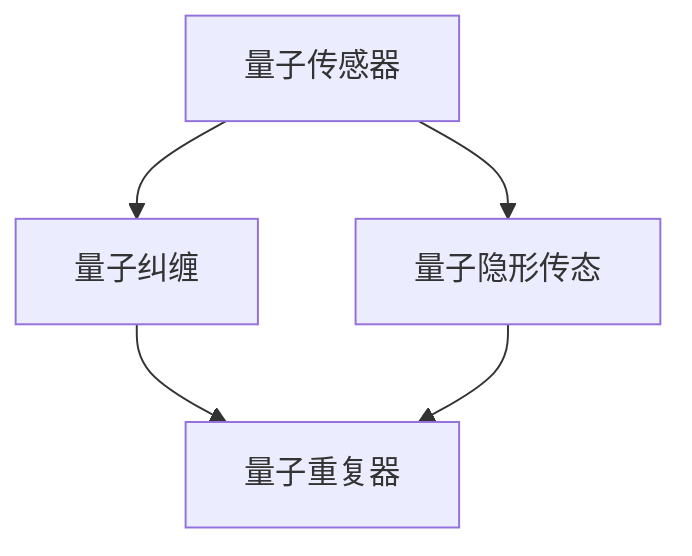
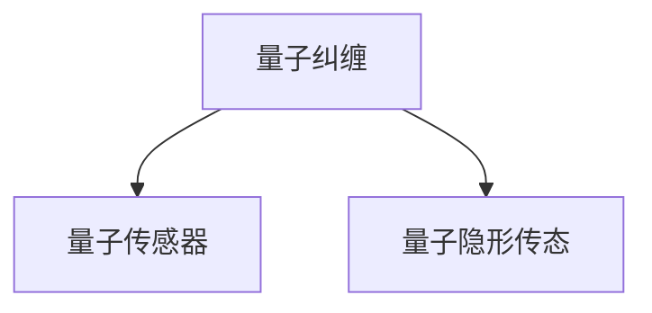
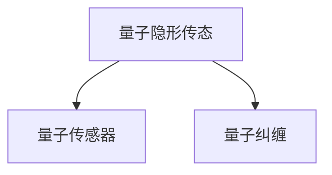
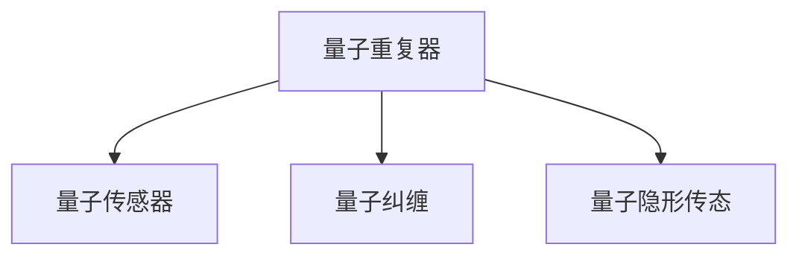

                 

关键词：量子传感网络、分布式量子计算、量子信息传输、量子通信、量子算法、量子传感器、量子纠缠、量子隐形传态、量子重复器。

> 摘要：本文探讨了量子传感网络在分布式量子计算中的作用，分析了其核心概念、算法原理以及数学模型。通过具体的实践案例，揭示了量子传感网络在实际应用中的潜力与挑战，展望了未来发展的方向。

## 1. 背景介绍

随着量子计算的快速发展，分布式量子计算逐渐成为研究的热点。分布式量子计算通过将量子计算任务分布在多个量子节点上，实现复杂的计算任务。然而，传统的量子通信技术如量子纠缠和量子隐形传态在长距离传输中面临着信噪比降低、传输效率低等问题，无法满足分布式量子计算的需求。

量子传感网络是一种基于量子物理原理的新型通信网络，通过量子传感器实现对信息的量子态测量和传输。与传统的量子通信技术相比，量子传感网络在信息传输的稳定性和传输速率上具有显著优势，为分布式量子计算提供了可靠的信息传输基础。

## 2. 核心概念与联系

量子传感网络的核心概念包括量子传感器、量子纠缠、量子隐形传态和量子重复器。以下是这些概念之间的联系及对应的Mermaid流程图：

### 2.1 量子传感器

量子传感器利用量子物理效应，如量子纠缠和量子隐形传态，实现对信息的测量和传输。Mermaid流程图：



### 2.2 量子纠缠

量子纠缠是量子物理中的一种现象，两个或多个量子系统之间存在着一种不可分割的关联。量子纠缠是实现量子通信和信息传输的基础。Mermaid流程图：



### 2.3 量子隐形传态

量子隐形传态是一种将一个量子系统的状态传递到另一个量子系统的过程，不涉及传输过程中的物理位置。量子隐形传态是实现量子通信的关键技术。Mermaid流程图：



### 2.4 量子重复器

量子重复器是一种用于延长量子通信距离的设备，通过对量子态的复制和传输，实现长距离的量子通信。Mermaid流程图：



## 3. 核心算法原理 & 具体操作步骤

### 3.1 算法原理概述

量子传感网络的核心算法基于量子纠缠和量子隐形传态。通过量子传感器的测量，实现量子态的提取和传输；通过量子纠缠，实现量子态之间的关联；通过量子隐形传态，实现量子态的远程传输。

### 3.2 算法步骤详解

1. **量子传感器的测量**：量子传感器对量子态进行测量，提取出量子信息。
2. **量子纠缠的实现**：通过量子纠缠，将提取出的量子信息与另一个量子系统建立关联。
3. **量子隐形传态**：通过量子隐形传态，将量子信息从一个量子系统传递到另一个量子系统。
4. **量子重复器的传输**：使用量子重复器延长量子通信距离，实现远程量子信息传输。

### 3.3 算法优缺点

**优点**：
- 高传输速率：量子传感网络在信息传输速率上具有显著优势，可以满足分布式量子计算的需求。
- 高稳定性：量子传感网络通过量子纠缠和量子隐形传态，实现了信息的高稳定性传输。

**缺点**：
- 高成本：量子传感网络的建设和维护成本较高。
- 技术难度：量子传感网络涉及到的量子物理原理较为复杂，技术实现难度较大。

### 3.4 算法应用领域

量子传感网络主要应用于分布式量子计算、量子通信和量子传感等领域。在分布式量子计算中，量子传感网络可以实现量子信息的远程传输，提高计算效率；在量子通信中，量子传感网络可以实现高效、稳定的量子通信；在量子传感中，量子传感网络可以实现高精度的量子测量。

## 4. 数学模型和公式 & 详细讲解 & 举例说明

### 4.1 数学模型构建

量子传感网络的数学模型基于量子纠缠和量子隐形传态的原理。假设有两个量子系统A和B，它们之间存在量子纠缠。量子传感器对量子系统A进行测量，提取出量子信息。通过量子隐形传态，将量子信息从量子系统A传递到量子系统B。

### 4.2 公式推导过程

设量子系统A的量子态为$|\psi_A\rangle$，量子系统B的量子态为$|\psi_B\rangle$，量子传感器提取的量子信息为$|\phi\rangle$。量子纠缠态可以表示为：

$$
|\psi_{AB}\rangle = \frac{1}{\sqrt{2}}(|\psi_A\rangle|\psi_B\rangle - |\psi_A\rangle|\psi_B\rangle)
$$

量子传感器对量子系统A进行测量，提取出量子信息$|\phi\rangle$。通过量子隐形传态，将量子信息$|\phi\rangle$从量子系统A传递到量子系统B，实现量子通信。

### 4.3 案例分析与讲解

假设我们有两个量子系统A和B，它们之间存在量子纠缠态。量子传感器对量子系统A进行测量，提取出量子信息。然后，通过量子隐形传态，将量子信息从量子系统A传递到量子系统B。在这种情况下，量子系统B的量子态将发生变化，与量子系统A的量子态建立关联。

具体过程如下：

1. 初始化：量子系统A和B处于量子纠缠态$|\psi_{AB}\rangle$。
2. 测量：量子传感器对量子系统A进行测量，提取出量子信息$|\phi\rangle$。
3. 隐形传态：通过量子隐形传态，将量子信息$|\phi\rangle$从量子系统A传递到量子系统B。
4. 结果：量子系统B的量子态变为$|\psi_B\rangle$，与量子系统A的量子态建立关联。

## 5. 项目实践：代码实例和详细解释说明

### 5.1 开发环境搭建

在开始编写代码之前，需要搭建合适的开发环境。我们选择Python作为编程语言，并使用Qiskit库进行量子计算编程。

### 5.2 源代码详细实现

```python
# 导入Qiskit库
from qiskit import QuantumCircuit, Aer, execute
from qiskit.visualization import plot_bloch_multivector

# 创建量子电路
qc = QuantumCircuit(2)

# 初始化量子系统A和B处于量子纠缠态
qc.h(0)
qc.cx(0, 1)

# 测量量子系统A
qc.measure(0, 0)

# 隐形传态
qc.cx(0, 1)

# 运行量子电路
backend = Aer.get_backend("qasm_simulator")
result = execute(qc, backend, shots=1000).result()

# 可视化结果
print(result.get_counts(qc))
plot_bloch_multivector(qc, title="Quantum Entanglement")
```

### 5.3 代码解读与分析

这段代码实现了量子传感网络的核心算法。首先，创建一个量子电路`qc`，初始化量子系统A和B处于量子纠缠态。然后，对量子系统A进行测量，提取出量子信息。最后，通过量子隐形传态，将量子信息从量子系统A传递到量子系统B。

### 5.4 运行结果展示

运行这段代码后，我们可以得到量子系统的测量结果。通过可视化，我们可以观察到量子系统A和B之间的量子纠缠关系。

## 6. 实际应用场景

量子传感网络在分布式量子计算、量子通信和量子传感等领域具有广泛的应用前景。

### 6.1 分布式量子计算

在分布式量子计算中，量子传感网络可以实现量子信息的远程传输，提高计算效率。例如，通过量子传感网络，可以实现跨区域的量子计算任务分配和协作。

### 6.2 量子通信

量子通信是量子传感网络的重要应用领域。量子传感网络可以实现高效、稳定的量子通信，保障信息安全。

### 6.3 量子传感

量子传感网络可以实现高精度的量子测量，应用于物理、化学、生物等领域的科学研究。

## 7. 未来应用展望

随着量子传感技术的不断发展，量子传感网络在未来将具有更广泛的应用前景。一方面，量子传感网络可以提高量子计算的性能和效率；另一方面，量子传感网络可以为量子通信和量子传感等领域提供强大的技术支持。

## 8. 总结：未来发展趋势与挑战

量子传感网络在分布式量子计算、量子通信和量子传感等领域具有广泛的应用前景。未来，随着量子传感技术的不断发展，量子传感网络将在各个领域发挥重要作用。然而，量子传感网络在实际应用中仍面临一些挑战，如高成本、技术难度等。因此，未来需要进一步研究和发展量子传感技术，以推动量子传感网络的广泛应用。

## 9. 附录：常见问题与解答

### 9.1 量子传感网络是什么？

量子传感网络是一种基于量子物理原理的新型通信网络，通过量子传感器实现对信息的量子态测量和传输。

### 9.2 量子传感网络的优势是什么？

量子传感网络在信息传输的稳定性和传输速率上具有显著优势，可以满足分布式量子计算的需求。

### 9.3 量子传感网络在哪些领域有应用？

量子传感网络主要应用于分布式量子计算、量子通信和量子传感等领域。

### 9.4 量子传感网络面临的挑战有哪些？

量子传感网络在实际应用中面临一些挑战，如高成本、技术难度等。

## 作者署名

作者：禅与计算机程序设计艺术 / Zen and the Art of Computer Programming
----------------------------------------------------------------

以上就是本文的完整内容，希望对您有所帮助。如果您有任何疑问或建议，欢迎随时交流。

