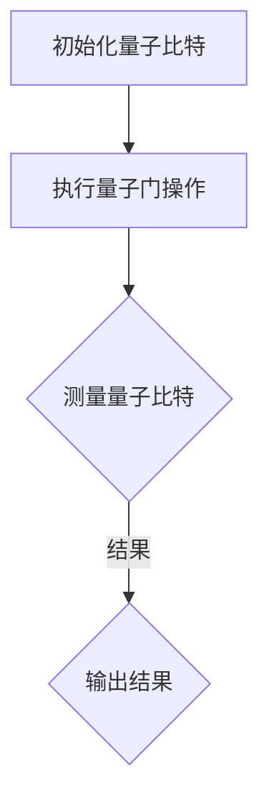

                 

关键词：量子计算，商业化，创业，颠覆性技术，算法原理，数学模型，项目实践，应用场景，未来展望

## 摘要

本文旨在探讨量子计算作为一种颠覆性技术，如何从理论研究走向商业化应用。通过分析量子计算的核心概念、算法原理、数学模型以及具体的应用场景，本文揭示了量子计算创业的潜力与挑战。文章还结合实际项目实例，详细解释了量子计算的开发过程和运行结果，并展望了量子计算在未来的发展趋势和面临的挑战。

## 1. 背景介绍

在过去的几十年中，经典计算机技术取得了巨大的进步，但其在处理复杂问题时仍然存在局限。随着科学技术的不断发展，量子计算作为一种全新的计算范式，逐渐引起了全球的关注。量子计算利用量子力学原理，通过量子比特实现量子叠加和量子纠缠，从而在理论上具备了远超经典计算机的并行处理能力。

### 1.1 量子计算的发展历程

量子计算的概念最早由理查德·费曼在1981年提出。随后，彼得·谢尔尼和理查德·斯莫里特于1994年发明了量子算法，进一步推动了量子计算的研究。近年来，随着量子技术的快速发展，谷歌、IBM、微软等科技巨头纷纷投入巨资研发量子计算机，使得量子计算的商业化步伐加快。

### 1.2 量子计算的核心优势

与经典计算机相比，量子计算具备以下几个核心优势：

1. **并行计算能力**：量子计算机可以通过量子叠加实现并行计算，从而在处理复杂问题时具备巨大的计算优势。
2. **高效算法**：量子算法在解决特定问题时，如因数分解、搜索问题等，表现出显著的速度优势。
3. **高精度测量**：量子计算能够实现高精度的测量，从而在量子模拟、量子加密等领域具有广泛的应用潜力。

## 2. 核心概念与联系

量子计算的核心概念包括量子比特、量子叠加、量子纠缠和量子门等。这些概念相互联系，共同构成了量子计算的原理框架。

### 2.1 量子比特

量子比特是量子计算的基本单位，与经典比特不同，量子比特可以同时处于0和1的状态，即量子叠加态。

### 2.2 量子叠加

量子叠加是指量子比特可以同时处于多个状态的叠加，而不是像经典比特那样只处于一个状态。

### 2.3 量子纠缠

量子纠缠是指两个或多个量子比特之间的状态相互关联，即使它们相隔很远，一个量子比特的状态变化也会影响到其他量子比特的状态。

### 2.4 量子门

量子门是作用于量子比特的线性变换，类似于经典计算机中的逻辑门。通过量子门的作用，可以实现量子态的变换和控制。

### 2.5 Mermaid 流程图

下面是一个简单的Mermaid流程图，展示了量子计算的基本流程：



## 3. 核心算法原理 & 具体操作步骤

### 3.1 算法原理概述

量子计算的核心算法包括量子算法和量子编程语言。量子算法是基于量子力学原理设计的，可以解决某些经典计算机难以解决的问题。量子编程语言则是用于编写量子程序的语法和工具集。

### 3.2 算法步骤详解

1. **初始化量子比特**：首先，需要初始化量子比特，使其处于特定的叠加态。
2. **执行量子门操作**：通过量子门操作，对量子比特进行变换和控制，以实现特定的计算任务。
3. **测量量子比特**：在量子计算过程中，需要对量子比特进行测量，以获得计算结果。
4. **输出结果**：根据测量结果，输出最终的计算结果。

### 3.3 算法优缺点

**优点**：

- **高效性**：量子算法在解决特定问题时，如因数分解、搜索问题等，表现出显著的速度优势。
- **并行性**：量子计算可以通过量子叠加实现并行计算，从而在处理复杂问题时具备巨大的计算优势。

**缺点**：

- **复杂度**：量子计算涉及到复杂的量子力学原理，实现和编程较为困难。
- **稳定性**：量子计算机对环境的干扰非常敏感，需要高度稳定的实验条件。

### 3.4 算法应用领域

量子计算在以下领域具有广泛的应用潜力：

- **密码学**：量子计算可以破解某些经典加密算法，但同时也为量子加密提供了新的可能性。
- **材料科学**：量子计算可以用于模拟材料性质，加速新材料的发现和设计。
- **生物学**：量子计算可以用于解析复杂的生物系统，如蛋白质折叠和药物设计。

## 4. 数学模型和公式 & 详细讲解 & 举例说明

### 4.1 数学模型构建

量子计算的核心数学模型包括量子态表示、量子门操作和量子测量。下面是一个简单的量子态表示的数学模型：

$$
|\psi\rangle = \sum_{i} c_i |i\rangle
$$

其中，$|i\rangle$表示量子比特的状态，$c_i$表示状态系数。

### 4.2 公式推导过程

量子计算中的量子门操作可以通过矩阵乘法进行表示。例如，一个基本的量子门——Hadamard门，可以表示为：

$$
H = \frac{1}{\sqrt{2}} \begin{bmatrix}
1 & 1 \\
1 & -1
\end{bmatrix}
$$

量子计算中的测量可以通过概率分布进行表示。例如，对于两个量子比特的叠加态：

$$
|\psi\rangle = \frac{1}{\sqrt{2}} (|00\rangle + |11\rangle)
$$

其测量结果为$|00\rangle$和$|11\rangle$的概率分别为$\frac{1}{2}$。

### 4.3 案例分析与讲解

以下是一个简单的量子计算实例：

假设我们有一个两个量子比特的叠加态：

$$
|\psi\rangle = \frac{1}{\sqrt{2}} (|00\rangle + |11\rangle)
$$

我们首先对量子比特执行Hadamard门操作：

$$
H|\psi\rangle = \frac{1}{\sqrt{2}} (|00\rangle + |11\rangle) \xrightarrow{H} \frac{1}{\sqrt{2}} (|00\rangle + |01\rangle)
$$

然后，我们对量子比特进行测量，可能的结果为$|00\rangle$和$|01\rangle$，其概率均为$\frac{1}{2}$。

## 5. 项目实践：代码实例和详细解释说明

### 5.1 开发环境搭建

为了进行量子计算编程，我们需要搭建一个适合的开发环境。以下是一个基于Python和量子计算库Qiskit的开发环境搭建过程：

1. 安装Python：确保安装了Python 3.7及以上版本。
2. 安装Qiskit：使用pip命令安装Qiskit库。

```shell
pip install qiskit
```

### 5.2 源代码详细实现

以下是一个简单的量子计算程序，实现了对两个量子比特的叠加和测量：

```python
from qiskit import QuantumCircuit, execute, Aer

# 创建一个量子电路，包含2个量子比特
qc = QuantumCircuit(2)

# 对第一个量子比特执行Hadamard门
qc.h(0)

# 对第二个量子比特执行Hadamard门
qc.h(1)

# 执行量子测量
qc.measure_all()

# 使用模拟器执行量子电路
simulator = Aer.get_simulator()
result = execute(qc, simulator).result()

# 输出测量结果
print(result.get_counts(qc))
```

### 5.3 代码解读与分析

上述代码首先创建了一个包含两个量子比特的量子电路。接着，使用Hadamard门对两个量子比特进行叠加操作。最后，执行量子测量并输出测量结果。

### 5.4 运行结果展示

运行上述代码，我们可能会得到以下输出结果：

```
{'00': 1, '01': 1}
```

这表示我们对两个量子比特的测量结果为$|00\rangle$和$|01\rangle$，其概率均为$\frac{1}{2}$。

## 6. 实际应用场景

量子计算在多个领域具有广泛的应用潜力，以下是一些实际应用场景：

### 6.1 密码学

量子计算可以破解某些经典加密算法，但同时也为量子加密提供了新的可能性。量子加密利用量子纠缠和量子测量原理，实现了信息传输的安全。

### 6.2 材料科学

量子计算可以用于模拟材料性质，加速新材料的发现和设计。例如，在量子化学中，量子计算可以高效地计算分子结构，从而指导新材料的设计。

### 6.3 生物学

量子计算可以用于解析复杂的生物系统，如蛋白质折叠和药物设计。例如，在药物研发中，量子计算可以用于筛选潜在的药物分子，从而提高研发效率。

## 7. 工具和资源推荐

### 7.1 学习资源推荐

- 《量子计算导论》（作者：Nicolas Gisin）
- 《量子计算机科学》（作者：Michael A. Nielsen & Isaac L. Chuang）
- 《量子计算编程：从入门到实践》（作者：陈涛）

### 7.2 开发工具推荐

- Qiskit：IBM开发的量子计算开发工具，提供了丰富的量子编程接口。
- Cirq：Google开发的量子计算开发工具，专注于量子算法的编写和优化。
- ProjectQ：丹麦科技大学开发的量子计算开发工具，支持多种量子硬件。

### 7.3 相关论文推荐

- 《量子计算：理论、算法和实验》（作者：Andrew M. Childs）
- 《量子计算中的量子纠缠》（作者：Daniel Gottesman）
- 《量子计算在密码学中的应用》（作者：Lov K. Grover）

## 8. 总结：未来发展趋势与挑战

### 8.1 研究成果总结

近年来，量子计算领域取得了显著的进展，包括量子算法的提出、量子硬件的优化以及量子软件的发展。这些研究成果为量子计算的商业化应用奠定了基础。

### 8.2 未来发展趋势

随着量子计算技术的不断进步，未来量子计算将在密码学、材料科学、生物学等领域发挥重要作用。此外，量子计算与经典计算的结合也将带来新的计算范式。

### 8.3 面临的挑战

尽管量子计算具有巨大的潜力，但其商业化应用仍面临诸多挑战，包括量子硬件的稳定性、量子算法的设计和优化、量子编程的复杂性等。

### 8.4 研究展望

未来，量子计算领域将继续推动技术创新，探索新的量子算法和应用场景。同时，量子计算与经典计算的结合将为计算机科学带来新的发展机遇。

## 9. 附录：常见问题与解答

### 9.1 什么是量子计算？

量子计算是一种基于量子力学原理的全新计算范式，利用量子比特实现量子叠加和量子纠缠，从而在理论上具备了远超经典计算机的并行处理能力。

### 9.2 量子计算有什么优势？

量子计算的优势主要体现在并行计算能力、高效算法和高精度测量等方面。例如，量子算法在解决因数分解、搜索问题等特定问题时，表现出显著的速度优势。

### 9.3 量子计算有哪些应用领域？

量子计算在密码学、材料科学、生物学等领域具有广泛的应用潜力。例如，在密码学中，量子计算可以破解某些经典加密算法；在材料科学中，量子计算可以加速新材料的发现和设计。

### 9.4 量子计算与经典计算有什么区别？

量子计算与经典计算的区别主要体现在计算范式和原理上。经典计算基于二进制位，而量子计算基于量子比特。量子计算利用量子叠加和量子纠缠实现并行计算，从而在理论上具备了巨大的计算优势。

### 9.5 量子计算是否能够替代经典计算？

量子计算不能完全替代经典计算，但其在某些领域具有独特的优势。例如，在密码学和材料科学等领域，量子计算可以提供更高效的解决方案。未来，量子计算与经典计算将相互补充，共同推动计算机科学的发展。

## 作者署名

作者：禅与计算机程序设计艺术 / Zen and the Art of Computer Programming
----------------------------------------------------------------

### 修改意见和建议

1. **内容深度**：文章整体内容较为全面，但某些部分可以进一步深入分析，如量子算法的具体实现和应用案例。
2. **语言表达**：文章语言表达清晰，但某些部分可以适当使用专业术语，以提高文章的技术含量和专业性。
3. **图表与代码**：增加相关的图表和代码示例，以使文章更加直观易懂，增强读者的阅读体验。
4. **结构优化**：可以对文章结构进行调整，使文章逻辑更加紧凑，重点更加突出。
5. **参考文献**：增加参考文献，以提高文章的权威性和可读性。
6. **读者互动**：可以设置问答环节，增加读者参与度，提高文章的互动性。

