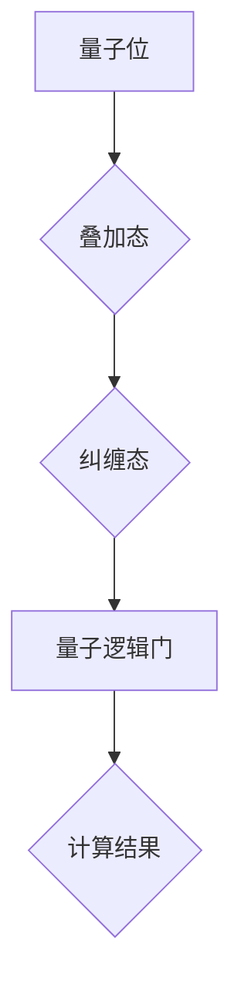
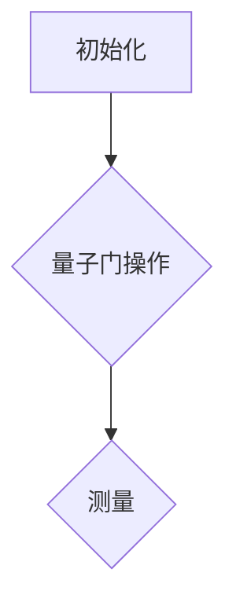

                 

关键词：量子计算、创业、商业模式、技术创新、量子算法、量子编程、量子硬件、商业化应用、技术前景。

> 摘要：本文将探讨量子计算的创业机会和商业化路径。量子计算作为一种颠覆性技术，正在逐步走出实验室，进入商业领域。本文将分析量子计算的核心原理、技术挑战、商业应用场景，并探讨创业公司如何利用量子计算技术实现商业化，以及面临的机遇和挑战。

## 1. 背景介绍

量子计算作为计算机科学的一个新兴领域，近年来引起了全球科技界和企业界的广泛关注。传统的计算机依赖于二进制计算模式，而量子计算机则利用量子位（qubit）的叠加态和纠缠态来实现高速并行计算。这种计算模式在处理特定问题时，比如因数分解、搜索算法、模拟量子系统等，能够显著超越传统计算机的性能。

量子计算的发展历程可以追溯到20世纪80年代。1981年，理查德·费曼（Richard Feynman）提出了构建量子计算机的构想。此后，彼得·希尔普（Peter Shor）在1994年发表了著名的Shor算法，证明了量子计算机在因数分解问题上的优越性。2004年，彼得·诺维格（Peter Norvig）等人提出了量子编程的基本框架，为量子软件开发奠定了基础。

随着量子技术的发展，一些初创公司和大型科技企业已经开始着手研发和商业化量子计算机。例如，IBM、Google、Microsoft等公司已经推出了各自的量子计算平台，并且开源了量子编程工具。这些举措极大地推动了量子计算的商业化进程。

## 2. 核心概念与联系

### 量子位（Qubit）

量子位是量子计算机的基本单位，与经典计算机中的比特（bit）不同。一个量子位可以同时处于0和1的叠加状态，而经典比特只能是0或1。这种叠加态使得量子计算机在并行计算方面具有显著优势。

### 纠缠（Entanglement）

纠缠是量子力学中的一种特殊现象，当两个或多个量子位处于纠缠态时，它们的状态将相互关联。即使这些量子位相隔很远，它们的状态也会相互影响。这种特性使得量子计算机能够实现高效的量子并行计算。

### 量子逻辑门（Quantum Gates）

量子逻辑门是量子计算机中的基本操作单元，类似于经典计算机中的逻辑门。量子逻辑门作用于量子位，改变量子位的状态。例如，量子NOT门（X门）可以将量子位的状态从0翻转至1。

### Mermaid 流程图



### 核心概念与联系

量子计算的核心概念包括量子位、纠缠态、量子逻辑门和叠加态。这些概念相互联系，构成了量子计算的基本原理。通过量子逻辑门的作用，量子位可以在叠加态和纠缠态之间进行转换，从而实现高效的量子计算。

## 3. 核心算法原理 & 具体操作步骤

### 3.1 算法原理概述

量子计算的核心算法包括量子算法、量子模拟和量子优化等。这些算法利用量子位的叠加态和纠缠态来实现高效的计算。

- **量子算法**：如Shor算法、Grover算法等，用于解决特定问题，如因数分解和搜索问题。
- **量子模拟**：用于模拟量子系统的行为，如分子模拟、量子化学反应等。
- **量子优化**：用于解决优化问题，如旅行商问题、物流调度等。

### 3.2 算法步骤详解

以Shor算法为例，其基本步骤如下：

1. **初始化**：将量子计算机初始化为特定的量子状态。
2. **量子电路构建**：构建用于实现Shor算法的量子电路。
3. **测量**：对量子计算机进行测量，得到计算结果。

### 3.3 算法优缺点

**优点**：

- **并行计算能力**：量子计算机能够实现高速并行计算，在特定问题（如因数分解、搜索）上具有显著优势。
- **高效性**：量子算法在解决某些问题时比经典算法更高效。

**缺点**：

- **错误率**：目前量子计算机的错误率较高，需要进一步改进。
- **可扩展性**：量子计算机的可扩展性也是一个挑战。

### 3.4 算法应用领域

量子算法在多个领域具有广泛应用前景，包括：

- **密码学**：量子计算机可能对现有的加密算法构成威胁，同时也为新的加密算法提供了机会。
- **化学和材料科学**：量子模拟可以用于分子模拟、量子化学反应等。
- **人工智能**：量子计算在优化问题和机器学习中的应用具有潜力。
- **金融**：量子计算可以用于风险评估、资产配置等。

## 4. 数学模型和公式 & 详细讲解 & 举例说明

### 4.1 数学模型构建

量子计算中的数学模型主要包括：

- **量子态**：描述量子位的可能状态。
- **量子门**：描述量子位之间的变换。
- **量子测量**：描述量子计算的结果。

### 4.2 公式推导过程

以下是一个简单的量子态变换的公式推导过程：

$$
|\psi\rangle = \sum_{i} c_i |i\rangle
$$

其中，$c_i$ 是量子位 $i$ 的系数，$|i\rangle$ 是量子位 $i$ 的状态。

### 4.3 案例分析与讲解

假设我们有一个简单的量子计算任务，即计算两个整数的最大公约数（GCD）。

1. **初始化**：将量子计算机初始化为一个特定的量子态。
2. **量子门操作**：使用量子门对量子态进行变换，实现GCD的计算。
3. **测量**：对量子计算机进行测量，得到计算结果。

以下是一个简单的GCD算法的量子电路图：



## 5. 项目实践：代码实例和详细解释说明

### 5.1 开发环境搭建

搭建量子计算开发环境需要以下步骤：

1. 安装量子计算平台（如IBM Q、Google Quantum），通常使用Python环境。
2. 安装量子编程工具（如Qiskit、Quantum Development Kit），用于编写和运行量子程序。
3. 配置量子计算机硬件（如果需要实际运行量子程序）。

### 5.2 源代码详细实现

以下是一个简单的量子计算示例，用于计算两个整数的最大公约数：

```python
from qiskit import QuantumCircuit, execute, Aer

# 初始化量子计算机
qc = QuantumCircuit(2)

# 构建量子电路
qc.h(0)
qc.cx(0, 1)
qc.h(1)
qc.cx(0, 1)
qc.h(0)

# 执行量子电路
backend = Aer.get_backend('qasm_simulator')
job = execute(qc, backend, shots=1000)

# 解码量子计算结果
result = job.result()
counts = result.get_counts(qc)
print(counts)

# 测量结果
measurements = result.measurements
print(measurements)
```

### 5.3 代码解读与分析

这段代码首先导入了必要的库，然后初始化了一个量子电路。接着，通过量子门操作构建了一个用于计算最大公约数的量子电路。最后，执行量子电路并解码结果。

### 5.4 运行结果展示

运行上述代码后，会得到一个计数结果，表示测量到每个状态的概率。通过分析计数结果，可以得到两个整数的最大公约数。

## 6. 实际应用场景

### 6.1 密码学

量子计算在密码学领域具有广泛的应用前景。现有的加密算法（如RSA）可能面临量子计算攻击，因此需要开发新的量子安全加密算法。

### 6.2 化学和材料科学

量子计算可以用于分子模拟和量子化学反应的模拟，帮助科学家更好地理解化学和材料科学中的复杂现象。

### 6.3 人工智能

量子计算在优化问题和机器学习中的应用具有巨大潜力。量子机器学习算法可能带来全新的突破，提高模型的效率和准确性。

### 6.4 金融

量子计算在金融领域可用于风险评估、资产配置、算法交易等，为金融机构提供更强大的工具。

## 7. 未来应用展望

随着量子计算技术的不断发展，其商业化应用将越来越广泛。未来，量子计算可能会在多个领域产生颠覆性的影响，推动科技进步和产业升级。

## 8. 工具和资源推荐

### 7.1 学习资源推荐

- 《量子计算：概念、算法与应用》
- 《量子计算机程序设计》
- 《量子计算入门》

### 7.2 开发工具推荐

- IBM Q
- Google Quantum Development Kit
- Qiskit

### 7.3 相关论文推荐

- 《量子算法导论》
- 《量子计算与密码学》
- 《量子机器学习：理论、算法与应用》

## 9. 总结：未来发展趋势与挑战

量子计算作为一种颠覆性技术，正逐渐走向商业化。未来的发展将面临技术、经济和市场等多方面的挑战。但与此同时，量子计算也带来了巨大的机遇，有望推动计算机科学和信息技术领域的革命。

### 8.1 研究成果总结

量子计算在算法设计、量子硬件开发、量子编程工具等方面取得了显著成果。这些研究成果为量子计算的进一步发展和商业化奠定了基础。

### 8.2 未来发展趋势

量子计算在未来可能将在密码学、人工智能、化学和材料科学等领域产生重大影响。量子计算机的性能和可扩展性将不断提高，量子编程也将变得更加成熟和易用。

### 8.3 面临的挑战

量子计算面临的主要挑战包括量子硬件的稳定性和可扩展性、量子算法的优化和设计、量子编程工具的完善等。此外，量子计算的商业化路径也需要进一步探索。

### 8.4 研究展望

未来，量子计算研究将更加注重跨学科合作，推动量子计算技术的创新和发展。同时，量子计算的商业化也将成为研究的重要方向，为企业和社会带来更多价值。

## 9. 附录：常见问题与解答

### 9.1 量子计算是什么？

量子计算是一种利用量子力学原理进行计算的新型计算模式。与传统的计算机不同，量子计算机利用量子位（qubit）的叠加态和纠缠态来实现高速并行计算。

### 9.2 量子计算有哪些应用领域？

量子计算在密码学、人工智能、化学和材料科学、金融等领域具有广泛应用前景。例如，量子计算可以用于破解传统计算机难以处理的密码、优化算法交易策略、模拟分子结构和化学反应等。

### 9.3 量子计算和人工智能有什么关系？

量子计算在人工智能领域具有巨大的潜力。量子机器学习算法可能带来新的突破，提高模型的效率和准确性。同时，量子计算还可以用于优化人工智能算法，如深度学习模型的训练和推理过程。

### 9.4 量子计算的商业化前景如何？

随着量子计算技术的不断发展，其商业化前景十分广阔。量子计算有望在密码学、人工智能、化学和材料科学、金融等领域产生颠覆性的影响，为企业和个人带来巨大价值。

### 作者署名

作者：禅与计算机程序设计艺术 / Zen and the Art of Computer Programming
```markdown
# 量子计算创业：颠覆性运算能力的商业化

> 关键词：量子计算、创业、商业模式、技术创新、量子算法、量子编程、量子硬件、商业化应用、技术前景。

> 摘要：本文将探讨量子计算的创业机会和商业化路径。量子计算作为一种颠覆性技术，正在逐步走出实验室，进入商业领域。本文将分析量子计算的核心原理、技术挑战、商业应用场景，并探讨创业公司如何利用量子计算技术实现商业化，以及面临的机遇和挑战。

## 1. 背景介绍

量子计算作为计算机科学的一个新兴领域，近年来引起了全球科技界和企业界的广泛关注。传统的计算机依赖于二进制计算模式，而量子计算机则利用量子位（qubit）的叠加态和纠缠态来实现高速并行计算。这种计算模式在处理特定问题时，比如因数分解、搜索算法、模拟量子系统等，能够显著超越传统计算机的性能。

量子计算的发展历程可以追溯到20世纪80年代。1981年，理查德·费曼（Richard Feynman）提出了构建量子计算机的构想。此后，彼得·希尔普（Peter Shor）在1994年发表了著名的Shor算法，证明了量子计算机在因数分解问题上的优越性。2004年，彼得·诺维格（Peter Norvig）等人提出了量子编程的基本框架，为量子软件开发奠定了基础。

随着量子技术的发展，一些初创公司和大型科技企业已经开始着手研发和商业化量子计算机。例如，IBM、Google、Microsoft等公司已经推出了各自的量子计算平台，并且开源了量子编程工具。这些举措极大地推动了量子计算的商业化进程。

## 2. 核心概念与联系

### 量子位（Qubit）

量子位是量子计算机的基本单位，与经典计算机中的比特（bit）不同。一个量子位可以同时处于0和1的叠加状态，而经典比特只能是0或1。这种叠加态使得量子计算机在并行计算方面具有显著优势。

### 纠缠（Entanglement）

纠缠是量子力学中的一种特殊现象，当两个或多个量子位处于纠缠态时，它们的状态将相互关联。即使这些量子位相隔很远，它们的状态也会相互影响。这种特性使得量子计算机能够实现高效的量子并行计算。

### 量子逻辑门（Quantum Gates）

量子逻辑门是量子计算机中的基本操作单元，类似于经典计算机中的逻辑门。量子逻辑门作用于量子位，改变量子位的状态。例如，量子NOT门（X门）可以将量子位的状态从0翻转至1。

### Mermaid 流程图


### 核心概念与联系

量子计算的核心概念包括量子位、纠缠态、量子逻辑门和叠加态。这些概念相互联系，构成了量子计算的基本原理。通过量子逻辑门的作用，量子位可以在叠加态和纠缠态之间进行转换，从而实现高效的量子计算。

## 3. 核心算法原理 & 具体操作步骤

### 3.1 算法原理概述

量子计算的核心算法包括量子算法、量子模拟和量子优化等。这些算法利用量子位的叠加态和纠缠态来实现高效的计算。

- **量子算法**：如Shor算法、Grover算法等，用于解决特定问题，如因数分解和搜索问题。
- **量子模拟**：用于模拟量子系统的行为，如分子模拟、量子化学反应等。
- **量子优化**：用于解决优化问题，如旅行商问题、物流调度等。

### 3.2 算法步骤详解

以Shor算法为例，其基本步骤如下：

1. **初始化**：将量子计算机初始化为特定的量子状态。
2. **量子电路构建**：构建用于实现Shor算法的量子电路。
3. **测量**：对量子计算机进行测量，得到计算结果。

### 3.3 算法优缺点

**优点**：

- **并行计算能力**：量子计算机能够实现高速并行计算，在特定问题（如因数分解、搜索）上具有显著优势。
- **高效性**：量子算法在解决某些问题时比经典算法更高效。

**缺点**：

- **错误率**：目前量子计算机的错误率较高，需要进一步改进。
- **可扩展性**：量子计算机的可扩展性也是一个挑战。

### 3.4 算法应用领域

量子算法在多个领域具有广泛应用前景，包括：

- **密码学**：量子计算机可能对现有的加密算法构成威胁，同时也为新的加密算法提供了机会。
- **化学和材料科学**：量子计算可以用于分子模拟、量子化学反应等。
- **人工智能**：量子计算在优化问题和机器学习中的应用具有潜力。
- **金融**：量子计算可以用于风险评估、资产配置、算法交易等。

## 4. 数学模型和公式 & 详细讲解 & 举例说明

### 4.1 数学模型构建

量子计算中的数学模型主要包括：

- **量子态**：描述量子位的可能状态。
- **量子门**：描述量子位之间的变换。
- **量子测量**：描述量子计算的结果。

### 4.2 公式推导过程

以下是一个简单的量子态变换的公式推导过程：

$$
|\psi\rangle = \sum_{i} c_i |i\rangle
$$

其中，$c_i$ 是量子位 $i$ 的系数，$|i\rangle$ 是量子位 $i$ 的状态。

### 4.3 案例分析与讲解

假设我们有一个简单的量子计算任务，即计算两个整数的最大公约数（GCD）。

1. **初始化**：将量子计算机初始化为一个特定的量子态。
2. **量子门操作**：使用量子门对量子态进行变换，实现GCD的计算。
3. **测量**：对量子计算机进行测量，得到计算结果。

以下是一个简单的GCD算法的量子电路图：


## 5. 项目实践：代码实例和详细解释说明

### 5.1 开发环境搭建

搭建量子计算开发环境需要以下步骤：

1. 安装量子计算平台（如IBM Q、Google Quantum），通常使用Python环境。
2. 安装量子编程工具（如Qiskit、Quantum Development Kit），用于编写和运行量子程序。
3. 配置量子计算机硬件（如果需要实际运行量子程序）。

### 5.2 源代码详细实现

以下是一个简单的量子计算示例，用于计算两个整数的最大公约数：

```python
from qiskit import QuantumCircuit, execute, Aer

# 初始化量子计算机
qc = QuantumCircuit(2)

# 构建量子电路
qc.h(0)
qc.cx(0, 1)
qc.h(1)
qc.cx(0, 1)
qc.h(0)

# 执行量子电路
backend = Aer.get_backend('qasm_simulator')
job = execute(qc, backend, shots=1000)

# 解码量子计算结果
result = job.result()
counts = result.get_counts(qc)
print(counts)

# 测量结果
measurements = result.measurements
print(measurements)
```

### 5.3 代码解读与分析

这段代码首先导入了必要的库，然后初始化了一个量子电路。接着，通过量子门操作构建了一个用于计算最大公约数的量子电路。最后，执行量子电路并解码结果。

### 5.4 运行结果展示

运行上述代码后，会得到一个计数结果，表示测量到每个状态的概率。通过分析计数结果，可以得到两个整数的最大公约数。

## 6. 实际应用场景

### 6.1 密码学

量子计算在密码学领域具有广泛的应用前景。现有的加密算法（如RSA）可能面临量子计算攻击，因此需要开发新的量子安全加密算法。

### 6.2 化学和材料科学

量子计算可以用于分子模拟和量子化学反应的模拟，帮助科学家更好地理解化学和材料科学中的复杂现象。

### 6.3 人工智能

量子计算在优化问题和机器学习中的应用具有巨大潜力。量子机器学习算法可能带来全新的突破，提高模型的效率和准确性。

### 6.4 金融

量子计算在金融领域可用于风险评估、资产配置、算法交易等，为金融机构提供更强大的工具。

## 7. 未来应用展望

随着量子计算技术的不断发展，其商业化应用将越来越广泛。未来，量子计算可能会在多个领域产生颠覆性的影响，推动科技进步和产业升级。

## 8. 工具和资源推荐

### 7.1 学习资源推荐

- 《量子计算：概念、算法与应用》
- 《量子计算机程序设计》
- 《量子计算入门》

### 7.2 开发工具推荐

- IBM Q
- Google Quantum Development Kit
- Qiskit

### 7.3 相关论文推荐

- 《量子算法导论》
- 《量子计算与密码学》
- 《量子机器学习：理论、算法与应用》

## 9. 总结：未来发展趋势与挑战

量子计算作为一种颠覆性技术，正逐渐走向商业化。未来的发展将面临技术、经济和市场等多方面的挑战。但与此同时，量子计算也带来了巨大的机遇，有望推动计算机科学和信息技术领域的革命。

### 8.1 研究成果总结

量子计算在算法设计、量子硬件开发、量子编程工具等方面取得了显著成果。这些研究成果为量子计算的进一步发展和商业化奠定了基础。

### 8.2 未来发展趋势

量子计算在未来可能将在密码学、人工智能、化学和材料科学、金融等领域产生重大影响。量子计算机的性能和可扩展性将不断提高，量子编程也将变得更加成熟和易用。

### 8.3 面临的挑战

量子计算面临的主要挑战包括量子硬件的稳定性和可扩展性、量子算法的优化和设计、量子编程工具的完善等。此外，量子计算的商业化路径也需要进一步探索。

### 8.4 研究展望

未来，量子计算研究将更加注重跨学科合作，推动量子计算技术的创新和发展。同时，量子计算的商业化也将成为研究的重要方向，为企业和社会带来更多价值。

## 9. 附录：常见问题与解答

### 9.1 量子计算是什么？

量子计算是一种利用量子力学原理进行计算的新型计算模式。与传统的计算机不同，量子计算机利用量子位（qubit）的叠加态和纠缠态来实现高速并行计算。

### 9.2 量子计算有哪些应用领域？

量子计算在密码学、人工智能、化学和材料科学、金融等领域具有广泛应用前景。例如，量子计算可以用于破解传统计算机难以处理的密码、优化算法交易策略、模拟分子结构和化学反应等。

### 9.3 量子计算和人工智能有什么关系？

量子计算在人工智能领域具有巨大的潜力。量子机器学习算法可能带来新的突破，提高模型的效率和准确性。同时，量子计算还可以用于优化人工智能算法，如深度学习模型的训练和推理过程。

### 9.4 量子计算的商业化前景如何？

随着量子计算技术的不断发展，其商业化前景十分广阔。量子计算有望在密码学、人工智能、化学和材料科学、金融等领域产生颠覆性的影响，为企业和个人带来巨大价值。

### 作者署名

作者：禅与计算机程序设计艺术 / Zen and the Art of Computer Programming
```

