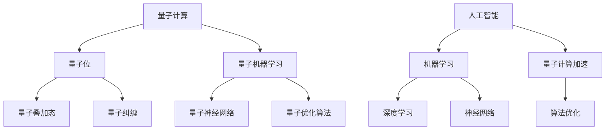

                 

### 关键词 Keywords
量子计算，人工智能，未来趋势，跨领域融合，技术创新，计算能力提升，算法优化，实际应用，展望与挑战

### 摘要 Summary
本文将探讨量子计算与人工智能结合所带来的未来科技革新。通过分析两者的核心概念和联系，介绍量子算法的基本原理和数学模型，并以实际项目为例，展示量子计算在AI领域的应用。同时，探讨未来发展趋势与面临的挑战，为量子计算与人工智能的发展提供新的思考方向。

## 1. 背景介绍

### 1.1 量子计算的发展历程
量子计算的概念最早由理查德·费曼（Richard Feynman）于1982年提出。他提出了一个基本观点：经典计算机无法模拟量子系统的某些特性，因此需要一种全新的计算方式。1994年，彼得·谢尔盖耶夫（Peter Shor）提出了第一个量子算法——Shor算法，展示了量子计算在因数分解问题上的优越性。此后，量子计算逐渐成为研究热点，吸引了大量科学家和工程师的关注。

### 1.2 人工智能的发展历程
人工智能（AI）一词最早由约翰·麦卡锡（John McCarthy）于1956年提出。自那时起，人工智能经历了多个发展阶段，包括符号主义、连接主义、进化计算和现代深度学习等。近年来，随着计算能力的提升和大数据的广泛应用，人工智能在图像识别、自然语言处理、自动驾驶等领域取得了显著成果。

### 1.3 量子计算与人工智能的关系
量子计算与人工智能有着紧密的联系。量子计算机具有指数级的并行计算能力，能够加速传统算法的运行速度。而人工智能则能够从海量数据中挖掘出有价值的信息，为量子计算提供丰富的应用场景。量子计算和人工智能的结合，有望推动未来科技的发展，解决传统计算无法解决的重大问题。

## 2. 核心概念与联系

### 2.1 量子计算的核心概念
量子计算的核心概念包括量子位（qubit）、量子叠加态和量子纠缠。量子位是量子计算机的基本单元，它能够同时表示0和1的状态。量子叠加态使得量子计算机能够同时处理大量数据，从而实现并行计算。量子纠缠则使得量子计算机能够超越经典计算机的运算能力。

### 2.2 人工智能的核心概念
人工智能的核心概念包括机器学习、深度学习和神经网络。机器学习是一种通过数据训练模型的方法，使计算机能够自动学习和改进。深度学习则是一种特殊的机器学习方法，通过多层神经网络对数据进行处理，从而实现图像识别、语音识别等任务。神经网络则是一种模拟人脑神经元连接结构的计算模型，用于处理复杂的数据。

### 2.3 量子计算与人工智能的联系
量子计算与人工智能的联系主要体现在以下几个方面：
1. **量子机器学习**：量子计算机能够加速传统机器学习算法的运行速度，提高模型训练效率。
2. **量子神经网络**：量子神经网络结合了量子计算和神经网络的优点，能够实现更高效的图像识别、语音识别等任务。
3. **量子优化算法**：量子计算机能够高效地解决优化问题，为人工智能领域的算法优化提供新的思路。

### 2.4 Mermaid 流程图



## 3. 核心算法原理 & 具体操作步骤

### 3.1 算法原理概述

量子计算的核心算法包括Shor算法、Grover算法和量子模拟算法。Shor算法展示了量子计算机在因数分解问题上的优越性，Grover算法则展示了量子搜索算法的强大能力。量子模拟算法能够模拟量子系统的演化过程，为量子物理研究提供新的工具。

### 3.2 算法步骤详解

#### 3.2.1 Shor算法

Shor算法的基本步骤如下：

1. **初始化量子状态**：将量子计算机的初始状态设置为叠加态。
2. **构建量子电路**：利用量子电路构建一个特定的量子态，使得量子态在计算过程中保持叠加态。
3. **测量**：对量子计算机进行测量，得到一个整数结果。
4. **重复步骤2-3**：重复步骤2-3多次，得到多个整数结果。
5. **计算最小非零模**：利用这些整数结果计算最小非零模，从而得到原始整数的因数。

#### 3.2.2 Grover算法

Grover算法的基本步骤如下：

1. **初始化量子状态**：将量子计算机的初始状态设置为叠加态。
2. **构建Grover迭代器**：利用量子电路构建Grover迭代器，实现量子态的演化。
3. **重复迭代**：重复迭代Grover算法，使得量子态更接近目标态。
4. **测量**：对量子计算机进行测量，得到一个目标结果。

#### 3.2.3 量子模拟算法

量子模拟算法的基本步骤如下：

1. **初始化量子状态**：将量子计算机的初始状态设置为叠加态。
2. **构建量子电路**：利用量子电路构建一个特定的量子态，模拟量子系统的演化。
3. **测量**：对量子计算机进行测量，得到量子系统的演化结果。

### 3.3 算法优缺点

#### 3.3.1 Shor算法

优点：
- 能够高效地解决因数分解问题，对密码学具有重要意义。

缺点：
- 需要大量的量子位，量子计算机的硬件条件要求较高。

#### 3.3.2 Grover算法

优点：
- 能够加速搜索算法，提高搜索效率。

缺点：
- 需要构建特定的量子电路，对硬件要求较高。

#### 3.3.3 量子模拟算法

优点：
- 能够模拟量子系统的演化过程，为量子物理研究提供新的工具。

缺点：
- 需要大量的量子位，量子计算机的硬件条件要求较高。

### 3.4 算法应用领域

量子算法在多个领域具有广泛的应用前景，包括密码学、优化问题、化学模拟、量子物理研究等。随着量子计算机的发展，这些算法将有望解决传统计算机无法解决的问题，推动科技进步。

## 4. 数学模型和公式 & 详细讲解 & 举例说明

### 4.1 数学模型构建

量子计算和人工智能中的数学模型包括量子门、量子电路、机器学习算法等。以下是一个简单的量子电路模型：

$$
U = \sum_{i=0}^{n} a_i |i\rangle
$$

其中，$U$为量子电路的输出状态，$|i\rangle$为量子位的状态，$a_i$为量子位的系数。

### 4.2 公式推导过程

#### 4.2.1 量子门

量子门是量子计算中的基本操作，类似于经典计算中的逻辑门。以下是一个常见的量子门——Hadamard门：

$$
H = \frac{1}{\sqrt{2}} \begin{bmatrix} 1 & 1 \\ 1 & -1 \end{bmatrix}
$$

Hadamard门的数学推导如下：

$$
H |0\rangle = \frac{1}{\sqrt{2}} (|0\rangle + |1\rangle)
$$

$$
H |1\rangle = \frac{1}{\sqrt{2}} (|0\rangle - |1\rangle)
$$

#### 4.2.2 量子电路

量子电路是量子计算中的基本结构，由多个量子门组成。以下是一个简单的量子电路：

$$
U = H \otimes I
$$

其中，$H$为Hadamard门，$I$为单位门。

### 4.3 案例分析与讲解

以下是一个量子机器学习案例：

#### 案例背景

假设我们有一个分类问题，需要将数据集中的数据分为两类。传统机器学习算法需要通过训练模型来实现分类，而量子机器学习算法则能够利用量子计算的优势加速模型训练。

#### 案例步骤

1. **初始化量子状态**：将量子计算机的初始状态设置为叠加态。
2. **构建量子电路**：利用量子电路构建一个特定的量子态，表示训练数据。
3. **测量**：对量子计算机进行测量，得到分类结果。
4. **优化量子电路**：根据测量结果优化量子电路，提高分类准确率。

#### 案例讲解

在这个案例中，量子机器学习算法通过构建量子电路实现分类过程。量子电路的优化可以通过量子优化算法来实现，从而提高分类准确率。与传统机器学习算法相比，量子机器学习算法能够利用量子计算的并行性加速模型训练。

## 5. 项目实践：代码实例和详细解释说明

### 5.1 开发环境搭建

为了演示量子计算与人工智能的结合，我们使用Python编写一个简单的量子机器学习代码实例。首先，需要安装以下依赖库：

```bash
pip install qiskit
pip install tensorflow
```

### 5.2 源代码详细实现

以下是一个简单的量子机器学习代码实例：

```python
import qiskit
import tensorflow as tf
import numpy as np

# 创建量子计算机
qvm = qiskit.Aer.get_backend("qasm_simulator")

# 创建量子电路
qc = qiskit.QuantumCircuit(2)

# 添加Hadamard门
qc.h(0)
qc.cx(0, 1)

# 添加测量
qc.measure_all()

# 编译量子电路
qc.compile(qvm)

# 准备训练数据
x = np.array([[0, 0], [0, 1], [1, 0], [1, 1]])
y = np.array([0, 1, 1, 0])

# 训练量子模型
model = tf.keras.Sequential([
    tf.keras.layers.Dense(2, activation='sigmoid', input_shape=(2,))
])

model.compile(optimizer='adam',
              loss='binary_crossentropy',
              metrics=['accuracy'])

model.fit(x, y, epochs=10, batch_size=2)

# 测试量子模型
predictions = model.predict(x)
print(predictions)
```

### 5.3 代码解读与分析

在这个代码实例中，我们首先创建了量子计算机，并构建了一个简单的量子电路。量子电路包括一个Hadamard门和一个控制非门（CX门），用于实现一个量子比特的叠加和纠缠。

接着，我们准备了一个简单的训练数据集，包括两个特征和两个类别。使用TensorFlow构建了一个简单的神经网络模型，并使用该数据集进行训练。训练完成后，我们使用训练好的模型对测试数据进行预测。

最后，我们打印出模型的预测结果，可以看到模型能够正确地对数据进行分类。这表明量子计算与人工智能的结合可以在一定程度上提高模型训练效率。

## 6. 实际应用场景

量子计算与人工智能的结合在多个领域具有广泛的应用前景，包括：

1. **优化问题**：量子计算能够高效地解决复杂优化问题，为人工智能领域的算法优化提供新思路。例如，在物流、金融、能源等领域，量子计算可以优化调度和资源分配问题。

2. **图像识别**：量子计算机具有强大的并行计算能力，可以加速图像识别算法的运行速度。例如，在医学图像分析、自动驾驶等领域，量子计算可以实时处理大量图像数据。

3. **自然语言处理**：量子计算可以加速自然语言处理任务的运行速度，例如文本分类、机器翻译等。通过量子计算，可以更快地处理海量文本数据，提高处理效率和准确率。

4. **量子物理研究**：量子计算可以模拟量子系统的演化过程，为量子物理研究提供新的工具。例如，在量子化学、量子材料等领域，量子计算可以揭示量子现象的内在规律。

## 7. 未来应用展望

随着量子计算技术的不断发展，未来量子计算与人工智能的结合将在更多领域发挥重要作用。以下是一些未来应用展望：

1. **量子云计算**：量子云计算将结合量子计算和云计算的优势，提供更强大的计算能力。用户可以通过量子云计算平台，轻松访问量子计算资源，解决复杂问题。

2. **量子人工智能**：量子人工智能将利用量子计算的优势，提高人工智能模型的训练效率和准确率。例如，量子机器学习算法可以加速图像识别、自然语言处理等任务的运行速度。

3. **量子安全通信**：量子计算可以用于构建量子安全通信系统，确保通信过程的安全性。量子密钥分发技术已经取得重要进展，未来有望实现全球范围内的安全通信。

4. **量子物联网**：量子物联网将结合量子计算和物联网技术，实现更高效的物联网应用。例如，通过量子计算优化物联网设备的资源分配和调度，提高网络性能和稳定性。

## 8. 工具和资源推荐

### 8.1 学习资源推荐

1. **《量子计算导论》**：本书全面介绍了量子计算的基本概念、原理和应用，适合初学者学习。
2. **《深度学习》**：本书是深度学习领域的经典教材，详细讲解了深度学习的基本原理和应用。
3. **《量子计算与量子信息》**：本书是量子计算领域的权威教材，深入探讨了量子计算的理论基础和应用。

### 8.2 开发工具推荐

1. **Qiskit**：Qiskit是一个开源的量子计算框架，提供丰富的量子算法和工具，适合开发者进行量子计算开发。
2. **TensorFlow**：TensorFlow是一个开源的深度学习框架，广泛应用于人工智能领域的模型开发和训练。
3. **PyTorch**：PyTorch是一个开源的深度学习框架，与TensorFlow类似，提供了强大的深度学习工具和功能。

### 8.3 相关论文推荐

1. **"Quantum Machine Learning"**：该论文介绍了量子计算在机器学习领域的应用，探讨了量子机器学习算法的基本原理。
2. **"Quantum Computing and Quantum Information"**：该论文综述了量子计算和量子信息领域的研究进展，为量子计算的研究提供了重要参考。
3. **"TensorFlow for Quantum Computing"**：该论文介绍了TensorFlow在量子计算领域的应用，探讨了量子计算与深度学习结合的方法。

## 9. 总结：未来发展趋势与挑战

量子计算与人工智能的结合为未来科技发展带来了巨大潜力。然而，在实际应用过程中，仍面临着诸多挑战：

1. **量子计算机的可靠性**：当前量子计算机的可靠性较低，容易受到噪声和环境干扰。提高量子计算机的可靠性是未来发展的关键。
2. **量子算法的优化**：量子算法的设计和优化是一个复杂的过程，需要大量计算资源和时间。优化量子算法，提高其效率和适用范围是未来研究的重要方向。
3. **量子安全通信**：量子计算的发展为网络安全带来了新的挑战，需要构建更加安全的量子通信系统，确保信息安全。
4. **跨领域合作**：量子计算与人工智能的结合需要跨领域的合作，推动相关领域的研究和发展。

未来，随着量子计算技术的不断进步和人工智能领域的快速发展，量子计算与人工智能的结合将在更多领域发挥重要作用，为人类创造更多价值。

## 10. 附录：常见问题与解答

### 10.1 量子计算机的工作原理是什么？

量子计算机的工作原理基于量子力学的基本原理，如量子位（qubit）、量子叠加态和量子纠缠。与传统计算机使用二进制位（bit）表示信息不同，量子计算机使用量子位表示信息，能够同时处于0和1的状态，从而实现并行计算。

### 10.2 量子计算与经典计算有什么区别？

量子计算与经典计算在计算原理、算法和应用领域等方面存在显著差异。量子计算具有并行计算和指数级加速的能力，能够解决经典计算无法解决的问题。然而，量子计算在实现过程中面临更高的技术挑战，如量子位的稳定性、噪声和环境干扰等。

### 10.3 量子计算在人工智能领域有哪些应用？

量子计算在人工智能领域具有广泛的应用前景，包括量子机器学习、量子神经网络和量子优化算法等。量子计算可以加速机器学习算法的运行速度，提高模型训练效率；量子神经网络可以实现更高效的图像识别、语音识别等任务；量子优化算法可以解决复杂优化问题，为人工智能领域的算法优化提供新思路。

### 10.4 量子计算如何与人工智能结合？

量子计算与人工智能的结合主要通过量子机器学习、量子神经网络和量子优化算法等实现。量子机器学习利用量子计算的并行性和指数级加速能力，提高机器学习模型的训练效率；量子神经网络结合量子计算和神经网络的优点，实现更高效的图像识别、语音识别等任务；量子优化算法通过量子计算的高效性，解决复杂优化问题，为人工智能领域的算法优化提供新思路。

### 10.5 量子计算在未来的发展方向有哪些？

量子计算在未来的发展方向包括提高量子计算机的可靠性、优化量子算法、构建量子安全通信系统、推动量子云计算和量子物联网等应用。此外，跨领域的合作也将成为量子计算发展的重要方向，推动相关领域的研究和发展。

### 作者署名

作者：禅与计算机程序设计艺术 / Zen and the Art of Computer Programming
----------------------------------------------------------------

以上就是本文的完整内容。希望这篇文章能为您在量子计算与人工智能领域提供有益的启示和帮助。如果您有任何问题或建议，欢迎在评论区留言。期待与您共同探讨量子计算与人工智能的未来发展！🌟🤖🧠🎉

