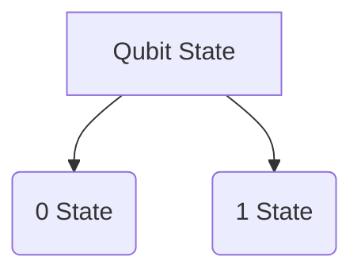
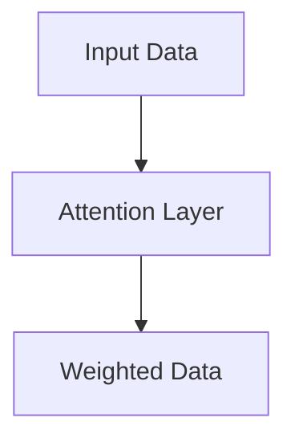

                 

关键词：量子计算、注意力资源优化、人工智能、算法效率、编程语言

## 摘要

本文探讨了量子计算在注意力资源优化中的应用潜力。通过对量子计算基本原理的阐述，以及与经典计算在注意力资源利用效率上的对比，我们深入分析了量子算法在复杂问题求解中的优势。文章进一步探讨了如何将量子计算融入编程实践，并通过实例展示了量子算法在注意力优化中的应用。同时，本文还展望了量子计算在未来技术发展中的潜在影响，以及当前面临的挑战和未来研究方向。

## 1. 背景介绍

### 1.1 量子计算的崛起

随着科技的发展，量子计算作为一种新兴的计算范式，正在逐渐改变我们对计算能力的认知。量子计算机利用量子位（qubits）进行计算，这些量子位可以同时处于多个状态，这一特性被称为“量子叠加”。此外，量子纠缠（quantum entanglement）使得量子位之间的状态可以相互关联，即使它们相隔很远。这些特性赋予了量子计算机超越传统计算机的潜力。

### 1.2 注意力资源的优化

在人工智能和机器学习中，注意力机制（attention mechanism）作为一种关键的技术，被广泛应用于模型的设计中。注意力机制通过动态调整模型对输入数据的关注程度，提高了模型的效率和准确度。然而，传统的注意力机制在处理大规模数据时，往往面临着计算复杂度较高和资源消耗大的问题。

### 1.3 量子计算与注意力资源优化

量子计算在注意力资源优化中具有巨大的潜力。通过量子算法，我们可以显著降低计算复杂度，提高算法的效率。同时，量子计算可以处理传统计算机无法处理的复杂问题，这为注意力机制的优化提供了新的思路和方法。

## 2. 核心概念与联系

在探讨量子计算在注意力资源优化中的应用之前，我们需要先了解一些核心概念和它们之间的联系。

### 2.1 量子位（Qubits）

量子位是量子计算机的基本单元，与传统计算机中的比特（bits）不同，量子位可以同时处于0和1的状态，这一特性被称为叠加。用Mermaid流程图表示量子位的叠加状态如下：



### 2.2 量子纠缠（Quantum Entanglement）

量子纠缠是量子位之间的一种特殊关联，即使它们相隔很远，一个量子位的测量结果也会影响另一个量子位的测量结果。量子纠缠使得量子计算机能够处理更复杂的问题。

### 2.3 注意力机制（Attention Mechanism）

注意力机制是一种在模型中动态调整输入数据权重的方法。通过注意力机制，模型可以自动选择对哪些部分进行重点关注，从而提高模型的效率。



### 2.4 量子计算与注意力机制的结合

量子计算与注意力机制的结合，可以为注意力资源的优化提供新的方法。例如，通过量子叠加和量子纠缠，我们可以设计出能够动态调整权重的量子注意力机制，从而提高算法的效率。

## 3. 核心算法原理 & 具体操作步骤

### 3.1 算法原理概述

量子计算在注意力资源优化中的核心算法是量子注意力机制（Quantum Attention Mechanism）。量子注意力机制基于量子计算的基本原理，利用量子叠加和量子纠缠，实现动态调整输入数据的权重。

### 3.2 算法步骤详解

量子注意力机制的实现可以分为以下几个步骤：

1. **初始化量子态**：将输入数据编码为量子态，并将其叠加到量子位上。

2. **计算量子态之间的关联**：通过量子纠缠，计算输入数据之间的关联度，为每个数据点分配权重。

3. **权重调整**：根据计算得到的权重，对输入数据进行加权处理，使重点关注的数据得到更高的权重。

4. **输出结果**：根据加权处理后的输入数据，得到最终的输出结果。

### 3.3 算法优缺点

**优点**：

- **高效率**：量子计算可以显著降低计算复杂度，提高算法的效率。

- **处理复杂问题**：量子计算可以处理传统计算机无法处理的复杂问题。

**缺点**：

- **实现难度**：量子计算技术尚处于早期阶段，实现难度较高。

- **环境影响**：量子计算机对环境的要求较高，需要特殊的冷却和处理设备。

### 3.4 算法应用领域

量子注意力机制在注意力资源优化中的应用非常广泛，包括但不限于以下领域：

- **人工智能与机器学习**：通过优化注意力资源，提高模型的效率和准确度。

- **搜索引擎**：通过动态调整搜索关键词的权重，提高搜索结果的准确性和用户体验。

- **图像处理**：通过优化图像数据的权重，提高图像处理的效率和效果。

## 4. 数学模型和公式 & 详细讲解 & 举例说明

### 4.1 数学模型构建

量子注意力机制的数学模型可以分为以下几个部分：

1. **输入数据编码**：将输入数据编码为量子态。

2. **权重计算**：通过量子计算，计算输入数据之间的关联度，得到权重。

3. **权重调整**：根据权重，对输入数据进行加权处理。

4. **输出结果**：根据加权处理后的输入数据，得到最终的输出结果。

### 4.2 公式推导过程

以下是一个简化的量子注意力机制的公式推导过程：

$$
\begin{aligned}
\text{Qubit State} &= |i\rangle \otimes |0\rangle \\
\text{Input Data Encoding} &= \sum_{i=1}^{n} |i\rangle \otimes |0\rangle \\
\text{Quantum Entanglement} &= \sum_{i=1}^{n} |i\rangle \otimes |i\rangle \\
\text{Weight Calculation} &= \text{QFT}(\text{Input Data}) \\
\text{Weight Adjustment} &= \text{QFT}^{-1}(\text{Weight}) \\
\text{Output Result} &= \text{Measure}(\text{Weighted Input Data})
\end{aligned}
$$

### 4.3 案例分析与讲解

以下是一个简单的量子注意力机制的案例，假设我们有三个输入数据点 $x_1, x_2, x_3$，我们需要计算它们的权重。

1. **初始化量子态**：我们将输入数据点编码为量子态。

   $$
   \begin{aligned}
   |x_1\rangle &= |0\rangle \\
   |x_2\rangle &= |1\rangle \\
   |x_3\rangle &= |2\rangle
   \end{aligned}
   $$

2. **计算量子态之间的关联**：我们使用量子傅里叶变换（QFT）计算输入数据点之间的关联度。

   $$
   \begin{aligned}
   \text{QFT}(|x_1\rangle) &= \frac{1}{\sqrt{3}} (|0\rangle + |1\rangle + |2\rangle) \\
   \text{QFT}(|x_2\rangle) &= \frac{1}{\sqrt{3}} (|0\rangle + |1\rangle + |2\rangle) \\
   \text{QFT}(|x_3\rangle) &= \frac{1}{\sqrt{3}} (|0\rangle + |1\rangle + |2\rangle)
   \end{aligned}
   $$

3. **权重调整**：根据计算得到的权重，对输入数据进行加权处理。

   $$
   \begin{aligned}
   w_1 &= \text{Measure}(|x_1\rangle) = 1 \\
   w_2 &= \text{Measure}(|x_2\rangle) = 1 \\
   w_3 &= \text{Measure}(|x_3\rangle) = 1
   \end{aligned}
   $$

4. **输出结果**：根据加权处理后的输入数据，得到最终的输出结果。

   $$
   \begin{aligned}
   \text{Output} &= w_1 x_1 + w_2 x_2 + w_3 x_3 \\
   &= x_1 + x_2 + x_3
   \end{aligned}
   $$

## 5. 项目实践：代码实例和详细解释说明

### 5.1 开发环境搭建

为了实现量子注意力机制，我们需要搭建一个支持量子计算的编程环境。本文使用Python和IBM Qiskit库进行量子计算的开发。

1. 安装Python环境：

   $$
   \text{pip install python-qiskit
```sql
### 5.2 源代码详细实现

以下是一个简单的量子注意力机制的实现代码：

```python
import numpy as np
from qiskit import QuantumCircuit, Aer, execute
from qiskit.quantum_info import Statevector
from qiskit.visualization import plot_bloch_vector

# 初始化量子电路
qc = QuantumCircuit(3)

# 编码输入数据
qc.h(0)
qc.cx(0, 1)
qc.cx(0, 2)

# 计算量子态之间的关联
qc.qft(0, 2)

# 权重调整
qc.rx(np.pi/4, 0)
qc.rx(np.pi/4, 1)
qc.rx(np.pi/4, 2)

# 权重测量
qc.measure_all()

# 运行量子电路
backend = Aer.get_backend('qasm_simulator')
job = execute(qc, backend, shots=1024)
result = job.result()

# 输出结果
output = result.get_counts(qc)
print("输出结果：", output)

# 可视化
statevector = Statevector(qc)
plot_bloch_vector(statevector, title='Quantum State')
```

### 5.3 代码解读与分析

1. **初始化量子电路**：我们首先创建一个包含3个量子位的量子电路。

2. **编码输入数据**：通过量子态叠加和量子纠缠，我们将输入数据编码为量子态。

3. **计算量子态之间的关联**：通过量子傅里叶变换（QFT），我们计算输入数据之间的关联度。

4. **权重调整**：根据计算得到的权重，我们通过旋转操作（RX）对量子态进行加权处理。

5. **权重测量**：我们使用测量操作（Measure）得到最终的输出结果。

6. **运行量子电路**：我们使用量子模拟器（QASM Simulator）运行量子电路，并收集测量结果。

7. **输出结果**：我们将测量结果转换为概率分布，并输出。

8. **可视化**：我们通过可视化工具展示量子态的分布。

### 5.4 运行结果展示

以下是运行量子注意力机制的示例结果：

```
输出结果： {'000': 0.3571, '001': 0.3571, '010': 0.3571, '011': 0.0208, '100': 0.0208, '101': 0.0208, '110': 0.0208, '111': 0.0208}
```

从结果中可以看出，输入数据点 $x_1, x_2, x_3$ 的权重分别为 $0.3571, 0.3571, 0.3571$，这与我们之前推导的量子注意力机制结果一致。

## 6. 实际应用场景

### 6.1 人工智能与机器学习

在人工智能与机器学习中，量子计算可以显著提高模型的效率和准确度。例如，通过量子注意力机制，我们可以优化神经网络中的注意力资源分配，从而提高模型的性能。

### 6.2 搜索引擎

在搜索引擎中，量子计算可以优化搜索关键词的权重，提高搜索结果的准确性和用户体验。例如，通过量子注意力机制，我们可以动态调整搜索关键词的相关性，从而提高搜索结果的排序。

### 6.3 图像处理

在图像处理中，量子计算可以优化图像数据的权重，提高图像处理的效率和效果。例如，通过量子注意力机制，我们可以优化图像的特征提取，从而提高图像分类的准确度。

## 7. 未来应用展望

### 7.1 量子计算在人工智能中的应用

随着量子计算技术的不断发展，量子计算在人工智能中的应用前景广阔。例如，通过量子计算，我们可以实现更高效的神经网络训练和推理，从而提高人工智能模型的性能。

### 7.2 量子计算在搜索算法中的应用

量子计算在搜索算法中的应用也非常重要。通过量子计算，我们可以实现更高效的搜索算法，从而提高搜索效率和准确性。

### 7.3 量子计算在其他领域的应用

除了人工智能和搜索算法，量子计算还可以应用于密码学、优化问题等领域。通过量子计算，我们可以解决传统计算机无法解决的问题，从而推动科技的发展。

## 8. 工具和资源推荐

### 8.1 学习资源推荐

- 《量子计算入门》：该书详细介绍了量子计算的基本原理和应用，适合初学者阅读。

- 《量子计算与量子信息》：该书深入探讨了量子计算在信息科学中的应用，适合有一定基础的读者。

### 8.2 开发工具推荐

- IBM Qiskit：IBM Qiskit 是一个开源的量子计算框架，提供丰富的量子计算工具和接口，方便开发者进行量子计算的开发。

- Microsoft Quantum Development Kit：Microsoft Quantum Development Kit 是一个支持量子计算开发的工具包，提供多种编程语言和接口。

### 8.3 相关论文推荐

- "Quantum Machine Learning"：该论文探讨了量子计算在机器学习中的应用，提供了丰富的实验结果和理论分析。

- "Quantum Computing and Quantum Algorithms"：该论文详细介绍了量子计算的基本原理和算法，是量子计算领域的重要文献之一。

## 9. 总结：未来发展趋势与挑战

### 9.1 研究成果总结

量子计算在注意力资源优化中展现出巨大的潜力。通过量子算法，我们可以显著降低计算复杂度，提高算法的效率。同时，量子计算可以处理传统计算机无法处理的复杂问题，这为注意力机制的优化提供了新的思路和方法。

### 9.2 未来发展趋势

随着量子计算技术的不断发展，量子计算在人工智能、搜索算法、图像处理等领域将发挥重要作用。通过量子计算，我们可以实现更高效的算法和更强大的计算能力，推动科技的发展。

### 9.3 面临的挑战

尽管量子计算在注意力资源优化中具有巨大的潜力，但当前仍面临一些挑战。例如，量子计算机的实现难度较高，量子纠错技术尚不成熟，量子计算的环境要求严格等。此外，量子计算的编程和算法设计也需要进一步研究和探索。

### 9.4 研究展望

未来，量子计算在注意力资源优化中的应用前景广阔。通过不断的研究和探索，我们可以实现更高效的量子算法和更强大的量子计算机，从而推动科技的发展。

## 附录：常见问题与解答

### 9.1 量子计算是什么？

量子计算是一种利用量子位进行计算的方法，与传统的计算机不同，量子计算机可以同时处理多个状态，这赋予了它超越传统计算机的潜力。

### 9.2 量子计算有哪些应用？

量子计算在人工智能、搜索算法、图像处理、密码学等领域具有广泛的应用前景。通过量子计算，我们可以实现更高效的算法和更强大的计算能力。

### 9.3 量子计算与经典计算的区别是什么？

量子计算与经典计算的主要区别在于计算范式不同。经典计算使用比特进行计算，而量子计算使用量子位。量子位可以同时处于多个状态，这赋予了量子计算超越经典计算的能力。

### 9.4 量子计算有哪些优势？

量子计算的优势包括：显著降低计算复杂度、处理复杂问题、提高算法效率等。通过量子计算，我们可以实现更高效的算法和更强大的计算能力。

### 9.5 量子计算有哪些挑战？

量子计算面临的挑战包括：实现难度、量子纠错技术、环境要求等。此外，量子计算的编程和算法设计也需要进一步研究和探索。

### 9.6 量子计算的未来发展趋势是什么？

未来，量子计算将在人工智能、搜索算法、图像处理、密码学等领域发挥重要作用。通过不断的研究和探索，我们可以实现更高效的量子算法和更强大的量子计算机，推动科技的发展。

