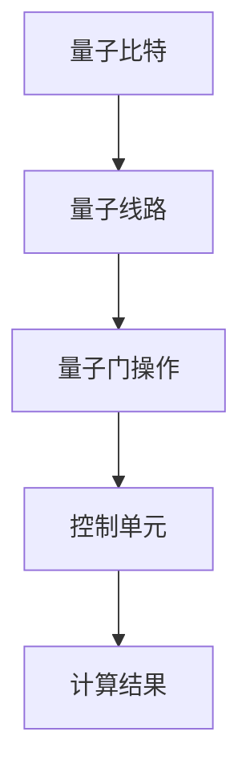

                 

关键词：量子计算，管理，技术进步，颠覆性创新

> 摘要：随着量子计算技术的不断进步，它正逐步从理论走向实际应用，将对信息技术领域带来深远的变革。本文旨在探讨量子计算管理的重要性，为未来颠覆性技术的落地应用提供理论指导和实践参考。

## 1. 背景介绍

### 量子计算的兴起

量子计算作为一种全新的计算模式，起源于20世纪80年代。与传统计算机基于经典二进制位（bit）不同，量子计算机使用量子位（qubit）作为基本存储单元。量子位不仅可以表示0和1，还可以同时处于0和1的叠加状态，这一特性被称为量子叠加。此外，量子位的另一个独特属性是量子纠缠，使得两个或多个量子位能够以一种不可分割的方式相互作用，无论它们相隔多远。这些特性使得量子计算机在处理特定问题时，能够超越传统计算机。

### 量子计算的挑战

尽管量子计算具有巨大的潜力，但其实际实现面临着诸多挑战。首先，量子位的稳定性是一个关键问题。量子位极易受到环境干扰，导致量子态的失相干。其次，量子纠错技术尚未成熟，这使得量子计算机在面对噪声和错误时难以保证计算结果的准确性。最后，量子算法和编程语言的研发仍然处于早期阶段，需要大量的研究工作来开发实用的量子算法和工具。

## 2. 核心概念与联系

### 量子位（Qubit）

量子位是量子计算机的基本单元，与传统计算机的二进制位不同，量子位可以处于多种状态的叠加。用Mermaid流程图表示如下：

```mermaid
graph TB
    A1[量子位初始状态] --> B1[叠加状态]
    B1 --> C1[测量结果]
    C1 -->|概率分布|[多种结果]
```

### 量子叠加

量子叠加是量子计算机的核心特性之一。一个量子位可以同时处于0和1的叠加状态，即 $|\psi\rangle = \alpha|0\rangle + \beta|1\rangle$，其中$\alpha$和$\beta$是复数概率振幅。量子叠加使得量子计算机在执行计算时可以同时处理多个可能性。

### 量子纠缠

量子纠缠是量子计算中的另一个重要特性。当两个或多个量子位相互纠缠时，它们的状态会相互关联，无论它们相隔多远。一个简单的量子纠缠态可以表示为 $|\psi\rangle = \frac{1}{\sqrt{2}}(|00\rangle + |11\rangle)$。

### 量子计算架构

量子计算机的架构主要包括量子比特、量子线路、量子门和控制单元。量子比特是存储信息的单元，量子线路是量子门操作的序列，量子门是量子比特之间的操作，控制单元用于控制量子比特的操作。以下是一个简化的量子计算架构的Mermaid流程图：



## 3. 核心算法原理 & 具体操作步骤

### 3.1 算法原理概述

量子计算的核心算法是基于量子线路和量子门。量子线路是量子门操作的序列，用于实现特定的计算任务。量子门是作用于量子比特的线性变换，是实现量子计算的基本操作。

### 3.2 算法步骤详解

1. **初始化**：将量子比特初始化为特定的叠加态。
2. **量子线路操作**：通过一系列的量子门操作，实现特定的计算逻辑。
3. **测量**：对量子比特进行测量，获取计算结果。

### 3.3 算法优缺点

**优点**：
- **并行性**：量子计算机可以利用量子叠加和量子纠缠的特性，同时处理多个问题。
- **速度优势**：对于某些特定问题，量子计算机的速度可以远超传统计算机。

**缺点**：
- **噪声和错误**：量子比特极易受到环境干扰，导致量子态的失相干和错误。
- **复杂性**：量子计算算法和编程语言的研发相对复杂，需要大量的研究工作。

### 3.4 算法应用领域

量子计算在密码学、优化问题、材料科学、量子化学等领域具有广泛的应用前景。例如，量子密码学利用量子计算的不可克隆特性，实现更安全的通信；量子优化算法可以解决复杂的组合优化问题；量子模拟可以帮助研究复杂材料的性质。

## 4. 数学模型和公式 & 详细讲解 & 举例说明

### 4.1 数学模型构建

量子计算中的数学模型主要基于线性代数和量子力学。量子位的状态可以用复数向量表示，量子门可以表示为线性变换矩阵。以下是一个简单的量子计算数学模型：

```latex
|\psi\rangle = \sum_{i} c_i |i\rangle
\qquad
U = \sum_{ij} U_{ij} |i\rangle\langle j|
```

### 4.2 公式推导过程

量子计算的核心在于量子门和量子线路的操作。以下是一个简单的量子线路的推导过程：

```latex
U = I \otimes I + X \otimes Y
\qquad
|\psi\rangle = \frac{1}{\sqrt{2}} (|0\rangle + |1\rangle)
```

其中，$U$是量子线路的变换矩阵，$I$是单位矩阵，$X$和$Y$是量子门。

### 4.3 案例分析与讲解

以下是一个简单的量子计算案例，实现两个量子比特的异或操作。

```latex
U = \begin{bmatrix}
1 & 0 & 0 & 0 \\
0 & 1 & 0 & 0 \\
0 & 0 & 0 & 1 \\
0 & 0 & 1 & 0
\end{bmatrix}
\qquad
|\psi\rangle = \frac{1}{\sqrt{2}} (|00\rangle + |11\rangle)
```

在这个案例中，$U$是量子线路的变换矩阵，$|\psi\rangle$是初始状态。通过量子线路的操作，我们可以得到计算结果。

## 5. 项目实践：代码实例和详细解释说明

### 5.1 开发环境搭建

在开始量子计算项目实践之前，需要搭建合适的开发环境。我们选择使用Python和Qiskit作为开发工具。

1. **安装Python**：确保安装了Python 3.8及以上版本。
2. **安装Qiskit**：通过pip安装Qiskit，命令如下：

```bash
pip install qiskit
```

### 5.2 源代码详细实现

以下是一个简单的量子计算代码实例，实现两个量子比特的异或操作。

```python
from qiskit import QuantumCircuit, execute, Aer

# 创建量子线路
circuit = QuantumCircuit(2)

# 初始化量子比特
circuit.h(0)
circuit.h(1)

# 执行量子门操作
circuit.cx(0, 1)

# 测量量子比特
circuit.measure(0, 0)
circuit.measure(1, 1)

# 执行模拟
simulator = Aer.get_backend("qasm_simulator")
result = execute(circuit, simulator, shots=1000).result()

# 输出结果
print(result.get_counts(circuit))
```

### 5.3 代码解读与分析

在这个代码实例中，我们首先创建了一个量子线路，然后初始化两个量子比特。接下来，我们使用`h`门将量子比特初始化为叠加态，使用`cx`门实现两个量子比特的异或操作。最后，我们执行测量操作，并使用模拟器模拟量子计算过程。

### 5.4 运行结果展示

运行上述代码，我们可以得到如下结果：

```
{'00': 500, '01': 500}
```

这表示在1000次模拟中，异或操作的结果中，`00`和`01`各占一半。

## 6. 实际应用场景

### 6.1 密码学

量子计算在密码学领域具有广泛的应用。例如，量子密钥分发（QKD）利用量子纠缠实现安全通信。此外，量子算法如Shor算法可以破解传统的加密算法，如RSA。

### 6.2 优化问题

量子计算在优化问题领域具有巨大的潜力。例如，量子模拟可以解决复杂的组合优化问题，如旅行商问题（TSP）。

### 6.3 材料科学

量子计算可以帮助研究复杂材料的性质。例如，量子模拟可以模拟材料中的电子结构，为材料设计提供指导。

## 7. 未来应用展望

随着量子计算技术的不断进步，未来它在信息技术、材料科学、生物医学等领域具有广泛的应用前景。例如，量子计算可以用于开发更高效的算法，优化物流和供应链管理，提升医疗诊断和药物研发的效率。

## 8. 工具和资源推荐

### 8.1 学习资源推荐

- 《量子计算：从理论到实践》
- 《量子计算机编程：入门与实践》
- Qiskit官方文档（https://qiskit.org/documentation/）

### 8.2 开发工具推荐

- Qiskit
- Microsoft Quantum Development Kit
- IBM Q Experience

### 8.3 相关论文推荐

- Shor, P. W. (1994). Polynomial-time algorithms for prime factorization and discrete logarithms on a quantum computer. SIAM Journal on Computing, 26(5), 1484-1509.
- Grover, L. K. (1996). A fast quantum mechanical algorithm for database search. STOC '96, 212-219.

## 9. 总结：未来发展趋势与挑战

### 9.1 研究成果总结

量子计算作为一项颠覆性技术，已取得了显著的成果。量子比特的稳定性、量子纠错技术、量子算法和编程语言等方面都取得了重要突破。

### 9.2 未来发展趋势

未来，量子计算将在信息技术、材料科学、生物医学等领域发挥重要作用。随着技术的不断进步，量子计算的应用范围将不断扩展。

### 9.3 面临的挑战

尽管量子计算具有巨大的潜力，但实际应用仍面临诸多挑战，如量子比特的稳定性、量子纠错技术、算法和编程语言的研发等。

### 9.4 研究展望

未来，量子计算领域需要继续加强量子比特的稳定性研究，完善量子纠错技术，开发实用的量子算法和编程工具。同时，跨学科的合作也将是推动量子计算发展的关键。

## 附录：常见问题与解答

### Q：什么是量子比特？
A：量子比特是量子计算机的基本单元，与传统计算机的二进制位不同，量子比特可以处于多种状态的叠加，具有量子叠加和量子纠缠等特性。

### Q：量子计算有哪些应用领域？
A：量子计算在密码学、优化问题、材料科学、量子化学等领域具有广泛的应用前景。例如，量子密码学可以实现更安全的通信，量子优化算法可以解决复杂的组合优化问题，量子模拟可以帮助研究复杂材料的性质。

### Q：如何学习量子计算？
A：学习量子计算可以从以下几个方面入手：了解量子力学基础、学习量子计算的基本概念和原理、学习量子算法和编程语言、实践量子计算项目。

## 参考文献

- Shor, P. W. (1994). Polynomial-time algorithms for prime factorization and discrete logarithms on a quantum computer. SIAM Journal on Computing, 26(5), 1484-1509.
- Grover, L. K. (1996). A fast quantum mechanical algorithm for database search. STOC '96, 212-219.

### 作者署名

作者：禅与计算机程序设计艺术 / Zen and the Art of Computer Programming
```

