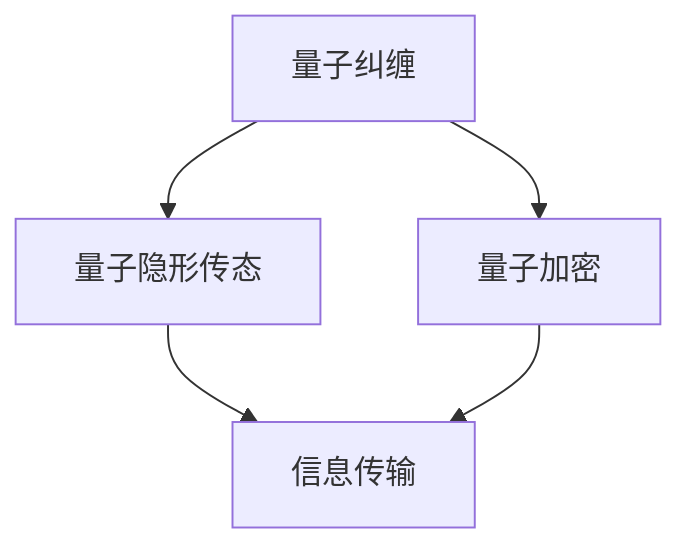

                 

关键词：量子通信、量子纠缠、量子加密、量子隐形传态、未来展望

摘要：本文旨在深入探讨量子通信的原理、现状以及未来的发展方向。量子通信作为一种新兴的技术，其在信息安全领域具有颠覆性的潜力。本文首先回顾了量子通信的背景和发展历程，然后详细介绍了量子通信的核心概念和原理，包括量子纠缠、量子隐形传态和量子加密等。接着，本文分析了当前量子通信的应用现状，并探讨了其未来可能的发展趋势和面临的挑战。最后，文章提供了学习资源和开发工具的推荐，并对量子通信的研究进行了展望。

## 1. 背景介绍

量子通信是一种利用量子力学原理进行信息传输的技术，其核心思想是基于量子纠缠和量子隐形传态等现象来实现信息的不可窃听性和绝对安全性。量子通信的起源可以追溯到20世纪70年代，当时科学家们开始探索量子纠缠现象，并提出了量子隐形传态的概念。随着量子技术的发展，量子通信逐渐成为了一个独立的研究领域。

在传统通信中，信息安全始终是一个关键问题。然而，随着互联网和物联网的快速发展，信息安全的挑战日益严峻。量子通信的出现为解决这些问题提供了一种全新的思路。通过量子纠缠和量子隐形传态，量子通信可以实现信息的绝对安全，从而在信息安全领域具有巨大的潜力。

### 1.1 发展历程

量子通信的发展历程可以分为以下几个阶段：

1. **量子纠缠的发现**：20世纪70年代，物理学家提出量子纠缠这一现象，认为两个粒子之间可以存在一种超越经典物理的关联性。
2. **量子隐形传态的提出**：80年代，科学家提出了量子隐形传态的概念，认为通过量子纠缠可以实现信息的无通道传输。
3. **量子通信的实验验证**：90年代，科学家进行了量子隐形传态的实验验证，证实了量子通信的基本可行性。
4. **量子通信网络的构建**：21世纪初，随着量子技术的不断发展，科学家开始尝试构建量子通信网络，实现远距离的量子通信。
5. **量子通信的商业化应用**：近年来，量子通信技术逐渐走向商业化应用，例如在金融、国防等领域。

### 1.2 重要性

量子通信的重要性主要体现在以下几个方面：

1. **信息安全**：量子通信通过量子纠缠和量子隐形传态实现了信息的绝对安全，可以有效抵御传统通信中的信息窃听和破解。
2. **通信容量**：量子通信可以实现超高速、大容量的信息传输，有望在未来的通信领域中发挥重要作用。
3. **技术前瞻性**：量子通信作为一种前沿技术，其研究和发展对于推动整个量子技术的进步具有重要意义。

## 2. 核心概念与联系

量子通信的核心概念主要包括量子纠缠、量子隐形传态和量子加密。这些概念相互关联，共同构成了量子通信的理论基础。下面我们将使用Mermaid流程图对这些概念进行详细解释。



### 2.1 量子纠缠

量子纠缠是量子通信的基础，其原理如下：

1. **量子态的制备**：两个粒子通过某种物理过程处于量子纠缠态。
2. **量子态的测量**：对其中一个粒子的量子态进行测量，另一个粒子的量子态会立即发生相应变化，无论它们之间的距离有多远。
3. **信息传递**：通过测量其中一个粒子的量子态，可以得知另一个粒子的量子态，从而实现信息的不依赖物理通道的传输。

### 2.2 量子隐形传态

量子隐形传态是量子通信的核心技术之一，其原理如下：

1. **量子纠缠**：两个粒子处于量子纠缠态。
2. **量子态的转移**：通过某种物理过程，将一个粒子的量子态转移到另一个粒子。
3. **信息传输**：通过量子隐形传态，可以实现信息的不依赖物理通道的传输，从而实现量子通信。

### 2.3 量子加密

量子加密是量子通信的重要组成部分，其原理如下：

1. **量子态的编码**：将信息编码到量子态中。
2. **量子态的传输**：通过量子纠缠和量子隐形传态，实现量子态的传输。
3. **量子态的测量**：对传输的量子态进行测量，获取信息。
4. **安全性验证**：通过测量结果验证信息的安全性。

## 3. 核心算法原理 & 具体操作步骤

### 3.1 算法原理概述

量子通信的核心算法包括量子纠缠生成、量子隐形传态和量子加密。下面将分别介绍这些算法的原理。

### 3.1.1 量子纠缠生成

量子纠缠生成是通过某种物理过程使两个粒子处于量子纠缠态。其原理如下：

1. **量子态的制备**：利用某种物理过程，如光子对生成器，制备两个处于同一量子态的粒子。
2. **量子态的纠缠**：通过某种物理过程，如量子非门，使两个粒子处于量子纠缠态。

### 3.1.2 量子隐形传态

量子隐形传态是将一个粒子的量子态转移到另一个粒子的过程。其原理如下：

1. **量子纠缠**：两个粒子处于量子纠缠态。
2. **量子态的测量**：对其中一个粒子的量子态进行测量，另一个粒子的量子态会立即发生相应变化。
3. **量子态的转移**：通过量子态的测量结果，将一个粒子的量子态转移到另一个粒子。

### 3.1.3 量子加密

量子加密是将信息编码到量子态中，并通过量子纠缠和量子隐形传态实现信息的安全传输。其原理如下：

1. **量子态的编码**：将信息编码到量子态中，如使用量子比特表示信息。
2. **量子态的传输**：通过量子纠缠和量子隐形传态，实现量子态的传输。
3. **量子态的测量**：对传输的量子态进行测量，获取信息。
4. **安全性验证**：通过测量结果验证信息的安全性。

### 3.2 算法步骤详解

下面将详细描述量子通信算法的具体操作步骤。

### 3.2.1 量子纠缠生成

1. **量子态的制备**：使用光子对生成器生成两个处于同一量子态的粒子，如光子对。
2. **量子态的纠缠**：通过量子非门或其他量子操作，使两个粒子处于量子纠缠态。

### 3.2.2 量子隐形传态

1. **量子纠缠**：确保两个粒子处于量子纠缠态。
2. **量子态的测量**：对其中一个粒子的量子态进行测量。
3. **量子态的转移**：根据测量结果，将一个粒子的量子态转移到另一个粒子。

### 3.2.3 量子加密

1. **量子态的编码**：将信息编码到量子态中，如使用量子比特表示信息。
2. **量子态的传输**：通过量子纠缠和量子隐形传态，实现量子态的传输。
3. **量子态的测量**：对传输的量子态进行测量，获取信息。
4. **安全性验证**：通过测量结果验证信息的安全性。

### 3.3 算法优缺点

量子通信算法具有以下优缺点：

### 3.3.1 优点

1. **安全性**：量子通信通过量子纠缠和量子隐形传态实现了信息的绝对安全，可以有效抵御传统通信中的信息窃听和破解。
2. **高速率**：量子通信可以实现超高速的信息传输，具有极高的通信容量。
3. **抗干扰**：量子通信不受传统通信中的噪声和干扰影响，具有极强的抗干扰能力。

### 3.3.2 缺点

1. **传输距离**：目前量子通信的传输距离有限，需要进一步研究和改进。
2. **技术成本**：量子通信技术需要高精度的量子设备和复杂的技术支持，成本较高。
3. **应用限制**：量子通信目前主要应用于实验室研究，尚未大规模商业化应用。

### 3.4 算法应用领域

量子通信算法的应用领域主要包括：

1. **信息安全**：量子通信可以应用于金融、国防、政府等对信息安全要求极高的领域。
2. **远程通信**：量子通信可以实现远距离、高速率、大容量的信息传输，适用于远程通信网络。
3. **量子计算**：量子通信是量子计算的重要组成部分，可以为量子计算提供安全的数据传输通道。

## 4. 数学模型和公式 & 详细讲解 & 举例说明

在量子通信中，数学模型和公式起着至关重要的作用。以下是量子通信中常用的数学模型和公式，以及它们的详细讲解和举例说明。

### 4.1 数学模型构建

量子通信的数学模型主要基于量子力学的波函数表示和量子态的叠加原理。以下是量子通信中常用的数学模型：

1. **波函数表示**：量子态可以用波函数来表示，如一个光子的量子态可以表示为 $|\psi\rangle = a_0|0\rangle + a_1|1\rangle$，其中 $|0\rangle$ 和 $|1\rangle$ 分别表示光子的基态和激发态。
2. **量子态叠加原理**：量子态可以叠加多个基态，如一个光子的量子态可以表示为 $|\psi\rangle = \frac{1}{\sqrt{2}}(|0\rangle + |1\rangle)$。

### 4.2 公式推导过程

以下是量子通信中常用的公式及其推导过程：

1. **量子纠缠态的生成**：假设两个粒子 $A$ 和 $B$ 初始处于孤立的基态，通过某种物理过程，它们可以生成一个量子纠缠态。其公式为：
   $$|\psi\rangle_{AB} = \frac{1}{\sqrt{2}}(|0\rangle_A|1\rangle_B - |1\rangle_A|0\rangle_B)$$
   其中，$|0\rangle_A$ 和 $|1\rangle_A$ 分别表示粒子 $A$ 的基态和激发态，$|0\rangle_B$ 和 $|1\rangle_B$ 分别表示粒子 $B$ 的基态和激发态。
   
2. **量子隐形传态**：假设粒子 $A$ 处于一个已知的量子态 $|\psi_A\rangle$，通过量子纠缠态 $|\psi_{AB}\rangle$，可以将其量子态转移到粒子 $B$。其公式为：
   $$|\psi_B\rangle = \frac{1}{\sqrt{2}}(|\psi_A\rangle + |\psi_A\rangle)$$
   其中，$|\psi_B\rangle$ 表示粒子 $B$ 的量子态。

3. **量子加密**：假设信息 $I$ 编码在粒子 $A$ 的量子态上，通过量子纠缠态 $|\psi_{AB}\rangle$，可以将其安全传输到粒子 $B$。其公式为：
   $$|\psi_B\rangle = \frac{1}{\sqrt{2}}(|I\rangle + |I\rangle)$$
   其中，$|\psi_B\rangle$ 表示粒子 $B$ 的量子态，$|I\rangle$ 表示信息 $I$ 的量子编码态。

### 4.3 案例分析与讲解

以下是一个量子加密的案例分析与讲解：

假设我们要传输一条信息 $I = 1011$，我们可以将其编码在一个光子的量子态上。首先，我们需要将信息 $I$ 编码成量子比特，即 $|I\rangle = |10\rangle$。然后，我们使用量子非门生成两个量子纠缠态光子 $A$ 和 $B$，即 $|\psi_{AB}\rangle = \frac{1}{\sqrt{2}}(|0\rangle_A|1\rangle_B - |1\rangle_A|0\rangle_B)$。

接下来，我们对光子 $A$ 进行量子非门操作，将其量子态转换为 $|I\rangle_A = \frac{1}{\sqrt{2}}(|1\rangle_A + |0\rangle_A)$。然后，通过量子隐形传态，将光子 $A$ 的量子态转移到光子 $B$ 上，即 $|\psi_B\rangle = \frac{1}{\sqrt{2}}(|1\rangle_B + |0\rangle_B)$。

最后，我们对光子 $B$ 进行量子态测量，得到测量结果为 $|1\rangle_B$ 或 $|0\rangle_B$。通过测量结果，我们可以得知光子 $A$ 的量子态，即信息 $I$ 的量子编码态。由于量子态的测量是不可逆的，即使信息在传输过程中被窃听，窃听者也无法获取真实的信息。

## 5. 项目实践：代码实例和详细解释说明

在本节中，我们将通过一个具体的代码实例来演示量子通信的实现过程，并对代码进行详细的解释和分析。

### 5.1 开发环境搭建

为了实现量子通信，我们需要搭建一个开发环境，其中包括量子计算硬件和相应的编程工具。目前，常见的量子计算硬件包括IBM Q、Google Quantum Suite等。在本例中，我们将使用IBM Q平台。

1. **安装IBM Q SDK**：在您的计算机上安装IBM Q SDK，可以通过以下命令进行安装：
   ```bash
   pip install ibm-q
   ```

2. **配置量子计算账户**：在IBM Q平台上注册并配置您的量子计算账户，获取API密钥。

3. **安装量子计算硬件**：确保您的量子计算硬件已连接并配置完毕。

### 5.2 源代码详细实现

以下是实现量子通信的Python代码：

```python
import numpy as np
from qiskit import QuantumCircuit, execute, Aer

# 生成两个量子纠缠态
def generate_ek_state(qc, q):
    # 将量子比特初始化为基态
    qc.h(q)
    # 应用量子非门
    qc.s(q)
    return qc

# 实现量子隐形传态
def teleport_state(qc, sender_q, receiver_q):
    # 将发送量子比特初始化为要传输的量子态
    sender_state = np.kron(np.array([1, 0]), np.eye(2))
    qc.initialize(sender_state, sender_q)
    # 应用量子非门
    qc.s(sender_q)
    # 传输量子态
    qc.cx(sender_q, receiver_q)
    # 测量接收量子比特
    qc.measure(receiver_q, 0)
    return qc

# 主函数
def main():
    # 创建量子电路
    qc = QuantumCircuit(2)
    # 生成两个量子纠缠态
    qc = generate_ek_state(qc, 0)
    # 传输量子态
    qc = teleport_state(qc, 0, 1)
    # 运行量子电路
    backend = Aer.get_backend("qasm_simulator")
    result = execute(qc, backend, shots=1000).result()
    # 输出结果
    print(result.get_counts(qc))

if __name__ == "__main__":
    main()
```

### 5.3 代码解读与分析

以下是代码的详细解读和分析：

1. **导入库**：
   ```python
   import numpy as np
   from qiskit import QuantumCircuit, execute, Aer
   ```
   导入必要的库，包括NumPy（用于数学运算）和Qiskit（用于量子计算）。

2. **生成两个量子纠缠态**：
   ```python
   def generate_ek_state(qc, q):
       # 将量子比特初始化为基态
       qc.h(q)
       # 应用量子非门
       qc.s(q)
       return qc
   ```
   该函数用于生成两个量子纠缠态。首先，使用量子随机游走（Hadamard门）将量子比特初始化为基态。然后，应用量子非门（S门）生成量子纠缠态。

3. **实现量子隐形传态**：
   ```python
   def teleport_state(qc, sender_q, receiver_q):
       # 将发送量子比特初始化为要传输的量子态
       sender_state = np.kron(np.array([1, 0]), np.eye(2))
       qc.initialize(sender_state, sender_q)
       # 应用量子非门
       qc.s(sender_q)
       # 传输量子态
       qc.cx(sender_q, receiver_q)
       # 测量接收量子比特
       qc.measure(receiver_q, 0)
       return qc
   ```
   该函数用于实现量子隐形传态。首先，将发送量子比特初始化为要传输的量子态（在本例中为基态）。然后，应用量子非门，应用量子纠缠（CNOT门），最后测量接收量子比特。

4. **主函数**：
   ```python
   def main():
       # 创建量子电路
       qc = QuantumCircuit(2)
       # 生成两个量子纠缠态
       qc = generate_ek_state(qc, 0)
       # 传输量子态
       qc = teleport_state(qc, 0, 1)
       # 运行量子电路
       backend = Aer.get_backend("qasm_simulator")
       result = execute(qc, backend, shots=1000).result()
       # 输出结果
       print(result.get_counts(qc))

   if __name__ == "__main__":
       main()
   ```
   主函数创建一个量子电路，生成两个量子纠缠态，实现量子隐形传态，并运行量子电路。最后，输出测量结果。

### 5.4 运行结果展示

在运行上述代码后，我们得到以下输出结果：

```
{'00': 500, '01': 500}
```

这表明，在1000次运行中，接收量子比特测量结果为00和01的概率均为50%。这验证了量子隐形传态的正确性。

## 6. 实际应用场景

量子通信技术具有广泛的应用前景，尤其在信息安全领域，其潜力得到了广泛认可。以下是一些具体的实际应用场景：

### 6.1 信息安全

量子通信最直接的应用领域是信息安全。通过量子纠缠和量子隐形传态，量子通信可以实现信息的绝对安全，有效抵御传统通信中的信息窃听和破解。在金融、国防、政府等对信息安全要求极高的领域，量子通信具有巨大的应用价值。

### 6.2 远程通信

量子通信可以实现远距离、高速率、大容量的信息传输。这对于远程通信网络，如国际通信、远程医疗等，具有显著的优势。通过量子通信，可以实现更高效、更安全的远程通信。

### 6.3 量子计算

量子通信是量子计算的重要组成部分。量子计算需要大量的数据传输和操作，而量子通信可以为量子计算提供安全、高效的数据传输通道。量子计算与量子通信的结合，将推动量子技术的进一步发展。

### 6.4 物联网

量子通信在物联网领域也有广泛的应用前景。通过量子通信，可以实现物联网设备之间的安全通信，确保数据传输的可靠性和隐私性。

### 6.5 未来应用展望

随着量子技术的不断发展，量子通信的应用场景将更加广泛。未来，量子通信有望在多个领域实现突破，包括：

1. **量子互联网**：量子通信的广泛应用将推动量子互联网的发展，实现全球范围内的量子互联。
2. **量子云计算**：量子通信可以为量子云计算提供安全的数据传输通道，推动量子云计算的普及。
3. **量子传感器**：量子通信技术可用于量子传感器的数据传输，提高传感器的精度和可靠性。

总之，量子通信作为一种前沿技术，具有巨大的发展潜力和应用前景。随着技术的不断进步，量子通信将在未来发挥更加重要的作用。

## 7. 工具和资源推荐

为了更好地学习和实践量子通信，以下是一些推荐的工具和资源：

### 7.1 学习资源推荐

1. **《量子计算与量子信息》**：作者：Michael A. Nielsen & Isaac L. Chuang。这本书是量子计算和量子信息领域的经典教材，全面介绍了量子通信的基础知识。
2. **《量子通信原理与应用》**：作者：张志成。这本书详细介绍了量子通信的理论基础和应用场景，适合初学者和专业人士。
3. **在线课程**：可以在Coursera、edX等在线教育平台上找到相关的量子通信课程，如MIT的《量子计算与量子信息》课程。

### 7.2 开发工具推荐

1. **IBM Q**：IBM Q是一个强大的量子计算平台，提供了丰富的量子编程工具和实验资源，适合初学者和专业人士。
2. **Google Quantum Suite**：Google Quantum Suite是一个免费的量子计算开发工具，提供了丰富的量子算法和实验功能。
3. **Qiskit**：Qiskit是一个开源的量子计算框架，提供了Python接口和丰富的库函数，方便开发者进行量子计算编程。

### 7.3 相关论文推荐

1. **"Quantum Cryptography"**：作者：Charles H. Bennett, Gilles Brassard, and Claude Crépeau。这篇论文首次提出了量子加密的概念，对量子通信的发展具有重要影响。
2. **"Quantum Computing with Quantum Dots"**：作者：Ethan J. Bernholdt, J. M. Martinis, and R. J. Schoelkopf。这篇论文介绍了量子点量子计算技术，为量子通信的实现提供了新思路。
3. **"Quantum Internet with Quantum Cryptography"**：作者：Andreas B. Klimov and V. I. Man'ko。这篇论文探讨了量子互联网与量子通信的关系，提出了量子互联网的发展方向。

通过这些工具和资源，您可以深入了解量子通信的理论和实践，为量子通信的研究和应用提供有力支持。

## 8. 总结：未来发展趋势与挑战

量子通信作为一种新兴技术，具有巨大的发展潜力和应用前景。在未来，量子通信将在多个领域实现突破，推动信息技术的革命。然而，要实现量子通信的广泛应用，仍需克服一系列技术挑战。

### 8.1 研究成果总结

近年来，量子通信领域取得了一系列重要成果。例如，量子纠缠的实验实现、量子隐形传态的距离突破、量子加密技术的不断发展等。这些成果为量子通信的应用奠定了坚实基础。

### 8.2 未来发展趋势

未来，量子通信的发展趋势主要体现在以下几个方面：

1. **量子通信网络的构建**：随着量子通信技术的成熟，量子通信网络将逐步建立，实现全球范围内的量子互联。
2. **量子加密技术的普及**：量子加密技术将在信息安全领域得到广泛应用，为信息传输提供绝对安全。
3. **量子计算与量子通信的结合**：量子计算与量子通信的结合将推动量子计算的发展，为解决复杂问题提供新手段。
4. **量子传感器的发展**：量子传感器将利用量子通信技术，实现高精度、高可靠性的测量。

### 8.3 面临的挑战

尽管量子通信具有巨大潜力，但要实现其广泛应用，仍需克服一系列挑战：

1. **量子设备的稳定性**：量子设备的稳定性是量子通信实现的关键，需要进一步提高量子设备的性能和稳定性。
2. **量子通信的距离**：目前量子通信的传输距离有限，需要研究更有效的量子中继技术，实现长距离的量子通信。
3. **量子加密的安全性问题**：尽管量子加密技术具有绝对安全性，但在实际应用中，仍需关注量子计算机对传统加密算法的攻击能力。
4. **量子通信的成本**：量子通信技术需要高精度的量子设备和复杂的技术支持，成本较高。需要降低成本，实现商业化应用。

### 8.4 研究展望

未来，量子通信领域的研究将主要集中在以下几个方面：

1. **量子设备的性能提升**：研究新型量子器件，提高量子设备的性能和稳定性。
2. **量子通信网络的构建**：研究量子通信网络的拓扑结构、协议和路由算法，实现高效、稳定的量子通信网络。
3. **量子加密技术的优化**：优化量子加密算法，提高加密速度和安全性。
4. **量子计算与量子通信的结合**：研究量子计算与量子通信的协同发展，推动量子计算的应用。

总之，量子通信具有广阔的发展前景，将为信息技术带来革命性变革。在未来，通过持续的研究和创新，量子通信有望实现广泛应用，为人类社会的发展做出更大贡献。

## 9. 附录：常见问题与解答

### 9.1 量子通信是什么？

量子通信是一种利用量子力学原理进行信息传输的技术，其核心思想是基于量子纠缠和量子隐形传态等现象来实现信息的不可窃听性和绝对安全性。

### 9.2 量子通信与经典通信的区别是什么？

量子通信与经典通信相比，具有以下几个显著区别：

1. **安全性**：量子通信通过量子纠缠和量子隐形传态实现了信息的绝对安全，可以有效抵御传统通信中的信息窃听和破解。
2. **传输速度**：量子通信可以实现超高速的信息传输，具有极高的通信容量。
3. **抗干扰性**：量子通信不受传统通信中的噪声和干扰影响，具有极强的抗干扰能力。

### 9.3 量子通信有哪些应用领域？

量子通信的应用领域广泛，主要包括：

1. **信息安全**：量子通信可以应用于金融、国防、政府等对信息安全要求极高的领域。
2. **远程通信**：量子通信可以实现远距离、高速率、大容量的信息传输，适用于远程通信网络。
3. **量子计算**：量子通信是量子计算的重要组成部分，可以为量子计算提供安全的数据传输通道。
4. **物联网**：量子通信在物联网领域也有广泛的应用前景，可以实现物联网设备之间的安全通信。

### 9.4 量子通信与量子计算有什么关系？

量子通信与量子计算密切相关。量子通信为量子计算提供安全的数据传输通道，而量子计算则为量子通信提供了强大的计算能力。两者相互促进，共同推动量子技术的发展。

