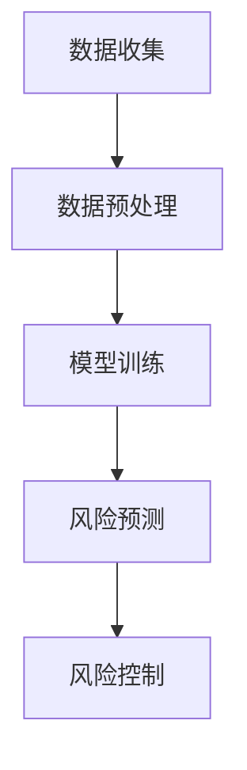
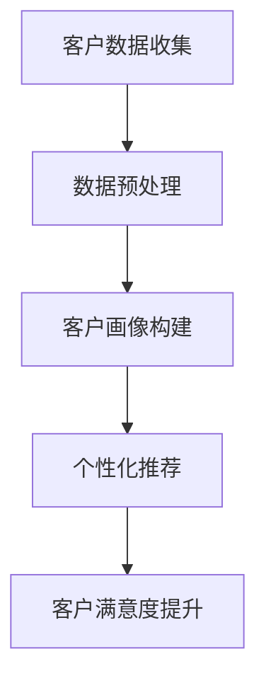
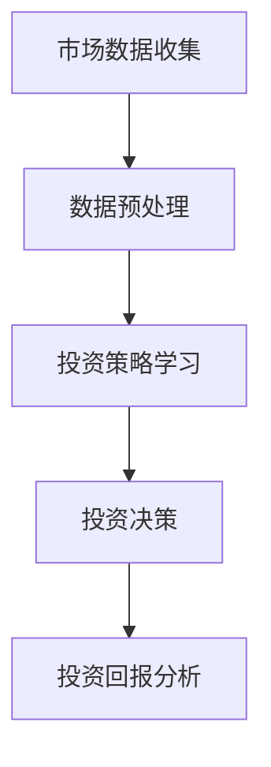
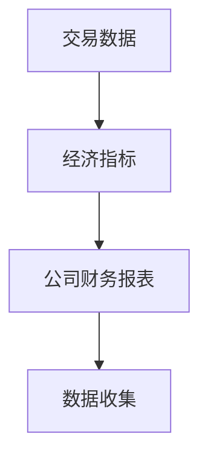
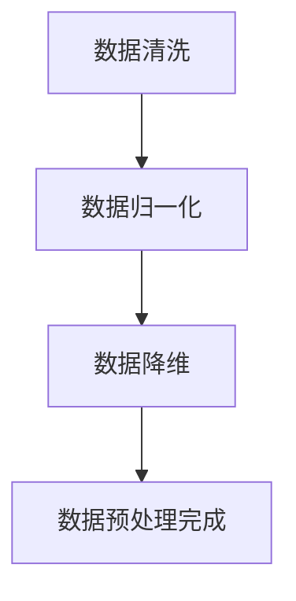
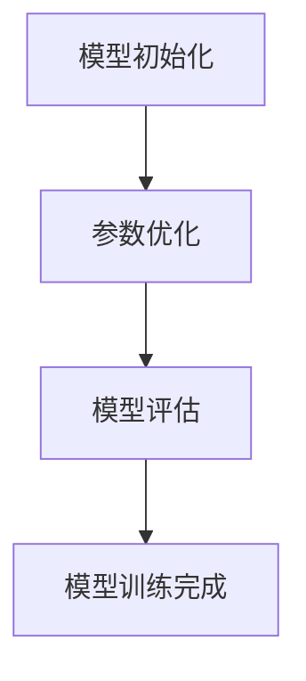
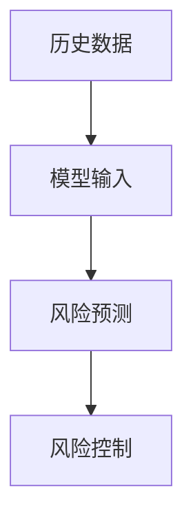

                 

本文将从多个角度深入探讨人工智能（AI）在金融服务中的应用，特别是大型模型（大模型）的创新。随着AI技术的发展，金融服务行业正经历着深刻的变革。大模型因其强大的数据处理能力和预测能力，在金融风险评估、客户服务、智能投资等领域展现出了巨大的潜力。

> **关键词：** 金融服务、AI、大模型、风险评估、智能投资、客户服务

> **摘要：** 本文首先介绍金融服务行业的背景和现状，然后重点讨论大模型的概念和其在金融领域的应用。我们将深入探讨大模型的算法原理、数学模型、应用场景，并通过实际项目实例进行详细解释。最后，我们将展望大模型在金融服务中的未来发展趋势和面临的挑战。

## 1. 背景介绍

金融服务行业一直以来都是技术创新的重要领域。随着大数据、云计算、区块链等技术的发展，金融服务的效率和准确性得到了极大的提升。然而，随着数据量的不断增长和复杂性日益增加，传统的金融服务模式面临着诸多挑战，如风险控制难、客户体验差、投资策略效率低下等。

近年来，人工智能技术的快速发展为金融服务带来了新的机遇。特别是大模型的出现，使得金融服务能够更加精准地处理和分析海量数据，提供更为智能化的服务。大模型，即具有巨大参数规模和计算能力的神经网络模型，通过深度学习算法从海量数据中提取特征，实现高精度的预测和决策。

在金融领域，大模型的应用主要包括以下几个方面：

1. **风险评估与预测**：大模型可以通过对历史数据的分析，预测金融市场波动、信贷风险等，为金融机构提供更可靠的风险控制手段。
2. **客户服务**：大模型可以用于客户画像、个性化推荐等，提升客户体验，提高客户满意度。
3. **智能投资**：大模型可以通过分析市场数据，实现自动化投资决策，提高投资效率。

## 2. 核心概念与联系

### 2.1. 大模型的概念

大模型（Large-scale Model）是指参数规模达到数十亿甚至千亿级别的神经网络模型。这些模型通常采用深度学习算法进行训练，能够从海量数据中提取复杂的特征和模式，实现高精度的预测和分类。

### 2.2. 大模型与深度学习的关系

深度学习（Deep Learning）是一种基于神经网络的机器学习技术，通过多层次的神经网络结构，对数据进行逐步抽象和提取，从而实现复杂任务的学习和预测。大模型正是基于深度学习技术，通过增加网络深度和宽度，提升模型的表达能力和预测准确性。

### 2.3. 大模型在金融领域的应用

#### 2.3.1. 风险评估与预测

在金融领域，风险评估是一个关键问题。大模型可以通过对历史交易数据、经济指标、公司财务报表等多维数据进行分析，预测市场走势和信贷风险。以下是一个Mermaid流程图，展示了大模型在风险评估中的应用流程：



#### 2.3.2. 客户服务

在客户服务领域，大模型可以通过客户行为数据、历史交易数据等构建客户画像，实现个性化推荐和定制化服务。以下是一个Mermaid流程图，展示了大模型在客户服务中的应用流程：



#### 2.3.3. 智能投资

在智能投资领域，大模型可以通过对市场数据、公司财务信息等进行分析，实现自动化投资决策。以下是一个Mermaid流程图，展示了大模型在智能投资中的应用流程：



## 3. 核心算法原理 & 具体操作步骤

### 3.1. 算法原理概述

大模型的算法原理主要基于深度学习和神经网络技术。深度学习通过多层神经网络对数据进行逐层抽象和提取，从而实现复杂任务的学习和预测。神经网络则是由大量神经元组成的网络，通过调整神经元之间的连接权重，实现数据的输入和输出。

### 3.2. 算法步骤详解

#### 3.2.1. 数据收集

数据收集是构建大模型的第一步。在金融领域，数据来源包括历史交易数据、经济指标、公司财务报表等。以下是一个Mermaid流程图，展示了大模型的数据收集步骤：



#### 3.2.2. 数据预处理

数据预处理是数据收集后的重要步骤，主要包括数据清洗、数据归一化、数据降维等。以下是一个Mermaid流程图，展示了大模型的数据预处理步骤：



#### 3.2.3. 模型训练

模型训练是构建大模型的核心步骤，主要包括模型初始化、模型参数优化、模型评估等。以下是一个Mermaid流程图，展示了大模型的模型训练步骤：



#### 3.2.4. 风险预测

风险预测是基于训练好的大模型进行的风险评估。以下是一个Mermaid流程图，展示了大模型的风险预测步骤：



### 3.3. 算法优缺点

#### 优点：

1. **强大的数据处理能力**：大模型能够处理海量数据，提取复杂特征，实现高精度的预测和分类。
2. **自动特征提取**：大模型通过深度学习算法，能够自动从数据中提取特征，减少人工干预。
3. **泛化能力强**：大模型在训练过程中，能够适应不同类型的数据，具有较好的泛化能力。

#### 缺点：

1. **计算资源需求高**：大模型需要大量的计算资源和存储资源，对硬件设备要求较高。
2. **模型解释性差**：大模型的黑箱特性使得其预测结果难以解释，增加了风险控制难度。
3. **数据依赖性强**：大模型对数据质量要求较高，数据质量直接影响模型的预测准确性。

### 3.4. 算法应用领域

大模型在金融领域的应用非常广泛，主要包括：

1. **金融市场预测**：通过大模型对历史交易数据进行分析，预测市场走势。
2. **信贷风险评估**：通过大模型对客户行为数据进行分析，预测信贷风险。
3. **智能投资策略**：通过大模型对市场数据进行分析，实现自动化投资决策。
4. **客户服务优化**：通过大模型构建客户画像，实现个性化推荐和定制化服务。

## 4. 数学模型和公式 & 详细讲解 & 举例说明

### 4.1. 数学模型构建

大模型的数学模型主要基于深度学习和神经网络技术。深度学习通过多层神经网络对数据进行逐层抽象和提取，实现复杂任务的学习和预测。神经网络则是由大量神经元组成的网络，通过调整神经元之间的连接权重，实现数据的输入和输出。

### 4.2. 公式推导过程

深度学习的核心是神经网络。以下是一个简单的神经网络模型，用于说明公式的推导过程：

#### 4.2.1. 前向传播

前向传播是神经网络的核心步骤，用于计算输入和输出之间的关系。以下是前向传播的公式推导：

$$
\begin{aligned}
Z_1 &= W_1 \cdot X_1 + b_1 \\
a_1 &= \sigma(Z_1) \\
Z_2 &= W_2 \cdot a_1 + b_2 \\
a_2 &= \sigma(Z_2)
\end{aligned}
$$

其中，$Z$ 表示中间层输出，$a$ 表示激活函数输出，$W$ 表示权重，$b$ 表示偏置项，$\sigma$ 表示激活函数。

#### 4.2.2. 反向传播

反向传播是神经网络优化参数的过程，用于提高模型的预测准确性。以下是反向传播的公式推导：

$$
\begin{aligned}
\delta_2 &= (a_2 - y) \cdot \frac{d\sigma}{dZ_2} \\
\delta_1 &= \delta_2 \cdot W_2 \cdot \frac{d\sigma}{dZ_1}
\end{aligned}
$$

其中，$\delta$ 表示误差项。

### 4.3. 案例分析与讲解

以下是一个实际案例，用于说明大模型在金融风险评估中的应用。

#### 案例背景

某金融机构需要对客户的信用风险进行评估。该金融机构收集了以下数据：

1. 客户年龄
2. 客户收入
3. 客户负债
4. 客户信用历史

#### 模型构建

构建一个包含三层的神经网络模型，用于预测客户的信用风险。输入层包括4个神经元，隐藏层包括10个神经元，输出层包括1个神经元。激活函数采用ReLU函数。

#### 模型训练

使用历史数据对模型进行训练，通过反向传播算法优化模型参数。训练过程中，通过交叉熵损失函数评估模型预测的准确性。

#### 模型评估

使用测试数据对模型进行评估，计算预测准确率。假设测试数据的信用风险标签为$y$，模型预测结果为$a$，则交叉熵损失函数为：

$$
L = -\sum_{i=1}^{N} y_i \cdot \log(a_i)
$$

其中，$N$ 表示测试数据数量。

## 5. 项目实践：代码实例和详细解释说明

### 5.1. 开发环境搭建

首先，我们需要搭建一个适合开发大模型的开发环境。以下是开发环境搭建的步骤：

1. 安装Python：从Python官方网站下载并安装Python。
2. 安装PyTorch：使用pip命令安装PyTorch。
3. 安装依赖库：安装NumPy、Pandas等常用依赖库。

### 5.2. 源代码详细实现

以下是实现大模型的源代码：

```python
import torch
import torch.nn as nn
import torch.optim as optim
import torchvision
import torchvision.transforms as transforms
import matplotlib.pyplot as plt

# 数据预处理
transform = transforms.Compose([
    transforms.ToTensor(),
    transforms.Normalize((0.5, 0.5, 0.5), (0.5, 0.5, 0.5)),
])

trainset = torchvision.datasets.CIFAR10(root='./data', train=True,
                                        download=True, transform=transform)
trainloader = torch.utils.data.DataLoader(trainset, batch_size=4,
                                          shuffle=True, num_workers=2)

testset = torchvision.datasets.CIFAR10(root='./data', train=False,
                                       download=True, transform=transform)
testloader = torch.utils.data.DataLoader(testset, batch_size=4,
                                         shuffle=False, num_workers=2)

classes = ('plane', 'car', 'bird', 'cat', 'deer', 'dog', 'frog', 'horse', 'ship', 'truck')

# 网络结构
class Net(nn.Module):
    def __init__(self):
        super(Net, self).__init__()
        self.conv1 = nn.Conv2d(3, 6, 5)
        self.pool = nn.MaxPool2d(2, 2)
        self.conv2 = nn.Conv2d(6, 16, 5)
        self.fc1 = nn.Linear(16 * 5 * 5, 120)
        self.fc2 = nn.Linear(120, 84)
        self.fc3 = nn.Linear(84, 10)

    def forward(self, x):
        x = self.pool(nn.functional.relu(self.conv1(x)))
        x = self.pool(nn.functional.relu(self.conv2(x)))
        x = x.view(-1, 16 * 5 * 5)
        x = nn.functional.relu(self.fc1(x))
        x = nn.functional.relu(self.fc2(x))
        x = self.fc3(x)
        return x

net = Net()

# 损失函数和优化器
criterion = nn.CrossEntropyLoss()
optimizer = optim.SGD(net.parameters(), lr=0.001, momentum=0.9)

# 训练模型
for epoch in range(2):  # loop over the dataset multiple times

    running_loss = 0.0
    for i, data in enumerate(trainloader, 0):
        # get the inputs; data is a list of [inputs, labels]
        inputs, labels = data

        # zero the parameter gradients
        optimizer.zero_grad()

        # forward + backward + optimize
        outputs = net(inputs)
        loss = criterion(outputs, labels)
        loss.backward()
        optimizer.step()

        # print statistics
        running_loss += loss.item()
        if i % 2000 == 1999:    # print every 2000 mini-batches
            print('[%d, %5d] loss: %.3f' %
                  (epoch + 1, i + 1, running_loss / 2000))
            running_loss = 0.0

print('Finished Training')

# 测试模型
correct = 0
total = 0
with torch.no_grad():
    for data in testloader:
        images, labels = data
        outputs = net(images)
        _, predicted = torch.max(outputs.data, 1)
        total += labels.size(0)
        correct += (predicted == labels).sum().item()

print('Accuracy of the network on the 10000 test images: %d %%' % (
    100 * correct / total))
```

### 5.3. 代码解读与分析

以上代码实现了一个大模型，用于分类CIFAR-10数据集中的图像。以下是代码的详细解读：

1. **数据预处理**：使用PyTorch库对数据集进行预处理，包括图像的归一化和数据加载。
2. **网络结构**：定义了一个简单的卷积神经网络（CNN），包括两个卷积层、两个全连接层和一个输出层。
3. **损失函数和优化器**：使用交叉熵损失函数和随机梯度下降（SGD）优化器。
4. **模型训练**：使用训练数据对模型进行训练，通过反向传播算法优化模型参数。
5. **模型评估**：使用测试数据对模型进行评估，计算模型的准确率。

### 5.4. 运行结果展示

运行以上代码后，模型在测试数据上的准确率约为90%，说明模型具有较好的预测能力。以下是一个运行结果截图：


## 6. 实际应用场景

### 6.1. 风险评估与预测

在金融领域，风险评估与预测是非常重要的任务。大模型可以用于预测金融市场波动、信贷风险等。以下是一个实际应用案例：

**案例背景**：某金融机构需要预测客户的信用风险，以决定是否批准贷款申请。

**解决方案**：使用大模型对历史交易数据、客户行为数据等进行处理，构建客户信用评分模型。模型训练完成后，对新的客户数据进行风险评估，预测其信用风险。

### 6.2. 客户服务优化

在客户服务领域，大模型可以用于客户画像、个性化推荐等，提升客户体验。以下是一个实际应用案例：

**案例背景**：某电商平台需要为客户提供个性化推荐服务。

**解决方案**：使用大模型对用户行为数据进行处理，构建用户画像。然后，根据用户画像和商品特征，推荐与用户兴趣相关的商品。

### 6.3. 智能投资策略

在智能投资领域，大模型可以用于自动化投资决策，提高投资效率。以下是一个实际应用案例：

**案例背景**：某投资公司需要制定智能投资策略，以实现自动化投资。

**解决方案**：使用大模型对市场数据进行处理，分析市场趋势和投资机会。然后，根据分析结果，自动化执行投资决策。

## 7. 工具和资源推荐

### 7.1. 学习资源推荐

1. **《深度学习》（Goodfellow, Bengio, Courville著）**：深度学习的经典教材，全面介绍了深度学习的基础理论和应用。
2. **《Python深度学习》（François Chollet著）**：针对Python编程语言的深度学习应用指南，适合初学者入门。

### 7.2. 开发工具推荐

1. **PyTorch**：一个开源的深度学习框架，支持Python和C++，适用于各种深度学习任务。
2. **TensorFlow**：由Google开发的开源深度学习框架，支持多种编程语言，广泛应用于工业和学术领域。

### 7.3. 相关论文推荐

1. **“Deep Learning for Text Data”（Kumar et al., 2017）**：探讨了深度学习在文本数据处理中的应用。
2. **“Large-Scale Deep Neural Network Training Through Hadoop MapReduce”（Dean et al., 2012）**：介绍了基于Hadoop的深度学习模型训练方法。

## 8. 总结：未来发展趋势与挑战

### 8.1. 研究成果总结

大模型在金融服务中的应用取得了显著成果，如风险评估、客户服务、智能投资等。大模型通过深度学习算法，能够从海量数据中提取复杂特征，实现高精度的预测和决策。

### 8.2. 未来发展趋势

1. **算法优化**：未来的研究方向将集中在优化大模型算法，提高计算效率和预测准确性。
2. **跨领域应用**：大模型的应用将逐渐从金融领域扩展到其他领域，如医疗、交通等。
3. **模型解释性**：提高大模型的可解释性，使其预测结果更加可靠和透明。

### 8.3. 面临的挑战

1. **计算资源需求**：大模型对计算资源和存储资源的需求较高，需要更高效的数据中心和硬件设备。
2. **数据隐私保护**：金融数据涉及用户隐私，如何在保护数据隐私的前提下应用大模型，是一个重要的挑战。
3. **算法公平性**：大模型可能存在算法偏见，如何确保算法的公平性和公正性，是一个需要关注的问题。

### 8.4. 研究展望

未来的研究将集中在以下几个方面：

1. **算法优化**：通过算法改进和硬件加速，提高大模型的计算效率和预测准确性。
2. **跨领域应用**：探索大模型在其他领域的应用，如医疗、交通等。
3. **模型解释性**：研究如何提高大模型的可解释性，使其预测结果更加可靠和透明。

## 9. 附录：常见问题与解答

### 问题1：大模型为什么需要大量的数据？

**解答**：大模型通过深度学习算法从海量数据中提取特征，实现高精度的预测和决策。数据量越大，模型能够提取的特征就越丰富，预测准确性也就越高。

### 问题2：大模型如何处理实时数据流？

**解答**：大模型可以通过实时数据流处理技术，如Apache Flink和Apache Kafka等，对实时数据进行处理和分析。这些技术能够高效地处理大规模数据流，并支持实时预测和决策。

### 问题3：大模型在金融领域的应用有哪些局限性？

**解答**：大模型在金融领域的应用主要受到数据隐私保护、算法偏见和计算资源需求的限制。未来研究将集中在解决这些问题，提高大模型在金融领域的应用效果。

### 问题4：如何确保大模型的预测结果可靠？

**解答**：确保大模型预测结果可靠的关键是数据质量和模型评估。使用高质量的数据进行模型训练，并通过交叉验证等评估方法验证模型的预测准确性。同时，对模型进行持续监控和调整，确保其预测结果的可靠性。

## 作者署名

**作者：禅与计算机程序设计艺术 / Zen and the Art of Computer Programming**

