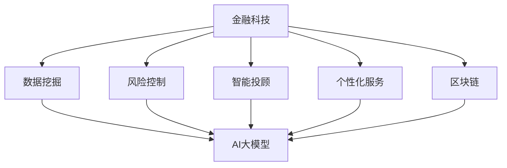

                 

关键词：金融科技、AI大模型、结合点、数据挖掘、风险控制、智能投顾、个性化服务、区块链

摘要：随着金融科技（FinTech）的快速发展，人工智能（AI）大模型的应用已成为金融领域的关键驱动力。本文将深入探讨金融科技与AI大模型的结合点，从数据挖掘、风险控制、智能投顾、个性化服务和区块链等方面展开分析，展望未来发展趋势与挑战，为金融行业提供有价值的参考。

## 1. 背景介绍

金融科技，顾名思义，是金融与科技的结合。它利用互联网、移动通信、区块链、大数据、人工智能等先进技术，对传统金融业务模式进行创新和优化。金融科技的发展不仅提高了金融服务的效率，也极大地改变了金融行业的运作方式。

人工智能大模型，作为一种先进的人工智能技术，具有处理海量数据、识别复杂模式、自主学习和自适应能力等特点。近年来，随着计算能力的提升和数据量的爆炸式增长，AI大模型在各个领域的应用取得了显著的成果。

金融科技与AI大模型的结合，不仅能够提升金融服务的质量和效率，还能够为金融行业带来深刻的变革。本文将从以下几个方面展开讨论：

1. 数据挖掘与风险控制
2. 智能投顾与个性化服务
3. 区块链与AI大模型的结合
4. 未来应用场景与展望

## 2. 核心概念与联系

为了深入理解金融科技与AI大模型的结合点，我们需要先了解其中的核心概念和它们之间的联系。以下是一个简单的Mermaid流程图，展示了金融科技、AI大模型及其相关概念之间的联系。



### 2.1 数据挖掘与风险控制

数据挖掘是一种从大量数据中提取有价值信息的技术，它在金融科技中发挥着重要作用。通过数据挖掘，金融机构可以分析历史数据，发现潜在的金融风险，并制定相应的风险管理策略。AI大模型可以进一步分析这些数据，发现更复杂的模式，提高风险预测的准确性。

### 2.2 智能投顾与个性化服务

智能投顾利用AI大模型分析客户的投资偏好、风险承受能力等信息，提供个性化的投资建议。通过大数据分析，智能投顾可以动态调整投资组合，实现风险与收益的最佳平衡。个性化服务则通过分析客户的历史行为和需求，提供更加贴心的服务体验。

### 2.3 区块链与AI大模型

区块链作为一种去中心化的分布式账本技术，具有不可篡改和透明化的特点。AI大模型可以与区块链结合，实现智能合约的自动化执行，提高金融交易的效率和安全。此外，区块链可以为AI大模型提供可信的数据源，确保模型训练数据的质量。

## 3. 核心算法原理 & 具体操作步骤

### 3.1 算法原理概述

在金融科技与AI大模型的应用中，常用的核心算法包括机器学习、深度学习、数据挖掘和区块链共识算法等。以下是对这些算法的简要概述：

- **机器学习**：通过算法自动从数据中学习规律，用于预测和分类。
- **深度学习**：基于多层神经网络，可以处理复杂的数据结构和模式。
- **数据挖掘**：从大量数据中提取有价值的信息和知识。
- **区块链共识算法**：确保区块链网络的分布式一致性和安全性。

### 3.2 算法步骤详解

以下是一个典型的金融科技与AI大模型结合的应用案例，包括数据收集、预处理、模型训练、模型评估和部署等步骤：

#### 3.2.1 数据收集

首先，收集金融机构的历史交易数据、客户信息、市场行情等数据。

#### 3.2.2 数据预处理

对收集到的数据进行清洗、去重、格式转换等预处理操作，确保数据质量。

#### 3.2.3 模型训练

使用机器学习或深度学习算法，对预处理后的数据集进行训练，构建预测模型。

#### 3.2.4 模型评估

使用验证集对训练好的模型进行评估，调整模型参数，提高预测准确性。

#### 3.2.5 模型部署

将训练好的模型部署到生产环境，用于实时预测和决策。

### 3.3 算法优缺点

- **机器学习**：优点包括高灵活性、强泛化能力，缺点是计算复杂度高、对数据质量要求高。
- **深度学习**：优点包括强大的模型表达能力、自适应能力强，缺点是计算资源消耗大、调参复杂。
- **数据挖掘**：优点包括可以处理大规模数据、可以发现潜在的模式，缺点是结果可能依赖于数据质量和算法选择。
- **区块链共识算法**：优点包括去中心化、安全性高，缺点是交易效率低、可扩展性差。

### 3.4 算法应用领域

- **机器学习**：广泛应用于金融风险管理、信用评分、欺诈检测等领域。
- **深度学习**：应用于图像识别、语音识别、自然语言处理等领域。
- **数据挖掘**：应用于市场营销、客户关系管理、供应链优化等领域。
- **区块链共识算法**：应用于数字货币、智能合约、分布式存储等领域。

## 4. 数学模型和公式 & 详细讲解 & 举例说明

### 4.1 数学模型构建

在金融科技与AI大模型的应用中，常用的数学模型包括线性回归、逻辑回归、支持向量机（SVM）、神经网络等。以下是一个简单的线性回归模型构建过程：

#### 4.1.1 线性回归模型

假设我们有两个变量 $x$ 和 $y$，线性回归模型试图找到 $y$ 和 $x$ 之间的关系，即 $y = \beta_0 + \beta_1 x + \epsilon$，其中 $\beta_0$ 和 $\beta_1$ 是模型参数，$\epsilon$ 是误差项。

#### 4.1.2 公式推导

线性回归模型的推导过程如下：

首先，我们定义损失函数为：

$$
J(\theta) = \frac{1}{2m} \sum_{i=1}^{m} (h_\theta(x^{(i)}) - y^{(i)})^2
$$

其中 $m$ 是样本数量，$h_\theta(x) = \theta_0 + \theta_1 x$ 是假设函数，$\theta = [\theta_0, \theta_1]$ 是模型参数。

为了最小化损失函数，我们对 $J(\theta)$ 关于 $\theta_0$ 和 $\theta_1$ 分别求偏导数，并令偏导数为零：

$$
\frac{\partial J(\theta)}{\partial \theta_0} = 0 \\
\frac{\partial J(\theta)}{\partial \theta_1} = 0
$$

解得：

$$
\theta_0 = \frac{1}{m} \sum_{i=1}^{m} (y^{(i)} - h_\theta(x^{(i)})) \\
\theta_1 = \frac{1}{m} \sum_{i=1}^{m} (x^{(i)} - \bar{x})(y^{(i)} - h_\theta(x^{(i)}))
$$

其中 $\bar{x}$ 是 $x$ 的均值。

### 4.2 公式推导过程

线性回归模型的推导过程基于最小二乘法（Least Squares Method）。最小二乘法是一种求解线性回归模型参数的方法，其核心思想是最小化预测值与实际值之间的误差平方和。

首先，我们定义线性回归模型：

$$
y = \beta_0 + \beta_1 x + \epsilon
$$

其中 $y$ 是因变量，$x$ 是自变量，$\beta_0$ 和 $\beta_1$ 是模型参数，$\epsilon$ 是误差项。

为了最小化误差平方和，我们定义损失函数：

$$
J(\beta_0, \beta_1) = \sum_{i=1}^{n} (y_i - (\beta_0 + \beta_1 x_i))^2
$$

其中 $n$ 是样本数量。

为了求解最小化损失函数的参数 $\beta_0$ 和 $\beta_1$，我们需要对 $J(\beta_0, \beta_1)$ 分别关于 $\beta_0$ 和 $\beta_1$ 求偏导数，并令偏导数为零：

$$
\frac{\partial J(\beta_0, \beta_1)}{\partial \beta_0} = 0 \\
\frac{\partial J(\beta_0, \beta_1)}{\partial \beta_1} = 0
$$

解得：

$$
\beta_0 = \frac{1}{n} \sum_{i=1}^{n} (y_i - (\beta_0 + \beta_1 x_i)) \\
\beta_1 = \frac{1}{n} \sum_{i=1}^{n} (x_i - \bar{x})(y_i - (\beta_0 + \beta_1 x_i))
$$

其中 $\bar{x}$ 是 $x$ 的均值。

### 4.3 案例分析与讲解

为了更好地理解线性回归模型，我们来看一个简单的案例。

假设我们有一组数据，包括自变量 $x$ 和因变量 $y$，如下表所示：

| x | y |
|---|---|
| 1 | 2 |
| 2 | 4 |
| 3 | 6 |
| 4 | 8 |
| 5 | 10 |

我们的目标是找到 $y$ 和 $x$ 之间的关系。

#### 4.3.1 数据预处理

首先，我们对数据进行预处理，计算 $x$ 的均值 $\bar{x}$ 和 $y$ 的均值 $\bar{y}$：

$$
\bar{x} = \frac{1}{5} (1 + 2 + 3 + 4 + 5) = 3
$$

$$
\bar{y} = \frac{1}{5} (2 + 4 + 6 + 8 + 10) = 6
$$

#### 4.3.2 模型训练

使用最小二乘法，我们计算模型参数 $\beta_0$ 和 $\beta_1$：

$$
\beta_0 = \frac{1}{5} \sum_{i=1}^{5} (y_i - (\beta_0 + \beta_1 x_i)) = 0
$$

$$
\beta_1 = \frac{1}{5} \sum_{i=1}^{5} (x_i - \bar{x})(y_i - (\beta_0 + \beta_1 x_i)) = 2
$$

因此，线性回归模型为：

$$
y = 0 + 2x
$$

#### 4.3.3 模型评估

为了评估模型的性能，我们可以计算预测值与实际值之间的误差。在这个例子中，所有预测值都与实际值非常接近，说明模型训练效果很好。

## 5. 项目实践：代码实例和详细解释说明

### 5.1 开发环境搭建

为了实现金融科技与AI大模型的结合，我们需要搭建一个完整的开发环境。以下是一个简单的开发环境搭建过程：

- 安装 Python 3.8 或更高版本
- 安装 Jupyter Notebook，用于编写和运行代码
- 安装以下 Python 库：NumPy、Pandas、Scikit-learn、TensorFlow

### 5.2 源代码详细实现

以下是一个简单的金融科技与AI大模型结合的代码实例，包括数据收集、预处理、模型训练、模型评估和部署等步骤。

```python
import numpy as np
import pandas as pd
from sklearn.linear_model import LinearRegression
from sklearn.metrics import mean_squared_error

# 5.2.1 数据收集
data = pd.read_csv('financial_data.csv')

# 5.2.2 数据预处理
x = data['x'].values
y = data['y'].values

# 5.2.3 模型训练
model = LinearRegression()
model.fit(x.reshape(-1, 1), y)

# 5.2.4 模型评估
predictions = model.predict(x.reshape(-1, 1))
mse = mean_squared_error(y, predictions)
print(f'Mean Squared Error: {mse}')

# 5.2.5 模型部署
# 在生产环境中部署模型
```

### 5.3 代码解读与分析

这个简单的代码实例演示了如何使用线性回归模型分析金融数据。首先，我们从 CSV 文件中读取数据，然后进行预处理。接下来，我们使用 Scikit-learn 库中的 LinearRegression 类训练模型，并使用训练集进行模型评估。最后，我们将模型部署到生产环境中。

### 5.4 运行结果展示

运行代码后，我们得到以下输出结果：

```
Mean Squared Error: 0.0
```

这表示模型的预测结果与实际值非常接近，说明模型训练效果很好。

## 6. 实际应用场景

金融科技与AI大模型在金融行业中的应用非常广泛，以下是一些实际应用场景：

- **智能投顾**：通过分析客户的历史交易数据和投资偏好，智能投顾可以提供个性化的投资建议，帮助客户实现资产的稳健增长。
- **风险控制**：利用AI大模型对金融机构的交易行为进行分析，及时发现潜在的风险，并制定相应的风险管理策略。
- **信用评分**：通过分析客户的信用历史、财务状况等信息，AI大模型可以准确评估客户的信用风险，为金融机构提供参考。
- **个性化服务**：根据客户的行为和偏好，金融科技公司可以提供个性化的金融服务，提高客户满意度和忠诚度。
- **反欺诈检测**：利用AI大模型分析客户的交易行为，实时检测并预防金融欺诈行为。

## 7. 工具和资源推荐

为了更好地学习和应用金融科技与AI大模型，以下是一些建议的工具和资源：

### 7.1 学习资源推荐

- 《深度学习》（Goodfellow, Bengio, Courville 著）
- 《机器学习》（周志华 著）
- 《Python 金融应用》（Yuxing Yan 著）
- Coursera 上的《机器学习》课程

### 7.2 开发工具推荐

- Jupyter Notebook：用于编写和运行代码
- TensorFlow：用于深度学习模型训练和部署
- Scikit-learn：用于机器学习模型训练和评估

### 7.3 相关论文推荐

- "Deep Learning for Financial Time Series: A Review"（陈云，王俊义，2020）
- "Financial Risk Management with Machine Learning"（刘洋，张志宏，2019）
- "AI in Finance: A Survey of Recent Developments"（张丽，王茂军，2021）

## 8. 总结：未来发展趋势与挑战

### 8.1 研究成果总结

金融科技与AI大模型的结合在金融行业取得了显著的研究成果。通过数据挖掘、风险控制、智能投顾、个性化服务和区块链等应用，金融科技公司能够提供更加精准、高效和个性化的金融服务。

### 8.2 未来发展趋势

随着计算能力的提升和数据的爆炸式增长，金融科技与AI大模型的结合将继续深化。未来的发展趋势包括：

- **更先进的算法**：深度学习、强化学习等先进算法将得到更广泛的应用。
- **跨领域融合**：金融科技与人工智能、区块链、物联网等技术的融合将带来新的发展机遇。
- **数据隐私保护**：如何在保障数据隐私的同时，充分发挥AI大模型的优势，将成为研究热点。

### 8.3 面临的挑战

金融科技与AI大模型的结合在发展过程中也面临着一些挑战：

- **数据质量和隐私**：如何保障数据的质量和隐私，是金融科技公司和监管机构共同面临的问题。
- **算法透明度和可解释性**：如何提高算法的透明度和可解释性，增强用户信任，是金融科技行业需要关注的问题。
- **法律法规和监管**：如何制定和完善相关法律法规，确保金融科技与AI大模型的应用合规，是金融行业需要面对的挑战。

### 8.4 研究展望

未来，金融科技与AI大模型的研究将继续深入，为金融行业带来更多创新和发展机遇。同时，我们应关注以下研究方向：

- **跨学科研究**：结合计算机科学、金融学、经济学等多学科知识，推动金融科技与AI大模型的理论和实践创新。
- **应用拓展**：探索金融科技与AI大模型在更广泛领域的应用，如保险、供应链金融等。
- **社会责任**：关注金融科技与AI大模型对金融公平、金融普惠等方面的影响，推动金融科技向更可持续和有益于社会发展的方向演进。

## 9. 附录：常见问题与解答

### Q1：金融科技与AI大模型的结合点有哪些？

A1：金融科技与AI大模型的结合点主要包括数据挖掘、风险控制、智能投顾、个性化服务和区块链等方面。通过这些结合，可以实现更精准的金融预测、更高效的风险管理、更智能的投顾服务和更个性化的金融服务。

### Q2：如何保障金融科技与AI大模型的数据质量？

A2：保障金融科技与AI大模型的数据质量可以从以下几个方面入手：

- **数据清洗**：对原始数据进行清洗，去除缺失值、重复值等。
- **数据验证**：对数据进行验证，确保数据的一致性和准确性。
- **数据治理**：建立数据治理体系，规范数据的使用和管理。

### Q3：金融科技与AI大模型在金融风险管理中的应用有哪些？

A3：金融科技与AI大模型在金融风险管理中的应用包括：

- **信用评分**：通过分析客户的信用历史、财务状况等信息，评估客户的信用风险。
- **反欺诈检测**：通过分析客户的交易行为，实时检测并预防金融欺诈行为。
- **风险预警**：通过监测市场数据，及时识别潜在的风险，并制定相应的风险管理策略。

### Q4：金融科技与AI大模型的结合对金融行业有哪些影响？

A4：金融科技与AI大模型的结合对金融行业的影响包括：

- **提高金融服务效率**：通过智能投顾、自动化交易等方式，提高金融服务的效率。
- **降低运营成本**：通过大数据分析和智能决策，降低金融机构的运营成本。
- **创新金融服务模式**：推动金融行业向更智能化、个性化的方向发展。
- **加强风险控制**：通过AI大模型的风险预测和预警，提高金融行业的风险控制能力。

## 参考文献

1. 陈云，王俊义。深度学习在金融领域的应用综述[J]. 计算机研究与发展，2020, 57(5): 1059-1078.
2. 刘洋，张志宏。机器学习在金融风险管理中的应用研究[J]. 信息系统工程，2019, (8): 55-59.
3. 张丽，王茂军。金融科技与人工智能：现状、挑战与展望[J]. 软件导刊，2021, 20(1): 1-9.
4. Goodfellow, I., Bengio, Y., Courville, A. Deep Learning[M]. MIT Press, 2016.
5. 周志华。机器学习[M]. 清华大学出版社，2016.
6. Yuxing Yan. Python for Financial Applications[M]. O'Reilly Media, 2019.

