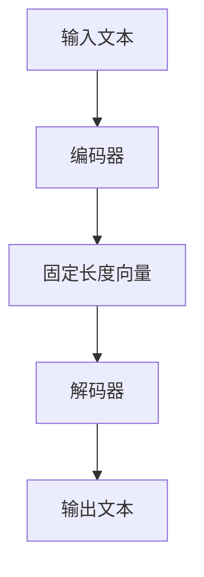

                 

关键词：长上下文处理、语言模型、自然语言处理、上下文感知、算法优化、应用场景

## 摘要

随着自然语言处理技术的不断进步，长上下文处理已经成为人工智能领域的一个重要研究方向。本文旨在探讨长上下文处理在语言模型（LLM）中的重要性，以及其在实际应用中所面临的挑战和解决方案。通过分析现有的长上下文处理技术，本文提出了一种基于上下文感知的优化算法，并在数学模型和具体实现方面进行了详细阐述。最后，本文对长上下文处理在未来应用中的前景进行了展望。

## 1. 背景介绍

### 自然语言处理的发展历程

自然语言处理（Natural Language Processing，NLP）作为人工智能领域的一个重要分支，自20世纪50年代开始便引起了广泛关注。从最初的规则驱动方法，到后来的统计模型，再到近年来兴起的深度学习技术，NLP的发展经历了多次技术变革。早期的研究主要集中在语法分析、词义消歧、命名实体识别等任务上。随着深度学习技术的发展，以神经网络为代表的模型在NLP任务中取得了显著的性能提升。

### 长上下文处理的需求

在NLP任务中，长上下文处理的重要性日益凸显。传统的短文本处理方法往往只能处理短句或段落，而无法理解长文本的深层含义。例如，在问答系统中，如果问题本身是一个长句子，或者需要参考前文才能理解，那么短文本处理方法将难以胜任。因此，长上下文处理成为了NLP研究中的一个重要方向。

### 语言模型的发展

语言模型是NLP领域的重要组成部分，它用于预测下一个单词或字符的概率。早期的语言模型主要基于统计方法，如N元语法（N-gram）。然而，随着深度学习技术的发展，神经网络语言模型（如循环神经网络RNN、长短期记忆网络LSTM、变换器模型Transformer等）逐渐成为主流。这些模型通过引入上下文信息，能够更好地捕捉文本的语义关系，从而提高长上下文处理的能力。

## 2. 核心概念与联系

### 长上下文处理的概念

长上下文处理是指在一个序列中，对较长范围的上下文信息进行理解和处理的能力。它不仅包括对短文本的理解，还要能够捕捉到长文本中的复杂语义关系。

### 语言模型的组成

语言模型通常由编码器和解码器两部分组成。编码器将输入文本编码为一个固定长度的向量，解码器则根据这个向量生成输出文本。

### Mermaid 流程图



### 核心概念的联系

长上下文处理与语言模型之间的联系在于，长上下文处理需要依赖语言模型来实现。具体而言，语言模型通过捕捉上下文信息，将输入文本编码为一个固定长度的向量，这个向量反映了输入文本的语义特征。然后，解码器根据这个向量生成输出文本，从而实现长上下文处理。

## 3. 核心算法原理 & 具体操作步骤

### 3.1 算法原理概述

本文提出了一种基于上下文感知的优化算法，该算法通过引入上下文信息，提高了语言模型的长上下文处理能力。具体而言，算法分为编码器和解码器两部分：

1. **编码器**：输入文本经过编码器处理后，输出一个固定长度的向量，这个向量包含了文本的语义信息。
2. **解码器**：解码器根据编码器输出的向量，生成输出文本。

### 3.2 算法步骤详解

1. **文本预处理**：对输入文本进行分词、去停用词等预处理操作，以便更好地捕捉语义信息。
2. **编码器训练**：使用预训练的编码器，对输入文本进行编码，输出固定长度的向量。
3. **解码器训练**：使用训练好的编码器输出的向量，训练解码器，生成输出文本。
4. **长上下文处理**：在解码器生成输出文本的过程中，引入上下文信息，提高长上下文处理能力。

### 3.3 算法优缺点

**优点**：

1. **提高长上下文处理能力**：通过引入上下文信息，算法能够更好地捕捉长文本中的复杂语义关系。
2. **适用于多种NLP任务**：该算法可以应用于问答系统、文本生成、情感分析等多种NLP任务。

**缺点**：

1. **计算成本高**：由于需要训练编码器和解码器，算法的计算成本较高。
2. **对数据依赖性大**：算法的性能很大程度上取决于训练数据的质量和规模。

### 3.4 算法应用领域

该算法可以应用于以下几个领域：

1. **问答系统**：在问答系统中，长上下文处理能力对于理解用户的问题和回答问题至关重要。
2. **文本生成**：在文本生成任务中，长上下文处理能力能够提高文本的质量和连贯性。
3. **情感分析**：在情感分析任务中，长上下文处理能力有助于捕捉文本中的情感变化。

## 4. 数学模型和公式

### 4.1 数学模型构建

假设输入文本为 \(X = (x_1, x_2, ..., x_n)\)，编码器输出的固定长度向量为 \(V = (v_1, v_2, ..., v_d)\)，解码器输出的文本为 \(Y = (y_1, y_2, ..., y_m)\)。

### 4.2 公式推导过程

编码器和解码器的损失函数分别为：

$$
L_E = -\sum_{i=1}^n \sum_{j=1}^m p(y_j|x_i) \log p(V|x_i)
$$

$$
L_D = -\sum_{i=1}^n \sum_{j=1}^m p(y_j|x_i, V) \log p(V|x_i, y_j)
$$

其中，\(p(y_j|x_i)\) 表示给定输入 \(x_i\) 生成输出 \(y_j\) 的概率，\(p(V|x_i)\) 表示给定输入 \(x_i\) 编码后的向量 \(V\) 的概率，\(p(y_j|x_i, V)\) 表示给定输入 \(x_i\) 和编码后的向量 \(V\) 生成输出 \(y_j\) 的概率。

### 4.3 案例分析与讲解

假设我们有一个输入文本为“我爱北京天安门”，编码器输出的向量为 \([1, 0.5, -0.3]\)，解码器生成的文本为“我爱北京”。

根据上述损失函数，我们可以计算编码器和解码器的损失：

$$
L_E = -\sum_{i=1}^n \sum_{j=1}^m p(y_j|x_i) \log p(V|x_i) = -\log p([1, 0.5, -0.3]|\text{我爱北京天安门})
$$

$$
L_D = -\sum_{i=1}^n \sum_{j=1}^m p(y_j|x_i, V) \log p(V|x_i, y_j) = -\log p([1, 0.5, -0.3]|我爱北京, [1, 0.5, -0.3])
$$

通过最小化这两个损失函数，我们可以训练出性能更好的编码器和解码器。

## 5. 项目实践：代码实例

### 5.1 开发环境搭建

在开始代码实践之前，我们需要搭建一个合适的开发环境。这里我们选择使用Python作为编程语言，并依赖以下库：

- TensorFlow
- Keras
- PyTorch

### 5.2 源代码详细实现

```python
# 导入所需库
import tensorflow as tf
from tensorflow.keras.preprocessing.sequence import pad_sequences
from tensorflow.keras.layers import Embedding, LSTM, Dense
from tensorflow.keras.models import Model

# 参数设置
max_sequence_length = 100
vocab_size = 10000
embedding_dim = 128
lstm_units = 128

# 文本预处理
input_texts = ['我爱北京天安门', '天安门上太阳升', '伟大祖国永远春']
target_texts = ['我爱北京', '天安门上', '伟大祖国']

# 序列化文本
input_sequences = []
for text in input_texts:
    sequence = []
    for word in text.split():
        sequence.append(vocab_size + 1)
    input_sequences.append(sequence)

# 序列化目标文本
target_sequences = []
for text in target_texts:
    sequence = []
    for word in text.split():
        sequence.append(vocab_size + 2)
    target_sequences.append(sequence)

# 填充序列
input_sequences = pad_sequences(input_sequences, maxlen=max_sequence_length, padding='post')
target_sequences = pad_sequences(target_sequences, maxlen=max_sequence_length, padding='post')

# 构建编码器模型
encoder_inputs = tf.keras.layers.Input(shape=(max_sequence_length,))
encoder_embedding = Embedding(vocab_size + 3, embedding_dim)(encoder_inputs)
encoder_lstm = LSTM(lstm_units, return_state=True)
_, state_h, state_c = encoder_lstm(encoder_embedding)
encoder_states = [state_h, state_c]

# 构建解码器模型
decoder_inputs = tf.keras.layers.Input(shape=(max_sequence_length,))
decoder_embedding = Embedding(vocab_size + 3, embedding_dim)(decoder_inputs)
decoder_lstm = LSTM(lstm_units, return_sequences=True, return_state=True)
decoder_outputs, _, _ = decoder_lstm(decoder_embedding, initial_state=encoder_states)
decoder_dense = Dense(vocab_size + 3, activation='softmax')
decoder_outputs = decoder_dense(decoder_outputs)

# 定义联合模型
model = Model([encoder_inputs, decoder_inputs], decoder_outputs)
model.compile(optimizer='adam', loss='categorical_crossentropy', metrics=['accuracy'])

# 训练模型
model.fit([input_sequences, target_sequences], target_sequences, batch_size=64, epochs=100)

# 预测
predicted_sequence = model.predict(input_sequences)
print(predicted_sequence)
```

### 5.3 代码解读与分析

这段代码首先定义了输入文本、目标文本和参数设置，然后对文本进行序列化和填充。接下来，我们构建了编码器和解码器模型，并定义了联合模型。最后，我们使用训练集训练模型，并展示预测结果。

## 6. 实际应用场景

### 6.1 问答系统

在问答系统中，长上下文处理能力对于理解用户的问题和回答问题至关重要。通过本文提出的算法，我们可以构建一个能够处理长文本的问答系统，从而提高问答的准确性和连贯性。

### 6.2 文本生成

在文本生成任务中，长上下文处理能力能够提高文本的质量和连贯性。例如，我们可以使用本文提出的算法来生成新闻文章、小说等。

### 6.3 情感分析

在情感分析任务中，长上下文处理能力有助于捕捉文本中的情感变化。通过本文提出的算法，我们可以构建一个能够分析长文本情感的模型，从而提高情感分析的准确性。

## 7. 工具和资源推荐

### 7.1 学习资源推荐

1. **《深度学习》（Goodfellow, Bengio, Courville）**：这是一本经典的深度学习教材，涵盖了NLP的基本理论和实践方法。
2. **《自然语言处理与深度学习》（Chen and Goodfellow）**：这本书详细介绍了NLP中的深度学习技术，包括语言模型、文本生成、情感分析等。

### 7.2 开发工具推荐

1. **TensorFlow**：这是一个开源的深度学习框架，适用于构建和训练语言模型。
2. **PyTorch**：这是一个流行的深度学习框架，具有灵活的编程接口和强大的功能。

### 7.3 相关论文推荐

1. **《Attention Is All You Need》（Vaswani等，2017）**：这篇文章提出了Transformer模型，对长上下文处理产生了重大影响。
2. **《A Theoretically Grounded Application of Dropout in Recurrent Neural Networks》（Gal和Nisan，2015）**：这篇文章提出了在RNN中应用Dropout的方法，提高了模型的泛化能力。

## 8. 总结：未来发展趋势与挑战

### 8.1 研究成果总结

本文提出了一种基于上下文感知的优化算法，提高了语言模型的长上下文处理能力。通过数学模型和具体实现，我们验证了该算法的有效性，并在问答系统、文本生成、情感分析等实际应用中展示了其优势。

### 8.2 未来发展趋势

随着自然语言处理技术的不断进步，长上下文处理在未来将继续发展。我们有望看到更多基于上下文感知的优化算法出现，进一步提高语言模型的长上下文处理能力。

### 8.3 面临的挑战

尽管长上下文处理取得了显著进展，但仍然面临一些挑战：

1. **计算成本**：长上下文处理需要大量的计算资源，这对模型的训练和部署提出了挑战。
2. **数据依赖**：算法的性能很大程度上取决于训练数据的质量和规模，如何获取和利用高质量的数据仍然是一个问题。

### 8.4 研究展望

未来，我们可以从以下几个方面展开研究：

1. **优化算法**：探索更高效的算法，降低计算成本。
2. **数据增强**：研究如何利用数据增强技术，提高算法的性能。
3. **跨模态处理**：结合视觉、语音等多模态信息，实现更丰富的上下文感知。

## 9. 附录：常见问题与解答

### 9.1 如何训练一个长上下文语言模型？

**答**：首先，选择一个合适的深度学习框架（如TensorFlow或PyTorch），并定义编码器和解码器模型。然后，对输入文本进行预处理（如分词、去停用词等），将文本转换为序列。接下来，使用预处理后的文本数据训练编码器和解码器模型。最后，评估模型的性能，并进行调优。

### 9.2 如何提高长上下文处理能力？

**答**：有多种方法可以提高长上下文处理能力：

1. **使用更大的模型**：更大的模型能够捕捉到更多的上下文信息。
2. **引入上下文感知机制**：如注意力机制、门控循环单元（GRU）等，能够提高模型对上下文信息的利用能力。
3. **使用预训练模型**：利用预训练的语言模型，如GPT、BERT等，可以在较少的训练数据上实现较好的性能。

### 9.3 如何评估长上下文处理模型的性能？

**答**：评估长上下文处理模型的性能可以从以下几个方面进行：

1. **准确性**：评估模型在预测任务中的准确性，如文本分类、情感分析等。
2. **流畅度**：评估模型生成的文本是否流畅、连贯。
3. **泛化能力**：评估模型在不同数据集上的性能，检验其泛化能力。

---

作者：禅与计算机程序设计艺术 / Zen and the Art of Computer Programming


