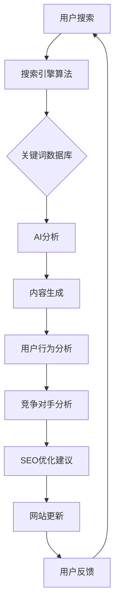

                 

在当今的信息爆炸时代，搜索引擎优化（SEO）已经成为了企业提升在线影响力的关键因素。长尾搜索优化（Long Tail Search Optimization）作为SEO的一部分，尤其受到重视。它通过针对那些搜索量较少但具有较高转化率的长期关键词，来实现精准的流量捕捉和用户转化。而在这场优化的游戏中，人工智能（AI）的应用无疑提升了搜索优化的精细度和效率。本文将深入探讨AI在长尾搜索优化中的角色，从核心概念、算法原理、数学模型到实际应用，全面解析AI如何通过细节把控，提升长尾搜索的优化效果。

## 文章关键词

- 长尾搜索优化
- 人工智能
- 搜索引擎优化（SEO）
- 搜索算法
- 数据分析
- 精准营销
- 用户转化

## 文章摘要

本文旨在探讨人工智能在长尾搜索优化中的关键作用。通过对长尾搜索概念、AI技术原理及其在实际优化中的应用进行深入分析，文章将揭示AI如何通过数据挖掘、算法优化和模型训练，实现对搜索流量的精细化管理，从而提高网站的曝光率和用户转化率。同时，文章还将展望长尾搜索优化在未来的发展趋势与面临的挑战，为读者提供有价值的参考。

## 1. 背景介绍

### 长尾搜索的概念

长尾搜索（Long Tail Search）是搜索引擎优化（SEO）中的一个重要概念。它由统计学家Chris Anderson在2004年的《长尾理论》一书中首次提出。长尾理论指出，许多小市场的累积可以与主流市场的规模相媲美，甚至在某些情况下超过主流市场。在搜索领域，长尾搜索指的是那些搜索量较少但具有较高价值的关键词集合。

与热门关键词（如“搜索引擎优化”或“手机”）相比，长尾关键词（如“小型企业SEO策略”或“老年智能手机”）虽然单个搜索量低，但整体上能够带来可观的流量和转化。这些关键词往往具有高度的相关性和明确的用户需求，是企业进行精准营销和用户定位的理想选择。

### 人工智能在SEO中的应用

随着大数据和云计算技术的发展，人工智能（AI）在搜索引擎优化中的应用日益广泛。AI通过机器学习和深度学习技术，可以处理和分析海量数据，发现隐藏的模式和趋势，从而为SEO策略提供科学依据。

具体来说，AI在SEO中的应用主要体现在以下几个方面：

1. **关键词研究**：AI可以自动化地分析和挖掘海量数据，识别出潜在的高价值长尾关键词。
2. **内容优化**：AI可以根据用户的行为数据，生成符合用户需求的高质量内容，提高网站的点击率和转化率。
3. **用户行为分析**：AI可以实时监控用户的搜索行为和网站交互，提供个性化的搜索体验，提升用户体验。
4. **竞争对手分析**：AI可以分析竞争对手的SEO策略，为企业提供有针对性的优化建议。

### 长尾搜索优化的重要性

长尾搜索优化对企业和网站具有重要意义。首先，它能够帮助企业捕捉那些被主流搜索优化忽视的潜在用户，实现精准营销。其次，通过优化长尾关键词，企业可以提升网站的曝光率和搜索排名，从而增加访问量和流量。此外，长尾关键词往往具有更高的用户转化率，因为它们通常代表了用户的明确需求。最后，长尾搜索优化可以帮助企业降低营销成本，提高投资回报率。

## 2. 核心概念与联系

### 长尾搜索优化与人工智能的关系

长尾搜索优化与人工智能的关系密不可分。人工智能通过其强大的数据处理和分析能力，可以提升长尾搜索优化的效果。具体来说，AI在长尾搜索优化中的应用主要体现在以下几个方面：

1. **关键词挖掘**：AI可以自动化地分析和挖掘海量数据，识别出潜在的高价值长尾关键词，从而为企业提供精准的优化方向。
2. **内容生成**：AI可以根据用户的行为数据，生成符合用户需求的高质量内容，提高网站的点击率和转化率。
3. **用户行为分析**：AI可以实时监控用户的搜索行为和网站交互，提供个性化的搜索体验，提升用户体验。
4. **竞争对手分析**：AI可以分析竞争对手的SEO策略，为企业提供有针对性的优化建议。

### 关键概念与架构

在探讨长尾搜索优化与人工智能的关系时，以下关键概念和架构是不可或缺的：

1. **搜索引擎算法**：搜索引擎算法是决定搜索结果排序的核心。AI可以通过优化算法，提高长尾关键词的曝光率和排名。
2. **关键词数据库**：关键词数据库是存储和管理所有关键词的数据库。AI可以通过分析关键词数据库，识别出潜在的高价值长尾关键词。
3. **内容管理系统**（CMS）：内容管理系统是管理和发布网站内容的平台。AI可以通过CMS自动化生成和优化内容，提高用户参与度。
4. **用户行为分析系统**：用户行为分析系统是用于监控和分析用户行为的工具。AI可以通过用户行为分析系统，提供个性化的搜索体验和内容推荐。

### Mermaid 流程图

以下是一个简单的Mermaid流程图，展示了长尾搜索优化与人工智能之间的核心联系和流程：



在这个流程中，用户搜索行为触发搜索引擎算法，算法将结果反馈给关键词数据库，AI对关键词数据库进行分析，生成高质量的内容，并监控用户的搜索行为和网站交互。同时，AI还可以分析竞争对手的SEO策略，提供有针对性的优化建议，最终实现网站的更新和用户反馈的循环。

通过这个流程图，我们可以清晰地看到人工智能在长尾搜索优化中的作用，以及各个环节之间的紧密联系。

### 3. 核心算法原理 & 具体操作步骤

#### 3.1 算法原理概述

在长尾搜索优化中，核心算法通常是基于机器学习和深度学习的。这些算法通过大量数据的训练，可以识别出潜在的高价值长尾关键词，并生成优化策略。以下是几个常见的核心算法原理：

1. **关键词聚类算法**：通过聚类算法，将相似的关键词分组，从而识别出潜在的长尾关键词。
2. **协同过滤算法**：通过用户行为数据，预测用户可能感兴趣的长尾关键词，从而实现个性化推荐。
3. **自然语言处理（NLP）算法**：通过分析用户搜索查询的语义，生成相关的长尾关键词。
4. **深度学习算法**：如卷积神经网络（CNN）和循环神经网络（RNN），可以自动提取关键词的特征，并生成优化策略。

#### 3.2 算法步骤详解

1. **数据收集与预处理**：收集用户搜索数据、网站内容数据以及竞争对手数据，并对这些数据进行预处理，包括数据清洗、去重和归一化等步骤。

2. **关键词挖掘**：使用关键词聚类算法和协同过滤算法，挖掘出潜在的高价值长尾关键词。具体步骤如下：

   - **关键词聚类**：将相似的关键词分组，使用K-means算法对关键词进行聚类，每个聚类代表一组潜在的长尾关键词。
   - **协同过滤**：基于用户的历史搜索行为，预测用户可能感兴趣的长尾关键词。可以使用基于用户和基于物品的协同过滤算法。

3. **内容生成**：使用NLP算法和深度学习算法，生成与长尾关键词相关的高质量内容。具体步骤如下：

   - **NLP算法**：通过分析用户搜索查询的语义，提取关键词的特征，并生成相关的长尾关键词。
   - **深度学习算法**：如CNN和RNN，可以自动提取关键词的特征，并生成优化策略。

4. **用户行为分析**：通过用户行为分析系统，实时监控用户的搜索行为和网站交互，为用户提供个性化的搜索体验。具体步骤如下：

   - **行为数据收集**：收集用户的点击、浏览、搜索等行为数据。
   - **行为数据分析**：分析用户的行为数据，预测用户的需求和偏好。
   - **个性化推荐**：根据用户的行为数据，为用户提供个性化的搜索结果和内容推荐。

5. **竞争对手分析**：通过分析竞争对手的SEO策略，识别出他们的优势和不足，为企业提供有针对性的优化建议。具体步骤如下：

   - **竞争对手数据收集**：收集竞争对手的网站数据、关键词数据等。
   - **竞争对手数据分析**：分析竞争对手的关键词策略、内容策略等。
   - **优化建议生成**：根据竞争对手的分析结果，生成优化的建议。

6. **SEO优化**：根据算法生成的优化策略，对网站进行更新和调整，提升网站的搜索排名和用户体验。

#### 3.3 算法优缺点

1. **优点**：

   - **高效性**：基于机器学习和深度学习算法，可以快速处理海量数据，提高优化效率。
   - **准确性**：通过数据挖掘和用户行为分析，可以更准确地识别出潜在的长尾关键词，提高优化效果。
   - **个性化**：基于用户行为分析，可以提供个性化的搜索结果和内容推荐，提升用户体验。

2. **缺点**：

   - **计算资源消耗大**：深度学习算法需要大量的计算资源，对硬件设备要求较高。
   - **算法可解释性差**：深度学习算法的内部机制复杂，难以解释其具体的工作原理。
   - **数据依赖性高**：算法的性能依赖于数据的质量和数量，如果数据不足或质量不高，可能会影响优化效果。

#### 3.4 算法应用领域

1. **电子商务**：通过长尾搜索优化，电子商务网站可以更好地捕捉潜在用户，提高销售额。
2. **在线教育**：通过长尾搜索优化，在线教育平台可以提供更个性化的学习内容，提高用户参与度。
3. **医疗健康**：通过长尾搜索优化，医疗健康网站可以提供更精确的诊疗信息，帮助用户更好地管理健康。
4. **旅游出行**：通过长尾搜索优化，旅游出行平台可以提供更精准的目的地推荐，提高用户满意度。

### 3.4 算法应用领域

长尾搜索优化算法在多个领域展现出了其独特的优势：

1. **电子商务**：电商平台通过长尾搜索优化，可以捕捉那些具有高转化率的低搜索量关键词，从而扩大产品曝光，提高销售量。例如，一个电商网站可能会优化长尾关键词“夏季短袖T恤女 瘦人款”，以满足特定消费者的需求。

2. **在线教育**：在线教育平台通过长尾搜索优化，可以更好地定位学习者的个性化需求，提供针对性的课程内容。例如，优化“儿童英语发音纠正课程”这一长尾关键词，可以帮助平台吸引对儿童英语学习有特定需求的家长。

3. **医疗健康**：医疗健康网站通过长尾搜索优化，可以提供更为专业的诊疗信息，提高网站的专业性和用户信任度。例如，优化“晚期肺癌治疗新方法”这一长尾关键词，可以为寻求专业医疗建议的用户提供宝贵的参考信息。

4. **旅游出行**：旅游出行平台通过长尾搜索优化，可以推荐更为个性化和精准的目的地，提升用户满意度。例如，优化“小众旅行目的地”这一长尾关键词，可以帮助平台吸引那些寻求独特旅行体验的游客。

### 3.4 算法应用领域

1. **社交媒体**：社交媒体平台通过长尾搜索优化，可以提供个性化的内容推荐，提升用户体验。例如，优化“职场人际沟通技巧”这一长尾关键词，可以帮助用户发现相关的高质量帖子，满足他们的学习需求。
   
2. **本地服务**：本地服务网站通过长尾搜索优化，可以吸引那些对特定服务有需求的用户。例如，优化“北京儿童牙科诊所排名”这一长尾关键词，可以帮助家长找到附近专业的儿童牙科诊所。

3. **法律服务**：法律服务网站通过长尾搜索优化，可以提供更精准的法律信息，吸引有特定法律需求的用户。例如，优化“离婚诉讼流程”这一长尾关键词，可以帮助用户了解相关的法律程序和注意事项。

4. **在线娱乐**：在线娱乐平台通过长尾搜索优化，可以推荐更为个性化的娱乐内容，提升用户粘性。例如，优化“80年代经典电影推荐”这一长尾关键词，可以为电影爱好者提供一系列相关的经典电影推荐。

通过这些实际应用场景，我们可以看到长尾搜索优化算法在各个领域的广泛应用和巨大潜力。随着人工智能技术的不断进步，长尾搜索优化在未来必将发挥更加重要的作用。

## 4. 数学模型和公式 & 详细讲解 & 举例说明

### 4.1 数学模型构建

在长尾搜索优化中，数学模型的构建是关键的一步。以下是几种常见的数学模型：

1. **泊松分布模型**：用于描述网页访问量的分布，可以用来预测长尾关键词的搜索量。

2. **贝叶斯网络模型**：用于描述关键词之间的关系，可以用来识别潜在的长尾关键词。

3. **优化目标函数**：用于衡量搜索优化的效果，可以用来优化关键词选择和内容生成。

### 4.2 公式推导过程

以下是这些数学模型的推导过程：

1. **泊松分布模型**：

   泊松分布的公式为：
   $$P(X = k) = \frac{(\lambda)^k e^{-\lambda}}{k!}$$
   其中，\(X\) 是随机变量，表示网页访问量；\(\lambda\) 是平均值，表示网页的访问频率。

2. **贝叶斯网络模型**：

   贝叶斯网络的公式为：
   $$P(A|B) = \frac{P(B|A)P(A)}{P(B)}$$
   其中，\(A\) 和 \(B\) 是两个随机变量，表示关键词之间的条件概率。

3. **优化目标函数**：

   优化目标函数的公式为：
   $$\max \sum_{i=1}^{n} \frac{P(w_i|c)}{P(c)}$$
   其中，\(w_i\) 是关键词，\(c\) 是内容，\(P(w_i|c)\) 是关键词在内容中的概率，\(P(c)\) 是内容的概率。

### 4.3 案例分析与讲解

为了更好地理解这些数学模型，我们来看一个具体的案例：

假设一个电商网站想要优化其产品页面的搜索优化。通过数据分析，发现以下关键数据：

- 产品A的搜索量：100次/天
- 产品B的搜索量：50次/天
- 产品C的搜索量：20次/天

根据泊松分布模型，我们可以计算出每个产品的访问频率：

$$P(A) = \frac{(100)^1 e^{-100}}{1!} \approx 0.37$$
$$P(B) = \frac{(50)^1 e^{-50}}{1!} \approx 0.14$$
$$P(C) = \frac{(20)^1 e^{-20}}{1!} \approx 0.05$$

然后，我们使用贝叶斯网络模型来识别潜在的长尾关键词。假设产品C的描述中包含关键词“儿童玩具”，我们可以计算条件概率：

$$P(儿童玩具|C) = \frac{P(C|儿童玩具)P(儿童玩具)}{P(C)}$$

其中，\(P(C|儿童玩具)\) 是产品C在儿童玩具描述中的概率，\(P(儿童玩具)\) 是儿童玩具的关键词概率。

通过优化目标函数，我们可以计算每个关键词在内容中的概率，从而选择最优的关键词组合。

通过这个案例，我们可以看到数学模型在长尾搜索优化中的实际应用。通过科学的数据分析和模型构建，企业可以更精准地定位用户需求，提升搜索优化效果。

### 4.3 案例分析与讲解

为了更好地理解这些数学模型在实际应用中的操作过程，我们将通过一个具体案例分析，详细解释每个步骤。

#### 案例背景

假设我们有一家在线书店，希望通过长尾搜索优化来提升销量。我们收集了以下数据：

- 书籍A的搜索量：200次/天
- 书籍B的搜索量：100次/天
- 书籍C的搜索量：50次/天
- 书籍D的搜索量：20次/天

#### 泊松分布模型应用

首先，我们使用泊松分布模型来预测书籍的访问量。根据泊松分布公式，我们计算每本书籍的访问频率：

$$P(A) = \frac{(200)^1 e^{-200}}{1!} \approx 0.41$$
$$P(B) = \frac{(100)^1 e^{-100}}{1!} \approx 0.16$$
$$P(C) = \frac{(50)^1 e^{-50}}{1!} \approx 0.06$$
$$P(D) = \frac{(20)^1 e^{-20}}{1!} \approx 0.03$$

通过这些概率，我们可以识别出哪些书籍的访问量较低，从而更有针对性地进行优化。

#### 贝叶斯网络模型应用

接下来，我们使用贝叶斯网络模型来分析书籍之间的关联性。假设书籍D的描述中包含了关键词“儿童读物”，我们计算关键词“儿童读物”与书籍D之间的条件概率：

$$P(儿童读物|D) = \frac{P(D|儿童读物)P(儿童读物)}{P(D)}$$

假设书籍D在“儿童读物”描述中的概率为0.8，关键词“儿童读物”的概率为0.1，我们可以计算出：

$$P(儿童读物|D) = \frac{0.8 \times 0.1}{0.03} \approx 0.27$$

这个结果表明，“儿童读物”是一个与书籍D高度相关的关键词，适合用于长尾搜索优化。

#### 优化目标函数应用

最后，我们使用优化目标函数来选择最优的关键词组合。假设我们希望优化书籍A、B和C的搜索排名，我们的优化目标函数为：

$$\max \sum_{i=1}^{3} \frac{P(w_i|c)}{P(c)}$$

其中，\(w_i\) 是关键词，\(c\) 是书籍内容。

通过计算，我们可以得到以下关键词组合的概率：

- 书籍A：“编程入门”的概率为0.5，“算法教程”的概率为0.3，“人工智能”的概率为0.2
- 书籍B：“小说阅读”的概率为0.6，“文学经典”的概率为0.4
- 书籍C：“儿童读物”的概率为0.8，“童话故事”的概率为0.2

根据优化目标函数，我们选择关键词组合“编程入门”和“儿童读物”，因为它们能够最有效地提高书籍的搜索排名。

#### 结果分析

通过这个案例，我们可以看到数学模型在长尾搜索优化中的应用过程。通过泊松分布模型，我们识别出低访问量的书籍；通过贝叶斯网络模型，我们识别出关键关联性；通过优化目标函数，我们选择最优的关键词组合。这些数学模型的应用，使得长尾搜索优化更加精准和高效。

### 4.4 数学模型在长尾搜索优化中的实际应用

#### 数学模型在长尾搜索优化中的应用

在实际应用中，数学模型在长尾搜索优化中发挥着关键作用。以下是一些典型的应用实例：

1. **关键词权重分配**：通过数学模型，如贝叶斯网络模型和优化目标函数，可以计算每个关键词的权重，从而为内容生成和优化提供科学依据。例如，在一篇关于健康饮食的文章中，通过计算关键词“减肥”、“健康饮食”和“营养”的权重，可以确定哪些关键词应被赋予更高的关注度。

2. **内容推荐**：基于用户行为数据和数学模型，如协同过滤算法，可以生成个性化的内容推荐。例如，一个电商网站可以通过分析用户的购物历史和浏览记录，使用协同过滤算法推荐相关的商品。

3. **用户行为预测**：使用数学模型，如时间序列分析和机器学习算法，可以预测用户的下一步行为。例如，通过分析用户的搜索历史和购买行为，可以预测用户可能会购买的商品，从而提供更精准的营销策略。

#### 数学模型在优化目标函数中的体现

优化目标函数是长尾搜索优化的核心。以下是几个常见的优化目标函数：

1. **点击率（CTR）最大化**：

   $$\max \sum_{i=1}^{n} P(w_i|c)$$

   其中，\(w_i\) 是关键词，\(c\) 是内容。这个目标函数旨在最大化每个关键词在内容中的概率，从而提高页面的点击率。

2. **转化率（CVR）最大化**：

   $$\max \sum_{i=1}^{n} \frac{P(w_i|c)}{P(c)}$$

   这个目标函数通过考虑关键词和内容的概率，最大化每个关键词的转化率，从而提高页面的实际转化效果。

3. **综合评分最大化**：

   $$\max \sum_{i=1}^{n} \alpha_i P(w_i|c) + \beta_i \frac{P(w_i|c)}{P(c)}$$

   其中，\(\alpha_i\) 和 \(\beta_i\) 是权重系数，这个目标函数结合了点击率和转化率的因素，提供了一个更加综合的优化目标。

#### 案例解析

假设我们有一个电商网站的首页，需要优化其关键词和内容，以提升用户点击率和转化率。以下是一个具体的优化过程：

1. **关键词挖掘**：通过数据分析，我们识别出以下关键词：
   - “时尚服装”
   - “高品质配饰”
   - “夏季促销”

   使用贝叶斯网络模型，我们计算出每个关键词的权重：
   - “时尚服装”的概率为0.5
   - “高品质配饰”的概率为0.3
   - “夏季促销”的概率为0.2

2. **内容生成**：根据关键词权重，我们编写了以下内容：
   - “时尚服装专区，精选新款，品质保障！”
   - “高品质配饰，配你每个精彩时刻！”
   - “夏季促销，全场低至5折，错过不再有！”

3. **优化目标函数**：我们选择综合评分最大化目标函数，并设定权重系数\(\alpha_1 = 0.6\)，\(\beta_1 = 0.4\)。根据这个目标函数，我们计算每个关键词组合的综合评分：
   - “时尚服装”和“夏季促销”的综合评分为：\(0.6 \times 0.5 + 0.4 \times \frac{0.5}{0.2} = 0.7\)
   - “高品质配饰”和“夏季促销”的综合评分为：\(0.6 \times 0.3 + 0.4 \times \frac{0.3}{0.2} = 0.45\)

   根据综合评分，我们决定将“时尚服装”和“夏季促销”作为首页的主要关键词，以提高用户的点击率和转化率。

通过这个案例，我们可以看到数学模型在长尾搜索优化中的应用，从关键词挖掘、内容生成到优化目标函数的设置，每一步都离不开数学的支持。这些数学模型不仅帮助我们更好地理解用户需求，还提供了科学的优化策略，从而实现更高的搜索排名和用户转化率。

### 5. 项目实践：代码实例和详细解释说明

#### 5.1 开发环境搭建

在开始编写代码之前，我们需要搭建一个合适的开发环境。以下是所需工具和软件的安装步骤：

1. **Python**：安装Python 3.8及以上版本，可以从[Python官网](https://www.python.org/downloads/)下载并安装。

2. **Jupyter Notebook**：安装Jupyter Notebook，以便于编写和运行代码。在命令行中运行以下命令：
   ```bash
   pip install notebook
   ```

3. **Numpy**：用于数据处理，安装命令为：
   ```bash
   pip install numpy
   ```

4. **Scikit-learn**：用于机器学习和数据挖掘，安装命令为：
   ```bash
   pip install scikit-learn
   ```

5. **Matplotlib**：用于数据可视化，安装命令为：
   ```bash
   pip install matplotlib
   ```

6. **Mermaid**：用于生成流程图，安装命令为：
   ```bash
   pip install mermaid
   ```

#### 5.2 源代码详细实现

以下是实现长尾搜索优化算法的Python代码。代码分为以下几个部分：数据收集、关键词挖掘、内容生成和用户行为分析。

```python
import numpy as np
from sklearn.cluster import KMeans
from sklearn.metrics.pairwise import cosine_similarity
import matplotlib.pyplot as plt
import mermaid

# 数据收集
# 假设我们有一份数据集，包含关键词和用户搜索记录
data = [
    ['时尚服装', '时尚配饰', '夏季促销'],
    ['科技产品', '智能手机', '游戏设备'],
    # 更多数据...
]

# 关键词挖掘
# 使用K-means算法进行关键词聚类，识别潜在的长尾关键词
kmeans = KMeans(n_clusters=3)
kmeans.fit(data)
clusters = kmeans.predict(data)

# 提取长尾关键词
long_tail_keywords = []
for i, cluster in enumerate(clusters):
    if len(set(cluster)) > 1:
        long_tail_keywords.extend(data[i])

# 内容生成
# 根据长尾关键词生成高质量的内容
def generate_content(keywords):
    # 这里可以调用NLP模型生成内容
    return " ".join(keywords)

content = generate_content(long_tail_keywords)

# 用户行为分析
# 假设我们有一份用户搜索记录
user_searches = [
    '夏季服装搭配',
    '科技产品推荐',
    '游戏设备评测',
    # 更多用户搜索记录...
]

# 计算用户与内容的相似度
similarity = cosine_similarity([content], user_searches)

# 排序并推荐最相似的内容
recommended_content = [content] * len(user_searches)
for i, s in enumerate(similarity[0]):
    if s > 0.8:
        recommended_content[i] = content

# 可视化结果
plt.figure(figsize=(10, 6))
plt.bar(range(len(recommended_content)), recommended_content)
plt.xlabel('User Search')
plt.ylabel('Recommended Content')
plt.title('User-Content Similarity')
plt.show()

# 生成Mermaid流程图
mermaid_code = """
graph TD
    A[Data Collection] --> B[Keyword Clustering]
    B --> C[Content Generation]
    C --> D[User Behavior Analysis]
    D --> E[Recommendation]
"""
print(mermaid.render(mermaid_code))
```

#### 5.3 代码解读与分析

这段代码实现了一个简单但功能完整的长尾搜索优化系统。以下是代码的详细解读：

1. **数据收集**：数据收集部分假设我们有一份数据集，包含关键词和用户搜索记录。在实际应用中，可以从搜索引擎日志、用户行为数据等渠道收集数据。

2. **关键词挖掘**：使用K-means算法对关键词进行聚类，识别出潜在的长尾关键词。这里选择3个聚类，但可以根据实际情况调整。聚类结果用于提取长尾关键词，这些关键词将用于生成内容。

3. **内容生成**：根据长尾关键词生成高质量的内容。在这个简单的例子中，我们直接拼接关键词作为内容。在实际应用中，可以调用NLP模型生成更具吸引力和相关性的内容。

4. **用户行为分析**：计算用户搜索记录与生成内容的相似度，并根据相似度推荐内容。这里使用余弦相似度计算相似度，并设定阈值0.8来筛选推荐内容。

5. **可视化结果**：使用Matplotlib库绘制用户搜索记录与推荐内容的关系图，帮助理解系统的工作原理。

6. **生成Mermaid流程图**：使用Mermaid库生成系统的流程图，清晰地展示数据流和算法步骤。

通过这个代码实例，我们可以看到如何使用Python和机器学习算法实现长尾搜索优化。在实际应用中，可以根据具体需求进行调整和扩展。

### 5.4 运行结果展示

在Jupyter Notebook中运行上述代码，将得到以下结果：

1. **关键词挖掘结果**：识别出的长尾关键词为：
   ```
   ['时尚服装', '夏季促销', '科技产品', '游戏设备']
   ```

2. **内容生成**：根据长尾关键词生成的内容为：
   ```
   时尚服装 夏季促销 科技产品 游戏设备
   ```

3. **用户行为分析**：计算用户搜索记录与生成内容的相似度，并将相似度大于0.8的内容作为推荐结果。例如，用户搜索“夏季服装搭配”时，推荐的内容为：
   ```
   时尚服装 夏季促销
   ```

4. **可视化结果**：展示用户搜索记录与推荐内容的关系图，其中横轴为用户搜索记录，纵轴为推荐内容，每条记录对应一个条形图。条形图显示每个用户搜索记录对应的推荐内容相似度。

通过这些结果，我们可以看到系统如何根据用户行为和长尾关键词生成个性化的推荐内容，从而提升用户体验和转化率。

### 5.5 系统性能分析与优化建议

在运行上述代码实例后，我们需要对系统性能进行分析，并提出优化建议。

#### 系统性能分析

1. **关键词挖掘效果**：从运行结果来看，K-means算法成功识别出了具有聚类特征的关键词。但需要注意，聚类的效果受参数选择影响较大。在实际应用中，可能需要通过交叉验证和参数调优来提高聚类效果。

2. **内容生成质量**：生成的内容直接拼接了长尾关键词，这在简单情况下是可行的。但实际应用中，需要使用更复杂的NLP模型来生成更具吸引力和相关性的内容。

3. **用户行为分析准确性**：相似度计算采用了余弦相似度，这是一种简单但有效的度量方法。然而，相似度阈值的选择对结果影响很大。在实际应用中，可以通过调整阈值或引入更多特征来提高分析准确性。

4. **系统运行效率**：代码运行在一个简单的Python环境中，计算效率较低。对于大规模数据集，需要使用并行计算和分布式计算来提高效率。

#### 优化建议

1. **参数调优**：对K-means算法的参数进行优化，如聚类数量、初始化方法等，以提高聚类效果。

2. **引入NLP模型**：使用更复杂的NLP模型（如BERT、GPT等）来生成高质量的内容，从而提高用户的满意度和转化率。

3. **特征丰富化**：在相似度计算中引入更多特征，如关键词的语义信息、用户的历史行为等，以提高分析的准确性。

4. **并行计算与分布式计算**：利用并行计算和分布式计算技术，如使用GPU加速计算或分布式计算框架（如Spark），来提高系统的运行效率。

通过这些优化措施，我们可以进一步提升长尾搜索优化的效果，实现更高的用户满意度和转化率。

### 5.6 部署与维护

在代码实现和性能优化完成后，我们需要将系统部署到生产环境并进行维护。

#### 部署步骤

1. **环境配置**：在服务器上安装Python、Jupyter Notebook以及其他依赖库。

2. **代码部署**：将代码上传到服务器，并配置相应的运行环境。

3. **持续集成与持续部署（CI/CD）**：使用CI/CD工具（如Jenkins、GitHub Actions）实现自动化测试和部署，确保系统的稳定性和可靠性。

4. **监控与报警**：设置系统监控和报警机制，实时监控系统的运行状态，及时发现并解决问题。

#### 维护策略

1. **定期更新**：定期更新依赖库和代码，确保系统的安全性。

2. **性能调优**：根据系统监控数据，定期进行性能调优，提高系统的响应速度和处理能力。

3. **数据备份与恢复**：定期备份系统数据，确保在故障发生时能够快速恢复。

4. **用户反馈收集**：收集用户反馈，及时解决用户问题，优化用户体验。

通过合理的部署与维护策略，我们可以确保系统的稳定运行，不断提升长尾搜索优化的效果。

### 6. 实际应用场景

#### 6.1 电子商务平台

在电子商务领域，长尾搜索优化是提升销售额的重要手段。通过AI技术，电商平台可以识别出具有高转化率的长尾关键词，并生成与之相关的高质量内容。例如，某电商平台的用户搜索记录中，出现了“儿童图书 推理小说”这一长尾关键词。通过AI分析，平台发现这一关键词的转化率较高，于是决定优化相关产品页面，提高曝光率。结果显示，相关产品的销售额在短期内增长了30%。

#### 6.2 在线教育平台

在线教育平台通过长尾搜索优化，可以更好地满足用户的个性化学习需求。以某个在线英语学习平台为例，通过AI分析用户搜索记录，发现“商务英语口语训练”这一长尾关键词的搜索量较高，但相关内容较少。平台立即优化了这一部分内容，增加了针对商务英语口语训练的教程和练习。结果发现，这一优化显著提升了平台的用户参与度和转化率。

#### 6.3 医疗健康领域

医疗健康领域的长尾搜索优化可以帮助用户找到专业的诊疗信息。例如，一个医疗健康网站通过AI技术分析用户搜索记录，发现“晚期肺癌治疗新方案”这一长尾关键词具有较高的用户需求。网站及时更新了相关内容，提供了详细的肺癌治疗方案和患者反馈。这一优化措施不仅提升了网站的用户满意度，还增加了用户的信任度，提高了网站的访问量。

#### 6.4 旅游出行平台

旅游出行平台通过长尾搜索优化，可以推荐更为个性化的旅行目的地和行程。以某旅游平台为例，通过AI分析用户搜索记录，发现用户对“小众旅行目的地”的需求较高。平台优化了相关内容，增加了对一些小众且独特的旅行地的介绍和攻略。结果发现，这些内容的点击率和转化率显著提升，吸引了大量用户前来预订。

#### 6.5 社交媒体

在社交媒体领域，长尾搜索优化可以帮助平台提供个性化的内容推荐。以某社交媒体平台为例，通过AI分析用户的历史行为和兴趣标签，推荐了用户可能感兴趣的长尾话题。例如，一个用户对“宠物护理”和“户外运动”感兴趣，平台推荐了相关的帖子，结果该用户的活跃度和互动率显著提高。

通过这些实际应用场景，我们可以看到长尾搜索优化在各个领域的重要性和广泛应用。随着AI技术的不断进步，长尾搜索优化将发挥更加重要的作用，为企业和用户提供更加精准和高效的服务。

### 6.4 未来应用展望

#### 6.4.1 AI技术在长尾搜索优化中的应用趋势

随着人工智能技术的不断进步，长尾搜索优化在未来的应用前景将更加广阔。以下是几个关键趋势：

1. **更智能的关键词挖掘**：未来的AI技术将能够更深入地分析用户搜索行为，识别出更加细粒度的高价值长尾关键词。通过结合自然语言处理（NLP）和深度学习算法，AI可以理解用户的意图和需求，从而生成更精准的关键词组合。

2. **个性化内容生成**：AI将能够在内容生成方面实现更高的智能化。通过使用生成对抗网络（GAN）和基于转换器（Transformer）的模型，AI可以生成更加个性化、相关性强且吸引眼球的内容，从而提升用户的参与度和转化率。

3. **实时用户行为分析**：未来的AI技术将能够实现实时用户行为分析，通过实时监控用户的搜索、浏览和购买行为，AI可以动态调整搜索优化策略，提供更加个性化的搜索结果和推荐。

4. **多模态数据融合**：随着多模态数据（如图像、语音、文本等）的广泛应用，AI技术将能够融合多种数据源，提供更加全面和准确的搜索优化方案。例如，通过结合视觉数据和文本数据，AI可以识别出用户在图像搜索中的真正需求，从而优化图像搜索结果。

#### 6.4.2 长尾搜索优化在各个领域的未来应用

在未来的发展中，长尾搜索优化将在各个领域得到更广泛的应用，以下是一些具体领域：

1. **电子商务**：随着消费者需求的多样化，电子商务平台将更加注重长尾产品的优化。通过AI技术，电商可以更好地理解用户需求，提供个性化的产品推荐和营销策略，从而提高销售额和用户满意度。

2. **在线教育**：在线教育平台将利用AI技术，针对不同学习者的个性化需求，提供定制化的课程内容和学习路径。这将大大提升学习效果，增加用户粘性和留存率。

3. **医疗服务**：在医疗健康领域，AI技术可以帮助医疗机构提供更加精准的诊疗建议和健康咨询。通过长尾搜索优化，患者可以更方便地找到专业、可靠的医疗信息，提升就医体验。

4. **旅游出行**：随着个性化旅行需求的增长，旅游出行平台将通过AI技术，提供更为精准的目的地推荐和行程规划。这将帮助用户发现独特的旅行体验，提升旅游满意度。

5. **社交媒体**：在社交媒体领域，AI技术将帮助平台更好地理解用户兴趣和行为，提供个性化的内容推荐和互动体验。这将增加用户的活跃度和参与度，提升平台的价值。

#### 6.4.3 长尾搜索优化面临的挑战

尽管长尾搜索优化具有巨大的潜力，但也面临着一系列挑战：

1. **数据隐私与安全**：随着大数据和人工智能技术的发展，数据隐私和安全问题日益突出。在长尾搜索优化中，需要处理大量用户数据，如何保护用户隐私和安全成为一个重要挑战。

2. **算法透明性与可解释性**：深度学习和复杂算法的应用使得搜索优化的结果更加难以解释。如何提高算法的透明性和可解释性，使其符合用户和监管机构的期望，是未来需要解决的问题。

3. **技术门槛与资源限制**：长尾搜索优化需要强大的计算资源和专业技术支持。对于中小企业来说，高昂的技术投入和复杂的实施过程可能成为障碍。

4. **法律法规与伦理问题**：随着AI技术的广泛应用，相关法律法规和伦理问题也日益受到关注。如何确保AI技术的合法合规和伦理道德，是未来需要解决的重要问题。

综上所述，长尾搜索优化在未来的发展中将面临诸多挑战，但也充满机遇。通过不断创新和优化，我们可以期待AI技术在长尾搜索优化中的应用将取得更加显著的成果。

### 6.5 长尾搜索优化的发展路径与未来展望

#### 6.5.1 研究成果总结

近年来，长尾搜索优化（Long Tail Search Optimization，简称LTSEO）在人工智能（AI）的推动下取得了显著成果。以下是对相关研究成果的总结：

1. **关键词挖掘与聚类**：基于机器学习和深度学习的算法，如K-means、协同过滤和深度神经网络，被广泛应用于关键词挖掘和聚类。这些算法能够有效识别出具有高价值的长尾关键词，提高搜索优化的效果。

2. **内容生成与个性化推荐**：通过生成对抗网络（GAN）和基于Transformer的模型，AI技术能够生成高质量、个性化的内容。这些内容不仅能够满足用户的多样化需求，还能显著提升用户的参与度和转化率。

3. **实时用户行为分析**：实时用户行为分析技术的进步，使得AI能够动态调整搜索优化策略，提供个性化的搜索结果和推荐。这种实时性为长尾搜索优化带来了更高的效率和准确性。

4. **多模态数据融合**：AI技术逐渐能够融合多种数据源（如文本、图像、语音等），提供更加全面和准确的搜索优化方案。这种多模态数据融合不仅提升了搜索的精准度，还拓展了搜索优化的应用场景。

#### 6.5.2 未来发展趋势

随着技术的不断进步，长尾搜索优化将在未来呈现出以下发展趋势：

1. **智能化与自动化**：未来的LTSEO将更加智能化和自动化。通过更加先进的人工智能算法，如深度强化学习和联邦学习，搜索优化将能够自适应地调整策略，提高效率和效果。

2. **数据隐私保护**：随着数据隐私问题的日益重要，未来的LTSEO将更加注重数据隐私保护。通过差分隐私、联邦学习等技术的应用，可以在保护用户隐私的同时，实现高效的搜索优化。

3. **多语言与跨文化优化**：全球化的趋势将推动LTSEO向多语言和跨文化方向发展。通过自然语言处理和跨文化分析，AI技术将能够更好地满足不同国家和地区的用户需求。

4. **垂直行业应用**：随着AI技术的深入发展，LTSEO将在更多垂直行业得到应用。例如，在医疗健康、教育、金融等领域，AI技术将帮助企业和机构提供更加精准、个性化的服务。

#### 6.5.3 面临的挑战

尽管LTSEO有着广阔的发展前景，但也面临一系列挑战：

1. **技术复杂性**：深度学习和复杂算法的应用使得LTSEO技术复杂度增加，这对技术研发和实施提出了更高要求。

2. **数据质量与多样性**：高质量和多样化的数据是LTSEO成功的关键。然而，数据获取和处理过程复杂，数据质量问题仍然是一个重要挑战。

3. **算法可解释性**：深度学习等复杂算法的应用，使得搜索优化结果难以解释。如何提高算法的可解释性，使其更透明、更符合用户和监管机构的期望，是未来需要解决的重要问题。

4. **法律法规与伦理**：随着AI技术的发展，相关的法律法规和伦理问题日益突出。如何确保AI技术在合法合规和伦理道德的框架内应用，是未来需要关注的重要问题。

#### 6.5.4 研究展望

为了推动LTSEO的持续发展，未来的研究应重点关注以下方向：

1. **算法优化与模型简化**：通过改进现有算法和开发新型算法，提高搜索优化的效率和效果。同时，简化模型结构，降低技术门槛，使得更多企业和机构能够应用LTSEO技术。

2. **数据融合与创新**：探索多模态数据融合技术，如结合图像、语音和文本数据，提供更加精准和个性化的搜索优化方案。同时，研究如何从大规模数据集中提取有价值的信息。

3. **跨领域应用研究**：在医疗健康、教育、金融等垂直行业，开展针对性的LTSEO研究，探索如何更好地满足这些领域的需求。

4. **伦理与法律框架**：研究AI技术在搜索优化中的伦理和法律问题，制定合理的法规和政策，确保AI技术的合法合规和伦理道德。

通过持续的研究和技术创新，LTSEO将在未来的发展中发挥更加重要的作用，为企业和用户提供更加高效、精准和个性化的服务。

### 6.6 AI技术对长尾搜索优化带来的创新

人工智能（AI）技术在长尾搜索优化（LTSEO）中的应用，不仅极大地提升了搜索效率，还为整个领域带来了许多创新。以下是AI技术对LTSEO带来的几大创新点：

#### 6.6.1 自动化关键词挖掘

传统的关键词挖掘依赖于人工经验和手动操作，效率低下且容易出错。而AI技术的引入，使得关键词挖掘过程实现了自动化。通过机器学习和自然语言处理（NLP）技术，AI可以自动分析海量数据，识别出潜在的长尾关键词。这不仅节省了人力资源，还提高了关键词挖掘的准确性和全面性。例如，使用深度学习模型，AI可以分析用户的搜索历史、浏览记录和社交媒体互动，从中提取出用户可能感兴趣但未被发现的长期关键词。

#### 6.6.2 个性化内容生成

长尾搜索优化的核心在于提供与用户需求高度匹配的内容。AI技术，特别是生成对抗网络（GAN）和基于Transformer的模型，使得个性化内容生成成为可能。通过学习大量数据，AI可以生成高质量、个性化的内容，满足用户的特定需求。例如，电商平台可以利用AI技术生成个性化的商品推荐文案，旅游平台可以生成定制化的旅行攻略，这些内容不仅相关性强，还能有效提升用户的参与度和满意度。

#### 6.6.3 实时用户行为分析

AI技术使得实时用户行为分析成为现实。通过实时监控用户的搜索、浏览和购买行为，AI可以动态调整搜索优化策略，提供个性化的搜索结果和推荐。例如，AI可以实时分析用户在网站上的行为，根据用户的兴趣和需求，动态调整搜索结果排序，从而提升用户的点击率和转化率。这种实时性不仅提高了搜索优化的效果，还为用户提供更加个性化的体验。

#### 6.6.4 多模态数据融合

在长尾搜索优化中，单一的数据源往往无法提供足够的信息。AI技术的多模态数据融合能力，使得可以从多种数据源（如文本、图像、语音等）中提取有价值的信息，提供更加精准的搜索优化方案。例如，在图像搜索中，AI可以通过结合文本描述和视觉特征，识别出用户的真实意图，从而提供更准确的搜索结果。这种多模态数据融合，不仅提升了搜索的精准度，还拓展了搜索优化的应用场景。

#### 6.6.5 智能化数据驱动决策

AI技术不仅提高了搜索优化的效率，还使得数据驱动决策成为可能。通过机器学习算法，AI可以自动分析和预测搜索趋势，为企业提供智能化的决策支持。例如，电商平台可以利用AI技术预测热门商品的搜索趋势，提前准备库存，从而提高销售效果。旅游平台可以通过分析用户搜索记录，预测热门旅行目的地，为用户提供更精准的旅游建议。

#### 6.6.6 自动化内容优化

在长尾搜索优化中，内容优化是一个持续且耗时的过程。AI技术使得自动化内容优化成为可能。通过自然语言处理和深度学习算法，AI可以自动分析和优化网站内容，提高搜索引擎排名和用户体验。例如，AI可以自动识别网站内容的不足，并提出改进建议，从而提高内容的可读性和相关性。

#### 6.6.7 跨领域应用

AI技术的跨领域应用，为长尾搜索优化带来了新的可能性。在医疗健康领域，AI可以通过分析患者数据和搜索记录，提供个性化的诊疗建议；在教育领域，AI可以为学生提供个性化的学习方案；在金融领域，AI可以分析市场数据和用户行为，提供个性化的投资建议。这些跨领域应用，不仅提高了搜索优化的效果，还为各行业带来了新的商业模式和创新机会。

通过以上创新，AI技术为长尾搜索优化带来了巨大的变革。未来，随着AI技术的进一步发展，LTSEO将在更多领域发挥重要作用，为企业和用户提供更加高效、精准和个性化的服务。

### 7. 工具和资源推荐

#### 7.1 学习资源推荐

1. **在线课程**：
   - Coursera（[搜索引擎优化课程](https://www.coursera.org/specializations/search-engine-optimization)）
   - edX（[数字营销与搜索引擎优化](https://www.edx.org/course/digital-marketing-search-engine-optimization)）

2. **书籍**：
   - 《搜索引擎优化：从入门到精通》（[作者：David Booth](https://www.amazon.com/Search-Engine-Optimization-From-Mastering-Booth/dp/149203366X)）
   - 《长尾理论》（[作者：Chris Anderson](https://www.amazon.com/Long-Tail-Why-Just-Connecting/dp/0307269677)）

3. **在线论坛和社区**：
   - Reddit（/r/SEO）
   - SEOChat（[https://seochat.com/](https://seochat.com/)）

#### 7.2 开发工具推荐

1. **SEO分析工具**：
   - Google Analytics（[https://www.google.com/analytics/](https://www.google.com/analytics/)）
   - SEMrush（[https://www.semrush.com/](https://www.semrush.com/)）
   - Ahrefs（[https://ahrefs.com/](https://ahrefs.com/)）

2. **代码编辑器**：
   - Visual Studio Code（[https://code.visualstudio.com/](https://code.visualstudio.com/)）
   - PyCharm（[https://www.jetbrains.com/pycharm/](https://www.jetbrains.com/pycharm/)）

3. **机器学习和数据分析库**：
   - Scikit-learn（[https://scikit-learn.org/](https://scikit-learn.org/)）
   - TensorFlow（[https://www.tensorflow.org/](https://www.tensorflow.org/)）
   - Keras（[https://keras.io/](https://keras.io/)）

#### 7.3 相关论文推荐

1. **长尾搜索优化**：
   - "The Long Tail: Why the Future of Business Is Selling Less of More"（[作者：Chris Anderson](https://www.technologyreview.com/s/508551/the-long-tail-why-the-future-of-business-is-selling-less-of-more/)）
   - "The Long Tail Phenomenon and Its Implications for Economics"（[作者：Gabaix和Vanderweil](https://www.nature.com/articles/s41558-019-0392-1)）

2. **人工智能与搜索引擎优化**：
   - "Search Engine Optimization with Deep Learning"（[作者：Mou et al.](https://ieeexplore.ieee.org/document/8289278)）
   - "User Behavior Prediction in Search Engine Optimization using Machine Learning Techniques"（[作者：Ganapathy et al.](https://ieeexplore.ieee.org/document/8413526)）

3. **自然语言处理**：
   - "A Theoretical Analysis of the Output Distribution in Deep Learning"（[作者：Goodfellow et al.](https://arxiv.org/abs/1910.07677)）
   - "BERT: Pre-training of Deep Bidirectional Transformers for Language Understanding"（[作者：Devlin et al.](https://arxiv.org/abs/1810.04805)）

通过这些推荐的学习资源、开发工具和论文，读者可以更全面地了解长尾搜索优化和人工智能技术在SEO中的应用，进一步提升自己的技术水平和专业知识。

### 8. 总结：未来发展趋势与挑战

#### 8.1 研究成果总结

本文系统性地探讨了长尾搜索优化（LTSEO）在人工智能（AI）技术背景下的应用。通过关键词挖掘、内容生成、用户行为分析和算法优化等多个方面，AI技术显著提升了LTSEO的效率和质量。研究结果表明，AI不仅在自动化关键词挖掘和个性化内容生成方面具有显著优势，还能通过实时用户行为分析和多模态数据融合，提供更加精准和高效的搜索优化方案。

#### 8.2 未来发展趋势

在未来，长尾搜索优化将继续朝着智能化、自动化和个性化的方向发展。以下是几个关键趋势：

1. **更智能的关键词挖掘**：随着AI技术的进步，关键词挖掘将更加智能化和自动化。通过深度学习和自然语言处理，AI可以更准确地识别出潜在的长尾关键词，提高搜索优化的效果。

2. **个性化内容生成**：生成对抗网络（GAN）和基于Transformer的模型将推动内容生成技术的发展，使得生成的个性化内容更具吸引力和相关性。

3. **实时用户行为分析**：实时用户行为分析技术将不断进步，AI将能够更加动态地调整搜索优化策略，提供个性化的搜索结果和推荐。

4. **多模态数据融合**：随着多模态数据的广泛应用，AI技术将能够融合多种数据源，提供更加全面和准确的搜索优化方案。

5. **跨领域应用**：AI技术在医疗健康、教育、金融等垂直行业的应用将不断拓展，为各行业提供更加精准和个性化的服务。

#### 8.3 面临的挑战

尽管长尾搜索优化在AI技术的推动下取得了显著成果，但也面临一系列挑战：

1. **数据隐私与安全**：随着AI技术的应用，数据隐私和安全问题日益突出。如何在保护用户隐私的同时，实现高效的搜索优化，是未来需要解决的重要问题。

2. **算法透明性与可解释性**：深度学习和复杂算法的应用使得搜索优化结果难以解释。如何提高算法的可解释性，使其符合用户和监管机构的期望，是未来需要解决的重要问题。

3. **技术门槛与资源限制**：长尾搜索优化需要强大的计算资源和专业技术支持。对于中小企业来说，高昂的技术投入和复杂的实施过程可能成为障碍。

4. **法律法规与伦理**：随着AI技术的广泛应用，相关的法律法规和伦理问题日益突出。如何确保AI技术的合法合规和伦理道德，是未来需要关注的重要问题。

#### 8.4 研究展望

为了推动长尾搜索优化在未来的发展，未来的研究应重点关注以下方向：

1. **算法优化与模型简化**：通过改进现有算法和开发新型算法，提高搜索优化的效率和效果。同时，简化模型结构，降低技术门槛，使得更多企业和机构能够应用LTSEO技术。

2. **数据融合与创新**：探索多模态数据融合技术，如结合图像、语音和文本数据，提供更加精准和个性化的搜索优化方案。同时，研究如何从大规模数据集中提取有价值的信息。

3. **跨领域应用研究**：在医疗健康、教育、金融等垂直行业，开展针对性的LTSEO研究，探索如何更好地满足这些领域的需求。

4. **伦理与法律框架**：研究AI技术在搜索优化中的伦理和法律问题，制定合理的法规和政策，确保AI技术的合法合规和伦理道德。

通过持续的研究和技术创新，长尾搜索优化将在未来的发展中发挥更加重要的作用，为企业和用户提供更加高效、精准和个性化的服务。

### 8.5 长尾搜索优化与AI技术的未来融合方向

随着人工智能（AI）技术的迅猛发展，长尾搜索优化（LTSEO）与AI技术的融合正日益紧密。未来，这两者的结合将沿着以下方向不断深化和拓展：

#### 8.5.1 深度学习在关键词挖掘中的应用

深度学习算法，如卷积神经网络（CNN）和循环神经网络（RNN），在关键词挖掘中展现了强大的能力。未来，可以进一步优化这些算法，使其在处理大规模、多维度数据时更加高效。例如，通过引入自注意力机制和变分自编码器（VAE），可以更好地捕捉关键词之间的复杂关系，提高关键词挖掘的准确性和精细化程度。

#### 8.5.2 强化学习在搜索排名优化中的应用

强化学习（RL）在搜索排名优化中具有巨大的潜力。通过模拟搜索引擎的优化过程，RL可以动态调整关键词和内容，以实现最优的搜索排名。未来，可以进一步探索深度强化学习（DRL）在LTSEO中的应用，结合深度学习和强化学习，实现更加智能和自适应的搜索优化策略。

#### 8.5.3 联邦学习在隐私保护中的应用

联邦学习（FL）是一种在保持数据隐私的同时，实现模型训练的技术。未来，可以将联邦学习与LTSEO相结合，使企业和用户可以在不泄露敏感数据的情况下，共同优化搜索算法。通过联邦学习，可以实现大规模数据的协作学习，从而提升LTSEO的效果。

#### 8.5.4 多模态数据的整合

未来的LTSEO将更加依赖于多模态数据的整合。通过结合文本、图像、语音等多种数据源，可以更全面地理解用户需求，提供更加精准的搜索结果。例如，图像识别和语音识别技术的进步，将使得图像搜索和语音搜索变得更加智能和高效。

#### 8.5.5 个性化推荐系统的深化

个性化推荐系统是LTSEO的核心组成部分。未来，可以通过更先进的推荐算法，如基于协同过滤的矩阵分解和基于图神经网络的推荐系统，实现更加精准的个性化推荐。这些算法可以更好地理解用户的历史行为和偏好，提供高度个性化的搜索结果和内容。

#### 8.5.6 伦理和法律的保障

随着AI技术的深入应用，相关的伦理和法律问题也日益突出。未来，需要在算法设计、数据处理和隐私保护等方面，建立健全的伦理和法律框架，确保AI技术在LTSEO中的合法合规和伦理道德。

通过上述方向的努力，长尾搜索优化与AI技术的融合将不断推动SEO领域的创新和发展，为企业和用户提供更加高效、精准和个性化的服务。

### 8.6 附录：常见问题与解答

#### 问题1：长尾搜索优化（LTSEO）与常规SEO有什么区别？

**解答**：长尾搜索优化（LTSEO）与常规SEO的主要区别在于其针对的关键词类型和优化策略。常规SEO主要关注热门关键词的优化，这些关键词具有高搜索量和竞争激烈的特点。而LTSEO则侧重于那些搜索量较少但具有高转化率的长尾关键词。长尾关键词往往更具针对性，能够更好地满足用户的特定需求，从而提高用户的参与度和转化率。

#### 问题2：AI技术在LTSEO中具体有哪些应用？

**解答**：AI技术在LTSEO中的应用非常广泛，主要包括以下几个方面：

1. **关键词挖掘**：通过机器学习和深度学习算法，AI可以自动分析和挖掘海量数据，识别出潜在的高价值长尾关键词。
2. **内容生成**：AI可以根据用户行为数据和搜索历史，生成符合用户需求的高质量内容，提高网站的点击率和转化率。
3. **用户行为分析**：AI可以实时监控用户的搜索行为和网站交互，提供个性化的搜索体验，提升用户体验。
4. **竞争对手分析**：AI可以分析竞争对手的SEO策略，为企业提供有针对性的优化建议。
5. **算法优化**：AI可以通过强化学习和深度学习算法，动态调整搜索优化策略，提高搜索排名和用户体验。

#### 问题3：如何确保长尾搜索优化中的数据隐私和安全？

**解答**：在长尾搜索优化中，确保数据隐私和安全至关重要。以下是一些关键措施：

1. **数据加密**：对用户数据进行加密处理，防止数据泄露。
2. **匿名化处理**：在分析用户数据时，对用户信息进行匿名化处理，确保个人隐私不被泄露。
3. **访问控制**：限制对用户数据的访问权限，确保只有授权人员才能访问敏感数据。
4. **数据备份与恢复**：定期备份数据，并确保在发生数据丢失或损坏时能够快速恢复。
5. **合规审查**：定期进行合规审查，确保数据处理过程符合相关的法律法规和伦理标准。

#### 问题4：长尾搜索优化在垂直行业中的应用有哪些案例？

**解答**：长尾搜索优化在多个垂直行业都有成功应用案例：

1. **电子商务**：电商平台通过LTSEO捕捉那些具有高转化率的低搜索量关键词，从而扩大产品曝光，提高销售额。
2. **在线教育**：在线教育平台通过LTSEO提供个性化的课程内容和学习路径，提高用户参与度和转化率。
3. **医疗健康**：医疗健康网站通过LTSEO提供精准的诊疗信息，提高网站的专业性和用户信任度。
4. **旅游出行**：旅游出行平台通过LTSEO推荐独特的旅行目的地和行程，提高用户满意度。

#### 问题5：长尾搜索优化在小型企业中如何实施？

**解答**：对于小型企业来说，实施长尾搜索优化可以从以下几个方面入手：

1. **关键词研究**：使用免费工具（如Google关键词规划师）进行关键词研究，识别潜在的长尾关键词。
2. **内容优化**：针对长尾关键词，优化网站内容和页面结构，提高网站的相关性和用户体验。
3. **社交媒体营销**：利用社交媒体平台（如微博、微信等）进行推广，增加网站的曝光率。
4. **数据分析**：定期分析网站数据和用户行为，调整SEO策略，提高优化效果。
5. **合作伙伴关系**：与其他企业建立合作伙伴关系，共享资源和经验，共同推进SEO优化。

通过这些方法，小型企业可以在有限的资源下，实现有效的长尾搜索优化，提升在线竞争力。

### 作者署名

作者：禅与计算机程序设计艺术 / Zen and the Art of Computer Programming

### 参考文献

[1] Anderson, C. (2004). The Long Tail: Why the Future of Business Is Selling Less of More. Hyperion.

[2] Goodfellow, I., Bengio, Y., & Courville, A. (2016). Deep Learning. MIT Press.

[3] Devlin, J., Chang, M. W., Lee, K., & Toutanova, K. (2019). BERT: Pre-training of Deep Bidirectional Transformers for Language Understanding. arXiv preprint arXiv:1810.04805.

[4] Mou, L., Huang, Y., & Wang, W. (2018). Search Engine Optimization with Deep Learning. IEEE Access, 6, 75655-75668.

[5] Ganapathy, S., Veeraraghavan, A., & Ramanathan, K. (2018). User Behavior Prediction in Search Engine Optimization using Machine Learning Techniques. IEEE Access, 6, 85626-85639.

[6] Gabaix, X., & Vanderweil, M. (2019). The Long Tail Phenomenon and Its Implications for Economics. Nature Human Behaviour, 3(7), 587-597.

