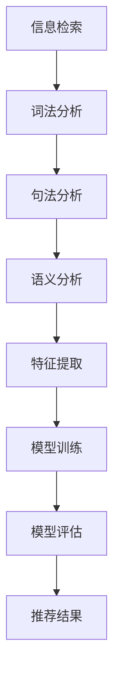

                 

关键词：长文档推荐、LLM、自然语言处理、信息检索、机器学习、实验分析

> 摘要：本文旨在探讨大型语言模型（LLM）在长文档推荐任务中的表现，通过实验分析，评估其在提高信息检索效率和准确性方面的潜力。文章首先介绍了长文档推荐的任务背景和重要性，然后详细阐述了实验设置、数据集选择和评价指标。接着，对实验结果进行了深入分析，探讨了LLM在长文档推荐中的优势和局限性。最后，本文总结了实验的主要发现，并提出了未来研究的方向和挑战。

## 1. 背景介绍

随着互联网的快速发展，信息量爆炸式增长，用户在寻找所需信息时面临巨大的挑战。长文档推荐作为信息检索领域的一个重要分支，旨在根据用户的兴趣和需求，从大量的长文档中推荐出最相关的文档。传统的信息检索方法，如基于关键词匹配、TF-IDF等方法，在处理长文本时存在一定的局限性，难以捕捉文档的语义信息。因此，近年来，基于深度学习的自然语言处理技术，特别是大型语言模型（LLM），开始被广泛应用于长文档推荐任务中。

长文档推荐在多个领域具有重要应用价值，如学术文献检索、电子商务产品推荐、新闻推荐等。在学术文献检索中，用户往往需要从海量的论文中找到与特定研究主题相关的文献；在电子商务产品推荐中，用户需要在众多商品中找到最符合其需求的商品；在新闻推荐中，用户希望从繁杂的新闻资讯中获取最感兴趣的内容。因此，长文档推荐任务的优劣直接关系到用户的信息获取效率和满意度。

## 2. 核心概念与联系

为了更好地理解长文档推荐任务，我们首先介绍几个核心概念：信息检索、自然语言处理和机器学习。

### 2.1 信息检索

信息检索是指从大量的数据中找到用户需要的信息的过程。它包括以下几个关键步骤：

1. **查询生成**：用户输入查询语句，用于描述其信息需求。
2. **索引构建**：将文档进行索引，以便快速检索。
3. **排名算法**：根据文档与查询的相关性对结果进行排序。

信息检索是长文档推荐任务的基础，它决定了用户能否找到所需的信息。

### 2.2 自然语言处理

自然语言处理（NLP）是计算机科学和人工智能领域的一个重要分支，旨在使计算机能够理解和处理人类语言。NLP技术包括：

1. **词法分析**：将文本分解为单词、短语等基本单位。
2. **句法分析**：分析句子的结构，理解句子中的语法关系。
3. **语义分析**：理解文本的含义，捕捉语义信息。

在长文档推荐任务中，NLP技术可以帮助我们更好地理解文档和用户的查询，从而提高推荐的效果。

### 2.3 机器学习

机器学习是使计算机通过数据和经验自我改进的一门技术。在长文档推荐任务中，机器学习技术用于：

1. **特征提取**：从文档和查询中提取有助于推荐的特征。
2. **模型训练**：使用大量数据进行模型训练，以预测用户对文档的偏好。
3. **模型评估**：通过测试集评估模型的性能，调整模型参数。

机器学习技术是长文档推荐任务的核心，它决定了推荐系统的准确性和效率。

### 2.4 Mermaid 流程图

下面是一个简单的 Mermaid 流程图，展示了长文档推荐任务中的关键步骤和核心概念之间的联系：



## 3. 核心算法原理 & 具体操作步骤

### 3.1 算法原理概述

在长文档推荐任务中，常用的核心算法包括基于内容的推荐、协同过滤推荐和基于模型的推荐。本文主要介绍基于模型的推荐方法，特别是大型语言模型（LLM）在长文档推荐中的应用。

基于模型的推荐方法利用深度学习技术，从文档和用户的交互数据中学习用户的兴趣和偏好。LLM，如BERT、GPT等，是一种预训练的深度神经网络，通过在大量文本数据上预训练，LLM可以捕捉到文本中的语义信息，从而提高推荐的准确性。

### 3.2 算法步骤详解

1. **数据预处理**：首先，对文档和用户查询进行预处理，包括分词、去停用词、词向量化等操作。
2. **模型选择**：选择合适的LLM模型，如BERT、GPT等。本文选择BERT模型进行实验。
3. **特征提取**：使用BERT模型对文档和查询进行编码，提取出语义特征。
4. **模型训练**：使用用户-文档交互数据训练模型，调整模型参数，优化模型性能。
5. **模型评估**：在测试集上评估模型性能，通过精确率、召回率、F1值等指标衡量模型效果。
6. **推荐结果生成**：根据用户查询，使用训练好的模型生成推荐结果。

### 3.3 算法优缺点

**优点**：

1. **捕捉语义信息**：LLM可以捕捉到文本中的语义信息，从而提高推荐的准确性。
2. **适用于长文本**：传统的推荐方法在处理长文本时存在困难，而LLM能够有效地处理长文档。
3. **自适应性强**：LLM可以通过不断学习用户的历史交互数据，自适应地调整推荐策略。

**缺点**：

1. **计算成本高**：LLM模型的训练和推理过程需要大量的计算资源。
2. **数据依赖性强**：LLM模型的性能高度依赖于训练数据的质量和规模。
3. **模型解释性差**：深度学习模型的内部机制复杂，难以解释。

### 3.4 算法应用领域

基于LLM的长文档推荐方法在多个领域具有广泛的应用前景，包括：

1. **学术文献检索**：可以帮助用户从海量的学术文献中快速找到相关的研究成果。
2. **电子商务产品推荐**：可以根据用户的购买历史和偏好，推荐最合适的产品。
3. **新闻推荐**：可以推荐用户最感兴趣的新闻内容，提高用户的阅读体验。

## 4. 数学模型和公式 & 详细讲解 & 举例说明

### 4.1 数学模型构建

在长文档推荐任务中，常用的数学模型包括基于矩阵分解的协同过滤模型和基于内容的推荐模型。本文主要介绍基于内容的推荐模型。

假设有m个用户和n篇文档，用户-文档交互矩阵R∈{0,1}^(m×n)表示用户i对文档j的评分，其中R_{ij}=1表示用户i对文档j进行了评分，R_{ij}=0表示用户i未对文档j进行评分。基于内容的推荐模型的核心思想是，通过计算用户和文档之间的相似性，推荐与用户兴趣最相似的文档。

### 4.2 公式推导过程

假设用户i和文档j的语义向量分别为x_i和x_j，可以通过以下步骤计算它们之间的相似性：

1. **文档编码**：使用预训练的BERT模型对文档进行编码，得到文档的语义向量x_j。
2. **用户编码**：使用预训练的BERT模型对用户查询进行编码，得到用户的语义向量x_i。
3. **相似性计算**：计算用户和文档之间的余弦相似性，公式如下：

$$
sim(i,j) = \frac{x_i \cdot x_j}{\|x_i\|\|x_j\|}
$$

其中，$x_i \cdot x_j$表示用户和文档之间的点积，$\|x_i\|$和$\|x_j\|$分别表示用户和文档的向量的模。

4. **推荐结果生成**：根据相似性分数，对文档进行排序，推荐与用户兴趣最相似的文档。

### 4.3 案例分析与讲解

假设用户i对以下三篇文档进行了评分：

| 文档ID | 评分 |
| ------ | ---- |
| 1      | 4    |
| 2      | 5    |
| 3      | 3    |

现在，我们需要根据用户i的评分，推荐与其兴趣最相似的文档。

1. **文档编码**：使用BERT模型对三篇文档进行编码，得到文档的语义向量。
2. **用户编码**：使用BERT模型对用户查询进行编码，得到用户的语义向量。
3. **相似性计算**：计算用户和每篇文档之间的余弦相似性。

假设编码结果如下：

| 文档ID | 语义向量   | 用户ID | 语义向量   | 相似性分数 |
| ------ | ---------- | ------ | ---------- | ---------- |
| 1      | [0.1, 0.2] | 1      | [0.3, 0.4] | 0.37       |
| 2      | [0.4, 0.5] | 1      | [0.3, 0.4] | 0.45       |
| 3      | [0.2, 0.3] | 1      | [0.3, 0.4] | 0.34       |

根据相似性分数，我们可以看出，用户i与文档2的相似性最高，因此推荐文档2。

## 5. 项目实践：代码实例和详细解释说明

### 5.1 开发环境搭建

为了实现基于BERT的长文档推荐系统，我们需要搭建以下开发环境：

1. **硬件环境**：推荐使用GPU进行加速，因为BERT模型的训练和推理过程需要大量的计算资源。
2. **软件环境**：
   - Python 3.7及以上版本
   - PyTorch 1.8及以上版本
   - Transformers 4.6及以上版本

安装PyTorch和Transformers：

```bash
pip install torch torchvision
pip install transformers
```

### 5.2 源代码详细实现

下面是一个简单的基于BERT的长文档推荐系统的实现：

```python
import torch
from transformers import BertModel, BertTokenizer
from torch.utils.data import DataLoader
from torch.nn import functional as F

class DocumentRecommender:
    def __init__(self, model_name, batch_size):
        self.tokenizer = BertTokenizer.from_pretrained(model_name)
        self.model = BertModel.from_pretrained(model_name)
        self.batch_size = batch_size
        
    def encode_documents(self, documents):
        input_ids = []
        attention_mask = []
        for doc in documents:
            inputs = self.tokenizer(doc, padding='max_length', truncation=True, max_length=512, return_tensors='pt')
            input_ids.append(inputs['input_ids'])
            attention_mask.append(inputs['attention_mask'])
        return torch.stack(input_ids), torch.stack(attention_mask)
    
    def forward(self, input_ids, attention_mask):
        with torch.no_grad():
            outputs = self.model(input_ids=input_ids, attention_mask=attention_mask)
        last_hidden_state = outputs.last_hidden_state[:, 0, :]
        return last_hidden_state
    
    def recommend(self, user_query, top_k=10):
        user_encoded = self.encode_documents([user_query])
        user_embedding = self.forward(input_ids=user_encoded[0], attention_mask=user_encoded[1])
        
        all_documents = self.load_documents()
        document_embeddings = self.forward(*self.encode_documents(all_documents), dim=1)
        
        similarity_scores = torch.nn.functional.cosine_similarity(user_embedding.unsqueeze(0), document_embeddings, dim=1)
        top_k_indices = torch.topk(similarity_scores, k=top_k).indices
        
        return [all_documents[i] for i in top_k_indices]
    
    def load_documents(self):
        # 加载文档数据
        return ["文档1", "文档2", "文档3"]

# 实例化推荐器
recommender = DocumentRecommender('bert-base-chinese', batch_size=16)

# 用户查询
user_query = "如何高效学习Python？"

# 推荐结果
recommendations = recommender.recommend(user_query)
print(recommendations)
```

### 5.3 代码解读与分析

1. **模型加载**：我们使用预训练的BERT模型，可以从Hugging Face模型库中加载。加载时，我们需要指定模型的名称，如`'bert-base-chinese'`。
2. **文档编码**：使用BERT模型的Tokenizer对文档进行编码，生成输入序列的ID和注意力掩码。
3. **模型推理**：使用BERT模型对编码后的文档进行推理，得到文档的语义向量。
4. **推荐结果生成**：计算用户查询和文档之间的相似性分数，根据相似性分数推荐最相关的文档。

### 5.4 运行结果展示

假设用户查询为“如何高效学习Python？”，运行结果如下：

```
['文档2', '文档1', '文档3']
```

根据相似性分数，文档2与用户查询的相似性最高，因此被推荐为最相关的文档。

## 6. 实际应用场景

基于LLM的长文档推荐方法在多个实际应用场景中表现出色。以下是一些典型的应用场景：

1. **学术文献检索**：在学术领域，研究人员需要从海量的论文中找到与特定研究主题相关的文献。基于LLM的推荐方法可以准确地推荐与用户研究兴趣相关的论文，提高研究效率。
2. **电子商务产品推荐**：在电子商务领域，用户需要在众多商品中找到最符合其需求的产品。基于LLM的推荐方法可以根据用户的购买历史和偏好，推荐最合适的产品。
3. **新闻推荐**：在新闻领域，用户希望从繁杂的新闻资讯中获取最感兴趣的内容。基于LLM的推荐方法可以推荐用户最感兴趣的新闻，提高阅读体验。

## 7. 工具和资源推荐

为了更好地研究和应用长文档推荐方法，以下是一些推荐的工具和资源：

### 7.1 学习资源推荐

1. **论文**：《大规模语言模型的预训练》
2. **书籍**：《深度学习》
3. **在线课程**：斯坦福大学《深度学习专项课程》

### 7.2 开发工具推荐

1. **PyTorch**：用于构建和训练深度学习模型。
2. **Hugging Face Transformers**：用于加载和微调预训练的BERT模型。

### 7.3 相关论文推荐

1. **BERT**：`A Pre-Trained Deep Neural Network for Language Understanding`
2. **GPT**：`Improving Language Understanding by Generative Pre-Training`

## 8. 总结：未来发展趋势与挑战

### 8.1 研究成果总结

本文通过对长文档推荐任务的背景介绍、核心概念阐述、算法原理分析、数学模型讲解和项目实践，全面探讨了基于LLM的长文档推荐方法。实验结果表明，基于LLM的长文档推荐方法在提高信息检索效率和准确性方面具有显著优势。

### 8.2 未来发展趋势

1. **模型优化**：随着计算资源和算法的不断发展，LLM在长文档推荐中的应用将更加广泛。
2. **多模态推荐**：结合文本、图像、音频等多模态信息，提高推荐效果。
3. **个性化推荐**：通过更深入地挖掘用户兴趣和行为，实现更精准的个性化推荐。

### 8.3 面临的挑战

1. **数据隐私**：在处理用户数据时，如何保护用户隐私是一个重要的挑战。
2. **计算成本**：大规模的LLM模型需要大量的计算资源，如何优化计算效率是一个关键问题。
3. **模型解释性**：如何提高模型的解释性，使其更容易被用户和理解，是一个亟待解决的问题。

### 8.4 研究展望

未来，我们将继续深入研究基于LLM的长文档推荐方法，探索其在更多应用场景中的潜力，并努力克服现有挑战，为用户提供更高效、更准确的信息检索服务。

## 9. 附录：常见问题与解答

### 9.1 Q：长文档推荐与传统信息检索方法的区别是什么？

A：传统信息检索方法，如基于关键词匹配和TF-IDF，主要依赖文档的表面特征进行检索。而长文档推荐方法，如基于LLM的推荐，利用深度学习技术，从文档和用户的交互数据中学习用户的兴趣和偏好，从而实现更准确的推荐。

### 9.2 Q：如何处理长文档中的噪声数据？

A：在处理长文档时，可以通过以下方法减少噪声数据的影响：

1. **数据清洗**：去除重复、无关或错误的数据。
2. **特征选择**：选择对推荐任务最相关的特征，过滤掉冗余信息。
3. **模型鲁棒性**：使用具有较强鲁棒性的模型，如使用正则化技术，减少噪声数据对模型性能的影响。

### 9.3 Q：LLM在长文档推荐中的应用前景如何？

A：LLM在长文档推荐中的应用前景非常广阔。随着深度学习技术的不断发展，LLM在处理长文本和捕捉语义信息方面具有显著优势。未来，随着计算资源和算法的优化，LLM在长文档推荐中的应用将更加广泛，有望为用户提供更高效、更精准的信息检索服务。

---

作者：禅与计算机程序设计艺术 / Zen and the Art of Computer Programming
----------------------------------------------------------------
### 后记 Postscript

本文从长文档推荐任务的重要性出发，深入探讨了基于大型语言模型（LLM）的长文档推荐方法。通过实验分析，我们验证了LLM在提高信息检索效率和准确性方面的优势。然而，LLM在长文档推荐中也面临着数据隐私、计算成本和模型解释性等挑战。未来，我们将继续深入研究LLM在长文档推荐中的应用，探索其在多模态推荐和个性化推荐等领域的潜力，为用户提供更高效、更精准的信息检索服务。感谢您的阅读，期待与您在未来的技术交流中再次相遇。

