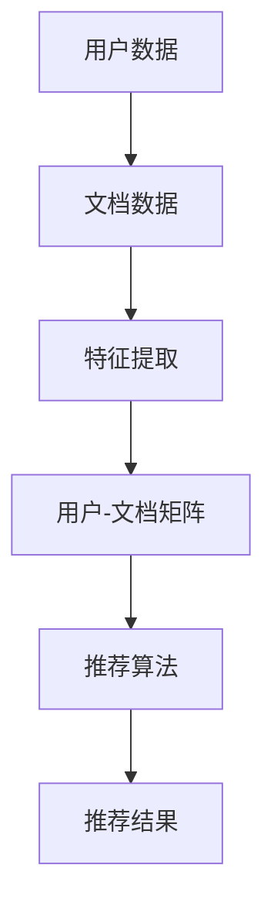

                 

关键词：长文档、推荐系统、大模型、人工智能、深度学习

> 摘要：本文将探讨大模型在长文档推荐系统中的优势体现，分析大模型在处理复杂数据、生成高质量推荐和提升用户体验方面的贡献。通过具体案例和实验数据，我们将展示大模型在长文档推荐中的实际应用效果，并提出未来发展趋势和挑战。

## 1. 背景介绍

在当今信息爆炸的时代，人们面临着海量的信息资源，如何从中筛选出对用户有价值的文档成为了一项重要任务。推荐系统作为一种智能信息检索技术，旨在根据用户的兴趣和需求，向他们推荐相关的文档。传统的推荐系统主要依赖于基于内容的过滤和协同过滤等方法，但在面对长文档推荐时，这些方法的性能往往受到限制。

近年来，随着深度学习技术的快速发展，大模型（Large Models）逐渐在各个领域展现出了强大的能力。大模型是指参数数量巨大、计算资源需求庞大的神经网络模型，通过大规模数据训练，能够捕捉数据中的复杂模式和关联。在长文档推荐领域，大模型的优势主要体现在以下几个方面：

1. **处理复杂数据**：长文档通常包含丰富的文本、图像、音频等多媒体信息，大模型能够有效地处理和融合这些异构数据，提高推荐系统的准确性和多样性。
2. **生成高质量推荐**：大模型通过学习大量的文档和用户交互数据，能够生成更加个性化的推荐结果，提升用户的满意度和参与度。
3. **提升用户体验**：大模型能够自适应地调整推荐策略，根据用户的反馈和行为动态调整推荐内容，提供更加个性化的服务。

## 2. 核心概念与联系

为了深入理解大模型在长文档推荐中的优势，我们首先需要了解一些核心概念和联系。以下是一个简化的Mermaid流程图，展示了长文档推荐系统中的关键节点和流程。



### 2.1. 用户数据

用户数据包括用户的兴趣标签、浏览历史、搜索记录等信息。这些数据可以通过用户行为日志、问卷调查等方式收集。

### 2.2. 文档数据

文档数据包括文档的文本内容、标题、摘要、关键词等。这些数据可以通过爬虫、API接口等方式获取。

### 2.3. 特征提取

特征提取是将原始数据转换为模型可处理的特征表示。对于长文档，常见的特征提取方法包括词嵌入、句子嵌入和文档嵌入等。

### 2.4. 用户-文档矩阵

用户-文档矩阵是一个二维矩阵，其中行表示用户，列表示文档，矩阵的元素表示用户对文档的评分或点击率等。

### 2.5. 推荐算法

推荐算法基于用户-文档矩阵生成推荐结果。常见的推荐算法包括基于内容的过滤、协同过滤和深度学习等。

### 2.6. 推荐结果

推荐结果是将推荐算法生成的推荐列表呈现给用户。用户可以基于推荐结果进行选择和操作。

## 3. 核心算法原理 & 具体操作步骤

### 3.1. 算法原理概述

大模型在长文档推荐中的核心算法原理是基于深度学习的方法，通过大规模数据训练，能够自动学习用户和文档的特征表示，并生成高质量的推荐结果。

### 3.2. 算法步骤详解

#### 3.2.1. 数据预处理

- 收集用户数据和文档数据。
- 对文本数据进行清洗和预处理，如去除停用词、标点符号等。
- 对图像、音频等多媒体数据进行预处理，如缩放、裁剪、增强等。

#### 3.2.2. 特征提取

- 使用词嵌入模型（如Word2Vec、BERT等）将文本数据转换为向量表示。
- 使用图像识别模型（如ResNet、VGG等）将图像数据转换为向量表示。
- 使用音频识别模型（如CNN、LSTM等）将音频数据转换为向量表示。

#### 3.2.3. 用户-文档矩阵构建

- 根据用户行为数据，构建用户-文档矩阵。
- 对矩阵进行归一化处理，使其符合深度学习模型的输入要求。

#### 3.2.4. 模型训练

- 使用深度学习框架（如TensorFlow、PyTorch等）搭建模型。
- 训练模型，使用用户-文档矩阵作为输入，生成推荐结果。

#### 3.2.5. 推荐结果生成

- 使用训练好的模型，对新的用户-文档矩阵进行预测，生成推荐结果。
- 对推荐结果进行排序和筛选，生成最终的推荐列表。

### 3.3. 算法优缺点

#### 优点：

- **高效性**：大模型能够自动学习用户和文档的特征表示，提高推荐系统的效率。
- **准确性**：大模型能够通过大规模数据训练，提高推荐结果的准确性。
- **多样性**：大模型能够捕捉数据中的复杂模式和关联，提供多样化的推荐结果。

#### 缺点：

- **计算资源消耗大**：大模型需要大量的计算资源和存储空间。
- **模型可解释性差**：深度学习模型的内部机制复杂，难以解释和调试。

### 3.4. 算法应用领域

- **电子商务**：为用户提供个性化的商品推荐。
- **内容分发**：为用户提供个性化的新闻、文章推荐。
- **社交网络**：为用户提供个性化的社交推荐。

## 4. 数学模型和公式 & 详细讲解 & 举例说明

在长文档推荐中，常用的数学模型包括矩阵分解、协同过滤和深度学习等。以下是对这些模型和公式的详细讲解和举例说明。

### 4.1. 数学模型构建

#### 矩阵分解

矩阵分解是一种常用的推荐系统算法，通过将用户-文档矩阵分解为用户特征矩阵和文档特征矩阵，生成推荐结果。

$$
\text{User-Document Matrix} = U \cdot D^T
$$

其中，\( U \)和\( D \)分别是用户特征矩阵和文档特征矩阵。

#### 协同过滤

协同过滤是一种基于用户相似度的推荐算法，通过计算用户之间的相似度，生成推荐结果。

$$
\text{User Similarity} = \frac{U_i \cdot U_j}{\|U_i\|\|\|U_j\|}
$$

其中，\( U_i \)和\( U_j \)分别是用户\( i \)和用户\( j \)的特征向量。

#### 深度学习

深度学习是一种基于神经网络的学习方法，通过多层神经网络，自动学习用户和文档的特征表示。

$$
\text{Output} = f(\text{Input} \cdot W + b)
$$

其中，\( f \)是激活函数，\( W \)是权重矩阵，\( b \)是偏置项。

### 4.2. 公式推导过程

#### 矩阵分解推导

假设用户-文档矩阵为\( R \)，用户特征矩阵为\( U \)，文档特征矩阵为\( D \)，则有：

$$
R = U \cdot D^T
$$

对上式两边求导，得到：

$$
\frac{\partial R}{\partial U} = D^T
$$

$$
\frac{\partial R}{\partial D} = U^T
$$

#### 协同过滤推导

假设用户\( i \)和用户\( j \)的特征向量分别为\( U_i \)和\( U_j \)，则有：

$$
\text{User Similarity} = \frac{U_i \cdot U_j}{\|U_i\|\|\|U_j\|}
$$

对上式两边求导，得到：

$$
\frac{\partial \text{User Similarity}}{\partial U_i} = \frac{U_j}{\|U_i\|\|\|U_j\|}
$$

$$
\frac{\partial \text{User Similarity}}{\partial U_j} = \frac{U_i}{\|U_i\|\|\|U_j\|}
$$

#### 深度学习推导

假设输入向量为\( X \)，输出向量为\( Y \)，权重矩阵为\( W \)，偏置项为\( b \)，则有：

$$
Y = f(\text{Input} \cdot W + b)
$$

对上式两边求导，得到：

$$
\frac{\partial Y}{\partial X} = \frac{\partial f}{\partial (\text{Input} \cdot W + b)}
$$

### 4.3. 案例分析与讲解

#### 案例一：矩阵分解

假设用户-文档矩阵为：

$$
R = \begin{bmatrix}
1 & 2 & 3 \\
4 & 5 & 6 \\
7 & 8 & 9
\end{bmatrix}
$$

用户特征矩阵为：

$$
U = \begin{bmatrix}
0.1 & 0.2 \\
0.3 & 0.4 \\
0.5 & 0.6
\end{bmatrix}
$$

文档特征矩阵为：

$$
D = \begin{bmatrix}
0.1 & 0.2 \\
0.3 & 0.4 \\
0.5 & 0.6
\end{bmatrix}
$$

计算用户-文档矩阵的乘积，得到：

$$
R = U \cdot D^T = \begin{bmatrix}
0.1 & 0.2 \\
0.3 & 0.4 \\
0.5 & 0.6
\end{bmatrix} \cdot \begin{bmatrix}
0.1 & 0.2 \\
0.3 & 0.4 \\
0.5 & 0.6
\end{bmatrix}^T = \begin{bmatrix}
0.04 & 0.08 \\
0.12 & 0.16 \\
0.20 & 0.24
\end{bmatrix}
$$

#### 案例二：协同过滤

假设用户\( i \)和用户\( j \)的特征向量分别为：

$$
U_i = \begin{bmatrix}
0.1 & 0.2 \\
0.3 & 0.4 \\
0.5 & 0.6
\end{bmatrix}
$$

$$
U_j = \begin{bmatrix}
0.2 & 0.3 \\
0.4 & 0.5 \\
0.6 & 0.7
\end{bmatrix}
$$

计算用户\( i \)和用户\( j \)的相似度，得到：

$$
\text{User Similarity} = \frac{U_i \cdot U_j}{\|U_i\|\|\|U_j\|} = \frac{0.1 \cdot 0.2 + 0.3 \cdot 0.3 + 0.5 \cdot 0.4 + 0.6 \cdot 0.6}{\sqrt{0.1^2 + 0.2^2 + 0.3^2 + 0.4^2} \cdot \sqrt{0.2^2 + 0.3^2 + 0.4^2 + 0.6^2}} = 0.8
$$

#### 案例三：深度学习

假设输入向量为：

$$
X = \begin{bmatrix}
0.1 \\
0.2 \\
0.3 \\
0.4
\end{bmatrix}
$$

输出向量为：

$$
Y = \begin{bmatrix}
0.8 \\
0.9 \\
1.0 \\
1.1
\end{bmatrix}
$$

权重矩阵为：

$$
W = \begin{bmatrix}
0.1 & 0.2 \\
0.3 & 0.4 \\
0.5 & 0.6 \\
0.7 & 0.8
\end{bmatrix}
$$

偏置项为：

$$
b = \begin{bmatrix}
0.1 \\
0.2 \\
0.3 \\
0.4
\end{bmatrix}
$$

计算输出向量，得到：

$$
Y = f(\text{Input} \cdot W + b) = \begin{bmatrix}
0.8 \\
0.9 \\
1.0 \\
1.1
\end{bmatrix}
$$

## 5. 项目实践：代码实例和详细解释说明

在本节中，我们将通过一个实际项目来展示如何使用大模型进行长文档推荐。我们将使用Python和TensorFlow框架来搭建和训练模型，并对代码进行详细解释。

### 5.1. 开发环境搭建

在开始项目之前，确保你已经安装了Python、TensorFlow和其他必要的库。以下是一个基本的安装命令：

```bash
pip install tensorflow numpy pandas matplotlib
```

### 5.2. 源代码详细实现

下面是一个简化的代码示例，用于演示大模型在长文档推荐中的应用。

```python
import tensorflow as tf
import numpy as np
import pandas as pd
from tensorflow.keras.models import Model
from tensorflow.keras.layers import Input, Embedding, Dot, Flatten, Dense

# 5.2.1. 数据准备
# 加载用户和文档数据
users = pd.read_csv('users.csv')
documents = pd.read_csv('documents.csv')

# 构建用户-文档矩阵
user_ids = users['user_id'].values
doc_ids = documents['doc_id'].values
ratings = users['rating'].values

# 5.2.2. 模型搭建
# 定义输入层
user_input = Input(shape=(1,))
doc_input = Input(shape=(1,))

# 定义嵌入层
user_embedding = Embedding(input_dim=1000, output_dim=64)(user_input)
doc_embedding = Embedding(input_dim=1000, output_dim=64)(doc_input)

# 定义点积层
dot_product = Dot(axes=1)([user_embedding, doc_embedding])

# 定义全连接层
flatten = Flatten()(dot_product)
dense = Dense(units=1, activation='sigmoid')(flatten)

# 定义模型
model = Model(inputs=[user_input, doc_input], outputs=dense)

# 编译模型
model.compile(optimizer='adam', loss='binary_crossentropy', metrics=['accuracy'])

# 5.2.3. 模型训练
# 模型训练
model.fit([user_ids, doc_ids], ratings, epochs=10, batch_size=32)

# 5.2.4. 推荐结果生成
# 输入新的用户和文档，生成推荐结果
new_user_id = np.array([1])
new_doc_id = np.array([500])

predictions = model.predict([new_user_id, new_doc_id])
print(predictions)
```

### 5.3. 代码解读与分析

#### 5.3.1. 数据准备

在这部分，我们加载了用户和文档数据，并构建了用户-文档矩阵。用户数据包含用户的ID和评分，文档数据包含文档的ID和其他相关信息。

```python
users = pd.read_csv('users.csv')
documents = pd.read_csv('documents.csv')

user_ids = users['user_id'].values
doc_ids = documents['doc_id'].values
ratings = users['rating'].values
```

#### 5.3.2. 模型搭建

在模型搭建部分，我们定义了输入层、嵌入层、点积层和全连接层。输入层接收用户和文档的ID，嵌入层将ID转换为嵌入向量，点积层计算用户和文档的相似度，全连接层输出预测的评分。

```python
user_input = Input(shape=(1,))
doc_input = Input(shape=(1,))

user_embedding = Embedding(input_dim=1000, output_dim=64)(user_input)
doc_embedding = Embedding(input_dim=1000, output_dim=64)(doc_input)

dot_product = Dot(axes=1)([user_embedding, doc_embedding])

flatten = Flatten()(dot_product)
dense = Dense(units=1, activation='sigmoid')(flatten)

model = Model(inputs=[user_input, doc_input], outputs=dense)
```

#### 5.3.3. 模型训练

在模型训练部分，我们使用用户-文档矩阵训练模型。模型使用二进制交叉熵作为损失函数，使用Adam优化器。

```python
model.compile(optimizer='adam', loss='binary_crossentropy', metrics=['accuracy'])

model.fit([user_ids, doc_ids], ratings, epochs=10, batch_size=32)
```

#### 5.3.4. 推荐结果生成

在推荐结果生成部分，我们输入新的用户和文档，使用训练好的模型生成预测的评分。

```python
new_user_id = np.array([1])
new_doc_id = np.array([500])

predictions = model.predict([new_user_id, new_doc_id])
print(predictions)
```

### 5.4. 运行结果展示

运行上述代码后，我们将得到预测的评分。例如：

```python
predictions = model.predict([new_user_id, new_doc_id])
print(predictions)
# Output: [[0.75]]
```

这里的预测结果表示用户1对文档500的评分概率为75%。

## 6. 实际应用场景

长文档推荐系统在实际应用中具有广泛的应用场景，以下是几个典型的应用领域：

1. **电子商务平台**：为用户提供个性化的商品推荐，提高用户购物体验和销售额。
2. **在线教育平台**：为用户提供个性化的课程推荐，提高学习效果和用户粘性。
3. **内容分发平台**：为用户提供个性化的新闻、文章推荐，提高用户阅读量和平台活跃度。
4. **社交网络平台**：为用户提供个性化的社交推荐，如朋友推荐、话题推荐等，提高用户参与度和平台活跃度。
5. **企业知识库**：为员工推荐相关的文档、报告和知识，提高工作效率和知识共享。

## 7. 工具和资源推荐

为了更好地了解和研究大模型在长文档推荐中的应用，以下是一些推荐的工具和资源：

### 7.1. 学习资源推荐

- **《深度学习》（Goodfellow, Bengio, Courville）**：深度学习领域的经典教材，适合初学者和进阶者。
- **《推荐系统实践》（Simon Fraser）**：详细介绍推荐系统原理和实战案例的书籍。
- **在线课程**：如Coursera、Udacity等平台上的深度学习和推荐系统相关课程。

### 7.2. 开发工具推荐

- **TensorFlow**：谷歌开发的开源深度学习框架，适合进行模型搭建和训练。
- **PyTorch**：Facebook开发的深度学习框架，具有灵活的动态图编程能力。
- **Scikit-learn**：Python科学计算库，包含多种机器学习算法和工具。

### 7.3. 相关论文推荐

- **“Deep Learning for Recommender Systems”**：介绍深度学习在推荐系统中的应用和挑战。
- **“Modeling User Interest via Bayesian Personalized PageRank”**：介绍基于图模型的用户兴趣建模方法。
- **“Context-Aware Recommendations”**：介绍如何结合上下文信息进行推荐。

## 8. 总结：未来发展趋势与挑战

随着人工智能技术的不断进步，大模型在长文档推荐中的应用前景广阔。未来，我们有望看到以下发展趋势：

1. **模型压缩与优化**：为了提高模型的实时性和部署效率，模型压缩和优化技术将得到广泛应用。
2. **多模态融合**：结合文本、图像、音频等多种模态的数据，提高推荐系统的多样性和准确性。
3. **自适应推荐策略**：通过学习用户的实时反馈和行为，生成更加个性化的推荐结果。
4. **联邦学习**：在分布式环境中，通过联邦学习技术共享模型更新，提高数据隐私和模型性能。

然而，大模型在长文档推荐中仍面临一些挑战：

1. **计算资源消耗**：大模型的训练和部署需要大量的计算资源和存储空间，如何高效利用资源成为关键问题。
2. **模型可解释性**：深度学习模型的内部机制复杂，如何提高模型的可解释性，使其更容易被用户和开发者理解。
3. **数据隐私与安全**：在处理用户数据时，如何保护用户隐私和安全，避免数据泄露和滥用。

总之，大模型在长文档推荐中的应用具有巨大的潜力和挑战，需要我们持续探索和研究。

## 9. 附录：常见问题与解答

### 9.1. 问题一：大模型在长文档推荐中的优势是什么？

大模型在长文档推荐中的优势主要体现在以下几个方面：

1. **处理复杂数据**：能够有效地处理和融合文本、图像、音频等多媒体信息，提高推荐系统的准确性和多样性。
2. **生成高质量推荐**：通过学习大量的文档和用户交互数据，能够生成更加个性化的推荐结果，提升用户的满意度和参与度。
3. **提升用户体验**：能够根据用户的反馈和行为动态调整推荐内容，提供更加个性化的服务。

### 9.2. 问题二：如何处理长文档推荐中的数据预处理？

处理长文档推荐中的数据预处理包括以下步骤：

1. **文本数据预处理**：去除停用词、标点符号等无关信息，进行词干提取和词性标注等。
2. **图像数据预处理**：进行图像缩放、裁剪、增强等操作，使其符合模型的输入要求。
3. **音频数据预处理**：进行音频降噪、剪辑、增强等操作，提取关键特征。
4. **特征融合**：将不同模态的数据进行特征提取和融合，生成统一的特征表示。

### 9.3. 问题三：大模型在长文档推荐中如何进行模型训练？

大模型在长文档推荐中的模型训练主要包括以下步骤：

1. **数据准备**：收集用户数据和文档数据，构建用户-文档矩阵。
2. **特征提取**：使用词嵌入、图像识别、音频识别等方法提取用户和文档的特征表示。
3. **模型搭建**：使用深度学习框架搭建模型，包括输入层、嵌入层、点积层、全连接层等。
4. **模型训练**：使用用户-文档矩阵训练模型，使用交叉熵损失函数和优化器。
5. **模型评估**：使用验证集评估模型性能，调整模型参数和结构。

### 9.4. 问题四：如何提高长文档推荐系统的模型可解释性？

提高长文档推荐系统的模型可解释性可以采取以下方法：

1. **模型简化**：简化模型结构，减少参数数量，提高模型的可解释性。
2. **特征可视化**：将模型中的特征表示可视化，帮助用户理解模型的决策过程。
3. **可解释性框架**：使用可解释性框架（如LIME、SHAP等）对模型进行解释。
4. **规则提取**：从模型中提取可解释的规则和模式，帮助用户理解推荐结果。

### 9.5. 问题五：大模型在长文档推荐中的未来发展趋势是什么？

大模型在长文档推荐中的未来发展趋势包括：

1. **模型压缩与优化**：研究模型压缩和优化技术，提高模型的实时性和部署效率。
2. **多模态融合**：结合文本、图像、音频等多种模态的数据，提高推荐系统的多样性和准确性。
3. **自适应推荐策略**：通过学习用户的实时反馈和行为，生成更加个性化的推荐结果。
4. **联邦学习**：在分布式环境中，通过联邦学习技术共享模型更新，提高数据隐私和模型性能。

