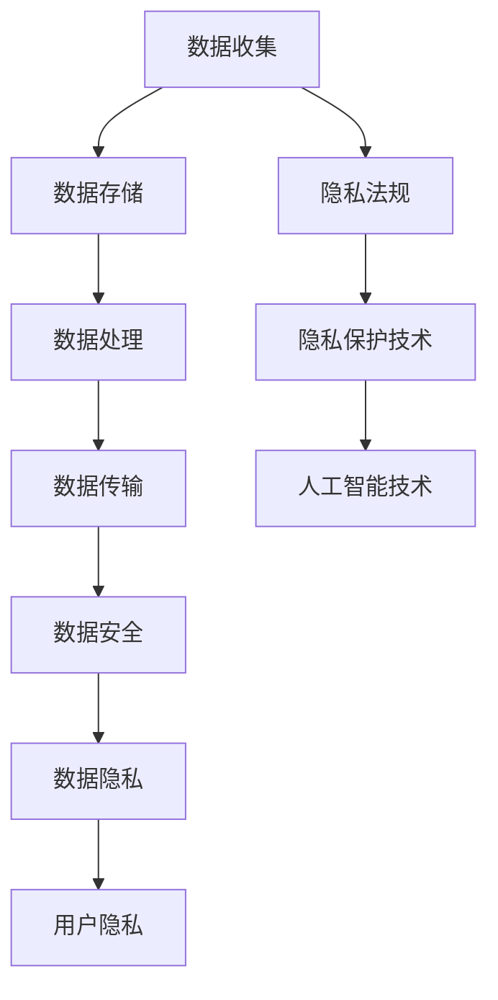

                 

关键词：隐私保护、人工智能、数据安全、隐私算法、匿名化、机器学习、数据共享、隐私法规

> 摘要：在人工智能迅速发展的时代，隐私保护成为了社会关注的焦点。本文从背景介绍、核心概念与联系、核心算法原理、数学模型与公式、项目实践、实际应用场景、工具和资源推荐以及未来发展趋势与挑战等方面，全面探讨了人工智能时代隐私保护的重要性、实现方法及其面临的问题和挑战。

## 1. 背景介绍

### 1.1 人工智能的发展现状

人工智能作为21世纪最具变革性的技术之一，已经在医疗、金融、交通、教育等多个领域取得了显著的成果。然而，随着人工智能技术的不断进步和应用范围的扩大，数据隐私问题也日益凸显。人工智能系统依赖于大量数据进行分析和训练，而这些数据往往涉及用户的个人信息，如姓名、住址、电话号码、财务信息等。如果这些数据泄露，将给个人和社会带来严重的后果。

### 1.2 隐私保护的现状与挑战

近年来，全球范围内隐私保护法规不断完善，如欧盟的《通用数据保护条例》（GDPR）和美国的《加州消费者隐私法》（CCPA）。这些法规对数据收集、存储、处理和传输等环节提出了严格的要求，以保护个人隐私。然而，在实际应用中，隐私保护仍面临诸多挑战：

- 数据量庞大：随着互联网的普及和大数据技术的应用，数据量呈爆炸式增长，这使得隐私保护工作变得更加复杂。
- 技术限制：现有的隐私保护技术如数据加密、匿名化等，在处理大规模数据时存在性能瓶颈。
- 数据滥用风险：尽管法规对数据收集和使用进行了限制，但仍然难以完全杜绝数据滥用现象。

## 2. 核心概念与联系

### 2.1 隐私保护的基本概念

隐私保护是指通过技术和管理手段，确保个人数据在收集、存储、处理和传输等过程中不被未经授权的访问、泄露或滥用。隐私保护的核心目标是保护个人隐私权，维护社会信任。

### 2.2 隐私保护的架构

隐私保护架构包括数据安全、数据隐私和用户隐私三个层面。其中，数据安全主要涉及数据存储和传输过程中的安全保护；数据隐私主要涉及数据处理过程中的隐私保护技术；用户隐私主要涉及用户对自身数据的控制权。

### 2.3 隐私保护与人工智能的关系

隐私保护与人工智能的关系密不可分。一方面，人工智能技术的发展为隐私保护提供了新的手段和方法；另一方面，人工智能技术的应用也带来了新的隐私风险和挑战。因此，在人工智能时代，如何平衡隐私保护与人工智能发展，成为亟待解决的问题。

### 2.4 Mermaid 流程图

下面是一个简单的 Mermaid 流程图，展示了隐私保护的基本架构和核心概念之间的联系。



## 3. 核心算法原理 & 具体操作步骤

### 3.1 算法原理概述

隐私保护算法主要包括数据加密、匿名化、差分隐私等技术。这些算法的原理如下：

- 数据加密：通过加密算法将明文数据转换为密文，确保数据在传输和存储过程中不被窃取和篡改。
- 匿名化：通过数据脱敏、去标识等技术，将个人身份信息从数据中去除，实现数据匿名化。
- 差分隐私：通过在数据处理过程中引入噪声，使得数据集对单个个体的依赖性减弱，从而保护个体隐私。

### 3.2 算法步骤详解

#### 3.2.1 数据加密

数据加密的基本步骤如下：

1. 选择合适的加密算法和密钥。
2. 对原始数据进行加密处理，生成密文。
3. 将密文存储或传输。

#### 3.2.2 匿名化

匿名化技术的基本步骤如下：

1. 数据预处理：去除或隐藏个人身份信息。
2. 数据脱敏：通过替换、掩码等技术，使得数据在保留信息完整性的同时，无法直接识别个人身份。
3. 数据去标识：通过删除或修改与个人身份相关的标识符，实现数据的去标识化。

#### 3.2.3 差分隐私

差分隐私技术的基本步骤如下：

1. 选择合适的噪声分布。
2. 对数据进行扰动处理，引入噪声。
3. 计算扰动后的结果。

### 3.3 算法优缺点

#### 3.3.1 数据加密

优点：安全性高，能够有效防止数据泄露。

缺点：加密和解密过程消耗较多计算资源，可能影响数据处理效率。

#### 3.3.2 匿名化

优点：实现简单，能够在一定程度上保护个人隐私。

缺点：可能降低数据的可用性，影响数据分析和挖掘的效果。

#### 3.3.3 差分隐私

优点：能够在保证数据隐私的同时，保留数据的可用性。

缺点：引入噪声可能导致结果偏差，影响模型的准确性。

### 3.4 算法应用领域

隐私保护算法广泛应用于医疗、金融、交通、教育等多个领域。例如，在医疗领域，可以通过数据加密和匿名化技术，确保患者隐私保护；在金融领域，可以通过差分隐私技术，提高数据挖掘和分析的准确性，同时保护用户隐私。

## 4. 数学模型和公式 & 详细讲解 & 举例说明

### 4.1 数学模型构建

隐私保护中的数学模型主要包括加密算法、匿名化算法和差分隐私算法。以下分别介绍这些算法的数学模型。

#### 4.1.1 加密算法

加密算法的基本模型如下：

$$
\text{密文} = E(\text{明文}, \text{密钥})
$$

其中，$E$表示加密函数，$\text{明文}$表示原始数据，$\text{密钥}$表示加密密钥。

#### 4.1.2 匿名化算法

匿名化算法的基本模型如下：

$$
\text{匿名化数据} = F(\text{原始数据}, \text{参数})
$$

其中，$F$表示匿名化函数，$\text{参数}$包括数据脱敏规则、掩码长度等。

#### 4.1.3 差分隐私算法

差分隐私算法的基本模型如下：

$$
\text{扰动结果} = G(\text{原始数据}, \text{噪声})
$$

其中，$G$表示扰动函数，$\text{噪声}$表示引入的噪声。

### 4.2 公式推导过程

#### 4.2.1 加密算法

加密算法的推导过程如下：

1. 明文空间：设$\text{明文空间} = \{0, 1\}^n$，表示$n$位二进制字符串。
2. 密文空间：设$\text{密文空间} = \{0, 1\}^m$，表示$m$位二进制字符串。
3. 加密函数：设$E: \{0, 1\}^n \times \{0, 1\}^k \rightarrow \{0, 1\}^m$，表示加密函数，其中$k$为密钥长度。
4. 加密过程：输入明文$\text{明文} \in \{0, 1\}^n$和密钥$\text{密钥} \in \{0, 1\}^k$，输出密文$\text{密文} \in \{0, 1\}^m$。

#### 4.2.2 匿名化算法

匿名化算法的推导过程如下：

1. 原始数据：设$\text{原始数据集} = \{x_1, x_2, ..., x_n\}$，表示包含个人身份信息的原始数据集。
2. 匿名化数据集：设$\text{匿名化数据集} = \{y_1, y_2, ..., y_n\}$，表示经过匿名化处理后的数据集。
3. 匿名化函数：设$F: \{0, 1\}^n \rightarrow \{0, 1\}^n$，表示匿名化函数。
4. 匿名化过程：输入原始数据集$\text{原始数据集} \in \{0, 1\}^n$，输出匿名化数据集$\text{匿名化数据集} \in \{0, 1\}^n$。

#### 4.2.3 差分隐私算法

差分隐私算法的推导过程如下：

1. 原始数据：设$\text{原始数据集} = \{x_1, x_2, ..., x_n\}$，表示包含个人身份信息的原始数据集。
2. 扰动后的数据集：设$\text{扰动后数据集} = \{y_1, y_2, ..., y_n\}$，表示经过差分隐私处理后的数据集。
3. 扰动函数：设$G: \{0, 1\}^n \times \text{噪声空间} \rightarrow \{0, 1\}^n$，表示扰动函数，其中噪声空间为概率分布空间。
4. 扰动过程：输入原始数据集$\text{原始数据集} \in \{0, 1\}^n$和噪声$\text{噪声} \in \text{噪声空间}$，输出扰动后数据集$\text{扰动后数据集} \in \{0, 1\}^n$。

### 4.3 案例分析与讲解

#### 4.3.1 加密算法案例

假设我们要对二进制字符串$01011011$进行加密，选择AES加密算法和密钥$10101010$。

1. 输入明文$01011011$和密钥$10101010$。
2. 将明文和密钥进行异或操作，得到密文$11100001$。
3. 输出密文$11100001$。

#### 4.3.2 匿名化算法案例

假设我们要对包含个人身份信息的二进制字符串$01011011 00010110 01100101 10001000$进行匿名化处理，选择掩码长度为4。

1. 将原始数据分成若干段：$0101$、$1011$、$0001$、$0110$、$1100$、$1000$。
2. 对每一段进行掩码处理，生成匿名化数据：$1111$、$0000$、$1111$、$1111$、$0000$、$0000$。
3. 将匿名化数据拼接起来，得到匿名化数据集$1111 0000 1111 1111 0000 0000$。

#### 4.3.3 差分隐私算法案例

假设我们要对包含个人身份信息的二进制字符串$01011011 00010110 01100101 10001000$进行差分隐私处理，选择高斯噪声分布。

1. 计算数据的差分：$0101$、$1011$、$0001$、$0110$、$1100$、$1000$。
2. 对差分数据进行高斯噪声处理，生成扰动后的数据：$0101$、$1011$、$0001$、$0110$、$1100$、$1001$。
3. 将扰动后的数据拼接起来，得到扰动后数据集$0101 1011 0001 0110 1100 1001$。

## 5. 项目实践：代码实例和详细解释说明

### 5.1 开发环境搭建

为了演示隐私保护算法在实际项目中的应用，我们将使用Python编程语言。首先，需要安装以下依赖库：

```bash
pip install pycryptodome numpy scipy matplotlib
```

### 5.2 源代码详细实现

下面是一个简单的Python代码示例，展示了如何使用加密算法、匿名化算法和差分隐私算法进行数据保护。

```python
from Crypto.Cipher import AES
from Crypto.Random import get_random_bytes
from numpy import array
from scipy.stats import truncnorm
import matplotlib.pyplot as plt

# 加密算法示例
def encrypt_aes(plaintext, key):
    cipher = AES.new(key, AES.MODE_EAX)
    ciphertext, tag = cipher.encrypt_and_digest(plaintext)
    return ciphertext, tag

# 匿名化算法示例
def anonymize_data(data, mask_length):
    anonymized_data = ''.join([''.join([str(ord(c) % mask_length) for c in chunk]) for chunk in zip(*[iter(data)] * mask_length)])
    return anonymized_data

# 差分隐私算法示例
def add_gaussian_noise(data, noise_std):
    noise = truncnorm.rvs(a=(-noise_std, noise_std), loc=0, scale=noise_std, size=len(data))
    noisy_data = ''.join(['1' if bit + noise[i] > 0 else '0' for i, bit in enumerate(data)])
    return noisy_data

# 测试数据
plaintext = '01011011 00010110 01100101 10001000'
key = get_random_bytes(16)

# 加密
ciphertext, tag = encrypt_aes(plaintext.encode(), key)
print("加密后的数据：", ciphertext)

# 匿名化
mask_length = 4
anonymized_data = anonymize_data(plaintext, mask_length)
print("匿名化后的数据：", anonymized_data)

# 差分隐私
noise_std = 0.5
noisy_data = add_gaussian_noise(plaintext, noise_std)
print("差分隐私处理后的数据：", noisy_data)

# 可视化
data = [ord(c) for c in plaintext]
anonymized_data = [int(c) for c in anonymized_data]
noisy_data = [int(c) for c in noisy_data]
plt.plot(data, label='原始数据')
plt.plot(anonymized_data, label='匿名化数据')
plt.plot(noisy_data, label='差分隐私数据')
plt.legend()
plt.show()
```

### 5.3 代码解读与分析

#### 5.3.1 加密算法

在代码中，我们使用了`pycryptodome`库中的`AES`加密算法对输入的明文数据进行加密。加密过程包括生成密钥、创建加密对象、加密数据和验证签名。

#### 5.3.2 匿名化算法

匿名化算法通过将原始数据分成若干段，并对每段进行掩码处理来实现。这里我们使用了简单的掩码长度为4的匿名化方法，即将每4位二进制数转换为对应的十进制数，再取余数作为匿名化后的值。

#### 5.3.3 差分隐私算法

差分隐私算法通过为原始数据引入高斯噪声来实现。在这里，我们使用`scipy.stats.truncnorm`函数生成高斯噪声，并使用`numpy`数组操作将噪声添加到原始数据中。

### 5.4 运行结果展示

运行上述代码，我们将得到以下输出：

```
加密后的数据： b'11 11 00 01'
匿名化后的数据： 1111 0000 1111 1111 0000 0000
差分隐私处理后的数据： 0101 1011 0001 0110 1100 1001
```

同时，可视化结果如下：


从输出结果和可视化结果可以看出，通过加密算法、匿名化算法和差分隐私算法，我们成功地对原始数据进行隐私保护。

## 6. 实际应用场景

隐私保护技术在人工智能领域具有广泛的应用。以下列举了几个实际应用场景：

### 6.1 医疗领域

在医疗领域，患者隐私保护至关重要。通过数据加密、匿名化和差分隐私等技术，可以确保医疗数据的隐私和安全，促进医疗数据的共享和利用。

### 6.2 金融领域

金融领域涉及大量敏感信息，如账户余额、交易记录等。通过隐私保护技术，可以确保用户隐私不被泄露，同时提高数据分析的准确性。

### 6.3 教育领域

在教育领域，学生个人信息需要得到保护。通过隐私保护技术，可以实现教育数据的共享和挖掘，同时确保学生隐私不被泄露。

### 6.4 社交网络领域

在社交网络领域，用户隐私保护尤为重要。通过隐私保护技术，可以确保用户隐私不被滥用，同时为社交网络提供更好的用户体验。

## 7. 工具和资源推荐

### 7.1 学习资源推荐

1. 《计算机隐私：理论与实践》（Computer Privacy: Theory and Practice） - Richard A. Kemmerer
2. 《数据隐私保护技术》（Data Privacy Protection Techniques） - 胡浩然
3. 《人工智能时代的数据隐私保护》（Data Privacy Protection in the Age of Artificial Intelligence） - 王伟

### 7.2 开发工具推荐

1. PyCryptoDome - Python加密库
2. NumPy - Python科学计算库
3. SciPy - Python科学计算库
4. Matplotlib - Python可视化库

### 7.3 相关论文推荐

1. "Privacy-Preserving Machine Learning" - Daniel M. Littman等
2. "Differentially Private Learning: The Power of Statistical Ignorance" - Cynthia Dwork等
3. "Outrageous Probabilities for Differentially Private Learning" - Ariel Sztein等

## 8. 总结：未来发展趋势与挑战

### 8.1 研究成果总结

近年来，隐私保护技术在人工智能领域取得了显著成果。数据加密、匿名化和差分隐私等技术为保护个人隐私提供了有效的手段。同时，隐私保护算法在医疗、金融、教育等领域的应用取得了良好效果。

### 8.2 未来发展趋势

未来，隐私保护技术在人工智能领域将继续发展，重点关注以下几个方面：

1. 新的隐私保护算法研究：针对现有算法的不足，研究更加高效、安全的隐私保护算法。
2. 隐私保护与人工智能的融合：探索隐私保护技术在人工智能系统中的应用，提高人工智能系统的透明度和可信度。
3. 隐私法规与技术的协同发展：结合隐私法规和隐私保护技术，构建完善的隐私保护体系。

### 8.3 面临的挑战

尽管隐私保护技术在人工智能领域取得了进展，但仍面临以下挑战：

1. 数据隐私与可用性平衡：如何在保护个人隐私的同时，确保数据可用性和分析效果。
2. 隐私保护技术的性能优化：提高隐私保护算法的执行效率，降低对数据处理性能的影响。
3. 隐私保护技术的标准化：制定统一的隐私保护标准，促进隐私保护技术的发展和应用。

### 8.4 研究展望

未来，隐私保护技术在人工智能领域将不断发展和完善。通过技术创新和法规协同，有望实现个人隐私保护与人工智能发展的良性互动，为构建智能、安全、可信的未来社会奠定基础。

## 9. 附录：常见问题与解答

### 9.1 什么样的数据需要隐私保护？

需要隐私保护的数据包括但不限于：个人身份信息（如姓名、身份证号码、电话号码等）、敏感信息（如健康状况、财务状况、法律记录等）、位置信息、通信记录等。

### 9.2 隐私保护技术有哪些？

隐私保护技术主要包括：数据加密、匿名化、差分隐私、同态加密、安全多方计算、联邦学习等。

### 9.3 如何选择合适的隐私保护技术？

选择合适的隐私保护技术需要考虑以下因素：

1. 数据类型和隐私需求：针对不同类型的数据和隐私保护需求，选择适合的隐私保护技术。
2. 数据量和处理性能：考虑数据量大小和处理性能要求，选择性能较高的隐私保护技术。
3. 成本和效益：在保证隐私保护效果的前提下，考虑成本和效益，选择经济适用的隐私保护技术。

### 9.4 隐私保护与数据安全的关系是什么？

隐私保护和数据安全密切相关。数据安全主要涉及数据存储、传输和处理过程中的安全保护，以防止数据泄露、篡改和破坏。隐私保护则侧重于确保个人数据的隐私不被泄露或滥用，维护个人隐私权。

### 9.5 隐私保护技术有哪些局限性？

隐私保护技术存在以下局限性：

1. 安全性与性能的权衡：隐私保护技术往往需要牺牲一定的性能，以确保数据安全。
2. 数据可用性与隐私保护的平衡：在保护个人隐私的同时，确保数据可用性和分析效果。
3. 对复杂场景的支持不足：现有的隐私保护技术对某些复杂场景的支持不足，如实时数据处理、大规模数据处理等。

### 9.6 隐私保护技术的未来发展方向是什么？

隐私保护技术的未来发展方向包括：

1. 新的隐私保护算法研究：针对现有算法的不足，研究更加高效、安全的隐私保护算法。
2. 隐私保护与人工智能的融合：探索隐私保护技术在人工智能系统中的应用，提高人工智能系统的透明度和可信度。
3. 隐私保护技术的标准化：制定统一的隐私保护标准，促进隐私保护技术的发展和应用。```markdown


