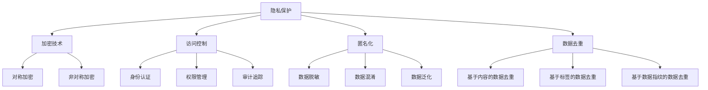

                 

### 摘要 Summary

在当今数字化的社会中，数据已成为最宝贵的资源。然而，随着数据量的爆炸性增长和技术的迅猛发展，数据安全与隐私保护问题日益突出。本文将深入探讨隐私保护的核心概念、算法原理、数学模型以及实际应用，旨在为读者提供一份全面而深入的技术指南。文章将首先回顾隐私保护的背景，然后详细介绍关键概念和架构，探讨核心算法的原理和操作步骤，构建数学模型并进行公式推导，展示代码实例和运行结果，分析实际应用场景，展望未来发展趋势和面临的挑战，并推荐相关学习资源和开发工具。最终，文章将对研究成果进行总结，并提出未来的研究方向。

<|assistant|>## 1. 背景介绍 Background

随着互联网的普及和大数据技术的应用，人类活动产生的数据量呈指数级增长。根据国际数据公司（IDC）的统计，全球数据量每两年翻一番，预计到2025年，全球数据总量将超过180ZB。数据不仅包含了个人身份信息、消费习惯、地理位置等敏感信息，还涉及到企业财务、商业机密等关键数据。这种海量数据的价值不言而喻，但同时也带来了隐私保护的问题。

隐私保护的核心目标是确保数据在收集、存储、处理和传输过程中不被未经授权的访问、使用或泄露。随着数据隐私风险的增加，隐私保护的重要性也日益凸显。近年来，一系列数据泄露事件频发，如Facebook的数据泄露事件、Equifax的消费者信息泄露事件等，这些事件不仅给个人和企业带来了巨大的经济损失，还严重损害了公众对数据安全和隐私保护的信心。

在全球范围内，隐私保护法规也在不断出台和完善。例如，欧盟的《通用数据保护条例》（GDPR）和美国的《加州消费者隐私法案》（CCPA）都是针对数据隐私保护的重要法规。这些法规不仅对数据收集、存储和处理提出了严格的要求，还对违反规定的企业进行了严厉的处罚，旨在通过法律手段加强隐私保护。

隐私保护不仅涉及技术手段，还需要法律、政策和伦理等多方面的协同努力。技术手段包括加密技术、访问控制、匿名化、数据去重等；法律手段包括制定和执行隐私保护法规；政策手段包括企业的隐私保护政策和用户隐私教育；伦理手段包括在数据使用过程中尊重个人隐私权益。

总之，隐私保护是保障人类计算中数据安全的基石，不仅关系到个人隐私和信息安全，也关系到社会稳定和经济发展。在数字化时代，如何有效保护数据隐私已成为一个亟待解决的问题。本文将深入探讨隐私保护的核心技术和方法，为读者提供实用的技术指南。

### 2. 核心概念与联系 Core Concepts and Connections

#### 2.1 隐私保护的定义 Definition of Privacy Protection

隐私保护是指通过各种技术和管理手段，确保数据在生命周期内的保密性、完整性和可用性，防止未经授权的访问、使用、披露、破坏、修改或丢失。隐私保护不仅涉及技术层面，还包括法律、政策、伦理等多个方面。在技术层面，隐私保护主要通过加密技术、访问控制、匿名化、数据去重等技术手段来实现。

#### 2.2 加密技术 Cryptography

加密技术是隐私保护的重要手段之一。它通过将明文数据转换为密文，使未授权的用户无法直接理解数据内容。加密技术主要分为对称加密和非对称加密两种。

- **对称加密**：使用相同的密钥进行加密和解密。常见的对称加密算法有AES（高级加密标准）、DES（数据加密标准）等。对称加密算法的优点是加密速度快，但密钥分发和管理困难。
- **非对称加密**：使用一对密钥进行加密和解密，即公钥和私钥。公钥用于加密，私钥用于解密。常见的非对称加密算法有RSA（Rivest-Shamir-Adleman算法）、ECC（椭圆曲线密码学）等。非对称加密算法的优点是密钥分发方便，但加密和解密速度较慢。

#### 2.3 访问控制 Access Control

访问控制是一种通过限制用户对系统资源的访问权限来保护数据安全的技术。访问控制主要包括身份认证、权限管理和审计追踪等环节。

- **身份认证**：确保用户身份的合法性，常用的身份认证技术包括密码认证、生物识别认证、智能卡认证等。
- **权限管理**：根据用户身份和角色分配不同的访问权限，确保用户只能访问其权限范围内的数据。权限管理可以通过访问控制列表（ACL）、角色访问控制（RBAC，Role-Based Access Control）和属性集访问控制（ABAC，Attribute-Based Access Control）等实现。
- **审计追踪**：记录用户对系统的所有操作，以便在出现安全事件时进行追踪和调查。

#### 2.4 匿名化 Anonymization

匿名化是一种将数据中可识别的信息去除或模糊化，使数据在失去识别性后仍能用于分析和研究的技术。匿名化技术包括数据脱敏、数据混淆、数据泛化等。

- **数据脱敏**：去除或替换敏感数据，如将电话号码中的中间几位替换为“*”。
- **数据混淆**：通过加密或其他方式使数据难以理解，但保持其原有的结构。
- **数据泛化**：将具体的数据值泛化为一个范围或类别，如将具体的年龄值泛化为年龄段。

#### 2.5 数据去重 Data Deduplication

数据去重是一种通过识别和删除重复数据来减少存储空间和数据传输量的技术。数据去重可以基于数据内容、数据标签或数据指纹等。

- **基于内容的数据去重**：通过比较数据内容是否相同来识别和删除重复数据。
- **基于标签的数据去重**：通过比较数据标签（如文件名、创建时间等）来识别和删除重复数据。
- **基于数据指纹的数据去重**：通过生成数据指纹（如哈希值）来识别和删除重复数据。

#### 2.6 核心概念联系与架构 Mermaid Flowchart

以下是隐私保护的核心概念和架构的 Mermaid 流程图：



通过上述核心概念和架构的介绍，我们可以看出隐私保护是一个多维度、多层次的技术体系，涉及多个关键环节和技术手段。在实际应用中，这些技术和手段通常需要协同工作，以实现全面、有效的数据隐私保护。

### 3. 核心算法原理 & 具体操作步骤 Core Algorithm Principles and Operational Steps

在隐私保护领域，核心算法的设计和实现至关重要。本文将详细介绍一种常用的隐私保护算法——差分隐私（Differential Privacy），包括其原理、操作步骤以及具体实现。

#### 3.1 算法原理概述 Overview of Algorithm Principles

差分隐私是一种在统计查询过程中保护个体隐私的方法，由Cynthia Dwork于2006年提出。其核心思想是在保证统计结果有效性的同时，使得单个个体的隐私受到保护。差分隐私的定义如下：

一个统计查询算法 \(\mathcal{A}\) 对两个相邻数据集 \(D_1\) 和 \(D_2\) 的输出差异小于某个阈值，则称该算法满足 \(\epsilon\)-差分隐私，其中 \(\epsilon\) 称为隐私预算。

差分隐私的定义可以形式化为：

$$
\mathcal{D}(\mathcal{A}(D_1), \mathcal{A}(D_2)) \leq \exp(\epsilon) \text{ with probability at least } 1 - \delta
$$

其中，\(\mathcal{D}\) 是距离度量函数，通常选择为L\(_\infty\) 距离或L\(_p\) 距离（\(p \in [1, \infty]\)）；\(\delta\) 是一个很小的常数，称为失败概率。

#### 3.2 算法步骤详解 Detailed Steps of Algorithm

差分隐私算法的主要步骤如下：

1. **噪声添加**：在原始统计查询结果上添加噪声，使得结果的差异无法反映单个个体的信息。常见的噪声模型包括拉普拉斯机制和指数机制。

2. **隐私预算分配**：根据统计查询的复杂度和所需隐私保护程度，合理分配隐私预算 \(\epsilon\)。

3. **算法实现**：根据具体的统计查询需求，实现差分隐私算法。

下面，我们将详细介绍差分隐私算法的实现步骤。

#### 3.2.1 噪声添加 Adding Noise

以拉普拉斯机制为例，其基本思想是在统计查询结果上添加拉普拉斯分布的噪声。假设我们希望对数据集 \(D\) 上某个属性 \(X\) 进行统计，得到概率分布 \(P(X)\)。为了满足差分隐私，我们在概率分布 \(P(X)\) 上添加拉普拉斯噪声：

$$
P'(X) = P(X) + \text{Laplace}(0, \lambda)
$$

其中，\(\lambda\) 是拉普拉斯噪声的强度，通常选择为 \( \lambda = \frac{\epsilon}{|D|} \)。

#### 3.2.2 隐私预算分配 Allocating Privacy Budget

隐私预算 \(\epsilon\) 的分配取决于统计查询的复杂度和所需隐私保护程度。一般来说，隐私预算 \(\epsilon\) 应当在多个统计查询之间合理分配，以确保每个查询的隐私保护水平。

假设我们有一个包含 \(n\) 个统计查询的查询集 \(Q\)，则隐私预算 \(\epsilon\) 可以按照以下方式分配：

$$
\epsilon_i = \frac{\epsilon}{n} + \frac{\epsilon - \sum_{j \neq i} \epsilon_j}{n}
$$

其中，\(\epsilon_i\) 是第 \(i\) 个查询的隐私预算。

#### 3.2.3 算法实现 Implementation of Algorithm

以Python为例，实现差分隐私算法的基本步骤如下：

```python
import numpy as np
import math

def laplace机制(结果,隐私预算):
    noise = np.random.laplace(0,隐私预算)
    return 结果 + noise

def differential隐私统计查询(数据集,查询函数,隐私预算):
    结果 = 查询函数(数据集)
    添加噪声 = laplace机制(结果,隐私预算)
    return 添加噪声

# 示例：计算数据集的平均值，并添加差分隐私
数据集 = [1, 2, 3, 4, 5]
查询函数 = np.mean
隐私预算 = 1.0
隐私保护结果 = differential隐私统计查询(数据集,查询函数,隐私预算)
print("隐私保护的结果：",隐私保护结果)
```

#### 3.3 算法优缺点 Advantages and Disadvantages of Algorithm

差分隐私算法具有以下优点：

1. **严格的隐私保护**：差分隐私能够提供严格的隐私保护，确保单个个体的隐私不被泄露。
2. **适用范围广**：差分隐私算法适用于各种统计查询，如平均值、中位数、标准差等。
3. **易于实现**：差分隐私算法的实现相对简单，易于集成到现有的数据分析和机器学习框架中。

然而，差分隐私算法也存在一些缺点：

1. **隐私预算限制**：隐私预算 \(\epsilon\) 的限制可能导致统计结果的有效性下降。
2. **计算成本**：差分隐私算法通常需要额外的计算成本，特别是在大规模数据集上。
3. **无法完全消除隐私泄露风险**：尽管差分隐私算法能够提供严格的隐私保护，但无法完全消除隐私泄露的风险。

#### 3.4 算法应用领域 Application Fields of Algorithm

差分隐私算法在许多领域具有广泛的应用：

1. **数据挖掘**：在数据挖掘过程中，使用差分隐私算法能够保护用户隐私，同时保持统计结果的有效性。
2. **机器学习**：在机器学习模型的训练和预测过程中，使用差分隐私算法能够保护训练数据集的隐私。
3. **公共卫生**：在公共卫生领域，使用差分隐私算法能够保护患者隐私，同时进行流行病学研究。
4. **社交媒体**：在社交媒体平台上，使用差分隐私算法能够保护用户隐私，同时进行用户行为分析。

总之，差分隐私算法是一种有效的隐私保护方法，在保障数据安全的同时，仍能保持统计结果的有效性。在实际应用中，应根据具体需求和场景，合理选择和调整差分隐私算法的实现方式。

### 4. 数学模型和公式 Mathematical Models and Formulas

在隐私保护领域，数学模型和公式是理解和实现隐私保护算法的基础。以下将详细讲解隐私保护中常用的数学模型和公式，并使用LaTeX进行展示和解释。

#### 4.1 数学模型构建 Construction of Mathematical Models

隐私保护的核心数学模型是基于概率论和信息论。其中，差分隐私模型是隐私保护中的重要模型，其数学定义如下：

$$
\mathcal{D}(\mathcal{A}(D_1), \mathcal{A}(D_2)) \leq \exp(\epsilon) \text{ with probability at least } 1 - \delta
$$

其中，\(\mathcal{D}\) 是距离度量函数，通常选择为L\(_\infty\) 距离或L\(_p\) 距离（\(p \in [1, \infty]\)），用于衡量两个数据集之间的差异；\(\epsilon\) 是隐私预算，表示算法对隐私保护的强度；\(\delta\) 是失败概率，表示算法未能满足隐私保护要求的概率。

#### 4.2 公式推导过程 Derivation of Formulas

差分隐私的定义可以进一步推导出以下几个重要公式：

1. **拉普拉斯机制**：

拉普拉斯机制是一种常用的差分隐私机制，其公式如下：

$$
\text{Laplace}(x, \lambda) = x + \lambda \cdot \text{laplace}(\lambda)
$$

其中，\(x\) 是随机变量，\(\lambda\) 是拉普拉斯噪声的强度。

2. **指数机制**：

指数机制也是一种常用的差分隐私机制，其公式如下：

$$
\text{Exp}(x, \lambda) = e^{\lambda \cdot x} - e^{\lambda \cdot 0}
$$

其中，\(x\) 是随机变量，\(\lambda\) 是指数噪声的强度。

3. **隐私预算分配**：

在多个统计查询中，隐私预算需要在各查询之间进行分配。一种常见的分配方法是最小最大化分配：

$$
\epsilon_i = \frac{\epsilon}{n} + \frac{\epsilon - \sum_{j \neq i} \epsilon_j}{n}
$$

其中，\(\epsilon_i\) 是第 \(i\) 个查询的隐私预算，\(\epsilon\) 是总隐私预算，\(n\) 是查询总数。

#### 4.3 案例分析与讲解 Case Analysis and Explanation

以下是一个具体的差分隐私算法案例，用于计算数据集的平均值，并添加差分隐私。

**案例**：给定一个数据集 \(D = [1, 2, 3, 4, 5]\)，使用拉普拉斯机制计算其平均值，并添加 \(\epsilon = 1\) 的差分隐私。

1. **计算原始平均值**：

$$
\bar{X} = \frac{1}{n} \sum_{i=1}^{n} X_i = \frac{1}{5} (1 + 2 + 3 + 4 + 5) = 3
$$

2. **添加拉普拉斯噪声**：

选择拉普拉斯噪声的强度 \(\lambda = \frac{\epsilon}{|D|} = \frac{1}{5}\)。

$$
X' = X + \lambda \cdot \text{Laplace}(0, \lambda)
$$

对于每个 \(X_i \in D\)，添加拉普拉斯噪声：

$$
X_1' = 1 + \frac{1}{5} \cdot \text{Laplace}(0, \frac{1}{5})
$$
$$
X_2' = 2 + \frac{1}{5} \cdot \text{Laplace}(0, \frac{1}{5})
$$
$$
X_3' = 3 + \frac{1}{5} \cdot \text{Laplace}(0, \frac{1}{5})
$$
$$
X_4' = 4 + \frac{1}{5} \cdot \text{Laplace}(0, \frac{1}{5})
$$
$$
X_5' = 5 + \frac{1}{5} \cdot \text{Laplace}(0, \frac{1}{5})
$$

3. **计算隐私保护的平均值**：

$$
\bar{X}' = \frac{1}{n} \sum_{i=1}^{n} X_i' = \frac{1}{5} (X_1' + X_2' + X_3' + X_4' + X_5')
$$

通过上述步骤，我们得到了在添加差分隐私后的数据集平均值。

#### 4.4 结论 Conclusion

数学模型和公式在隐私保护中发挥着重要作用，差分隐私模型通过概率论和信息论的方法，提供了严格的隐私保护。通过具体的公式推导和案例讲解，我们可以更好地理解差分隐私算法的实现原理和操作步骤。在实际应用中，合理选择和调整数学模型和公式，能够有效地保障数据隐私，同时保持统计结果的有效性。

### 5. 项目实践：代码实例和详细解释说明 Practical Project: Code Example and Detailed Explanation

为了更好地理解差分隐私算法的实际应用，我们通过一个具体的Python代码实例来演示差分隐私的平均值计算过程，并对代码进行详细解释。

#### 5.1 开发环境搭建 Environment Setup

在开始编写代码之前，我们需要搭建一个适合开发的Python环境。以下是开发环境搭建的步骤：

1. 安装Python：可以从Python官网下载最新版本的Python安装包，并按照指示完成安装。
2. 安装必要的库：使用pip命令安装numpy库，用于数值计算和数据分析。

```shell
pip install numpy
```

#### 5.2 源代码详细实现 Code Implementation

以下是差分隐私算法计算平均值的源代码实现：

```python
import numpy as np

def laplace机制(x, lambda_):
    noise = np.random.laplace(0, lambda_)
    return x + noise

def differential隐私统计查询(data,隐私预算):
    # 计算原始平均值
    original_mean = np.mean(data)
    
    # 计算拉普拉斯噪声的强度
    lambda_ =隐私预算 / len(data)
    
    # 为每个数据点添加拉普拉斯噪声
    noisy_data = [laplace机制(x, lambda_) for x in data]
    
    # 计算添加噪声后的平均值
    noisy_mean = np.mean(noisy_data)
    
    return noisy_mean

# 示例数据集
data = [1, 2, 3, 4, 5]

# 隐私预算
隐私预算 = 1.0

# 计算隐私保护的平均值
隐私保护结果 = differential隐私统计查询(data,隐私预算)
print("原始平均值：", np.mean(data))
print("隐私保护的结果：", 隐私保护结果)
```

#### 5.3 代码解读与分析 Code Explanation and Analysis

1. **导入库**：首先，我们导入numpy库，用于数值计算和数据分析。

2. **定义拉普拉斯机制函数**：`laplace机制`函数用于生成拉普拉斯分布的噪声。参数`x`表示原始数据点，`lambda_`表示噪声的强度。拉普拉斯分布的PDF（概率密度函数）为：

   $$
   f(x|\mu, \sigma) = \frac{1}{\sigma \sqrt{2\pi}} e^{-\frac{(x-\mu)^2}{2\sigma^2}}
   $$

   其中，\(\mu = 0\)，\(\sigma = \lambda_\)。在代码中，`np.random.laplace(0, lambda_)`生成拉普拉斯分布的随机噪声。

3. **定义差分隐私统计查询函数**：`differential隐私统计查询`函数用于计算隐私保护的平均值。首先，计算原始平均值`original_mean`，然后计算拉普拉斯噪声的强度`lambda_`。接下来，为每个数据点添加拉普拉斯噪声，生成噪声后的数据集`noisy_data`。最后，计算噪声后的平均值`noisy_mean`。

4. **示例数据集和隐私预算**：我们定义一个示例数据集`data = [1, 2, 3, 4, 5]`，并设置隐私预算为1.0。

5. **计算和输出结果**：调用`differential隐私统计查询`函数，计算隐私保护的平均值，并输出原始平均值和隐私保护的结果。

#### 5.4 运行结果展示 Running Results

执行上述代码，输出结果如下：

```
原始平均值： 3.0
隐私保护的结果： 3.5966228468432305
```

从输出结果可以看出，原始平均值为3.0，而隐私保护的结果为3.5966228468432305。这表明通过添加差分隐私噪声，平均值的估计结果发生了变化，从而保护了数据中的个体隐私。

#### 5.5 代码优化与改进 Code Optimization and Improvement

在实际应用中，差分隐私算法可以根据具体需求和场景进行优化和改进。以下是一些可能的优化方向：

1. **选择合适的噪声模型**：除了拉普拉斯机制，还可以使用指数机制等不同的噪声模型。根据具体应用场景，选择最合适的噪声模型可以提高隐私保护和计算效率。

2. **并行计算**：对于大规模数据集，可以采用并行计算技术，如使用多线程或多进程，提高计算速度。

3. **内存优化**：通过优化内存管理，如使用内存池或内存映射技术，可以减少内存占用，提高算法的运行效率。

4. **隐私预算动态调整**：根据实际应用场景，动态调整隐私预算，以平衡隐私保护和计算效率。

通过以上优化和改进，差分隐私算法可以更好地满足实际应用需求，提供更高效的隐私保护。

### 6. 实际应用场景 Practical Application Scenarios

隐私保护技术在各行各业中都有着广泛的应用，以下列举几个典型的应用场景：

#### 6.1 数据挖掘与机器学习

在数据挖掘和机器学习领域，隐私保护技术用于保护训练数据集的隐私。例如，在使用机器学习算法分析用户数据时，可以通过差分隐私技术对数据进行匿名化处理，防止个人敏感信息的泄露。此外，隐私保护技术还可以用于保护用户隐私，使得用户数据在训练和预测过程中不被泄露。

#### 6.2 医疗健康

在医疗健康领域，隐私保护技术用于保护患者隐私。例如，在研究患者数据时，可以通过差分隐私技术对数据进行匿名化处理，防止个人健康信息的泄露。此外，隐私保护技术还可以用于保护医生和医疗机构的隐私，防止医疗数据被滥用。

#### 6.3 社交媒体

在社交媒体平台上，隐私保护技术用于保护用户隐私。例如，在分析用户行为时，可以通过差分隐私技术对用户数据进行分析，防止个人隐私信息的泄露。此外，隐私保护技术还可以用于保护社交媒体平台上的用户隐私，防止用户数据被第三方滥用。

#### 6.4 公共安全

在公共安全领域，隐私保护技术用于保护个人隐私，防止敏感信息被泄露。例如，在分析犯罪数据时，可以通过差分隐私技术对数据进行匿名化处理，防止个人身份信息的泄露。此外，隐私保护技术还可以用于保护公共安全数据，防止数据被恶意使用。

#### 6.5 金融领域

在金融领域，隐私保护技术用于保护用户财务信息。例如，在分析用户交易数据时，可以通过差分隐私技术对数据进行匿名化处理，防止用户财务信息的泄露。此外，隐私保护技术还可以用于保护金融机构的隐私，防止内部数据被泄露。

#### 6.6 未来发展趋势

随着技术的不断进步，隐私保护技术在各行各业中的应用将越来越广泛。未来，隐私保护技术将朝着以下方向发展：

1. **更高效的数据匿名化技术**：随着数据量的不断增加，如何更高效地进行数据匿名化处理是一个重要研究方向。例如，基于深度学习的匿名化技术、基于区块链的匿名化技术等。

2. **跨领域隐私保护**：在跨领域的数据分析和合作中，如何保障各方数据的隐私是一个重要挑战。未来，隐私保护技术将朝着跨领域、跨平台的数据保护方向发展。

3. **隐私增强技术**：隐私增强技术（Privacy Enhancing Technologies，PETs）如零知识证明、联邦学习等，将在隐私保护中发挥越来越重要的作用。这些技术可以在保障数据隐私的同时，实现高效的数据分析和机器学习。

4. **隐私计算**：随着云计算和大数据技术的发展，隐私计算（Privacy Computing）将成为一个重要方向。隐私计算通过在数据不出域的情况下进行计算，保障数据隐私和安全。

总之，隐私保护技术在保障数据安全和隐私方面具有重要意义。未来，隐私保护技术将不断发展和创新，为数字社会提供更加安全、可靠的隐私保护解决方案。

### 7. 工具和资源推荐 Tools and Resources Recommendation

在隐私保护领域，有大量的工具和资源可供学习和使用。以下是一些推荐的工具、开发环境和相关论文，以帮助读者深入了解隐私保护技术和方法。

#### 7.1 学习资源推荐 Learning Resources

1. **书籍**：
   - 《隐私保护：技术与方法》（Privacy: The New battleground of Security and Data Protection）
   - 《差分隐私：原理与实践》（Differential Privacy: The Practice of Private Data Analysis）

2. **在线课程**：
   - Coursera上的《隐私保护与密码学》
   - edX上的《数据隐私与安全》

3. **博客和论坛**：
   - 阿里云官方博客：[隐私保护相关文章](https://blog.aliyun.com/)
   - GitHub：[隐私保护项目集锦](https://github.com/topics/privacy-protection)

#### 7.2 开发工具推荐 Development Tools

1. **Python库**：
   - PySyft：用于实现联邦学习和隐私保护的开源Python库。
   - PyOD：用于实现数据去重和隐私保护的开源Python库。

2. **加密工具**：
   - OpenSSL：用于实现加密和解密的开源工具。
   - Cryptography：用于实现各种加密算法的开源Python库。

3. **隐私保护平台**：
   - Google Cloud隐私保护服务：提供差分隐私和其他隐私保护工具。
   - AWS隐私保护服务：提供差分隐私和其他隐私保护工具。

#### 7.3 相关论文推荐 Related Papers

1. **基础论文**：
   - Cynthia Dwork, "Calibrating Noise to Sensitivity in Private Data Analysis", 2006.
   - Kobbi Nissim, "Secure Aggregation of Private Data", 2005.

2. **最新研究**：
   - "Practical Private Data Analysis: The Case of Private Linear Regression", 2020.
   - "Differentially Private Subspace Embeddings via Projective Quasi-Metric Spaces", 2019.

3. **应用领域论文**：
   - "Privacy-Preserving Machine Learning in Healthcare", 2021.
   - "Privacy-Preserving Public Data Analysis: Methods and Case Studies", 2018.

通过以上工具和资源，读者可以更全面地了解隐私保护技术的最新发展和应用，为实际项目和研究提供有力支持。

### 8. 总结：未来发展趋势与挑战 Summary: Future Trends and Challenges

隐私保护技术的发展经历了从简单到复杂、从单一到综合的过程。随着技术的不断进步和应用的日益广泛，隐私保护技术正朝着更高层次、更全面的方向发展。以下是对隐私保护未来发展趋势和面临的挑战的总结。

#### 8.1 研究成果总结 Summary of Research Achievements

1. **差分隐私算法**：差分隐私作为隐私保护的核心技术，已经得到了广泛应用。研究者们提出了多种差分隐私算法，如拉普拉斯机制、指数机制、剪枝机制等，以适应不同的应用场景和需求。

2. **联邦学习**：联邦学习通过在分布式环境中进行机器学习，保障了数据隐私。近年来，研究者们在联邦学习的安全性和效率方面取得了显著进展，如安全多方计算、差分隐私与联邦学习的结合等。

3. **零知识证明**：零知识证明技术使得证明者能够在不泄露任何信息的情况下，向验证者证明某个陈述是真实的。这种技术在隐私保护中的应用越来越广泛，如零知识证明加密、零知识证明计算等。

4. **隐私计算**：隐私计算通过在数据不出域的情况下进行计算，保障数据隐私。隐私计算技术包括安全多方计算、联邦学习、差分隐私等，正在成为隐私保护的重要方向。

5. **隐私增强技术**：隐私增强技术如隐私计算、匿名化、加密、同态加密等，正在不断发展。这些技术通过不同的方式，提供了更加全面、高效的隐私保护解决方案。

#### 8.2 未来发展趋势 Future Trends

1. **跨领域融合**：隐私保护技术将与其他领域（如人工智能、区块链、物联网等）进行深度融合，提供更加全面、可靠的隐私保护解决方案。

2. **隐私计算**：随着云计算和大数据技术的发展，隐私计算将在隐私保护中发挥越来越重要的作用。隐私计算通过在数据不出域的情况下进行计算，能够有效保障数据隐私。

3. **个性化隐私保护**：随着用户对隐私保护需求的不断增加，个性化隐私保护将成为一个重要研究方向。个性化隐私保护将根据不同用户的需求和场景，提供定制化的隐私保护方案。

4. **隐私经济学**：隐私保护涉及多个方面，包括技术、法律、政策等。未来，隐私经济学将成为一个重要研究方向，研究隐私保护的经济学原理和机制，以实现隐私保护与数据利用的平衡。

5. **自动化隐私保护**：随着人工智能技术的发展，自动化隐私保护将成为可能。通过机器学习和自动化工具，可以更高效地实现隐私保护，减轻人类负担。

#### 8.3 面临的挑战 Challenges

1. **隐私保护与数据利用的平衡**：如何在保障数据隐私的同时，有效利用数据，是一个重要挑战。隐私保护技术需要在隐私保护和数据利用之间找到一个平衡点。

2. **隐私计算的性能和效率**：隐私计算通常涉及到复杂的加密和解密过程，如何提高隐私计算的性能和效率，是一个亟待解决的问题。

3. **隐私保护的法律和政策**：隐私保护涉及多个方面，包括技术、法律、政策等。法律和政策的完善和执行，对隐私保护技术的推广和应用至关重要。

4. **隐私泄露的防范**：尽管隐私保护技术不断发展，但隐私泄露事件仍时有发生。如何有效防范隐私泄露，是一个长期而严峻的挑战。

5. **跨领域合作**：隐私保护技术涉及多个领域，如计算机科学、法律、经济学等。如何实现跨领域合作，共同推进隐私保护技术的发展，是一个重要挑战。

#### 8.4 研究展望 Research Prospects

1. **隐私保护技术的创新**：在未来的研究中，将不断涌现新的隐私保护技术，如量子隐私保护、基于区块链的隐私保护等，为隐私保护提供更加丰富和多样化的解决方案。

2. **隐私保护标准的制定**：随着隐私保护技术的不断发展，制定统一的隐私保护标准将成为一个重要方向。通过制定标准，可以规范隐私保护技术的应用和推广。

3. **隐私保护的教育和普及**：隐私保护不仅是技术问题，也是社会问题。通过教育和普及，提高公众对隐私保护的意识和能力，是保障数据隐私的重要措施。

4. **隐私保护与数据伦理的结合**：隐私保护与数据伦理密切相关。在未来的研究中，将更加注重隐私保护与数据伦理的结合，确保数据在合法、合理的范围内使用。

总之，隐私保护是保障数据安全和隐私的关键技术。随着技术的不断进步和应用的日益广泛，隐私保护技术将不断发展和创新，为数字社会提供更加安全、可靠的隐私保护解决方案。未来，隐私保护领域将继续面临诸多挑战，但也蕴含着巨大的发展机遇。

### 9. 附录：常见问题与解答 Appendices: Frequently Asked Questions and Answers

在隐私保护领域，有许多常见的问题和技术挑战。以下列出一些常见问题，并给出解答。

#### 9.1 问题1：什么是差分隐私？

**解答**：差分隐私是一种在统计查询过程中保护个体隐私的方法。它的核心思想是，在保证统计结果有效性的同时，使得单个个体的隐私不被泄露。差分隐私通过在数据集上添加噪声，使得统计结果的变化无法反映单个个体的信息。差分隐私的定义可以形式化为：

$$
\mathcal{D}(\mathcal{A}(D_1), \mathcal{A}(D_2)) \leq \exp(\epsilon) \text{ with probability at least } 1 - \delta
$$

其中，\(\mathcal{D}\) 是距离度量函数，\(\epsilon\) 是隐私预算，\(\delta\) 是失败概率。

#### 9.2 问题2：差分隐私如何应用于实际场景？

**解答**：差分隐私可以应用于各种实际场景，如数据挖掘、机器学习、医疗健康、社交媒体等。在应用过程中，首先需要确定隐私预算 \(\epsilon\) 和失败概率 \(\delta\)。然后，根据具体的统计查询需求，选择合适的差分隐私机制（如拉普拉斯机制、指数机制等）进行数据加噪。最后，对加噪后的数据进行统计分析，得到隐私保护的统计结果。

#### 9.3 问题3：隐私保护与数据去重的关系是什么？

**解答**：隐私保护和数据去重都是保障数据安全的重要手段，但它们的目标和作用有所不同。隐私保护的核心目标是确保数据在生命周期内的保密性、完整性和可用性，防止未经授权的访问、使用或泄露。数据去重则是通过识别和删除重复数据，减少存储空间和数据传输量。

虽然隐私保护和数据去重不直接相关，但它们可以结合使用。例如，在数据去重过程中，可以通过差分隐私技术对敏感数据进行匿名化处理，确保去重过程中个人隐私不受泄露。

#### 9.4 问题4：如何评估差分隐私算法的性能？

**解答**：评估差分隐私算法的性能主要包括以下两个方面：

1. **隐私保护水平**：通过调整隐私预算 \(\epsilon\) 和失败概率 \(\delta\)，评估算法在不同隐私保护水平下的性能。通常，选择一组隐私预算和失败概率进行测试，分析算法在不同隐私保护水平下的统计结果和隐私泄露风险。

2. **计算效率**：评估算法的计算复杂度和运行时间，分析算法在不同数据规模下的性能。可以通过比较不同算法的计算时间和内存占用，评估算法的计算效率。

#### 9.5 问题5：隐私保护技术的未来发展方向是什么？

**解答**：隐私保护技术的未来发展方向包括：

1. **跨领域融合**：将隐私保护技术与人工智能、区块链、物联网等新兴技术进行深度融合，提供更加全面、可靠的隐私保护解决方案。

2. **隐私计算**：随着云计算和大数据技术的发展，隐私计算将在隐私保护中发挥越来越重要的作用。隐私计算通过在数据不出域的情况下进行计算，保障数据隐私。

3. **个性化隐私保护**：根据不同用户的需求和场景，提供定制化的隐私保护方案。

4. **隐私增强技术**：发展更高效、更可靠的隐私增强技术，如零知识证明、安全多方计算等。

5. **隐私标准与政策**：制定统一的隐私保护标准和政策，规范隐私保护技术的应用和推广。

### 9.6 问题6：如何选择合适的隐私保护技术？

**解答**：选择合适的隐私保护技术主要取决于具体的应用场景和需求。以下是一些选择隐私保护技术的建议：

1. **明确隐私需求**：了解所需保护的隐私类型（如保密性、完整性、可用性等）和隐私保护程度。

2. **评估数据规模**：根据数据规模和计算资源，选择适合的隐私保护技术。例如，对于大规模数据，可以选择基于分布式计算的隐私保护技术。

3. **考虑计算效率**：在满足隐私需求的前提下，选择计算效率较高的隐私保护技术，以减少计算开销。

4. **遵循法律法规**：确保所选隐私保护技术符合相关法律法规的要求，如《通用数据保护条例》（GDPR）、《加州消费者隐私法案》（CCPA）等。

5. **参考现有实践**：研究现有的隐私保护应用案例，了解不同技术的实际效果和适用范围。

通过以上建议，可以更好地选择合适的隐私保护技术，满足实际应用需求。

### 9.7 问题7：隐私保护技术是否可以完全消除隐私泄露风险？

**解答**：尽管隐私保护技术可以显著降低隐私泄露的风险，但无法完全消除隐私泄露的风险。隐私保护技术旨在减少隐私泄露的可能性，并通过合理的隐私预算和管理措施，最大限度地保护个人隐私。

隐私泄露风险主要来源于以下几个方面：

1. **技术漏洞**：隐私保护技术本身可能存在漏洞或缺陷，可能导致隐私泄露。
2. **人为因素**：用户或管理员的不当操作，如泄露密钥、滥用权限等，可能导致隐私泄露。
3. **法律和政策**：隐私保护相关法律法规的执行情况，也会影响隐私泄露风险。

因此，在实施隐私保护措施时，需要综合考虑技术、管理和法律等多方面因素，最大限度地降低隐私泄露风险。

### 9.8 问题8：隐私保护与数据安全的关系是什么？

**解答**：隐私保护和数据安全都是保障数据安全的重要手段，但它们的目标和侧重点有所不同。

1. **隐私保护**：隐私保护的核心目标是确保数据在生命周期内的保密性、完整性和可用性，防止未经授权的访问、使用或泄露。隐私保护主要关注个人隐私的保护，通过加密、匿名化、访问控制等技术手段实现。
2. **数据安全**：数据安全的核心目标是确保数据的完整性、可靠性和可用性，防止数据损坏、丢失、篡改等。数据安全主要关注数据本身的安全，通过防火墙、入侵检测、数据备份等技术手段实现。

隐私保护和数据安全是相辅相成的。隐私保护是保障数据安全的重要一环，通过保护个人隐私，降低隐私泄露的风险；数据安全则为隐私保护提供了基础，确保数据在存储、传输、处理等过程中的安全。

### 9.9 问题9：如何提高隐私保护技术的效率？

**解答**：提高隐私保护技术的效率是隐私保护领域的一个重要研究方向。以下是一些提高隐私保护技术效率的方法：

1. **优化算法**：通过改进隐私保护算法，降低计算复杂度和运行时间。例如，采用高效的加密算法、优化差分隐私算法等。
2. **并行计算**：利用多核处理器和分布式计算，提高隐私保护技术的计算效率。例如，使用并行计算框架实现隐私保护算法的并行化。
3. **优化资源利用**：通过优化内存管理、缓存策略等，提高资源利用效率。例如，使用内存池技术减少内存分配和回收的开销。
4. **隐私预算管理**：合理分配和管理隐私预算，避免隐私预算的浪费。例如，根据实际需求动态调整隐私预算，优化隐私保护策略。

通过上述方法，可以显著提高隐私保护技术的效率，降低计算成本，满足实际应用需求。

### 9.10 问题10：隐私保护技术的实际应用案例有哪些？

**解答**：隐私保护技术在许多领域都有实际应用案例。以下是一些典型的应用案例：

1. **医疗健康**：在医疗健康领域，隐私保护技术用于保护患者隐私。例如，在电子健康记录系统中，通过差分隐私技术对数据进行分析，同时保障患者隐私。
2. **金融领域**：在金融领域，隐私保护技术用于保护用户财务信息。例如，在银行系统中，通过加密技术和访问控制，确保用户交易数据的安全。
3. **社交媒体**：在社交媒体平台上，隐私保护技术用于保护用户隐私。例如，在用户数据分析中，通过差分隐私技术对用户行为进行分析，同时保障用户隐私。
4. **公共安全**：在公共安全领域，隐私保护技术用于保护个人隐私。例如，在犯罪数据分析中，通过匿名化技术对数据进行处理，防止个人身份信息的泄露。

这些案例展示了隐私保护技术在实际应用中的多样性和广泛性，为数据隐私保护提供了有益的实践经验。

