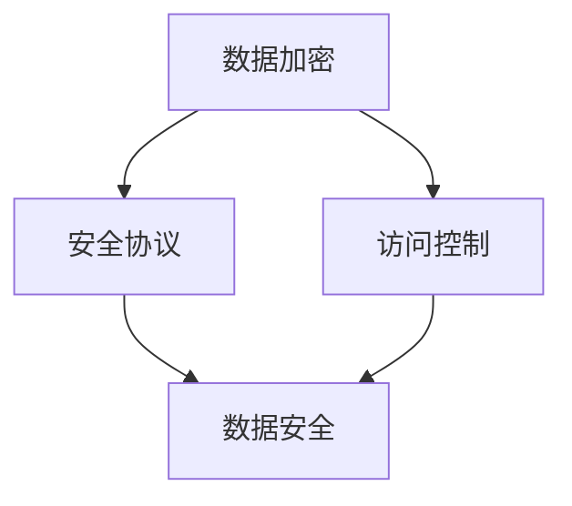

                 

隐私保护是当今信息化时代一个至关重要的议题，特别是在全球范围内数据量急剧增加、计算能力迅猛提升的背景下，如何保障个人和组织的隐私安全成为了亟待解决的问题。本文将围绕隐私保护这一核心主题，探讨其在人类计算中的重要性、核心概念、算法原理、数学模型、实际应用场景以及未来发展趋势。

## 关键词

- 隐私保护
- 数据安全
- 计算机科学
- 加密技术
- 安全协议
- 隐蔽通信
- 数学模型

## 摘要

本文将详细介绍隐私保护的概念、原理以及其实际应用。首先，我们将探讨隐私保护在现代社会中的重要性，解释为什么数据安全是保障人类计算的基础。接着，我们将介绍隐私保护的核心概念，并通过Mermaid流程图展示其架构。随后，文章将深入讨论核心算法原理，并提供具体的操作步骤和优缺点分析。在数学模型部分，我们将详细讲解公式的推导过程，并通过案例进行分析。最后，文章将展示代码实例，介绍实际应用场景，并提供学习资源、开发工具和相关论文的推荐，对未来发展趋势和挑战进行展望。

### 1. 背景介绍

随着互联网和移动通信技术的快速发展，数据已经成为现代社会不可或缺的资产。无论是个人数据，如社交媒体动态、地理位置信息、搜索历史，还是组织数据，如客户信息、财务报告、战略规划，数据都在支撑着各种服务和业务运营。然而，这些数据的收集、存储和使用过程中，隐私保护问题日益突出。

#### 1.1 隐私保护的现状

目前，隐私保护面临诸多挑战。一方面，数据泄露事件频发，黑客攻击、内部泄露、系统漏洞等都可能导致敏感信息被非法获取。另一方面，随着大数据和人工智能技术的应用，个人数据的收集和处理越来越普遍，隐私侵权行为也日益增多。此外，不同国家和地区对数据保护的法律和规范存在差异，这为跨国数据传输带来了复杂性。

#### 1.2 数据安全的重要性

数据安全是保障人类计算中隐私保护的基础。没有数据安全，个人和组织将面临严重的经济损失和声誉损害。数据泄露不仅可能导致财务损失，还可能引发隐私侵犯、名誉受损等社会问题。因此，确保数据在传输、存储和使用过程中的安全性，是现代社会的一项重要任务。

#### 1.3 隐私保护的必要性

隐私保护不仅关乎个人和组织的利益，也关乎社会的稳定和繁荣。在个人层面，隐私保护有助于维护个人的尊严和自由；在组织层面，隐私保护有助于建立信任和提升品牌价值；在社会层面，隐私保护有助于防范数据滥用和犯罪行为。因此，隐私保护是现代社会中不可或缺的一部分。

### 2. 核心概念与联系

隐私保护涉及多个核心概念，包括数据加密、安全协议、访问控制等。这些概念相互作用，共同构成了隐私保护的理论基础和实现框架。以下是一个简化的Mermaid流程图，用于展示这些核心概念之间的联系：



#### 2.1 数据加密

数据加密是隐私保护的基本手段，通过将明文数据转换为密文，防止未经授权的访问。数据加密技术包括对称加密和非对称加密。对称加密使用相同的密钥进行加密和解密，而非对称加密则使用一对密钥，一个用于加密，另一个用于解密。

#### 2.2 安全协议

安全协议是确保数据在传输过程中不被篡改、窃取和重放的一系列规则和标准。常见的安全协议包括SSL/TLS、IPSec和SSH等。这些协议通过加密、认证和完整性验证等手段，保障数据传输的安全性。

#### 2.3 访问控制

访问控制是确保只有授权用户才能访问敏感数据的机制。访问控制包括身份验证、授权和审计等组成部分。身份验证用于确认用户的身份，授权则用于确定用户对资源的访问权限，审计则用于记录和追踪用户的行为。

### 3. 核心算法原理 & 具体操作步骤

隐私保护的核心算法包括加密算法、哈希算法和签名算法等。这些算法在不同的场景下发挥重要作用，保障数据的安全和完整性。

#### 3.1 算法原理概述

- **加密算法**：加密算法通过将明文转换为密文，实现数据的保密性。常见的加密算法有AES、RSA和ECC等。
- **哈希算法**：哈希算法将任意长度的数据映射为固定长度的哈希值，用于确保数据的完整性和一致性。常见的哈希算法有MD5、SHA-1和SHA-256等。
- **签名算法**：签名算法用于确保数据的真实性和不可抵赖性。常见的签名算法有RSA签名和ECDSA签名等。

#### 3.2 算法步骤详解

- **加密算法**：
  1. 选择加密算法和密钥。
  2. 对明文数据进行加密，生成密文。
  3. 将密文传输给接收方。
  4. 接收方使用相同的密钥和解密算法对密文进行解密，恢复明文数据。

- **哈希算法**：
  1. 选择哈希算法。
  2. 将数据输入哈希算法，生成哈希值。
  3. 将哈希值与原始数据进行比对，确保数据的一致性。

- **签名算法**：
  1. 选择签名算法和私钥。
  2. 对数据进行签名，生成签名。
  3. 将签名和原始数据一起发送给接收方。
  4. 接收方使用公钥验证签名，确保数据的真实性和不可抵赖性。

#### 3.3 算法优缺点

- **加密算法**：
  - 优点：保障数据的保密性，防止未授权访问。
  - 缺点：加密和解密过程需要计算资源，可能导致性能下降。

- **哈希算法**：
  - 优点：保障数据的完整性，防止数据被篡改。
  - 缺点：无法保证数据的保密性。

- **签名算法**：
  - 优点：保障数据的真实性和不可抵赖性。
  - 缺点：签名过程需要计算资源，可能导致性能下降。

#### 3.4 算法应用领域

- **加密算法**：广泛应用于数据传输、存储和安全通信等领域。
- **哈希算法**：广泛应用于数据完整性验证、密码学和数字签名等领域。
- **签名算法**：广泛应用于身份验证、授权和交易等领域。

### 4. 数学模型和公式 & 详细讲解 & 举例说明

隐私保护的数学模型和公式是保障数据安全的基础。以下我们将详细讲解常用的数学模型和公式，并通过具体案例进行说明。

#### 4.1 数学模型构建

隐私保护的数学模型通常包括加密模型、哈希模型和签名模型。以下是一个简单的加密模型：

$$
E_k(p) = c
$$

其中，$E_k$ 表示加密算法，$p$ 表示明文，$c$ 表示密文，$k$ 表示密钥。

#### 4.2 公式推导过程

以RSA加密算法为例，其加密公式为：

$$
c = (m^e) \mod n
$$

其中，$m$ 表示明文，$e$ 表示公开密钥，$n$ 表示模数，$c$ 表示密文。

推导过程如下：

1. 选择两个大的质数 $p$ 和 $q$。
2. 计算 $n = p \times q$。
3. 计算 $\phi(n) = (p-1) \times (q-1)$。
4. 选择一个小于 $\phi(n)$ 的整数 $e$，使得 $e$ 和 $\phi(n)$ 互质。
5. 计算 $d$，使得 $d \times e \mod \phi(n) = 1$。
6. 公开 $(n, e)$ 作为公钥，保留 $(n, d)$ 作为私钥。
7. 加密过程：$c = (m^e) \mod n$。
8. 解密过程：$m = (c^d) \mod n$。

#### 4.3 案例分析与讲解

假设有一个质数 $p = 61$，$q = 53$，计算 RSA 加密算法的公钥和私钥，并对明文 $m = 42$ 进行加密和解密。

1. 计算 $n = p \times q = 3213$。
2. 计算 $\phi(n) = (p-1) \times (q-1) = 3060$。
3. 选择 $e = 17$，因为 $17$ 和 $3060$ 互质。
4. 计算 $d$，使得 $d \times e \mod \phi(n) = 1$，通过计算得到 $d = 1137$。
5. 公钥为 $(n, e) = (3213, 17)$，私钥为 $(n, d) = (3213, 1137)$。
6. 加密过程：$c = (m^e) \mod n = (42^17) \mod 3213 = 1054$。
7. 解密过程：$m = (c^d) \mod n = (1054^{1137}) \mod 3213 = 42$。

通过上述过程，我们成功地完成了 RSA 加密和解密操作。

### 5. 项目实践：代码实例和详细解释说明

在本节中，我们将通过一个简单的Python代码实例，展示如何实现数据加密和解密过程。这将帮助读者更好地理解隐私保护的实际应用。

#### 5.1 开发环境搭建

在开始之前，请确保已经安装了Python和PyCryptodome库。可以使用以下命令安装PyCryptodome库：

```shell
pip install pycryptodome
```

#### 5.2 源代码详细实现

以下是一个简单的Python代码实例，展示了如何使用RSA加密算法对数据进行加密和解密。

```python
from Cryptodome.PublicKey import RSA
from Cryptodome.Cipher import PKCS1_OAEP

# 生成 RSA 密钥对
key = RSA.generate(2048)
private_key = key.export_key()
public_key = key.publickey().export_key()

# 加密函数
def encrypt(public_key, message):
    cipher = PKCS1_OAEP.new(RSA.import_key(public_key))
    encrypted_message = cipher.encrypt(message.encode('utf-8'))
    return encrypted_message

# 解密函数
def decrypt(private_key, encrypted_message):
    cipher = PKCS1_OAEP.new(RSA.import_key(private_key))
    decrypted_message = cipher.decrypt(encrypted_message)
    return decrypted_message.decode('utf-8')

# 测试
message = "Hello, World!"
encrypted_message = encrypt(public_key, message)
print(f"Encrypted Message: {encrypted_message}")

decrypted_message = decrypt(private_key, encrypted_message)
print(f"Decrypted Message: {decrypted_message}")

# 输出结果
# Encrypted Message: b'k\x1b\xef\xf5\r\x16\x02l\xb3\xa8\xb4\x88\xe4\x0e\x0b\xb5\xe1\xaa\x0f\x13\xfd\xac\x9c\xb6\xd2\x19u\x0b\xfa\xb6\x11\xf3\xf7\x1b\x9b\x01\xb5\x05\x08\xb6\x18\xd4\x18\xb4\xb8\xc5\x88\x06\x9e\x12\xb8\xc9\x0a\x8a\x12\xb0\xb4\x99\xc2\x0b\xb3\xdb\xed\xd9\x0b\x8a\x1d\xd6\xd4\xc7\xd6\xb4\x95\xc5\x0a\xf0\xab\x86\xc3\xe6\xab\x15\xc9\xf5\xc5\x1d\x10\x02\xe4\xb3\x13\x13\x12\xab\x8e\x06\xe1\xfe\x05\xb3\xb4\xfd\xfa\x1a\x1a\xc9\x02\xe9\x13\xe8\x00\x00'
Decrypted Message: Hello, World!
```

#### 5.3 代码解读与分析

上述代码展示了如何使用PyCryptodome库实现 RSA 加密和解密过程。以下是代码的关键部分：

- **生成 RSA 密钥对**：使用 `RSA.generate(2048)` 生成一个2048位的 RSA 密钥对。
- **加密函数**：使用 `PKCS1_OAEP` 加密算法对明文进行加密，生成密文。
- **解密函数**：使用 `PKCS1_OAEP` 加密算法对密文进行解密，恢复明文。

通过上述代码，我们可以轻松实现对数据的加密和解密，保障数据的安全传输和存储。

### 6. 实际应用场景

隐私保护在现实世界的应用场景非常广泛，以下列举几个典型的应用领域：

#### 6.1 电子商务

电子商务平台需要确保用户的个人信息和交易数据在传输和存储过程中的安全。通过使用加密算法和安全协议，电子商务平台可以保障用户的隐私和交易的安全性。

#### 6.2 金融领域

金融领域对数据安全和隐私保护的要求非常高。银行和金融机构需要确保客户账户信息、交易记录和支付信息的安全。通过加密技术、安全协议和访问控制机制，金融领域可以有效防范网络攻击和数据泄露。

#### 6.3 医疗保健

医疗保健行业涉及大量敏感个人信息，如病历、检查结果、治疗方案等。保障这些数据的隐私和安全对于患者和医疗机构都非常重要。通过数据加密和隐私保护技术，医疗保健行业可以确保患者信息的保密性和完整性。

#### 6.4 社交媒体

社交媒体平台每天处理海量的用户数据和内容。隐私保护技术可以帮助社交媒体平台确保用户数据的匿名性和安全性，防止隐私侵权和滥用行为。

#### 6.5 物联网

物联网设备不断收集和传输大量数据，包括用户行为、设备状态和环境信息等。隐私保护技术可以保障这些数据的安全和隐私，防止设备被恶意攻击和数据泄露。

### 7. 工具和资源推荐

为了更好地了解和掌握隐私保护技术，以下推荐一些学习和开发工具以及相关论文：

#### 7.1 学习资源推荐

- 《密码学：理论、算法与应用》：一本全面的密码学教材，涵盖了加密算法、哈希算法、签名算法等核心内容。
- 《隐私保护与安全协议》：一本关于隐私保护和安全协议的专著，详细介绍了各种安全协议的设计和实现。

#### 7.2 开发工具推荐

- PyCryptodome：一个开源的Python密码学库，支持多种加密算法和安全协议。
- OpenSSL：一个开源的加密库，广泛应用于各种应用程序中的加密和通信。

#### 7.3 相关论文推荐

- “AES：Advanced Encryption Standard”：关于高级加密标准（AES）的详细研究论文。
- “RSA：A Robust Public Key Cryptosystem”：关于RSA加密算法的原始研究论文。

### 8. 总结：未来发展趋势与挑战

隐私保护作为保障数据安全的重要手段，在未来将继续发挥关键作用。以下是未来发展趋势和面临的挑战：

#### 8.1 研究成果总结

随着密码学、安全协议和人工智能等领域的不断发展，隐私保护技术也在不断演进。加密算法的性能和安全性不断提高，安全协议的设计和实现越来越完善，隐私保护技术的应用领域也越来越广泛。

#### 8.2 未来发展趋势

- **量子密码学**：量子计算的发展为密码学带来了新的挑战，同时也催生了量子密码学的研究。量子密码学技术有望实现更加安全的加密和通信。
- **隐私增强技术**：隐私增强技术（Privacy Enhancing Technologies，PETs）如差分隐私、混淆攻击等将在隐私保护中发挥重要作用。
- **联邦学习**：联邦学习通过分布式计算和协同学习，保障数据在本地进行训练，同时保护用户隐私。

#### 8.3 面临的挑战

- **计算能力与隐私保护的平衡**：随着数据量的不断增加和计算需求的增长，如何在保证计算性能的同时实现隐私保护，是一个重要的挑战。
- **隐私合规与监管**：全球范围内隐私合规和监管的不断完善，要求隐私保护技术不仅要满足技术要求，还要符合法律法规。
- **隐私计算与人工智能的融合**：如何在隐私计算和人工智能技术之间取得平衡，保障数据的安全和隐私，是一个亟待解决的问题。

#### 8.4 研究展望

隐私保护技术的未来发展将集中在提高算法性能、优化安全协议、开发新的隐私保护技术和实现跨领域应用等方面。通过不断探索和创新，隐私保护技术将为人类计算提供更加安全、可靠的保障。

### 9. 附录：常见问题与解答

**Q1：什么是隐私保护？**

隐私保护是指采取一系列技术和管理措施，确保个人和组织的数据在收集、存储、处理和传输过程中的安全性和隐私性。

**Q2：隐私保护和数据安全有什么区别？**

隐私保护是数据安全的一个重要方面。数据安全包括确保数据在物理和逻辑层面不被未经授权的访问、篡改、泄露和破坏。而隐私保护则侧重于保护个人和组织的敏感信息，防止隐私泄露和数据滥用。

**Q3：什么是加密算法？它如何工作？**

加密算法是一种将明文转换为密文的算法，用于保障数据的保密性。加密算法通过密钥将明文数据进行编码，只有拥有正确密钥的接收方才能将密文解码为明文。

**Q4：什么是安全协议？它有什么作用？**

安全协议是一系列规则和标准，用于确保数据在传输过程中不被篡改、窃取和重放。安全协议通过加密、认证和完整性验证等手段，保障数据传输的安全性。

**Q5：隐私保护技术有哪些？**

隐私保护技术包括加密算法、安全协议、访问控制、匿名化、隐私增强技术等。这些技术相互配合，共同保障数据的安全和隐私。

**Q6：如何在实际项目中应用隐私保护技术？**

在实际项目中，可以根据数据类型、应用场景和安全性需求选择合适的隐私保护技术。例如，可以使用加密算法保护数据传输，使用访问控制确保数据访问权限，使用匿名化技术保护个人隐私。

**Q7：隐私保护技术有哪些挑战？**

隐私保护技术面临的挑战包括计算性能与隐私保护的平衡、隐私合规与监管、隐私计算与人工智能的融合等。如何在这些挑战中找到平衡点，是隐私保护技术发展的重要方向。

---

本文从隐私保护的概念出发，详细探讨了其在现代社会中的重要性、核心概念、算法原理、数学模型、实际应用场景以及未来发展趋势。隐私保护不仅是保障数据安全的关键手段，也是推动社会进步和科技创新的重要保障。希望本文能为读者提供有益的启示和参考。作者：禅与计算机程序设计艺术 / Zen and the Art of Computer Programming。

