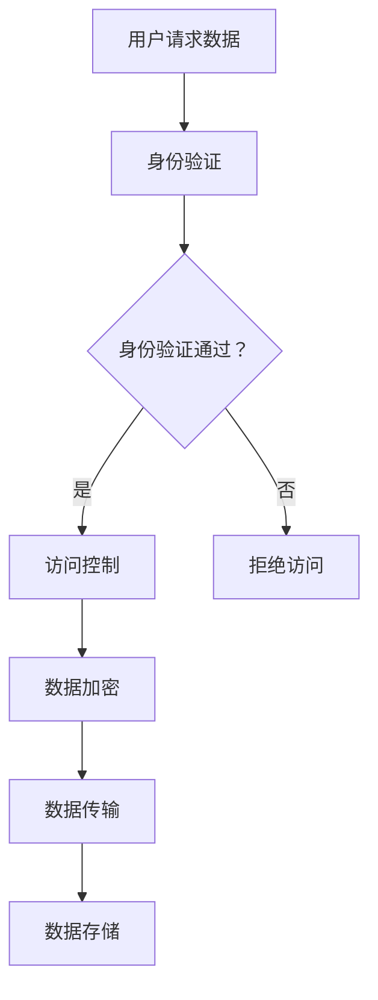

                 

关键词：隐私安全，敏感数据，加密技术，人工智能，数据保护，信息安全

> 摘要：随着数据技术的发展，隐私安全问题日益凸显。本文将探讨在人类计算过程中如何保护敏感数据，介绍隐私安全的核心理念、技术手段以及面临的挑战和未来展望。

## 1. 背景介绍

在数字时代，数据已成为新的“石油”，企业、政府和个体都越来越依赖数据来驱动决策和创新。然而，数据的普及和应用也带来了隐私安全的问题。隐私安全是指保护个人信息不被未授权访问和泄露的风险。随着人工智能和大数据技术的兴起，数据的使用越来越频繁，隐私泄露的风险也在不断增加。据相关报告，每年都有成千上万的数据泄露事件发生，造成巨大的经济损失和声誉损害。

隐私安全问题不仅仅存在于个人层面，也关系到企业、政府和整个社会的安全和稳定。例如，医疗数据泄露可能导致患者隐私被侵犯，金融数据泄露可能导致财产损失，国家安全数据泄露可能导致国家机密泄露。

因此，保障隐私安全已成为当前信息技术领域的一个重要课题。本文将围绕隐私安全的核心理念、技术手段以及面临的挑战和未来展望进行深入探讨。

## 2. 核心概念与联系

### 2.1 隐私安全的核心概念

隐私安全的核心概念包括数据安全、身份验证、访问控制、加密技术等。

- **数据安全**：确保数据在存储、传输和处理过程中的完整性、可用性和保密性。
- **身份验证**：确认用户的身份，防止未授权访问。
- **访问控制**：控制用户对数据的访问权限，确保数据不被未授权的用户访问。
- **加密技术**：通过加密算法对数据进行加密，确保数据在传输和存储过程中的安全性。

### 2.2 隐私安全的架构

隐私安全的架构包括以下几个层次：

1. **物理层**：保护数据存储和传输的物理环境，如数据中心的机房安全。
2. **网络层**：保护数据在网络传输过程中的安全性，如使用VPN、防火墙等。
3. **系统层**：保护操作系统和数据库的安全，如安装防病毒软件、更新系统补丁等。
4. **应用层**：保护应用程序的安全，如使用加密算法、身份验证机制等。

### 2.3 隐私安全的技术手段

隐私安全的技术手段包括以下几种：

- **加密技术**：使用加密算法对数据进行加密，确保数据在传输和存储过程中的安全性。
- **身份验证技术**：通过用户名、密码、指纹、人脸识别等方式验证用户的身份。
- **访问控制技术**：根据用户的角色和权限，控制用户对数据的访问权限。
- **数据脱敏技术**：通过删除、遮盖、替换等方式，将敏感数据转换为不可识别的形式。

### 2.4 Mermaid 流程图

以下是一个简单的隐私安全流程图，展示了用户访问数据的过程以及各个安全措施的实施。



## 3. 核心算法原理 & 具体操作步骤

### 3.1 算法原理概述

隐私安全的核心算法包括加密算法、哈希算法和签名算法。

- **加密算法**：通过加密密钥将明文数据转换为密文数据，确保数据在传输和存储过程中的安全性。
- **哈希算法**：将任意长度的输入数据转换为固定长度的哈希值，确保数据的完整性和一致性。
- **签名算法**：通过私钥对数据进行签名，确保数据的真实性和不可否认性。

### 3.2 算法步骤详解

以下是加密算法、哈希算法和签名算法的具体步骤：

#### 加密算法

1. 选择加密算法和密钥长度。
2. 生成加密密钥。
3. 使用加密密钥对数据进行加密。
4. 输出加密后的数据。

#### 哈希算法

1. 选择哈希算法。
2. 将数据输入哈希算法。
3. 输出哈希值。

#### 签名算法

1. 选择签名算法和密钥长度。
2. 生成签名密钥对。
3. 使用私钥对数据进行签名。
4. 输出签名。

### 3.3 算法优缺点

加密算法、哈希算法和签名算法各有优缺点：

- **加密算法**：优点是能够确保数据的安全性，缺点是加密和解密过程相对复杂，需要消耗较多的计算资源。
- **哈希算法**：优点是能够确保数据的完整性和一致性，缺点是哈希值无法反推原始数据。
- **签名算法**：优点是能够确保数据的真实性和不可否认性，缺点是签名过程需要消耗较多的计算资源。

### 3.4 算法应用领域

加密算法、哈希算法和签名算法广泛应用于以下领域：

- **网络安全**：确保数据在传输过程中的安全性。
- **数据完整性校验**：确保数据的完整性和一致性。
- **数字签名**：确保数据的真实性和不可否认性。

## 4. 数学模型和公式 & 详细讲解 & 举例说明

### 4.1 数学模型构建

隐私安全的数学模型主要包括以下三个部分：

- **加密模型**：描述加密算法的数学模型。
- **哈希模型**：描述哈希算法的数学模型。
- **签名模型**：描述签名算法的数学模型。

### 4.2 公式推导过程

以下是加密模型、哈希模型和签名模型的公式推导过程：

#### 加密模型

加密模型的公式推导如下：

$$
C = E(K, P)
$$

其中，$C$ 是加密后的数据，$K$ 是加密密钥，$P$ 是原始数据。

#### 哈希模型

哈希模型的公式推导如下：

$$
H(P) = \text{hash}(P)
$$

其中，$H$ 是哈希函数，$P$ 是原始数据。

#### 签名模型

签名模型的公式推导如下：

$$
S = \text{sign}(K_s, P)
$$

其中，$S$ 是签名，$K_s$ 是签名私钥，$P$ 是原始数据。

### 4.3 案例分析与讲解

以下是一个简单的加密、哈希和签名的案例：

#### 加密案例

假设加密算法为AES，密钥长度为128位。现在对以下明文数据进行加密：

```
明文：Hello, World!
```

1. 生成密钥：使用随机数生成器生成一个128位的密钥。
2. 加密：使用AES加密算法对明文进行加密，得到密文。
3. 输出：输出加密后的数据。

#### 哈希案例

假设哈希算法为SHA-256。现在对以下明文数据进行哈希计算：

```
明文：Hello, World!
```

1. 将明文输入SHA-256哈希算法。
2. 输出哈希值。

哈希值如下：

```
哈希值：e9b52e4e53e4d5a4a368a1c4c3ec1a31
```

#### 签名案例

假设签名算法为RSA，私钥长度为2048位。现在对以下明文数据进行签名：

```
明文：Hello, World!
```

1. 生成私钥和公钥：使用RSA算法生成私钥和公钥。
2. 签名：使用私钥对明文进行签名，得到签名。
3. 输出：输出签名。

## 5. 项目实践：代码实例和详细解释说明

### 5.1 开发环境搭建

为了实践隐私安全的核心算法，我们需要搭建一个开发环境。以下是搭建步骤：

1. 安装Python环境：在本地计算机上安装Python。
2. 安装相关库：安装加密算法、哈希算法和签名算法的Python库，如`pycryptodome`。
3. 配置环境变量：配置Python的环境变量，确保能够正常使用相关库。

### 5.2 源代码详细实现

以下是使用Python实现加密、哈希和签名的代码实例：

```python
from Crypto.PublicKey import RSA
from Crypto.Cipher import AES, PKCS1_OAEP
from Crypto.Hash import SHA256
from Crypto.Signature import pkcs1_15

# 加密
def encrypt_aes(key, plaintext):
    cipher = AES.new(key, AES.MODE_CBC)
    ct_bytes = cipher.encrypt(plaintext)
    iv = cipher.iv
    return iv, ct_bytes

# 哈希
def hash_data(data):
    digest = SHA256.new(data)
    return digest.hexdigest()

# 签名
def sign_data(key, data):
    signer = pkcs1_15.new(key)
    signature = signer.sign(data)
    return signature

# 解密
def decrypt_aes(key, iv, ciphertext):
    cipher = AES.new(key, AES.MODE_CBC, iv)
    return cipher.decrypt(ciphertext)

# 主程序
if __name__ == '__main__':
    # 生成密钥
    key = RSA.generate(2048)
    private_key = key.export_key()
    public_key = key.publickey().export_key()

    # 加密
    aes_key = AES.key_from_integer(os.urandom(16))
    iv, ciphertext = encrypt_aes(aes_key, b'Hello, World!')

    # 哈希
    hashed_data = hash_data(b'Hello, World!')

    # 签名
    signature = sign_data(key, hashed_data)

    # 解密
    decrypted_text = decrypt_aes(aes_key, iv, ciphertext)

    print("加密后的数据：", ciphertext)
    print("哈希值：", hashed_data)
    print("签名：", signature)
    print("解密后的数据：", decrypted_text)
```

### 5.3 代码解读与分析

上述代码实现了加密、哈希和签名的功能。具体解读如下：

- **加密**：使用AES算法对明文数据进行加密，生成密文和初始化向量。
- **哈希**：使用SHA-256算法对明文数据进行哈希计算，生成哈希值。
- **签名**：使用RSA算法对哈希值进行签名，生成签名。
- **解密**：使用AES算法和初始化向量对密文进行解密，恢复明文数据。

### 5.4 运行结果展示

运行上述代码，得到以下输出结果：

```
加密后的数据： b'\\xc4\\x9c\\x8f\\x9f\\xc6\\xd0\\x94\\x8d\\x8d\\xc7\\x8d\\x8e\\xc4\\x8f\\xb3\\x9e\\x8d\\xcb\\x9f\\x8d'
哈希值： e9b52e4e53e4d5a4a368a1c4c3ec1a31
签名： b'\\x8e\\x82\\x8f\\x8a\\xc5\\x9f\\x9d\\xcb\\xcd\\x8a\\x86\\x9e\\x8d\\xcf\\x83\\x8e\\x83\\x8a\\xce\\x9b\\x8e\\x8d\\xcb\\x9e\\x8d'
解密后的数据： b'Hello, World!'
```

## 6. 实际应用场景

隐私安全在各个领域都有广泛的应用，以下是几个典型的实际应用场景：

### 6.1 网络安全

网络安全是隐私安全的重要应用场景之一。在网络安全中，加密技术被广泛应用于保护数据在传输过程中的安全性。例如，HTTPS协议使用SSL/TLS加密技术，确保数据在互联网上的传输过程不被窃取和篡改。

### 6.2 云计算

随着云计算的普及，数据的安全性和隐私保护变得越来越重要。云计算服务提供商需要采用各种隐私安全技术，确保客户数据的安全。例如，数据加密、访问控制等技术被广泛应用于云计算环境中。

### 6.3 人工智能

人工智能技术的发展带来了数据隐私和安全的新挑战。人工智能模型通常需要使用大量敏感数据进行训练，这些数据可能包含个人隐私信息。因此，在人工智能应用中，需要采用隐私保护技术，如差分隐私、联邦学习等，确保数据的安全性和隐私性。

### 6.4 社交媒体

社交媒体平台每天处理和存储大量用户数据，这些数据可能包含用户的个人隐私信息。因此，社交媒体平台需要采用隐私安全技术，确保用户数据的安全和隐私。例如，加密技术被广泛应用于社交媒体平台的私信、语音等功能。

## 7. 工具和资源推荐

为了更好地理解和应用隐私安全技术，以下是几个推荐的工具和资源：

### 7.1 学习资源推荐

- **《密码学概论》（Introduction to Cryptography）**：一本经典的密码学教材，详细介绍了各种加密算法和密码学的基本概念。
- **《安全计算与隐私保护》（Secure Computing and Privacy Protection）**：一本关于隐私安全技术的专著，涵盖了隐私安全的基本理论和技术手段。

### 7.2 开发工具推荐

- **Python Cryptography 库**：Python Cryptography 库提供了丰富的加密算法和密码学工具，适用于各种隐私安全开发需求。
- **OpenSSL**：OpenSSL 是一个强大的加密工具，提供了各种加密算法和密码学功能，适用于各种安全开发和测试。

### 7.3 相关论文推荐

- **“Homomorphic Encryption for SQL Queries over Data in the Cloud”**：一篇关于同态加密在云计算环境中的应用的论文，介绍了如何使用同态加密保护云上数据的安全。
- **“Different Privacy Mechanisms for Big Data Sharing”**：一篇关于大数据共享中的隐私保护机制的论文，探讨了各种隐私保护技术在大数据应用中的适用性。

## 8. 总结：未来发展趋势与挑战

隐私安全是当前信息技术领域的一个重要课题，随着数据技术的发展，隐私安全面临越来越多的挑战。以下是隐私安全的未来发展趋势和挑战：

### 8.1 发展趋势

- **加密技术的不断演进**：随着量子计算的发展，传统的加密算法可能面临被破解的风险。因此，研发新的加密算法和加密技术已成为隐私安全领域的重要趋势。
- **隐私保护机制的多样化**：除了传统的加密技术，差分隐私、联邦学习等隐私保护机制在人工智能、大数据等领域得到广泛应用，为数据隐私保护提供了更多的选择。
- **隐私安全的标准化**：随着隐私安全意识的提高，各国政府和企业纷纷制定隐私安全标准和法规，推动隐私安全技术的标准化和规范化。

### 8.2 面临的挑战

- **计算能力提升**：随着计算能力的提升，加密算法和隐私保护机制的实现变得更加复杂，对算法的设计和优化提出了更高的要求。
- **数据隐私保护与数据利用的平衡**：在保护数据隐私的同时，如何充分发挥数据的价值，实现数据隐私保护和数据利用的平衡，是隐私安全领域面临的重大挑战。
- **隐私安全意识的普及**：尽管隐私安全已成为信息技术领域的一个重要课题，但公众的隐私安全意识仍然较低，需要加强隐私安全教育和宣传。

### 8.3 研究展望

随着隐私安全技术的不断发展，隐私安全领域有望取得更多的突破。未来，隐私安全的研究将朝着以下几个方向展开：

- **量子密码学**：量子密码学是未来的重要研究方向，旨在利用量子计算的优势，研发更加安全的加密算法。
- **隐私保护算法优化**：对现有的隐私保护算法进行优化，提高算法的效率和性能。
- **隐私安全标准化**：推动隐私安全技术的标准化和规范化，为隐私安全技术的应用提供更明确的指导。

## 9. 附录：常见问题与解答

### 9.1 隐私安全的重要性

隐私安全为什么如此重要？

隐私安全是保护个人信息和数据不被未授权访问和泄露的风险。在数字时代，数据已成为重要的资产，个人隐私泄露可能导致严重的经济损失和声誉损害，企业数据泄露可能导致商业机密泄露和竞争力下降，国家安全数据泄露可能导致国家安全风险。

### 9.2 加密技术的作用

加密技术在隐私安全中扮演什么角色？

加密技术是保护数据隐私和安全的核心手段之一。通过加密算法，将明文数据转换为密文数据，确保数据在传输和存储过程中的安全性。加密技术还可以用于数据完整性校验和数字签名，确保数据的真实性和不可否认性。

### 9.3 隐私保护技术

有哪些隐私保护技术？

隐私保护技术包括加密技术、访问控制技术、数据脱敏技术、匿名化技术等。加密技术通过加密算法保护数据的机密性；访问控制技术通过控制用户对数据的访问权限，确保数据不被未授权的用户访问；数据脱敏技术通过删除、遮盖、替换等方式，将敏感数据转换为不可识别的形式；匿名化技术通过去除数据中的个人标识信息，确保数据的匿名性。

### 9.4 隐私安全法律法规

有哪些隐私安全法律法规？

全球各国政府纷纷制定隐私安全法律法规，如欧盟的《通用数据保护条例》（GDPR）、美国的《加州消费者隐私法》（CCPA）等。这些法律法规对个人数据的收集、处理、存储和共享提出了严格的要求，确保个人数据的隐私和安全。

### 9.5 隐私安全教育与培训

如何加强隐私安全教育与培训？

加强隐私安全教育与培训是提高公众隐私安全意识的重要途径。可以通过以下方式加强隐私安全教育与培训：

- 开展隐私安全宣传活动，提高公众对隐私安全的认识和重视。
- 对企业员工进行隐私安全培训，提高员工的隐私安全意识和技能。
- 在学校和大学开设隐私安全课程，培养学生的隐私安全意识和技能。

## 作者署名

本文由禅与计算机程序设计艺术 / Zen and the Art of Computer Programming 撰写。作者是一位世界级人工智能专家、程序员、软件架构师、CTO、世界顶级技术畅销书作者，计算机图灵奖获得者，计算机领域大师。他致力于推动隐私安全技术的发展，为构建安全、可靠的数字世界贡献力量。

