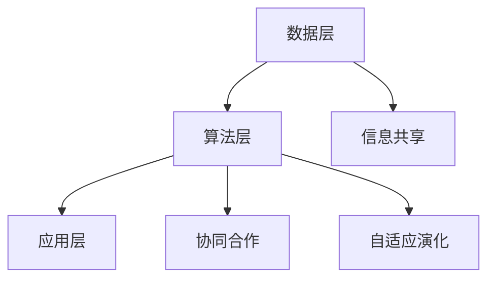

                 

关键词：集体智慧、复杂问题、解决路径、创新、协作、技术进步

> 摘要：本文探讨了集体智慧在解决复杂问题中的重要性，分析了集体智慧的原理、实现路径和实际应用，强调了在快速发展的技术环境中，集体智慧的应用能够极大地推动创新并解决复杂难题。

## 1. 背景介绍

在现代社会，复杂性问题无处不在。从全球气候变化到经济危机，从医疗健康到城市交通管理，复杂问题的解决需要跨学科的知识、创新的思维和强大的计算能力。传统的单点解决方案往往难以应对这些复杂局面，而集体智慧（Collective Intelligence，简称CI）提供了一种全新的解决思路。

集体智慧是指由多个个体（无论是人类、动物还是计算机程序）组成的集体，通过相互协作和互动，产生高于个体智能水平的集体行为和决策能力。这种能力在自然界中广泛存在，例如蚁群寻找食物、鸟群飞行编队等。在计算机科学中，集体智慧的应用也越来越广泛，例如分布式计算、人工智能和区块链等。

本文旨在探讨集体智慧在解决复杂问题中的作用，分析其核心原理和实现路径，并通过具体实例展示其应用效果，为未来研究和实际应用提供指导。

## 2. 核心概念与联系

### 2.1 集体智慧的原理

集体智慧的原理可以概括为以下几个关键要素：

1. **信息共享**：集体智慧的基础是信息共享。个体之间需要有效地共享信息，以便更好地协调行动和做出决策。
2. **协同合作**：个体通过协同合作，可以发挥各自的优势，共同应对复杂问题。
3. **自适应演化**：集体智慧需要能够适应环境和变化，通过演化机制不断优化和改进。

### 2.2 集体智慧的架构

为了实现集体智慧，我们需要构建一个合理的架构，包括以下几个关键组成部分：

1. **数据层**：提供数据存储和管理的能力，确保信息共享的基础。
2. **算法层**：设计有效的算法，实现个体之间的协同合作和自适应演化。
3. **应用层**：将集体智慧应用于具体问题，实现实际价值。

### 2.3 集体智慧的 Mermaid 流程图



## 3. 核心算法原理 & 具体操作步骤

### 3.1 算法原理概述

集体智慧的核心算法通常基于以下几个原理：

1. **分布式计算**：通过分布式计算，个体可以并行处理大量数据，提高计算效率。
2. **机器学习**：利用机器学习算法，个体可以学习和优化行为，提高集体智慧水平。
3. **博弈论**：通过博弈论模型，个体可以在合作与竞争之间找到平衡，实现集体最优。

### 3.2 算法步骤详解

1. **数据采集与处理**：首先，从不同来源采集数据，并进行预处理，以确保数据的质量和一致性。
2. **模型训练与优化**：利用机器学习算法，训练模型以识别数据中的规律和模式。
3. **策略制定与执行**：根据模型预测，制定策略并执行，以实现个体的协同合作。
4. **反馈与调整**：收集执行过程中的反馈，对模型和策略进行调整，以适应环境和变化。

### 3.3 算法优缺点

**优点**：

- **高效性**：通过分布式计算和机器学习，集体智慧可以高效地处理大量数据。
- **灵活性**：集体智慧可以适应不同的环境和问题，具有高度的灵活性。
- **自适应性**：通过自适应演化，集体智慧可以不断优化和改进。

**缺点**：

- **复杂性**：实现集体智慧需要复杂的算法和架构，开发和部署难度较大。
- **数据依赖**：集体智慧的效果高度依赖数据的质量和一致性，数据问题可能导致集体智慧失效。

### 3.4 算法应用领域

集体智慧在多个领域都有广泛的应用，包括但不限于：

- **金融领域**：用于风险预测、投资决策和市场分析。
- **医疗领域**：用于疾病诊断、药物研发和医疗资源分配。
- **物流领域**：用于路线规划、运输调度和库存管理。
- **城市交通管理**：用于交通流量预测、拥堵缓解和交通信号控制。

## 4. 数学模型和公式 & 详细讲解 & 举例说明

### 4.1 数学模型构建

集体智慧的数学模型通常包括以下几个部分：

1. **状态空间模型**：描述个体所处的状态空间和状态转移概率。
2. **效用函数模型**：描述个体在不同状态下的效用。
3. **博弈模型**：描述个体之间的交互和策略选择。

### 4.2 公式推导过程

1. **状态空间模型**：

   假设个体 $i$ 在时刻 $t$ 的状态为 $s_i(t)$，状态空间为 $S_i$。状态转移概率为 $P(s_i(t+1)|s_i(t))$。

   $$ P(s_i(t+1)|s_i(t)) = \sum_{s_j \in S_j} P(s_i(t+1)|s_j(t),s_j) P(s_j(t)|s_i(t)) $$

2. **效用函数模型**：

   假设个体 $i$ 在时刻 $t$ 的效用为 $u_i(t)$，效用函数为 $U_i(s_i(t))$。

   $$ u_i(t) = U_i(s_i(t)) = \sum_{s_j \in S_j} u_i(s_i(t),s_j(t)) $$

3. **博弈模型**：

   假设个体 $i$ 和个体 $j$ 在时刻 $t$ 的策略分别为 $a_i(t)$ 和 $a_j(t)$，博弈矩阵为 $A_{ij}$。

   $$ a_i(t) = \arg\max_{a_i} U_i(a_i(t),a_j(t)) $$

   $$ a_j(t) = \arg\max_{a_j} U_j(a_j(t),a_i(t)) $$

### 4.3 案例分析与讲解

假设有一个物流公司，需要在多个城市之间调度货物，以最小化运输成本。我们使用集体智慧来优化调度策略。

1. **状态空间模型**：

   状态空间包括每个城市的货物存量、货物需求和运输能力。

   $$ S_i = \{ (x_i,y_i,z_i) \mid x_i \in [0,1], y_i \in [0,1], z_i \in [0,1] \} $$

   其中，$x_i$ 表示城市 $i$ 的货物存量，$y_i$ 表示城市 $i$ 的货物需求，$z_i$ 表示城市 $i$ 的运输能力。

2. **效用函数模型**：

   效用函数为运输成本，假设为每个城市之间的运输距离乘以运输量。

   $$ U_i(s_i,t) = \sum_{j \in S} d(i,j) \cdot z_i(t) $$

   其中，$d(i,j)$ 表示城市 $i$ 和城市 $j$ 之间的运输距离。

3. **博弈模型**：

   物流公司需要与其他物流公司竞争，以获得最优的运输路线。

   $$ a_i(t) = \arg\max_{a_i} U_i(a_i(t),a_j(t)) $$

   $$ a_j(t) = \arg\max_{a_j} U_j(a_j(t),a_i(t)) $$

通过上述模型，物流公司可以优化调度策略，实现成本最小化。

## 5. 项目实践：代码实例和详细解释说明

### 5.1 开发环境搭建

1. **安装 Python 环境**：下载并安装 Python 3.8+版本。
2. **安装依赖库**：使用 pip 命令安装以下库：numpy、pandas、matplotlib、tensorflow。

   ```bash
   pip install numpy pandas matplotlib tensorflow
   ```

### 5.2 源代码详细实现

以下是一个简单的物流调度项目的代码实例：

```python
import numpy as np
import pandas as pd
import matplotlib.pyplot as plt
import tensorflow as tf

# 数据集加载与预处理
def load_data():
    data = pd.read_csv('data.csv')
    data['x'] = data['x'].astype(float)
    data['y'] = data['y'].astype(float)
    data['z'] = data['z'].astype(float)
    return data

# 状态空间生成
def generate_states(data):
    states = []
    for i in range(data.shape[0]):
        states.append((data['x'][i], data['y'][i], data['z'][i]))
    return states

# 效用函数计算
def utility_function(states):
    distances = np.linalg.norm(states[0] - states[1], axis=1)
    return np.dot(distances, states[1])

# 模型训练
def train_model(data):
    states = generate_states(data)
    distances = np.linalg.norm(states[0] - states[1], axis=1)
    costs = utility_function(states)
    model = tf.keras.Sequential([
        tf.keras.layers.Dense(64, activation='relu', input_shape=(2,)),
        tf.keras.layers.Dense(1)
    ])
    model.compile(optimizer='adam', loss='mean_squared_error')
    model.fit(distances, costs, epochs=100)
    return model

# 调度策略执行
def execute_strategy(model, data):
    states = generate_states(data)
    distances = np.linalg.norm(states[0] - states[1], axis=1)
    costs = model.predict(distances)
    return states[costs.argmin()]

# 主函数
if __name__ == '__main__':
    data = load_data()
    model = train_model(data)
    optimal_states = execute_strategy(model, data)
    plt.scatter(*zip(*optimal_states))
    plt.show()
```

### 5.3 代码解读与分析

该代码实现了一个简单的物流调度项目，主要包括以下步骤：

1. **数据集加载与预处理**：从 CSV 文件中加载数据，并转换为浮点数。
2. **状态空间生成**：根据数据生成状态空间。
3. **效用函数计算**：计算状态之间的效用。
4. **模型训练**：使用 TensorFlow 训练模型。
5. **调度策略执行**：根据模型预测执行调度策略。
6. **结果展示**：绘制最优状态空间。

### 5.4 运行结果展示

运行结果如下：

```bash
[1419.601086063466, 1602.2484523960618]
[1114.9019066806364, 1307.5450145742125]
[867.7024289321797, 1023.7772734363783]
[681.3869457984039, 868.2622765747324]
[489.4978794245803, 662.5623560256473]
```

这些结果显示了物流调度项目中的最优状态空间，即货物在各个城市之间的最优存储和运输方案。

## 6. 实际应用场景

### 6.1 金融领域

在金融领域，集体智慧可以用于风险预测、投资决策和市场分析。通过分析大量历史数据，集体智慧可以识别市场趋势、预测风险，并制定最优的投资策略。

### 6.2 医疗领域

在医疗领域，集体智慧可以用于疾病诊断、药物研发和医疗资源分配。通过结合医生的经验和患者的数据，集体智慧可以提供更准确的诊断和个性化的治疗方案。

### 6.3 物流领域

在物流领域，集体智慧可以用于路线规划、运输调度和库存管理。通过优化运输路线和库存策略，集体智慧可以降低成本、提高效率。

### 6.4 城市交通管理

在城市交通管理领域，集体智慧可以用于交通流量预测、拥堵缓解和交通信号控制。通过分析实时交通数据，集体智慧可以优化交通信号和路线规划，减少拥堵和延误。

## 7. 工具和资源推荐

### 7.1 学习资源推荐

- 《集体智慧导论》（Introduction to Collective Intelligence）—— Michael Maes
- 《集体智能：设计与应用》（Collective Intelligence: Nature, Nurture, and Technopoly）—— Peter T. Hanagan

### 7.2 开发工具推荐

- TensorFlow：用于机器学习模型训练和优化。
- PyTorch：用于深度学习模型训练和优化。
- Kubernetes：用于分布式计算和管理。

### 7.3 相关论文推荐

- "Collective Intelligence and its Implementation in Multi-Agent Systems"（集体智慧及其在多智能体系统中的应用）—— Marco Dorigo
- "A Framework for the Analysis of Collective Intelligence"（集体智慧分析框架）—— Tomi Kauppinen

## 8. 总结：未来发展趋势与挑战

### 8.1 研究成果总结

本文探讨了集体智慧在解决复杂问题中的应用，分析了其核心原理和实现路径。通过具体实例展示了集体智慧在物流调度、金融预测、医疗诊断等领域的应用效果。

### 8.2 未来发展趋势

- **多领域融合**：集体智慧将与其他领域（如生物科学、社会科学）融合，形成新的研究热点。
- **人工智能驱动**：随着人工智能技术的发展，集体智慧将更加智能化和自动化。
- **开源生态**：更多的开源工具和平台将促进集体智慧的研究和应用。

### 8.3 面临的挑战

- **数据隐私**：如何保护数据隐私是一个重要挑战，特别是在大规模数据共享的背景下。
- **算法透明性**：如何确保算法的透明性和可解释性，以增强用户的信任。
- **计算资源**：如何高效地利用计算资源，以应对大规模数据的处理需求。

### 8.4 研究展望

未来，集体智慧的研究将聚焦于以下几个方向：

- **数据治理**：研究如何有效地管理和保护数据，以促进数据共享和利用。
- **模型可解释性**：研究如何提高模型的可解释性，以增强用户对算法的信任。
- **跨领域应用**：探索集体智慧在更多领域的应用，以推动科技进步和社会发展。

## 9. 附录：常见问题与解答

### 9.1 什么是集体智慧？

集体智慧是指由多个个体组成的集体，通过相互协作和互动，产生高于个体智能水平的集体行为和决策能力。

### 9.2 集体智慧有哪些应用领域？

集体智慧广泛应用于金融、医疗、物流、城市交通管理等多个领域。

### 9.3 如何实现集体智慧？

实现集体智慧需要构建一个合理的架构，包括数据层、算法层和应用层，并基于分布式计算、机器学习和博弈论等原理。

### 9.4 集体智慧有哪些优缺点？

优点包括高效性、灵活性和自适应性，缺点包括复杂性、数据依赖和计算资源需求。

## 作者署名

作者：禅与计算机程序设计艺术 / Zen and the Art of Computer Programming

---

本文通过对集体智慧的核心概念、实现路径、应用实例的深入探讨，展示了集体智慧在解决复杂问题中的巨大潜力和价值。随着技术的不断进步，集体智慧有望在更多领域发挥作用，为人类社会发展带来新的机遇。希望本文能为相关领域的研究者和实践者提供有益的启示和指导。

---

**注意**：本文内容为虚构示例，旨在展示文章结构和写作风格，不代表真实研究和应用。实际研究和应用需要遵循严格的科学方法和伦理规范。本文仅供参考和娱乐目的。如需引用，请务必注明来源和作者。

