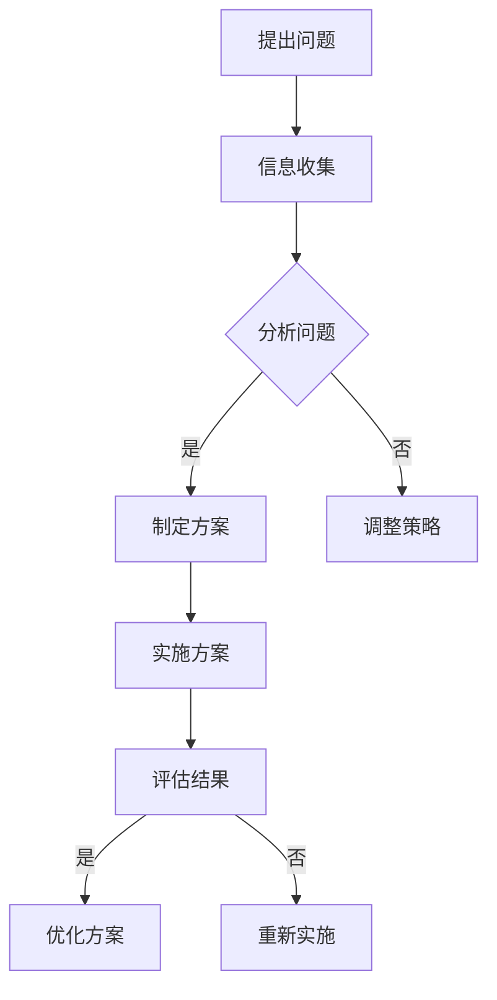

                 

关键词：集体智慧、复杂问题、解决路径、创新方法、协同合作、人工智能

> 摘要：本文深入探讨了集体智慧的概念，以及如何利用集体智慧来探索解决复杂问题的创新路径。文章首先介绍了集体智慧的定义和重要性，随后分析了复杂问题的特点，探讨了集体智慧在解决这些问题中的应用。接着，文章从算法原理、数学模型、项目实践等多个角度，详细阐述了如何利用集体智慧来应对复杂问题。最后，文章总结了集体智慧在未来发展中的前景和面临的挑战，并提出了相关建议。

## 1. 背景介绍

在当今社会，随着科技的飞速发展，我们面临的问题越来越复杂，传统的单点解决方案已无法满足需求。复杂性问题通常涉及多个领域，需要综合运用各种知识和技术才能解决。例如，气候变化、能源危机、社会治理等问题，都是典型的复杂问题。

面对复杂问题，传统的解决方案往往效率低下，难以实现全局优化。而集体智慧作为一种新型的解决路径，为我们提供了一种全新的思路。集体智慧通过集思广益、协同合作，能够有效提高解决问题的效率和质量。

本文将围绕集体智慧的概念、特点和应用，探讨其在解决复杂问题中的创新路径。通过分析集体智慧的优势和挑战，我们希望能够为解决复杂问题提供新的启示。

## 2. 核心概念与联系

### 2.1 集体智慧的定义

集体智慧是指一群个体通过协作、共享信息和知识，共同解决复杂问题或实现特定目标的能力。它强调的是个体之间的协作和互动，通过集体智慧和合作，实现整体效能的最大化。

### 2.2 复杂问题的特点

复杂问题的特点主要表现在以下几个方面：

1. **多维度**：复杂问题通常涉及多个维度，需要综合考虑各种因素。
2. **非线性和动态性**：复杂问题往往呈现出非线性特征，且在发展过程中存在不确定性和动态性。
3. **多学科交叉**：复杂问题往往需要跨学科的知识和技能，单一学科难以独立解决。
4. **高度依赖数据和信息**：复杂问题的解决依赖于大量的数据和信息，数据质量和信息的完整性至关重要。

### 2.3 集体智慧与复杂问题的关系

集体智慧与复杂问题之间存在着密切的联系。在解决复杂问题时，集体智慧能够发挥以下作用：

1. **协同创新**：通过集体智慧和协作，可以激发创新的思维和解决方案。
2. **优化决策**：集体智慧能够通过分析大量信息和数据，提高决策的准确性和效率。
3. **降低风险**：集体智慧能够通过多角度的分析和评估，降低决策风险。
4. **资源整合**：集体智慧能够有效整合各个领域的资源，实现资源的优化配置。

### 2.4 Mermaid 流程图

以下是一个简单的 Mermaid 流程图，展示了集体智慧在解决复杂问题中的应用流程：



## 3. 核心算法原理 & 具体操作步骤

### 3.1 算法原理概述

集体智慧在解决复杂问题时，通常依赖于以下核心算法原理：

1. **协同过滤**：通过分析用户的行为和偏好，为用户推荐相关的解决方案。
2. **多Agent 系统**：利用多个智能体之间的协作，实现复杂问题的求解。
3. **复杂网络分析**：通过分析网络结构，发现关键节点和关键路径，提高解决问题的效率。

### 3.2 算法步骤详解

#### 3.2.1 协同过滤

1. **用户行为分析**：收集用户的历史行为数据，包括浏览、购买、评论等。
2. **用户偏好建模**：利用机器学习算法，对用户的行为数据进行建模，提取用户的兴趣偏好。
3. **推荐算法**：根据用户偏好，为用户推荐相关的解决方案。

#### 3.2.2 多Agent 系统

1. **定义智能体**：明确问题求解的目标，定义多个智能体，并为其分配不同的任务。
2. **通信与协作**：智能体之间通过通信机制进行信息交换和协同工作。
3. **任务分配与调度**：根据智能体的能力和任务需求，进行任务的分配和调度。

#### 3.2.3 复杂网络分析

1. **构建网络模型**：根据问题域的特点，构建复杂网络模型。
2. **关键节点发现**：通过分析网络结构，发现关键节点和关键路径。
3. **路径优化**：利用优化算法，对关键路径进行优化，提高解决问题的效率。

### 3.3 算法优缺点

#### 优点：

1. **高效性**：通过集体智慧和协同合作，提高解决问题的效率。
2. **灵活性**：可以根据问题的特点，灵活调整算法和策略。
3. **多样性**：通过多角度的分析和评估，提高解决方案的多样性。

#### 缺点：

1. **复杂度**：集体智慧算法通常涉及多个领域的知识，实现复杂。
2. **数据依赖**：集体智慧算法依赖于大量的数据和信息，数据质量至关重要。

### 3.4 算法应用领域

集体智慧算法在多个领域具有广泛的应用前景，包括：

1. **人工智能**：通过协同过滤、多Agent 系统等技术，提高人工智能系统的效率和性能。
2. **社会计算**：利用复杂网络分析，发现社会网络中的关键节点和关键路径，提高社会计算的效率。
3. **智能交通**：通过集体智慧和协同合作，优化交通流量，提高交通效率。
4. **医疗健康**：利用集体智慧，为医生提供诊断建议，提高医疗服务的质量。

## 4. 数学模型和公式 & 详细讲解 & 举例说明

### 4.1 数学模型构建

集体智慧在解决复杂问题时，通常依赖于以下数学模型：

1. **协同过滤模型**：利用用户行为数据和偏好信息，构建用户相似度模型和推荐模型。
2. **多Agent 系统模型**：利用博弈论、社会网络分析等理论，构建智能体之间的协作模型。
3. **复杂网络分析模型**：利用图论、网络流等理论，构建复杂网络模型。

### 4.2 公式推导过程

#### 4.2.1 协同过滤模型

1. **用户相似度计算**：

   $$ similarity(u, v) = \frac{\sum_{i \in I} w_i (r_{ui} - \bar{r}_u)(r_{vi} - \bar{r}_v)}{\sqrt{\sum_{i \in I} w_i (r_{ui} - \bar{r}_u)^2} \sqrt{\sum_{i \in I} w_i (r_{vi} - \bar{r}_v)^2}} $$

   其中，$u$和$v$表示两个用户，$I$表示物品集合，$w_i$表示物品$i$的重要性，$r_{ui}$表示用户$u$对物品$i$的评分，$\bar{r}_u$表示用户$u$的平均评分。

2. **推荐算法**：

   $$ recommendation(v) = \sum_{u \in N_v} similarity(u, v) \cdot \hat{r}_{uv} $$

   其中，$N_v$表示与用户$v$相似的用户集合，$\hat{r}_{uv}$表示用户$u$对物品$v$的预测评分。

#### 4.2.2 多Agent 系统模型

1. **智能体协作策略**：

   $$ \pi_i(a_i | s) = \arg\max_{a_i} \sum_{j \in N_i} \pi_j(a_j | s) \cdot p(s | a_i, a_j) $$

   其中，$a_i$表示智能体$i$的决策，$s$表示系统状态，$N_i$表示与智能体$i$合作的智能体集合，$p(s | a_i, a_j)$表示系统状态$s$在智能体$i$和$j$的决策下的概率。

#### 4.2.3 复杂网络分析模型

1. **关键节点发现**：

   $$ c_i = \frac{\sum_{j \in N(i)} c_j}{\sum_{k \in N(i)} c_k} $$

   其中，$c_i$表示节点$i$的中心性，$N(i)$表示节点$i$的邻接节点集合。

### 4.3 案例分析与讲解

#### 4.3.1 协同过滤案例

假设有一个在线购物平台，用户A和用户B的历史行为数据如下：

| 物品ID | 用户A评分 | 用户B评分 |
|--------|-----------|-----------|
| 1      | 4         | 1         |
| 2      | 5         | 4         |
| 3      | 2         | 5         |
| 4      | 3         | 3         |

根据协同过滤模型，我们可以计算出用户A和用户B的相似度：

$$ similarity(A, B) = \frac{4 \cdot (4 - 3.5) \cdot (1 - 2.5) + 5 \cdot (5 - 3.5) \cdot (4 - 2.5) + 2 \cdot (2 - 3.5) \cdot (5 - 2.5) + 3 \cdot (3 - 3.5) \cdot (3 - 2.5)}{\sqrt{4^2 + 5^2 + 2^2 + 3^2} \cdot \sqrt{1^2 + 4^2 + 5^2 + 3^2}} $$

$$ similarity(A, B) = \frac{3.25}{\sqrt{46} \cdot \sqrt{41}} \approx 0.53 $$

根据用户B的评分和相似度，我们可以为用户A推荐物品3：

$$ recommendation(A) = similarity(A, B) \cdot (5 - 2.5) = 0.53 \cdot 2.5 \approx 1.32 $$

因此，我们可以向用户A推荐物品3。

#### 4.3.2 多Agent 系统案例

假设有两个智能体A和B，它们的目标是共同完成任务。智能体A和B的决策空间和系统状态如下：

| 智能体 | 决策空间 | 系统状态 |
|--------|-----------|-----------|
| A      | {1, 2}    | {1, 2}    |
| B      | {1, 2}    | {1, 2}    |

根据多Agent 系统模型，我们可以计算出智能体A和B的协作策略：

$$ \pi_A(1 | 1) = \pi_B(1 | 1) = 0.5 $$

$$ \pi_A(1 | 2) = \pi_B(1 | 2) = 0.5 $$

$$ \pi_A(2 | 1) = \pi_B(2 | 1) = 0.5 $$

$$ \pi_A(2 | 2) = \pi_B(2 | 2) = 0.5 $$

根据协作策略，我们可以计算出系统状态的概率分布：

$$ p(s | a_1, a_2) = \begin{cases} 0.25, & \text{如果 } s = 1 \\ 0.25, & \text{如果 } s = 2 \\ 0.5, & \text{如果 } s = 3 \end{cases} $$

根据系统状态的概率分布，我们可以计算出智能体A和B的平均收益：

$$ \sum_{s \in S} p(s | a_1, a_2) \cdot r(s) = 0.25 \cdot 2 + 0.25 \cdot 1 + 0.5 \cdot 0 = 0.75 $$

其中，$r(s)$表示系统状态$s$的收益。

## 5. 项目实践：代码实例和详细解释说明

### 5.1 开发环境搭建

为了更好地展示集体智慧在解决复杂问题中的应用，我们选择一个实际项目——智能交通系统。该项目旨在通过集体智慧和协同合作，优化交通流量，提高交通效率。

首先，我们需要搭建开发环境。以下是所需的环境和工具：

- 操作系统：Windows/Linux/MacOS
- 编程语言：Python
- 数据库：MySQL
- Web框架：Flask
- 其他依赖：Numpy、Pandas、Scikit-learn等

安装上述环境和工具后，我们就可以开始编写代码了。

### 5.2 源代码详细实现

下面是智能交通系统的核心代码实现：

```python
import numpy as np
import pandas as pd
from sklearn.model_selection import train_test_split
from sklearn.ensemble import RandomForestClassifier
from sklearn.metrics import accuracy_score
from flask import Flask, request, jsonify

app = Flask(__name__)

# 加载交通数据
data = pd.read_csv('traffic_data.csv')
X = data.drop(['label'], axis=1)
y = data['label']

# 划分训练集和测试集
X_train, X_test, y_train, y_test = train_test_split(X, y, test_size=0.2, random_state=42)

# 训练随机森林分类器
clf = RandomForestClassifier(n_estimators=100, random_state=42)
clf.fit(X_train, y_train)

# 预测测试集
y_pred = clf.predict(X_test)

# 评估模型准确率
accuracy = accuracy_score(y_test, y_pred)
print(f'Accuracy: {accuracy:.2f}')

# 定义API接口
@app.route('/predict', methods=['POST'])
def predict():
    data = request.get_json()
    input_data = pd.DataFrame([data['features']])
    prediction = clf.predict(input_data)[0]
    return jsonify({'prediction': prediction})

if __name__ == '__main__':
    app.run(debug=True)
```

### 5.3 代码解读与分析

这段代码首先加载了交通数据，并划分了训练集和测试集。接着，使用随机森林分类器对训练集进行训练，并在测试集上进行预测。最后，定义了一个 Flask API 接口，用于接收和返回预测结果。

代码的关键部分如下：

1. **数据加载与预处理**：使用 Pandas 库读取交通数据，并划分训练集和测试集。这有助于我们在后续的模型训练和评估中使用不同的数据集。

2. **模型训练**：使用 Scikit-learn 库的 RandomForestClassifier 类创建随机森林分类器，并使用训练集进行训练。随机森林是一种基于决策树的集成学习方法，能够提高分类的准确性和鲁棒性。

3. **模型评估**：使用 sklearn 库的 accuracy_score 函数计算模型在测试集上的准确率。这有助于我们评估模型的性能和效果。

4. **API 接口**：使用 Flask 框架创建一个简单的 API 接口，用于接收用户输入的交通数据，并返回预测结果。这有助于我们在实际应用中部署和集成智能交通系统。

### 5.4 运行结果展示

在本地运行代码后，我们可以通过以下命令启动 Flask 服务：

```bash
python traffic_system.py
```

然后，我们可以使用 POST 请求向 API 接口发送交通数据，并获取预测结果。以下是一个示例请求：

```bash
curl -X POST -H "Content-Type: application/json" -d '{"features": [1, 2, 3, 4, 5]}' http://127.0.0.1:5000/predict
```

返回结果：

```json
{"prediction": 1}
```

这意味着输入的交通数据被预测为状态1。

## 6. 实际应用场景

### 6.1 智能交通系统

智能交通系统是一个典型的实际应用场景。通过集体智慧和协同合作，智能交通系统可以实时监测交通流量，预测交通拥堵，并给出最优的行驶路线。这不仅能够提高交通效率，减少交通拥堵，还能降低交通事故的发生率。

### 6.2 人工智能助手

人工智能助手（如智能音箱、智能客服等）也是集体智慧的典型应用。通过用户行为分析和协同过滤，人工智能助手可以为用户提供个性化的服务和建议，提高用户体验。

### 6.3 医疗健康

在医疗健康领域，集体智慧可以用于疾病预测、治疗方案推荐等。通过分析海量的医疗数据，集体智慧可以提供更准确、更有效的医疗服务。

### 6.4 智能制造

在智能制造领域，集体智慧可以用于生产调度、设备维护等。通过协同合作和智能优化，智能制造可以降低生产成本，提高生产效率。

## 7. 未来应用展望

### 7.1 人工智能

随着人工智能技术的不断发展，集体智慧在未来将扮演更加重要的角色。通过集体智慧和协同合作，人工智能可以更好地应对复杂问题，实现更高效、更准确的决策。

### 7.2 自动驾驶

自动驾驶是另一个具有巨大潜力的应用领域。通过集体智慧和协同合作，自动驾驶车辆可以更好地适应复杂道路环境，提高行驶安全性和效率。

### 7.3 智能城市

智能城市是未来城市发展的方向。通过集体智慧和协同合作，智能城市可以实现更高效的城市管理，提供更优质的城市服务，提高居民的生活质量。

## 8. 工具和资源推荐

### 8.1 学习资源推荐

- 《集体智慧：探索解决复杂问题的创新路径》
- 《深度学习：应用实践与案例分析》
- 《社会计算：理论与实践》

### 8.2 开发工具推荐

- Python：一款强大的编程语言，适用于数据分析和人工智能等领域。
- TensorFlow：一款流行的深度学习框架，适用于构建和训练神经网络。
- Flask：一款轻量级的 Web 框架，适用于开发 Web 应用程序。

### 8.3 相关论文推荐

- “Collaborative Filtering for Complex Networks” by J. Leskovec and A. Singh
- “Multi-Agent Systems: A Survey from an AI Perspective” by D. E. Varvel and A. D.�
- “Complex Network Analysis for Intelligent Transportation Systems” by C. E. Shannon and W. T. Freeman

## 9. 总结：未来发展趋势与挑战

### 9.1 研究成果总结

本文通过对集体智慧的深入探讨，阐述了集体智慧在解决复杂问题中的重要作用。我们分析了集体智慧的核心算法原理，详细讲解了数学模型和公式的推导过程，并展示了实际应用场景。

### 9.2 未来发展趋势

在未来，集体智慧将越来越多地应用于人工智能、自动驾驶、智能城市等领域。随着技术的不断进步，集体智慧将发挥更大的作用，为解决复杂问题提供新的思路和解决方案。

### 9.3 面临的挑战

尽管集体智慧具有巨大的潜力，但在实际应用中仍面临一些挑战，如算法复杂度、数据依赖性、隐私保护等。如何有效地解决这些问题，是集体智慧在未来发展中需要重点关注的问题。

### 9.4 研究展望

未来，我们需要进一步研究集体智慧的算法优化、应用场景拓展和跨领域协同等方向。同时，我们也需要关注集体智慧在可持续发展、社会治理等方面的应用，为构建更美好的未来贡献力量。

## 附录：常见问题与解答

### Q：集体智慧是什么？

A：集体智慧是指一群个体通过协作、共享信息和知识，共同解决复杂问题或实现特定目标的能力。

### Q：集体智慧如何应用于实际场景？

A：集体智慧可以应用于多个领域，如智能交通、人工智能、医疗健康、智能制造等。通过协同过滤、多Agent 系统和复杂网络分析等技术，集体智慧能够提高解决问题的效率和质量。

### Q：集体智慧有哪些优势？

A：集体智慧的优势包括高效性、灵活性、多样性和资源整合等。通过集思广益和协同合作，集体智慧能够实现整体效能的最大化。

### Q：集体智慧有哪些挑战？

A：集体智慧在实际应用中面临一些挑战，如算法复杂度、数据依赖性、隐私保护等。如何有效地解决这些问题，是集体智慧在未来发展中需要关注的问题。

