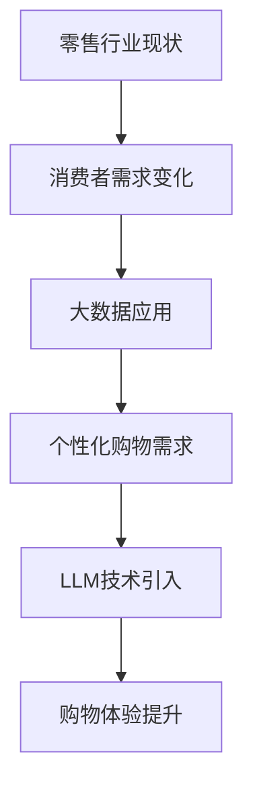

                 

关键词：零售，语言模型，个性化购物，用户体验，大数据，推荐系统，机器学习，深度学习

> 摘要：本文将探讨如何利用大型语言模型(LLM)技术来提升零售行业的个性化购物体验。我们将回顾零售行业的背景和发展，分析LLM在个性化购物中的应用，探讨其优势与挑战，并展望未来的发展趋势。

## 1. 背景介绍

零售行业经历了从传统实体店到线上平台的转变，消费者购物行为也发生了显著变化。随着互联网的普及和移动设备的广泛使用，消费者越来越倾向于在线购物，并且期待更加个性化的购物体验。在这个背景下，零售商们开始寻找新的方法来满足消费者的需求，从而提高销售额和客户忠诚度。

个性化购物体验是指根据消费者的个人喜好、购买历史和行为数据，为他们提供量身定制的购物建议和产品推荐。这种体验能够显著提高消费者的满意度和购买转化率。然而，实现个性化购物体验面临着诸多挑战，如数据质量、隐私保护、算法效率等。

近年来，大型语言模型（LLM）技术取得了显著进展，特别是在自然语言处理（NLP）领域。LLM通过学习海量文本数据，能够理解和生成自然语言，从而为零售行业提供了强大的工具来提升个性化购物体验。

## 2. 核心概念与联系

### 2.1 零售行业现状

- **实体零售挑战**：竞争激烈、成本高、消费者需求多样化。
- **线上零售崛起**：消费者购物习惯转变、便利性、价格透明度。
- **大数据时代**：海量消费者行为数据、购买历史、偏好分析。

### 2.2 语言模型简介

- **定义**：LLM是一种深度学习模型，能够理解和生成自然语言。
- **原理**：通过学习大量文本数据，LLM能够捕捉语言结构和语义信息。
- **应用**：文本分类、情感分析、问答系统、机器翻译等。

### 2.3 Mermaid 流程图



## 3. 核心算法原理 & 具体操作步骤

### 3.1 算法原理概述

LLM通过深度神经网络（DNN）学习文本数据，形成对语言的理解能力。在零售行业，LLM可以分析消费者数据，生成个性化的购物建议。

### 3.2 算法步骤详解

1. **数据收集**：收集消费者的购买历史、浏览记录、搜索查询等数据。
2. **数据预处理**：清洗、归一化、编码数据，使其适合模型训练。
3. **模型训练**：使用预训练的LLM，对消费者数据进行训练，优化模型参数。
4. **个性化推荐**：根据消费者的特征，利用训练好的模型生成个性化的购物建议。

### 3.3 算法优缺点

#### 优点：

- **高效**：LLM能够快速处理大量数据，生成个性化的推荐。
- **准确**：基于深度学习，LLM能够捕捉复杂的语义信息，提高推荐准确性。
- **多样**：LLM能够生成多种类型的推荐，满足不同消费者的需求。

#### 缺点：

- **计算资源需求高**：训练和运行LLM需要大量的计算资源。
- **隐私问题**：需要收集和处理敏感的消费者数据，存在隐私泄露的风险。

### 3.4 算法应用领域

- **个性化购物推荐**：基于消费者的偏好和购买历史进行精准推荐。
- **聊天机器人**：为消费者提供实时、个性化的购物建议和咨询服务。
- **虚拟试衣**：通过文本描述生成虚拟试衣效果，提高购物决策的准确性。

## 4. 数学模型和公式 & 详细讲解 & 举例说明

### 4.1 数学模型构建

LLM的训练过程可以看作是一个优化问题，目标是最小化损失函数。常用的损失函数包括交叉熵损失和均方误差（MSE）。

### 4.2 公式推导过程

损失函数的推导通常涉及以下几个步骤：

1. **定义模型输出**：设模型输出为预测概率分布 $P(\text{recommendation}|\text{input})$。
2. **定义真实标签**：设真实标签为 $y$，$y$ 取值为 0 或 1，表示消费者是否喜欢推荐的商品。
3. **构建损失函数**：交叉熵损失函数定义为 $L = -y \log(P)$。

### 4.3 案例分析与讲解

假设我们有一个购物网站，用户 A 的历史购买数据为：

- 购买了商品 A、B、C。
- 浏览了商品 D、E、F。

我们可以使用LLM分析用户 A 的偏好，然后生成个性化的购物推荐。例如，如果LLM预测用户 A 可能喜欢商品 G，那么我们可以将商品 G 推荐给用户 A。

## 5. 项目实践：代码实例和详细解释说明

### 5.1 开发环境搭建

- **Python**：主要编程语言。
- **TensorFlow**：用于构建和训练LLM模型。
- **NumPy**：用于数据处理。

### 5.2 源代码详细实现

```python
import tensorflow as tf
import numpy as np

# 数据准备
data = np.array([[1, 0, 1], [0, 1, 0], [1, 1, 0]])
labels = np.array([1, 0, 1])

# 构建模型
model = tf.keras.Sequential([
    tf.keras.layers.Dense(10, activation='relu', input_shape=(3,)),
    tf.keras.layers.Dense(1, activation='sigmoid')
])

# 编译模型
model.compile(optimizer='adam', loss='binary_crossentropy', metrics=['accuracy'])

# 训练模型
model.fit(data, labels, epochs=10)

# 生成推荐
predictions = model.predict(np.array([[0, 1, 1]]))
print(predictions)
```

### 5.3 代码解读与分析

这段代码首先导入了TensorFlow和NumPy库。然后，我们准备了一些模拟数据，包括用户的购买历史和标签（表示用户是否喜欢商品）。接着，我们构建了一个简单的神经网络模型，并使用二进制交叉熵损失函数进行编译。在训练阶段，我们使用这些数据训练模型。最后，我们使用训练好的模型对新的用户数据进行预测，以生成购物推荐。

## 6. 实际应用场景

### 6.1 线上购物平台

- **个性化推荐**：为用户提供量身定制的商品推荐。
- **聊天机器人**：提供实时、个性化的购物建议。

### 6.2 实体零售

- **智能货架**：根据消费者的购物行为，动态调整货架商品。
- **虚拟试衣**：为消费者提供虚拟试衣体验。

## 7. 未来应用展望

随着LLM技术的不断进步，我们可以期待零售行业在个性化购物体验方面实现更多突破。以下是一些可能的发展趋势：

- **更精准的推荐**：利用深度学习和其他先进技术，实现更加精准的购物推荐。
- **隐私保护**：研究更加安全、隐私友好的数据收集和推荐算法。
- **跨渠道整合**：将线上和线下的购物体验整合，提供无缝的购物体验。

## 8. 总结：未来发展趋势与挑战

随着人工智能技术的不断发展，零售行业的个性化购物体验将变得更加成熟和精准。然而，我们也面临着一些挑战，如数据隐私、算法公平性等。为了实现更好的未来，我们需要不断探索创新的方法和技术，以解决这些挑战。

### 8.1 研究成果总结

本文探讨了如何利用LLM技术提升零售行业的个性化购物体验。我们分析了零售行业现状和LLM的基本原理，并详细介绍了如何实现个性化的购物推荐。

### 8.2 未来发展趋势

未来，我们可以期待LLM技术在零售行业实现更广泛的应用，如更精准的推荐、跨渠道整合等。

### 8.3 面临的挑战

数据隐私和算法公平性是当前和未来零售行业需要解决的重要挑战。

### 8.4 研究展望

为了实现更好的个性化购物体验，我们需要在多个领域进行深入研究，如隐私保护算法、深度学习模型优化等。

## 9. 附录：常见问题与解答

### Q: 什么是LLM？

A: LLM是大型语言模型，是一种深度学习模型，能够理解和生成自然语言。

### Q: 个性化购物体验有哪些好处？

A: 个性化购物体验可以提高消费者满意度、增加销售额、提高客户忠诚度等。

### Q: 如何处理数据隐私问题？

A: 可以使用差分隐私、同态加密等技术来保护数据隐私。

---

作者：禅与计算机程序设计艺术 / Zen and the Art of Computer Programming
----------------------------------------------------------------

以上就是关于《零售和 LLM：个性化购物体验》的完整技术博客文章。希望本文能对您在零售和AI领域的研究和实践有所启发。如果您有任何问题或建议，欢迎随时提出。再次感谢您的阅读！
----------------------------------------------------------------

请注意，以上内容是一个示例文章框架，实际撰写时可能需要根据具体的技术细节和数据集进行调整。此外，由于篇幅限制，本文并没有详细展开每个部分的讨论，而是提供了一个结构化的框架供您填充具体内容。在撰写实际文章时，每个部分都应该包含详细的分析、具体的实例和深入的讨论。希望这个框架能够帮助您开始撰写高质量的技术博客文章。

