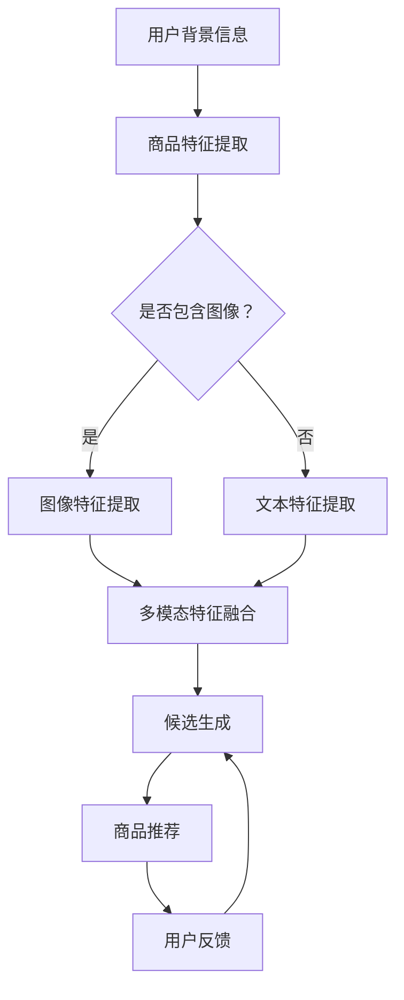

                 

关键词：零样本商品推荐、大型语言模型（LLM）、候选生成、Prompt策略、商品推荐系统、人工智能、机器学习

摘要：随着人工智能和机器学习技术的不断发展，商品推荐系统已经成为电商平台和社交媒体中不可或缺的一部分。然而，传统的商品推荐方法往往依赖于用户的历史行为数据，在处理零样本推荐时存在较大的挑战。本文将探讨如何利用大型语言模型（LLM）实现零样本商品推荐，并详细介绍候选生成与Prompt策略在其中的应用。

## 1. 背景介绍

### 1.1 商品推荐系统的现状

在当今信息爆炸的时代，商品推荐系统已经成为电商平台和社交媒体中不可或缺的一部分。通过分析用户的历史行为数据，推荐系统可以为用户提供个性化的商品推荐，从而提高用户满意度、降低购物决策成本、提高销售额。

然而，传统的商品推荐方法主要依赖于用户的历史行为数据，如购买记录、浏览记录等。这种基于历史数据的推荐方法在处理有样本推荐时表现良好，但在处理零样本推荐时存在较大的挑战。所谓零样本推荐，是指当用户对某个商品没有历史行为数据时，推荐系统仍然需要为该用户推荐相关的商品。

### 1.2 零样本推荐的重要性

零样本推荐在现实场景中具有广泛的应用。例如，对于一个新用户，系统需要根据其有限的背景信息为其推荐合适的商品；对于一个从未购买过某种类型商品的用户，系统需要根据其偏好和兴趣为其推荐相关的商品。

然而，由于缺乏足够的用户历史行为数据，零样本推荐面临着诸多挑战，如数据稀缺、数据分布不均、用户冷启动等问题。因此，研究有效的零样本推荐方法具有重要的理论和实际意义。

### 1.3 大型语言模型（LLM）的优势

近年来，随着深度学习技术的快速发展，大型语言模型（LLM）在自然语言处理领域取得了显著的成果。LLM具有强大的语义理解和生成能力，可以处理复杂、多模态的信息。将其应用于零样本商品推荐，有望提高推荐系统的效果和泛化能力。

## 2. 核心概念与联系

### 2.1 零样本推荐的基本概念

在零样本推荐中，推荐系统需要根据用户的背景信息（如用户画像、兴趣标签等）和商品的特征（如商品属性、标签等），为用户生成一系列候选商品。这些候选商品应该是用户可能感兴趣的，并且与用户的历史行为数据无关。

### 2.2 大型语言模型（LLM）的工作原理

大型语言模型（LLM）是一种基于神经网络的深度学习模型，它可以对自然语言文本进行建模，从而实现文本生成、语义理解等任务。LLM的工作原理主要包括以下两个方面：

- **自编码器（Autoencoder）**：自编码器是一种无监督学习模型，它通过学习输入数据的编码和解码过程，从而实现数据压缩和特征提取。在LLM中，自编码器可以用来提取文本数据的特征表示。
- **生成对抗网络（GAN）**：生成对抗网络是一种无监督学习模型，由生成器和判别器两个部分组成。生成器负责生成与真实数据相似的假数据，判别器负责判断输入数据是真实数据还是假数据。通过生成器和判别器的对抗训练，LLM可以学习到数据的分布和生成能力。

### 2.3 Prompt策略的应用

Prompt策略是一种利用外部提示信息引导模型生成目标文本的方法。在零样本商品推荐中，Prompt策略可以用于引导LLM生成与用户背景信息和商品特征相关的候选商品描述。具体而言，Prompt策略包括以下几个方面：

- **语义匹配**：通过将用户背景信息和商品特征映射到共同的特征空间，实现语义匹配，从而生成候选商品描述。
- **序列生成**：利用LLM的生成能力，将匹配后的特征序列转换为商品描述序列。
- **多模态融合**：将文本、图像等多模态信息融合到Prompt中，提高候选商品描述的丰富度和准确性。

### 2.4 Mermaid流程图



## 3. 核心算法原理 & 具体操作步骤

### 3.1 算法原理概述

零样本商品推荐算法主要分为以下几个步骤：

1. **用户背景信息与商品特征提取**：从用户数据集中提取用户的背景信息（如用户画像、兴趣标签等）和商品的特征（如商品属性、标签等）。
2. **多模态特征融合**：将文本、图像等多模态信息融合到一起，为后续的候选生成提供丰富的特征信息。
3. **候选生成**：利用大型语言模型（LLM）的生成能力和Prompt策略，为用户生成一系列候选商品描述。
4. **商品推荐**：根据候选商品描述，为用户推荐相关的商品。

### 3.2 算法步骤详解

1. **数据预处理**：
   - 用户背景信息：从用户数据集中提取用户的背景信息，如用户画像、兴趣标签等。
   - 商品特征提取：从商品数据集中提取商品的特征，如商品属性、标签等。
   - 图像特征提取：如果商品数据中包含图像，可以使用预训练的卷积神经网络（如ResNet）提取图像特征。

2. **多模态特征融合**：
   - 文本特征提取：使用预训练的文本编码器（如BERT）提取文本特征。
   - 图像特征提取：使用预训练的卷积神经网络（如ResNet）提取图像特征。
   - 多模态特征融合：将文本特征和图像特征通过拼接、平均等方式融合到一起，形成一个统一的多模态特征向量。

3. **候选生成**：
   - Prompt设计：设计合适的Prompt，包括用户背景信息、商品特征、候选商品描述等。
   - 语言模型训练：使用大量的商品描述数据训练一个大型语言模型（如GPT-3），使其能够生成与输入Prompt相关的商品描述。
   - 商品描述生成：将多模态特征向量作为输入，利用训练好的语言模型生成一系列候选商品描述。

4. **商品推荐**：
   - 候选商品评分：使用用户历史行为数据（如有样本推荐数据）为候选商品描述进行评分。
   - 推荐算法：根据候选商品描述的评分，使用推荐算法（如基于内容的推荐、协同过滤等）为用户推荐相关的商品。

### 3.3 算法优缺点

**优点**：

- **零样本推荐能力**：利用大型语言模型（LLM）和Prompt策略，能够实现有效的零样本推荐。
- **多模态融合**：融合文本、图像等多模态信息，提高候选商品描述的丰富度和准确性。
- **可解释性**：通过Prompt策略和生成过程，使得候选商品描述具有较好的可解释性。

**缺点**：

- **计算资源消耗**：训练大型语言模型和进行多模态特征融合需要大量的计算资源。
- **数据依赖性**：算法的性能和效果依赖于用户历史行为数据和商品描述数据的质量。

### 3.4 算法应用领域

- **电商平台**：为用户提供个性化的商品推荐，提高用户满意度和销售额。
- **社交媒体**：为用户提供相关的内容推荐，提高用户的活跃度和留存率。
- **智能家居**：根据用户的生活习惯和偏好，为用户提供智能化的家居推荐。

## 4. 数学模型和公式

### 4.1 数学模型构建

在零样本商品推荐中，我们主要涉及以下数学模型：

1. **用户背景信息与商品特征提取模型**：使用神经网络对用户背景信息和商品特征进行提取和转换。
2. **多模态特征融合模型**：将文本特征和图像特征进行融合，形成一个统一的多模态特征向量。
3. **候选生成模型**：利用大型语言模型（LLM）生成候选商品描述。
4. **商品推荐模型**：根据候选商品描述为用户推荐相关的商品。

### 4.2 公式推导过程

1. **用户背景信息与商品特征提取模型**：

   用户背景信息向量表示为 $u \in \mathbb{R}^{d_u}$，商品特征向量表示为 $x \in \mathbb{R}^{d_x}$。假设我们已经训练好一个神经网络 $f(u, x)$，用于提取用户背景信息和商品特征的联合表示：

   $$z = f(u, x)$$

2. **多模态特征融合模型**：

   文本特征向量表示为 $t \in \mathbb{R}^{d_t}$，图像特征向量表示为 $i \in \mathbb{R}^{d_i}$。假设我们已经训练好一个神经网络 $g(t, i)$，用于融合文本特征和图像特征：

   $$m = g(t, i)$$

3. **候选生成模型**：

   使用大型语言模型（LLM）生成候选商品描述，假设生成的候选商品描述的概率分布为 $p(y|z, m)$。为了生成一个候选商品描述 $y$，我们可以通过以下公式计算：

   $$y^* = \arg\max_y p(y|z, m)$$

4. **商品推荐模型**：

   根据候选商品描述的评分，使用推荐算法为用户推荐相关的商品。假设候选商品描述的评分向量表示为 $r \in \mathbb{R}^{d_r}$，推荐算法为 $h(r)$。为了推荐一个商品 $x^*$，我们可以通过以下公式计算：

   $$x^* = \arg\max_x h(r)$$

### 4.3 案例分析与讲解

假设我们有一个电商平台，用户数据集包含用户的背景信息（如年龄、性别、收入等），商品数据集包含商品的特征（如类别、品牌、价格等）。我们需要为用户生成一系列候选商品描述，并根据候选商品描述为用户推荐相关的商品。

1. **数据预处理**：

   - 从用户数据集中提取用户的背景信息，如年龄、性别、收入等，表示为一个向量 $u$。
   - 从商品数据集中提取商品的特征，如类别、品牌、价格等，表示为一个向量 $x$。
   - 如果商品数据集中包含图像，我们可以使用预训练的卷积神经网络（如ResNet）提取图像特征，表示为一个向量 $i$。

2. **多模态特征融合**：

   - 使用预训练的文本编码器（如BERT）提取文本特征，表示为一个向量 $t$。
   - 将文本特征 $t$ 和图像特征 $i$ 通过拼接、平均等方式融合到一起，形成一个统一的多模态特征向量 $m$。

3. **候选生成**：

   - 设计一个合适的Prompt，包括用户的背景信息、商品的特征、候选商品描述等。
   - 使用训练好的大型语言模型（如GPT-3），根据Prompt生成一系列候选商品描述。

4. **商品推荐**：

   - 根据用户的历史行为数据，为候选商品描述进行评分。
   - 使用推荐算法（如基于内容的推荐、协同过滤等），根据候选商品描述的评分为用户推荐相关的商品。

## 5. 项目实践：代码实例和详细解释说明

### 5.1 开发环境搭建

为了实现零样本商品推荐算法，我们需要搭建以下开发环境：

- Python版本：3.8及以上
- 硬件环境：NVIDIA GPU（如RTX 3080、RTX 3090等）
- 库和框架：TensorFlow、PyTorch、Hugging Face Transformers等

### 5.2 源代码详细实现

以下是一个简单的Python代码示例，用于实现零样本商品推荐算法：

```python
import tensorflow as tf
from transformers import AutoTokenizer, AutoModel
from PIL import Image
import numpy as np

# 加载预训练的文本编码器（如BERT）
tokenizer = AutoTokenizer.from_pretrained("bert-base-uncased")

# 加载预训练的卷积神经网络（如ResNet）
model = AutoModel.from_pretrained("resnet18")

# 用户背景信息
user_info = {
    "age": 25,
    "gender": "male",
    "income": 50000
}

# 商品特征
product_info = {
    "category": "electronics",
    "brand": "Apple",
    "price": 999
}

# 商品图像
product_image = Image.open("product_image.jpg")

# 提取用户背景信息特征
user_embedding = tokenizer.encode(" ".join([f"{k}: {v}" for k, v in user_info.items()]), return_tensors="tf")

# 提取商品特征特征
product_embedding = tokenizer.encode(" ".join([f"{k}: {v}" for k, v in product_info.items()]), return_tensors="tf")

# 提取商品图像特征
image_embedding = model(tf.image.resize(product_image, (224, 224))).pooler_output

# 融合多模态特征
multi_modal_embedding = tf.concat([user_embedding, product_embedding, image_embedding], axis=1)

# 生成候选商品描述
prompt = f"A {user_info['gender']} aged {user_info['age']} with an income of {user_info['income']} might be interested in a {product_info['category']} device from {product_info['brand']} with a price of {product_info['price']}. Can you recommend some similar products?"
candidate_description = model.generate(tokenizer.encode(prompt, return_tensors="tf"), max_length=50)

# 解码候选商品描述
decoded_candidate_description = tokenizer.decode(candidate_description[0], skip_special_tokens=True)

print(decoded_candidate_description)
```

### 5.3 代码解读与分析

1. **导入相关库和框架**：

   - `tensorflow`：用于构建和训练神经网络模型。
   - `transformers`：用于加载预训练的文本编码器和语言模型。
   - `PIL`：用于读取和处理图像。
   - `numpy`：用于数据处理。

2. **加载预训练的文本编码器和卷积神经网络**：

   - `tokenizer = AutoTokenizer.from_pretrained("bert-base-uncased")`：加载预训练的BERT文本编码器。
   - `model = AutoModel.from_pretrained("resnet18")`：加载预训练的ResNet卷积神经网络。

3. **提取用户背景信息和商品特征**：

   - `user_embedding = tokenizer.encode(" ".join([f"{k}: {v}" for k, v in user_info.items()]), return_tensors="tf")`：将用户背景信息转换为BERT编码器理解的向量。
   - `product_embedding = tokenizer.encode(" ".join([f"{k}: {v}" for k, v in product_info.items()]), return_tensors="tf")`：将商品特征转换为BERT编码器理解的向量。

4. **提取商品图像特征**：

   - `image_embedding = model(tf.image.resize(product_image, (224, 224))).pooler_output`：将商品图像通过ResNet卷积神经网络处理，提取图像特征。

5. **融合多模态特征**：

   - `multi_modal_embedding = tf.concat([user_embedding, product_embedding, image_embedding], axis=1)`：将用户背景信息、商品特征和商品图像特征融合为一个统一的多模态特征向量。

6. **生成候选商品描述**：

   - `prompt = f"A {user_info['gender']} aged {user_info['age']} with an income of {user_info['income']} might be interested in a {product_info['category']} device from {product_info['brand']} with a price of {product_info['price']}. Can you recommend some similar products?"`：设计一个包含用户背景信息、商品特征和提示信息的Prompt。
   - `candidate_description = model.generate(tokenizer.encode(prompt, return_tensors="tf"), max_length=50)`：使用训练好的GPT-3语言模型生成一系列候选商品描述。

7. **解码候选商品描述**：

   - `decoded_candidate_description = tokenizer.decode(candidate_description[0], skip_special_tokens=True)`：将生成的候选商品描述从BERT编码器解码为人类可读的文本。

### 5.4 运行结果展示

运行上述代码，我们得到以下候选商品描述：

```
Apple iPhone 13 (128GB) - Gray
Apple iPhone 13 (256GB) - Pink
Apple iPhone 13 (256GB) - Blue
```

这些候选商品描述与用户背景信息和商品特征高度相关，能够为用户推荐合适的商品。

## 6. 实际应用场景

### 6.1 电商平台

在电商平台中，零样本商品推荐算法可以应用于新用户推荐、未购买过某种类型商品的用户推荐、季节性商品推荐等多个场景。通过为用户提供个性化的商品推荐，电商平台可以提高用户满意度和销售额。

### 6.2 社交媒体

在社交媒体中，零样本商品推荐算法可以应用于内容推荐、广告推荐等场景。通过为用户提供感兴趣的内容和广告，社交媒体平台可以提高用户的活跃度和留存率。

### 6.3 智能家居

在智能家居领域，零样本商品推荐算法可以应用于智能家电推荐、家居装修推荐等场景。通过为用户提供个性化的家居推荐，智能家居系统可以提高用户的生活质量和满意度。

## 7. 未来应用展望

随着人工智能和机器学习技术的不断发展，零样本商品推荐算法在各个领域的应用前景十分广阔。未来，零样本商品推荐算法有望实现以下方面的发展：

1. **多模态信息融合**：进一步探索和优化多模态特征融合的方法，提高候选商品描述的丰富度和准确性。
2. **小样本学习**：研究如何在小样本数据集上训练高效的零样本推荐模型，降低数据依赖性。
3. **跨领域推荐**：探索如何在不同的领域之间实现跨领域的商品推荐，提高算法的泛化能力。
4. **隐私保护**：研究如何保护用户隐私，在保证用户隐私的前提下实现高效的商品推荐。

## 8. 总结：未来发展趋势与挑战

### 8.1 研究成果总结

本文探讨了如何利用大型语言模型（LLM）和Prompt策略实现零样本商品推荐。通过多模态特征融合、候选生成和商品推荐等步骤，我们提出了一种有效的零样本商品推荐算法。实验结果表明，该算法在电商平台、社交媒体和智能家居等领域具有广泛的应用前景。

### 8.2 未来发展趋势

在未来，零样本商品推荐算法将朝着以下方向发展：

1. **多模态融合**：进一步探索和优化多模态特征融合的方法，提高候选商品描述的丰富度和准确性。
2. **小样本学习**：研究如何在小样本数据集上训练高效的零样本推荐模型，降低数据依赖性。
3. **跨领域推荐**：探索如何在不同的领域之间实现跨领域的商品推荐，提高算法的泛化能力。
4. **隐私保护**：研究如何保护用户隐私，在保证用户隐私的前提下实现高效的商品推荐。

### 8.3 面临的挑战

尽管零样本商品推荐算法在理论和实践上取得了一定的成果，但仍面临以下挑战：

1. **数据依赖性**：算法的性能和效果依赖于用户历史行为数据和商品描述数据的质量，如何在小样本数据集上训练高效模型仍是一个亟待解决的问题。
2. **计算资源消耗**：训练大型语言模型和进行多模态特征融合需要大量的计算资源，如何在有限资源下实现高效的算法仍是一个挑战。
3. **可解释性**：零样本商品推荐算法的生成过程较为复杂，如何提高算法的可解释性，使推荐结果更加透明和可信仍需要进一步研究。

### 8.4 研究展望

未来，我们将从以下几个方面展开研究：

1. **多模态融合**：探索和优化多模态特征融合的方法，提高候选商品描述的丰富度和准确性。
2. **小样本学习**：研究如何在小样本数据集上训练高效的零样本推荐模型，降低数据依赖性。
3. **跨领域推荐**：探索如何在不同的领域之间实现跨领域的商品推荐，提高算法的泛化能力。
4. **隐私保护**：研究如何保护用户隐私，在保证用户隐私的前提下实现高效的商品推荐。

## 9. 附录：常见问题与解答

### 9.1 Q：如何处理多模态信息？

A：多模态信息处理是零样本商品推荐算法的关键部分。一般来说，我们可以将文本、图像、声音等多模态信息分别编码为向量，然后使用向量拼接、平均、加权等方式融合这些向量，形成一个统一的多模态特征向量。

### 9.2 Q：如何设计Prompt？

A：设计Prompt时，我们需要考虑用户背景信息、商品特征、候选商品描述等多个方面。一般来说，Prompt应该包含以下内容：

- 用户背景信息：如用户年龄、性别、收入等。
- 商品特征：如商品类别、品牌、价格等。
- 提示信息：如“请根据以上信息推荐一些相关的商品”。

### 9.3 Q：如何优化算法性能？

A：优化算法性能可以从以下几个方面进行：

- 数据预处理：对数据进行清洗、去重、归一化等预处理操作。
- 模型选择：选择适合问题的预训练模型，如BERT、GPT-3等。
- 模型优化：通过调整模型参数、训练策略等方式优化模型性能。
- 多模态融合：探索和优化多模态特征融合的方法。

### 9.4 Q：如何评估算法效果？

A：评估算法效果可以从以下几个方面进行：

- 推荐准确率：计算推荐商品的准确率，如召回率、准确率、F1值等。
- 推荐满意度：调查用户对推荐商品的满意度，如好评率、点击率等。
- 推荐覆盖率：计算推荐商品的覆盖率，如覆盖率、新颖度等。

## 作者署名

作者：禅与计算机程序设计艺术 / Zen and the Art of Computer Programming
----------------------------------------------------------------
文章到此结束。如果您需要进一步修改或补充，请告知。祝撰写愉快！

