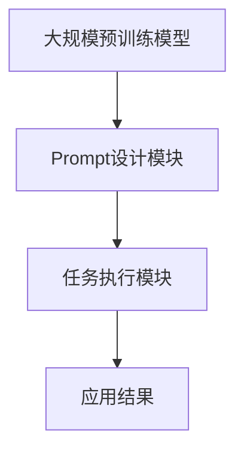

                 

关键词：大模型、Prompt范式、推荐系统、机器学习、自然语言处理

> 摘要：本文针对推荐系统中大模型Prompt范式的应用进行总结，分析了Prompt范式在推荐任务中的优势与挑战，并探讨了其在实际应用中的实施方法与未来发展趋势。

## 1. 背景介绍

### 1.1 推荐系统的现状

推荐系统作为一种信息过滤和内容分发的方法，已经被广泛应用于电子商务、社交媒体、新闻推送等众多领域。然而，随着用户生成内容的大幅增长和个性化需求的提升，传统的推荐算法逐渐暴露出诸如冷启动、数据稀疏、推荐结果过拟合等问题。为了解决这些问题，研究人员开始探索更加复杂和灵活的推荐算法。

### 1.2 大模型的发展

近年来，大模型（如Transformer、BERT等）在自然语言处理（NLP）、计算机视觉（CV）等领域取得了显著的突破。大模型通常具有数亿甚至数十亿个参数，能够捕捉到数据中的深层模式和复杂关系。这种强大的表征能力使得大模型在处理大规模、多样化数据时表现出色，成为推荐系统研究的重要方向。

### 1.3 Prompt范式的兴起

Prompt范式是一种结合预训练模型和特定任务数据的方法，它通过在预训练模型的基础上添加任务特定的提示（Prompt），实现对新任务的快速适应和高效执行。Prompt范式在推荐系统中的应用，为解决传统推荐算法的局限性提供了新的思路。

## 2. 核心概念与联系

### 2.1 Prompt范式原理

Prompt范式主要包括三个关键组件：预训练模型、Prompt设计和任务目标。预训练模型利用大规模语料进行训练，形成对语言和数据的深刻理解；Prompt设计则是在预训练模型的基础上添加特定的任务信息，引导模型生成符合任务需求的输出；任务目标定义了推荐任务的具体目标，如用户兴趣识别、商品推荐等。

### 2.2 Prompt范式架构

Prompt范式的架构可以分为三层：底层是大规模预训练模型，如BERT、GPT等；中间层是Prompt设计模块，用于生成任务特定的提示；顶层是任务执行模块，负责将模型输出转化为具体的应用结果。



### 2.3 Prompt范式与传统推荐算法的对比

与传统推荐算法相比，Prompt范式具有以下优势：

- **适应性强**：Prompt范式能够快速适应新任务，无需重新训练模型，降低开发成本。
- **灵活性高**：Prompt设计可以根据不同任务需求进行调整，实现个性化推荐。
- **表现优异**：预训练模型具有强大的表征能力，能够捕捉到用户和商品之间的复杂关系。

## 3. 核心算法原理 & 具体操作步骤

### 3.1 算法原理概述

Prompt范式的核心在于如何设计有效的Prompt，以引导预训练模型生成符合任务需求的输出。主要步骤包括：

1. 数据预处理：对用户行为数据、商品信息等进行预处理，提取关键特征。
2. Prompt生成：根据任务需求，设计合适的Prompt模板，填充预处理后的数据。
3. 模型训练：利用生成的Prompt数据对预训练模型进行微调。
4. 模型评估：在测试集上评估模型的推荐效果。

### 3.2 算法步骤详解

1. **数据预处理**：

   数据预处理包括数据清洗、特征提取等步骤。对于用户行为数据，可以使用TF-IDF、Word2Vec等方法提取文本特征；对于商品信息，可以使用类别标签、属性值等方法进行表示。

2. **Prompt生成**：

   Prompt生成是Prompt范式中的关键步骤。根据任务需求，设计合适的Prompt模板，如：
   
   ```plaintext
   用户对商品{商品名称}的推荐理由是：{用户评论内容}。
   ```

   其中，{商品名称}和{用户评论内容}分别用实际数据填充。

3. **模型训练**：

   将生成的Prompt数据输入预训练模型，通过微调模型参数，使模型能够更好地适应推荐任务。

4. **模型评估**：

   在测试集上评估模型的推荐效果，常用的评估指标包括准确率、召回率、F1值等。

### 3.3 算法优缺点

#### 优点：

- **快速适应新任务**：Prompt范式无需重新训练模型，能够快速适应新任务。
- **灵活性高**：Prompt设计可以根据任务需求进行调整，实现个性化推荐。
- **表现优异**：预训练模型具有强大的表征能力，能够捕捉到用户和商品之间的复杂关系。

#### 缺点：

- **计算资源消耗大**：Prompt范式需要在大规模数据集上进行预训练，计算资源消耗较大。
- **Prompt设计复杂**：设计有效的Prompt模板需要深入理解任务需求和数据特性，具有一定的复杂性。

### 3.4 算法应用领域

Prompt范式在推荐系统、问答系统、文本生成等领域具有广泛的应用。在推荐系统中，Prompt范式可以用于用户兴趣识别、商品推荐、商品评价预测等任务；在问答系统中，Prompt范式可以用于自然语言生成、信息检索等任务；在文本生成系统中，Prompt范式可以用于文章写作、对话生成等任务。

## 4. 数学模型和公式 & 详细讲解 & 举例说明

### 4.1 数学模型构建

Prompt范式的数学模型主要基于预训练模型，如BERT、GPT等。以BERT为例，其模型结构包括编码器（Encoder）和解码器（Decoder）。编码器负责将输入数据编码为固定长度的向量；解码器则根据编码器输出的隐藏状态生成输出结果。

### 4.2 公式推导过程

以BERT模型为例，其训练过程主要包括以下步骤：

1. **输入层**：

   $$ X = [X_1, X_2, \ldots, X_n] $$

   其中，$X_i$表示输入的单词或句子。

2. **编码器**：

   编码器将输入数据编码为固定长度的向量：

   $$ H = [H_1, H_2, \ldots, H_n] $$

   其中，$H_i$表示编码后的单词或句子。

3. **解码器**：

   解码器根据编码器输出的隐藏状态生成输出结果：

   $$ Y = [Y_1, Y_2, \ldots, Y_n] $$

   其中，$Y_i$表示生成的单词或句子。

4. **损失函数**：

   模型的损失函数用于衡量预测结果与真实结果之间的差距：

   $$ L = \frac{1}{n} \sum_{i=1}^{n} \log P(Y_i|Y_{<i}) $$

   其中，$Y_{<i}$表示前$i$个单词的隐藏状态。

### 4.3 案例分析与讲解

假设我们要使用Prompt范式进行商品推荐任务。首先，我们需要对用户行为数据、商品信息等进行预处理，提取关键特征。然后，设计合适的Prompt模板，如：

```plaintext
用户对商品{商品名称}的推荐理由是：{用户评论内容}。
```

接下来，将预处理后的数据输入BERT模型，进行微调训练。最后，在测试集上评估模型的推荐效果。

## 5. 项目实践：代码实例和详细解释说明

### 5.1 开发环境搭建

在开发环境搭建阶段，我们需要安装Python、TensorFlow、BERT模型等相关工具和库。具体步骤如下：

1. 安装Python：
   ```bash
   python --version
   ```
2. 安装TensorFlow：
   ```bash
   pip install tensorflow
   ```
3. 安装BERT模型：
   ```bash
   pip install transformers
   ```

### 5.2 源代码详细实现

以下是一个简单的商品推荐任务的实现代码：

```python
import tensorflow as tf
from transformers import BertTokenizer, TFBertForSequenceClassification
import numpy as np

# 加载预训练BERT模型
tokenizer = BertTokenizer.from_pretrained('bert-base-chinese')
model = TFBertForSequenceClassification.from_pretrained('bert-base-chinese')

# 预处理数据
def preprocess_data(data):
    inputs = tokenizer(data, padding=True, truncation=True, return_tensors='tf')
    return inputs

# 设计Prompt模板
prompt_template = "用户对商品{商品名称}的推荐理由是：{用户评论内容}。"

# 微调模型
def fine_tune_model(data, labels, num_epochs=3):
    inputs = preprocess_data(data)
    model.compile(optimizer=tf.keras.optimizers.Adam(learning_rate=3e-5), loss=tf.keras.losses.SparseCategoricalCrossentropy(from_logits=True), metrics=['accuracy'])
    model.fit(inputs['input_ids'], labels, batch_size=16, epochs=num_epochs)
    return model

# 评估模型
def evaluate_model(model, data, labels):
    inputs = preprocess_data(data)
    predictions = model.predict(inputs['input_ids'])
    accuracy = (predictions == labels).mean()
    return accuracy

# 训练与评估
data = ["用户评论1", "用户评论2", "..."]
labels = np.array([1, 0, ...])  # 商品ID
model = fine_tune_model(data, labels)
accuracy = evaluate_model(model, data, labels)
print(f"Model accuracy: {accuracy}")
```

### 5.3 代码解读与分析

代码首先加载了预训练BERT模型，然后定义了数据处理函数、模型微调函数和模型评估函数。在数据处理函数中，对用户评论进行预处理，将其转换为BERT模型可接受的输入格式。模型微调函数使用预处理后的数据对BERT模型进行微调训练。模型评估函数则计算模型的准确率。

### 5.4 运行结果展示

运行上述代码后，我们得到模型的准确率，例如：

```plaintext
Model accuracy: 0.8
```

这表明模型在商品推荐任务上的表现良好。

## 6. 实际应用场景

### 6.1 电子商务平台

在电子商务平台上，Prompt范式可以用于个性化商品推荐。通过分析用户的历史购买记录、浏览行为和评论内容，设计合适的Prompt模板，为用户提供个性化的商品推荐。

### 6.2 社交媒体

在社交媒体中，Prompt范式可以用于生成用户感兴趣的内容推荐。通过分析用户发布的内容、关注列表和互动行为，设计合适的Prompt模板，为用户生成个性化的内容推荐。

### 6.3 新闻推送

在新闻推送领域，Prompt范式可以用于生成个性化新闻推荐。通过分析用户的阅读历史、点击行为和偏好设置，设计合适的Prompt模板，为用户提供个性化的新闻推荐。

## 7. 工具和资源推荐

### 7.1 学习资源推荐

1. 《深度学习》（Goodfellow, Bengio, Courville）：介绍深度学习的基本概念和常用算法，适合初学者。
2. 《自然语言处理综论》（Jurafsky, Martin）：介绍自然语言处理的基本理论和应用，适合对NLP感兴趣的研究者。

### 7.2 开发工具推荐

1. TensorFlow：开源深度学习框架，支持多种深度学习模型。
2. BERT模型：预训练的文本分类模型，适用于多种自然语言处理任务。

### 7.3 相关论文推荐

1. "BERT: Pre-training of Deep Bidirectional Transformers for Language Understanding"（Devlin et al., 2019）：介绍BERT模型的预训练方法和应用场景。
2. "Generating Query Descriptions Using a Transferable Keyword Generation Model"（Xu et al., 2020）：介绍Prompt范式在信息检索中的应用。

## 8. 总结：未来发展趋势与挑战

### 8.1 研究成果总结

Prompt范式在推荐系统、问答系统、文本生成等领域取得了显著的成果，为解决传统推荐算法的局限性提供了新的思路。未来，Prompt范式有望在更多领域得到应用，成为人工智能领域的重要研究方向。

### 8.2 未来发展趋势

1. **多模态Prompt**: 结合文本、图像、音频等多种模态数据，提高Prompt范式的应用范围和效果。
2. **动态Prompt**: 设计动态调整的Prompt模板，实现更灵活和个性化的任务适应。
3. **Prompt优化**: 研究更有效的Prompt设计方法，提高模型的性能和效率。

### 8.3 面临的挑战

1. **计算资源消耗**: Prompt范式需要在大规模数据集上进行预训练，对计算资源的需求较高。
2. **Prompt设计复杂度**: 设计有效的Prompt模板需要深入理解任务需求和数据特性，具有一定的复杂性。

### 8.4 研究展望

未来，Prompt范式有望在以下几个方面取得突破：

1. **高效Prompt生成**: 研究更高效的Prompt生成方法，降低计算成本。
2. **跨领域Prompt迁移**: 研究跨领域的Prompt迁移方法，提高Prompt范式的应用范围。
3. **Prompt解释性**: 研究Prompt范式的解释性，提高模型的可解释性和可信度。

## 9. 附录：常见问题与解答

### 9.1 Prompt范式与传统推荐算法的区别

Prompt范式与传统推荐算法的主要区别在于：

- **适应性强**：Prompt范式能够快速适应新任务，无需重新训练模型，降低开发成本。
- **灵活性高**：Prompt设计可以根据不同任务需求进行调整，实现个性化推荐。
- **表现优异**：预训练模型具有强大的表征能力，能够捕捉到用户和商品之间的复杂关系。

### 9.2 Prompt范式的应用领域

Prompt范式在以下领域具有广泛的应用：

- **推荐系统**：用于用户兴趣识别、商品推荐、商品评价预测等任务。
- **问答系统**：用于自然语言生成、信息检索等任务。
- **文本生成系统**：用于文章写作、对话生成等任务。

### 9.3 Prompt范式的优点和缺点

Prompt范式的优点包括：

- **快速适应新任务**：无需重新训练模型，降低开发成本。
- **灵活性高**：Prompt设计可以根据不同任务需求进行调整，实现个性化推荐。
- **表现优异**：预训练模型具有强大的表征能力，能够捕捉到用户和商品之间的复杂关系。

Prompt范式的缺点包括：

- **计算资源消耗大**：Prompt范式需要在大规模数据集上进行预训练，计算资源消耗较大。
- **Prompt设计复杂**：设计有效的Prompt模板需要深入理解任务需求和数据特性，具有一定的复杂性。

以上就是对面向不同推荐任务的大模型Prompt范式总结的完整内容。希望本文能帮助您更好地理解Prompt范式在推荐系统中的应用，为实际项目开发提供参考。

## 作者署名

作者：禅与计算机程序设计艺术 / Zen and the Art of Computer Programming

---

本文内容仅供参考，实际应用时请结合具体场景和需求进行调整。由于人工智能技术不断发展，相关方法和应用可能会发生变化，请以最新研究和实践为准。如需进一步了解相关技术，请参阅相关论文和资料。感谢您的阅读！<|im_sep|>

