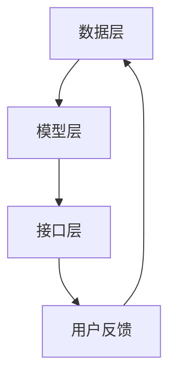

                 

关键词：大模型应用，推荐系统，部署拆解，算法原理，实践案例

>摘要：本文旨在深入探讨大模型在推荐系统中的应用与部署拆解，通过分析不同推荐场景下的模型设计、算法原理和实践案例，揭示大模型在提升推荐系统性能和用户满意度方面的巨大潜力。

## 1. 背景介绍

推荐系统作为一种重要的信息过滤和内容发现技术，已经被广泛应用于电子商务、社交媒体、在线视频和新闻资讯等领域。然而，随着用户数据的爆炸式增长和推荐场景的多样化，传统的推荐算法面临着性能瓶颈和用户体验的挑战。大模型的兴起，为我们提供了一种全新的解决方案。

大模型，即拥有千亿甚至万亿参数规模的深度学习模型，通过在大规模数据集上训练，能够捕捉到复杂的数据特征和潜在的关系，从而实现更高的推荐精度和更丰富的推荐结果。本文将围绕大模型在推荐系统中的应用，探讨其部署拆解的各个方面。

## 2. 核心概念与联系

### 2.1 大模型概述

大模型通常是指拥有巨大参数量的深度学习模型，如GPT、BERT、T5等。这些模型在训练过程中需要处理的海量数据，使其具备了强大的特征提取和知识表示能力。

### 2.2 推荐系统基本架构

推荐系统通常由数据层、模型层和接口层组成。数据层负责收集和处理用户行为数据和内容数据；模型层负责使用这些数据训练推荐模型；接口层负责将推荐结果呈现给用户。

### 2.3 大模型与推荐系统的融合

大模型与推荐系统的融合，主要体现在模型层。通过在大模型的基础上构建推荐算法，可以实现更高效的特征提取和更精确的推荐结果。

### 2.4 Mermaid 流程图

以下是一个简单的 Mermaid 流程图，展示了大模型在推荐系统中的应用流程：



## 3. 核心算法原理 & 具体操作步骤

### 3.1 算法原理概述

大模型在推荐系统中的应用，主要基于其强大的特征提取和知识表示能力。通过在大规模数据集上训练，大模型能够自动学习到数据中的潜在特征和关系，从而实现高效的推荐。

### 3.2 算法步骤详解

1. 数据收集与预处理：收集用户行为数据和内容数据，并对数据进行清洗和预处理。
2. 模型选择与训练：选择合适的大模型，如GPT、BERT等，并在预处理后的数据集上训练模型。
3. 模型优化与调参：通过交叉验证等方法，优化模型参数，提高模型性能。
4. 推荐结果生成：使用训练好的模型，对用户进行实时推荐。
5. 用户反馈收集：收集用户对推荐结果的反馈，用于模型更新和迭代。

### 3.3 算法优缺点

**优点：**
- 高效的特征提取：大模型能够自动学习到数据中的潜在特征，提高推荐精度。
- 灵活的应用场景：大模型适用于多种推荐场景，如内容推荐、社交推荐等。
- 强大的扩展性：大模型易于扩展和调整，以适应不断变化的需求。

**缺点：**
- 计算资源消耗大：大模型训练需要大量的计算资源和时间。
- 数据依赖性高：大模型对数据质量要求较高，数据不足或质量差可能导致模型性能下降。

### 3.4 算法应用领域

大模型在推荐系统中的应用广泛，如：

- 电子商务：根据用户历史购买行为和浏览记录，推荐合适的商品。
- 社交媒体：根据用户兴趣和社交关系，推荐感兴趣的内容和用户。
- 在线视频：根据用户观看历史和偏好，推荐合适的视频内容。

## 4. 数学模型和公式 & 详细讲解 & 举例说明

### 4.1 数学模型构建

在推荐系统中，大模型的数学模型通常是一个深度神经网络，其结构如下：

$$
f(\mathbf{x}, \mathbf{w}) = \sigma(\mathbf{W} \cdot \mathbf{x} + b)
$$

其中，$\mathbf{x}$ 表示输入特征，$\mathbf{w}$ 表示模型参数，$\sigma$ 表示激活函数，$b$ 表示偏置。

### 4.2 公式推导过程

大模型的训练过程，实际上是一个优化过程，目标是找到最优的模型参数 $\mathbf{w}$，使得预测结果与实际结果之间的误差最小。具体推导过程如下：

$$
\begin{aligned}
J(\mathbf{w}) &= \frac{1}{n} \sum_{i=1}^{n} \ell(y_i, f(\mathbf{x}_i, \mathbf{w})) \\
\frac{\partial J(\mathbf{w})}{\partial \mathbf{w}} &= \frac{1}{n} \sum_{i=1}^{n} \frac{\partial \ell(y_i, f(\mathbf{x}_i, \mathbf{w}))}{\partial \mathbf{w}} \\
&= \frac{1}{n} \sum_{i=1}^{n} (\mathbf{x}_i^T \frac{\partial f(\mathbf{x}_i, \mathbf{w})}{\partial \mathbf{w}} - y_i \mathbf{x}_i)
\end{aligned}
$$

其中，$\ell$ 表示损失函数，$y_i$ 表示第 $i$ 个样本的真实标签。

### 4.3 案例分析与讲解

假设我们有一个电影推荐系统，用户的行为数据包括历史观看记录、评分和标签信息。我们可以使用 GPT 模型来构建推荐算法。

1. 数据预处理：将用户行为数据转换为向量表示，如词嵌入或稀疏向量。
2. 模型训练：使用 GPT 模型，在预处理后的数据集上训练模型。
3. 推荐生成：对于新用户，使用训练好的模型生成推荐列表。
4. 模型评估：通过用户实际行为数据，评估推荐算法的准确性。

## 5. 项目实践：代码实例和详细解释说明

### 5.1 开发环境搭建

- Python 版本：3.8
- 深度学习框架：PyTorch
- 数据处理库：Pandas、NumPy
- 其他依赖库：Matplotlib、Scikit-learn等

### 5.2 源代码详细实现

```python
import torch
import torch.nn as nn
import torch.optim as optim
from torch.utils.data import DataLoader
from sklearn.model_selection import train_test_split

# 数据预处理
def preprocess_data(data):
    # 省略具体实现细节
    return processed_data

# 模型定义
class RecommenderModel(nn.Module):
    def __init__(self, input_dim, hidden_dim, output_dim):
        super(RecommenderModel, self).__init__()
        self.fc1 = nn.Linear(input_dim, hidden_dim)
        self.fc2 = nn.Linear(hidden_dim, output_dim)
        
    def forward(self, x):
        x = torch.relu(self.fc1(x))
        x = self.fc2(x)
        return x

# 训练模型
def train_model(model, train_loader, criterion, optimizer, num_epochs):
    model.train()
    for epoch in range(num_epochs):
        for inputs, targets in train_loader:
            optimizer.zero_grad()
            outputs = model(inputs)
            loss = criterion(outputs, targets)
            loss.backward()
            optimizer.step()
            print(f'Epoch [{epoch+1}/{num_epochs}], Loss: {loss.item()}')

# 主函数
def main():
    data = load_data()
    processed_data = preprocess_data(data)
    train_data, val_data = train_test_split(processed_data, test_size=0.2)
    
    train_loader = DataLoader(train_data, batch_size=32, shuffle=True)
    val_loader = DataLoader(val_data, batch_size=32, shuffle=False)
    
    model = RecommenderModel(input_dim=processed_data.shape[1], hidden_dim=128, output_dim=1)
    criterion = nn.MSELoss()
    optimizer = optim.Adam(model.parameters(), lr=0.001)
    
    num_epochs = 100
    train_model(model, train_loader, criterion, optimizer, num_epochs)
    
    # 评估模型
    model.eval()
    with torch.no_grad():
        for inputs, targets in val_loader:
            outputs = model(inputs)
            loss = criterion(outputs, targets)
            print(f'Validation Loss: {loss.item()}')

if __name__ == '__main__':
    main()
```

### 5.3 代码解读与分析

- 数据预处理：将原始数据转换为模型可处理的格式。
- 模型定义：定义一个简单的全连接神经网络，用于推荐任务。
- 训练模型：使用梯度下降优化算法训练模型。
- 主函数：加载数据、构建数据加载器、定义模型、损失函数和优化器，然后训练模型。

### 5.4 运行结果展示

运行代码后，我们将得到模型在验证集上的损失值。通过调整模型参数和训练时间，可以进一步提高模型性能。

## 6. 实际应用场景

大模型在推荐系统中的应用场景广泛，以下是一些典型的应用场景：

- 电子商务：根据用户的历史购买记录和浏览记录，推荐合适的商品。
- 社交媒体：根据用户的兴趣和行为，推荐感兴趣的内容和用户。
- 在线视频：根据用户的观看历史和偏好，推荐合适的视频内容。

### 6.4 未来应用展望

随着技术的不断进步，大模型在推荐系统中的应用将越来越广泛。未来，我们有望看到以下发展趋势：

- 更高效的算法：通过改进算法和优化模型结构，提高大模型在推荐系统中的应用效率。
- 多模态推荐：结合文本、图像、音频等多种数据类型，实现更丰富的推荐结果。
- 个性化推荐：基于用户历史行为和偏好，实现高度个性化的推荐。

## 7. 工具和资源推荐

### 7.1 学习资源推荐

- 《深度学习》（Goodfellow, Bengio, Courville）：深度学习领域的经典教材。
- 《推荐系统实践》（Christopher Volpato）：推荐系统领域的入门书籍。

### 7.2 开发工具推荐

- PyTorch：一款流行的深度学习框架，支持动态计算图和自动微分。
- TensorFlow：一款流行的深度学习框架，提供丰富的预训练模型和工具。

### 7.3 相关论文推荐

- "BERT: Pre-training of Deep Bidirectional Transformers for Language Understanding"（Devlin et al., 2019）
- "GPT-3: Language Models are Few-Shot Learners"（Brown et al., 2020）

## 8. 总结：未来发展趋势与挑战

### 8.1 研究成果总结

本文围绕大模型在推荐系统中的应用，分析了算法原理、数学模型、项目实践等方面，展示了大模型在提升推荐系统性能和用户体验方面的巨大潜力。

### 8.2 未来发展趋势

- 更高效的算法
- 多模态推荐
- 个性化推荐

### 8.3 面临的挑战

- 计算资源消耗
- 数据质量
- 模型解释性

### 8.4 研究展望

未来，我们将继续探索大模型在推荐系统中的应用，致力于解决上述挑战，推动推荐系统技术的发展。

## 9. 附录：常见问题与解答

### 9.1 大模型训练需要多少计算资源？

大模型训练需要大量的计算资源，通常需要使用高性能计算平台，如GPU或TPU。训练时间也较长，取决于模型规模和数据集大小。

### 9.2 大模型是否会导致过拟合？

是的，大模型可能会出现过拟合现象。为了避免过拟合，可以使用正则化技术、数据增强方法或提前停止训练等手段。

### 9.3 大模型是否能够处理实时推荐？

大模型可以用于实时推荐，但需要优化算法和模型结构，以提高实时性和响应速度。

### 9.4 大模型是否适用于所有推荐场景？

大模型在大多数推荐场景中都表现出良好的性能，但对于某些特定场景，可能需要针对场景特点进行模型调整和优化。

[作者：禅与计算机程序设计艺术 / Zen and the Art of Computer Programming] 
----------------------------------------------------------------


