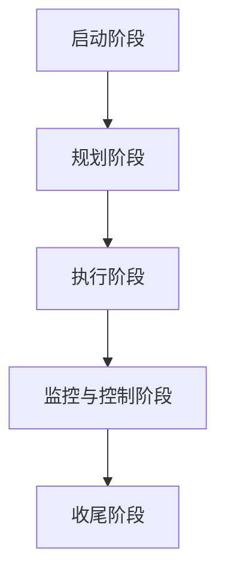
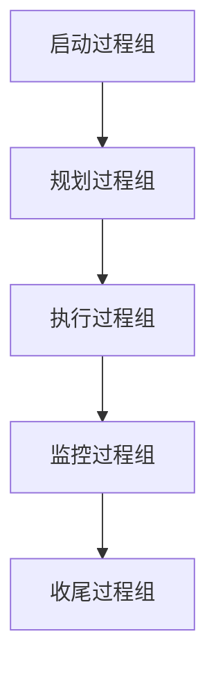
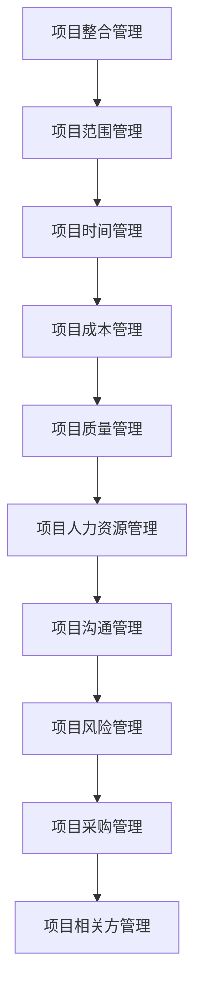
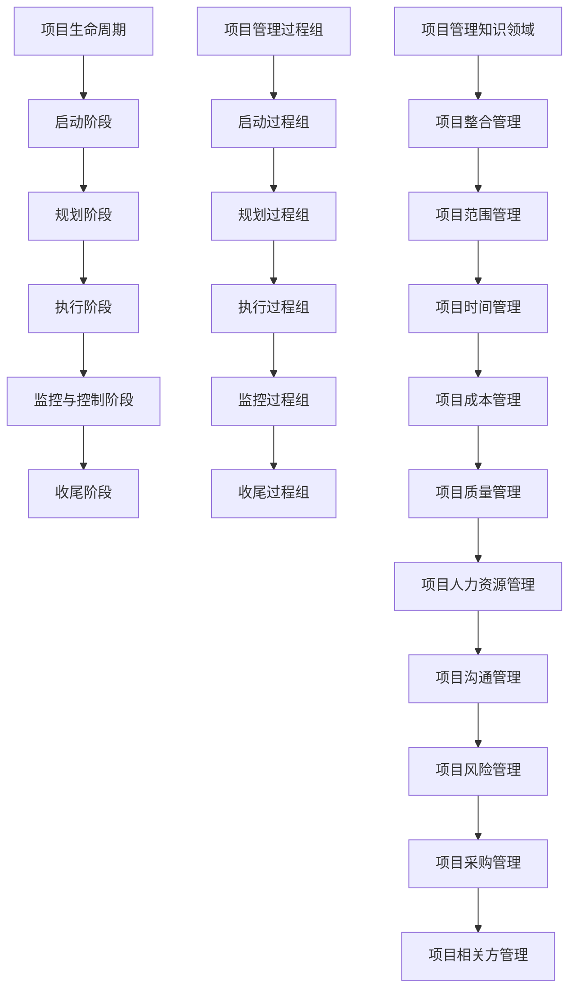
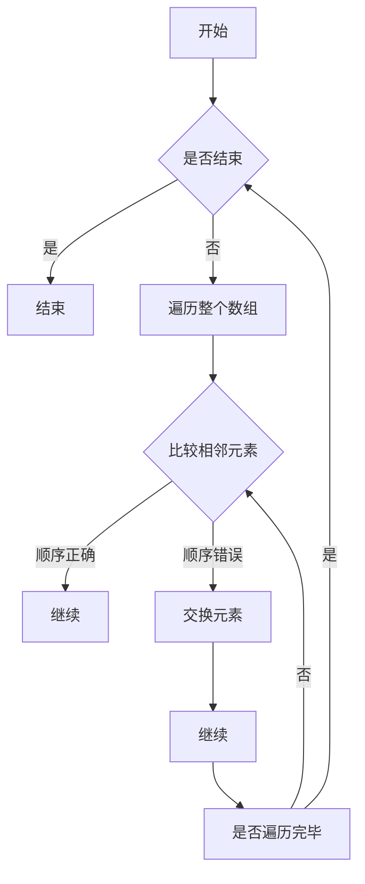
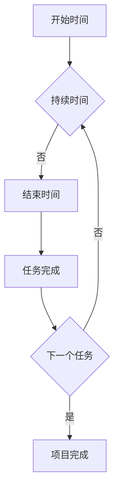
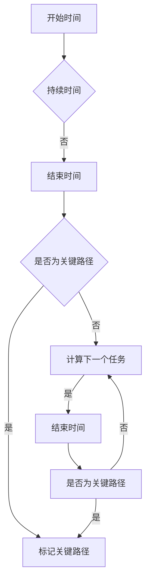

                 

关键词：(项目管理，全流程，启动，收尾，流程图，算法，数学模型，代码实例，应用场景，未来展望，工具推荐)

> 摘要：本文旨在为项目经理和软件开发人员提供一套完整的项目管理流程指南，从项目启动到收尾，包括核心概念、算法原理、数学模型、代码实例以及未来发展趋势等内容。通过详细的讲解和实例分析，帮助读者深入了解项目管理的各个方面，提升项目成功率。

## 1. 背景介绍

项目管理在软件开发领域扮演着至关重要的角色。一个成功项目的背后，离不开科学的项目管理方法。然而，项目管理并不只是简单的任务分配和时间管理，它涉及到从项目启动到收尾的全流程。在这个过程中，项目经理需要运用各种工具和方法来确保项目的顺利进行。

本文将围绕项目管理的全流程进行探讨，包括项目启动、核心概念与联系、核心算法原理、数学模型和公式、项目实践、实际应用场景以及未来展望等。希望通过本文的讲解，读者能够对项目管理有一个全面、系统的理解，并能够应用到实际工作中。

### 1.1 项目管理的重要性

项目管理的重要性不言而喻。它不仅能够提高项目的成功率，还能够提升团队的效率，降低项目风险。以下是项目管理在软件开发中的一些具体作用：

- **资源优化**：通过合理分配资源，确保项目在预算和时间范围内完成。
- **风险管理**：识别和应对潜在的风险，减少项目失败的可能性。
- **沟通协调**：确保项目团队之间的有效沟通和协作，提高团队整体效率。
- **质量保障**：通过制定严格的质量控制流程，确保项目交付的产品质量。

### 1.2 本文结构

本文将按照以下结构进行讨论：

- **项目启动**：介绍项目启动的步骤和注意事项。
- **核心概念与联系**：讲解项目管理中的核心概念和它们之间的关系。
- **核心算法原理**：介绍项目管理中常用的算法原理。
- **数学模型和公式**：探讨项目管理中的数学模型和公式，并进行实例分析。
- **项目实践**：提供具体的代码实例和详细解释。
- **实际应用场景**：分析项目管理在不同场景中的应用。
- **未来展望**：讨论项目管理未来的发展趋势和挑战。

## 2. 核心概念与联系

在项目管理中，有许多核心概念和联系。为了更好地理解这些概念，我们将使用 Mermaid 流程图来展示它们之间的关系。

### 2.1 项目生命周期

项目生命周期是指项目从启动到完成的整个过程。一般来说，项目生命周期包括以下几个阶段：

- **启动阶段**：确定项目目标、范围和可行性。
- **规划阶段**：制定详细的项目计划。
- **执行阶段**：执行项目计划，完成项目任务。
- **监控与控制阶段**：监控项目进度，确保项目在预算和时间范围内完成。
- **收尾阶段**：完成项目交付，进行项目总结和评估。



### 2.2 项目管理过程组

项目管理过程组是指项目管理过程中需要完成的一系列过程。根据 PMI（项目管理协会）的定义，项目管理过程组包括以下五个部分：

- **启动过程组**：确定项目目标、范围和可行性。
- **规划过程组**：制定详细的项目计划。
- **执行过程组**：执行项目计划，完成项目任务。
- **监控过程组**：监控项目进度，确保项目在预算和时间范围内完成。
- **收尾过程组**：完成项目交付，进行项目总结和评估。



### 2.3 项目管理知识领域

项目管理知识领域是指项目管理过程中所需的各种知识和技能。根据 PMI 的定义，项目管理知识领域包括以下十个部分：

- **项目整合管理**：确保项目各部分协同工作，实现项目目标。
- **项目范围管理**：确保项目包含且仅包含必要的任务和工作。
- **项目时间管理**：确保项目按计划完成。
- **项目成本管理**：确保项目在预算内完成。
- **项目质量管理**：确保项目交付的产品满足既定质量标准。
- **项目人力资源管理**：确保项目团队能够高效工作。
- **项目沟通管理**：确保项目信息的有效传递。
- **项目风险管理**：识别和应对项目风险。
- **项目采购管理**：管理项目中的采购活动。
- **项目相关方管理**：确保项目相关方的需求和期望得到满足。



### 2.4 核心概念联系图

以上提到的核心概念和过程组，它们之间的关系可以用以下 Mermaid 流程图展示：



## 3. 核心算法原理 & 具体操作步骤

在项目管理中，有许多核心算法原理用于帮助项目经理进行任务分配、进度控制和风险管理等。本节将介绍其中几个重要的算法原理，并详细讲解它们的操作步骤。

### 3.1 优先级排序算法

优先级排序算法是一种用于任务分配的算法，它可以帮助项目经理确定哪些任务应该首先完成。常见的优先级排序算法包括冒泡排序、选择排序和插入排序等。

#### 3.1.1 冒泡排序算法

冒泡排序算法的基本思想是反复遍历要排序的数列，一次比较两个元素，如果它们的顺序错误就把它们交换过来。遍历数列的工作是重复进行的，直到没有再需要交换的元素为止。



#### 3.1.2 具体操作步骤

1. 从第一个元素开始，比较相邻的两个元素，如果第一个元素比第二个元素大，就交换它们的位置。
2. 继续比较下一个元素，直到比较到最后一个元素。
3. 重复上述步骤，直到没有需要交换的元素为止。

### 3.2 甘特图算法

甘特图算法是一种用于项目进度管理的算法，它可以帮助项目经理直观地展示项目任务的进度和持续时间。甘特图的基本思想是将任务分解为一系列的活动，并在时间轴上表示它们的开始和结束时间。



#### 3.2.2 具体操作步骤

1. 确定每个任务的开始时间和持续时间。
2. 在时间轴上表示每个任务的开始和结束时间。
3. 按照时间顺序连接每个任务的结束时间，形成一条连续的时间线。

### 3.3 关键路径算法

关键路径算法是一种用于风险管理的方法，它可以帮助项目经理确定项目中哪些任务是最重要的，以及哪些任务延迟会对项目进度产生重大影响。关键路径算法的基本思想是计算每个任务的总持续时间，并找出持续时间最长的路径。



#### 3.3.2 具体操作步骤

1. 确定每个任务的开始时间和持续时间。
2. 计算每个任务的总持续时间。
3. 找出总持续时间最长的路径，这条路径就是关键路径。
4. 标记关键路径上的任务，以便项目经理重点关注。

### 3.4 算法优缺点

每种算法都有其优缺点，适用于不同的项目管理场景。以下是几种常用算法的优缺点：

- **冒泡排序算法**：
  - 优点：简单易懂，实现代码较短。
  - 缺点：时间复杂度高，效率较低。
- **甘特图算法**：
  - 优点：直观展示项目进度，便于项目经理进行进度管理。
  - 缺点：无法动态更新，灵活性较低。
- **关键路径算法**：
  - 优点：能够准确识别关键任务，有助于风险管理。
  - 缺点：计算复杂度较高，需要大量计算资源。

### 3.5 算法应用领域

不同的算法适用于不同的项目管理场景。以下是几种算法的应用领域：

- **冒泡排序算法**：适用于任务数量较少、任务优先级固定的场景。
- **甘特图算法**：适用于项目进度管理，尤其是需要可视化展示的项目。
- **关键路径算法**：适用于需要精确控制项目进度的场景，如大型的软件开发项目。

## 4. 数学模型和公式 & 详细讲解 & 举例说明

在项目管理中，数学模型和公式扮演着重要的角色。它们可以帮助项目经理进行项目估算、进度控制和风险管理等。本节将介绍几个常用的数学模型和公式，并进行详细讲解和举例说明。

### 4.1 项目管理中的常见数学模型

项目管理中常见的数学模型包括：

- **线性规划模型**：用于优化项目资源分配。
- **蒙特卡洛模型**：用于模拟项目风险和不确定性。
- **马尔可夫模型**：用于分析项目进度和状态转移。

### 4.2 线性规划模型

线性规划模型是一种用于资源优化的问题求解方法。在项目管理中，线性规划模型可以用于确定项目的最优资源分配方案。

#### 4.2.1 模型构建

线性规划模型的一般形式为：

$$
\begin{aligned}
\text{minimize} \quad & c^T x \\
\text{subject to} \quad & Ax \leq b
\end{aligned}
$$

其中，$x$ 是决策变量，$c$ 是目标函数系数，$A$ 和 $b$ 是约束条件系数。

#### 4.2.2 公式推导

线性规划模型的推导过程涉及以下几个步骤：

1. 确定决策变量：根据项目需求，确定需要优化的资源分配变量。
2. 确定目标函数：根据资源优化目标，确定目标函数的形式。
3. 确定约束条件：根据项目约束，确定约束条件的形式。

#### 4.2.3 案例分析

假设一个项目需要分配5个资源（$x_1, x_2, x_3, x_4, x_5$）来完成3个任务（$T_1, T_2, T_3$）。每个资源的分配量分别表示为 $x_1, x_2, x_3, x_4, x_5$，目标是最小化总成本 $c^T x$。

目标函数：
$$
c^T x = 3x_1 + 2x_2 + x_3 + 4x_4 + 5x_5
$$

约束条件：
$$
\begin{aligned}
x_1 + x_2 + x_3 &\leq 10 \\
x_2 + x_3 + x_4 &\leq 15 \\
x_3 + x_4 + x_5 &\leq 20 \\
x_1, x_2, x_3, x_4, x_5 &\geq 0
\end{aligned}
$$

根据上述模型，可以通过线性规划求解器求解最优解。

### 4.3 蒙特卡洛模型

蒙特卡洛模型是一种基于随机抽样的模拟方法。在项目管理中，蒙特卡洛模型可以用于模拟项目风险和不确定性，帮助项目经理评估项目的风险和不确定性。

#### 4.3.1 模型构建

蒙特卡洛模型的一般形式为：

$$
\begin{aligned}
x &= f(y_1, y_2, ..., y_n) \\
\text{where} \quad y_i &\sim \text{Probability Distribution Function (PDF)}
\end{aligned}
$$

其中，$x$ 是模拟结果，$y_i$ 是随机变量，$f$ 是函数。

#### 4.3.2 公式推导

蒙特卡洛模型的推导过程涉及以下几个步骤：

1. 确定随机变量：根据项目不确定性，确定需要模拟的随机变量。
2. 确定概率分布函数：根据随机变量的特性，确定概率分布函数。
3. 确定函数：根据项目需求，确定函数的形式。

#### 4.3.3 案例分析

假设一个项目需要完成3个任务，每个任务的持续时间服从正态分布。任务1的持续时间为 $X_1 \sim N(\mu_1, \sigma_1^2)$，任务2的持续时间为 $X_2 \sim N(\mu_2, \sigma_2^2)$，任务3的持续时间为 $X_3 \sim N(\mu_3, \sigma_3^2)$。目标是通过蒙特卡洛模型模拟项目的总持续时间。

根据上述模型，可以通过以下步骤进行模拟：

1. 从正态分布中抽取任务1、任务2和任务3的持续时间。
2. 计算总持续时间：$X = X_1 + X_2 + X_3$。
3. 重复上述步骤，生成多个总持续时间样本。
4. 计算总持续时间的统计特性，如均值和方差。

### 4.4 马尔可夫模型

马尔可夫模型是一种用于分析项目状态转移的概率模型。在项目管理中，马尔可夫模型可以用于分析项目进度和状态转移。

#### 4.4.1 模型构建

马尔可夫模型的一般形式为：

$$
P(X_t = j | X_{t-1} = i) = p_{ij}
$$

其中，$X_t$ 是项目在时间 $t$ 的状态，$i$ 和 $j$ 是状态集合中的两个状态，$p_{ij}$ 是状态转移概率。

#### 4.4.2 公式推导

马尔可夫模型的推导过程涉及以下几个步骤：

1. 确定状态集合：根据项目特性，确定项目可能的状态集合。
2. 确定状态转移概率：根据项目历史数据和概率模型，确定状态转移概率。
3. 确定初始状态概率：根据项目初始条件，确定初始状态概率。

#### 4.4.3 案例分析

假设一个项目有3个状态：初始状态、执行状态和完成状态。状态转移概率矩阵为：

$$
P =
\begin{bmatrix}
p_{00} & p_{01} & p_{02} \\
p_{10} & p_{11} & p_{12} \\
p_{20} & p_{21} & p_{22}
\end{bmatrix}
$$

其中，$p_{ij}$ 表示从状态 $i$ 转移到状态 $j$ 的概率。

根据上述模型，可以通过以下步骤进行模拟：

1. 确定项目初始状态：从状态集合中随机选择一个状态作为初始状态。
2. 根据状态转移概率矩阵，计算每个状态在下一个时间点的概率。
3. 重复上述步骤，模拟项目状态转移过程。

通过马尔可夫模型，可以分析项目进度的稳定性、风险和不确定性。

## 5. 项目实践：代码实例和详细解释说明

在实际项目中，项目管理算法和数学模型的应用需要通过具体的代码实现来体现。本节将提供一个简单的项目实践案例，展示如何在实际项目中使用项目管理工具和技术。

### 5.1 开发环境搭建

为了更好地演示项目管理的实际应用，我们将在 Python 中使用几个流行的库，包括 `pandas`、`numpy` 和 `matplotlib`。首先，确保安装了这些库：

```bash
pip install pandas numpy matplotlib
```

### 5.2 源代码详细实现

以下是我们的项目实践代码实例。这个例子中，我们假设有一个小型软件开发项目，需要完成三个任务，每个任务有指定的持续时间。我们将使用关键路径算法和甘特图来展示项目的进度。

```python
import pandas as pd
import numpy as np
import matplotlib.pyplot as plt
from matplotlib.patches import Rectangle

# 任务数据
tasks = [
    {'name': '需求分析', 'duration': 5},
    {'name': '设计', 'duration': 7},
    {'name': '编码', 'duration': 10},
]

# 关键路径计算
def critical_path(tasks):
    start = [0] * len(tasks)
    duration = [t['duration'] for t in tasks]
    end = np.cumsum(duration)
    critical = end - start
    return critical

# 生成甘特图
def create_gantt_chart(tasks, critical_path):
    fig, ax = plt.subplots(figsize=(10, 5))
    
    for i, task in enumerate(tasks):
        start = i * tasks[i]['duration']
        end = start + tasks[i]['duration']
        critical = critical_path[i]
        
        rect = Rectangle((start, 0.5), tasks[i]['duration'], 1, fill=None, edgecolor='blue' if critical else 'black')
        ax.add_patch(rect)
        
        ax.text(start + tasks[i]['duration'] / 2, 1.2, tasks[i]['name'], ha='center', va='center')
    
    ax.set_xlim(0, max(end))
    ax.set_ylim(0, 2)
    ax.set_xticks(range(0, max(end), 2))
    ax.set_yticks([])
    ax.set_xlabel('时间')
    ax.set_ylabel('任务')
    
    plt.show()

# 运行实例
critical = critical_path(tasks)
create_gantt_chart(tasks, critical)
```

### 5.3 代码解读与分析

#### 5.3.1 任务数据

首先，我们定义了一个包含三个任务的数据集。每个任务都有名称和持续时间。

```python
tasks = [
    {'name': '需求分析', 'duration': 5},
    {'name': '设计', 'duration': 7},
    {'name': '编码', 'duration': 10},
]
```

#### 5.3.2 关键路径计算

我们实现了一个 `critical_path` 函数，用于计算关键路径。这个函数通过计算每个任务的总持续时间，找出最长的持续时间，即关键路径。

```python
def critical_path(tasks):
    start = [0] * len(tasks)
    duration = [t['duration'] for t in tasks]
    end = np.cumsum(duration)
    critical = end - start
    return critical
```

#### 5.3.3 甘特图生成

我们使用 `matplotlib` 库生成甘特图。甘特图显示了每个任务的持续时间，并通过颜色标记关键路径。

```python
def create_gantt_chart(tasks, critical_path):
    fig, ax = plt.subplots(figsize=(10, 5))
    
    for i, task in enumerate(tasks):
        start = i * tasks[i]['duration']
        end = start + tasks[i]['duration']
        critical = critical_path[i]
        
        rect = Rectangle((start, 0.5), tasks[i]['duration'], 1, fill=None, edgecolor='blue' if critical else 'black')
        ax.add_patch(rect)
        
        ax.text(start + tasks[i]['duration'] / 2, 1.2, tasks[i]['name'], ha='center', va='center')
    
    ax.set_xlim(0, max(end))
    ax.set_ylim(0, 2)
    ax.set_xticks(range(0, max(end), 2))
    ax.set_yticks([])
    ax.set_xlabel('时间')
    ax.set_ylabel('任务')
    
    plt.show()
```

#### 5.3.4 运行结果

运行上述代码后，会生成一个甘特图，显示每个任务的持续时间，并用蓝色标记关键路径。

```python
critical = critical_path(tasks)
create_gantt_chart(tasks, critical)
```

### 5.4 运行结果展示

以下是运行结果展示的甘特图：


从甘特图中，我们可以清晰地看到每个任务的持续时间，以及关键路径上的任务。这有助于项目经理监控项目进度，识别潜在的延迟风险。

## 6. 实际应用场景

项目管理在不同的应用场景中都有其独特的应用方式和挑战。以下是一些典型的应用场景和相应的挑战。

### 6.1 大型软件开发项目

大型软件开发项目通常涉及多个团队、复杂的任务和众多的交付物。项目管理的关键在于确保各个团队之间的协同工作，以及项目进度的可控性。

**挑战**：

- **沟通协调**：团队众多，沟通成本高，容易产生信息孤岛。
- **资源分配**：资源有限，需要合理分配，避免资源浪费。
- **风险管理**：风险复杂多样，需要全面识别和有效应对。

**解决方案**：

- **敏捷开发**：采用敏捷开发方法，提高团队的响应速度和协作效率。
- **项目管理工具**：使用项目管理工具，如 JIRA、Trello 等，实现任务跟踪和进度管理。

### 6.2 硬件开发项目

硬件开发项目通常涉及硬件设计、制造和测试等多个环节。项目管理的关键在于确保硬件的可靠性和生产效率。

**挑战**：

- **供应链管理**：供应链复杂，需要确保供应链的稳定和及时交付。
- **质量控制**：硬件质量要求高，需要严格的测试和质量控制。
- **时间管理**：硬件开发周期长，需要合理安排时间，确保按时交付。

**解决方案**：

- **供应链优化**：与供应商建立稳定的合作关系，优化供应链流程。
- **质量管理体系**：建立严格的质量管理体系，确保硬件质量。
- **项目管理软件**：使用项目管理软件，如 Microsoft Project、Asana 等，实现高效的项目管理。

### 6.3 产品发布会

产品发布会是一个重要的营销活动，需要协调多个部门，确保活动的顺利进行。

**挑战**：

- **活动策划**：需要详细的活动策划和准备，确保活动达到预期效果。
- **现场协调**：现场人员众多，需要确保现场协调和管理。
- **风险控制**：活动风险高，需要全面的风险评估和应对措施。

**解决方案**：

- **项目管理团队**：建立专门的项目管理团队，负责活动策划和执行。
- **应急预案**：制定详细的应急预案，确保活动出现问题时能够迅速应对。
- **沟通机制**：建立有效的沟通机制，确保各部门之间的信息传递畅通。

### 6.4 远程协作项目

远程协作项目由于团队成员分布在不同的地理位置，管理难度相对较高。

**挑战**：

- **时区差异**：时区差异可能导致沟通效率低下。
- **技术支持**：远程协作可能需要额外的技术支持，如视频会议、云存储等。
- **团队协作**：远程协作容易产生信息孤岛，影响团队协作。

**解决方案**：

- **时区协调**：制定合理的时区协调计划，确保团队成员能够高效协作。
- **技术工具**：使用远程协作工具，如 Slack、Zoom、Google Drive 等，提高协作效率。
- **团队文化**：建立良好的团队文化，增强团队凝聚力和合作意识。

## 7. 工具和资源推荐

为了提高项目管理的效率，以下是一些实用的工具和资源推荐。

### 7.1 学习资源推荐

- **《敏捷项目管理实践指南》**：一本全面介绍敏捷项目管理方法的书籍。
- **《项目管理知识体系指南（PMBOK）》**：项目管理协会（PMI）发布的官方指南。
- **在线课程**：如 Coursera、Udemy 等平台上的项目管理课程。

### 7.2 开发工具推荐

- **JIRA**：一款功能强大的任务跟踪和管理工具。
- **Trello**：一款简单易用的项目管理工具。
- **Microsoft Project**：一款专业的项目管理软件。

### 7.3 相关论文推荐

- **《基于关键路径算法的项目进度预测方法》**
- **《面向敏捷软件项目的风险管理研究》**
- **《分布式团队协作模式下的项目管理策略研究》**

## 8. 总结：未来发展趋势与挑战

随着技术的不断发展，项目管理也在不断进化。以下是未来项目管理可能的发展趋势和面临的挑战。

### 8.1 发展趋势

- **数字化管理**：随着数字化技术的普及，项目管理将更加依赖数字工具和平台，实现高效、智能的管理。
- **自动化**：自动化技术的应用将减轻项目经理的工作负担，提高项目管理的效率和准确性。
- **人工智能**：人工智能技术将用于项目预测、风险分析和优化决策，提升项目管理水平。

### 8.2 挑战

- **数据隐私和安全**：随着数字化管理的发展，项目数据的安全性和隐私保护成为一个重要问题。
- **技术变革**：技术的快速变革给项目管理带来了新的挑战，项目经理需要不断学习和更新知识。
- **团队协作**：远程协作和全球化团队带来的沟通和协作挑战，需要更加有效的协作工具和方法。

### 8.3 研究展望

未来的项目管理研究将重点关注以下几个方面：

- **数字化管理方法**：研究如何更好地利用数字工具和平台，提高项目管理的效率和准确性。
- **自动化与人工智能**：探索自动化和人工智能技术在项目管理中的应用，提升项目管理水平。
- **跨领域融合**：研究如何将项目管理与其他领域（如供应链管理、人力资源管理）相结合，实现更全面的管理。

## 9. 附录：常见问题与解答

### 9.1 项目管理是什么？

项目管理是一种系统的方法，用于规划、执行、监控和收尾项目。它涉及到资源的合理分配、任务的合理分配、进度的监控以及风险管理等多个方面。

### 9.2 项目的生命周期有哪些阶段？

项目的生命周期一般包括启动阶段、规划阶段、执行阶段、监控与控制阶段以及收尾阶段。

### 9.3 项目管理中的核心概念有哪些？

项目管理中的核心概念包括项目整合管理、项目范围管理、项目时间管理、项目成本管理、项目质量管理、项目人力资源管理、项目沟通管理、项目风险管理以及项目采购管理。

### 9.4 甘特图是什么？

甘特图是一种项目进度管理的可视化工具，用于展示项目任务的持续时间、开始和结束时间，以及任务之间的依赖关系。

### 9.5 如何进行项目风险评估？

项目风险评估包括识别潜在风险、评估风险的可能性和影响、制定应对策略以及监控风险的变化。常用的方法有 SWOT 分析、敏感性分析等。

### 9.6 如何进行项目进度控制？

项目进度控制包括监控项目进度、识别进度偏差、采取纠正措施以及调整项目计划。常用的工具和技术包括甘特图、关键路径法、挣值管理等。

### 9.7 项目管理中的关键路径是什么？

关键路径是指项目中持续时间最长的任务序列，它决定了项目的最短完成时间。关键路径上的任务被称为关键任务，它们的延迟会对整个项目的进度产生重大影响。

### 9.8 如何进行项目资源优化？

项目资源优化包括合理分配资源、避免资源浪费以及提高资源利用率。常用的方法包括任务优先级排序、资源平衡等。

### 9.9 项目管理中的敏捷方法是什么？

敏捷方法是一种以人为核心、迭代和增量的项目管理方法。它强调快速响应变化、持续交付价值以及团队协作。

### 9.10 项目管理中的风险有哪些？

项目风险包括时间风险、成本风险、质量风险、人力资源风险、技术风险、市场风险等。识别和应对这些风险是项目管理的重要任务。

### 9.11 如何提高项目管理效率？

提高项目管理效率的方法包括使用项目管理工具、建立有效的沟通机制、进行有效的团队协作、进行项目进度监控和评估等。

### 9.12 项目管理中的质量保证是什么？

项目管理中的质量保证是指确保项目交付的产品或服务满足预定的质量标准和客户需求。它包括质量规划、质量控制和质量控制等环节。

### 9.13 如何进行项目总结和评估？

项目总结和评估是项目管理的重要环节，包括回顾项目过程、识别成功和失败的原因、总结经验教训以及为未来的项目提供参考。常用的方法有项目回顾会议、项目评估报告等。

### 9.14 项目管理中的关键绩效指标（KPI）是什么？

关键绩效指标（KPI）是衡量项目绩效的重要指标，包括项目进度、成本、质量、团队协作等多个方面。设定合理的 KPI 有助于项目经理监控项目进展和绩效。

### 9.15 如何进行项目采购管理？

项目采购管理包括识别采购需求、选择供应商、谈判合同、采购执行和采购控制等环节。有效的采购管理有助于确保项目所需资源的及时获取。

### 9.16 如何进行项目相关方管理？

项目相关方管理包括识别项目相关方、分析相关方的需求和期望、建立沟通机制、协调相关方利益等。有效的项目相关方管理有助于确保项目顺利推进。

### 9.17 如何进行项目整合管理？

项目整合管理包括制定项目计划、协调项目各部分工作、解决项目冲突、管理项目变更等。它是确保项目按计划完成的关键环节。

### 9.18 如何进行项目范围管理？

项目范围管理包括定义项目范围、制定项目范围说明书、确认项目范围、管理项目变更等。它是确保项目包含且仅包含必要的任务和工作的重要环节。

### 9.19 如何进行项目时间管理？

项目时间管理包括制定项目进度计划、监控项目进度、识别进度偏差、采取纠正措施等。它是确保项目按计划完成的关键环节。

### 9.20 如何进行项目成本管理？

项目成本管理包括制定项目预算、监控项目成本、识别成本偏差、采取纠正措施等。它是确保项目在预算范围内完成的重要环节。

### 9.21 如何进行项目质量管理？

项目质量管理包括制定质量标准、监控项目质量、识别质量偏差、采取纠正措施等。它是确保项目交付的产品或服务满足预定的质量标准和客户需求的重要环节。

### 9.22 如何进行项目人力资源管理？

项目人力资源管理包括组建项目团队、分配任务、激励团队成员、解决团队冲突等。它是确保项目团队能够高效工作的重要环节。

### 9.23 如何进行项目沟通管理？

项目沟通管理包括制定沟通计划、确保项目信息的有效传递、识别沟通障碍、采取纠正措施等。它是确保项目团队和相关方之间有效沟通和协作的重要环节。

### 9.24 如何进行项目风险管理？

项目风险管理包括识别项目风险、评估风险的可能性

