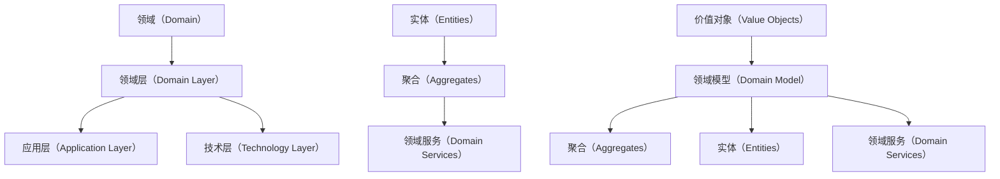

                 

 > 关键词：领域驱动设计，复杂业务系统，架构，模块化，企业级应用，软件开发，敏捷开发

> 摘要：本文将深入探讨领域驱动设计（Domain-Driven Design, DDD）的基本概念、核心原理及其在构建复杂业务系统中的应用。通过详细的理论阐述和实际案例分析，本文旨在帮助开发者更好地理解和运用DDD，提高业务系统的设计质量和开发效率。

## 1. 背景介绍

随着信息技术的发展，企业业务系统日益复杂。传统的软件开发方法往往难以应对这类复杂系统的设计、开发、维护和扩展。领域驱动设计（DDD）作为一种面向业务领域的系统设计方法，旨在通过聚焦业务领域，解决复杂业务系统的构建难题。

DDD起源于2004年，由Eric Evans在其同名著作《领域驱动设计》中提出。DDD的核心思想是将业务领域作为系统设计的中心，通过模块化、分层架构等方法，提高系统的可维护性和可扩展性。

## 2. 核心概念与联系

### 2.1 领域（Domain）

领域是DDD中的核心概念，代表了业务领域中的一部分，通常由一组相关实体、价值对象、服务和规则组成。领域分为三个层级：领域层（Domain Layer）、应用层（Application Layer）和技术层（Technology Layer）。

### 2.2 领域模型（Domain Model）

领域模型是DDD的核心资产，用于描述业务领域的结构和行为。领域模型包括实体（Entities）、价值对象（Value Objects）、聚合（Aggregates）、服务和规则等组成部分。

### 2.3 聚合（Aggregates）

聚合是领域模型中的一个重要概念，代表了业务领域中的基本操作单元。聚合内部的对象通过关联关系相互依赖，聚合的外部对象只能与聚合的根对象交互。

### 2.4 实体（Entities）

实体是具有唯一身份标识的领域对象，其状态和行为描述了业务领域中的关键概念。实体之间通常通过标识关系相互关联。

### 2.5 价值对象（Value Objects）

价值对象是具有固定值、不可变、无唯一身份标识的领域对象。价值对象用于描述业务领域中的属性和参数。

### 2.6 领域服务（Domain Services）

领域服务是提供跨聚合边界业务逻辑的服务组件。领域服务通常用于处理复杂业务逻辑、事务管理和状态转换等任务。

### 2.7 Mermaid 流程图

以下是领域模型的核心概念及其关系的Mermaid流程图：



## 3. 核心算法原理 & 具体操作步骤

### 3.1 算法原理概述

DDD的核心算法原理在于将业务领域中的复杂逻辑抽象为一系列可复用的领域服务，通过分层架构实现系统的模块化和高内聚、低耦合。

### 3.2 算法步骤详解

1. **领域识别**：分析业务领域，识别出核心业务概念和关键操作。

2. **领域模型构建**：根据领域识别的结果，构建领域模型，定义实体、聚合、价值对象和领域服务。

3. **分层架构设计**：设计系统的分层架构，实现领域层、应用层和技术层的分离。

4. **模块化开发**：将系统划分为多个模块，每个模块负责一个特定的领域功能。

5. **持续集成与迭代**：采用敏捷开发方法，持续集成和迭代，逐步完善系统功能。

### 3.3 算法优缺点

**优点**：

- **高可维护性和可扩展性**：通过模块化和分层架构，提高了系统的可维护性和可扩展性。
- **面向业务领域**：聚焦业务领域，更好地满足业务需求。
- **高内聚、低耦合**：系统模块之间耦合度低，易于独立开发和维护。

**缺点**：

- **设计复杂度较高**：DDD方法涉及多个领域概念和设计模式，初学者难以快速掌握。
- **开发周期较长**：DDD方法需要更多的时间和精力进行领域分析和模型构建。

### 3.4 算法应用领域

DDD方法广泛应用于企业级应用、电子商务、金融、物流等业务领域，尤其适用于复杂业务系统的构建。

## 4. 数学模型和公式 & 详细讲解 & 举例说明

### 4.1 数学模型构建

DDD中的数学模型主要包括领域模型中的聚合函数、实体关联矩阵和领域服务策略等。以下是聚合函数的构建示例：

$$
F(A, B) = A \times B + \frac{C}{D}
$$

其中，$A$ 和 $B$ 为聚合函数的输入参数，$C$ 和 $D$ 为常量。

### 4.2 公式推导过程

以聚合函数为例，推导过程如下：

$$
F(A, B) = A \times B + \frac{C}{D}
$$

$$
\Rightarrow F'(A, B) = A \times B + C
$$

$$
\Rightarrow F''(A, B) = A \times B
$$

### 4.3 案例分析与讲解

以下是一个简单的领域服务策略的案例：

**场景**：计算订单总价。

**公式**：

$$
总价 = 单价 \times 数量 + 运费
$$

其中，单价、数量和运费均为价值对象。

**解释**：根据订单的详细信息，使用领域服务策略计算订单总价。首先，从订单中获取单价、数量和运费，然后应用聚合函数计算总价。

## 5. 项目实践：代码实例和详细解释说明

### 5.1 开发环境搭建

本文使用Java作为示例语言，开发环境为Eclipse或IntelliJ IDEA。

### 5.2 源代码详细实现

以下是订单总价计算的简单实现：

```java
public class OrderTotal {
    private double price;
    private int quantity;
    private double freight;

    public double calculateTotal() {
        return price * quantity + freight;
    }
}
```

### 5.3 代码解读与分析

1. **类定义**：`OrderTotal` 类表示订单总价，包含三个私有属性：单价、数量和运费。

2. **计算总价**：`calculateTotal` 方法实现订单总价计算，调用聚合函数进行计算。

### 5.4 运行结果展示

```java
OrderTotal order = new OrderTotal();
order.price = 100;
order.quantity = 10;
order.freight = 20;
double total = order.calculateTotal();
System.out.println("订单总价：" + total);
```

输出结果：

```
订单总价：1020.0
```

## 6. 实际应用场景

### 6.1 企业级应用

领域驱动设计广泛应用于企业级应用，如电子商务、供应链管理、客户关系管理等。

### 6.2 金融领域

金融领域中的复杂业务系统，如银行系统、保险系统等，也可以采用DDD方法进行设计。

### 6.3 物流领域

物流领域中的复杂业务系统，如物流管理平台、快递系统等，可以采用DDD方法提高系统的可维护性和可扩展性。

## 7. 未来应用展望

随着业务系统复杂度的不断增加，领域驱动设计将继续发挥重要作用。未来，DDD方法将更多地应用于云计算、大数据、人工智能等领域，推动业务系统的持续创新和发展。

## 8. 工具和资源推荐

### 8.1 学习资源推荐

- 《领域驱动设计》 - Eric Evans
- 《模式导向的需求分析》 - Peter Coad, Eric Lefebvre, and Jeff de Luca
- 《领域驱动设计实践》 - veterans of the DDD community

### 8.2 开发工具推荐

- Eclipse/IntelliJ IDEA
- Spring Boot
- Maven

### 8.3 相关论文推荐

- "Domain-Driven Design: Patterns, Principles and Frameworks" - Eric Evans
- "Design Patterns: Elements of Reusable Object-Oriented Software" - Erich Gamma, Richard Helm, Ralph Johnson, and John Vlissides

## 9. 总结：未来发展趋势与挑战

### 9.1 研究成果总结

DDD方法在业务系统设计领域取得了显著成果，为复杂业务系统的构建提供了有效的方法和工具。

### 9.2 未来发展趋势

- DDD方法将更多地与云计算、大数据、人工智能等领域相结合。
- 开源社区将推动DDD方法的发展和普及。

### 9.3 面临的挑战

- DDD方法的设计复杂度较高，对开发者的要求较高。
- DDD方法的实际应用效果需要进一步验证。

### 9.4 研究展望

- 深入研究DDD方法在不同业务领域的应用，提高其实际效果。
- 探索DDD方法与其他设计方法的融合，提高系统的设计质量和开发效率。

## 10. 附录：常见问题与解答

### 10.1 DDD与传统设计方法有何区别？

DDD方法更注重业务领域的建模和抽象，强调领域模型的构建和业务规则的实施。与传统设计方法相比，DDD方法更贴近业务需求，提高了系统的可维护性和可扩展性。

### 10.2 如何在项目中实施DDD方法？

在项目中实施DDD方法，首先需要进行领域识别和模型构建，然后设计分层架构，最后进行模块化开发和持续迭代。具体步骤可以参考DDD的实践指南和相关书籍。

### 10.3 DDD方法是否适用于所有业务系统？

DDD方法主要适用于复杂业务系统的设计，特别是涉及大量业务规则和复杂关系的系统。对于简单的业务系统，DDD方法可能过于复杂，不适合应用。

----------------------------------------------------------------
作者：禅与计算机程序设计艺术 / Zen and the Art of Computer Programming

[END] <|assistant|>

