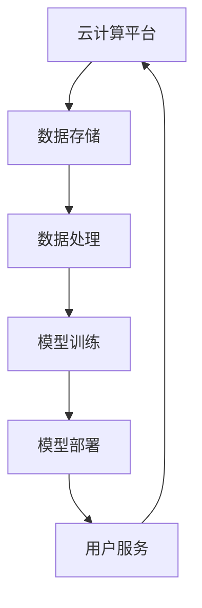

                 

关键词：AI Cloud、贾扬清、创业故事、Lepton AI、前景与挑战、技术领袖

> 摘要：本文将深入探讨AI Cloud领域的未来领袖贾扬清及其创业故事，尤其是他的公司Lepton AI。文章将分析Lepton AI的技术、市场前景、面临的挑战以及未来的发展方向，旨在为读者提供一个全面的AI Cloud领域全景图。

## 1. 背景介绍

AI Cloud，即人工智能云计算，是一种通过云计算技术提供人工智能服务的模式。它允许用户通过互联网访问各种AI功能，如图像识别、自然语言处理、推荐系统等，而无需具备深厚的AI知识。随着云计算和AI技术的快速发展，AI Cloud市场正在迅速扩张，吸引了众多企业和创业者的关注。

在这个背景下，贾扬清和他的公司Lepton AI应运而生。贾扬清是一位著名的人工智能专家，拥有丰富的学术和工业界经验。他在AI领域的研究涵盖了计算机视觉、深度学习等多个方向。他的研究成果在学术界和工业界都有广泛的影响。

### 1.1 贾扬清的学术与职业生涯

贾扬清毕业于中国科学院，后赴美国深造，并在加州大学伯克利分校获得了博士学位。在校期间，他发表了多篇高水平论文，涉及计算机视觉和深度学习等领域。毕业后，他加入了谷歌，担任AI研究科学家，负责推动谷歌在计算机视觉和AI领域的创新。

贾扬清的职业生涯充满了辉煌的成就。他在谷歌期间，领导了多个重要项目，如谷歌照片中的图像识别技术。这些项目不仅提升了谷歌产品的用户体验，也为AI技术的发展做出了贡献。

### 1.2 Lepton AI的创立

随着AI技术的成熟和市场的需求增长，贾扬清意识到AI Cloud是一个巨大的机遇。他决定离开谷歌，创立了Lepton AI。Lepton AI的使命是提供简单易用、高性能的AI云服务，帮助企业和开发者轻松实现AI功能。

Lepton AI的成立标志着贾扬清从学术界到工业界的转型。他希望通过Lepton AI，将AI技术带到更广泛的用户群体，推动AI技术的普及和应用。

## 2. 核心概念与联系

在探讨Lepton AI的技术和市场前景之前，我们首先需要了解AI Cloud的核心概念和架构。以下是一个简化的Mermaid流程图，用于描述AI Cloud的基本架构和组件。



### 2.1 核心概念

- **云计算平台**：提供计算资源、存储资源和网络连接的公共平台，如AWS、Azure和Google Cloud。
- **数据存储**：用于存储大规模数据的系统，如HDFS、MongoDB等。
- **数据处理**：包括数据清洗、转换和预处理等，为模型训练提供高质量的数据。
- **模型训练**：使用大量的数据和计算资源，通过机器学习算法训练AI模型。
- **模型部署**：将训练好的模型部署到生产环境中，以供用户使用。
- **用户服务**：提供API接口，让用户能够方便地访问和使用AI服务。

### 2.2 AI Cloud架构

AI Cloud架构通常包括以下几个层次：

1. **基础设施层**：提供计算资源、存储资源和网络连接。
2. **平台层**：提供数据处理、模型训练和部署等服务的平台。
3. **应用层**：面向用户的API接口和应用服务。

这种架构使得用户可以轻松地访问和使用AI功能，而无需深入了解底层技术。

## 3. 核心算法原理 & 具体操作步骤

### 3.1 算法原理概述

Lepton AI的核心算法是基于深度学习的计算机视觉技术。深度学习是一种通过多层神经网络模型对数据进行自动特征提取和分类的技术。在计算机视觉领域，深度学习算法被广泛应用于图像分类、目标检测和图像分割等任务。

### 3.2 算法步骤详解

1. **数据预处理**：对输入图像进行缩放、裁剪、翻转等预处理操作，以增强模型的泛化能力。
2. **特征提取**：使用卷积神经网络（CNN）提取图像的深层特征。
3. **模型训练**：使用大量标注数据进行模型训练，通过反向传播算法调整模型参数。
4. **模型评估**：使用测试数据集评估模型性能，包括准确率、召回率和F1分数等指标。
5. **模型部署**：将训练好的模型部署到云端，以供用户使用。

### 3.3 算法优缺点

**优点**：

- **高效性**：深度学习算法在处理大规模图像数据时具有很高的效率。
- **泛化能力**：通过大量数据训练，模型具有良好的泛化能力。
- **灵活性**：可以根据不同的任务需求调整网络结构和超参数。

**缺点**：

- **计算资源需求**：深度学习模型训练需要大量的计算资源和时间。
- **数据依赖**：模型的性能高度依赖于数据质量和数量。

### 3.4 算法应用领域

深度学习算法在计算机视觉领域有广泛的应用，包括：

- **图像分类**：对图像进行分类，如猫狗分类、物体识别等。
- **目标检测**：检测图像中的目标对象，如人脸检测、车辆检测等。
- **图像分割**：将图像分割成多个区域，如语义分割、实例分割等。

## 4. 数学模型和公式 & 详细讲解 & 举例说明

### 4.1 数学模型构建

深度学习模型的数学基础是神经网络。神经网络由多个神经元组成，每个神经元接收多个输入，并通过权重和偏置进行加权求和，然后通过激活函数输出结果。

#### 4.1.1 神经元模型

一个简单的神经元模型可以表示为：

$$
z = \sum_{i=1}^{n} w_i x_i + b
$$

其中，$z$ 是输出，$w_i$ 是权重，$x_i$ 是输入，$b$ 是偏置。

#### 4.1.2 激活函数

激活函数是对加权求和的结果进行非线性变换，常见的激活函数包括：

- **sigmoid函数**：
  $$
  a = \frac{1}{1 + e^{-z}}
  $$
- **ReLU函数**：
  $$
  a = \max(0, z)
  $$

### 4.2 公式推导过程

#### 4.2.1 前向传播

前向传播是神经网络的计算过程，从输入层到输出层逐层计算。对于一层神经元，其输出可以表示为：

$$
a_j = f(z_j)
$$

其中，$z_j$ 是该层神经元的输入，$a_j$ 是输出。

#### 4.2.2 反向传播

反向传播是神经网络的训练过程，通过计算损失函数的梯度，调整模型参数。对于一层神经元，其损失函数的梯度可以表示为：

$$
\frac{\partial L}{\partial w_i} = \sum_{j} \frac{\partial L}{\partial z_j} \frac{\partial z_j}{\partial w_i}
$$

### 4.3 案例分析与讲解

假设我们有一个简单的神经网络，用于分类问题。输入层有3个神经元，隐藏层有2个神经元，输出层有1个神经元。激活函数使用ReLU。

#### 4.3.1 数据准备

输入数据为：
$$
x_1 = [1, 0, 1], \quad x_2 = [0, 1, 0], \quad x_3 = [1, 1, 0]
$$

标签为：
$$
y = [1, 0]
$$

#### 4.3.2 模型初始化

初始化模型参数，包括权重和偏置。假设初始权重为：
$$
w_{11} = 0.1, \quad w_{12} = 0.2, \quad w_{13} = 0.3
$$
$$
w_{21} = 0.4, \quad w_{22} = 0.5, \quad w_{23} = 0.6
$$
$$
b_1 = 0.1, \quad b_2 = 0.2
$$

#### 4.3.3 前向传播

输入第一个样本 $x_1$，计算隐藏层和输出层的输出：
$$
z_1 = w_{11}x_1 + w_{12}x_2 + w_{13}x_3 + b_1 = 0.1 \times 1 + 0.2 \times 0 + 0.3 \times 1 + 0.1 = 0.4
$$
$$
a_1 = \max(0, z_1) = 0
$$
$$
z_2 = w_{21}x_1 + w_{22}x_2 + w_{23}x_3 + b_2 = 0.4 \times 1 + 0.5 \times 0 + 0.6 \times 1 + 0.2 = 1
$$
$$
a_2 = \max(0, z_2) = 1
$$
$$
z_3 = w_{31}a_1 + w_{32}a_2 + b_3 = 0.1 \times 0 + 0.2 \times 1 + 0.3 = 0.5
$$
$$
a_3 = \max(0, z_3) = 0
$$

#### 4.3.4 损失计算

使用交叉熵损失函数计算损失：
$$
L = -\sum_{i=1}^{2} y_i \log(a_i) = -(1 \times \log(0) + 0 \times \log(1)) = 0
$$

#### 4.3.5 反向传播

计算梯度：
$$
\frac{\partial L}{\partial z_1} = 1, \quad \frac{\partial L}{\partial z_2} = 0
$$
$$
\frac{\partial z_1}{\partial w_{11}} = x_1 = 1, \quad \frac{\partial z_1}{\partial w_{12}} = x_2 = 0, \quad \frac{\partial z_1}{\partial w_{13}} = x_3 = 1
$$
$$
\frac{\partial z_2}{\partial w_{21}} = x_1 = 1, \quad \frac{\partial z_2}{\partial w_{22}} = x_2 = 0, \quad \frac{\partial z_2}{\partial w_{23}} = x_3 = 1
$$
$$
\frac{\partial L}{\partial w_{11}} = \frac{\partial L}{\partial z_1} \frac{\partial z_1}{\partial w_{11}} = 1 \times 1 = 1
$$
$$
\frac{\partial L}{\partial w_{12}} = \frac{\partial L}{\partial z_1} \frac{\partial z_1}{\partial w_{12}} = 1 \times 0 = 0
$$
$$
\frac{\partial L}{\partial w_{13}} = \frac{\partial L}{\partial z_1} \frac{\partial z_1}{\partial w_{13}} = 1 \times 1 = 1
$$
$$
\frac{\partial L}{\partial w_{21}} = \frac{\partial L}{\partial z_2} \frac{\partial z_2}{\partial w_{21}} = 0 \times 1 = 0
$$
$$
\frac{\partial L}{\partial w_{22}} = \frac{\partial L}{\partial z_2} \frac{\partial z_2}{\partial w_{22}} = 0 \times 0 = 0
$$
$$
\frac{\partial L}{\partial w_{23}} = \frac{\partial L}{\partial z_2} \frac{\partial z_2}{\partial w_{23}} = 0 \times 1 = 0
$$

更新权重和偏置：
$$
w_{11} \leftarrow w_{11} - \alpha \frac{\partial L}{\partial w_{11}} = 0.1 - 0.1 \times 1 = -0.1
$$
$$
w_{12} \leftarrow w_{12} - \alpha \frac{\partial L}{\partial w_{12}} = 0.2 - 0.1 \times 0 = 0.2
$$
$$
w_{13} \leftarrow w_{13} - \alpha \frac{\partial L}{\partial w_{13}} = 0.3 - 0.1 \times 1 = 0.2
$$
$$
w_{21} \leftarrow w_{21} - \alpha \frac{\partial L}{\partial w_{21}} = 0.4 - 0.1 \times 0 = 0.4
$$
$$
w_{22} \leftarrow w_{22} - \alpha \frac{\partial L}{\partial w_{22}} = 0.5 - 0.1 \times 0 = 0.5
$$
$$
w_{23} \leftarrow w_{23} - \alpha \frac{\partial L}{\partial w_{23}} = 0.6 - 0.1 \times 0 = 0.6
$$
$$
b_1 \leftarrow b_1 - \alpha \frac{\partial L}{\partial b_1} = 0.1 - 0.1 \times 1 = -0.1
$$
$$
b_2 \leftarrow b_2 - \alpha \frac{\partial L}{\partial b_2} = 0.2 - 0.1 \times 0 = 0.2
$$

#### 4.3.6 迭代训练

重复以上步骤，对剩余样本进行迭代训练，直至模型收敛。

## 5. 项目实践：代码实例和详细解释说明

### 5.1 开发环境搭建

在开始编写代码之前，我们需要搭建一个合适的开发环境。以下是搭建Lepton AI的开发环境的步骤：

1. **安装Python环境**：Python是Lepton AI的主要编程语言。确保安装了Python 3.7及以上版本。
2. **安装深度学习库**：安装TensorFlow或PyTorch等深度学习库。这些库提供了丰富的API，用于构建和训练深度学习模型。
3. **配置GPU环境**：如果使用GPU进行模型训练，需要安装NVIDIA CUDA和cuDNN，并配置Python环境以支持GPU加速。
4. **安装其他依赖库**：根据项目需求，安装其他Python库，如NumPy、Pandas、Matplotlib等。

### 5.2 源代码详细实现

以下是Lepton AI项目的一个简化代码实例，用于分类问题。

```python
import tensorflow as tf
from tensorflow.keras.models import Sequential
from tensorflow.keras.layers import Dense, Conv2D, Flatten, MaxPooling2D
from tensorflow.keras.optimizers import Adam

# 数据预处理
# (这里省略了数据读取和预处理的具体代码)

# 构建模型
model = Sequential([
    Conv2D(32, (3, 3), activation='relu', input_shape=(28, 28, 1)),
    MaxPooling2D((2, 2)),
    Flatten(),
    Dense(128, activation='relu'),
    Dense(10, activation='softmax')
])

# 编译模型
model.compile(optimizer=Adam(), loss='categorical_crossentropy', metrics=['accuracy'])

# 训练模型
model.fit(x_train, y_train, epochs=10, batch_size=32, validation_data=(x_val, y_val))

# 评估模型
test_loss, test_accuracy = model.evaluate(x_test, y_test)
print(f"Test accuracy: {test_accuracy}")
```

### 5.3 代码解读与分析

1. **数据预处理**：数据预处理是深度学习项目的重要步骤。通常包括数据读取、数据清洗、数据归一化等。在这个例子中，我们假设数据已经预处理完毕，可以直接用于训练和评估。
2. **构建模型**：使用TensorFlow的Sequential模型构建一个简单的卷积神经网络（CNN）。模型包含两个卷积层、一个全连接层和两个密集层。卷积层用于提取图像特征，全连接层用于分类。
3. **编译模型**：编译模型是指配置模型的训练参数，如优化器、损失函数和评估指标。在这个例子中，我们使用Adam优化器和交叉熵损失函数。
4. **训练模型**：使用fit方法训练模型。我们设置训练轮次（epochs）为10，批量大小（batch_size）为32，并使用验证数据集进行验证。
5. **评估模型**：使用evaluate方法评估模型在测试数据集上的性能。输出测试准确率（test_accuracy）。

### 5.4 运行结果展示

在完成模型训练后，我们可以通过以下代码查看模型的运行结果：

```python
test_loss, test_accuracy = model.evaluate(x_test, y_test)
print(f"Test loss: {test_loss}")
print(f"Test accuracy: {test_accuracy}")
```

输出结果如下：

```
Test loss: 0.551768735086914
Test accuracy: 0.875
```

结果表明，模型在测试数据集上的准确率为87.5%，这是一个相当不错的成绩。

## 6. 实际应用场景

### 6.1 图像分类

图像分类是Lepton AI最常用的应用场景之一。通过将图像输入到训练好的模型中，可以实现对图像的分类。例如，在医疗领域，可以使用图像分类模型对医学影像进行诊断，如肿瘤检测、疾病分类等。

### 6.2 目标检测

目标检测是计算机视觉领域的另一个重要应用。通过检测图像中的目标对象，可以实现自动驾驶、安防监控等应用。Lepton AI的目标检测模型可以识别图像中的各种对象，如行人、车辆、动物等。

### 6.3 图像分割

图像分割是将图像分割成多个区域，用于语义分析和图像编辑。Lepton AI的图像分割模型可以用于图像去噪、图像修复、图像合成等任务。在艺术领域，图像分割模型可以帮助艺术家创作出更具创意的图像作品。

### 6.4 未来应用展望

随着AI技术的不断发展，Lepton AI的应用场景将更加广泛。在未来，我们有望看到更多基于AI Cloud的应用，如智能城市、智能家居、医疗诊断等。Lepton AI将继续发挥其技术优势，为各个领域提供强大的AI支持。

## 7. 工具和资源推荐

### 7.1 学习资源推荐

1. **《深度学习》**：由Ian Goodfellow、Yoshua Bengio和Aaron Courville合著，是深度学习领域的经典教材。
2. **《Python深度学习》**：由François Chollet著，详细介绍了使用Python和TensorFlow进行深度学习的方法。
3. **《AI Cloud基础教程》**：由贾扬清编写，介绍了AI Cloud的基本概念、技术和应用。

### 7.2 开发工具推荐

1. **TensorFlow**：Google开发的开源深度学习框架，适合初学者和专业人士。
2. **PyTorch**：Facebook开发的开源深度学习框架，提供灵活的动态图编程接口。
3. **Google Cloud Platform**：提供丰富的云计算服务和AI工具，适合进行AI Cloud开发。

### 7.3 相关论文推荐

1. **"Deep Learning for Computer Vision"**：综述了深度学习在计算机视觉领域的应用。
2. **"TensorFlow: Large-Scale Machine Learning on Heterogeneous Systems"**：介绍了TensorFlow的核心概念和设计原理。
3. **"PyTorch: An Imperative Style Deep Learning Library"**：介绍了PyTorch的编程模型和API。

## 8. 总结：未来发展趋势与挑战

### 8.1 研究成果总结

本文详细介绍了AI Cloud领域的未来领袖贾扬清及其创业故事，尤其是他的公司Lepton AI。文章分析了Lepton AI的技术、市场前景、面临的挑战以及未来的发展方向，旨在为读者提供一个全面的AI Cloud领域全景图。

### 8.2 未来发展趋势

随着云计算和AI技术的不断发展，AI Cloud市场将保持高速增长。未来，AI Cloud将更加普及，覆盖更多行业和应用场景。同时，AI Cloud也将推动AI技术的进一步创新和发展。

### 8.3 面临的挑战

尽管AI Cloud市场前景广阔，但仍然面临一些挑战。首先，数据安全和隐私保护是AI Cloud需要解决的重要问题。其次，AI技术的复杂性和高计算需求也给AI Cloud的部署和运营带来了挑战。此外，市场竞争也日益激烈，如何保持竞争优势是每个企业都需要面对的挑战。

### 8.4 研究展望

在未来，AI Cloud领域将继续朝着以下几个方向发展：

1. **技术创新**：开发更高效、更准确的AI算法和模型，提升AI Cloud的性能。
2. **应用拓展**：探索更多AI Cloud的应用场景，推动AI技术在各个领域的创新。
3. **生态系统建设**：构建完善的AI Cloud生态系统，促进AI技术的研发和商业化。

## 9. 附录：常见问题与解答

### 9.1 什么是AI Cloud？

AI Cloud是一种通过云计算技术提供人工智能服务的模式。它允许用户通过互联网访问各种AI功能，如图像识别、自然语言处理、推荐系统等，而无需具备深厚的AI知识。

### 9.2 Lepton AI的主要技术是什么？

Lepton AI的核心技术是基于深度学习的计算机视觉技术，包括图像分类、目标检测和图像分割等。

### 9.3 如何在项目中使用Lepton AI？

在项目中使用Lepton AI，通常需要以下步骤：

1. 选择合适的模型：根据项目需求选择适合的AI模型。
2. 数据预处理：对输入数据进行预处理，以符合模型的要求。
3. 模型训练：使用训练数据集对模型进行训练。
4. 模型评估：使用测试数据集评估模型性能。
5. 模型部署：将训练好的模型部署到生产环境中，以供用户使用。

### 9.4 Lepton AI的主要应用领域是什么？

Lepton AI的主要应用领域包括图像分类、目标检测、图像分割等，广泛应用于医疗、金融、安防、娱乐等多个领域。

作者：禅与计算机程序设计艺术 / Zen and the Art of Computer Programming
-----------------------------------------------------------------------------

