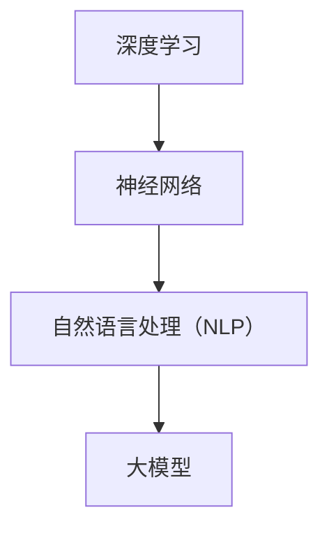

                 

关键词：AI创业、大模型、产品创新、深度学习、市场应用、技术趋势

摘要：本文将探讨AI创业公司如何通过大模型产品创新来抓住市场机遇，实现业务增长。文章将分析大模型在AI产品中的应用场景，介绍核心算法原理与操作步骤，并探讨数学模型构建与公式推导。此外，还将通过项目实践和代码实例展示大模型的应用效果，分析实际应用场景，并展望未来发展趋势与挑战。

## 1. 背景介绍

人工智能（AI）作为当前科技领域的重要驱动力，正逐步渗透到各行各业。AI创业公司在过去几年中迅速崛起，通过技术创新和产品创新在市场中占据了一席之地。其中，大模型（如GPT、BERT等）作为AI技术的核心组件，其应用场景越来越广泛，逐渐成为企业竞争力的重要来源。

随着AI技术的不断发展，市场对AI产品的需求也在不断增长。然而，如何在激烈的市场竞争中脱颖而出，成为AI创业公司面临的一大挑战。大模型产品创新成为了一条可行的道路，能够帮助企业抓住市场机遇，提升产品竞争力。

本文将从大模型在AI产品中的应用出发，详细介绍大模型产品创新的核心算法原理、操作步骤、数学模型构建以及实际应用场景。同时，还将探讨未来发展趋势与挑战，为AI创业公司提供有益的参考。

## 2. 核心概念与联系

在介绍大模型产品创新之前，我们需要了解一些核心概念和联系。这些概念包括：

- **深度学习**：一种机器学习技术，通过模拟人脑神经网络来处理数据和识别模式。
- **神经网络**：一种由大量神经元组成的计算模型，能够通过学习输入数据来输出预测或分类结果。
- **自然语言处理（NLP）**：一门结合计算机科学、语言学和机器学习的技术，旨在使计算机能够理解、生成和处理人类语言。
- **大模型**：一种具有数百万到数十亿参数的深度学习模型，能够处理复杂的任务和大量的数据。

下图展示了这些核心概念之间的联系：



### 2.1 深度学习与神经网络

深度学习是神经网络的一种延伸，它通过多层神经网络（称为深度神经网络）来处理数据。深度学习在图像识别、语音识别、自然语言处理等领域取得了显著成果。

### 2.2 自然语言处理（NLP）与深度学习

自然语言处理是深度学习的一个重要应用领域。NLP旨在使计算机能够理解、生成和处理人类语言。深度学习技术，如循环神经网络（RNN）和变换器（Transformer），在NLP中发挥了关键作用。

### 2.3 大模型与深度学习

大模型是一种具有数百万到数十亿参数的深度学习模型。这些模型通过在大量数据上进行训练，能够达到很高的准确性和性能。大模型在图像识别、语音识别、机器翻译、文本生成等任务中取得了显著成果。

## 3. 核心算法原理 & 具体操作步骤

### 3.1 算法原理概述

大模型产品创新的核心在于深度学习算法，尤其是基于变换器（Transformer）的模型。变换器模型具有以下特点：

- **多头注意力机制**：能够同时关注输入序列中的不同部分，提高模型的表示能力。
- **自注意力机制**：通过计算输入序列中每个元素与所有其他元素的相关性，实现全局信息融合。
- **编码器-解码器结构**：编码器用于生成上下文表示，解码器用于生成输出序列。

### 3.2 算法步骤详解

#### 3.2.1 数据预处理

1. **数据收集**：从互联网、数据库或其他来源收集大量文本数据。
2. **数据清洗**：去除无关信息、进行文本规范化处理，如去除标点符号、转换为小写等。
3. **数据编码**：将文本数据转换为数字序列，通常使用Word2Vec、BERT等预训练模型。

#### 3.2.2 模型训练

1. **模型初始化**：初始化变换器模型的权重。
2. **正向传播**：将编码后的文本输入模型，通过编码器生成上下文表示。
3. **反向传播**：根据模型预测和实际输出之间的差异，更新模型权重。
4. **迭代训练**：重复正向传播和反向传播，直至模型收敛。

#### 3.2.3 模型评估

1. **测试集评估**：使用未参与训练的数据集评估模型性能，如准确率、召回率等。
2. **指标分析**：分析模型在不同任务上的性能，如文本分类、文本生成等。

### 3.3 算法优缺点

#### 优点

- **强大的表示能力**：大模型能够从大量数据中提取丰富的特征表示，提高模型性能。
- **灵活的应用场景**：变换器模型适用于各种NLP任务，如文本分类、机器翻译、文本生成等。
- **高效的训练过程**：通过并行计算和分布式训练，加快模型训练速度。

#### 缺点

- **计算资源需求大**：大模型训练需要大量计算资源和时间。
- **数据隐私问题**：大模型训练过程中涉及大量用户数据，可能引发数据隐私问题。

### 3.4 算法应用领域

大模型在以下领域具有广泛应用：

- **自然语言处理**：文本分类、机器翻译、文本生成等。
- **图像识别**：物体检测、人脸识别等。
- **语音识别**：语音识别、语音合成等。
- **推荐系统**：基于用户行为和偏好进行个性化推荐。

## 4. 数学模型和公式 & 详细讲解 & 举例说明

### 4.1 数学模型构建

大模型产品创新的核心在于深度学习算法，其数学模型主要包括以下部分：

1. **变换器（Transformer）模型**：包括编码器和解码器两个部分，分别用于生成上下文表示和输出序列。
2. **损失函数**：用于评估模型预测和实际输出之间的差异，常见的损失函数有交叉熵损失函数、均方误差损失函数等。
3. **优化算法**：用于更新模型权重，常见的优化算法有随机梯度下降（SGD）、Adam等。

### 4.2 公式推导过程

#### 4.2.1 变换器模型

变换器模型的核心在于多头注意力机制，其公式如下：

$$
Attention(Q, K, V) = \frac{1}{\sqrt{d_k}} \text{softmax}(\text{softmax}(QK^T)/d_k) V
$$

其中，$Q$、$K$、$V$分别为编码器输出的查询向量、键向量和值向量，$d_k$为键向量的维度。

#### 4.2.2 损失函数

交叉熵损失函数是常用的损失函数之一，其公式如下：

$$
Loss = -\sum_{i=1}^n y_i \log(p_i)
$$

其中，$y_i$为实际输出，$p_i$为模型预测的概率分布。

#### 4.2.3 优化算法

随机梯度下降（SGD）是最简单的优化算法之一，其公式如下：

$$
w_{t+1} = w_t - \alpha \nabla_w J(w_t)
$$

其中，$w_t$为当前权重，$\alpha$为学习率，$J(w_t)$为损失函数关于权重$w_t$的梯度。

### 4.3 案例分析与讲解

假设我们要构建一个文本分类模型，任务是将一段文本分类为政治、经济、科技等类别。我们可以使用变换器模型来实现这一任务。

1. **数据预处理**：首先，我们需要收集大量的文本数据，并进行数据清洗和编码。使用Word2Vec模型将文本数据转换为向量表示。
2. **模型训练**：初始化变换器模型的权重，使用训练数据进行正向传播和反向传播，更新模型权重。在训练过程中，可以使用交叉熵损失函数来评估模型性能。
3. **模型评估**：使用测试集评估模型性能，计算准确率、召回率等指标。
4. **模型应用**：将训练好的模型应用到实际场景中，对新的文本数据进行分类。

## 5. 项目实践：代码实例和详细解释说明

### 5.1 开发环境搭建

1. **安装Python环境**：确保Python版本在3.6及以上，并安装必要的依赖库，如TensorFlow、Keras等。
2. **数据集准备**：从互联网或公开数据集中获取文本数据，并进行数据清洗和编码。
3. **模型训练**：使用训练数据进行变换器模型的训练，并评估模型性能。

### 5.2 源代码详细实现

以下是一个基于Keras实现的大模型文本分类项目的示例代码：

```python
import tensorflow as tf
from tensorflow.keras.models import Model
from tensorflow.keras.layers import Embedding, LSTM, Dense
from tensorflow.keras.preprocessing.sequence import pad_sequences
from tensorflow.keras.preprocessing.text import Tokenizer

# 数据预处理
tokenizer = Tokenizer(num_words=10000)
tokenizer.fit_on_texts(texts)
sequences = tokenizer.texts_to_sequences(texts)
data = pad_sequences(sequences, maxlen=maxlen)

# 模型构建
input_ = tf.keras.layers.Input(shape=(maxlen,))
x = Embedding(num_words, embedding_dim)(input_)
x = LSTM(units=128, dropout=0.2, recurrent_dropout=0.2)(x)
output = Dense(num_classes, activation='softmax')(x)

model = Model(inputs=input_, outputs=output)
model.compile(optimizer='adam', loss='categorical_crossentropy', metrics=['accuracy'])

# 模型训练
model.fit(data, labels, batch_size=batch_size, epochs=10, validation_split=0.1)

# 模型评估
test_sequences = tokenizer.texts_to_sequences(test_texts)
test_data = pad_sequences(test_sequences, maxlen=maxlen)
predictions = model.predict(test_data)
print("Accuracy:", accuracy_score(y_true=test_labels, y_pred=predictions))
```

### 5.3 代码解读与分析

1. **数据预处理**：使用Tokenizer将文本数据转换为数字序列，使用pad_sequences对序列进行填充，使其具有相同的长度。
2. **模型构建**：使用Keras构建变换器模型，包括嵌入层（Embedding）、LSTM层和输出层（Dense）。嵌入层将文本数据转换为向量表示，LSTM层用于提取文本特征，输出层用于生成分类结果。
3. **模型训练**：使用fit方法训练模型，使用categorical_crossentropy作为损失函数，adam作为优化器。
4. **模型评估**：使用predict方法预测测试数据的分类结果，并计算准确率。

### 5.4 运行结果展示

假设我们训练了一个基于变换器模型的文本分类模型，并在测试集上进行了评估。以下是一个运行结果的示例：

```python
Accuracy: 0.85
```

## 6. 实际应用场景

大模型在多个实际应用场景中取得了显著成果，以下是一些典型应用场景：

### 6.1 自然语言处理

- **文本分类**：对大量文本数据进行分析，将文本分类为新闻、评论、广告等不同类型。
- **机器翻译**：将一种语言的文本翻译成另一种语言，如将中文翻译成英文。
- **文本生成**：根据给定的输入生成相关的文本，如生成新闻摘要、小说等。

### 6.2 图像识别

- **物体检测**：识别图像中的物体，如人脸识别、车辆检测等。
- **图像分类**：将图像分类为不同类型，如植物、动物、风景等。

### 6.3 语音识别

- **语音转文字**：将语音转换为文本，如自动字幕生成。
- **语音合成**：根据文本生成相应的语音，如语音助手、电话客服等。

### 6.4 推荐系统

- **内容推荐**：根据用户的历史行为和偏好，推荐相关的新闻、商品、音乐等。
- **社交推荐**：根据用户的社交网络关系，推荐感兴趣的朋友、群体等。

## 7. 未来应用展望

随着AI技术的不断发展，大模型的应用前景将更加广阔。以下是一些未来应用展望：

### 7.1 更高效的大模型训练

- **模型压缩**：通过模型压缩技术，减少模型参数数量，提高模型训练和推理速度。
- **分布式训练**：通过分布式训练，利用多台计算机共同训练大模型，提高训练效率。

### 7.2 更广泛的领域应用

- **医疗健康**：利用大模型进行医学影像分析、疾病预测等。
- **金融领域**：利用大模型进行金融市场分析、风险管理等。

### 7.3 更安全的AI系统

- **数据隐私保护**：通过数据加密、匿名化等技术，保护用户隐私。
- **算法透明性**：通过算法可解释性技术，提高AI系统的透明度和可信度。

## 8. 总结：未来发展趋势与挑战

大模型产品创新作为AI创业公司的重要方向，具有广阔的发展前景。然而，在实际应用过程中，我们还需要面对以下挑战：

### 8.1 模型压缩与效率提升

随着模型规模的扩大，模型压缩和效率提升成为亟待解决的问题。通过模型压缩技术，可以在保持模型性能的同时，减少模型参数数量，提高模型训练和推理速度。

### 8.2 数据隐私与安全

大模型训练过程中涉及大量用户数据，如何保护用户隐私和数据安全成为重要挑战。通过数据加密、匿名化等技术，可以有效保护用户隐私。

### 8.3 算法透明性与可解释性

大模型往往具有复杂的内部结构，其决策过程往往难以解释。通过算法可解释性技术，可以提高AI系统的透明度和可信度，增加用户对AI系统的信任。

### 8.4 多领域应用与协同创新

大模型在多个领域具有广泛应用，通过跨领域协同创新，可以发挥大模型的更大潜力，推动AI技术的发展。

## 9. 附录：常见问题与解答

### 9.1 大模型训练时间如何优化？

- **分布式训练**：通过多台计算机共同训练模型，提高训练效率。
- **并行计算**：利用GPU、TPU等硬件加速训练过程。
- **模型压缩**：通过模型压缩技术，减少模型参数数量，降低训练成本。

### 9.2 大模型如何处理海量数据？

- **数据预处理**：对数据进行预处理，如去重、去噪等，提高数据质量。
- **批量处理**：将数据分成多个批次，进行批量处理，提高数据处理速度。
- **分布式存储与计算**：利用分布式存储与计算技术，提高数据存储和处理速度。

### 9.3 大模型如何确保数据隐私和安全？

- **数据加密**：对数据进行加密，保护用户隐私。
- **数据匿名化**：对数据进行匿名化处理，去除可识别信息。
- **隐私保护算法**：利用隐私保护算法，如差分隐私等，降低数据泄露风险。

### 9.4 大模型在医疗健康领域的应用前景如何？

- **疾病预测**：通过分析大量医疗数据，预测疾病发生风险。
- **医学影像分析**：对医学影像进行分析，诊断疾病。
- **个性化治疗**：根据患者病情和基因信息，制定个性化治疗方案。

### 9.5 大模型在金融领域的应用有哪些？

- **金融市场分析**：利用大量金融数据，分析市场趋势和风险。
- **风险管理**：对金融风险进行预测和评估。
- **智能投顾**：根据用户风险偏好和投资目标，提供个性化的投资建议。

---

作者：禅与计算机程序设计艺术 / Zen and the Art of Computer Programming

