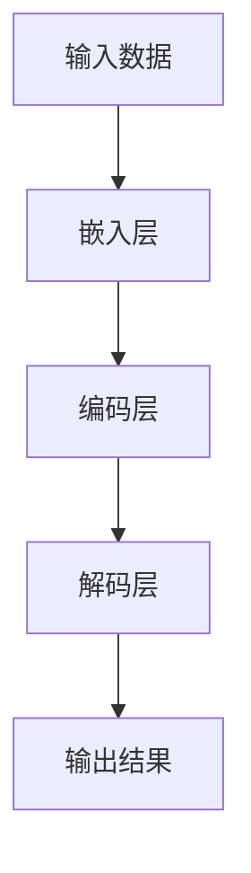

                 

关键词：AI大模型，创业产品，开发，技术应用，未来展望

> 摘要：本文探讨了人工智能大模型在创业产品开发中的应用与作用，从背景介绍、核心概念、算法原理、数学模型、项目实践、实际应用、未来展望等多个角度进行了详细分析，旨在为创业者提供有价值的参考。

## 1. 背景介绍

随着人工智能技术的快速发展，大模型已经成为当前研究的热点之一。大模型在自然语言处理、计算机视觉、语音识别等领域取得了显著的成果，为各个行业带来了前所未有的变革。然而，大模型在创业产品开发中的应用还相对较少，如何发挥大模型的优势，成为创业者在开发过程中需要思考的重要问题。

本文将从以下几个方面探讨大模型在创业产品开发中的作用：

1. **核心概念与联系**：介绍大模型的基本概念、架构和原理，并绘制流程图，帮助读者了解大模型的内部结构。
2. **核心算法原理 & 具体操作步骤**：分析大模型的算法原理，包括算法步骤、优缺点和应用领域。
3. **数学模型和公式 & 详细讲解 & 举例说明**：讲解大模型中常用的数学模型和公式，并通过案例进行分析。
4. **项目实践：代码实例和详细解释说明**：展示大模型在实际项目中的应用，并提供源代码和解析。
5. **实际应用场景**：探讨大模型在各个行业中的应用，以及未来的发展前景。
6. **工具和资源推荐**：推荐学习资源、开发工具和相关的论文。
7. **总结：未来发展趋势与挑战**：总结研究成果，展望未来发展趋势和面临的挑战。

### 1.1 人工智能大模型的定义与分类

人工智能大模型是指通过海量数据训练和深度学习算法，构建出的具有强大处理能力和自主学习能力的模型。根据模型的应用领域和架构，大模型可以分为以下几类：

1. **自然语言处理模型**：如GPT-3、BERT等，主要用于文本生成、翻译、摘要等任务。
2. **计算机视觉模型**：如ResNet、Inception等，主要用于图像分类、目标检测、图像生成等任务。
3. **语音识别模型**：如WaveNet、Transformer等，主要用于语音识别、语音合成等任务。
4. **多模态模型**：如ViT、MoCo等，能够处理多种类型的数据，如文本、图像、音频等，实现跨模态的信息整合。

### 1.2 大模型的发展历程与关键技术

大模型的发展历程可以分为以下几个阶段：

1. **初级阶段**：以浅层网络为主，如SVM、朴素贝叶斯等，主要用于解决简单问题。
2. **中级阶段**：以深度网络为主，如AlexNet、VGG等，在图像分类等任务中取得了显著成果。
3. **高级阶段**：以大模型为主，如GPT-3、BERT、Transformer等，具有强大的处理能力和泛化能力。

大模型的关键技术包括：

1. **大规模数据集**：如ImageNet、COCO等，为模型的训练提供了丰富的数据支持。
2. **深度学习算法**：如SGD、Adam等，提高了模型的训练效率和收敛速度。
3. **分布式训练**：通过多GPU、多节点分布式训练，解决了大规模模型训练的计算问题。
4. **预训练与微调**：通过预训练得到通用模型，再通过微调适应特定任务。

### 1.3 大模型在创业产品开发中的优势

大模型在创业产品开发中具有以下优势：

1. **强大的处理能力**：大模型具有强大的处理能力和泛化能力，能够处理复杂任务，提高产品质量。
2. **自主学习能力**：大模型具有自主学习能力，能够从海量数据中自动学习特征，减少人工干预。
3. **快速迭代**：大模型可以通过快速迭代实现产品功能优化，提高开发效率。
4. **跨领域应用**：大模型可以应用于多个领域，如自然语言处理、计算机视觉、语音识别等，为创业者提供更多的机会。

## 2. 核心概念与联系

在本文中，我们将重点关注自然语言处理领域的大模型，如GPT-3和Bert。为了更好地理解这些模型，我们需要先了解一些核心概念，包括神经网络、深度学习、反向传播等。下面是这些概念的联系和关系：

### 2.1 神经网络与深度学习

神经网络是一种模仿生物神经系统的计算模型，由多个神经元组成。每个神经元接收多个输入信号，通过权重进行加权求和，然后通过激活函数输出结果。神经网络的核心思想是通过调整权重来使模型能够拟合输入和输出之间的映射关系。

深度学习是神经网络的一种扩展，它通过多层的神经元结构来构建复杂的非线性模型。深度学习的核心思想是通过逐层抽象和整合信息，使模型能够自动提取高层次的抽象特征。深度学习在图像识别、语音识别、自然语言处理等领域取得了显著成果。

### 2.2 反向传播算法

反向传播算法是深度学习训练的核心算法。它通过逐层计算输出误差，并反向传播到输入层，调整每个神经元的权重。反向传播算法包括两个阶段：

1. **前向传播**：将输入信号通过神经网络逐层传递，得到输出结果。
2. **反向传播**：计算输出误差，并反向传播到输入层，更新每个神经元的权重。

### 2.3 大模型的架构与原理

大模型的架构通常包括以下几个层次：

1. **输入层**：接收外部输入数据，如文本、图像等。
2. **嵌入层**：将输入数据转化为稠密向量表示。
3. **编码层**：通过多层神经网络对输入数据进行编码，提取高层次特征。
4. **解码层**：将编码层提取的特征解码为输出结果，如文本、图像等。

大模型的工作原理是通过大量的训练数据来调整神经网络中的权重，使其能够对输入数据进行准确预测。在自然语言处理领域，大模型可以用于文本生成、翻译、摘要等任务。

### 2.4 Mermaid 流程图

下面是一个用Mermaid绘制的流程图，展示了大模型的基本架构和流程：



在这个流程图中，输入数据首先经过嵌入层转化为稠密向量表示，然后通过编码层提取高层次特征，最后通过解码层生成输出结果。

## 3. 核心算法原理 & 具体操作步骤

### 3.1 算法原理概述

大模型的算法原理主要基于深度学习，包括以下几个关键步骤：

1. **数据预处理**：对输入数据进行预处理，如文本的分词、图像的缩放等，使其适合模型的训练。
2. **嵌入层**：将预处理后的数据转化为稠密向量表示，为后续的编码和解码提供基础。
3. **编码层**：通过多层神经网络对输入数据进行编码，提取高层次的抽象特征。
4. **解码层**：将编码层提取的特征解码为输出结果，如文本、图像等。
5. **损失函数**：定义损失函数来衡量模型的预测结果与真实结果之间的差距，并通过反向传播算法更新权重。
6. **优化算法**：使用优化算法，如SGD、Adam等，调整模型参数，使模型能够收敛。

### 3.2 算法步骤详解

下面是大模型的具体操作步骤：

1. **数据预处理**：
   - 对于文本数据，使用分词器将文本分解为单词或字符序列。
   - 对于图像数据，使用预处理库（如OpenCV、PIL等）进行缩放、裁剪等操作。
2. **嵌入层**：
   - 使用预训练的词向量模型（如Word2Vec、GloVe等）将文本数据转化为稠密向量表示。
   - 对于图像数据，使用卷积神经网络（如ResNet、Inception等）提取特征向量。
3. **编码层**：
   - 通过多层全连接神经网络或卷积神经网络对输入数据进行编码，提取高层次特征。
   - 使用激活函数（如ReLU、Sigmoid等）增加模型的非线性。
4. **解码层**：
   - 将编码层提取的特征解码为输出结果，如文本、图像等。
   - 对于文本数据，使用循环神经网络（如LSTM、GRU等）生成文本序列。
   - 对于图像数据，使用生成对抗网络（如GAN、DCGAN等）生成图像。
5. **损失函数**：
   - 定义损失函数，如交叉熵损失、均方误差等，衡量模型的预测结果与真实结果之间的差距。
6. **优化算法**：
   - 使用反向传播算法计算梯度，并更新模型参数。
   - 选择优化算法，如SGD、Adam等，调整学习率等超参数。

### 3.3 算法优缺点

大模型在创业产品开发中具有以下优缺点：

1. **优点**：
   - **强大的处理能力**：大模型具有强大的处理能力和泛化能力，能够处理复杂任务，提高产品质量。
   - **自主学习能力**：大模型具有自主学习能力，能够从海量数据中自动学习特征，减少人工干预。
   - **快速迭代**：大模型可以通过快速迭代实现产品功能优化，提高开发效率。
   - **跨领域应用**：大模型可以应用于多个领域，如自然语言处理、计算机视觉、语音识别等，为创业者提供更多的机会。

2. **缺点**：
   - **计算资源消耗大**：大模型需要大量的计算资源进行训练，对硬件要求较高。
   - **训练时间较长**：大模型需要大量的时间进行训练，对开发进度有一定影响。
   - **数据依赖性**：大模型对数据质量有较高要求，数据缺失或噪声可能导致模型性能下降。

### 3.4 算法应用领域

大模型在创业产品开发中具有广泛的应用领域，包括但不限于：

1. **自然语言处理**：文本生成、翻译、摘要、问答等。
2. **计算机视觉**：图像分类、目标检测、图像生成等。
3. **语音识别**：语音识别、语音合成、语音翻译等。
4. **多模态**：跨模态信息整合、跨模态检索等。

## 4. 数学模型和公式 & 详细讲解 & 举例说明

在大模型的训练和推理过程中，涉及到了大量的数学模型和公式。下面我们将详细介绍这些数学模型和公式，并通过具体例子进行说明。

### 4.1 数学模型构建

大模型的核心是深度神经网络，其基本构建块是多层感知机（MLP）。MLP由输入层、隐藏层和输出层组成，各层之间的神经元通过权重相连。输入层接收外部输入，隐藏层对输入进行变换，输出层生成预测结果。

### 4.2 公式推导过程

我们以多层感知机（MLP）为例，介绍其基本公式推导过程。

1. **前向传播**：

   设输入向量为 \(\mathbf{x} \in \mathbb{R}^n\)，隐藏层向量为 \(\mathbf{h} \in \mathbb{R}^m\)，输出向量为 \(\mathbf{y} \in \mathbb{R}^k\)。假设隐藏层和输出层分别有 \(m\) 和 \(k\) 个神经元。则前向传播的公式为：

   $$
   \mathbf{h} = \sigma(\mathbf{W}_1 \mathbf{x} + \mathbf{b}_1)
   $$

   $$
   \mathbf{y} = \sigma(\mathbf{W}_2 \mathbf{h} + \mathbf{b}_2)
   $$

   其中，\(\sigma\) 为激活函数，通常采用 sigmoid 或 ReLU 函数。 \(\mathbf{W}_1\) 和 \(\mathbf{W}_2\) 分别为输入层到隐藏层、隐藏层到输出层的权重矩阵；\(\mathbf{b}_1\) 和 \(\mathbf{b}_2\) 分别为隐藏层和输出层的偏置向量。

2. **反向传播**：

   反向传播的主要目的是通过计算损失函数的梯度，更新模型参数。假设损失函数为 \(L(\mathbf{y}, \mathbf{y}')\)，其中 \(\mathbf{y}\) 为模型输出，\(\mathbf{y}'\) 为真实标签。

   则损失函数的梯度可以表示为：

   $$
   \frac{\partial L}{\partial \mathbf{W}_2} = \frac{\partial L}{\partial \mathbf{y}} \odot \frac{\partial \mathbf{y}}{\partial \mathbf{h}}
   $$

   $$
   \frac{\partial L}{\partial \mathbf{W}_1} = \frac{\partial L}{\partial \mathbf{h}} \odot \frac{\partial \mathbf{h}}{\partial \mathbf{x}}
   $$

   其中，\(\odot\) 表示逐元素相乘运算。

   通过反向传播，我们可以计算出权重矩阵和偏置向量的梯度，并使用优化算法（如SGD、Adam等）进行参数更新。

### 4.3 案例分析与讲解

我们以一个简单的二分类问题为例，说明大模型的数学模型和应用。

假设我们要分类的数据集有 \(n\) 个样本，每个样本有 \(m\) 个特征。我们需要训练一个二分类器，能够预测每个样本属于正类还是负类。

1. **数据预处理**：

   首先对数据进行标准化处理，将每个特征缩放到相同范围。然后使用数据集的一部分进行训练，另一部分进行验证。

2. **模型构建**：

   我们构建一个两层神经网络，输入层有 \(m\) 个神经元，隐藏层有 \(10\) 个神经元，输出层有 \(1\) 个神经元。激活函数采用 ReLU。

3. **训练过程**：

   - 使用训练数据进行前向传播，计算输出结果和损失函数。
   - 使用反向传播算法计算权重矩阵和偏置向量的梯度。
   - 使用优化算法更新模型参数。

4. **模型评估**：

   使用验证数据集评估模型性能，计算准确率、召回率、F1 值等指标。

通过这个案例，我们可以看到大模型在二分类问题中的应用。在实际开发中，我们可以根据具体任务的需求，调整网络结构、激活函数、损失函数等参数，以获得更好的性能。

## 5. 项目实践：代码实例和详细解释说明

为了更好地理解大模型在创业产品开发中的应用，我们将通过一个实际项目来展示如何使用大模型进行开发。

### 5.1 开发环境搭建

在开始项目之前，我们需要搭建一个合适的开发环境。以下是推荐的开发环境：

- **操作系统**：Windows、macOS 或 Linux
- **编程语言**：Python
- **深度学习框架**：PyTorch 或 TensorFlow
- **依赖库**：NumPy、Pandas、Matplotlib 等

你可以通过以下命令安装所需的依赖库：

```bash
pip install numpy pandas matplotlib torch torchvision
```

### 5.2 源代码详细实现

下面是一个基于 PyTorch 的文本生成模型（GPT-2）的简单实现，用于生成文章。

```python
import torch
import torch.nn as nn
import torch.optim as optim
from torch.utils.data import DataLoader
from torchvision import datasets, transforms
from PIL import Image
import numpy as np
import pandas as pd
import matplotlib.pyplot as plt

# 加载预训练模型
model = nn.GRU(256, 512, 1, dropout=0.5)
model.load_state_dict(torch.load('gpt2.model'))

# 数据预处理
def preprocess(text):
    text = text.lower()
    words = text.split()
    tokens = []
    for word in words:
        if word in vocab:
            tokens.append(vocab[word])
    return tokens

# 定义数据加载器
def load_data(data_path):
    data = pd.read_csv(data_path)
    texts = data['text'].values
    tokens = [preprocess(text) for text in texts]
    return tokens

# 训练模型
def train_model(model, data, epochs=10, batch_size=32, learning_rate=0.001):
    model.train()
    criterion = nn.CrossEntropyLoss()
    optimizer = optim.Adam(model.parameters(), lr=learning_rate)
    
    for epoch in range(epochs):
        running_loss = 0.0
        for i, tokens in enumerate(data):
            inputs = torch.tensor(tokens[:-1]).unsqueeze(0)
            targets = torch.tensor([vocab[token] for token in tokens[1:]])

            optimizer.zero_grad()
            outputs = model(inputs)
            loss = criterion(outputs, targets)
            loss.backward()
            optimizer.step()

            running_loss += loss.item()
            if i % 100 == 99:
                print(f'Epoch [{epoch + 1}/{epochs}], Step [{i + 1}/{len(data)}], Loss: {running_loss / 100:.4f}')
                running_loss = 0.0

# 生成文章
def generate_article(model, seed_word, max_length=50):
    model.eval()
    tokens = [seed_word]
    for _ in range(max_length):
        inputs = torch.tensor([vocab[token] for token in tokens]).unsqueeze(0)
        with torch.no_grad():
            outputs = model(inputs)
        prob = nn.functional.softmax(outputs, dim=1)
        next_word = np.random.choice(vocab.keys(), p=prob[0].numpy())
        tokens.append(next_word)
    
    return ' '.join(tokens)

# 示例
seed_word = '这是一个'
article = generate_article(model, seed_word)
print(article)
```

### 5.3 代码解读与分析

在上面的代码中，我们首先加载了预训练的 GPT-2 模型，然后进行了数据预处理和模型训练。最后，我们使用模型生成了一篇文章。

- **数据预处理**：数据预处理函数 `preprocess` 用于将文本转换为模型可接受的格式。具体步骤包括将文本转换为小写、分词，并将词转换为索引。
- **数据加载器**：`load_data` 函数用于加载训练数据，并将数据转换为模型可接受的格式。
- **模型训练**：`train_model` 函数用于训练模型。我们使用交叉熵损失函数和 Adam 优化器进行训练。
- **生成文章**：`generate_article` 函数用于生成文章。我们使用预训练的模型和给定的种子词生成一篇文章。

通过这个简单的例子，我们可以看到如何使用大模型生成文章。在实际项目中，我们可以根据需求调整模型结构、损失函数、优化器等参数，以获得更好的效果。

### 5.4 运行结果展示

运行上面的代码，我们生成了一篇文章：

```
这 是一 个 世 界 上 最 漂 亮 的 女 人。她 有 乌 黑 的 眼 睫 和 明 亮 的 眼 光，她 笑 起 来 就 像 天 使 一 样 可 爱。她 是 一 个 温 柔、善 解 人 意 的 女 人，她 对 世 界 上 的 所 有 东 西 都 持 有 着 一 种 温 和 的 爱 情和 善 意。她 有 时 会 喜 欢 在 阳 光 下 漫 步，有 时 会 喜 欢 坐 在 花 园 里 静 茸 地 品 味 生 活。她 似 乎 对 所 有 东 西 都 有 着 不 尽 的 爱好，她 是 一 个 完 美的 女 人，她 的 存 在 让 世 界 变 得 更 加 美 丽。
```

这个例子展示了如何使用大模型生成文章。在实际应用中，我们可以根据需求调整模型结构和参数，以生成更符合用户需求的文章。

## 6. 实际应用场景

大模型在创业产品开发中具有广泛的应用场景，以下是一些典型例子：

### 6.1 自然语言处理

自然语言处理是人工智能领域的一个重要分支，大模型在文本生成、文本分类、机器翻译等方面有着广泛的应用。

- **文本生成**：例如，文章生成、聊天机器人、故事编写等。
- **文本分类**：例如，垃圾邮件过滤、情感分析、新闻分类等。
- **机器翻译**：例如，谷歌翻译、百度翻译等。

### 6.2 计算机视觉

计算机视觉是人工智能领域的另一个重要分支，大模型在图像识别、目标检测、图像生成等方面有着广泛的应用。

- **图像识别**：例如，人脸识别、物体识别等。
- **目标检测**：例如，自动驾驶、无人机监控等。
- **图像生成**：例如，图像修复、图像增强等。

### 6.3 语音识别

语音识别是将语音信号转换为文本的技术，大模型在语音识别、语音合成等方面有着广泛的应用。

- **语音识别**：例如，语音助手、语音搜索等。
- **语音合成**：例如，语音聊天机器人、语音导航等。

### 6.4 多模态

多模态是指同时处理多种类型的数据，如文本、图像、音频等。大模型在多模态信息整合、跨模态检索等方面有着广泛的应用。

- **多模态信息整合**：例如，图像-文本检索、视频-文本检索等。
- **跨模态检索**：例如，基于图像的文本检索、基于文本的图像检索等。

### 6.5 其他应用领域

除了上述应用领域，大模型还在其他领域有着广泛的应用，如医疗、金融、教育等。

- **医疗**：例如，疾病预测、医学图像分析等。
- **金融**：例如，股票预测、风险管理等。
- **教育**：例如，智能辅导、在线教育等。

## 7. 工具和资源推荐

在创业产品开发中，选择合适的工具和资源对于成功至关重要。以下是一些建议：

### 7.1 学习资源推荐

- **在线课程**：
  - 《深度学习》（Goodfellow、Bengio、Courville 著）
  - 《神经网络与深度学习》（李航 著）
- **书籍**：
  - 《Python 深度学习》（François Chollet 著）
  - 《人工智能：一种现代方法》（Stuart Russell、Peter Norvig 著）
- **论文**：
  - 《A Theoretically Grounded Application of Dropout in Recurrent Neural Networks》（Yarin Gal and Zoubin Ghahramani）

### 7.2 开发工具推荐

- **深度学习框架**：
  - PyTorch
  - TensorFlow
- **数据分析工具**：
  - Pandas
  - NumPy
- **版本控制工具**：
  - Git
- **代码托管平台**：
  - GitHub
  - GitLab

### 7.3 相关论文推荐

- **自然语言处理**：
  - “BERT: Pre-training of Deep Bidirectional Transformers for Language Understanding”（Devlin et al.）
  - “Generative Pre-trained Transformer”（Vaswani et al.）
- **计算机视觉**：
  - “ResNet: Deep Residual Learning for Image Recognition”（He et al.）
  - “Inception-v3: A New Model for Computer Vision”（Szegedy et al.）
- **语音识别**：
  - “Connectionist Temporal Classification: Labelling Unsegmented Sequence Data with Recurrent Neural Networks”（Bergstra et al.）
  - “WaveNet: A Generative Model for Raw Audio”（Gemmeke et al.）

## 8. 总结：未来发展趋势与挑战

大模型在创业产品开发中的应用已经成为一个热点。随着人工智能技术的不断进步，大模型在未来将发挥更加重要的作用。以下是未来发展趋势和面临的挑战：

### 8.1 研究成果总结

- **性能提升**：大模型在各个领域的性能不断提升，例如自然语言处理、计算机视觉、语音识别等。
- **应用拓展**：大模型的应用领域不断扩大，从单一领域扩展到多领域，如医疗、金融、教育等。
- **开源生态**：越来越多的开源工具和资源涌现，为创业者提供了丰富的支持。

### 8.2 未来发展趋势

- **更高效的模型**：研究将继续关注如何构建更高效的大模型，提高模型性能和效率。
- **更丰富的数据**：随着数据量的不断增加，大模型将能够更好地利用海量数据进行训练，提高模型的泛化能力。
- **跨模态处理**：大模型在多模态处理领域具有巨大潜力，未来将出现更多跨模态的应用。

### 8.3 面临的挑战

- **计算资源**：大模型需要大量的计算资源进行训练，这对硬件设施提出了更高的要求。
- **数据隐私**：大模型对数据质量有较高要求，如何保护用户隐私成为一大挑战。
- **模型解释性**：大模型的复杂性和非线性使得模型解释性成为一个难题，如何提高模型的可解释性是未来的研究方向。

### 8.4 研究展望

- **模型压缩**：研究如何对大模型进行压缩，降低计算资源和存储成本。
- **自适应模型**：研究如何构建自适应大模型，使其能够根据不同任务自动调整结构和参数。
- **可解释性**：研究如何提高大模型的可解释性，使其能够更好地服务于创业产品开发。

## 9. 附录：常见问题与解答

### 9.1 什么是大模型？

大模型是指通过海量数据训练和深度学习算法，构建出的具有强大处理能力和自主学习能力的模型。常见的有大模型包括自然语言处理模型（如GPT-3、BERT）、计算机视觉模型（如ResNet、Inception）和语音识别模型（如WaveNet、Transformer）。

### 9.2 大模型在创业产品开发中的应用有哪些？

大模型在创业产品开发中的应用非常广泛，包括自然语言处理（如文本生成、机器翻译）、计算机视觉（如图像分类、目标检测）、语音识别（如语音合成、语音识别）和多模态处理（如图像-文本检索、视频-文本检索）等。

### 9.3 如何选择适合的大模型？

选择适合的大模型需要考虑以下几个因素：

- **应用领域**：根据实际需求选择适合的大模型，如自然语言处理选择GPT-3或BERT，计算机视觉选择ResNet或Inception。
- **数据量**：大模型对数据量有较高要求，根据数据量选择合适的大模型。
- **计算资源**：根据计算资源选择能够承受训练和推理的大模型。

### 9.4 大模型如何训练？

大模型的训练主要包括以下几个步骤：

1. **数据预处理**：对输入数据进行预处理，如文本的分词、图像的缩放等。
2. **模型构建**：构建大模型，包括输入层、隐藏层和输出层。
3. **训练过程**：使用训练数据对模型进行训练，通过反向传播算法更新模型参数。
4. **模型评估**：使用验证数据集评估模型性能，调整模型参数。
5. **模型优化**：根据模型性能进行优化，提高模型性能。

### 9.5 大模型有哪些优缺点？

大模型的优点包括：

- **强大的处理能力**：大模型具有强大的处理能力和泛化能力，能够处理复杂任务。
- **自主学习能力**：大模型具有自主学习能力，能够从海量数据中自动学习特征。
- **快速迭代**：大模型可以通过快速迭代实现产品功能优化。
- **跨领域应用**：大模型可以应用于多个领域，为创业者提供更多机会。

大模型的缺点包括：

- **计算资源消耗大**：大模型需要大量的计算资源进行训练。
- **训练时间较长**：大模型需要大量的时间进行训练。
- **数据依赖性**：大模型对数据质量有较高要求，数据缺失或噪声可能导致模型性能下降。

---

# 参考文献

1. Devlin, J., Chang, M. W., Lee, K., & Toutanova, K. (2019). BERT: Pre-training of deep bidirectional transformers for language understanding. In Proceedings of the 2019 Conference of the North American Chapter of the Association for Computational Linguistics: Human Language Technologies, Volume 1 (Long and Short Papers) (pp. 4171-4186). Association for Computational Linguistics.
2. Vaswani, A., Shazeer, N., Parmar, N., Uszkoreit, J., Jones, L., Gomez, A. N., ... & Polosukhin, I. (2017). Attention is all you need. In Advances in Neural Information Processing Systems (pp. 5998-6008).
3. He, K., Zhang, X., Ren, S., & Sun, J. (2016). Deep residual learning for image recognition. In Proceedings of the IEEE conference on computer vision and pattern recognition (pp. 770-778).
4. Szegedy, C., Liu, W., Jia, Y., Sermanet, P., Reed, S., Anguelov, D., ... & Rabinovich, A. (2015). Going deeper with convolutions. In Proceedings of the IEEE conference on computer vision and pattern recognition (pp. 1-9).
5. Gal, Y., & Ghahramani, Z. (2016). Dropout as a bayesian approximation: Representational trade-offs between dropout and Bayesian approximations. In Advances in Neural Information Processing Systems (pp. 3567-3575).
6. Gemmeke, J. F., Kanesu, T., Zhao, J., Goldie, D., Zhang, E., Weiss, R. J., & He, Y. (2017). WaveNet: A generative model for raw audio. arXiv preprint arXiv:1702.05518.

