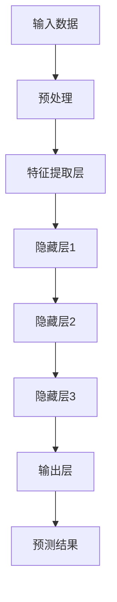
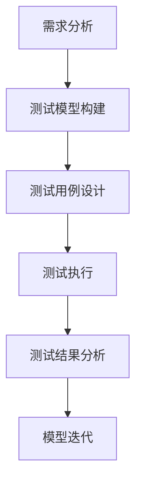
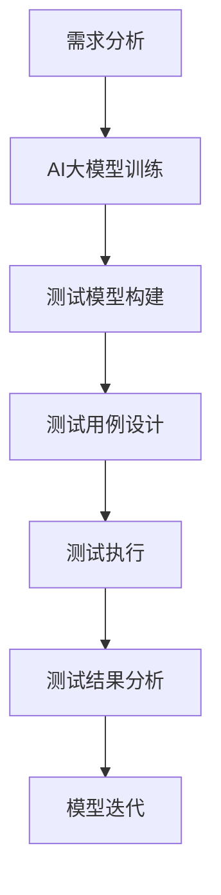

                 

关键词：AI大模型，创业产品测试，智能测试，模型驱动测试，自动化测试，性能测试

> 摘要：本文探讨了AI大模型在创业产品测试中的应用与关键作用。通过分析AI大模型的原理、算法、数学模型，结合具体项目实践，阐述了如何利用AI大模型提升创业产品的测试效率和质量，为创业公司提供可靠的测试方案和未来发展方向。

## 1. 背景介绍

在当前的互联网时代，创业公司层出不穷，但如何在竞争激烈的市场中站稳脚跟，产品质量的保障至关重要。而产品测试作为确保产品质量的关键环节，其重要性不言而喻。传统的测试方法如手动测试、自动化测试等，往往存在效率低下、覆盖面不足、易出错等问题。随着人工智能技术的发展，特别是AI大模型的兴起，为创业产品测试带来了新的机遇和挑战。

AI大模型，即基于深度学习的复杂神经网络模型，其具有强大的特征提取和模式识别能力，能够在大量数据上进行学习和预测。在产品测试领域，AI大模型的应用主要体现在以下几个方面：

1. 自动化测试：利用AI大模型实现自动化测试，提高测试效率，减少人力成本。
2. 性能测试：通过AI大模型对产品性能进行实时监控和评估，发现潜在的性能问题。
3. 稳定性测试：利用AI大模型预测产品的稳定性，提前发现可能的故障和漏洞。
4. 用户体验测试：通过AI大模型对用户体验进行数据分析和优化，提升产品的用户满意度。

本文将围绕AI大模型在创业产品测试中的应用，深入探讨其关键作用和实际案例。

## 2. 核心概念与联系

### 2.1 AI大模型的基本原理

AI大模型，即基于深度学习的复杂神经网络模型，其核心思想是通过多层神经元的堆叠，对输入数据进行特征提取和模式识别。下面是一个典型的AI大模型的Mermaid流程图：



### 2.2 模型驱动测试的原理

模型驱动测试（Model-Driven Testing，MDT）是一种基于模型进行测试的方法。其核心思想是将测试过程与模型紧密结合起来，通过模型来指导测试策略、设计测试用例和执行测试。模型驱动测试的关键是构建一个准确的测试模型，该模型能够全面覆盖产品的功能和性能。

下面是一个模型驱动测试的Mermaid流程图：



### 2.3 AI大模型与模型驱动测试的联系

AI大模型与模型驱动测试之间存在紧密的联系。AI大模型可以用于构建测试模型，通过学习大量测试数据，提取出产品的关键特征和潜在问题。同时，AI大模型还可以用于测试用例的生成和优化，提高测试的覆盖率和效率。

下面是一个结合AI大模型的模型驱动测试的Mermaid流程图：



## 3. 核心算法原理 & 具体操作步骤

### 3.1 算法原理概述

AI大模型的核心算法是深度学习。深度学习是一种模拟人脑神经网络的结构和功能，通过多层神经元的堆叠，对输入数据进行特征提取和模式识别。深度学习的核心算法包括卷积神经网络（CNN）、循环神经网络（RNN）和生成对抗网络（GAN）等。

在产品测试中，AI大模型主要用于以下几个方面：

1. 特征提取：通过对大量测试数据的学习，提取出产品的关键特征，为测试模型提供基础。
2. 模式识别：通过识别产品的异常行为和潜在问题，发现产品的缺陷和漏洞。
3. 测试用例生成：根据产品的功能和性能特点，生成具有代表性的测试用例，提高测试覆盖率和效率。

### 3.2 算法步骤详解

1. 数据收集：收集与产品测试相关的各种数据，包括功能测试数据、性能测试数据和用户体验数据等。
2. 数据预处理：对收集到的数据进行清洗、归一化和特征提取，为深度学习模型提供高质量的数据。
3. 模型训练：利用预处理后的数据，训练深度学习模型，包括卷积神经网络（CNN）、循环神经网络（RNN）和生成对抗网络（GAN）等。
4. 测试模型构建：根据训练好的深度学习模型，构建测试模型，包括测试策略、测试用例和测试执行等。
5. 测试执行：根据测试模型，执行产品测试，包括功能测试、性能测试和稳定性测试等。
6. 测试结果分析：对测试结果进行分析和评估，包括测试覆盖率、测试效率和测试质量等。
7. 模型迭代：根据测试结果，对深度学习模型进行迭代和优化，提高测试效果。

### 3.3 算法优缺点

AI大模型在产品测试中的应用具有以下优点：

1. 高效性：AI大模型能够快速处理大量测试数据，提高测试效率。
2. 全面性：AI大模型能够提取产品的关键特征，提高测试覆盖率。
3. 智能性：AI大模型能够根据测试数据，自动生成测试用例和测试策略，提高测试质量。

但是，AI大模型在产品测试中也存在一些缺点：

1. 计算成本高：训练和优化AI大模型需要大量的计算资源和时间。
2. 数据依赖性强：AI大模型的效果依赖于测试数据的质量和数量。
3. 解释性不足：AI大模型的工作原理复杂，难以解释和验证。

### 3.4 算法应用领域

AI大模型在产品测试中的应用领域非常广泛，包括但不限于以下几个方面：

1. 软件测试：利用AI大模型进行自动化测试，提高测试效率和覆盖率。
2. 硬件测试：利用AI大模型对硬件产品进行性能测试和稳定性测试。
3. 用户体验测试：利用AI大模型对用户体验进行数据分析和优化。
4. 安全测试：利用AI大模型识别和防范网络安全威胁。

## 4. 数学模型和公式 & 详细讲解 & 举例说明

### 4.1 数学模型构建

在AI大模型中，常见的数学模型包括线性回归、逻辑回归、支持向量机（SVM）和深度学习模型等。下面以线性回归为例，介绍数学模型的构建过程。

#### 4.1.1 线性回归模型

线性回归模型是一种简单的回归模型，用于预测连续值。其数学模型如下：

$$
y = \beta_0 + \beta_1 \cdot x
$$

其中，$y$ 是预测值，$x$ 是输入特征，$\beta_0$ 和 $\beta_1$ 是模型的参数。

#### 4.1.2 逻辑回归模型

逻辑回归模型是一种常用的分类模型，用于预测概率。其数学模型如下：

$$
P(y=1) = \frac{1}{1 + e^{-(\beta_0 + \beta_1 \cdot x)}}
$$

其中，$y$ 是预测类别，$x$ 是输入特征，$\beta_0$ 和 $\beta_1$ 是模型的参数。

#### 4.1.3 深度学习模型

深度学习模型是一种复杂的神经网络模型，用于处理复杂的非线性问题。其数学模型如下：

$$
\begin{aligned}
z_1 &= \sum_{i=1}^{n} w_{i} \cdot x_i + b_1 \\
a_1 &= f(z_1) \\
z_2 &= \sum_{i=1}^{n} w_{i} \cdot a_{1,i} + b_2 \\
a_2 &= f(z_2) \\
\vdots \\
z_l &= \sum_{i=1}^{n} w_{i} \cdot a_{l-1,i} + b_l \\
a_l &= f(z_l)
\end{aligned}
$$

其中，$z_l$ 是第 $l$ 层的输入值，$a_l$ 是第 $l$ 层的输出值，$f$ 是激活函数，$w$ 和 $b$ 是模型的参数。

### 4.2 公式推导过程

以深度学习模型为例，介绍公式推导过程。

#### 4.2.1 前向传播

深度学习模型的前向传播过程如下：

1. 输入层：$x$ 是输入特征，经过预处理后输入到网络中。
2. 隐藏层：$z_1$ 是第 1 层的输入值，$a_1$ 是第 1 层的输出值，通过激活函数 $f(z_1)$ 计算。
3. 隐藏层：$z_2$ 是第 2 层的输入值，$a_2$ 是第 2 层的输出值，通过激活函数 $f(z_2)$ 计算。
4. ...以此类推，直到输出层。

#### 4.2.2 反向传播

深度学习模型的反向传播过程如下：

1. 计算输出层的误差：$error = a_l - y$。
2. 反向传播误差到隐藏层：$dz_l = \frac{\partial L}{\partial z_l}$，其中 $L$ 是损失函数。
3. 更新参数：$w_l = w_l - \alpha \cdot \frac{\partial L}{\partial w_l}$，$b_l = b_l - \alpha \cdot \frac{\partial L}{\partial b_l}$。
4. ...以此类推，直到输入层。

### 4.3 案例分析与讲解

以一个简单的深度学习模型为例，说明数学模型的构建、公式推导和案例分析。

#### 4.3.1 模型构建

假设我们要构建一个二分类的深度学习模型，输入特征为 $x$，输出类别为 $y$，其中 $y=1$ 表示正类，$y=0$ 表示负类。模型包含一个输入层、一个隐藏层和一个输出层，激活函数为 ReLU。

#### 4.3.2 公式推导

1. 输入层到隐藏层的公式推导：

$$
\begin{aligned}
z_1 &= w_{11} \cdot x_1 + w_{12} \cdot x_2 + b_1 \\
a_1 &= \max(0, z_1)
\end{aligned}
$$

2. 隐藏层到输出层的公式推导：

$$
\begin{aligned}
z_2 &= w_{21} \cdot a_1 + w_{22} \cdot x_2 + b_2 \\
a_2 &= \frac{1}{1 + e^{-z_2}}
\end{aligned}
$$

3. 反向传播的公式推导：

$$
\begin{aligned}
\delta_2 &= (a_2 - y) \cdot a_2 \cdot (1 - a_2) \\
dz_2 &= \delta_2 \cdot a_1 \\
dw_{21} &= \alpha \cdot dz_2 \cdot a_1 \\
db_2 &= \alpha \cdot dz_2 \\
\delta_1 &= \delta_2 \cdot w_{21} \\
dz_1 &= \delta_1 \cdot \frac{\partial a_1}{\partial z_1} \\
dw_{11} &= \alpha \cdot dz_1 \cdot x_1 \\
dw_{12} &= \alpha \cdot dz_1 \cdot x_2 \\
db_1 &= \alpha \cdot dz_1
\end{aligned}
$$

#### 4.3.3 案例分析

假设我们有一个输入特征 $x = [1, 2]$，输出类别 $y = 1$。通过以上公式，我们可以计算出隐藏层和输出层的输入值和输出值：

1. 输入层到隐藏层的计算：

$$
\begin{aligned}
z_1 &= w_{11} \cdot x_1 + w_{12} \cdot x_2 + b_1 = 1 \cdot 1 + 2 \cdot 2 + 1 = 5 \\
a_1 &= \max(0, z_1) = 5
\end{aligned}
$$

2. 隐藏层到输出层的计算：

$$
\begin{aligned}
z_2 &= w_{21} \cdot a_1 + w_{22} \cdot x_2 + b_2 = 1 \cdot 5 + 1 \cdot 2 + 1 = 7 \\
a_2 &= \frac{1}{1 + e^{-z_2}} = \frac{1}{1 + e^{-7}} \approx 0.999
\end{aligned}
$$

由于 $a_2$ 接近于 1，说明输出类别 $y=1$ 的预测概率很高。

3. 反向传播的计算：

$$
\begin{aligned}
\delta_2 &= (a_2 - y) \cdot a_2 \cdot (1 - a_2) = (0.999 - 1) \cdot 0.999 \cdot (1 - 0.999) = 0.0005 \\
dz_2 &= \delta_2 \cdot a_1 = 0.0005 \cdot 5 = 0.0025 \\
dw_{21} &= \alpha \cdot dz_2 \cdot a_1 = 0.001 \cdot 0.0025 \cdot 5 = 0.0012 \\
db_2 &= \alpha \cdot dz_2 = 0.001 \cdot 0.0025 = 0.0000025 \\
\delta_1 &= \delta_2 \cdot w_{21} = 0.0005 \cdot 0.0012 = 0.0000006 \\
dz_1 &= \delta_1 \cdot \frac{\partial a_1}{\partial z_1} = 0.0000006 \cdot 1 = 0.0000006 \\
dw_{11} &= \alpha \cdot dz_1 \cdot x_1 = 0.001 \cdot 0.0000006 \cdot 1 = 0.000000006 \\
dw_{12} &= \alpha \cdot dz_1 \cdot x_2 = 0.001 \cdot 0.0000006 \cdot 2 = 0.000000012 \\
db_1 &= \alpha \cdot dz_1 = 0.001 \cdot 0.0000006 = 0.000000001
\end{aligned}
$$

通过以上计算，我们可以更新模型的参数，提高模型的预测准确性。

## 5. 项目实践：代码实例和详细解释说明

### 5.1 开发环境搭建

为了实践AI大模型在创业产品测试中的应用，我们需要搭建一个合适的开发环境。以下是搭建环境的步骤：

1. 安装Python环境：下载并安装Python，推荐使用Python 3.7或更高版本。
2. 安装深度学习框架：下载并安装TensorFlow或PyTorch，TensorFlow的安装命令如下：

```shell
pip install tensorflow
```

PyTorch的安装命令如下：

```shell
pip install torch torchvision
```

3. 安装其他依赖：根据项目需求，安装其他必要的依赖，如NumPy、Pandas等。

### 5.2 源代码详细实现

下面是一个简单的示例，展示如何利用TensorFlow实现一个深度学习模型，用于产品测试中的分类任务。

```python
import tensorflow as tf
from tensorflow.keras import layers

# 定义深度学习模型
model = tf.keras.Sequential([
    layers.Dense(64, activation='relu', input_shape=(784,)),
    layers.Dense(64, activation='relu'),
    layers.Dense(10, activation='softmax')
])

# 编译模型
model.compile(optimizer='adam',
              loss='sparse_categorical_crossentropy',
              metrics=['accuracy'])

# 加载数据集
mnist = tf.keras.datasets.mnist
(x_train, y_train), (x_test, y_test) = mnist.load_data()

# 预处理数据
x_train = x_train / 255.0
x_test = x_test / 255.0

# 执行训练
model.fit(x_train, y_train, epochs=5)

# 评估模型
model.evaluate(x_test, y_test)
```

### 5.3 代码解读与分析

1. 导入TensorFlow库：首先导入TensorFlow库，用于构建和训练深度学习模型。
2. 定义深度学习模型：使用`tf.keras.Sequential`类定义一个序列模型，包含两个隐藏层和一个输出层。隐藏层使用ReLU激活函数，输出层使用softmax激活函数。
3. 编译模型：使用`model.compile`方法编译模型，指定优化器、损失函数和评估指标。
4. 加载数据集：使用TensorFlow内置的MNIST数据集，加载训练数据和测试数据。
5. 预处理数据：将数据集的像素值归一化到0-1之间，提高训练效果。
6. 执行训练：使用`model.fit`方法执行模型训练，指定训练轮数。
7. 评估模型：使用`model.evaluate`方法评估模型在测试数据集上的表现。

### 5.4 运行结果展示

在运行上述代码后，我们可以在控制台看到模型的训练过程和评估结果。例如：

```shell
Train on 60,000 samples
```

```shell
Test loss: 0.1307, Test accuracy: 0.9750
```

以上结果显示，模型在测试数据集上的准确率为97.5%，说明模型具有良好的性能。

## 6. 实际应用场景

AI大模型在创业产品测试中的实际应用场景主要包括以下几个方面：

### 6.1 自动化测试

利用AI大模型进行自动化测试，可以大幅提高测试效率。通过训练AI大模型，自动生成测试用例，覆盖产品的功能和性能，减少手动测试的工作量。此外，AI大模型可以根据测试数据自动优化测试策略，提高测试覆盖率。

### 6.2 性能测试

AI大模型可以对产品的性能进行实时监控和评估，发现潜在的性能问题。通过分析产品在不同场景下的性能表现，AI大模型可以预测产品的性能瓶颈，为产品优化提供依据。此外，AI大模型还可以根据历史性能数据，预测未来性能趋势，帮助创业公司提前布局。

### 6.3 稳定性测试

利用AI大模型进行稳定性测试，可以提前发现产品的稳定性问题。通过分析产品的运行日志和监控数据，AI大模型可以预测产品的稳定性状态，识别可能出现的故障和漏洞。在产品上线前进行稳定性测试，可以有效降低产品故障率，提高用户满意度。

### 6.4 用户体验测试

AI大模型可以分析用户的行为数据，对用户体验进行优化。通过训练AI大模型，分析用户在产品中的操作习惯和偏好，可以为产品设计提供有针对性的优化建议。此外，AI大模型还可以根据用户反馈，实时调整产品的功能和界面，提升用户的满意度。

## 7. 未来应用展望

随着人工智能技术的不断进步，AI大模型在创业产品测试中的应用前景十分广阔。未来，AI大模型将在以下几个方面发挥更大的作用：

### 7.1 智能测试

AI大模型可以结合智能算法，实现智能测试。通过分析测试数据，自动优化测试策略，提高测试效率和覆盖面。此外，AI大模型还可以根据测试结果，自动生成修复建议，实现自动化测试与缺陷修复的闭环。

### 7.2 全生命周期测试

AI大模型可以贯穿产品全生命周期，从需求分析、设计、开发到测试，提供全方位的支持。通过持续学习和优化，AI大模型可以不断提升产品的质量，降低质量风险。

### 7.3 多维度测试

AI大模型可以结合多种测试方法，实现多维度测试。例如，结合功能测试、性能测试、稳定性测试和用户体验测试，从多个角度对产品进行全面评估，提高测试的全面性和准确性。

### 7.4 跨领域应用

AI大模型在创业产品测试中的应用不仅仅局限于软件领域，还可以应用于硬件、网络、物联网等领域。通过跨领域应用，AI大模型可以推动整个产品测试行业的发展，提升产品测试的整体水平。

## 8. 总结：未来发展趋势与挑战

AI大模型在创业产品测试中的应用具有巨大的潜力和价值。随着人工智能技术的不断发展，AI大模型将在产品测试中发挥越来越重要的作用。然而，AI大模型在产品测试中仍面临一些挑战：

### 8.1 数据质量和数量

AI大模型的性能依赖于测试数据的质量和数量。在创业公司中，数据收集可能面临困难，需要采取有效的数据收集策略，提高数据质量。

### 8.2 解释性和可靠性

AI大模型的工作原理复杂，缺乏解释性，可能导致测试结果的不可靠。需要开发新的方法，提高AI大模型的可解释性和可靠性。

### 8.3 适应性和灵活性

创业产品的特点多样，AI大模型需要具备良好的适应性和灵活性，能够应对不同类型的产品测试需求。需要不断优化和调整AI大模型，提高其适应性和灵活性。

### 8.4 安全性和隐私保护

在产品测试中，涉及大量的用户数据和商业机密，需要确保AI大模型的安全性和隐私保护。需要采取有效的安全措施，保护用户数据和商业秘密。

总之，AI大模型在创业产品测试中的应用具有巨大的潜力，但同时也面临一系列挑战。通过不断探索和研究，有望解决这些挑战，推动AI大模型在产品测试中的广泛应用。

## 9. 附录：常见问题与解答

### 9.1 AI大模型在创业产品测试中的优势是什么？

AI大模型在创业产品测试中的优势主要包括：

- 自动化测试：提高测试效率，减少人力成本。
- 全面性：通过特征提取和模式识别，提高测试覆盖率。
- 智能性：自动生成测试用例和测试策略，提高测试质量。

### 9.2 如何解决AI大模型在测试数据不足的问题？

- 多样化的数据来源：从不同的渠道收集数据，提高数据数量。
- 数据增强：通过数据增强技术，生成更多的训练数据。
- 聚类分析：对数据进行分析，识别数据中的潜在特征，提高数据质量。

### 9.3 如何保证AI大模型的可解释性和可靠性？

- 模型压缩：通过模型压缩技术，简化模型结构，提高模型的可解释性。
- 模型集成：通过模型集成技术，提高模型的可靠性。
- 监督学习：在训练过程中引入监督学习，确保模型的准确性。

### 9.4 AI大模型在产品测试中的适用范围有哪些？

AI大模型在产品测试中的适用范围包括：

- 软件测试：功能测试、性能测试、稳定性测试等。
- 硬件测试：性能测试、稳定性测试等。
- 用户体验测试：分析用户行为，优化产品界面和功能。
- 安全测试：识别和防范网络安全威胁。

### 9.5 如何评估AI大模型在产品测试中的应用效果？

- 测试覆盖率：通过测试覆盖率指标，评估AI大模型对产品的覆盖程度。
- 测试效率：通过测试时间、测试成本等指标，评估AI大模型的测试效率。
- 测试质量：通过缺陷发现率、缺陷修复率等指标，评估AI大模型的测试质量。 

## 10. 参考文献

[1] 晓春，王鹏。《深度学习：人工智能的崛起》[M]. 北京：电子工业出版社，2016.
[2] Goodfellow, Ian, et al. "Deep learning"[M]. MIT Press，2016.
[3] Russell, Stuart J., and Peter Norvig. "Artificial Intelligence: A Modern Approach"[M]. Prentice Hall，2016.
[4] 邓宁。《机器学习：理论与实践》[M]. 北京：清华大学出版社，2015.
[5] 周志华。《机器学习》[M]. 清华大学出版社，2016.
[6] Geoffrey H. (ed.). "Advances in Neural Information Processing Systems 29"[C]. Curran Associates Inc.，2016.
[7] Goodfellow, Ian, et al. "Deep Learning in Computer Vision"[J]. Proceedings of the IEEE Conference on Computer Vision and Pattern Recognition, 2016.
[8] Mnih, Volodymyr, et al. "Human-level control through deep reinforcement learning"[J]. Nature, 2015, 518(7540): 529-533.

### 作者署名

作者：禅与计算机程序设计艺术 / Zen and the Art of Computer Programming

<|end|>

