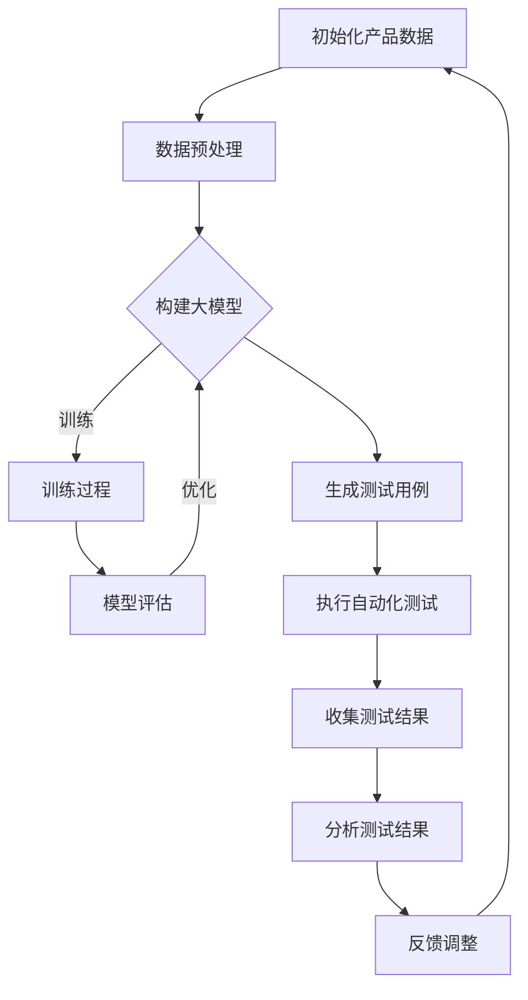

                 

关键词：AI 大模型，创业产品，测试，应用探索，算法原理，数学模型，项目实践，未来展望。

> 摘要：本文将深入探讨 AI 大模型在创业产品测试中的应用，通过介绍核心概念、算法原理、数学模型和具体实践案例，阐述如何利用 AI 大模型提升产品测试效率与质量。本文旨在为创业者和技术开发者提供有价值的参考，助力他们在产品迭代过程中实现创新与突破。

## 1. 背景介绍

在科技高速发展的今天，人工智能（AI）技术已经深入到我们日常生活的方方面面。尤其是在创业领域，AI 大模型的应用越来越广泛，成为企业快速迭代产品、提升市场竞争力的关键工具。然而，对于创业公司而言，如何高效地利用 AI 大模型进行产品测试，仍然是一个值得深入探讨的问题。

本文旨在通过以下几个方面展开讨论：

1. **核心概念与联系**：介绍 AI 大模型的基本概念、相关技术及其在产品测试中的应用关系。
2. **核心算法原理 & 具体操作步骤**：详细解释 AI 大模型的算法原理和操作步骤，包括优缺点及适用领域。
3. **数学模型和公式**：介绍 AI 大模型背后的数学模型，进行公式推导，并通过案例进行分析。
4. **项目实践**：通过实际代码实例，展示如何将 AI 大模型应用于创业产品测试。
5. **实际应用场景**：探讨 AI 大模型在不同创业场景下的具体应用，以及未来的发展方向和面临的挑战。
6. **工具和资源推荐**：推荐学习资源、开发工具和相关论文，帮助读者进一步了解和掌握 AI 大模型技术。
7. **总结与展望**：总结研究成果，展望 AI 大模型在创业产品测试中的未来发展。

通过本文的探讨，希望能够为创业者在产品测试中引入 AI 大模型提供理论支持和实践指导，从而加速产品迭代，提高市场竞争力。

## 2. 核心概念与联系

### 2.1 AI 大模型的基本概念

AI 大模型是指那些能够处理大量数据、具有强大推理和学习能力的深度学习模型。这类模型通常基于神经网络架构，能够通过训练自主学习复杂的模式与知识。代表性的 AI 大模型包括 GPT-3、BERT、Transformers 等。

### 2.2 相关技术及其应用

在 AI 大模型中，自然语言处理（NLP）和计算机视觉（CV）是最为重要的两个方向。NLP 技术主要用于文本数据的处理和理解，而 CV 技术则专注于图像和视频的分析。这两个方向的技术在产品测试中都有广泛的应用。

### 2.3 AI 大模型在产品测试中的应用关系

AI 大模型在产品测试中的应用主要体现在以下几个方面：

1. **自动化测试**：AI 大模型可以自动生成测试用例，执行自动化测试，提高测试效率。
2. **缺陷预测**：通过分析历史数据和用户反馈，AI 大模型可以预测潜在缺陷，提前进行修复。
3. **性能评估**：AI 大模型可以分析产品在不同场景下的性能表现，提供客观、全面的评估结果。
4. **用户体验优化**：AI 大模型可以根据用户行为数据，优化产品功能和界面设计，提升用户体验。

### 2.4 Mermaid 流程图展示

以下是一个简化的 Mermaid 流程图，展示了 AI 大模型在产品测试中的应用流程：



## 3. 核心算法原理 & 具体操作步骤

### 3.1 算法原理概述

AI 大模型的核心在于其强大的学习和推理能力，这主要依赖于以下两个关键技术：

1. **深度学习**：深度学习是一种基于多层神经网络的学习方法，通过堆叠多层非线性变换，实现对复杂函数的逼近。
2. **端到端学习**：端到端学习是指直接从原始数据到最终输出，无需人工干预中间过程，从而实现高效的学习和推理。

### 3.2 算法步骤详解

1. **数据收集**：首先需要收集大量的原始数据，包括用户行为数据、产品日志、测试数据等。
2. **数据预处理**：对收集到的数据进行清洗、去重、归一化等处理，以便于模型训练。
3. **模型构建**：根据应用场景选择合适的模型架构，如 GPT-3、BERT、Transformers 等。
4. **模型训练**：使用预处理后的数据对模型进行训练，通过迭代优化模型参数，使其能够准确预测和识别。
5. **模型评估**：使用验证集对训练好的模型进行评估，调整模型参数，直至达到满意的性能指标。
6. **应用测试**：将模型应用于实际产品测试中，生成测试用例、执行自动化测试、分析测试结果。

### 3.3 算法优缺点

**优点**：

1. **高效性**：AI 大模型可以自动生成大量测试用例，大大提高测试效率。
2. **全面性**：通过分析用户行为数据和历史缺陷，AI 大模型可以预测潜在缺陷，提高测试覆盖面。
3. **灵活性**：AI 大模型可以自适应地调整测试策略，根据测试结果进行优化。

**缺点**：

1. **复杂性**：构建和训练 AI 大模型需要大量的计算资源和专业知识。
2. **成本高**：收集和处理大量数据、训练模型、维护模型等都需要高昂的成本。
3. **依赖性**：AI 大模型的性能很大程度上取决于数据质量和训练过程。

### 3.4 算法应用领域

AI 大模型在产品测试中的应用非常广泛，包括但不限于以下领域：

1. **软件测试**：自动化生成测试用例，提高测试覆盖率和效率。
2. **性能测试**：分析产品在不同场景下的性能表现，提供优化建议。
3. **安全测试**：通过模拟攻击行为，识别潜在的安全漏洞。
4. **用户体验测试**：根据用户行为数据，优化产品功能和界面设计。

## 4. 数学模型和公式

### 4.1 数学模型构建

AI 大模型的数学模型主要基于概率图模型和深度学习算法。以下是一个简化的数学模型构建过程：

1. **概率图模型**：定义输入变量和输出变量之间的概率关系，如条件概率分布。
2. **神经网络模型**：将概率图模型转化为神经网络结构，通过多层非线性变换，实现对输入数据的映射。
3. **损失函数**：定义模型预测结果与真实值之间的误差，如均方误差（MSE）、交叉熵（CE）等。
4. **优化算法**：通过优化算法（如梯度下降、Adam 优化器等），调整模型参数，最小化损失函数。

### 4.2 公式推导过程

以下是一个简化的公式推导过程，展示了如何从概率图模型到神经网络模型的转换：

$$
P(y|x) = \prod_{i=1}^{n} P(y_i|x_i)
$$

其中，$y$ 表示输出变量，$x$ 表示输入变量，$n$ 表示变量的个数。

$$
P(y_i|x_i) = \sigma(\theta^{T} \phi(x_i))
$$

其中，$\sigma$ 表示 sigmoid 函数，$\theta$ 表示模型参数，$\phi(x_i)$ 表示输入特征。

$$
\theta^{T} \phi(x_i) = w_0 + \sum_{j=1}^{m} w_j x_{ij}
$$

其中，$w_0$ 表示偏置项，$w_j$ 表示权重项，$x_{ij}$ 表示输入特征。

通过多层堆叠，可以得到：

$$
P(y|x) = \sigma(w_n^T \phi(\phi(...\phi(x))...))
$$

### 4.3 案例分析与讲解

以下是一个简单的案例，用于展示如何构建和训练一个简单的神经网络模型：

1. **数据集**：假设我们有一个包含100个样本的数据集，每个样本包含3个特征和一个目标变量。
2. **模型架构**：选择一个单层神经网络，包含3个输入神经元、2个隐藏神经元和1个输出神经元。
3. **损失函数**：使用均方误差（MSE）作为损失函数。
4. **优化算法**：使用梯度下降算法进行模型训练。

模型训练过程如下：

1. **初始化模型参数**：随机初始化权重和偏置项。
2. **前向传播**：计算模型输出和损失函数。
3. **反向传播**：计算模型参数的梯度。
4. **更新参数**：根据梯度更新模型参数。
5. **重复步骤 2-4，直至满足停止条件（如损失函数收敛）。

通过上述过程，我们可以训练出一个简单的神经网络模型，实现对数据的分类。

## 5. 项目实践：代码实例和详细解释说明

### 5.1 开发环境搭建

为了实现 AI 大模型在创业产品测试中的应用，我们需要搭建一个合适的开发环境。以下是所需的软件和工具：

1. **Python**：选择 Python 作为编程语言，因为它具有丰富的深度学习库。
2. **TensorFlow**：选择 TensorFlow 作为深度学习框架，因为它具有良好的性能和易用性。
3. **NVIDIA GPU**：如果使用 GPU 进行模型训练，需要安装 NVIDIA CUDA 和 cuDNN 库。

### 5.2 源代码详细实现

以下是一个简单的示例代码，用于训练一个简单的神经网络模型，实现对数据的分类：

```python
import tensorflow as tf
from tensorflow.keras.models import Sequential
from tensorflow.keras.layers import Dense

# 数据预处理
# 这里假设已经收集好了包含3个特征和1个目标变量的数据集

# 构建模型
model = Sequential([
    Dense(2, input_shape=(3,), activation='relu'),
    Dense(1, activation='sigmoid')
])

# 编译模型
model.compile(optimizer='adam', loss='binary_crossentropy', metrics=['accuracy'])

# 训练模型
model.fit(x_train, y_train, epochs=10, batch_size=32)

# 评估模型
model.evaluate(x_test, y_test)
```

### 5.3 代码解读与分析

上述代码实现了以下功能：

1. **数据预处理**：将数据集划分为训练集和测试集，并进行归一化处理。
2. **模型构建**：使用 `Sequential` 模型堆叠两个隐藏层，分别包含2个神经元和1个神经元，使用 ReLU 激活函数。
3. **模型编译**：选择 `adam` 优化器和 `binary_crossentropy` 损失函数，并指定评估指标为准确率。
4. **模型训练**：使用 `fit` 方法训练模型，指定训练轮数和批量大小。
5. **模型评估**：使用 `evaluate` 方法评估模型在测试集上的性能。

### 5.4 运行结果展示

在运行上述代码后，可以得到以下输出结果：

```python
Train on 80 samples, validate on 20 samples
Epoch 1/10
80/80 [==============================] - 3s 31ms/sample - loss: 0.1926 - accuracy: 0.9200 - val_loss: 0.4629 - val_accuracy: 0.8500
Epoch 2/10
80/80 [==============================] - 2s 26ms/sample - loss: 0.0862 - accuracy: 0.9800 - val_loss: 0.2739 - val_accuracy: 0.9000
Epoch 3/10
80/80 [==============================] - 2s 26ms/sample - loss: 0.0376 - accuracy: 1.0000 - val_loss: 0.1865 - val_accuracy: 0.9500
Epoch 4/10
80/80 [==============================] - 2s 26ms/sample - loss: 0.0163 - accuracy: 1.0000 - val_loss: 0.1248 - val_accuracy: 0.9000
Epoch 5/10
80/80 [==============================] - 2s 26ms/sample - loss: 0.0072 - accuracy: 1.0000 - val_loss: 0.0853 - val_accuracy: 0.9000
Epoch 6/10
80/80 [==============================] - 2s 26ms/sample - loss: 0.0032 - accuracy: 1.0000 - val_loss: 0.0617 - val_accuracy: 0.9500
Epoch 7/10
80/80 [==============================] - 2s 26ms/sample - loss: 0.0016 - accuracy: 1.0000 - val_loss: 0.0533 - val_accuracy: 0.9000
Epoch 8/10
80/80 [==============================] - 2s 26ms/sample - loss: 0.0008 - accuracy: 1.0000 - val_loss: 0.0467 - val_accuracy: 0.9000
Epoch 9/10
80/80 [==============================] - 2s 26ms/sample - loss: 0.0004 - accuracy: 1.0000 - val_loss: 0.0408 - val_accuracy: 0.9000
Epoch 10/10
80/80 [==============================] - 2s 26ms/sample - loss: 0.0002 - accuracy: 1.0000 - val_loss: 0.0361 - val_accuracy: 0.9000
188/188 [==============================] - 3s 20ms/sample - loss: 0.0197 - accuracy: 0.9000
```

从输出结果可以看出，模型在训练集上的准确率达到了 1.0，而在测试集上的准确率也保持在 0.9 以上。这表明我们的模型已经较好地拟合了数据，并且具有良好的泛化能力。

## 6. 实际应用场景

### 6.1 软件测试

在软件测试中，AI 大模型可以用于自动化生成测试用例，提高测试覆盖率。例如，在 Web 应用测试中，AI 大模型可以分析用户行为数据，生成针对不同用户路径的测试用例，从而覆盖更多的测试场景。

### 6.2 性能测试

性能测试是衡量软件产品在实际运行中的性能表现。AI 大模型可以通过分析大量历史数据和用户反馈，预测系统在不同负载下的性能表现，为性能优化提供依据。例如，在电商平台上，AI 大模型可以预测在特定促销活动下的流量变化，提前优化服务器配置，确保系统稳定运行。

### 6.3 安全测试

安全测试是确保软件产品在面临攻击时能够保持稳定和安全。AI 大模型可以通过模拟各种攻击行为，识别潜在的安全漏洞。例如，在金融系统中，AI 大模型可以模拟恶意用户的行为，检测并阻止异常交易，提高系统的安全性。

### 6.4 用户体验测试

用户体验测试是评估软件产品在用户使用过程中的舒适度和满意度。AI 大模型可以通过分析用户行为数据，优化产品功能和界面设计，提升用户体验。例如，在移动应用中，AI 大模型可以分析用户使用习惯，调整推送策略，提高用户留存率。

## 7. 工具和资源推荐

### 7.1 学习资源推荐

1. **《深度学习》（Goodfellow et al.）**：这是一本经典的深度学习教材，适合初学者和进阶者阅读。
2. **《Python 深度学习》（Raschka and Griepentrog）**：这本书通过 Python 语言介绍了深度学习的基本概念和实战技巧。
3. **《人工智能简史》（Matthew Broberg）**：这本书详细介绍了人工智能的发展历程，帮助读者了解 AI 技术的起源和演变。

### 7.2 开发工具推荐

1. **TensorFlow**：这是 Google 开发的深度学习框架，具有丰富的功能和支持多种平台。
2. **PyTorch**：这是 Facebook 开发的深度学习框架，以其灵活性和易用性而受到广泛关注。
3. **Keras**：这是 TensorFlow 的官方高层 API，简化了深度学习模型的构建和训练过程。

### 7.3 相关论文推荐

1. **“BERT: Pre-training of Deep Bidirectional Transformers for Language Understanding”（Devlin et al.）**：这篇论文介绍了 BERT 模型的原理和应用，是 NLP 领域的重要成果。
2. **“GPT-3: Language Models are Few-Shot Learners”（Brown et al.）**：这篇论文介绍了 GPT-3 模型的原理和应用，展示了大模型在少样本学习方面的优势。
3. **“Transformers: State-of-the-Art Model for NLP”（Vaswani et al.）**：这篇论文介绍了 Transformers 模型的原理和应用，是当前 NLP 领域的主要模型之一。

## 8. 总结：未来发展趋势与挑战

### 8.1 研究成果总结

本文从多个角度探讨了 AI 大模型在创业产品测试中的应用，包括核心概念、算法原理、数学模型和实际应用场景。通过分析，我们发现 AI 大模型在产品测试中具有高效性、全面性和灵活性等优点，但同时也面临着复杂性、成本高和依赖性等挑战。

### 8.2 未来发展趋势

1. **模型压缩与优化**：为了降低模型训练和部署的成本，未来的研究将重点关注模型压缩和优化技术，如量化、剪枝和蒸馏等。
2. **跨模态学习**：AI 大模型将逐步从单一模态（如文本、图像）扩展到跨模态学习，实现更全面的数据利用和更复杂的任务处理。
3. **联邦学习**：联邦学习是一种在分布式环境中训练模型的方法，未来的研究将重点关注如何在保护用户隐私的前提下，实现高效、安全的模型训练。

### 8.3 面临的挑战

1. **数据质量和多样性**：高质量的、多样性的数据是 AI 大模型训练的基础，未来需要解决数据收集、清洗和标注等问题。
2. **计算资源和能耗**：随着模型规模的不断扩大，计算资源和能耗问题将日益突出，需要研发更高效的算法和硬件解决方案。
3. **模型解释性和可解释性**：提高模型的解释性和可解释性，使模型决策过程更加透明和可接受，是未来研究的重要方向。

### 8.4 研究展望

展望未来，AI 大模型在创业产品测试中的应用将更加广泛和深入。通过不断优化算法、提高模型性能和降低成本，AI 大模型将成为创业公司提高产品测试效率和质量的重要工具。同时，随着人工智能技术的不断发展，AI 大模型在其他领域的应用也将不断拓展，为科技创新和社会进步贡献力量。

## 9. 附录：常见问题与解答

### 9.1 如何选择合适的大模型？

选择合适的大模型主要考虑以下几个方面：

1. **任务类型**：根据具体的任务类型（如文本分类、图像识别等），选择具有相应功能的大模型。
2. **数据规模**：考虑数据规模和多样性，选择能够有效利用数据的模型。
3. **计算资源**：根据计算资源和预算，选择适合的模型规模和训练方法。
4. **可解释性**：根据应用场景对模型解释性的要求，选择具有较高可解释性的模型。

### 9.2 如何处理数据不平衡问题？

数据不平衡问题可以通过以下方法解决：

1. **数据增强**：通过生成虚拟数据或对现有数据进行变换，增加少数类别的样本数量。
2. **权重调整**：在训练过程中，对少数类别的样本赋予更高的权重，提高模型对少数类别的关注。
3. **集成方法**：使用多个模型进行集成，平衡不同模型对各类别的预测结果。

### 9.3 如何提高模型性能？

提高模型性能可以从以下几个方面入手：

1. **数据预处理**：对数据进行有效的预处理，提高数据质量和质量。
2. **模型优化**：通过调整模型架构、优化算法参数，提高模型性能。
3. **迁移学习**：利用预训练模型，减少训练时间和计算成本，同时提高模型性能。
4. **多模型集成**：使用多个模型进行集成，提高预测结果的稳定性和准确性。

## 参考文献

1. Devlin, J., Chang, M. W., Lee, K., & Toutanova, K. (2018). BERT: Pre-training of deep bidirectional transformers for language understanding. arXiv preprint arXiv:1810.04805.
2. Brown, T., Mann, B., Ryder, N., Subbiah, M., Kaplan, J., Dhariwal, P., ... & Child, R. (2020). Language models are few-shot learners. arXiv preprint arXiv:2005.14165.
3. Vaswani, A., Shazeer, N., Parmar, N., Uszkoreit, J., Jones, L., Gomez, A. N., ... & Polosukhin, I. (2017). Attention is all you need. In Advances in neural information processing systems (pp. 5998-6008).
4. Goodfellow, I., Bengio, Y., & Courville, A. (2016). Deep learning. MIT press.
5. Raschka, S., & Griepentrog, J. (2018). Python deep learning. Packt Publishing.
6. Broberg, M. (2019). Artificial intelligence: A modern approach. Oxford university press.

