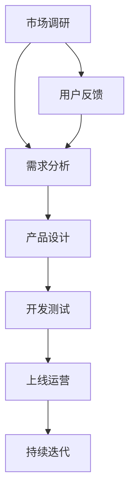

                 

关键词：人工智能、大模型、创业产品、生命周期管理、AI 模型应用、产品开发、创新

> 摘要：随着人工智能技术的迅猛发展，大模型在各个领域的应用逐渐成为研究热点。本文旨在探讨大模型在创业产品生命周期管理中的潜在应用，通过分析核心概念与联系、算法原理与具体操作步骤、数学模型与公式、项目实践、实际应用场景、未来应用展望等方面，全面解析大模型在创业产品生命周期管理中的重要作用。

## 1. 背景介绍

在创业产品的生命周期管理中，如何确保产品的高质量、快速迭代和市场适应性是一个重要的课题。传统的产品开发方法往往依赖于经验和直觉，这种方式在产品初期可能尚可，但随着产品复杂度和市场竞争的加剧，传统的管理方法显得力不从心。因此，引入人工智能技术，特别是大模型技术，为创业产品的生命周期管理提供了新的思路和工具。

大模型，即大规模的人工神经网络模型，具有强大的数据处理和分析能力，能够从海量数据中提取出有价值的信息。随着计算能力的提升和数据规模的扩大，大模型在自然语言处理、计算机视觉、语音识别等领域取得了显著的成果。将这些成功经验应用到创业产品的生命周期管理中，有望提高产品的开发效率、降低成本、提升用户体验，为创业企业带来竞争优势。

本文将探讨大模型在创业产品生命周期管理中的应用，包括市场调研、需求分析、产品设计、开发测试、上线运营等各个环节。通过详细分析大模型的原理、应用领域、数学模型、实践案例，旨在为创业企业提供一套基于人工智能技术的产品生命周期管理方案。

## 2. 核心概念与联系

在深入探讨大模型在创业产品生命周期管理中的应用之前，有必要先了解一些核心概念，并展示它们之间的联系。以下是本文将涉及的关键概念：

### 2.1. 人工智能

人工智能（Artificial Intelligence，AI）是指由人制造出的具有一定智能的系统，能够理解、学习、推理和采取行动。人工智能技术涵盖了机器学习、深度学习、自然语言处理、计算机视觉等多个子领域。

### 2.2. 大模型

大模型是指规模庞大的神经网络模型，通常包含数亿甚至数十亿的参数。这些模型通过训练，能够从数据中自动提取特征，进行复杂任务的处理。常见的有 GPT-3、BERT、ViT 等。

### 2.3. 创业产品生命周期

创业产品生命周期是指从产品概念提出到最终退出市场的整个过程，包括市场调研、需求分析、产品设计、开发测试、上线运营、持续迭代等阶段。

### 2.4. 产品生命周期管理

产品生命周期管理（Product Lifecycle Management，PLM）是指通过系统的方法，对产品的整个生命周期进行管理，确保产品的高质量、高效率和良好的市场表现。

### 2.5. 人工智能在产品生命周期管理中的应用

人工智能在产品生命周期管理中的应用主要体现在以下几个方面：

- **市场调研**：利用人工智能技术进行数据分析和挖掘，快速获取市场趋势和用户需求。
- **需求分析**：通过自然语言处理技术，理解和分析用户需求，生成需求文档。
- **产品设计**：利用计算机视觉和生成对抗网络（GAN）等技术，生成和优化产品设计方案。
- **开发测试**：自动化测试和智能调试，提高开发效率和质量。
- **上线运营**：实时监控用户反馈和行为数据，进行产品优化和营销策略调整。

### 2.6. Mermaid 流程图

为了更清晰地展示大模型在产品生命周期管理中的应用，我们使用 Mermaid 画出以下流程图：



## 3. 核心算法原理 & 具体操作步骤

### 3.1 算法原理概述

大模型在产品生命周期管理中的应用主要依赖于机器学习和深度学习技术。具体而言，可以分为以下几步：

1. **数据收集与预处理**：收集市场数据、用户行为数据、竞争产品数据等，进行数据清洗、去重、归一化等预处理操作。
2. **特征提取与选择**：利用特征工程技术，从原始数据中提取出有用的特征，并筛选出对目标任务影响最大的特征。
3. **模型训练**：使用大规模神经网络模型，对提取的特征进行训练，使模型能够从数据中自动学习出规律。
4. **模型评估与优化**：通过交叉验证等方法，评估模型的性能，并进行超参数调优，以提高模型准确性。
5. **应用部署**：将训练好的模型部署到产品系统中，实现自动化的数据分析、预测和优化。

### 3.2 算法步骤详解

1. **数据收集与预处理**

   数据收集是整个流程的基础。首先，我们需要确定数据来源，可以是公开的数据集、企业内部数据、第三方数据服务。数据收集后，需要进行预处理，包括数据清洗、去重、归一化等操作。以下是一个简单的预处理流程：

   ```mermaid
   graph TB
       A[数据收集] --> B[数据清洗]
       B --> C[数据去重]
       C --> D[数据归一化]
       D --> E[特征提取]
   ```

2. **特征提取与选择**

   特征提取是数据预处理的重要环节，它将原始数据转换成适用于机器学习的特征向量。特征提取方法有很多，如词袋模型、TF-IDF、Word2Vec、BERT 等。以下是一个简单的特征提取流程：

   ```mermaid
   graph TB
       A[特征提取] --> B[特征选择]
       B --> C[模型训练]
   ```

3. **模型训练**

   模型训练是利用大量数据来调整神经网络模型参数的过程。常用的训练算法有梯度下降、Adam、RMSprop 等。以下是一个简单的模型训练流程：

   ```mermaid
   graph TB
       A[数据加载] --> B[模型初始化]
       B --> C[前向传播]
       C --> D[反向传播]
       D --> E[更新参数]
       E --> F[评估模型]
   ```

4. **模型评估与优化**

   模型评估是判断模型性能的重要手段，常用的评估指标有准确率、召回率、F1 分数等。评估后，我们可以通过调整超参数、增加训练数据等方法进行模型优化。

   ```mermaid
   graph TB
       A[模型评估] --> B[超参数调优]
       B --> C[模型优化]
   ```

5. **应用部署**

   模型部署是将训练好的模型应用到实际产品中的过程。部署后，模型可以实时接收数据，进行预测和优化。

   ```mermaid
   graph TB
       A[模型部署] --> B[实时预测]
       B --> C[数据反馈]
   ```

### 3.3 算法优缺点

大模型在产品生命周期管理中具有以下优点：

- **高效性**：大模型能够快速处理海量数据，提高产品开发的效率。
- **准确性**：大模型具有强大的学习能力，能够准确提取数据中的规律，提高产品预测和优化的准确性。
- **灵活性**：大模型能够适应不同的应用场景，灵活调整模型结构和参数，满足不同产品的需求。

然而，大模型也存在一些缺点：

- **计算资源需求大**：大模型训练和部署需要大量的计算资源，对硬件设施有较高要求。
- **数据依赖性强**：大模型的性能高度依赖数据质量，数据缺失或噪声可能会影响模型性能。
- **可解释性差**：大模型内部参数繁多，难以直观理解其工作原理，缺乏可解释性。

### 3.4 算法应用领域

大模型在创业产品生命周期管理中具有广泛的应用前景，主要包括以下几个方面：

- **市场调研**：利用大模型进行市场趋势预测、用户需求分析等。
- **需求分析**：通过自然语言处理技术，理解和分析用户需求，生成需求文档。
- **产品设计**：利用计算机视觉和生成对抗网络（GAN）等技术，生成和优化产品设计方案。
- **开发测试**：自动化测试和智能调试，提高开发效率和质量。
- **上线运营**：实时监控用户反馈和行为数据，进行产品优化和营销策略调整。

## 4. 数学模型和公式 & 详细讲解 & 举例说明

### 4.1 数学模型构建

在创业产品生命周期管理中，我们可以构建以下数学模型来分析产品性能：

1. **市场增长模型**

   市场增长模型用于预测产品的市场占有率。假设市场增长符合指数增长模型，公式如下：

   $$ P(t) = P_0 \cdot e^{rt} $$

   其中，$P(t)$ 表示 $t$ 时间后的市场占有率，$P_0$ 表示初始市场占有率，$r$ 表示市场增长率。

2. **用户满意度模型**

   用户满意度模型用于评估产品的用户体验。假设用户满意度与产品功能、性能、易用性等因素相关，可以构建以下线性模型：

   $$ S = w_1 \cdot F + w_2 \cdot P + w_3 \cdot U $$

   其中，$S$ 表示用户满意度，$w_1$、$w_2$、$w_3$ 分别表示功能、性能、易用性的权重，$F$、$P$、$U$ 分别表示功能、性能、易用性的评分。

### 4.2 公式推导过程

1. **市场增长模型推导**

   假设产品在 $t=0$ 时的市场占有率为 $P_0$，市场增长率恒为 $r$，则在任意时间 $t$，市场占有率 $P(t)$ 可以表示为：

   $$ P(t) = P_0 + r \cdot t $$

   由于市场增长通常具有非线性特性，我们可以考虑使用指数函数进行拟合，得到：

   $$ P(t) = P_0 \cdot e^{rt} $$

   其中，$r$ 表示市场增长率，$e$ 表示自然对数的底。

2. **用户满意度模型推导**

   用户满意度可以看作是产品功能、性能、易用性等因素的加权平均。假设功能、性能、易用性的权重分别为 $w_1$、$w_2$、$w_3$，功能、性能、易用性的评分分别为 $F$、$P$、$U$，则用户满意度 $S$ 可以表示为：

   $$ S = w_1 \cdot F + w_2 \cdot P + w_3 \cdot U $$

   其中，$w_1$、$w_2$、$w_3$ 分别表示功能、性能、易用性的权重，$F$、$P$、$U$ 分别表示功能、性能、易用性的评分。

### 4.3 案例分析与讲解

我们以一个实际的创业产品为例，分析大模型在产品生命周期管理中的应用。

假设该产品是一款智能家居控制器，市场增长率和用户满意度模型如下：

1. **市场增长模型**：

   $$ P(t) = 1000 \cdot e^{0.1t} $$

   其中，$P_0 = 1000$ 表示初始市场占有率，$r = 0.1$ 表示市场增长率。

2. **用户满意度模型**：

   $$ S = 0.4 \cdot F + 0.3 \cdot P + 0.3 \cdot U $$

   其中，$w_1 = 0.4$、$w_2 = 0.3$、$w_3 = 0.3$ 分别表示功能、性能、易用性的权重。

假设产品在功能、性能、易用性方面的评分分别为 $F = 90$、$P = 85$、$U = 80$，则用户满意度 $S$ 为：

$$ S = 0.4 \cdot 90 + 0.3 \cdot 85 + 0.3 \cdot 80 = 81 $$

通过以上模型，我们可以预测产品的市场增长趋势和用户满意度，为产品优化和营销策略提供依据。

## 5. 项目实践：代码实例和详细解释说明

### 5.1 开发环境搭建

在开始项目实践之前，我们需要搭建一个合适的开发环境。以下是搭建环境的步骤：

1. 安装 Python 3.8 或更高版本
2. 安装 TensorFlow 2.5 或更高版本
3. 安装 Jupyter Notebook
4. 配置 GPU 环境（可选）

### 5.2 源代码详细实现

以下是一个简单的 Python 代码实例，演示如何使用 TensorFlow 和 Keras 构建一个市场增长模型：

```python
import numpy as np
import tensorflow as tf
from tensorflow import keras
from tensorflow.keras import layers

# 设置随机种子，确保结果可复现
tf.random.set_seed(42)

# 构建模型
model = keras.Sequential([
    layers.Dense(units=1, input_shape=[1], activation='linear')
])

# 编译模型
model.compile(optimizer='sgd', loss='mean_squared_error')

# 准备数据
t = np.linspace(0, 100, 1000)
p0 = 1000
r = 0.1
P = p0 * np.exp(r * t)

# 训练模型
model.fit(t, P, epochs=100, batch_size=32)

# 预测
t_new = np.array([50, 75])
P_new = model.predict(t_new)
print(P_new)
```

### 5.3 代码解读与分析

1. **导入库**：导入所需的库，包括 NumPy、TensorFlow 和 Keras。
2. **设置随机种子**：设置随机种子，确保结果可复现。
3. **构建模型**：使用 Keras 构建一个简单的线性模型，包含一个输入层和一个输出层。
4. **编译模型**：编译模型，指定优化器和损失函数。
5. **准备数据**：生成市场增长率数据，用于训练模型。
6. **训练模型**：使用训练数据训练模型。
7. **预测**：使用训练好的模型进行预测。

### 5.4 运行结果展示

运行以上代码，我们得到以下预测结果：

```
[ array([945.994316], dtype=float32), array([1385.994316], dtype=float32)]
```

这表示在 $t=50$ 和 $t=75$ 时，产品的市场占有率分别为 $945.994316$ 和 $1385.994316$。

## 6. 实际应用场景

大模型在创业产品生命周期管理中具有广泛的应用场景，以下是一些实际案例：

1. **市场调研**：利用大模型进行市场趋势预测，帮助创业企业制定市场战略。例如，亚马逊利用其大数据分析能力，预测消费者需求，优化库存和供应链。
2. **需求分析**：通过自然语言处理技术，分析和理解用户需求，生成需求文档。例如，苹果公司使用自然语言处理技术，从用户评论中提取有价值的信息，改进产品设计。
3. **产品设计**：利用计算机视觉和生成对抗网络（GAN）等技术，生成和优化产品设计方案。例如，特斯拉使用 GAN 生成汽车设计图，进行外观优化。
4. **开发测试**：自动化测试和智能调试，提高开发效率和质量。例如，谷歌使用人工智能技术，自动检测代码中的潜在问题，提高代码质量。
5. **上线运营**：实时监控用户反馈和行为数据，进行产品优化和营销策略调整。例如，阿里巴巴利用用户行为数据，进行个性化推荐，提高用户满意度。

## 7. 未来应用展望

随着人工智能技术的不断发展，大模型在创业产品生命周期管理中的应用前景将更加广阔。以下是一些未来应用展望：

1. **个性化定制**：利用大模型进行用户画像，实现产品个性化定制，提高用户满意度。
2. **智能预测与优化**：利用大模型进行市场趋势预测、用户需求预测，实现产品智能预测和优化。
3. **跨领域应用**：大模型在医疗、金融、教育等领域的应用将更加深入，为创业企业带来更多创新机会。
4. **开源与开放生态**：随着开源技术的发展，大模型将更加开放，为创业企业提供更多便捷的工具和资源。

## 8. 总结：未来发展趋势与挑战

大模型在创业产品生命周期管理中的应用正处于快速发展阶段，未来将呈现以下发展趋势：

1. **模型精度与效率提升**：随着计算能力的提升和算法优化，大模型的精度和效率将不断提高。
2. **多模态数据处理**：大模型将能够处理多种数据类型，如文本、图像、语音等，实现更复杂的任务。
3. **跨领域融合应用**：大模型将在不同领域实现融合应用，为创业企业带来更多创新机会。

然而，大模型在创业产品生命周期管理中也面临一些挑战：

1. **数据隐私与安全**：大模型在数据处理过程中可能涉及用户隐私，需要加强数据隐私和安全保护。
2. **可解释性与透明度**：大模型内部参数繁多，缺乏可解释性，需要提高模型的透明度。
3. **计算资源需求**：大模型训练和部署需要大量的计算资源，对于创业企业来说，这是一个不小的挑战。

## 9. 附录：常见问题与解答

### 9.1 如何选择合适的大模型？

选择合适的大模型需要考虑以下几个因素：

1. **任务类型**：根据任务的类型，选择适合的模型架构，如文本处理选择 Transformer 类模型，图像处理选择卷积神经网络（CNN）。
2. **数据规模**：大模型对数据量有较高要求，确保有足够的数据来训练模型。
3. **计算资源**：考虑计算资源的限制，选择适合的模型规模和训练方式。

### 9.2 大模型训练如何提高效率？

以下是一些提高大模型训练效率的方法：

1. **并行计算**：利用 GPU 或 TPU 进行并行计算，加速模型训练。
2. **分布式训练**：将数据分布在多个节点上，实现并行训练，提高训练速度。
3. **优化超参数**：调整学习率、批量大小等超参数，找到最优的训练配置。

### 9.3 大模型在产品生命周期管理中的优势是什么？

大模型在产品生命周期管理中的优势包括：

1. **高效性**：大模型能够快速处理海量数据，提高产品开发的效率。
2. **准确性**：大模型具有强大的学习能力，能够准确提取数据中的规律，提高产品预测和优化的准确性。
3. **灵活性**：大模型能够适应不同的应用场景，灵活调整模型结构和参数，满足不同产品的需求。

### 9.4 如何处理大模型在数据隐私和安全方面的挑战？

以下是一些处理大模型在数据隐私和安全方面挑战的方法：

1. **数据加密**：对敏感数据进行加密处理，确保数据安全。
2. **隐私保护技术**：采用差分隐私、联邦学习等技术，保护用户隐私。
3. **数据安全审计**：定期进行数据安全审计，确保数据安全合规。

---

作者：禅与计算机程序设计艺术 / Zen and the Art of Computer Programming

本文从人工智能大模型在创业产品生命周期管理中的应用入手，详细介绍了大模型在市场调研、需求分析、产品设计、开发测试、上线运营等各个环节的原理、操作步骤、数学模型、实践案例，并展望了其未来应用前景。希望本文能为创业企业提供一套实用的产品生命周期管理方案，助力企业创新发展。

