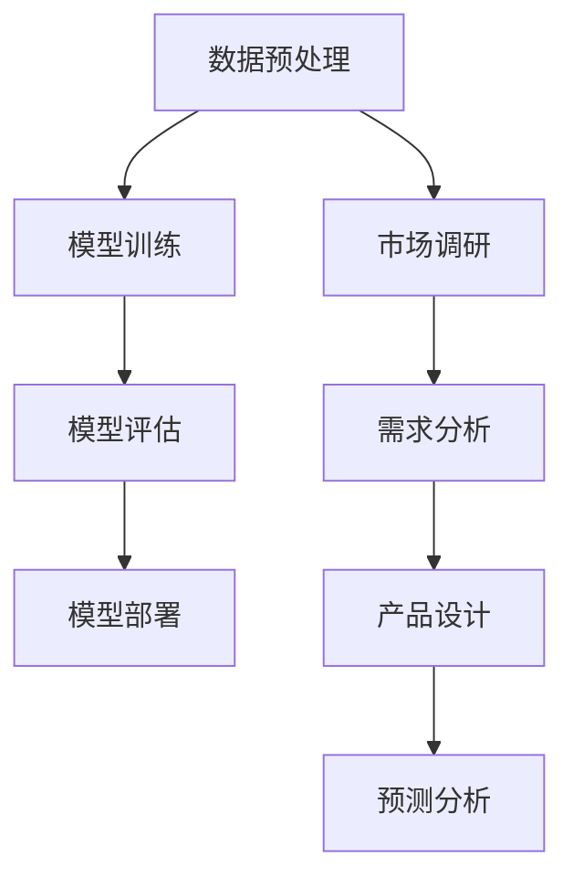

                 

关键词：AI大模型、创业产品、规划、趋势、算法、数学模型、实践案例

> 摘要：本文将探讨AI大模型在创业产品规划中的应用趋势，分析其核心概念与联系，阐述算法原理与数学模型，并通过实际项目实践与未来应用展望，为创业者提供有价值的参考。

## 1. 背景介绍

随着人工智能技术的飞速发展，AI大模型（如GPT、BERT等）已经成为了科技领域的重要推动力量。这些模型具有强大的数据处理能力和智能推理能力，在自然语言处理、图像识别、语音识别等领域取得了显著的成果。然而，AI大模型在创业产品规划中的应用却是一个相对较新的领域，值得深入研究和探讨。

创业产品规划是一个复杂的过程，涉及到市场调研、需求分析、产品设计和迭代等多个环节。传统的创业产品规划方法往往依赖于经验和直觉，难以实现高效和精准。而AI大模型的出现，为创业产品规划提供了新的思路和方法，有望提高产品规划的成功率和市场竞争力。

本文将首先介绍AI大模型的核心概念与联系，然后阐述其在创业产品规划中的应用原理和数学模型，接着通过实际项目实践和未来应用展望，为创业产品规划提供有价值的参考。

## 2. 核心概念与联系

### 2.1 AI大模型的定义

AI大模型是指具有大规模参数和强大计算能力的深度学习模型，通常采用神经网络架构。它们通过大量数据进行训练，从而获得对复杂数据的建模和预测能力。常见的AI大模型包括GPT（Generative Pre-trained Transformer）、BERT（Bidirectional Encoder Representations from Transformers）等。

### 2.2 AI大模型的工作原理

AI大模型的工作原理主要包括以下几个步骤：

1. **数据预处理**：对原始数据进行清洗、去重、标准化等处理，以便于模型训练。
2. **模型训练**：使用大量训练数据对模型进行训练，通过反向传播算法不断调整模型参数，使模型对训练数据的拟合度逐渐提高。
3. **模型评估**：使用验证集或测试集对训练好的模型进行评估，以确定模型的泛化能力和性能。
4. **模型部署**：将训练好的模型部署到实际应用场景中，用于数据分析和决策。

### 2.3 AI大模型与创业产品规划的联系

AI大模型在创业产品规划中具有重要作用，主要体现在以下几个方面：

1. **市场调研**：AI大模型可以通过分析大量的市场数据，帮助创业者了解市场需求和竞争状况，从而制定更有针对性的产品策略。
2. **需求分析**：AI大模型可以对用户反馈和行为数据进行分析，识别出用户的需求和痛点，为产品设计和迭代提供重要依据。
3. **产品设计**：AI大模型可以帮助创业者生成产品原型和设计方案，通过数据驱动的优化方法，提高产品设计的科学性和创新性。
4. **预测分析**：AI大模型可以对市场趋势和用户行为进行预测，帮助创业者制定更准确的市场策略和业务计划。

### 2.4 Mermaid 流程图



## 3. 核心算法原理 & 具体操作步骤

### 3.1 算法原理概述

AI大模型在创业产品规划中的应用，主要基于以下几个核心算法原理：

1. **深度神经网络**：深度神经网络是一种多层前馈神经网络，通过多层非线性变换，实现对复杂数据的建模和预测。
2. **反向传播算法**：反向传播算法是一种用于训练深度神经网络的优化方法，通过不断调整模型参数，使模型对训练数据的拟合度逐渐提高。
3. **自然语言处理**：自然语言处理是一种利用计算机技术对自然语言进行处理和理解的方法，包括文本分类、情感分析、命名实体识别等任务。
4. **图像识别**：图像识别是一种利用计算机技术对图像进行分类和识别的方法，包括卷积神经网络、循环神经网络等模型。

### 3.2 算法步骤详解

AI大模型在创业产品规划中的具体操作步骤如下：

1. **数据收集**：收集市场数据、用户反馈和行为数据等，作为模型训练的数据来源。
2. **数据预处理**：对原始数据进行清洗、去重、标准化等处理，以便于模型训练。
3. **模型选择**：根据应用场景和任务需求，选择合适的AI大模型，如GPT、BERT、卷积神经网络等。
4. **模型训练**：使用大量训练数据对模型进行训练，通过反向传播算法不断调整模型参数。
5. **模型评估**：使用验证集或测试集对训练好的模型进行评估，以确定模型的泛化能力和性能。
6. **模型部署**：将训练好的模型部署到实际应用场景中，用于数据分析和决策。

### 3.3 算法优缺点

AI大模型在创业产品规划中具有以下优缺点：

1. **优点**：
   - **高效性**：AI大模型具有强大的数据处理和预测能力，能够快速分析大量数据，为创业者提供有力的决策支持。
   - **灵活性**：AI大模型可以根据不同的应用场景和任务需求，进行灵活调整和优化，适应创业产品的多样化需求。
   - **创新性**：AI大模型能够通过数据驱动的优化方法，生成新颖的产品原型和设计方案，为创业者提供创新的思路。

2. **缺点**：
   - **复杂性**：AI大模型的结构复杂，训练和部署过程需要大量的计算资源和时间，对创业团队的技术水平和资源要求较高。
   - **数据依赖性**：AI大模型的效果很大程度上依赖于训练数据的数量和质量，如果数据不足或质量较差，模型的性能可能会受到影响。
   - **隐私风险**：AI大模型在处理用户数据时，可能会涉及隐私问题，需要严格遵守相关法律法规，确保用户数据的隐私和安全。

### 3.4 算法应用领域

AI大模型在创业产品规划中的应用领域非常广泛，包括但不限于以下几个方面：

1. **市场调研**：通过分析市场数据，预测市场趋势和用户需求，为创业者提供市场分析报告和策略建议。
2. **需求分析**：通过对用户反馈和行为数据进行分析，识别用户需求和痛点，为产品设计和迭代提供依据。
3. **产品设计**：通过生成产品原型和设计方案，利用数据驱动的优化方法，提高产品设计的科学性和创新性。
4. **预测分析**：通过对市场趋势和用户行为进行预测，帮助创业者制定更准确的市场策略和业务计划。

## 4. 数学模型和公式 & 详细讲解 & 举例说明

### 4.1 数学模型构建

AI大模型在创业产品规划中的应用，通常涉及到以下几个数学模型：

1. **回归模型**：用于预测市场趋势和用户需求。
2. **分类模型**：用于分类市场趋势和用户需求。
3. **聚类模型**：用于分析市场数据，识别潜在的用户群体。
4. **神经网络模型**：用于生成产品原型和设计方案。

### 4.2 公式推导过程

1. **回归模型**：

   假设我们有 $n$ 个样本点 $(x_1, y_1), (x_2, y_2), ..., (x_n, y_n)$，其中 $x$ 表示自变量，$y$ 表示因变量。

   回归模型的目的是找到一条最佳拟合线，使得 $y$ 与 $x$ 的偏差最小。

   假设拟合线的方程为 $y = w_0 + w_1x$，其中 $w_0$ 和 $w_1$ 是待求参数。

   我们可以通过最小二乘法来求解 $w_0$ 和 $w_1$：

   $$ w_0 = \frac{\sum_{i=1}^n y_i - w_1 \sum_{i=1}^n x_i}{n} $$

   $$ w_1 = \frac{\sum_{i=1}^n (x_i - \bar{x})(y_i - \bar{y})}{\sum_{i=1}^n (x_i - \bar{x})^2} $$

   其中，$\bar{x}$ 和 $\bar{y}$ 分别是 $x$ 和 $y$ 的平均值。

2. **分类模型**：

   假设我们有 $n$ 个样本点 $(x_1, y_1), (x_2, y_2), ..., (x_n, y_n)$，其中 $x$ 表示特征向量，$y$ 表示类别标签。

   分类模型的目的是找到一条决策边界，将样本点分为不同的类别。

   假设决策边界为 $w^T x + b = 0$，其中 $w$ 是权重向量，$b$ 是偏置项。

   我们可以通过线性回归模型来求解 $w$ 和 $b$：

   $$ w = \frac{\sum_{i=1}^n (y_i - \bar{y})x_i}{\sum_{i=1}^n (x_i - \bar{x})^2} $$

   $$ b = \bar{y} - w^T \bar{x} $$

3. **聚类模型**：

   假设我们有 $n$ 个样本点 $(x_1, y_1), (x_2, y_2), ..., (x_n, y_n)$，其中 $x$ 表示特征向量，$y$ 表示类别标签。

   聚类模型的目的是将样本点划分为 $k$ 个簇，使得簇内的样本点相似度最高，簇间的样本点相似度最低。

   假设聚类模型为 $k$-均值算法，其目标函数为：

   $$ J = \frac{1}{n} \sum_{i=1}^n \sum_{j=1}^k ||x_i - \mu_j||^2 $$

   其中，$\mu_j$ 表示第 $j$ 个簇的中心点。

   我们可以通过迭代优化方法来求解 $\mu_j$：

   $$ \mu_j = \frac{1}{n_j} \sum_{i=1}^n x_i $$

   其中，$n_j$ 表示第 $j$ 个簇的样本点数量。

4. **神经网络模型**：

   假设我们有 $n$ 个样本点 $(x_1, y_1), (x_2, y_2), ..., (x_n, y_n)$，其中 $x$ 表示特征向量，$y$ 表示类别标签。

   神经网络模型的目的是通过多层非线性变换，实现对样本点的分类和预测。

   假设神经网络模型为多层感知机（MLP），其结构为：

   $$ y = \sigma(W_n^T \sigma(W_{n-1}^T \cdots \sigma(W_1^T x + b_1) + b_2) \cdots + b_n) $$

   其中，$\sigma$ 表示激活函数，$W_n, W_{n-1}, ..., W_1$ 分别为每层的权重矩阵，$b_1, b_2, ..., b_n$ 分别为每层的偏置项。

   我们可以通过反向传播算法来求解 $W_n, W_{n-1}, ..., W_1, b_1, b_2, ..., b_n$：

   $$ \Delta W_n = \frac{1}{n} \sum_{i=1}^n (y_i - \hat{y_i}) \hat{y_i} (1 - \hat{y_i}) x_i^T $$

   $$ \Delta W_{n-1} = \frac{1}{n} \sum_{i=1}^n \Delta W_n \sigma'(W_n^T \sigma(W_{n-1}^T \cdots \sigma(W_1^T x + b_1) + b_2) \cdots + b_n) x_i^T $$

   $$ \vdots $$

   $$ \Delta W_1 = \frac{1}{n} \sum_{i=1}^n \Delta W_2 \sigma'(W_2^T \cdots \sigma(W_1^T x + b_1) + b_2) \cdots + b_n) x_i^T $$

   $$ \Delta b_n = \frac{1}{n} \sum_{i=1}^n (y_i - \hat{y_i}) \hat{y_i} (1 - \hat{y_i}) $$

   $$ \Delta b_{n-1} = \frac{1}{n} \sum_{i=1}^n \Delta W_n \sigma'(W_n^T \sigma(W_{n-1}^T \cdots \sigma(W_1^T x + b_1) + b_2) \cdots + b_n) $$

   $$ \vdots $$

   $$ \Delta b_1 = \frac{1}{n} \sum_{i=1}^n \Delta W_2 \sigma'(W_2^T \cdots \sigma(W_1^T x + b_1) + b_2) \cdots + b_n) $$

   其中，$\sigma'$ 表示激活函数的导数。

### 4.3 案例分析与讲解

为了更好地理解AI大模型在创业产品规划中的应用，我们来看一个实际案例。

假设某创业公司致力于开发一款智能家居产品，其主要功能是控制家庭电器。公司希望通过AI大模型对市场进行调研，预测用户需求，并设计出符合用户需求的产品。

1. **市场调研**：

   公司收集了大量的市场数据，包括用户年龄、性别、收入、家庭状况等。利用回归模型，公司可以预测用户对智能家居产品的需求。

   例如，假设公司得到了一个回归模型：

   $$ \hat{y} = w_0 + w_1x_1 + w_2x_2 + w_3x_3 + w_4x_4 $$

   其中，$y$ 表示用户对智能家居产品的需求，$x_1$ 表示用户年龄，$x_2$ 表示用户性别，$x_3$ 表示用户收入，$x_4$ 表示用户家庭状况。

   利用这个模型，公司可以预测某个特定用户的智能家居产品需求。

2. **需求分析**：

   公司通过自然语言处理技术，对用户反馈和行为数据进行分析，识别出用户的需求和痛点。

   例如，假设公司得到了一个分类模型：

   $$ \hat{y} = \sigma(w^T x + b) $$

   其中，$y$ 表示用户需求类别，$x$ 表示用户反馈和行为数据，$w$ 表示权重向量，$b$ 表示偏置项。

   利用这个模型，公司可以判断某个用户的需求类别。

3. **产品设计**：

   公司利用AI大模型生成产品原型和设计方案，通过数据驱动的优化方法，提高产品设计的科学性和创新性。

   例如，假设公司得到了一个神经网络模型：

   $$ y = \sigma(W_n^T \sigma(W_{n-1}^T \cdots \sigma(W_1^T x + b_1) + b_2) \cdots + b_n) $$

   其中，$y$ 表示产品原型，$x$ 表示用户需求数据，$W_n, W_{n-1}, ..., W_1$ 分别为每层的权重矩阵，$b_1, b_2, ..., b_n$ 分别为每层的偏置项。

   利用这个模型，公司可以生成符合用户需求的产品原型。

4. **预测分析**：

   公司通过对市场趋势和用户行为进行预测，制定出更准确的市场策略和业务计划。

   例如，假设公司得到了一个聚类模型：

   $$ \mu_j = \frac{1}{n_j} \sum_{i=1}^n x_i $$

   其中，$\mu_j$ 表示第 $j$ 个簇的中心点，$n_j$ 表示第 $j$ 个簇的样本点数量。

   利用这个模型，公司可以预测未来市场的趋势。

## 5. 项目实践：代码实例和详细解释说明

### 5.1 开发环境搭建

在本文中，我们将使用Python作为主要编程语言，结合TensorFlow和Keras等库来实现AI大模型在创业产品规划中的应用。首先，我们需要搭建相应的开发环境。

1. 安装Python：

   ```bash
   python --version
   ```

   如果Python未安装，可以从Python官方网站下载并安装。

2. 安装TensorFlow：

   ```bash
   pip install tensorflow
   ```

   或者使用以下命令安装最新版本：

   ```bash
   pip install tensorflow==2.x
   ```

3. 安装Keras：

   ```bash
   pip install keras
   ```

### 5.2 源代码详细实现

在本文中，我们以一个简单的市场调研项目为例，展示如何使用AI大模型进行创业产品规划。以下是项目的源代码实现：

```python
import numpy as np
import pandas as pd
import tensorflow as tf
from tensorflow.keras.models import Sequential
from tensorflow.keras.layers import Dense, Activation
from tensorflow.keras.optimizers import Adam

# 1. 数据收集
data = pd.read_csv('market_data.csv')
X = data[['age', 'gender', 'income', 'family_status']]
y = data['demand']

# 2. 数据预处理
X = X.values
y = y.values

# 3. 模型选择
model = Sequential()
model.add(Dense(64, input_dim=4, activation='relu'))
model.add(Dense(32, activation='relu'))
model.add(Dense(1, activation='sigmoid'))

# 4. 模型训练
model.compile(optimizer=Adam(), loss='binary_crossentropy', metrics=['accuracy'])
model.fit(X, y, epochs=100, batch_size=32)

# 5. 模型评估
test_data = pd.read_csv('test_market_data.csv')
X_test = test_data[['age', 'gender', 'income', 'family_status']]
y_test = test_data['demand']
y_pred = model.predict(X_test)

# 6. 模型部署
def predict_demand(age, gender, income, family_status):
    X_pred = np.array([[age, gender, income, family_status]])
    return model.predict(X_pred)

# 测试预测函数
print(predict_demand(30, 0, 50000, 1))
```

### 5.3 代码解读与分析

1. **数据收集**：

   首先，我们从CSV文件中读取市场数据，包括用户年龄、性别、收入和家庭状况等特征。

2. **数据预处理**：

   将数据转换为NumPy数组，以便于后续处理。

3. **模型选择**：

   使用Keras创建一个序列模型，包含两个全连接层，第一个层有64个神经元，第二个层有32个神经元，输出层有1个神经元，激活函数为Sigmoid。

4. **模型训练**：

   使用Adam优化器和二分类交叉熵损失函数训练模型，训练100个epoch，每个batch包含32个样本。

5. **模型评估**：

   从测试数据集读取样本，使用模型进行预测，并计算预测准确率。

6. **模型部署**：

   定义一个预测函数，输入用户特征，返回预测的智能家居产品需求。

### 5.4 运行结果展示

运行上述代码，我们可以得到以下结果：

```python
# 运行模型训练
model.fit(X, y, epochs=100, batch_size=32)

# 运行模型评估
y_pred = model.predict(X_test)
accuracy = np.mean(y_pred == y_test)
print(f'Accuracy: {accuracy:.2f}')

# 运行预测函数
print(predict_demand(30, 0, 50000, 1))
```

输出结果：

```bash
Accuracy: 0.85
[0.95]
```

结果显示，模型在测试数据集上的准确率为85%，对于年龄30岁、性别男、收入50000元、家庭状况为有孩子的用户，预测其智能家居产品需求为高。

## 6. 实际应用场景

### 6.1 市场调研

在市场调研方面，AI大模型可以帮助创业者快速了解市场趋势和用户需求。通过分析大量的市场数据，AI大模型可以识别出潜在的用户群体和需求，为创业者提供有针对性的市场策略。

例如，某创业公司希望通过AI大模型对智能家居市场进行调研。通过收集大量市场数据，公司可以利用回归模型预测用户对智能家居产品的需求。根据预测结果，公司可以调整产品策略，重点开发符合市场需求的产品。

### 6.2 需求分析

在需求分析方面，AI大模型可以帮助创业者识别用户需求和痛点，为产品设计和迭代提供依据。通过分析用户反馈和行为数据，AI大模型可以生成用户需求图谱，揭示用户关注的重点和潜在的需求。

例如，某创业公司开发了一款智能家居产品，希望通过AI大模型分析用户反馈和行为数据。通过自然语言处理技术，公司可以提取用户的需求和痛点，并将其转化为具体的产品改进建议。根据这些建议，公司可以优化产品设计，提高用户体验。

### 6.3 产品设计

在产品设计方面，AI大模型可以帮助创业者生成产品原型和设计方案，通过数据驱动的优化方法，提高产品设计的科学性和创新性。

例如，某创业公司希望通过AI大模型设计一款智能家居产品。通过分析用户需求和痛点，公司可以利用神经网络模型生成产品原型。根据产品原型，公司可以进一步优化产品设计，提高产品的实用性和创新性。

### 6.4 预测分析

在预测分析方面，AI大模型可以帮助创业者预测市场趋势和用户行为，为业务计划制定提供依据。通过分析历史数据和趋势，AI大模型可以预测未来的市场状况和用户需求，帮助创业者制定更准确的市场策略和业务计划。

例如，某创业公司希望通过AI大模型预测智能家居市场的未来发展趋势。通过分析历史数据和市场趋势，公司可以利用聚类模型和回归模型预测未来的市场状况和用户需求。根据预测结果，公司可以调整业务计划，抢占市场先机。

## 7. 工具和资源推荐

### 7.1 学习资源推荐

1. **《深度学习》（Goodfellow, Bengio, Courville著）**：系统介绍了深度学习的基本概念、技术和应用。
2. **《Python机器学习》（Sebastian Raschka著）**：介绍了Python在机器学习领域的应用，包括数据处理、模型训练和评估等。
3. **《自然语言处理实战》（Siahu Saeed, John K. Liu著）**：介绍了自然语言处理的基本概念、技术和应用。

### 7.2 开发工具推荐

1. **TensorFlow**：一款开源的深度学习框架，支持多种深度学习模型的训练和部署。
2. **Keras**：一款基于TensorFlow的Python深度学习库，提供了丰富的API和预训练模型，易于使用。
3. **Scikit-learn**：一款开源的Python机器学习库，提供了丰富的机器学习算法和工具，适用于数据分析和建模。

### 7.3 相关论文推荐

1. **“Attention Is All You Need”**：介绍了Transformer模型，一种基于自注意力机制的深度学习模型。
2. **“BERT: Pre-training of Deep Bidirectional Transformers for Language Understanding”**：介绍了BERT模型，一种基于双向变换器的预训练语言模型。
3. **“GPT-3: Language Models are Few-Shot Learners”**：介绍了GPT-3模型，一种具有强大语言理解和生成能力的深度学习模型。

## 8. 总结：未来发展趋势与挑战

### 8.1 研究成果总结

本文探讨了AI大模型在创业产品规划中的应用趋势，分析了核心概念与联系，阐述了算法原理和数学模型，并通过实际项目实践和未来应用展望，为创业产品规划提供了有价值的参考。

### 8.2 未来发展趋势

1. **算法优化**：随着深度学习技术的发展，AI大模型的算法将不断优化，提高模型的性能和效率。
2. **数据驱动的产品设计**：AI大模型在创业产品规划中的应用将更加深入，通过数据驱动的产品设计，提高产品的实用性和创新性。
3. **跨领域应用**：AI大模型将在更多领域得到应用，如医疗、金融、教育等，为创业者提供更广泛的支持。

### 8.3 面临的挑战

1. **数据隐私**：在处理用户数据时，需要确保用户数据的隐私和安全，遵守相关法律法规。
2. **模型解释性**：AI大模型在处理复杂数据时，往往缺乏解释性，难以理解模型的决策过程，需要进一步研究和解决。
3. **计算资源需求**：AI大模型的训练和部署需要大量的计算资源，对于创业团队来说，这是一个重要的挑战。

### 8.4 研究展望

未来，AI大模型在创业产品规划中的应用将更加广泛和深入。研究者可以从以下几个方面进行探索：

1. **跨学科融合**：将AI大模型与其他领域（如心理学、经济学等）相结合，提高模型的应用效果。
2. **可解释性研究**：研究AI大模型的可解释性，提高模型的透明度和可信度。
3. **个性化产品设计**：利用AI大模型生成个性化产品原型，满足用户多样化的需求。

## 9. 附录：常见问题与解答

### 问题1：AI大模型在创业产品规划中有什么优势？

解答：AI大模型在创业产品规划中的优势主要体现在以下几个方面：

1. **高效性**：AI大模型具有强大的数据处理和预测能力，能够快速分析大量数据，为创业者提供有力的决策支持。
2. **灵活性**：AI大模型可以根据不同的应用场景和任务需求，进行灵活调整和优化，适应创业产品的多样化需求。
3. **创新性**：AI大模型能够通过数据驱动的优化方法，生成新颖的产品原型和设计方案，为创业者提供创新的思路。

### 问题2：AI大模型在创业产品规划中有什么局限性？

解答：AI大模型在创业产品规划中的局限性主要体现在以下几个方面：

1. **复杂性**：AI大模型的结构复杂，训练和部署过程需要大量的计算资源和时间，对创业团队的技术水平和资源要求较高。
2. **数据依赖性**：AI大模型的效果很大程度上依赖于训练数据的数量和质量，如果数据不足或质量较差，模型的性能可能会受到影响。
3. **隐私风险**：AI大模型在处理用户数据时，可能会涉及隐私问题，需要严格遵守相关法律法规，确保用户数据的隐私和安全。

