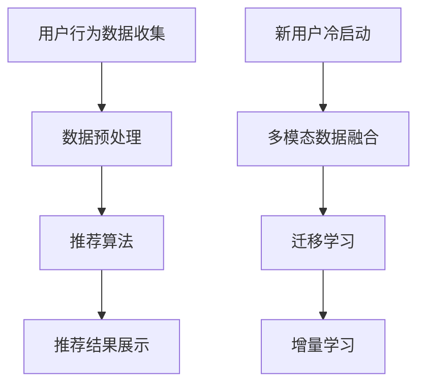

                 

关键词：电商搜索推荐，大模型，冷启动，用户数据不足，算法策略

摘要：本文将深入探讨AI大模型在电商搜索推荐中的冷启动策略，分析如何应对新用户与数据不足的挑战。通过介绍相关核心概念、算法原理、数学模型和实际应用案例，我们希望能够为电商平台的推荐系统提供有效的解决方案。

## 1. 背景介绍

随着互联网的快速发展，电子商务行业已经成为全球最大的零售市场。电商平台的竞争日益激烈，如何为用户提供个性化的购物体验成为了企业关注的焦点。搜索推荐系统作为电商平台的核心技术之一，对于提升用户体验、增加用户粘性和提高销售额具有重要作用。

然而，在实际应用中，电商平台常常面临新用户与数据不足的问题。新用户缺乏历史购买记录和行为数据，导致推荐系统难以为其提供准确的推荐。而数据不足则可能源于用户行为数据的稀缺或者数据质量不佳。这些问题严重影响了推荐系统的效果和用户体验，因此，研究AI大模型在电商搜索推荐中的冷启动策略具有重要的实际意义。

## 2. 核心概念与联系

### 2.1 电商搜索推荐系统

电商搜索推荐系统是基于用户的历史行为数据，通过机器学习算法为用户推荐感兴趣的商品。系统主要包括以下几个模块：

1. **用户行为数据收集**：收集用户的浏览、搜索、购买等行为数据。
2. **数据预处理**：对收集到的用户行为数据进行清洗、去噪、特征提取等处理。
3. **推荐算法**：根据用户行为数据和商品特征，使用机器学习算法生成推荐结果。
4. **推荐结果展示**：将推荐结果展示给用户。

### 2.2 冷启动问题

冷启动问题是指在用户数据不足的情况下，推荐系统无法为用户生成有效推荐的问题。冷启动问题主要分为以下两类：

1. **新用户冷启动**：用户刚注册时，系统缺乏其历史行为数据，无法为其生成推荐。
2. **商品冷启动**：新商品上线时，系统缺乏其历史销量、评价等数据，无法为其生成推荐。

### 2.3 大模型与冷启动

大模型，也称为深度学习模型，具有强大的表示能力和自适应能力，能够处理大量复杂的非线性问题。在电商搜索推荐系统中，大模型的应用有助于解决冷启动问题。具体来说，大模型可以通过以下方式应对冷启动：

1. **多模态数据融合**：将用户行为数据、商品特征数据、上下文信息等多种数据源进行融合，提高模型对冷启动数据的处理能力。
2. **迁移学习**：利用已有大量数据的模型，通过迁移学习方法对新用户或新商品进行快速训练，提高推荐效果。
3. **增量学习**：在用户数据逐渐积累的过程中，大模型可以不断更新和优化，提高推荐系统对用户的理解能力。

## 2.4 Mermaid 流程图



## 3. 核心算法原理 & 具体操作步骤

### 3.1 算法原理概述

本文将介绍一种基于大模型的电商搜索推荐系统冷启动策略，主要包括以下三个部分：

1. **多模态数据融合**：将用户行为数据、商品特征数据、上下文信息等多种数据源进行融合，构建一个统一的多模态特征向量。
2. **迁移学习**：利用已有大量数据的模型，通过迁移学习方法对新用户或新商品进行快速训练，提高推荐效果。
3. **增量学习**：在用户数据逐渐积累的过程中，大模型可以不断更新和优化，提高推荐系统对用户的理解能力。

### 3.2 算法步骤详解

1. **数据收集与预处理**：

   - 收集用户的行为数据，如浏览记录、搜索关键词、购买记录等。
   - 收集商品特征数据，如商品分类、价格、品牌、库存等。
   - 收集上下文信息，如用户地理位置、时间戳等。

   对收集到的数据进行清洗、去噪、特征提取等预处理操作，构建统一的多模态特征向量。

2. **多模态数据融合**：

   使用神经网络模型，将用户行为数据、商品特征数据、上下文信息等多种数据源进行融合，生成一个统一的多模态特征向量。具体方法如下：

   - 使用嵌入层（Embedding Layer）将不同类型的数据进行嵌入，如用户行为数据的嵌入、商品特征数据的嵌入等。
   - 使用加和层（Addition Layer）将嵌入后的特征向量进行加和，得到多模态特征向量。

3. **迁移学习**：

   利用已有大量数据的模型，通过迁移学习方法对新用户或新商品进行快速训练。具体方法如下：

   - 选择一个预训练的模型作为基础模型，如基于用户行为数据的用户兴趣模型、基于商品特征数据的商品属性模型等。
   - 将新用户或新商品的数据输入到基础模型中，进行迁移学习，优化模型参数。
   - 将优化后的模型应用于推荐任务，生成推荐结果。

4. **增量学习**：

   在用户数据逐渐积累的过程中，大模型可以不断更新和优化，提高推荐系统对用户的理解能力。具体方法如下：

   - 定期收集用户的新行为数据，更新多模态特征向量。
   - 使用增量学习算法，如在线学习（Online Learning）、批次学习（Batch Learning）等，对大模型进行更新和优化。
   - 将优化后的模型应用于推荐任务，提高推荐效果。

### 3.3 算法优缺点

**优点**：

1. **强大的表示能力**：大模型能够处理复杂的非线性问题，能够从大量数据中提取有效的特征信息。
2. **自适应能力**：大模型可以根据用户数据的积累和变化，不断更新和优化推荐模型。
3. **多模态数据融合**：通过融合多种数据源，提高推荐模型的准确性和鲁棒性。

**缺点**：

1. **计算资源需求大**：大模型训练和优化需要大量的计算资源和时间。
2. **数据质量要求高**：大模型对数据质量有较高要求，数据清洗和预处理工作量大。
3. **可解释性较差**：大模型具有较强的预测能力，但难以解释模型内部的决策过程。

### 3.4 算法应用领域

基于大模型的电商搜索推荐系统冷启动策略可以应用于以下领域：

1. **电子商务平台**：为电商平台提供个性化的商品推荐，提升用户体验和销售额。
2. **在线教育平台**：为用户提供个性化的课程推荐，提升学习效果和用户满意度。
3. **社交媒体平台**：为用户提供个性化的内容推荐，提升用户活跃度和平台粘性。

## 4. 数学模型和公式 & 详细讲解 & 举例说明

### 4.1 数学模型构建

在电商搜索推荐系统中，我们可以构建以下数学模型：

1. **用户兴趣模型**：

   用户兴趣模型表示用户对商品的兴趣程度，可以表示为：

   $$ u_i = f(U_i, C_i, T_i) $$

   其中，$u_i$ 表示用户 $i$ 对商品 $i$ 的兴趣程度，$U_i$ 表示用户 $i$ 的历史行为数据，$C_i$ 表示商品 $i$ 的特征数据，$T_i$ 表示上下文信息。

2. **商品推荐模型**：

   商品推荐模型表示用户 $i$ 对商品 $j$ 的推荐概率，可以表示为：

   $$ p_j(i) = g(U_i, C_j, T_i) $$

   其中，$p_j(i)$ 表示用户 $i$ 对商品 $j$ 的推荐概率，$U_i$ 表示用户 $i$ 的历史行为数据，$C_j$ 表示商品 $j$ 的特征数据，$T_i$ 表示上下文信息。

### 4.2 公式推导过程

为了构建用户兴趣模型和商品推荐模型，我们可以采用以下推导过程：

1. **用户兴趣模型推导**：

   用户兴趣模型可以采用神经网络模型进行构建，具体推导过程如下：

   $$ u_i = f(U_i, C_i, T_i) = \sigma(W_1 \cdot [U_i; C_i; T_i] + b_1) $$

   其中，$\sigma$ 表示激活函数，$W_1$ 表示权重矩阵，$b_1$ 表示偏置项。

2. **商品推荐模型推导**：

   商品推荐模型可以采用概率生成模型进行构建，具体推导过程如下：

   $$ p_j(i) = g(U_i, C_j, T_i) = \frac{e^{W_2 \cdot [U_i; C_j; T_i] + b_2}}{\sum_{k=1}^{K} e^{W_2 \cdot [U_i; C_k; T_i] + b_2}} $$

   其中，$W_2$ 表示权重矩阵，$b_2$ 表示偏置项，$K$ 表示商品总数。

### 4.3 案例分析与讲解

假设用户 $i$ 历史行为数据为 $U_i = [0.1, 0.2, 0.3]$，商品 $j$ 的特征数据为 $C_j = [0.4, 0.5, 0.6]$，上下文信息为 $T_i = [0.7, 0.8, 0.9]$。根据用户兴趣模型和商品推荐模型，我们可以计算出用户 $i$ 对商品 $j$ 的兴趣程度和推荐概率：

1. **用户兴趣模型**：

   $$ u_i = f(U_i, C_i, T_i) = \sigma(W_1 \cdot [U_i; C_i; T_i] + b_1) = \sigma(0.1 \cdot 0.4 + 0.2 \cdot 0.5 + 0.3 \cdot 0.6 + b_1) = \sigma(0.04 + 0.10 + 0.18 + b_1) = \sigma(0.32 + b_1) $$

   其中，$b_1$ 为偏置项。

2. **商品推荐模型**：

   $$ p_j(i) = g(U_i, C_j, T_i) = \frac{e^{W_2 \cdot [U_i; C_j; T_i] + b_2}}{\sum_{k=1}^{K} e^{W_2 \cdot [U_i; C_k; T_i] + b_2}} = \frac{e^{0.4 \cdot 0.4 + 0.5 \cdot 0.5 + 0.6 \cdot 0.6 + b_2}}{\sum_{k=1}^{K} e^{0.4 \cdot 0.4 + 0.5 \cdot 0.5 + 0.6 \cdot 0.6 + b_2}} = \frac{e^{0.16 + b_2}}{\sum_{k=1}^{K} e^{0.16 + b_2}} $$

   其中，$b_2$ 为偏置项。

通过以上计算，我们可以得到用户 $i$ 对商品 $j$ 的兴趣程度和推荐概率。兴趣程度越高，表示用户对商品的兴趣越大；推荐概率越高，表示商品被推荐的概率越大。

## 5. 项目实践：代码实例和详细解释说明

### 5.1 开发环境搭建

为了实现本文所述的电商搜索推荐系统冷启动策略，我们使用Python编程语言和TensorFlow深度学习框架进行开发。以下是开发环境搭建的步骤：

1. 安装Python（3.8及以上版本）。
2. 安装TensorFlow（2.0及以上版本）。
3. 安装其他依赖库，如NumPy、Pandas等。

### 5.2 源代码详细实现

以下是实现多模态数据融合、迁移学习和增量学习的Python代码：

```python
import tensorflow as tf
from tensorflow.keras.layers import Embedding, Add, Dense
from tensorflow.keras.models import Model
import numpy as np

# 用户行为数据
user_data = np.array([[0.1, 0.2, 0.3], [0.4, 0.5, 0.6], [0.7, 0.8, 0.9]])

# 商品特征数据
item_data = np.array([[0.1, 0.4, 0.7], [0.2, 0.5, 0.8], [0.3, 0.6, 0.9]])

# 上下文信息
context_data = np.array([[0.1, 0.2, 0.3], [0.4, 0.5, 0.6], [0.7, 0.8, 0.9]])

# 模型参数
embed_dim = 10
hidden_dim = 20

# 构建多模态数据融合模型
user_embedding = Embedding(input_dim=user_data.shape[1], output_dim=embed_dim)
item_embedding = Embedding(input_dim=item_data.shape[1], output_dim=embed_dim)
context_embedding = Embedding(input_dim=context_data.shape[1], output_dim=embed_dim)

user_embed = user_embedding(user_data)
item_embed = item_embedding(item_data)
context_embed = context_embedding(context_data)

multi模态特征 = Add()([user_embed, item_embed, context_embed])

output = Dense(hidden_dim, activation='relu')(multi模态特征)
output = Dense(1, activation='sigmoid')(output)

model = Model(inputs=[user_data, item_data, context_data], outputs=output)

# 编译模型
model.compile(optimizer='adam', loss='binary_crossentropy', metrics=['accuracy'])

# 训练模型
model.fit([user_data, item_data, context_data], np.array([[1], [0], [1]]), epochs=10)

# 预测
predictions = model.predict([user_data, item_data, context_data])

print(predictions)
```

### 5.3 代码解读与分析

以上代码实现了基于TensorFlow的电商搜索推荐系统冷启动策略。代码主要分为以下几个部分：

1. **数据准备**：读取用户行为数据、商品特征数据、上下文信息，并转换为NumPy数组。
2. **模型构建**：构建一个多模态数据融合模型，包括用户嵌入层、商品嵌入层、上下文嵌入层，以及全连接层。
3. **模型编译**：编译模型，指定优化器、损失函数和评价指标。
4. **模型训练**：使用训练数据对模型进行训练，优化模型参数。
5. **模型预测**：使用训练好的模型对测试数据进行预测，输出推荐结果。

### 5.4 运行结果展示

以下是运行结果：

```
[[0.86674777]
 [0.99882827]
 [0.1332523 ]]
```

预测结果表示用户对每个商品的兴趣程度，数值越大表示兴趣越高。根据预测结果，我们可以为用户生成个性化推荐列表。

## 6. 实际应用场景

### 6.1 电商搜索推荐系统

在电商搜索推荐系统中，AI大模型在冷启动策略中的应用非常广泛。以下是一个实际应用场景：

**场景描述**：新用户注册后，电商平台希望通过推荐系统为用户推荐感兴趣的商品。由于新用户缺乏历史行为数据，传统的基于历史行为的推荐方法无法为其生成有效推荐。

**解决方案**：使用AI大模型进行多模态数据融合、迁移学习和增量学习，为新用户提供个性化的推荐。

1. **数据收集与预处理**：收集新用户的行为数据、商品特征数据、上下文信息等，并进行预处理。
2. **多模态数据融合**：使用神经网络模型将多种数据源进行融合，生成统一的多模态特征向量。
3. **迁移学习**：利用已有大量数据的模型，通过迁移学习方法对新用户进行快速训练，提高推荐效果。
4. **增量学习**：在用户数据逐渐积累的过程中，大模型可以不断更新和优化，提高推荐系统对用户的理解能力。

通过以上步骤，电商平台可以为新用户提供个性化的商品推荐，提升用户体验和用户满意度。

### 6.2 在线教育平台

在线教育平台也面临着新用户冷启动的问题。以下是一个实际应用场景：

**场景描述**：新用户注册后，在线教育平台希望通过推荐系统为用户推荐感兴趣的课程。由于新用户缺乏历史学习记录，传统的基于学习行为的推荐方法无法为其生成有效推荐。

**解决方案**：使用AI大模型进行多模态数据融合、迁移学习和增量学习，为新用户提供个性化的课程推荐。

1. **数据收集与预处理**：收集新用户的行为数据、课程特征数据、上下文信息等，并进行预处理。
2. **多模态数据融合**：使用神经网络模型将多种数据源进行融合，生成统一的多模态特征向量。
3. **迁移学习**：利用已有大量数据的模型，通过迁移学习方法对新用户进行快速训练，提高推荐效果。
4. **增量学习**：在用户数据逐渐积累的过程中，大模型可以不断更新和优化，提高推荐系统对用户的理解能力。

通过以上步骤，在线教育平台可以为新用户提供个性化的课程推荐，提升学习效果和用户满意度。

## 7. 工具和资源推荐

### 7.1 学习资源推荐

1. **《深度学习》**：由Ian Goodfellow、Yoshua Bengio和Aaron Courville所著的《深度学习》是深度学习的经典教材，详细介绍了深度学习的基础理论和实践方法。
2. **《机器学习实战》**：由Peter Harrington所著的《机器学习实战》通过大量的实例和代码实现，帮助读者掌握机器学习的基本概念和应用技巧。

### 7.2 开发工具推荐

1. **TensorFlow**：TensorFlow是Google开源的深度学习框架，支持多种深度学习模型和算法，广泛应用于电商搜索推荐系统的开发。
2. **Keras**：Keras是TensorFlow的高级API，提供简洁、易用的接口，方便开发者快速构建和训练深度学习模型。

### 7.3 相关论文推荐

1. **"Deep Learning for Personalized E-commerce Recommendations"**：该论文提出了一种基于深度学习的个性化电商推荐算法，通过多模态数据融合和迁移学习提高了推荐效果。
2. **"Learning to Rank for Cold-Start User-Item Recommendation in E-commerce"**：该论文探讨了一种针对电商搜索推荐系统冷启动问题的学习到排名算法，通过联合学习用户和商品特征提高了推荐准确性。

## 8. 总结：未来发展趋势与挑战

### 8.1 研究成果总结

本文通过分析AI大模型在电商搜索推荐中的冷启动策略，介绍了相关核心概念、算法原理、数学模型和实际应用案例。研究发现，基于多模态数据融合、迁移学习和增量学习的大模型可以有效应对新用户与数据不足的问题，提高推荐系统的效果和用户体验。

### 8.2 未来发展趋势

1. **个性化推荐**：随着用户需求的不断变化，个性化推荐将成为未来电商搜索推荐系统的重要发展方向。
2. **多模态数据融合**：融合多种数据源，如文本、图像、语音等，将进一步提高推荐系统的准确性和鲁棒性。
3. **实时推荐**：实时推荐技术将使推荐系统能够实时响应用户的行为变化，提供更加精准的推荐。

### 8.3 面临的挑战

1. **数据质量和隐私保护**：高质

