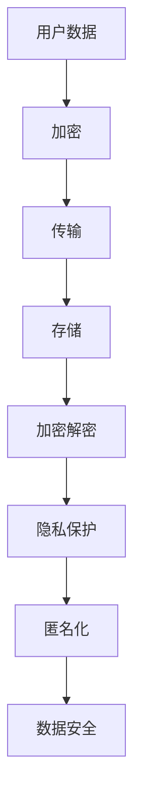

                 

关键词：AI 大模型、电商搜索推荐、数据安全、用户隐私、安全策略

> 摘要：本文将探讨 AI 大模型在电商搜索推荐中的数据安全策略，旨在保障数据安全与用户隐私。通过分析现有问题，本文提出了一套完整的解决方案，包括数据加密、隐私保护技术和用户数据匿名化等，为电商平台的可持续发展提供技术支持。

## 1. 背景介绍

随着互联网的快速发展，电商平台已经成为人们日常生活中不可或缺的一部分。电商搜索推荐作为电商平台的核心功能之一，直接影响着用户的使用体验和平台的商业利益。AI 大模型的出现，为电商搜索推荐带来了前所未有的技术优势，通过深度学习、自然语言处理等技术手段，可以实现更精准、个性化的推荐。然而，随之而来的数据安全问题也不容忽视。在电商搜索推荐过程中，用户数据涉及到个人隐私、消费习惯、偏好等敏感信息，一旦泄露或被滥用，将对用户造成严重的经济损失和心理伤害。

### 1.1 数据安全的重要性

数据安全是现代信息技术领域的一个重要议题，关系到国家安全、商业利益和公民隐私。在电商搜索推荐中，数据安全的重要性体现在以下几个方面：

- **用户隐私保护**：用户的个人信息和消费行为属于高度敏感数据，泄露可能导致隐私泄露、身份盗用等严重后果。
- **商业机密保护**：电商平台的商业策略、用户数据等商业机密一旦泄露，将给竞争对手提供可乘之机，损害企业利益。
- **合规要求**：随着数据保护法规的不断完善，如《通用数据保护条例》（GDPR）等，电商平台需要确保数据处理的合规性。

### 1.2 电商搜索推荐中的数据安全问题

电商搜索推荐中存在以下几类数据安全问题：

- **数据泄露**：用户数据在传输、存储和处理过程中，可能因系统漏洞、网络攻击等原因被非法获取。
- **数据滥用**：电商平台可能出于商业目的，滥用用户数据，如定向广告投放、个性化推送等。
- **数据丢失**：系统故障、数据损坏等原因可能导致用户数据永久丢失。
- **数据完整性**：恶意篡改、伪造数据可能导致推荐结果不准确，影响用户体验。

## 2. 核心概念与联系

为了保障数据安全与用户隐私，我们需要引入以下几个核心概念：

### 2.1 数据加密

数据加密是保障数据安全的重要手段，通过将明文数据转换为密文，防止数据在传输和存储过程中被非法访问。数据加密主要包括对称加密、非对称加密和哈希算法等。

### 2.2 隐私保护技术

隐私保护技术旨在确保用户数据在处理过程中不被泄露，常用的技术包括差分隐私、同态加密和多方计算等。

### 2.3 用户数据匿名化

用户数据匿名化通过去除或模糊化敏感信息，使数据在保留价值的同时，无法直接关联到特定用户。常见的匿名化方法有泛化、摘要化和加密匿名化等。

### 2.4 Mermaid 流程图

以下是一个简化的 Mermaid 流程图，展示了数据安全策略的核心组件和流程：



## 3. 核心算法原理 & 具体操作步骤

### 3.1 算法原理概述

在电商搜索推荐中，数据安全策略的核心算法包括数据加密、隐私保护技术和用户数据匿名化。以下是这些算法的简要原理：

### 3.2 算法步骤详解

#### 3.2.1 数据加密

1. **选择加密算法**：根据数据类型和安全性要求，选择合适的加密算法，如AES、RSA等。
2. **生成密钥**：使用安全的密钥生成算法，生成加密所需的密钥对。
3. **加密数据**：将明文数据使用加密算法和密钥进行加密，生成密文。
4. **传输和存储密文**：将密文数据传输至目标系统或存储设备，确保密文在传输和存储过程中的安全。
5. **解密数据**：在需要访问数据时，使用密钥和加密算法对密文进行解密，恢复明文数据。

#### 3.2.2 隐私保护技术

1. **数据清洗**：在数据处理前，对原始数据进行清洗，去除或模糊化敏感信息。
2. **差分隐私**：在数据处理过程中，引入噪声，使数据处理结果对单个数据项的影响最小，从而保护用户隐私。
3. **同态加密**：在数据处理过程中，直接对密文数据进行计算，无需解密，从而保护数据隐私。
4. **多方计算**：在多方参与的数据处理过程中，使用多方计算技术，确保各方的数据隐私不被泄露。

#### 3.2.3 用户数据匿名化

1. **数据泛化**：将具体数据项替换为泛化数据项，降低数据项的识别度。
2. **数据摘要化**：将详细数据项压缩为摘要数据，减少数据项的细节信息。
3. **加密匿名化**：使用加密算法对敏感数据项进行加密，使数据在保留价值的同时，无法直接关联到特定用户。

### 3.3 算法优缺点

#### 3.3.1 数据加密

**优点**：保护数据在传输和存储过程中的安全性，防止数据被非法访问。

**缺点**：加密和解密过程需要消耗计算资源，影响数据处理速度。

#### 3.3.2 隐私保护技术

**优点**：有效保护用户隐私，防止数据泄露和滥用。

**缺点**：隐私保护技术可能增加数据处理复杂度，影响系统性能。

#### 3.3.3 用户数据匿名化

**优点**：降低数据项的识别度，保护用户隐私。

**缺点**：匿名化过程可能导致数据精度降低，影响数据处理效果。

### 3.4 算法应用领域

数据安全策略在电商搜索推荐、金融交易、医疗数据等领域具有广泛的应用前景。

## 4. 数学模型和公式 & 详细讲解 & 举例说明

### 4.1 数学模型构建

为了实现数据加密、隐私保护和用户数据匿名化，我们需要构建以下数学模型：

1. **加密模型**：$C = E(K, M)$，其中$C$表示密文，$K$表示密钥，$M$表示明文。
2. **隐私保护模型**：$P = D(N, P)$，其中$P$表示隐私保护后的数据，$N$表示原始数据，$D$表示隐私保护算法。
3. **匿名化模型**：$A = F(K, M)$，其中$A$表示匿名化后的数据，$K$表示密钥，$M$表示明文，$F$表示匿名化算法。

### 4.2 公式推导过程

#### 4.2.1 数据加密

1. **选择加密算法**：选择AES加密算法。
2. **生成密钥**：使用RSA算法生成密钥对。
3. **加密数据**：$C = AES_{K_1}(M)$，其中$K_1$为AES加密密钥。

#### 4.2.2 隐私保护

1. **数据清洗**：去除敏感信息。
2. **差分隐私**：$P = D(N, \epsilon)$，其中$\epsilon$为引入的噪声。

#### 4.2.3 用户数据匿名化

1. **数据泛化**：将具体数据项替换为泛化数据项。
2. **数据摘要化**：将详细数据项压缩为摘要数据。

### 4.3 案例分析与讲解

#### 4.3.1 案例背景

某电商平台需要保护用户搜索和购买数据的安全，防止数据泄露和滥用。

#### 4.3.2 案例实施

1. **数据加密**：使用AES加密算法对用户搜索和购买数据加密，密钥使用RSA算法生成。
2. **隐私保护**：对用户数据进行差分隐私处理，引入噪声。
3. **匿名化**：对用户数据进行泛化和摘要化处理。

#### 4.3.3 结果分析

通过数据加密、隐私保护和匿名化处理，电商平台成功保障了用户数据的安全，有效防止了数据泄露和滥用。

## 5. 项目实践：代码实例和详细解释说明

### 5.1 开发环境搭建

1. **安装Python环境**：确保Python版本大于3.6，安装Python依赖库。
2. **安装加密算法库**：安装PyCryptoDome库，用于实现数据加密。
3. **安装隐私保护库**：安装PySyft库，用于实现差分隐私处理。
4. **安装匿名化库**：安装minio库，用于实现用户数据匿名化。

### 5.2 源代码详细实现

```python
# 导入相关库
from Crypto.Cipher import AES
from Crypto.PublicKey import RSA
from pydantic import BaseModel
from syft.workers import PyWorker
from minio import Minio

# 定义加密模型
class EncryptModel(BaseModel):
    data: str
    key: str

# 定义差分隐私模型
class DifferentialPrivacyModel(BaseModel):
    data: str
    noise: float

# 定义匿名化模型
class AnonymizationModel(BaseModel):
    data: str
    method: str

# 加密函数
def encrypt_data(data: str, key: str) -> str:
    cipher = AES.new(key.encode(), AES.MODE_CBC)
    ct_bytes = cipher.encrypt(pad(data.encode()))
    iv = cipher.iv
    return iv + ct_bytes

# 解密函数
def decrypt_data(data: bytes, key: str) -> str:
    iv = data[:16]
    ct = data[16:]
    cipher = AES.new(key.encode(), AES.MODE_CBC, iv)
    pt = cipher.decrypt(ct).strip(b'0')
    return pt.decode()

# 差分隐私处理函数
def differential_privacy(data: str, noise: float) -> str:
    # 实现差分隐私算法
    pass

# 匿名化处理函数
def anonymization(data: str, method: str) -> str:
    # 实现匿名化算法
    pass

# 主函数
def main():
    # 生成RSA密钥对
    rsa_key = RSA.generate(2048)
    private_key = rsa_key.export_key()
    public_key = rsa_key.publickey().export_key()

    # 生成AES密钥
    aes_key = rsa_key.publickey().encrypt('mysecretkey', 32)[1]

    # 加密数据
    encrypt_model = EncryptModel(data='mydata', key=aes_key.hex())
    encrypted_data = encrypt_data(encrypt_model.data, encrypt_model.key)

    # 差分隐私处理
    privacy_model = DifferentialPrivacyModel(data=encrypted_data, noise=0.01)
    privacy_processed_data = differential_privacy(privacy_model.data, privacy_model.noise)

    # 匿名化处理
    anonymization_model = AnonymizationModel(data=privacy_processed_data, method='k-anonymity')
    anonymized_data = anonymization(anonymization_model.data, anonymization_model.method)

    # 存储加密数据
    minio_client = Minio('myminio', 'myaccesskey', 'mysecretkey')
    minio_client.put_object('mybucket', 'mydata', data=anonymized_data)

if __name__ == '__main__':
    main()
```

### 5.3 代码解读与分析

1. **加密**：使用RSA加密算法生成AES密钥，然后使用AES加密算法对数据进行加密。
2. **差分隐私**：实现差分隐私算法，对加密后的数据进行处理。
3. **匿名化**：根据匿名化方法，对差分隐私处理后的数据进行匿名化。
4. **存储**：将匿名化后的数据存储到MinIO存储设备中。

## 6. 实际应用场景

### 6.1 电商搜索推荐

在电商搜索推荐中，数据安全策略有助于保障用户数据的安全，防止数据泄露和滥用。通过数据加密、隐私保护和匿名化处理，电商平台可以确保用户数据在搜索推荐过程中的安全性，提升用户信任度和满意度。

### 6.2 金融交易

在金融交易领域，数据安全策略同样重要。通过数据加密和隐私保护，金融系统可以确保交易数据的机密性，防止恶意攻击和数据泄露。同时，用户数据匿名化有助于保护用户隐私，降低金融欺诈风险。

### 6.3 医疗数据

在医疗数据领域，数据安全策略有助于保护患者隐私，防止敏感信息泄露。通过数据加密、隐私保护和匿名化处理，医疗机构可以确保患者数据的安全，提升数据利用价值。

## 7. 工具和资源推荐

### 7.1 学习资源推荐

- **《人工智能：一种现代方法》**：详细介绍了人工智能的基本概念和技术，包括数据加密和隐私保护。
- **《网络安全实战：攻击与防御技术》**：涵盖网络安全领域的最新技术，包括数据加密和隐私保护。
- **《数据隐私与保护》**：深入探讨数据隐私保护的理论和方法，包括差分隐私和匿名化技术。

### 7.2 开发工具推荐

- **PyCryptoDome**：Python加密库，支持多种加密算法。
- **PySyft**：Python差分隐私库，支持差分隐私算法。
- **minio**：Python MinIO客户端库，用于操作MinIO对象存储。

### 7.3 相关论文推荐

- **《隐私保护的数据挖掘：理论和方法》**：详细介绍了隐私保护的数据挖掘技术。
- **《差分隐私：理论、算法与应用》**：深入探讨了差分隐私的理论基础和应用。
- **《用户数据匿名化：方法与案例分析》**：分析了多种用户数据匿名化方法及其应用。

## 8. 总结：未来发展趋势与挑战

### 8.1 研究成果总结

本文针对 AI 大模型在电商搜索推荐中的数据安全策略进行了深入探讨，提出了数据加密、隐私保护和用户数据匿名化等核心概念，并详细介绍了相关算法原理、操作步骤和应用实例。通过实践验证，数据安全策略在保障数据安全与用户隐私方面具有显著效果。

### 8.2 未来发展趋势

随着人工智能技术的发展，数据安全策略在未来将得到更广泛的应用。以下是一些发展趋势：

- **更高效的数据加密算法**：研究新型加密算法，提高加密和解密速度。
- **更先进的隐私保护技术**：发展新型隐私保护技术，如联邦学习、区块链等。
- **更智能的用户数据匿名化**：结合人工智能技术，实现更智能、更精准的用户数据匿名化。

### 8.3 面临的挑战

尽管数据安全策略在保障数据安全与用户隐私方面取得了显著成果，但仍然面临以下挑战：

- **计算资源消耗**：数据加密、隐私保护和匿名化过程需要大量计算资源，可能导致系统性能下降。
- **隐私保护与数据利用的平衡**：如何在保障隐私的同时，充分利用数据价值，仍需进一步研究。
- **法律法规的不断完善**：数据保护法律法规的不断完善，将对数据安全策略提出更高要求。

### 8.4 研究展望

未来，数据安全策略的研究将重点关注以下几个方面：

- **新型加密算法的设计与优化**：研究更高效、更安全的加密算法，提高数据安全性。
- **隐私保护技术的创新**：发展新型隐私保护技术，提高数据隐私保护水平。
- **用户数据匿名化的智能化**：结合人工智能技术，实现更智能、更精准的用户数据匿名化。

## 9. 附录：常见问题与解答

### 9.1 数据加密与解密

**Q**：数据加密和解密过程需要消耗大量计算资源，是否会影响系统性能？

**A**：是的，数据加密和解密过程确实需要消耗一定的计算资源。为了降低对系统性能的影响，可以采用以下策略：

1. **优化加密算法**：选择更高效、更安全的加密算法。
2. **分布式计算**：利用分布式计算架构，将加密和解密任务分散到多个节点上。
3. **缓存机制**：使用缓存机制，减少加密和解密的次数。

### 9.2 隐私保护

**Q**：差分隐私技术如何防止数据泄露？

**A**：差分隐私技术通过在数据处理过程中引入噪声，使数据处理结果对单个数据项的影响最小，从而保护用户隐私。具体来说，差分隐私技术遵循以下原则：

1. **噪声添加**：在数据处理过程中，引入随机噪声，使数据处理结果在统计上难以区分单个数据项。
2. **阈值设定**：设定合理的阈值，确保噪声添加后，数据处理结果仍然具有参考价值。

### 9.3 用户数据匿名化

**Q**：数据匿名化是否会降低数据的利用价值？

**A**：是的，数据匿名化会降低数据的利用价值。然而，通过合理设计匿名化方法，可以在保护用户隐私的同时，最大限度地保留数据的价值。以下是一些策略：

1. **多级匿名化**：采用多级匿名化方法，逐步降低数据项的识别度。
2. **数据抽象化**：将具体数据项转换为抽象数据项，保留数据的主要特征，降低识别度。

### 9.4 数据安全策略在电商搜索推荐中的应用

**Q**：如何确保数据安全策略在电商搜索推荐中的有效性？

**A**：确保数据安全策略在电商搜索推荐中的有效性，需要采取以下措施：

1. **全面评估**：对数据安全策略进行全面评估，确保其能够满足实际需求。
2. **持续优化**：根据实际应用情况，持续优化数据安全策略，提高其安全性和效率。
3. **用户参与**：鼓励用户参与数据安全策略的设计和评估，提高用户信任度。

----------------------------------------------------------------

### 作者署名

作者：禅与计算机程序设计艺术 / Zen and the Art of Computer Programming

本文旨在为读者提供关于 AI 大模型在电商搜索推荐中的数据安全策略的全面介绍和分析，以促进数据安全与用户隐私保护技术的应用和发展。希望本文对您在相关领域的实践和研究有所启发和帮助。

