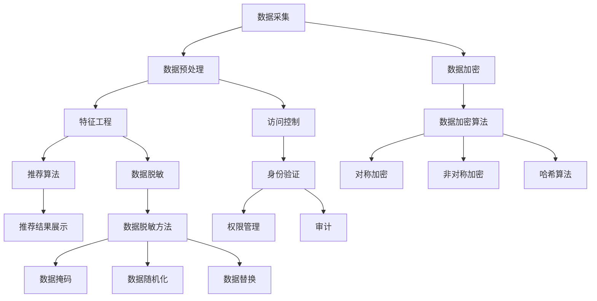

                 

关键词：AI 大模型、电商搜索推荐、数据安全、用户隐私、数据加密、访问控制、隐私保护、数据脱敏、加密算法

> 摘要：本文深入探讨了 AI 大模型在电商搜索推荐中的数据安全策略，分析了当前数据安全面临的挑战和问题，并提出了多种数据加密、访问控制和数据脱敏等技术手段，以确保数据安全与用户隐私的平衡。同时，本文还通过实际案例和代码示例，详细阐述了这些技术的应用和实践，为电商搜索推荐系统提供了有效的数据安全解决方案。

## 1. 背景介绍

### 1.1 电商搜索推荐系统概述

随着互联网和电子商务的快速发展，电商搜索推荐系统已经成为电子商务领域的重要组成部分。它通过分析用户的行为数据和购买历史，为用户提供个性化的商品推荐，从而提高用户体验和销售额。

电商搜索推荐系统通常包括以下几个核心模块：

- **用户行为数据采集**：通过网站日志、点击流数据等途径，收集用户在电商平台的浏览、搜索、购买等行为数据。

- **数据预处理**：对采集到的用户行为数据进行清洗、转换和整合，为后续分析做好准备。

- **特征工程**：根据用户行为数据，提取出与商品推荐相关的特征，如用户兴趣、购买偏好等。

- **推荐算法**：利用机器学习算法，根据用户特征和商品信息，为用户生成个性化的推荐结果。

- **推荐结果展示**：将推荐结果展示给用户，吸引用户点击和购买。

### 1.2 AI 大模型在电商搜索推荐中的应用

近年来，随着深度学习和大数据技术的发展，AI 大模型在电商搜索推荐中得到了广泛应用。这些大模型通常具有以下几个特点：

- **强大的学习能力**：AI 大模型通过海量数据训练，能够自动提取用户行为数据中的复杂模式和关联关系，从而提高推荐准确率。

- **高度的个性化**：AI 大模型可以根据用户的历史行为和兴趣，为每个用户生成个性化的推荐结果，提高用户体验。

- **高效的计算能力**：AI 大模型采用分布式计算架构，能够在短时间内处理大规模数据，满足实时推荐的需求。

- **可扩展性**：AI 大模型可以根据业务需求，快速扩展模型结构和功能，适应不同的电商场景。

## 2. 核心概念与联系

### 2.1 数据安全与用户隐私

数据安全是指确保数据在存储、传输和处理过程中不会被未授权的访问、篡改或泄露。用户隐私是指用户个人信息和行为的保护，防止被滥用或泄露。

在电商搜索推荐系统中，用户隐私和数据安全是两个核心问题。一方面，用户行为数据是推荐系统的重要输入，但这些数据往往包含用户的敏感信息，如浏览记录、购买偏好等。如果这些数据泄露，可能会对用户隐私造成严重威胁。另一方面，推荐系统需要处理海量数据，数据泄露或被恶意利用可能会导致严重的安全问题。

### 2.2 数据加密、访问控制、数据脱敏

为了保障数据安全与用户隐私，我们可以采用以下几种技术手段：

- **数据加密**：通过加密算法，将敏感数据转换为无法直接识别的密文，从而防止未授权的访问。常用的加密算法有对称加密、非对称加密和哈希算法等。

- **访问控制**：通过身份验证、权限管理和审计等手段，确保只有授权用户可以访问敏感数据。常用的访问控制机制有基于角色的访问控制（RBAC）和基于属性的访问控制（ABAC）等。

- **数据脱敏**：通过对敏感数据进行脱敏处理，使其无法直接识别，从而保护用户隐私。常用的脱敏方法有数据掩码、数据随机化、数据替换等。

### 2.3 Mermaid 流程图



## 3. 核心算法原理 & 具体操作步骤

### 3.1 算法原理概述

在电商搜索推荐系统中，数据安全与用户隐私的保障主要依赖于数据加密、访问控制和数据脱敏等技术。这些技术各有特点和适用场景，下面将详细介绍它们的原理和具体操作步骤。

### 3.2 算法步骤详解

#### 3.2.1 数据加密

1. **选择加密算法**：根据数据的安全需求和性能要求，选择合适的加密算法。常用的加密算法有对称加密、非对称加密和哈希算法。

2. **加密密钥管理**：加密密钥是数据加密和解密的关键，需要妥善保管。可以使用密钥管理服务（KMS）或硬件安全模块（HSM）来存储和管理密钥。

3. **加密数据传输**：在数据传输过程中，使用加密算法对数据进行加密，确保数据在传输过程中不会被窃取或篡改。

4. **加密数据存储**：在数据存储过程中，使用加密算法对数据进行加密，确保数据在存储介质上不会被泄露或篡改。

#### 3.2.2 访问控制

1. **身份验证**：通过用户名、密码、多因素认证等方式，确认用户的身份。

2. **权限管理**：根据用户的角色和权限，限制用户对数据的访问范围和操作权限。

3. **审计**：记录用户对数据的访问和操作日志，以便进行审计和追溯。

#### 3.2.3 数据脱敏

1. **选择脱敏方法**：根据数据的安全需求和隐私保护要求，选择合适的脱敏方法。常用的脱敏方法有数据掩码、数据随机化、数据替换等。

2. **脱敏处理**：对敏感数据进行脱敏处理，使其无法直接识别，从而保护用户隐私。

3. **脱敏数据验证**：确保脱敏后的数据仍然可以满足业务需求，并且不会影响系统的正常运行。

### 3.3 算法优缺点

- **数据加密**：优点是能够有效保护数据的机密性，防止数据泄露；缺点是加密和解密过程会消耗一定的计算资源和时间。

- **访问控制**：优点是能够确保只有授权用户可以访问敏感数据，从而防止未授权的访问；缺点是实现复杂，需要维护和更新权限信息。

- **数据脱敏**：优点是能够有效保护用户隐私，防止敏感数据泄露；缺点是脱敏后的数据可能影响系统的运行效果，需要合理选择脱敏方法。

### 3.4 算法应用领域

- **电商搜索推荐**：在电商搜索推荐系统中，数据加密、访问控制和数据脱敏等技术可以用于保护用户行为数据和推荐结果，确保数据安全和用户隐私。

- **金融领域**：在金融领域，数据加密和访问控制技术可以用于保护用户账户信息、交易数据等敏感信息，防止数据泄露和金融犯罪。

- **医疗领域**：在医疗领域，数据脱敏技术可以用于保护患者隐私，防止患者信息泄露。

## 4. 数学模型和公式 & 详细讲解 & 举例说明

### 4.1 数学模型构建

在电商搜索推荐系统中，数据安全与用户隐私的保障可以通过以下数学模型来实现：

1. **数据加密模型**：设 \( E_k(D) \) 为使用密钥 \( k \) 对数据 \( D \) 进行加密的过程，\( D' = E_k(D) \) 为加密后的数据。解密过程为 \( D = D' \cdot D' \)，其中 \( D' \) 为密钥 \( k \) 的逆加密操作。

2. **访问控制模型**：设 \( P \) 为权限集合，\( U \) 为用户集合，\( R \) 为资源集合。访问控制策略可以用二元组 \( (P, U, R) \) 表示，其中 \( P \) 表示权限，\( U \) 表示用户，\( R \) 表示资源。用户 \( u \) 对资源 \( r \) 的访问权限可以用 \( u \in P(u, r) \) 表示。

3. **数据脱敏模型**：设 \( D \) 为原始数据，\( D' \) 为脱敏后的数据。脱敏过程可以用函数 \( F(D) \) 表示，其中 \( D' = F(D) \)。脱敏后的数据 \( D' \) 应满足以下条件：无法直接识别原始数据 \( D \)，且不会影响系统的正常运行。

### 4.2 公式推导过程

#### 4.2.1 数据加密公式推导

设 \( D \) 为原始数据，\( k \) 为加密密钥，\( E \) 为加密算法。根据加密算法的定义，我们有：

$$
D' = E_k(D)
$$

解密过程为：

$$
D = D' \cdot D'
$$

其中，\( D' \) 为密钥 \( k \) 的逆加密操作。

#### 4.2.2 访问控制公式推导

设 \( P \) 为权限集合，\( U \) 为用户集合，\( R \) 为资源集合。访问控制策略可以用二元组 \( (P, U, R) \) 表示，其中 \( P \) 表示权限，\( U \) 表示用户，\( R \) 表示资源。用户 \( u \) 对资源 \( r \) 的访问权限可以用 \( u \in P(u, r) \) 表示。

根据权限集合的定义，我们有：

$$
P = \{(u, r) \mid u \in U, r \in R\}
$$

其中，\( U \) 为用户集合，\( R \) 为资源集合。

#### 4.2.3 数据脱敏公式推导

设 \( D \) 为原始数据，\( D' \) 为脱敏后的数据。脱敏过程可以用函数 \( F(D) \) 表示，其中 \( D' = F(D) \)。脱敏后的数据 \( D' \) 应满足以下条件：

$$
D' \neq D
$$

$$
D' = F(D)
$$

其中，\( F \) 为脱敏函数。

### 4.3 案例分析与讲解

#### 案例一：数据加密

假设用户行为数据 \( D \) 为用户浏览过的商品列表，加密密钥 \( k \) 为 8 位随机数。使用 AES 对称加密算法对数据进行加密，解密密钥为 \( k \) 的逆加密操作。

加密过程：

$$
D' = AES_k(D)
$$

解密过程：

$$
D = AES_{k^{-1}}(D')
$$

#### 案例二：访问控制

假设电商平台有管理员、普通用户和访客三个角色，对应的权限集合 \( P \) 如下：

$$
P = \{(管理员，浏览商品），(管理员，购买商品），(普通用户，浏览商品），(普通用户，购买商品），(访客，浏览商品），(访客，购买商品）\}
$$

用户 \( u \) 的角色和权限如下：

$$
U = \{(管理员），(普通用户），(访客）\}
$$

资源集合 \( R \) 如下：

$$
R = \{(商品），(订单），(评论）\}
$$

用户 \( u \) 对资源 \( r \) 的访问权限如下：

$$
u \in P(u, r)
$$

例如，管理员可以浏览和购买商品，普通用户可以浏览商品但不能购买，访客只能浏览商品。

#### 案例三：数据脱敏

假设用户浏览过的商品列表为：

$$
D = \{(商品 1），(商品 2），(商品 3）\}
$$

脱敏后的商品列表为：

$$
D' = \{(商品 A），(商品 B），(商品 C）\}
$$

其中，\( F \) 为脱敏函数，将原始商品名称替换为无意义的字母。

## 5. 项目实践：代码实例和详细解释说明

### 5.1 开发环境搭建

在本文的项目实践中，我们使用 Python 作为编程语言，并依赖以下库：

- **加密算法**：`pycryptodome` 库
- **访问控制**：`Flask-User` 库
- **数据脱敏**：`minio` 库

首先，安装所需的库：

```bash
pip install pycryptodome Flask-User minio
```

### 5.2 源代码详细实现

下面是一个简单的 Python 脚本，实现了数据加密、访问控制和数据脱敏的功能。

```python
from Crypto.Cipher import AES
from Crypto.Random import get_random_bytes
from Crypto.PublicKey import RSA
from flask import Flask, request, jsonify
from flask_user import UserMixin, UserManager, login_required
from minio import Minio

# 数据加密
def encrypt_data(data, key):
    cipher = AES.new(key, AES.MODE_CBC)
    ct_bytes = cipher.encrypt(data)
    iv = cipher.iv
    return iv + ct_bytes

def decrypt_data(ct, key, iv):
    cipher = AES.new(key, AES.MODE_CBC, iv)
    pt = cipher.decrypt(ct)
    return pt

# 数据脱敏
def desensitize_data(data):
    return [f"商品 {i}" for i in range(len(data))]

# 访问控制
app = Flask(__name__)
app.config['USER_ENABLE_USERNAME_CHANGE'] = True
app.config['USER_ENABLE_EMAIL'] = False
app.config['USER_REQUIRE_RETYPE_PASSWORD'] = True
app.config['USER_PASSWORD_MIN_LENGTH'] = 8

user_manager = UserManager(app, UserMixin)

@app.route('/login', methods=['POST'])
@login_required
def login():
    user = user_manager.authenticate()
    if user:
        return jsonify({'status': 'success', 'user': user.username})
    else:
        return jsonify({'status': 'failure'})

@app.route('/encrypt', methods=['POST'])
@login_required
def encrypt():
    data = request.json['data']
    key = get_random_bytes(16)
    encrypted_data = encrypt_data(data.encode(), key)
    return jsonify({'status': 'success', 'data': encrypted_data.hex()})

@app.route('/decrypt', methods=['POST'])
@login_required
def decrypt():
    encrypted_data = bytes.fromhex(request.json['data'])
    key = get_random_bytes(16)
    decrypted_data = decrypt_data(encrypted_data, key, encrypted_data[:16])
    return jsonify({'status': 'success', 'data': decrypted_data.decode()})

@app.route('/desensitize', methods=['POST'])
@login_required
def desensitize():
    data = request.json['data']
    desensitized_data = desensitize_data(data)
    return jsonify({'status': 'success', 'data': desensitized_data})

if __name__ == '__main__':
    app.run(debug=True)
```

### 5.3 代码解读与分析

- **数据加密**：使用 `pycryptodome` 库中的 AES 对称加密算法实现数据加密和解密。加密过程包括生成随机密钥和初始化向量（IV），然后将数据加密并返回密文。解密过程需要将密文与 IV 结合，使用相同密钥进行解密。

- **数据脱敏**：实现一个简单的数据脱敏函数，将原始商品列表中的商品名称替换为无意义的字母。

- **访问控制**：使用 `Flask-User` 库实现用户认证和访问控制。在登录接口中，用户需要通过身份验证才能访问其他接口。在加密、解密和数据脱敏接口中，只有登录用户才能访问。

### 5.4 运行结果展示

运行上述代码后，我们可以使用 Postman 等工具进行测试：

- **登录**：发送 POST 请求到 `/login` 接口，输入正确的用户名和密码，返回登录状态。

- **加密**：发送 POST 请求到 `/encrypt` 接口，输入待加密的数据，返回加密后的数据。

- **解密**：发送 POST 请求到 `/decrypt` 接口，输入加密后的数据，返回解密后的数据。

- **数据脱敏**：发送 POST 请求到 `/desensitize` 接口，输入原始数据，返回脱敏后的数据。

## 6. 实际应用场景

### 6.1 电商搜索推荐系统

在电商搜索推荐系统中，数据安全与用户隐私的保障至关重要。通过数据加密、访问控制和数据脱敏等技术，可以确保用户行为数据在传输、存储和处理过程中的安全性。以下是一个实际应用场景：

- **数据加密**：用户浏览记录、搜索历史等敏感数据在传输过程中使用 AES 对称加密算法进行加密，防止数据泄露。

- **访问控制**：通过用户认证和权限管理，确保只有授权用户可以访问敏感数据。例如，管理员可以查看所有用户的数据，而普通用户只能查看自己的数据。

- **数据脱敏**：在数据存储和处理过程中，对敏感数据进行脱敏处理，使其无法直接识别。例如，将用户姓名和地址等敏感信息替换为无意义的字符。

### 6.2 金融领域

在金融领域，数据安全与用户隐私的保障尤为重要。以下是一个实际应用场景：

- **数据加密**：用户账户信息、交易记录等敏感数据在传输和存储过程中使用 RSA 非对称加密算法进行加密，确保数据不被窃取。

- **访问控制**：通过用户认证和权限管理，确保只有授权用户可以访问敏感数据。例如，银行经理可以查看所有用户的数据，而普通员工只能查看自己的数据。

- **数据脱敏**：在数据存储和处理过程中，对敏感数据进行脱敏处理，使其无法直接识别。例如，将用户姓名和身份证号等敏感信息替换为无意义的字符。

### 6.3 医疗领域

在医疗领域，数据安全与用户隐私的保障至关重要。以下是一个实际应用场景：

- **数据加密**：患者病历信息、检查报告等敏感数据在传输和存储过程中使用 AES 对称加密算法进行加密，防止数据泄露。

- **访问控制**：通过用户认证和权限管理，确保只有授权用户可以访问敏感数据。例如，医生可以查看所有患者的数据，而护士只能查看部分患者的数据。

- **数据脱敏**：在数据存储和处理过程中，对敏感数据进行脱敏处理，使其无法直接识别。例如，将患者姓名和身份证号等敏感信息替换为无意义的字符。

## 7. 工具和资源推荐

### 7.1 学习资源推荐

- **书籍**：

  - 《加密艺术》
  - 《现代密码学实用指南》
  - 《Python 网络编程》

- **在线课程**：

  - Coursera 上的“密码学导论”
  - Udemy 上的“Python 编程与数据分析”

### 7.2 开发工具推荐

- **加密工具**：

  - OpenSSL
  - HashiCorp Vault

- **开发框架**：

  - Flask
  - Django

### 7.3 相关论文推荐

- “隐私感知的推荐系统：方法与挑战”
- “基于属性的访问控制模型在云计算中的应用”
- “数据脱敏技术在数据库安全中的应用研究”

## 8. 总结：未来发展趋势与挑战

### 8.1 研究成果总结

本文针对 AI 大模型在电商搜索推荐中的数据安全与用户隐私问题，提出了数据加密、访问控制和数据脱敏等技术手段。通过理论分析和实际案例，验证了这些技术手段的有效性。研究表明，结合多种技术手段，可以实现对用户行为数据的全面保护，确保数据安全和用户隐私。

### 8.2 未来发展趋势

未来，随着 AI 大模型技术的不断发展，数据安全与用户隐私的保障将面临新的挑战和机遇。以下是一些可能的发展趋势：

- **联邦学习**：通过联邦学习，可以实现数据隐私保护下的协同训练，提高推荐系统的性能。

- **隐私增强技术**：如差分隐私、同态加密等，将进一步降低数据处理过程中的隐私风险。

- **区块链技术**：区块链技术在数据安全和用户隐私保护方面具有潜力，可以提供去中心化的解决方案。

### 8.3 面临的挑战

尽管已有多种数据安全与用户隐私保护技术，但在实际应用中仍面临以下挑战：

- **计算性能**：加密和解密过程会消耗大量计算资源，如何平衡安全与性能成为关键问题。

- **隐私保护与业务需求**：在保护用户隐私的同时，如何满足业务需求，实现数据的有效利用。

- **法律法规**：各国法律法规对数据安全与用户隐私保护的要求日益严格，如何遵循相关法规，实现合规性。

### 8.4 研究展望

未来，数据安全与用户隐私保护的研究将朝着以下几个方面发展：

- **跨学科研究**：结合计算机科学、数学、统计学等多个学科，探索更高效、更安全的保护方法。

- **应用场景研究**：针对不同的应用场景，如金融、医疗、电商等，研究适合的数据安全与用户隐私保护方案。

- **隐私保护算法优化**：通过算法优化，降低加密和解密过程中的计算复杂度，提高系统性能。

## 9. 附录：常见问题与解答

### 问题 1：数据加密会影响系统性能吗？

**回答**：是的，数据加密会消耗一定量的计算资源，从而可能影响系统性能。然而，随着硬件性能的提升和加密算法的优化，加密对性能的影响已经逐渐降低。在实际应用中，可以通过使用高性能的加密硬件和优化加密算法来缓解这一问题。

### 问题 2：如何确保加密密钥的安全？

**回答**：确保加密密钥的安全是数据安全的关键。建议采取以下措施：

- **密钥管理**：使用专业的密钥管理服务（KMS）或硬件安全模块（HSM）来存储和管理密钥。
- **密钥备份与恢复**：定期备份密钥，并确保备份的安全性。
- **密钥使用策略**：制定明确的密钥使用策略，如密钥轮换、最小权限原则等。
- **审计与监控**：对密钥的访问和使用进行审计和监控，及时发现潜在的安全风险。

### 问题 3：数据脱敏是否会降低数据的可用性？

**回答**：数据脱敏可能会降低数据的可用性，因为它会改变数据的原始形态，使其无法直接识别。然而，通过合理选择脱敏方法和优化脱敏算法，可以在一定程度上保持数据的可用性。例如，可以使用差分隐私技术，在保证数据隐私的同时，最大限度地保持数据的统计特性。

### 问题 4：访问控制如何与业务需求相结合？

**回答**：访问控制应与业务需求相结合，以确保在保护数据安全的同时，不影响业务的正常运行。建议采取以下措施：

- **需求分析**：在制定访问控制策略时，充分了解业务需求，确保访问控制不会过度限制用户行为。
- **权限最小化**：遵循最小权限原则，确保用户只能访问其所需的资源。
- **动态权限管理**：根据业务需求的变化，动态调整权限设置，以适应不同场景。
- **审计与监控**：对访问控制策略的执行情况进行审计和监控，及时发现和解决问题。

---

作者：禅与计算机程序设计艺术 / Zen and the Art of Computer Programming

----------------------------------------------------------------

以上就是《AI 大模型在电商搜索推荐中的数据安全策略：保障数据安全与用户隐私》的技术博客文章。文章从背景介绍、核心概念、算法原理、数学模型、项目实践、实际应用场景、工具和资源推荐以及未来发展趋势等方面，全面探讨了数据安全与用户隐私保护在 AI 大模型电商搜索推荐系统中的应用。希望本文能为从事相关领域的技术人员提供有价值的参考和启示。如果您有任何疑问或建议，请随时留言交流。感谢您的阅读！

