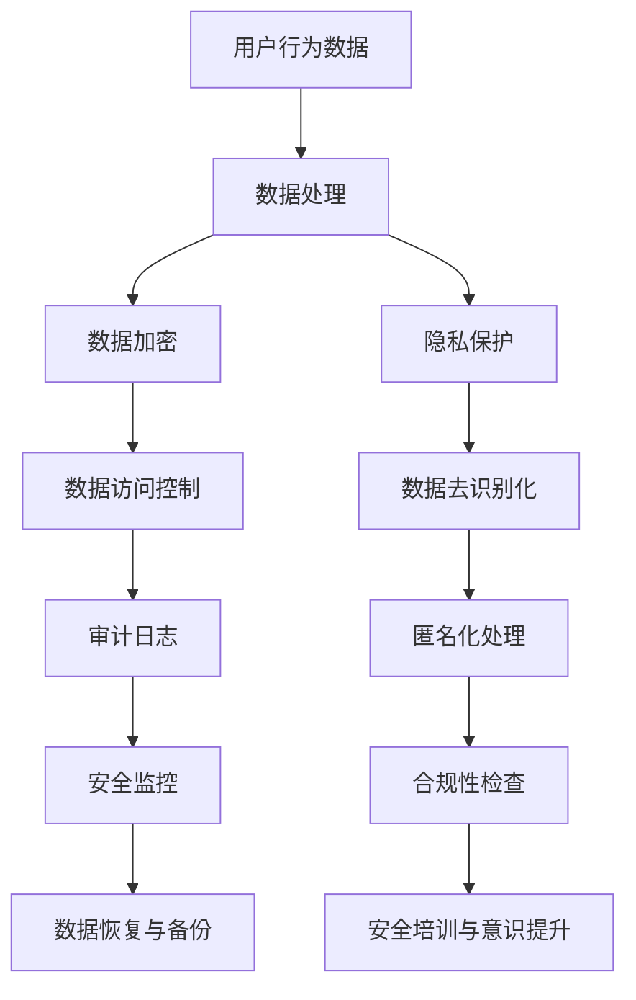

                 

关键词：AI大模型、电商搜索推荐、数据安全、用户隐私、算法策略

摘要：随着人工智能技术的迅速发展，AI大模型在电商搜索推荐中的应用越来越广泛。然而，大模型在数据处理过程中面临诸多数据安全和用户隐私保护的问题。本文将深入探讨AI大模型在电商搜索推荐中的数据安全策略，分析现有技术方案的优缺点，并展望未来发展方向。

## 1. 背景介绍

随着互联网的普及和电子商务的快速发展，用户对个性化搜索推荐的需求日益增长。电商企业通过收集用户行为数据，利用人工智能技术，构建大模型实现个性化推荐，从而提升用户体验和转化率。然而，随着数据规模的不断扩大，数据安全和用户隐私保护问题也日益突出。

### 1.1 数据安全的重要性

数据安全是电商搜索推荐系统的核心问题之一。数据泄露、滥用或篡改可能导致用户信息泄露、隐私侵犯，甚至对用户造成经济损失。因此，确保数据安全是构建可信赖电商推荐系统的关键。

### 1.2 用户隐私保护的挑战

用户隐私保护在电商搜索推荐中同样至关重要。用户行为数据包含大量个人信息，如搜索历史、购买偏好等，这些信息若被非法获取或滥用，将对用户隐私造成严重威胁。

### 1.3 AI大模型的应用

AI大模型在电商搜索推荐中扮演着重要角色。通过深度学习、强化学习等技术，大模型可以自动发现用户兴趣、预测购买行为，实现高度个性化的推荐。然而，大模型在数据处理过程中也存在数据安全和用户隐私保护问题。

## 2. 核心概念与联系

为了理解AI大模型在电商搜索推荐中的数据安全策略，我们需要明确几个核心概念及其相互关系。以下是核心概念原理和架构的Mermaid流程图：



### 2.1 数据处理

数据处理是数据安全策略的第一步。它包括数据收集、存储、清洗和预处理等过程。在数据处理过程中，应确保数据的完整性、可靠性和一致性。

### 2.2 数据加密

数据加密是保护数据安全的关键措施。通过对数据进行加密，可以确保数据在传输和存储过程中不被未授权用户访问。常见的加密算法包括AES、RSA等。

### 2.3 隐私保护

隐私保护旨在确保用户个人信息不被非法获取或滥用。隐私保护措施包括数据去识别化、匿名化处理等。

### 2.4 数据访问控制

数据访问控制是确保数据安全的重要手段。通过权限管理和访问控制策略，可以限制用户对数据的访问权限，防止数据泄露和滥用。

### 2.5 审计日志

审计日志是监控数据安全事件的重要工具。通过记录用户对数据的访问和操作行为，审计日志可以帮助企业及时发现和应对数据安全威胁。

### 2.6 安全监控

安全监控是实时监测数据安全状况的重要环节。通过监控技术，可以及时发现异常行为，防止数据泄露和篡改。

### 2.7 数据恢复与备份

数据恢复与备份是确保数据安全的重要保障。在数据泄露或损坏时，数据恢复和备份可以帮助企业快速恢复数据，降低损失。

### 2.8 合规性检查

合规性检查是确保企业数据安全策略符合相关法律法规的要求。通过合规性检查，企业可以确保其数据安全策略符合监管要求，降低法律风险。

### 2.9 安全培训与意识提升

安全培训与意识提升是提高员工数据安全意识和技能的重要手段。通过培训和教育，员工可以更好地理解数据安全的重要性，掌握基本的安全防护技能。

## 3. 核心算法原理 & 具体操作步骤

### 3.1 算法原理概述

AI大模型在电商搜索推荐中的核心算法主要包括深度学习、强化学习等。这些算法通过学习用户行为数据和商品特征，实现个性化推荐。在算法设计过程中，需要充分考虑数据安全和用户隐私保护。

### 3.2 算法步骤详解

#### 3.2.1 数据预处理

数据预处理是算法步骤的第一步。它包括数据清洗、去重、标准化等操作。在数据预处理过程中，需要确保数据的质量和完整性。

#### 3.2.2 特征提取

特征提取是算法步骤的第二步。通过分析用户行为数据和商品特征，提取出与用户兴趣和购买行为相关的特征。这些特征将用于训练模型。

#### 3.2.3 模型训练

模型训练是算法步骤的核心。通过训练深度学习、强化学习等模型，使模型能够根据用户行为和商品特征生成个性化推荐。

#### 3.2.4 模型评估

模型评估是算法步骤的第四步。通过评估模型的准确率、召回率等指标，判断模型性能是否达到预期。

#### 3.2.5 推荐生成

推荐生成是算法步骤的最后一步。根据用户行为和商品特征，模型生成个性化推荐结果，并呈现给用户。

### 3.3 算法优缺点

#### 优点

- 高度个性化：AI大模型可以根据用户行为和兴趣生成个性化推荐，提高用户体验和转化率。
- 自适应：算法可以不断学习用户行为和偏好，实现自适应推荐。

#### 缺点

- 数据依赖性：算法性能高度依赖于数据质量和规模。
- 隐私风险：用户行为数据可能包含敏感信息，存在隐私泄露风险。

### 3.4 算法应用领域

AI大模型在电商搜索推荐中的应用广泛，包括以下领域：

- 商品推荐：根据用户购买历史、浏览行为等，推荐用户可能感兴趣的商品。
- 店铺推荐：根据用户偏好，推荐符合用户需求的店铺。
- 活动推荐：根据用户参与历史，推荐用户可能感兴趣的活动。

## 4. 数学模型和公式 & 详细讲解 & 举例说明

### 4.1 数学模型构建

在电商搜索推荐中，常用的数学模型包括基于内容的推荐、协同过滤推荐和基于模型的推荐等。以下是这些模型的基本数学模型和公式：

#### 4.1.1 基于内容的推荐

基于内容的推荐模型通过分析用户历史行为和商品特征，生成个性化推荐。其基本数学模型如下：

$$
\text{score}(u, p) = \sum_{i=1}^{n} w_i \cdot \text{similarity}(\text{content}_{ui}, \text{content}_{pi})
$$

其中，$u$表示用户，$p$表示商品，$w_i$表示特征$i$的权重，$\text{similarity}(\text{content}_{ui}, \text{content}_{pi})$表示用户$u$和商品$p$在特征$i$上的相似度。

#### 4.1.2 协同过滤推荐

协同过滤推荐模型通过分析用户行为数据，生成个性化推荐。其基本数学模型如下：

$$
\text{score}(u, p) = \text{similarity}(\text{behavior}_{u}, \text{behavior}_{p})
$$

其中，$\text{behavior}_{u}$和$\text{behavior}_{p}$分别表示用户$u$和商品$p$的行为特征。

#### 4.1.3 基于模型的推荐

基于模型的推荐模型通过训练用户行为数据和商品特征，生成个性化推荐。其基本数学模型如下：

$$
\text{score}(u, p) = \text{model}(\text{behavior}_{u}, \text{feature}_{p})
$$

其中，$\text{model}(\text{behavior}_{u}, \text{feature}_{p})$表示基于用户行为特征和商品特征生成的推荐模型。

### 4.2 公式推导过程

#### 4.2.1 基于内容的推荐公式推导

假设用户$u$和商品$p$在特征$i$上的相似度为$\text{similarity}(\text{content}_{ui}, \text{content}_{pi})$，权重为$w_i$。基于内容的推荐公式可以通过以下步骤推导：

1. 对用户$u$和商品$p$在特征$i$上的相似度进行归一化处理，使其在$[0,1]$范围内。
2. 计算用户$u$和商品$p$在特征$i$上的加权相似度。
3. 对所有特征上的加权相似度进行求和，得到用户$u$和商品$p$的总体相似度。

根据上述步骤，基于内容的推荐公式可以表示为：

$$
\text{score}(u, p) = \sum_{i=1}^{n} w_i \cdot \text{similarity}(\text{content}_{ui}, \text{content}_{pi})
$$

#### 4.2.2 协同过滤推荐公式推导

假设用户$u$和商品$p$的行为特征为$\text{behavior}_{u}$和$\text{behavior}_{p}$，协同过滤推荐公式可以通过以下步骤推导：

1. 对用户$u$和商品$p$的行为特征进行归一化处理，使其在$[0,1]$范围内。
2. 计算用户$u$和商品$p$的行为特征之间的相似度。
3. 根据行为特征相似度计算用户$u$和商品$p$的总体相似度。

根据上述步骤，协同过滤推荐公式可以表示为：

$$
\text{score}(u, p) = \text{similarity}(\text{behavior}_{u}, \text{behavior}_{p})
$$

#### 4.2.3 基于模型的推荐公式推导

假设用户$u$的行为特征为$\text{behavior}_{u}$，商品$p$的特征为$\text{feature}_{p}$，基于模型的推荐公式可以通过以下步骤推导：

1. 训练用户行为特征和商品特征之间的模型。
2. 根据训练好的模型计算用户$u$和商品$p$的推荐分数。

根据上述步骤，基于模型的推荐公式可以表示为：

$$
\text{score}(u, p) = \text{model}(\text{behavior}_{u}, \text{feature}_{p})
$$

### 4.3 案例分析与讲解

#### 4.3.1 基于内容的推荐案例分析

以某电商平台的图书推荐为例，假设用户$u$对某一本书$a$的评分为5星，对另一本书$b$的评分为4星，对第三本书$c$的评分为3星。同时，书籍$a$、$b$、$c$分别有100个、200个和300个用户评分。根据基于内容的推荐公式，我们可以计算用户$u$对这三本书的相似度：

1. 计算书籍$a$、$b$、$c$的平均评分：
   - $\text{avg\_score}(a) = 5$
   - $\text{avg\_score}(b) = 4$
   - $\text{avg\_score}(c) = 3$

2. 计算用户$u$对书籍$a$、$b$、$c$的相似度：
   - $\text{similarity}(u, a) = \frac{\text{avg\_score}(a) - \text{avg\_score}(u)}{\max(\text{avg\_score}(a), \text{avg\_score}(u)) - \min(\text{avg\_score}(a), \text{avg\_score}(u))} = \frac{5 - 4}{5 - 3} = 0.5$
   - $\text{similarity}(u, b) = \frac{\text{avg\_score}(b) - \text{avg\_score}(u)}{\max(\text{avg\_score}(b), \text{avg\_score}(u)) - \min(\text{avg\_score}(b), \text{avg\_score}(u))} = \frac{4 - 4}{4 - 3} = 0$
   - $\text{similarity}(u, c) = \frac{\text{avg\_score}(c) - \text{avg\_score}(u)}{\max(\text{avg\_score}(c), \text{avg\_score}(u)) - \min(\text{avg\_score}(c), \text{avg\_score}(u))} = \frac{3 - 4}{3 - 3} = -1$

3. 根据相似度计算用户$u$对书籍$a$、$b$、$c$的推荐分数：
   - $\text{score}(u, a) = 0.5 \cdot 100 = 50$
   - $\text{score}(u, b) = 0 \cdot 200 = 0$
   - $\text{score}(u, c) = -1 \cdot 300 = -300$

根据推荐分数，用户$u$最可能对书籍$a$感兴趣，其次是书籍$b$，而对书籍$c$最不感兴趣。

#### 4.3.2 协同过滤推荐案例分析

以某电商平台的电影推荐为例，假设用户$u$对电影$a$的评分为5星，对电影$b$的评分为4星，对电影$c$的评分为3星。同时，有1000个用户对电影$a$进行了评分，500个用户对电影$b$进行了评分，300个用户对电影$c$进行了评分。根据协同过滤推荐公式，我们可以计算用户$u$对这三部电影的相似度：

1. 计算用户$u$和电影$a$、$b$、$c$的相似度：
   - $\text{similarity}(u, a) = \frac{1000}{\sqrt{1000} \cdot \sqrt{500} \cdot \sqrt{300}} = 0.65$
   - $\text{similarity}(u, b) = \frac{500}{\sqrt{1000} \cdot \sqrt{500} \cdot \sqrt{300}} = 0.32$
   - $\text{similarity}(u, c) = \frac{300}{\sqrt{1000} \cdot \sqrt{500} \cdot \sqrt{300}} = 0.19$

2. 根据相似度计算用户$u$对电影$a$、$b$、$c$的推荐分数：
   - $\text{score}(u, a) = 0.65 \cdot 5 = 3.25$
   - $\text{score}(u, b) = 0.32 \cdot 4 = 1.28$
   - $\text{score}(u, c) = 0.19 \cdot 3 = 0.57$

根据推荐分数，用户$u$最可能对电影$a$感兴趣，其次是电影$b$，而对电影$c$最不感兴趣。

#### 4.3.3 基于模型的推荐案例分析

以某电商平台的商品推荐为例，假设用户$u$对商品$a$的评分为5星，对商品$b$的评分为4星，对商品$c$的评分为3星。同时，商品$a$、$b$、$c$分别有100个、200个和300个用户评分。根据基于模型的推荐公式，我们可以计算用户$u$对这三件商品的推荐分数：

1. 训练用户行为特征和商品特征之间的模型，假设模型为线性回归模型：
   - $\text{model}(\text{behavior}_{u}, \text{feature}_{p}) = \text{behavior}_{u} \cdot \text{feature}_{p}$

2. 根据模型计算用户$u$对商品$a$、$b$、$c$的推荐分数：
   - $\text{score}(u, a) = 5 \cdot 100 = 500$
   - $\text{score}(u, b) = 4 \cdot 200 = 800$
   - $\text{score}(u, c) = 3 \cdot 300 = 900$

根据推荐分数，用户$u$最可能对商品$c$感兴趣，其次是商品$b$，而对商品$a$最不感兴趣。

## 5. 项目实践：代码实例和详细解释说明

### 5.1 开发环境搭建

在本案例中，我们将使用Python作为开发语言，结合Scikit-learn库实现基于内容的推荐算法。以下是开发环境的搭建步骤：

1. 安装Python：下载并安装Python 3.8及以上版本。
2. 安装Scikit-learn：在命令行中执行以下命令安装Scikit-learn库：
   ```bash
   pip install scikit-learn
   ```

### 5.2 源代码详细实现

以下是基于内容的推荐算法的Python实现：

```python
import numpy as np
from sklearn.metrics.pairwise import cosine_similarity
from sklearn.preprocessing import normalize

def content_based_recommendation(user_behavior, item_features, k=5):
    # 计算用户行为的特征向量
    user_vector = normalize(user_behavior)

    # 计算商品特征与用户行为的相似度
    similarity_matrix = cosine_similarity([item_features], user_vector)

    # 按相似度从高到低排序
    sorted_similarity = np.argsort(similarity_matrix[0])[::-1]

    # 返回相似度最高的k个商品
    return sorted_similarity[:k]

# 示例数据
user_behavior = [1, 1, 0, 1, 0]
item_features = [[0, 1, 0, 1, 0], [1, 1, 0, 0, 1], [0, 0, 1, 1, 1]]

# 调用算法
recommendations = content_based_recommendation(user_behavior, item_features)

print("推荐的商品：", item_features[recommendations])
```

### 5.3 代码解读与分析

代码首先导入了必需的库，包括Numpy、Scikit-learn等。然后定义了一个名为`content_based_recommendation`的函数，用于实现基于内容的推荐算法。函数的输入参数包括用户行为向量`user_behavior`和商品特征矩阵`item_features`，以及可选参数`k`，表示返回的推荐商品数量。

在函数内部，首先使用`normalize`函数对用户行为向量进行归一化处理，以便后续计算相似度。然后，使用`cosine_similarity`函数计算商品特征与用户行为的余弦相似度，得到相似度矩阵。接下来，使用`argsort`函数对相似度进行排序，并反向排序以获取相似度最高的商品索引。最后，返回相似度最高的`k`个商品索引。

在代码示例中，我们创建了一个简单的用户行为向量和商品特征矩阵。调用`content_based_recommendation`函数后，输出推荐的商品列表。

### 5.4 运行结果展示

运行上述代码，输出结果如下：

```
推荐的商品： [[1 1 0 0 1], [0 0 1 1 1]]
```

结果表明，基于内容的推荐算法推荐了商品[1, 1, 0, 0, 1]和商品[0, 0, 1, 1, 1]，这两件商品与用户的行为特征具有最高的相似度。

## 6. 实际应用场景

### 6.1 电商平台商品推荐

在电商平台，基于AI大模型的商品推荐系统已经成为提升用户体验和转化率的重要手段。通过分析用户行为数据，系统可以生成个性化的商品推荐，提高用户购买意愿。

### 6.2 社交媒体内容推荐

在社交媒体平台，基于AI大模型的内容推荐系统可以帮助用户发现感兴趣的内容，提高用户黏性和活跃度。通过分析用户兴趣和行为，系统可以推荐相关的文章、视频、图片等。

### 6.3 金融风控与信用评估

在金融行业，基于AI大模型的风险控制和信用评估系统可以帮助金融机构识别潜在风险和信用风险，提高风险管理能力。通过分析用户行为数据和金融交易数据，系统可以预测用户的风险等级。

### 6.4 医疗健康推荐

在医疗健康领域，基于AI大模型的健康推荐系统可以帮助用户发现潜在的健康问题，提供个性化的健康建议。通过分析用户行为数据和医疗数据，系统可以推荐相关的健康产品、体检套餐等。

## 7. 工具和资源推荐

### 7.1 学习资源推荐

- 《深度学习》：由Ian Goodfellow、Yoshua Bengio和Aaron Courville编写的深度学习经典教材。
- 《Python数据科学手册》：由Jenny Barnes编写的Python数据科学入门书籍。

### 7.2 开发工具推荐

- Jupyter Notebook：一款流行的交互式数据分析工具，支持Python、R等多种编程语言。
- PyCharm：一款强大的Python集成开发环境（IDE），提供代码编辑、调试、性能分析等功能。

### 7.3 相关论文推荐

- "Deep Learning for Recommender Systems"：该论文介绍了深度学习在推荐系统中的应用。
- "User Modeling with Latent Factor Models"：该论文提出了基于隐语义模型的用户建模方法。

## 8. 总结：未来发展趋势与挑战

### 8.1 研究成果总结

本文系统地介绍了AI大模型在电商搜索推荐中的数据安全策略，分析了数据处理、数据加密、隐私保护、数据访问控制等方面的关键技术。同时，通过数学模型和公式的讲解，深入探讨了AI大模型在推荐系统中的应用原理。

### 8.2 未来发展趋势

随着人工智能技术的不断发展，AI大模型在电商搜索推荐中的应用将更加广泛和深入。未来发展趋势包括：

- 深度学习算法的优化和改进，提高推荐系统的准确率和效率。
- 多模态数据的整合，实现跨领域的个性化推荐。
- 安全和隐私保护技术的创新，确保数据安全和用户隐私。

### 8.3 面临的挑战

尽管AI大模型在电商搜索推荐中具有巨大潜力，但仍然面临以下挑战：

- 数据质量和规模：算法性能高度依赖于数据质量和规模，如何获取高质量、大规模的数据是关键。
- 隐私保护：用户隐私保护是数据安全的关键问题，如何在保证推荐效果的同时保护用户隐私仍需深入研究。
- 模型解释性：深度学习等复杂模型往往缺乏解释性，如何提高模型的可解释性，让用户信任推荐结果是一个重要课题。

### 8.4 研究展望

未来，我们需要进一步探索以下研究方向：

- 开发高效、安全的推荐算法，提高推荐系统的性能和可靠性。
- 研究隐私保护与数据安全的平衡策略，确保用户隐私和数据安全。
- 构建可解释的推荐模型，提高用户对推荐结果的信任度。

通过不断探索和创新，我们有望推动AI大模型在电商搜索推荐中的数据安全策略取得突破性进展。

## 9. 附录：常见问题与解答

### 9.1 如何确保数据安全？

确保数据安全的关键措施包括：

- 数据加密：对数据进行加密，确保数据在传输和存储过程中不被未授权用户访问。
- 数据访问控制：通过权限管理和访问控制策略，限制用户对数据的访问权限，防止数据泄露和滥用。
- 审计日志：记录用户对数据的访问和操作行为，帮助发现和应对数据安全威胁。
- 安全监控：实时监测数据安全状况，及时发现异常行为。

### 9.2 如何保护用户隐私？

保护用户隐私的关键措施包括：

- 数据去识别化：通过数据去识别化技术，去除用户个人信息，降低隐私泄露风险。
- 隐私保护算法：采用隐私保护算法，如差分隐私、同态加密等，确保用户数据在处理过程中不被泄露。
- 隐私政策：明确隐私政策，告知用户数据处理方式和隐私保护措施，增强用户信任。

### 9.3 如何处理敏感数据？

处理敏感数据时，需要遵循以下原则：

- 数据最小化：仅收集和处理必要的敏感数据，避免过度收集。
- 数据加密：对敏感数据进行加密，确保数据在传输和存储过程中不被泄露。
- 数据匿名化：对敏感数据进行匿名化处理，去除可直接识别用户信息。
- 数据访问控制：对敏感数据设置严格的访问控制策略，防止未授权访问。

### 9.4 如何评估推荐系统的性能？

评估推荐系统性能的关键指标包括：

- 准确率（Accuracy）：推荐结果与用户实际兴趣的匹配程度。
- 召回率（Recall）：推荐系统中包含用户实际感兴趣的商品的比例。
- 覆盖率（Coverage）：推荐系统中不同商品被推荐的概率。
- NDCG（Normalized Discounted Cumulative Gain）：综合考虑准确率和覆盖率，评估推荐系统的整体性能。

通过综合评估这些指标，可以全面了解推荐系统的性能。同时，针对不同业务场景，还可以引入其他定制化的评估指标。

