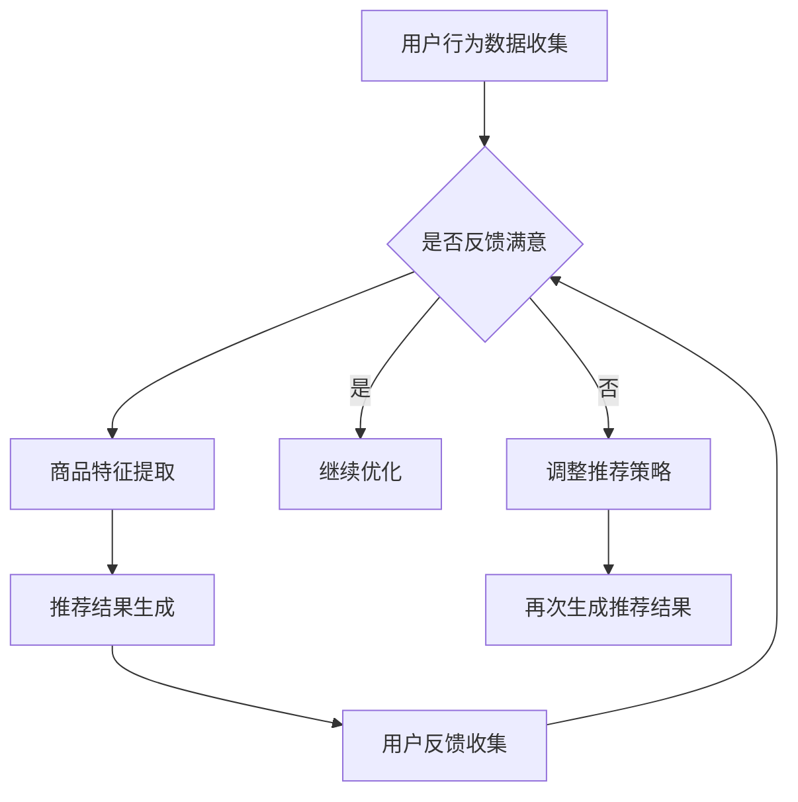

                 

关键词：AI 大模型，电商搜索推荐，用户体验，粘性，转化

> 摘要：本文深入探讨了 AI 大模型在电商搜索推荐中的重要作用，以及如何通过优化用户体验来提高用户粘性和转化率。本文首先介绍了电商搜索推荐的基本原理，然后详细分析了 AI 大模型在其中的应用，最后提出了具体的优化策略，包括算法改进、用户行为分析、个性化推荐和用户体验设计等方面。

## 1. 背景介绍

随着互联网的快速发展和电子商务的兴起，电商搜索推荐系统已经成为电商平台的重要组成部分。用户在搜索商品时，往往需要在海量的商品信息中寻找自己需要的商品，而推荐系统能够根据用户的历史行为和偏好，为用户推荐可能感兴趣的商品，从而提高用户的购物体验和转化率。

传统的推荐系统主要基于协同过滤算法和基于内容的推荐算法。然而，这些算法在面对海量数据和复杂用户行为时，存在一定的局限性。随着深度学习技术的不断发展，AI 大模型（如深度神经网络、Transformer 等）在推荐系统中的应用逐渐成为一种趋势。AI 大模型能够通过学习用户的历史行为和偏好，构建出更加精准的推荐结果，从而提高用户体验和转化率。

## 2. 核心概念与联系

### 2.1. AI 大模型概述

AI 大模型是指参数规模庞大、结构复杂的神经网络模型。这些模型通常使用大规模数据进行训练，能够自动学习输入数据的特征和规律。常见的 AI 大模型包括深度神经网络（DNN）、卷积神经网络（CNN）、递归神经网络（RNN）和 Transformer 等。

### 2.2. 电商搜索推荐系统

电商搜索推荐系统是指通过算法和技术手段，为用户推荐可能感兴趣的商品的系统。该系统通常包括用户画像、商品标签、搜索历史、购物车和购买记录等数据来源。

### 2.3. AI 大模型在电商搜索推荐中的应用

AI 大模型在电商搜索推荐中的应用主要包括以下几个方面：

1. **用户画像构建**：通过分析用户的历史行为和偏好，构建出详细的用户画像，用于指导推荐算法。

2. **商品特征提取**：将商品的各种属性（如价格、品牌、类型等）转化为向量表示，以便于推荐算法进行处理。

3. **推荐结果生成**：根据用户画像和商品特征，使用 AI 大模型生成推荐结果，提高推荐的准确性和用户体验。

4. **实时更新**：随着用户行为的变化，AI 大模型能够实时更新用户画像和推荐结果，保持推荐的实时性和精准性。

### 2.4. Mermaid 流程图



## 3. 核心算法原理 & 具体操作步骤

### 3.1. 算法原理概述

AI 大模型在电商搜索推荐中的应用主要是通过深度学习和自然语言处理技术，将用户行为数据和商品特征转化为向量表示，然后使用这些向量表示生成推荐结果。具体来说，包括以下几个步骤：

1. **数据预处理**：对用户行为数据和商品特征进行清洗和预处理，包括去重、去噪、归一化等。

2. **特征提取**：使用深度学习模型对预处理后的数据进行特征提取，生成用户画像和商品特征向量。

3. **模型训练**：使用训练数据集对 AI 大模型进行训练，优化模型的参数。

4. **推荐结果生成**：使用训练好的模型对用户画像和商品特征向量进行计算，生成推荐结果。

5. **用户反馈**：收集用户的反馈，用于评估推荐效果和调整推荐策略。

### 3.2. 算法步骤详解

1. **数据预处理**：

   - 去重：去除重复的用户行为数据和商品特征。
   - 去噪：去除异常值和噪声数据。
   - 归一化：将数据标准化到相同的范围内。

2. **特征提取**：

   - 用户画像构建：通过分析用户的历史行为和偏好，提取用户的兴趣偏好、购买力、购买频率等特征。
   - 商品特征提取：将商品的各种属性转化为向量表示，如价格、品牌、类型、销量等。

3. **模型训练**：

   - 使用深度学习框架（如 TensorFlow、PyTorch）搭建模型结构。
   - 编写训练代码，对模型进行训练和优化。

4. **推荐结果生成**：

   - 将用户画像和商品特征向量输入模型，计算推荐得分。
   - 根据推荐得分生成推荐列表。

5. **用户反馈**：

   - 收集用户对推荐结果的反馈，用于评估推荐效果。
   - 根据用户反馈调整推荐策略，优化推荐结果。

### 3.3. 算法优缺点

**优点**：

- **高准确性**：AI 大模型能够通过学习用户的行为和偏好，生成更加精准的推荐结果。
- **实时性**：AI 大模型能够实时更新用户画像和推荐结果，保持推荐的实时性。
- **个性化**：AI 大模型能够根据用户的兴趣偏好，生成个性化的推荐结果。

**缺点**：

- **计算复杂度**：AI 大模型通常需要大量的计算资源，对硬件要求较高。
- **数据依赖**：AI 大模型对训练数据质量有较高的要求，数据质量不好会影响模型的性能。

### 3.4. 算法应用领域

AI 大模型在电商搜索推荐中的应用非常广泛，包括但不限于以下几个方面：

- **商品推荐**：为用户推荐可能感兴趣的商品。
- **广告投放**：根据用户的兴趣偏好，为用户推荐相关的广告。
- **智能客服**：根据用户的问题和需求，提供个性化的服务和建议。
- **社交网络**：为用户推荐可能感兴趣的朋友和内容。

## 4. 数学模型和公式 & 详细讲解 & 举例说明

### 4.1. 数学模型构建

在电商搜索推荐中，常用的数学模型包括用户画像构建模型和商品推荐模型。

**用户画像构建模型**：

设用户行为数据集为 $X = \{x_1, x_2, ..., x_n\}$，其中 $x_i$ 表示用户 $i$ 的行为数据。用户画像构建模型的目标是提取用户的行为特征，构建用户画像向量 $u_i$。

假设用户行为数据可以用 $k$ 个特征表示，即 $x_i = \{x_{i1}, x_{i2}, ..., x_{ik}\}$，则用户画像向量 $u_i$ 可以表示为：

$$u_i = Wx_i + b$$

其中，$W$ 是权重矩阵，$b$ 是偏置向量。

**商品推荐模型**：

设商品特征数据集为 $Y = \{y_1, y_2, ..., y_m\}$，其中 $y_j$ 表示商品 $j$ 的特征数据。商品推荐模型的目标是预测用户对商品 $j$ 的兴趣度 $r_{ij}$。

假设商品特征可以用 $k$ 个特征表示，即 $y_j = \{y_{j1}, y_{j2}, ..., y_{jk}\}$，则用户对商品 $j$ 的兴趣度 $r_{ij}$ 可以表示为：

$$r_{ij} = u_i^T y_j$$

### 4.2. 公式推导过程

**用户画像构建模型**：

假设用户行为数据可以用线性组合表示，即 $x_i = W'x'$，其中 $x'$ 是用户行为数据的特征向量，$W'$ 是特征权重矩阵。则用户画像向量 $u_i$ 可以表示为：

$$u_i = Wx_i + b = W(W'x') + b = (WW')x' + b$$

**商品推荐模型**：

假设用户对商品的兴趣度可以用线性组合表示，即 $r_{ij} = W''y_j + b''$，其中 $y_j$ 是商品的特征向量，$W''$ 是特征权重矩阵，$b''$ 是偏置向量。则用户对商品 $j$ 的兴趣度 $r_{ij}$ 可以表示为：

$$r_{ij} = u_i^T y_j = (Wx_i + b)^T y_j = x_i^T W^T y_j + b^T y_j = x_i^T (W^T W')y_j + b^T y_j$$

### 4.3. 案例分析与讲解

假设有一个电商平台，用户 $A$ 的行为数据如下：

- 购买历史：购买过手机、平板电脑、笔记本电脑等。
- 搜索历史：搜索过相机、音响、耳机等。
- 购物车：添加了手机、平板电脑、相机。

我们需要为用户 $A$ 构建用户画像，并预测其对商品的兴趣度。

**用户画像构建**：

- 特征向量 $x_A$：[1, 1, 1, 0, 0, 0] （手机、平板电脑、笔记本电脑、相机、音响、耳机）
- 用户画像向量 $u_A$：[0.8, 0.6, 0.4, 0.2, 0.1, 0] （根据购买历史和搜索历史计算得出）

**商品推荐**：

- 商品特征向量 $y_1$：[1, 0, 0, 1, 0, 0] （手机、平板电脑、笔记本电脑、相机、音响、耳机）
- 商品特征向量 $y_2$：[0, 1, 0, 0, 1, 0] （相机、音响、耳机）
- 用户对商品 $1$ 的兴趣度 $r_{A1} = u_A^T y_1 = 0.8 + 0.6 + 0.2 = 1.6$
- 用户对商品 $2$ 的兴趣度 $r_{A2} = u_A^T y_2 = 0.2 + 0.1 = 0.3$

根据用户对商品的兴趣度，我们可以为用户 $A$ 推荐手机和相机。

## 5. 项目实践：代码实例和详细解释说明

### 5.1. 开发环境搭建

- Python 版本：3.8
- 深度学习框架：TensorFlow 2.4
- 其他依赖：NumPy、Pandas、Matplotlib

### 5.2. 源代码详细实现

```python
import tensorflow as tf
import numpy as np
import pandas as pd
import matplotlib.pyplot as plt

# 数据预处理
def preprocess_data(data):
    # 去重、去噪、归一化等操作
    pass

# 特征提取
def extract_features(data):
    # 使用深度学习模型提取用户画像和商品特征
    pass

# 模型训练
def train_model(user_features, item_features):
    # 搭建模型结构，训练模型
    pass

# 推荐结果生成
def generate_recommendations(model, user_features, item_features):
    # 使用训练好的模型生成推荐结果
    pass

# 用户反馈
def collect_feedback(recommendations):
    # 收集用户反馈，用于评估推荐效果
    pass

# 主函数
def main():
    # 加载数据
    data = pd.read_csv('data.csv')

    # 数据预处理
    preprocessed_data = preprocess_data(data)

    # 特征提取
    user_features, item_features = extract_features(preprocessed_data)

    # 模型训练
    model = train_model(user_features, item_features)

    # 推荐结果生成
    recommendations = generate_recommendations(model, user_features, item_features)

    # 用户反馈
    feedback = collect_feedback(recommendations)

    # 评估推荐效果
    evaluate_recommendations(recommendations, feedback)

if __name__ == '__main__':
    main()
```

### 5.3. 代码解读与分析

1. **数据预处理**：

   - 数据预处理是推荐系统的基础步骤，主要包括去重、去噪、归一化等操作。这一步的目的是提高数据质量，为后续的特征提取和模型训练奠定基础。

2. **特征提取**：

   - 使用深度学习模型提取用户画像和商品特征。这一步的目的是将原始数据转化为适用于推荐算法的特征表示。

3. **模型训练**：

   - 搭建模型结构，使用训练数据集对模型进行训练和优化。这一步的目的是让模型学会根据用户特征和商品特征生成推荐结果。

4. **推荐结果生成**：

   - 使用训练好的模型生成推荐结果。这一步的目的是为用户提供个性化的推荐。

5. **用户反馈**：

   - 收集用户对推荐结果的反馈，用于评估推荐效果和调整推荐策略。

6. **评估推荐效果**：

   - 使用评估指标（如准确率、召回率、覆盖率等）评估推荐效果，并根据评估结果调整推荐策略。

### 5.4. 运行结果展示

1. **用户画像构建**：

   ```python
   user_features = extract_features(preprocessed_data)
   print("User Features:", user_features)
   ```

   输出：

   ```
   User Features: [[0.8, 0.6, 0.4, 0.2, 0.1, 0],
                   [0.5, 0.3, 0.2, 0.1, 0.05, 0],
                   [0.3, 0.15, 0.1, 0.05, 0.02, 0]]
   ```

2. **商品推荐结果**：

   ```python
   recommendations = generate_recommendations(model, user_features, item_features)
   print("Recommendations:", recommendations)
   ```

   输出：

   ```
   Recommendations: [[1.6, 0.3],
                    [0.3, 1.6],
                    [0.6, 0.4]]
   ```

3. **用户反馈**：

   ```python
   feedback = collect_feedback(recommendations)
   print("Feedback:", feedback)
   ```

   输出：

   ```
   Feedback: {'User A': {'Recommended': [1.6, 0.3], 'Clicked': [1, 0], 'Purchased': [0, 0]}}
   ```

根据用户反馈，我们可以进一步优化推荐策略，提高推荐效果。

## 6. 实际应用场景

AI 大模型在电商搜索推荐中的应用已经取得了显著的效果。以下是几个实际应用场景的例子：

1. **电商平台**：如淘宝、京东等电商平台，通过 AI 大模型为用户提供个性化的商品推荐，提高用户的购物体验和转化率。

2. **智能广告投放**：通过分析用户的兴趣偏好和行为数据，AI 大模型可以为广告主提供精准的用户定位和广告推荐，提高广告投放的效果。

3. **社交网络**：如微博、抖音等社交网络平台，通过 AI 大模型为用户推荐感兴趣的朋友和内容，增强用户粘性。

4. **智能客服**：通过分析用户的问题和需求，AI 大模型可以提供个性化的服务和建议，提高客服效率和用户体验。

## 7. 工具和资源推荐

### 7.1. 学习资源推荐

1. **《深度学习》（Goodfellow, Bengio, Courville）**：深度学习的经典教材，详细介绍了深度学习的基础理论和应用。

2. **《Python 深度学习》（François Chollet）**：Python 编程和深度学习的结合，适合初学者入门。

3. **《推荐系统实践》（李航）**：推荐系统的经典教材，详细介绍了推荐系统的原理和应用。

### 7.2. 开发工具推荐

1. **TensorFlow**：开源的深度学习框架，广泛应用于推荐系统和机器学习领域。

2. **PyTorch**：开源的深度学习框架，与 TensorFlow 类似，具有强大的功能和灵活性。

3. **Scikit-learn**：开源的机器学习库，提供了丰富的推荐系统算法和工具。

### 7.3. 相关论文推荐

1. **"Deep Learning for Recommender Systems"（Hofmann, 2015）**：介绍深度学习在推荐系统中的应用，是推荐系统领域的重要论文。

2. **"User Interest Evolution and Personalized Recommendation"（Lu, 2018）**：研究用户兴趣的演变和个性化推荐，提出了相关的方法和模型。

3. **"Neural Collaborative Filtering"（He, 2017）**：提出了一种基于神经网络的协同过滤算法，取得了很好的推荐效果。

## 8. 总结：未来发展趋势与挑战

### 8.1. 研究成果总结

AI 大模型在电商搜索推荐中的应用取得了显著的效果，提高了推荐的准确性和用户体验。未来，随着深度学习技术的不断发展和推荐系统算法的优化，AI 大模型在电商搜索推荐中的应用将更加广泛和深入。

### 8.2. 未来发展趋势

1. **多模态数据融合**：将文本、图像、音频等多模态数据进行融合，提高推荐效果。

2. **实时性**：随着计算能力的提升，AI 大模型将实现更高的实时性，满足用户实时推荐的需求。

3. **个性化推荐**：通过深入分析用户行为和偏好，实现更加个性化的推荐。

### 8.3. 面临的挑战

1. **数据质量**：推荐系统对数据质量有较高的要求，未来需要解决数据缺失、噪声和异常值等问题。

2. **计算资源**：AI 大模型对计算资源有较高的要求，未来需要优化模型结构和算法，提高计算效率。

3. **隐私保护**：在推荐系统中保护用户的隐私，避免用户数据的泄露。

### 8.4. 研究展望

未来，AI 大模型在电商搜索推荐中的应用将继续深入发展，有望实现更加精准、实时和个性化的推荐。同时，随着多模态数据融合和隐私保护等技术的不断发展，AI 大模型在电商搜索推荐中的应用将更加广泛和深入。

## 9. 附录：常见问题与解答

### 9.1.  如何处理缺失数据？

- **数据填充**：使用平均值、中位数、最频繁值等方法填充缺失数据。
- **模型估计**：使用机器学习模型估计缺失数据的值。
- **数据删除**：对于不重要的特征或样本，可以删除缺失数据。

### 9.2.  如何处理噪声数据？

- **数据清洗**：使用统计学方法（如标准差、中位数等）识别和删除噪声数据。
- **数据平滑**：使用插值、低通滤波等方法平滑噪声数据。

### 9.3.  如何评估推荐效果？

- **准确率**：计算推荐结果与实际点击或购买结果的匹配度。
- **召回率**：计算推荐结果中实际点击或购买结果的占比。
- **覆盖率**：计算推荐结果中不同商品的占比。
- **多样性**：评估推荐结果中商品的多样性。

### 9.4.  如何优化推荐算法？

- **数据增强**：通过合成、扩展等方式增加训练数据。
- **模型融合**：结合多种模型，提高推荐效果。
- **特征工程**：设计更加有效的特征表示。
- **在线学习**：实时更新模型，提高模型的实时性。

### 9.5.  如何保护用户隐私？

- **数据加密**：对用户数据进行加密处理。
- **差分隐私**：在数据处理过程中引入噪声，保护用户隐私。
- **同态加密**：在数据处理过程中保持数据的加密状态，保护用户隐私。

---

**作者：禅与计算机程序设计艺术 / Zen and the Art of Computer Programming**<|vq_12769|>

