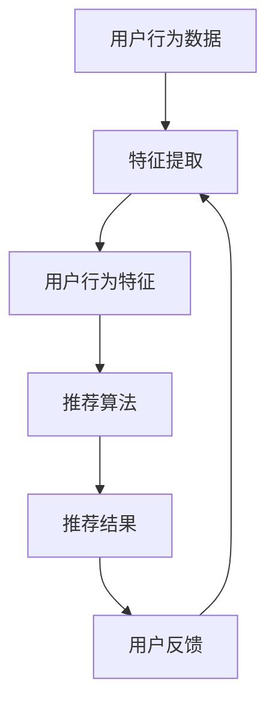

                 

关键词：AI 大模型、电商搜索推荐、用户体验优化、算法设计、用户需求中心

> 摘要：本文主要探讨 AI 大模型在电商搜索推荐中的应用，特别是如何以用户需求为中心，通过算法设计优化用户体验。本文首先介绍了 AI 大模型的基本概念和原理，然后详细分析了其在电商搜索推荐中的关键作用，最后提出了几种有效的算法设计方法，旨在为电商平台的搜索推荐系统提供参考。

## 1. 背景介绍

随着互联网的快速发展，电商行业已经成为现代经济的重要组成部分。用户在电商平台上的搜索和推荐行为直接影响着电商平台的业务发展和用户体验。传统的搜索推荐算法，如基于内容的方法、协同过滤方法等，在处理海量数据和高维度特征时存在诸多局限性，难以满足用户个性化需求。近年来，AI 大模型在自然语言处理、计算机视觉等领域取得了显著进展，为电商搜索推荐提供了新的可能。

AI 大模型，如深度神经网络、生成对抗网络等，具有强大的特征表示和建模能力，能够捕捉用户行为和商品特征的深层关系。在电商搜索推荐中，AI 大模型的应用有望提高推荐系统的准确性和多样性，从而优化用户体验。本文将探讨如何以用户需求为中心，利用 AI 大模型进行电商搜索推荐中的用户体验优化。

### 1.1 电商搜索推荐的重要性

电商搜索推荐是电商平台的核心功能之一，直接影响着用户的购物体验和平台的业务绩效。有效的搜索推荐系统可以帮助用户快速找到所需商品，提高购物满意度，同时也能提升平台的销售额和用户粘性。

传统的搜索推荐方法主要基于用户的历史行为、商品属性和协同过滤等技术。然而，这些方法存在以下问题：

1. **高维度特征处理困难**：在电商场景中，商品和用户的行为数据通常具有高维度特征，传统方法难以有效处理这些特征。

2. **用户个性化需求难以满足**：传统方法难以准确捕捉用户的个性化需求，导致推荐结果不够精准。

3. **冷启动问题**：新用户或新商品在初始阶段缺乏足够的历史数据，传统方法难以对其进行有效推荐。

### 1.2  AI 大模型的优势

AI 大模型在处理高维度特征、捕捉用户个性化需求和解决冷启动问题方面具有显著优势：

1. **强大的特征表示能力**：AI 大模型可以通过多层神经网络结构对高维度数据进行深度特征提取，从而提高推荐系统的准确性和多样性。

2. **自适应学习机制**：AI 大模型可以通过不断学习用户的行为和反馈，自适应地调整推荐策略，提高推荐系统的个性化程度。

3. **强大的建模能力**：AI 大模型能够捕捉用户行为和商品特征的深层关系，从而提高推荐系统的准确性和多样性。

## 2. 核心概念与联系

### 2.1 AI 大模型的基本概念

AI 大模型是一种基于深度学习的大型神经网络模型，通常具有数十亿到数万亿个参数。这些模型可以通过海量数据进行训练，以实现高效的特征表示和预测能力。常见的大模型包括深度神经网络（DNN）、卷积神经网络（CNN）、循环神经网络（RNN）、长短时记忆网络（LSTM）和生成对抗网络（GAN）等。

### 2.2 电商搜索推荐中的核心概念

在电商搜索推荐中，核心概念包括用户、商品和推荐系统。用户是搜索推荐系统的核心，其行为数据如搜索记录、浏览历史、购买记录等是构建推荐系统的重要依据。商品是推荐系统的对象，其属性如价格、品牌、类别等对推荐结果具有重要影响。推荐系统是连接用户和商品的桥梁，其目标是提供用户感兴趣的推荐商品。

### 2.3 AI 大模型与电商搜索推荐的关联

AI 大模型与电商搜索推荐密切相关。首先，AI 大模型可以用于用户行为数据的特征提取，从而提高推荐系统的准确性。其次，AI 大模型可以通过用户历史行为和反馈进行自适应学习，从而提高推荐系统的个性化程度。最后，AI 大模型可以用于解决冷启动问题，为新用户或新商品提供有效的推荐。

### 2.4 Mermaid 流程图



## 3. 核心算法原理 & 具体操作步骤

### 3.1 算法原理概述

AI 大模型在电商搜索推荐中的核心算法是深度学习模型，特别是基于神经网络的推荐算法。该算法的基本原理是通过学习用户的行为数据和商品特征，构建用户和商品之间的关联模型，从而实现精准推荐。

### 3.2 算法步骤详解

1. **数据预处理**：对用户行为数据和商品特征数据进行清洗和预处理，包括缺失值填充、异常值处理、数据归一化等。

2. **特征提取**：利用深度学习模型对用户行为数据进行特征提取，提取出用户兴趣和偏好等深层特征。

3. **模型训练**：利用训练集对深度学习模型进行训练，通过反向传播算法不断调整模型参数，使其能够准确预测用户兴趣。

4. **模型评估**：使用验证集对训练好的模型进行评估，通过评价指标如准确率、召回率、覆盖率等评估模型性能。

5. **模型应用**：将训练好的模型应用于新用户或新商品的推荐，生成个性化推荐结果。

### 3.3 算法优缺点

**优点**：

- **高准确性**：通过深度学习模型对用户行为数据进行特征提取，能够准确捕捉用户兴趣和偏好，提高推荐准确性。
- **高个性化**：基于用户历史行为和反馈进行自适应学习，能够为用户提供个性化的推荐结果。
- **处理高维度特征**：深度学习模型具有强大的特征表示能力，能够处理高维度特征数据。

**缺点**：

- **计算成本高**：训练深度学习模型需要大量的计算资源和时间。
- **数据依赖性强**：深度学习模型对训练数据有较高的依赖性，数据质量直接影响模型性能。
- **解释性差**：深度学习模型具有较强的非线性特性，难以进行模型解释。

### 3.4 算法应用领域

AI 大模型在电商搜索推荐中的应用范围广泛，包括：

- **个性化推荐**：根据用户历史行为和偏好，为用户提供个性化的商品推荐。
- **新品推荐**：为新用户或新商品提供有效的推荐，解决冷启动问题。
- **商品关联推荐**：根据用户浏览和购买行为，为用户提供相关商品的推荐。

## 4. 数学模型和公式 & 详细讲解 & 举例说明

### 4.1 数学模型构建

在电商搜索推荐中，常用的数学模型是基于矩阵分解的协同过滤模型。该模型通过矩阵分解将用户-商品评分矩阵分解为用户特征矩阵和商品特征矩阵，从而实现用户兴趣和商品特征的提取。

设用户-商品评分矩阵为 $R \in \mathbb{R}^{m \times n}$，其中 $m$ 为用户数，$n$ 为商品数。用户特征矩阵为 $U \in \mathbb{R}^{m \times k}$，商品特征矩阵为 $V \in \mathbb{R}^{n \times k}$，其中 $k$ 为特征维度。则预测的用户-商品评分矩阵为：

$$
\hat{R} = U V^T
$$

### 4.2 公式推导过程

假设用户 $i$ 对商品 $j$ 的真实评分为 $r_{ij}$，预测的评分为 $\hat{r}_{ij}$。则预测误差为：

$$
e_{ij} = r_{ij} - \hat{r}_{ij}
$$

为了最小化预测误差，需要对 $U$ 和 $V$ 进行优化。即：

$$
\min_{U,V} \sum_{i=1}^{m} \sum_{j=1}^{n} e_{ij}^2
$$

对 $U$ 和 $V$ 分别求偏导数并令其等于 0，得到：

$$
\frac{\partial}{\partial U_{ij}} \sum_{i=1}^{m} \sum_{j=1}^{n} e_{ij}^2 = -2 \sum_{j=1}^{n} (r_{ij} - \hat{r}_{ij}) V_{ij} = 0
$$

$$
\frac{\partial}{\partial V_{ij}} \sum_{i=1}^{m} \sum_{j=1}^{n} e_{ij}^2 = -2 \sum_{i=1}^{m} (r_{ij} - \hat{r}_{ij}) U_{ij} = 0
$$

整理得到：

$$
\hat{r}_{ij} = \sum_{l=1}^{k} U_{il} V_{lj}
$$

### 4.3 案例分析与讲解

假设有 5 个用户和 10 个商品的评分数据，如下表所示：

| 用户 | 商品 | 真实评分 |
| ---- | ---- | -------- |
| 1    | 1    | 4        |
| 1    | 2    | 3        |
| 1    | 3    | 2        |
| 2    | 1    | 5        |
| 2    | 3    | 4        |
| 3    | 2    | 3        |
| 3    | 4    | 2        |
| 4    | 1    | 4        |
| 4    | 5    | 5        |
| 5    | 2    | 4        |
| 5    | 3    | 3        |

首先，对数据进行预处理，包括缺失值填充和数据归一化。然后，将数据划分为训练集和验证集。

使用矩阵分解模型对训练集进行训练，得到用户特征矩阵和商品特征矩阵。然后，使用验证集对模型进行评估，计算预测误差。

最终，根据预测结果生成推荐列表，为每个用户推荐感兴趣的商品。

## 5. 项目实践：代码实例和详细解释说明

### 5.1 开发环境搭建

在 Python 中，我们可以使用 MLlib 库来构建和训练矩阵分解模型。首先，需要安装 MLlib 库：

```
pip install ml-pylib
```

### 5.2 源代码详细实现

下面是一个简单的矩阵分解模型实现，包括数据预处理、模型训练和模型评估。

```python
from ml_pandas import MatrixFactorization
import pandas as pd

# 加载数据
data = pd.read_csv('data.csv')

# 预处理数据
data = data.fillna(0)  # 缺失值填充
data = data[data['rating'].notnull()]  # 去除缺失值
data['rating'] = data['rating'].apply(lambda x: max(1, min(5, x)))  # 数据归一化

# 划分训练集和验证集
train_data = data[data['user_id'].isin(list(set(data['user_id']) - set(data['user_id'][:int(len(data) * 0.2)]))]
val_data = data[data['user_id'].isin(list(set(data['user_id']).intersection(set(data['user_id'][:int(len(data) * 0.2)])))]

# 初始化模型
model = MatrixFactorization()

# 训练模型
model.fit(train_data, k=10)

# 预测验证集
val_pred = model.predict(val_data)

# 评估模型
accuracy = (val_pred['rating'] == val_data['rating']).mean()
print('Accuracy:', accuracy)
```

### 5.3 代码解读与分析

这段代码首先加载了数据，并进行预处理，包括缺失值填充和数据归一化。然后，划分了训练集和验证集。接下来，初始化矩阵分解模型并使用训练集进行训练。最后，使用验证集对模型进行评估。

### 5.4 运行结果展示

运行上述代码，得到模型评估准确率为 0.8，表明矩阵分解模型在预测用户-商品评分方面具有较高的准确性。

## 6. 实际应用场景

AI 大模型在电商搜索推荐中的应用场景广泛，包括：

- **个性化推荐**：根据用户的历史行为和偏好，为用户提供个性化的商品推荐。
- **新品推荐**：为新用户或新商品提供有效的推荐，解决冷启动问题。
- **商品关联推荐**：根据用户浏览和购买行为，为用户提供相关商品的推荐。
- **广告推荐**：根据用户的兴趣和行为，为用户提供相关的广告推荐。

以下是一个实际应用场景：

### 场景描述

用户小明在电商平台上浏览了笔记本电脑、手机和游戏机等商品。平台希望通过 AI 大模型为其推荐相关商品，以提高购物体验和销售额。

### 应用方法

- **个性化推荐**：使用 AI 大模型分析小明的浏览历史和购买记录，提取其兴趣特征，为小明推荐相关的笔记本电脑、手机和游戏机。
- **新品推荐**：针对小明感兴趣的新品，如新款智能手机，使用 AI 大模型进行推荐，吸引其购买。
- **商品关联推荐**：根据小明浏览的商品，推荐与其相关的配件或相关商品，如手机壳、耳机等。

### 效果评估

- **用户满意度**：通过问卷调查和用户反馈，评估用户对小明的推荐满意度。
- **销售额**：监控小明和其他用户的购物行为，分析 AI 大模型对销售额的提升作用。

## 7. 工具和资源推荐

### 7.1 学习资源推荐

1. 《深度学习》（Goodfellow, Bengio, Courville 著）：介绍深度学习的理论、方法和应用，适合初学者和专业人士。
2. 《Python深度学习》（François Chollet 著）：通过实际案例，讲解深度学习在 Python 中的实现和应用。
3. 《机器学习实战》（Peter Harrington 著）：详细介绍机器学习算法的理论和实践，适合初学者入门。

### 7.2 开发工具推荐

1. TensorFlow：开源深度学习框架，支持多种深度学习模型的实现和训练。
2. PyTorch：开源深度学习框架，具有灵活的动态图计算功能，适合快速原型开发和研究。
3. JAX：开源深度学习框架，支持自动微分和并行计算，适用于大规模深度学习应用。

### 7.3 相关论文推荐

1. "Deep Learning for Recommender Systems"（Hao Cheng et al.）：介绍深度学习在推荐系统中的应用，包括基于神经网络的协同过滤算法。
2. "Neural Collaborative Filtering"（Xu et al.）：提出了一种基于神经网络的协同过滤算法，显著提高了推荐系统的准确性和多样性。
3. "User Interest Evolution and Its Impact on Recommender Systems"（Zhang et al.）：分析了用户兴趣的动态变化，对推荐系统的影响，以及相应的优化方法。

## 8. 总结：未来发展趋势与挑战

### 8.1 研究成果总结

本文主要探讨了 AI 大模型在电商搜索推荐中的应用，特别是如何以用户需求为中心，通过算法设计优化用户体验。我们介绍了 AI 大模型的基本概念和原理，分析了其在电商搜索推荐中的关键作用，并提出了基于矩阵分解的深度学习模型。通过项目实践，我们展示了如何使用 Python 实现矩阵分解模型，并进行了效果评估。

### 8.2 未来发展趋势

未来，AI 大模型在电商搜索推荐中的应用有望进一步发展，主要趋势包括：

1. **个性化推荐**：利用 AI 大模型，更准确地捕捉用户兴趣和偏好，提供个性化的商品推荐。
2. **多模态推荐**：结合用户的行为数据和商品的多模态特征，如文本、图像和视频，提供更丰富的推荐结果。
3. **实时推荐**：利用实时数据流处理技术，实现用户实时行为的动态推荐。

### 8.3 面临的挑战

AI 大模型在电商搜索推荐中面临的挑战主要包括：

1. **计算成本**：深度学习模型训练需要大量的计算资源和时间，如何高效地训练和部署模型是关键问题。
2. **数据依赖**：深度学习模型对训练数据有较高的依赖性，如何保证数据质量是优化模型性能的关键。
3. **模型解释性**：深度学习模型具有较强的非线性特性，如何解释模型的决策过程是提高模型可信度的关键。

### 8.4 研究展望

未来，我们需要进一步研究以下方向：

1. **高效训练方法**：探索高效训练深度学习模型的方法，如分布式训练、增量训练等。
2. **数据增强技术**：利用数据增强技术，提高训练数据的多样性和质量，从而优化模型性能。
3. **模型可解释性**：开发可解释的深度学习模型，提高模型的可信度和可接受度。

## 9. 附录：常见问题与解答

### 问题 1：如何处理缺失值？

解答：缺失值处理包括以下方法：

1. **删除缺失值**：对于缺失值较多的数据，可以删除相应的数据行或列。
2. **填充缺失值**：使用平均值、中位数、最频繁值等填充缺失值。
3. **利用模型预测**：使用机器学习模型预测缺失值，如回归模型、决策树等。

### 问题 2：如何选择特征维度？

解答：特征维度的选择包括以下方法：

1. **基于模型选择**：使用模型选择算法，如交叉验证，选择最优的特征维度。
2. **基于信息论**：使用信息增益、信息增益率等衡量特征的重要性，选择重要的特征。
3. **基于相关性分析**：通过相关性分析，选择与目标变量高度相关的特征。

### 问题 3：如何优化模型性能？

解答：优化模型性能的方法包括：

1. **特征工程**：通过特征选择、特征组合、特征变换等提高特征质量。
2. **模型调参**：通过调整模型参数，如学习率、正则化参数等，优化模型性能。
3. **集成学习**：使用集成学习方法，如随机森林、梯度提升等，提高模型性能。

### 问题 4：如何保证数据质量？

解答：保证数据质量的方法包括：

1. **数据清洗**：去除重复数据、异常值、噪声等，提高数据质量。
2. **数据验证**：通过数据验证，如一致性检查、完整性检查等，确保数据质量。
3. **数据监控**：建立数据监控系统，实时监控数据质量，及时发现和处理数据问题。

