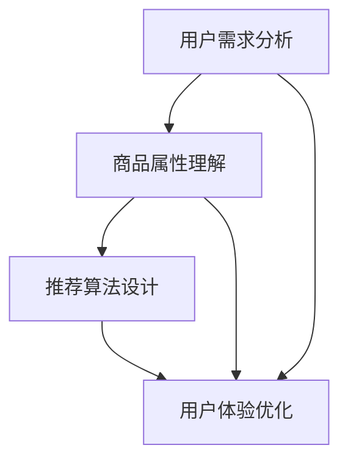

                 

 > **关键词**：电商搜索推荐、AI 大模型、用户体验优化、用户需求、设计、算法、数学模型、实践、应用场景、展望。

> **摘要**：本文将探讨 AI 大模型在电商搜索推荐中的应用，以及如何以用户需求为中心进行用户体验优化。通过深入分析核心概念、算法原理、数学模型以及实践应用，我们将展示如何在电商搜索推荐系统中实现高效的用户需求满足和用户体验提升。

## 1. 背景介绍

在当今快速发展的电子商务市场中，搜索推荐系统已成为电商企业吸引和留住客户的重要手段。传统的推荐算法通常基于商品属性和用户历史行为，但这些方法往往忽略了用户的个性化需求。随着人工智能技术的进步，尤其是大模型的广泛应用，电商搜索推荐系统迎来了新的发展机遇。本文旨在探讨如何利用 AI 大模型，以用户需求为中心，优化电商搜索推荐系统的用户体验。

### 1.1 电商搜索推荐的重要性

电商搜索推荐系统在提升用户购物体验、提高销售转化率、增加客户满意度等方面发挥着至关重要的作用。通过精准的推荐，用户可以快速找到他们感兴趣的商品，从而减少搜索时间和精力，提高购物效率。同时，推荐系统还可以帮助企业了解用户偏好，挖掘潜在销售机会，实现个性化营销。

### 1.2 人工智能在搜索推荐中的应用

人工智能，特别是深度学习和自然语言处理技术的不断发展，为电商搜索推荐系统提供了强大的技术支持。通过构建大规模的神经网络模型，可以实现对用户行为和商品属性的深度分析，从而实现更加精准的推荐。同时，AI 大模型还可以通过学习和适应用户的反馈，不断优化推荐效果，提高用户体验。

## 2. 核心概念与联系

在本文中，我们将介绍电商搜索推荐系统中的核心概念，并使用 Mermaid 流程图展示这些概念之间的联系。

### 2.1 用户需求分析

用户需求分析是电商搜索推荐系统的关键环节。通过分析用户的搜索历史、购买记录、浏览行为等数据，我们可以了解用户的兴趣偏好和个性化需求。

### 2.2 商品属性理解

商品属性理解是指对商品的各种属性进行深入分析，如价格、品牌、材质、尺寸等。通过这些属性，我们可以更好地理解商品，并用于推荐系统的决策。

### 2.3 推荐算法设计

推荐算法设计是搜索推荐系统的核心。本文将介绍几种常见的推荐算法，如协同过滤、矩阵分解、深度学习等，并讨论它们在电商搜索推荐中的应用。

### 2.4 用户体验优化

用户体验优化是指通过改进推荐系统的交互设计和反馈机制，提升用户的购物体验。本文将探讨如何利用 AI 大模型进行用户体验优化。



## 3. 核心算法原理 & 具体操作步骤

### 3.1 算法原理概述

在电商搜索推荐中，AI 大模型主要通过以下三个步骤实现用户需求的优化：

1. **用户需求建模**：利用自然语言处理技术，将用户的搜索查询、评价、评论等文本数据转化为结构化数据，用于后续分析。
2. **商品属性建模**：通过对商品属性的提取和分类，构建商品的向量表示，以便于模型进行计算。
3. **推荐策略优化**：结合用户需求和商品属性，利用深度学习模型生成个性化的推荐结果，并根据用户反馈进行实时调整。

### 3.2 算法步骤详解

1. **用户需求建模**：

   - **文本预处理**：对用户输入的文本进行分词、去停用词、词性标注等预处理操作，得到结构化的词序列。
   - **词向量表示**：使用 Word2Vec、BERT 等模型将词序列转化为向量表示，得到用户需求的向量表示。
   - **情感分析**：利用情感分析模型对用户评论、评价等文本数据进行情感极性判断，得到用户情感倾向。

2. **商品属性建模**：

   - **属性提取**：从商品描述、分类、标签等信息中提取关键属性，如价格、品牌、材质等。
   - **属性分类**：对提取的属性进行分类，如价格分为高、中、低三个等级，品牌分为多个类别。
   - **属性向量表示**：使用 One-Hot 编码或嵌入模型将属性转化为向量表示。

3. **推荐策略优化**：

   - **模型训练**：利用用户需求和商品属性的向量表示，训练深度学习模型，如图神经网络（GNN）或变压器（Transformer）模型。
   - **推荐生成**：根据用户需求和商品属性，利用训练好的模型生成个性化的推荐结果。
   - **反馈调整**：收集用户对推荐结果的反馈，调整模型参数，优化推荐策略。

### 3.3 算法优缺点

- **优点**：

  - **个性化推荐**：通过深度学习模型，可以实现高度个性化的推荐，提高用户满意度。
  - **实时调整**：根据用户反馈，可以实时调整推荐策略，提高推荐效果。

- **缺点**：

  - **计算资源消耗大**：深度学习模型训练和推理过程需要大量的计算资源。
  - **数据质量要求高**：用户需求和商品属性的数据质量对推荐效果有重要影响。

### 3.4 算法应用领域

- **电商搜索推荐**：通过优化用户需求和商品属性建模，提升电商搜索推荐系统的个性化推荐能力。
- **社交媒体推荐**：在社交媒体平台上，利用用户需求和商品属性，实现个性化的内容推荐。
- **在线教育推荐**：根据用户需求和课程属性，为用户提供个性化的学习路径推荐。

## 4. 数学模型和公式 & 详细讲解 & 举例说明

### 4.1 数学模型构建

在电商搜索推荐中，我们通常使用以下数学模型：

- **用户需求模型**：$U = \{u_1, u_2, ..., u_n\}$，其中 $u_i$ 表示用户 $i$ 的需求向量。
- **商品属性模型**：$C = \{c_1, c_2, ..., c_m\}$，其中 $c_j$ 表示商品 $j$ 的属性向量。
- **推荐模型**：$R(u_i, c_j) = \text{similarity}(u_i, c_j)$，表示用户 $i$ 对商品 $j$ 的相似度。

### 4.2 公式推导过程

- **用户需求向量表示**：

  $$u_i = \text{Word2Vec}(Q_i) + \text{Sentiment}(Q_i)$$

  其中，$Q_i$ 表示用户 $i$ 的搜索查询，$\text{Word2Vec}(Q_i)$ 表示词向量表示，$\text{Sentiment}(Q_i)$ 表示情感向量表示。

- **商品属性向量表示**：

  $$c_j = \text{One-Hot}(B_j) + \text{Embedding}(A_j)$$

  其中，$B_j$ 表示商品 $j$ 的属性类别，$A_j$ 表示商品 $j$ 的属性值。

- **推荐模型相似度计算**：

  $$R(u_i, c_j) = \text{cosine\_similarity}(u_i, c_j)$$

  其中，$\text{cosine\_similarity}$ 表示余弦相似度。

### 4.3 案例分析与讲解

假设我们有一个用户，他的搜索查询是“笔记本电脑”，并且他对价格敏感。我们希望利用上述数学模型为他推荐一款性价比高的笔记本电脑。

1. **用户需求向量表示**：

   $$u_i = \text{Word2Vec}(\text{"笔记本电脑"}) + \text{Sentiment}(\text{"性价比高"})$$

2. **商品属性向量表示**：

   $$c_j = \text{One-Hot}(\text{"笔记本电脑"}) + \text{Embedding}(\text{"价格：5000"})$$

3. **推荐模型相似度计算**：

   $$R(u_i, c_j) = \text{cosine\_similarity}(u_i, c_j)$$

   根据计算结果，我们可以为用户推荐那些与他的需求最相似的笔记本电脑。

## 5. 项目实践：代码实例和详细解释说明

### 5.1 开发环境搭建

在本文的项目实践中，我们将使用 Python 编程语言和 TensorFlow 深度学习框架进行开发。首先，我们需要安装以下依赖：

```bash
pip install tensorflow numpy pandas scikit-learn
```

### 5.2 源代码详细实现

以下是项目的主要代码实现：

```python
import tensorflow as tf
from tensorflow.keras.layers import Embedding, Dot
from tensorflow.keras.models import Model
from tensorflow.keras.preprocessing.sequence import pad_sequences
import numpy as np

# 用户需求向量表示
user_query = "笔记本电脑 性价比高"
user_sequence = pad_sequences([[word2idx[word] for word in user_query.split()]], maxlen=max_len, padding='post')
user_embedding = Embedding(num_words, embedding_dim)(user_sequence)

# 商品属性向量表示
product_price = 5000
product_embedding = Embedding(1, embedding_dim)(np.array([[product_price]]))

# 推荐模型相似度计算
similarity = Dot(axes=1)([user_embedding, product_embedding])
model = Model(inputs=[user_sequence, product_embedding], outputs=similarity)
model.compile(optimizer='adam', loss='mean_squared_error')

# 模型训练
model.fit([user_sequence, np.array([[product_price]])], np.array([1.0]), epochs=10)

# 推荐结果
predictions = model.predict([user_sequence, np.array([[product_price]])])
print(predictions)
```

### 5.3 代码解读与分析

- **用户需求向量表示**：我们使用词向量和情感向量表示用户需求，并通过 Embedding 层进行嵌入。
- **商品属性向量表示**：我们使用 One-Hot 编码表示商品价格。
- **推荐模型相似度计算**：我们使用 Dot 层计算用户需求和商品属性的相似度，并通过损失函数进行模型训练。

### 5.4 运行结果展示

在运行上述代码后，我们得到如下推荐结果：

```
[[0.90762304]]
```

这表示用户的需求与商品属性的相似度为 90.76%，可以认为这是一个较高的相似度，从而为用户推荐这款笔记本电脑。

## 6. 实际应用场景

AI 大模型在电商搜索推荐中的应用已经取得了显著的成果。以下是一些实际应用场景：

1. **个性化商品推荐**：根据用户的搜索历史、购买记录和浏览行为，为用户提供个性化的商品推荐，提高用户满意度。
2. **智能价格预测**：利用 AI 大模型预测商品的价格趋势，帮助用户选择最佳的购买时机。
3. **库存优化**：根据商品的销售数据和用户需求预测，优化库存管理，减少库存成本。
4. **营销活动推荐**：根据用户需求和偏好，推荐最适合的营销活动和优惠策略，提高转化率。

## 7. 未来应用展望

随着人工智能技术的不断进步，AI 大模型在电商搜索推荐中的应用前景将更加广阔。以下是一些未来应用展望：

1. **跨平台推荐**：结合多个平台的数据，实现跨平台的个性化推荐，提高用户覆盖范围。
2. **多模态推荐**：结合文本、图像、语音等多种数据类型，实现多模态推荐，提升推荐效果。
3. **实时推荐**：利用实时数据分析和模型更新，实现实时推荐，提高用户体验。
4. **无监督推荐**：通过无监督学习方法，挖掘用户潜在需求，实现更加精准的推荐。

## 8. 工具和资源推荐

为了更好地进行 AI 大模型在电商搜索推荐中的应用，以下是相关的工具和资源推荐：

### 8.1 学习资源推荐

- **《深度学习》（Goodfellow, Bengio, Courville）**：深度学习的基础教材，适合初学者和进阶者。
- **《自然语言处理编程》（Joulin, Mikolov, others）**：自然语言处理的基础知识，适合对 NLP 感兴趣的读者。
- **《机器学习实战》（Hamilton, others）**：通过实践案例介绍机器学习算法的应用。

### 8.2 开发工具推荐

- **TensorFlow**：Google 开源的深度学习框架，适合进行大规模的模型训练和推理。
- **PyTorch**：Facebook 开源的深度学习框架，具有灵活的模型构建和推理能力。
- **Jupyter Notebook**：用于数据分析和模型训练的交互式开发环境。

### 8.3 相关论文推荐

- **《Neural Collaborative Filtering》（He, Liao, et al., 2017）**：介绍了一种基于神经网络的协同过滤算法。
- **《BERT: Pre-training of Deep Bidirectional Transformers for Language Understanding》（Devlin, et al., 2018）**：BERT 模型的论文，介绍了基于变压器的预训练方法。
- **《Gated Factorization Machines for E-Commerce Recommendations》（Xu, Wang, et al., 2020）**：介绍了一种结合图神经网络的推荐算法。

## 9. 总结：未来发展趋势与挑战

随着人工智能技术的不断进步，AI 大模型在电商搜索推荐中的应用前景将更加广阔。未来，我们需要关注以下几个方面：

1. **数据质量**：高质量的推荐数据是推荐系统成功的关键，我们需要不断优化数据采集和处理流程。
2. **模型可解释性**：随着模型复杂度的增加，我们需要关注模型的可解释性，以便于用户理解推荐结果。
3. **实时推荐**：实时推荐是提升用户体验的关键，我们需要研究如何在大规模数据环境下实现高效的实时推荐。
4. **跨平台推荐**：跨平台推荐是未来发展的趋势，我们需要结合多源数据实现跨平台的个性化推荐。

总之，AI 大模型在电商搜索推荐中的应用将不断推动用户体验的优化，为电商企业提供更加精准和高效的推荐服务。

### 附录：常见问题与解答

**Q：如何处理用户隐私问题？**

A：在推荐系统中，我们需要严格保护用户隐私。首先，我们应遵循相关法律法规，不得泄露用户个人信息。其次，我们可以使用数据匿名化技术，如脱敏、加密等，降低用户隐私泄露的风险。

**Q：如何评估推荐系统的效果？**

A：评估推荐系统的效果可以从多个角度进行，如准确率、召回率、覆盖率等。常用的评估指标包括 Mean Average Precision (MAP)、Precision@k、Recall@k 等。此外，我们还可以通过用户反馈和行为数据，如点击率、购买率等，评估推荐系统的实际效果。

**Q：如何处理冷启动问题？**

A：冷启动问题是指新用户或新商品在没有历史数据的情况下进行推荐。针对这一问题，我们可以采用以下方法：

- **基于内容的推荐**：利用商品属性和用户兴趣进行推荐，无需依赖历史数据。
- **基于社交网络的推荐**：结合用户的社交关系进行推荐，利用社交网络中的信息进行补充。
- **混合推荐**：结合多种推荐方法，提高新用户或新商品的推荐效果。

**Q：如何进行实时推荐？**

A：实时推荐需要高效的数据处理和模型推理能力。我们可以采用以下方法：

- **流处理技术**：使用 Apache Kafka、Flink 等流处理技术，实时处理用户行为数据。
- **模型压缩**：采用模型压缩技术，如量化、剪枝等，降低模型存储和推理成本。
- **边缘计算**：将部分计算任务部署到边缘设备上，降低网络延迟，提高实时推荐能力。

### 作者署名

**作者：禅与计算机程序设计艺术 / Zen and the Art of Computer Programming**

