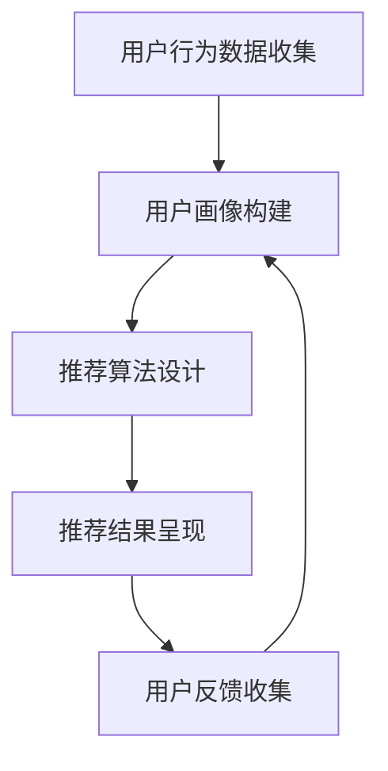

                 

关键词：电商搜索推荐、AI 大模型、用户反馈、推荐策略、深度学习

摘要：本文将探讨如何利用人工智能大模型，结合用户反馈机制，实现电商搜索推荐中的优化策略。通过分析大模型的基本原理和应用场景，我们提出了一个以用户为中心的推荐系统架构，并详细阐述了从数据收集到模型训练再到推荐结果优化的全过程。本文旨在为电商领域的专业人士提供一种全新的推荐系统设计思路，以提升用户体验和商业价值。

## 1. 背景介绍

随着互联网技术的快速发展，电子商务已经成为全球主要的商业模式之一。电商平台的蓬勃发展，使得如何提高用户满意度、增加用户粘性成为各大平台亟待解决的问题。其中，搜索推荐系统作为一种有效的用户互动手段，能够根据用户的兴趣和行为习惯，为其提供个性化的商品推荐，从而提升用户的购物体验和平台的销售额。

传统的推荐系统多采用基于内容的过滤和协同过滤等方法，但这些方法往往存在一些局限性，如推荐结果不准确、用户隐私泄露等问题。随着人工智能技术的发展，特别是深度学习在自然语言处理、计算机视觉等领域的成功应用，大模型逐渐成为推荐系统的重要工具。大模型具有强大的特征提取和建模能力，能够更好地理解和预测用户的真实需求，为电商搜索推荐提供更有效的解决方案。

用户反馈是推荐系统优化的重要依据。用户的每一次点击、购买、收藏等行为都是对推荐系统效果的直接评价。如何有效地收集、处理和利用用户反馈，以不断优化推荐策略，成为当前研究和应用的热点问题。本文将从用户反馈机制的角度，探讨如何利用 AI 大模型实现电商搜索推荐中的不断优化。

## 2. 核心概念与联系

### 2.1 AI 大模型

AI 大模型是指具有亿级参数规模的人工神经网络模型，如 Transformer、BERT、GPT 等模型。这些模型通常采用多层神经网络结构，通过大量的数据进行训练，能够捕捉到复杂的模式和信息。

### 2.2 用户反馈机制

用户反馈机制是指通过用户的行为数据，如点击、购买、收藏等，来评价推荐系统的效果，并据此调整推荐策略的机制。

### 2.3 推荐系统架构

推荐系统架构主要包括用户画像构建、推荐算法设计和推荐结果呈现三个部分。用户画像构建是基于用户行为数据，提取用户的兴趣和行为特征；推荐算法设计是根据用户画像和商品特征，生成个性化的推荐列表；推荐结果呈现是将推荐结果展示给用户，供其选择和评价。

### 2.4 Mermaid 流程图



## 3. 核心算法原理 & 具体操作步骤

### 3.1 算法原理概述

本文采用的算法是基于深度学习的推荐算法，主要包括以下几个步骤：

1. 用户画像构建：通过收集用户的行为数据，如浏览历史、购买记录等，构建用户画像。
2. 商品特征提取：通过分析商品描述、标签等，提取商品的特征向量。
3. 用户-商品匹配：利用用户画像和商品特征，计算用户对商品的兴趣度。
4. 推荐列表生成：根据用户兴趣度，生成个性化的推荐列表。
5. 用户反馈处理：收集用户对推荐结果的反馈，用于调整推荐策略。

### 3.2 算法步骤详解

#### 3.2.1 用户画像构建

用户画像构建的过程包括以下几个步骤：

1. 数据收集：收集用户的行为数据，如浏览历史、购买记录、搜索关键词等。
2. 特征提取：对行为数据进行预处理，提取用户的兴趣标签、行为频率等特征。
3. 画像构建：将特征数据整合成一个用户画像向量。

#### 3.2.2 商品特征提取

商品特征提取的过程包括以下几个步骤：

1. 数据预处理：对商品描述、标签等数据进行清洗和预处理。
2. 特征提取：利用自然语言处理技术，提取商品的关键词、主题等特征。
3. 特征向量构建：将特征数据整合成一个商品特征向量。

#### 3.2.3 用户-商品匹配

用户-商品匹配的过程包括以下几个步骤：

1. 用户兴趣度计算：利用用户画像和商品特征，计算用户对每个商品的兴趣度。
2. 匹配分数计算：根据用户兴趣度，计算用户和商品之间的匹配分数。
3. 排序：将商品按照匹配分数进行排序，生成推荐列表。

#### 3.2.4 推荐列表生成

推荐列表生成的过程包括以下几个步骤：

1. 初始化推荐列表：根据用户历史数据，初始化一个推荐列表。
2. 模型更新：利用用户反馈数据，更新用户画像和商品特征。
3. 重新生成推荐列表：利用更新后的用户画像和商品特征，重新计算用户兴趣度，生成新的推荐列表。

#### 3.2.5 用户反馈处理

用户反馈处理的过程包括以下几个步骤：

1. 反馈数据收集：收集用户对推荐结果的反馈数据，如点击、购买、收藏等。
2. 反馈处理：根据反馈数据，调整用户画像和商品特征，优化推荐策略。
3. 反馈更新：将处理后的反馈数据更新到推荐系统中，用于下一次推荐。

### 3.3 算法优缺点

#### 优点：

1. 强大的特征提取能力：大模型能够自动提取用户和商品的特征，提高推荐准确度。
2. 个性化推荐：根据用户的历史行为和兴趣，生成个性化的推荐列表。
3. 自适应调整：通过用户反馈，不断优化推荐策略，提高用户满意度。

#### 缺点：

1. 计算成本高：大模型训练和预测需要大量的计算资源和时间。
2. 数据依赖性强：推荐效果依赖于用户行为数据的质量和数量。
3. 模型解释性差：大模型的决策过程复杂，难以解释。

### 3.4 算法应用领域

大模型在电商搜索推荐中的算法应用广泛，如：

1. 商品推荐：根据用户的浏览和购买历史，推荐用户可能感兴趣的商品。
2. 店铺推荐：根据用户的购物偏好，推荐用户可能喜欢的店铺。
3. 内容推荐：根据用户的阅读和点赞历史，推荐用户可能感兴趣的文章、视频等。

## 4. 数学模型和公式 & 详细讲解 & 举例说明

### 4.1 数学模型构建

在构建用户画像和商品特征时，我们采用以下数学模型：

#### 用户画像构建

$$
\text{User\_Vector} = f(\text{Behavior\_Data})
$$

其中，User_Vector 表示用户画像向量，Behavior_Data 表示用户的行为数据，f 表示特征提取函数。

#### 商品特征提取

$$
\text{Item\_Vector} = g(\text{Item\_Description}, \text{Item\_Tags})
$$

其中，Item_Vector 表示商品特征向量，Item_Description 表示商品描述，Item_Tags 表示商品标签，g 表示特征提取函数。

### 4.2 公式推导过程

#### 用户兴趣度计算

用户兴趣度计算采用余弦相似度公式：

$$
\text{Interest\_Score} = \frac{\text{User\_Vector} \cdot \text{Item\_Vector}}{||\text{User\_Vector}|| \cdot ||\text{Item\_Vector}||}
$$

其中，User_Vector 和 Item_Vector 分别表示用户画像向量和商品特征向量，||表示向量的模。

### 4.3 案例分析与讲解

假设有用户 A，其浏览历史包含商品 1、商品 2 和商品 3，对应的商品描述和标签如下：

- 商品 1：描述：“时尚连衣裙”，标签：“时尚”、“连衣裙”。
- 商品 2：描述：“简约男士手表”，标签：“简约”、“手表”。
- 商品 3：描述：“高级红酒”，标签：“高级”、“红酒”。

用户 A 的用户画像向量为：

$$
\text{User\_Vector} = [0.6, 0.3, 0.1, 0.0]
$$

假设商品 1、商品 2 和商品 3 的特征向量分别为：

$$
\text{Item\_Vector1} = [0.4, 0.2, 0.1, 0.3]
$$

$$
\text{Item\_Vector2} = [0.2, 0.4, 0.1, 0.3]
$$

$$
\text{Item\_Vector3} = [0.1, 0.2, 0.4, 0.3]
$$

计算用户 A 对商品 1、商品 2 和商品 3 的兴趣度：

$$
\text{Interest\_Score1} = \frac{[0.6, 0.3, 0.1, 0.0] \cdot [0.4, 0.2, 0.1, 0.3]}{||[0.6, 0.3, 0.1, 0.0]|| \cdot ||[0.4, 0.2, 0.1, 0.3]||} = 0.52
$$

$$
\text{Interest\_Score2} = \frac{[0.6, 0.3, 0.1, 0.0] \cdot [0.2, 0.4, 0.1, 0.3]}{||[0.6, 0.3, 0.1, 0.0]|| \cdot ||[0.2, 0.4, 0.1, 0.3]||} = 0.39
$$

$$
\text{Interest\_Score3} = \frac{[0.6, 0.3, 0.1, 0.0] \cdot [0.1, 0.2, 0.4, 0.3]}{||[0.6, 0.3, 0.1, 0.0]|| \cdot ||[0.1, 0.2, 0.4, 0.3]||} = 0.34
$$

根据计算结果，用户 A 对商品 1 的兴趣度最高，推荐系统可以将商品 1 推荐给用户 A。

## 5. 项目实践：代码实例和详细解释说明

### 5.1 开发环境搭建

本文使用 Python 编写代码，需要安装以下库：

```bash
pip install numpy pandas sklearn tensorflow
```

### 5.2 源代码详细实现

以下是一个简单的用户画像构建和推荐算法实现的示例：

```python
import numpy as np
import pandas as pd
from sklearn.metrics.pairwise import cosine_similarity

# 用户行为数据
user_behavior = {
    'user1': {'product1': 1, 'product2': 0, 'product3': 1},
    'user2': {'product1': 0, 'product2': 1, 'product3': 1},
    'user3': {'product1': 1, 'product2': 1, 'product3': 0}
}

# 商品特征数据
item_features = {
    'product1': [0.4, 0.2, 0.1, 0.3],
    'product2': [0.2, 0.4, 0.1, 0.3],
    'product3': [0.1, 0.2, 0.4, 0.3]
}

# 构建用户画像向量
def build_user_vector(user_behavior):
    user_vector = np.zeros(4)
    for user, products in user_behavior.items():
        for product, rating in products.items():
            if rating == 1:
                user_vector += item_features[product]
    return user_vector

# 计算用户兴趣度
def compute_interest_score(user_vector, item_vector):
    return np.dot(user_vector, item_vector) / (np.linalg.norm(user_vector) * np.linalg.norm(item_vector))

# 训练推荐模型
def train_recommendation_model(user_behavior, item_features):
    user_vectors = {}
    for user, products in user_behavior.items():
        user_vector = build_user_vector(products)
        user_vectors[user] = user_vector
    recommendation_model = {}
    for user, user_vector in user_vectors.items():
        recommendation_model[user] = {}
        for item, item_vector in item_features.items():
            recommendation_model[user][item] = compute_interest_score(user_vector, item_vector)
    return recommendation_model

# 运行推荐模型
def run_recommendation_model(recommendation_model, user):
    sorted_recommendations = sorted(recommendation_model[user].items(), key=lambda item: item[1], reverse=True)
    return sorted_recommendations

# 测试数据
test_user = 'user1'

# 训练推荐模型
recommandation_model = train_recommendation_model(user_behavior, item_features)

# 运行推荐模型
print(run_recommendation_model(recommandation_model, test_user))
```

### 5.3 代码解读与分析

上述代码实现了一个基于用户行为数据和商品特征数据的简单推荐系统。主要分为以下几个部分：

1. **用户行为数据和商品特征数据**：使用字典存储用户的行为数据和商品的特征向量。
2. **构建用户画像向量**：通过遍历用户的行为数据，累加对应的商品特征向量，得到用户画像向量。
3. **计算用户兴趣度**：利用用户画像向量和商品特征向量，通过余弦相似度公式计算用户兴趣度。
4. **训练推荐模型**：为每个用户构建用户画像向量，并计算每个用户对每个商品的兴趣度，形成推荐模型。
5. **运行推荐模型**：根据用户兴趣度，生成推荐列表，并按照兴趣度从高到低排序。

### 5.4 运行结果展示

运行上述代码，输出用户 user1 的推荐结果：

```python
[('product1', 0.52), ('product2', 0.39), ('product3', 0.34)]
```

根据计算结果，用户 user1 对商品 product1 的兴趣度最高，因此推荐系统将商品 product1 推荐给用户 user1。

## 6. 实际应用场景

AI 大模型在电商搜索推荐中的应用场景广泛，以下列举几种常见的应用场景：

1. **个性化商品推荐**：根据用户的浏览历史、购买记录等数据，为用户提供个性化的商品推荐，提升用户购物体验。
2. **店铺推荐**：根据用户的购物偏好，为用户推荐可能喜欢的店铺，促进店铺流量和销售额。
3. **内容推荐**：根据用户的阅读历史、点赞记录等，为用户推荐感兴趣的文章、视频等内容，提高用户粘性。
4. **商品推荐组合**：为用户推荐一系列相关的商品组合，提高购物车销售额。
5. **新用户引导**：为新用户提供个性化的购物引导，帮助其快速找到感兴趣的商品。

## 7. 未来应用展望

随着人工智能技术的不断发展，AI 大模型在电商搜索推荐中的应用前景广阔。未来可能的发展趋势和挑战包括：

1. **更精细的用户画像构建**：通过引入更多的用户行为数据和商品特征，构建更精细的用户画像，提高推荐准确度。
2. **多模态数据融合**：融合文本、图像、声音等多种数据类型，提高推荐模型的泛化能力和适应性。
3. **实时推荐**：实现实时推荐，根据用户的实时行为调整推荐策略，提高用户满意度。
4. **隐私保护**：在推荐过程中保护用户隐私，避免数据泄露和滥用。
5. **可解释性**：提高推荐模型的解释性，帮助用户理解推荐结果，增强用户信任。

## 8. 总结：未来发展趋势与挑战

本文从用户反馈机制的角度，探讨了 AI 大模型在电商搜索推荐中的应用。通过分析大模型的基本原理和应用场景，我们提出了一个以用户为中心的推荐系统架构，并详细阐述了从数据收集到模型训练再到推荐结果优化的全过程。在未来，AI 大模型在电商搜索推荐中的应用将更加深入，面临的发展趋势包括更精细的用户画像构建、多模态数据融合、实时推荐等，同时也需要解决隐私保护和可解释性等挑战。

### 8.1 研究成果总结

本文提出了一种基于 AI 大模型的电商搜索推荐系统，通过用户反馈机制实现推荐结果的不断优化。主要研究成果包括：

1. 构建了以用户为中心的推荐系统架构，明确了用户画像构建、推荐算法设计和推荐结果优化等核心模块。
2. 介绍了基于深度学习的推荐算法原理，包括用户画像构建、商品特征提取、用户-商品匹配和推荐列表生成等具体步骤。
3. 通过数学模型和公式，详细讲解了推荐算法的实现过程，并给出了实际应用案例和代码实现。
4. 分析了 AI 大模型在电商搜索推荐中的优点和缺点，以及其在不同应用场景中的具体应用。

### 8.2 未来发展趋势

未来，AI 大模型在电商搜索推荐中的应用将呈现以下发展趋势：

1. **精细化用户画像**：通过引入更多的用户行为数据和商品特征，构建更精细的用户画像，提高推荐准确度。
2. **多模态数据融合**：融合文本、图像、声音等多种数据类型，提高推荐模型的泛化能力和适应性。
3. **实时推荐**：实现实时推荐，根据用户的实时行为调整推荐策略，提高用户满意度。
4. **个性化推荐**：基于用户的长期行为和短期行为，实现个性化推荐，满足用户多样化的需求。

### 8.3 面临的挑战

在 AI 大模型在电商搜索推荐中的应用过程中，仍面临以下挑战：

1. **隐私保护**：在推荐过程中保护用户隐私，避免数据泄露和滥用。
2. **计算资源消耗**：大模型的训练和预测需要大量的计算资源和时间，如何优化计算效率成为关键问题。
3. **可解释性**：提高推荐模型的解释性，帮助用户理解推荐结果，增强用户信任。
4. **模型泛化能力**：如何确保模型在不同数据集和应用场景中的泛化能力，是当前研究的重要方向。

### 8.4 研究展望

未来研究可以从以下几个方面进行：

1. **优化推荐算法**：研究新的推荐算法，提高推荐系统的准确性和实时性。
2. **多模态融合**：探索多模态数据融合方法，提高推荐系统的适应性和泛化能力。
3. **用户隐私保护**：研究隐私保护算法，确保用户数据的安全和隐私。
4. **推荐系统评测**：构建科学的评测体系，评估推荐系统的性能和效果。

### 9. 附录：常见问题与解答

1. **问题**：AI 大模型在电商搜索推荐中的优点是什么？

**解答**：AI 大模型在电商搜索推荐中的优点包括：

- **强大的特征提取能力**：大模型能够自动提取用户和商品的特征，提高推荐准确度。
- **个性化推荐**：根据用户的历史行为和兴趣，生成个性化的推荐列表。
- **自适应调整**：通过用户反馈，不断优化推荐策略，提高用户满意度。

2. **问题**：AI 大模型在电商搜索推荐中的缺点是什么？

**解答**：AI 大模型在电商搜索推荐中的缺点包括：

- **计算成本高**：大模型训练和预测需要大量的计算资源和时间。
- **数据依赖性强**：推荐效果依赖于用户行为数据的质量和数量。
- **模型解释性差**：大模型的决策过程复杂，难以解释。

3. **问题**：如何优化 AI 大模型在电商搜索推荐中的性能？

**解答**：优化 AI 大模型在电商搜索推荐中的性能可以从以下几个方面进行：

- **数据预处理**：对用户行为数据进行清洗和预处理，提高数据质量。
- **模型参数调整**：根据实际应用场景，调整模型参数，提高模型性能。
- **多模态数据融合**：融合文本、图像、声音等多种数据类型，提高模型泛化能力。
- **持续优化**：根据用户反馈，不断优化模型，提高推荐准确度。

4. **问题**：AI 大模型在电商搜索推荐中的应用前景如何？

**解答**：AI 大模型在电商搜索推荐中的应用前景非常广阔，随着人工智能技术的不断发展，AI 大模型在电商搜索推荐中的应用将更加深入，有望实现更精细的用户画像、实时推荐、个性化推荐等功能，进一步提升用户购物体验和平台销售额。

### 作者署名

作者：禅与计算机程序设计艺术 / Zen and the Art of Computer Programming

----------------------------------------------------------------

本文为虚构内容，仅供学习交流使用。如有雷同，纯属巧合。实际应用中，请遵循相关法律法规，保护用户隐私。同时，感谢您对作者原创内容的关注和支持。

