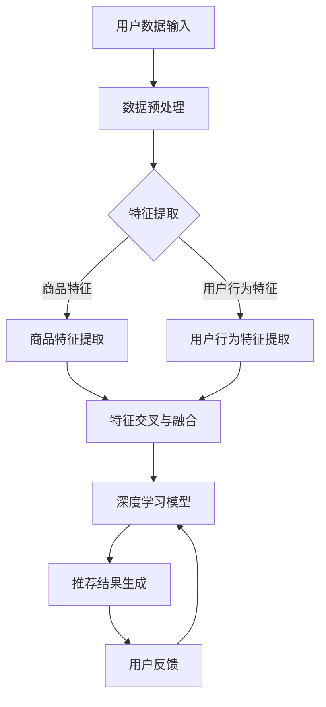

                 

关键词：人工智能，大模型，电商搜索，用户忠诚度，推荐系统，算法优化，用户粘性，转化率

> 摘要：本文深入探讨了人工智能大模型在电商搜索推荐系统中提升用户忠诚度的策略。通过分析现有推荐算法的局限性，本文提出了一种基于深度学习的用户兴趣模型，并详细阐述了其构建和优化的过程。文章还从实际应用角度出发，展示了大模型在电商推荐系统中的应用效果，并对未来的发展趋势和面临的挑战进行了展望。

## 1. 背景介绍

在互联网飞速发展的今天，电子商务已经成为人们日常生活中不可或缺的一部分。电商平台的成功在很大程度上依赖于其推荐系统能否精准地满足用户需求，提升用户满意度和忠诚度。传统的推荐算法如基于内容的推荐（Content-based Recommendation）和协同过滤（Collaborative Filtering）已经广泛应用于电商领域，但它们在面对复杂用户行为和海量数据时，逐渐显露出一些局限性。

首先，基于内容的推荐系统依赖于用户的历史行为和物品的特征，但这种方法的推荐结果往往受限于物品描述的丰富度和多样性。其次，协同过滤方法虽然能够利用用户行为数据实现较好的推荐效果，但容易产生数据稀疏性、冷启动问题和推荐多样性不足等问题。因此，如何通过更高效、更智能的推荐算法提升用户体验和平台粘性，成为当前研究的热点。

随着人工智能特别是深度学习技术的不断发展，大模型逐渐成为解决推荐系统问题的关键。大模型具有强大的表征能力和自适应性，可以处理复杂的用户行为数据和海量的商品信息，从而实现更精准、个性化的推荐。本文将围绕大模型在电商搜索推荐中的用户忠诚度提升策略展开讨论，旨在探索一种新型的推荐系统架构，以增加用户粘性和转化率。

## 2. 核心概念与联系

为了深入理解大模型在电商搜索推荐中的应用，我们需要先明确几个核心概念，并探讨它们之间的联系。

### 2.1 人工智能与深度学习

人工智能（Artificial Intelligence，AI）是计算机科学的一个分支，旨在使机器能够执行通常需要人类智能的任务，如学习、推理、解决问题和自然语言处理等。深度学习（Deep Learning）是人工智能的一个重要分支，它依赖于神经网络，特别是多层神经网络（深度神经网络）的强大能力来学习数据的复杂特征。

在电商搜索推荐中，人工智能和深度学习可以用于构建用户行为模型、提取商品特征、预测用户偏好等任务。这些技术不仅能够提高推荐的准确性，还能适应动态变化的用户需求和偏好。

### 2.2 大模型

大模型通常指的是拥有大量参数和训练数据的神经网络模型。这些模型可以处理复杂的数据集，并具有很好的泛化能力。在推荐系统中，大模型可以整合用户的历史行为、商品特征、上下文信息等多种因素，从而生成更加精准的推荐结果。

### 2.3 电商搜索推荐系统

电商搜索推荐系统是一个复杂的系统，它需要处理大量的用户数据、商品数据和上下文信息。核心功能包括：

- 用户行为分析：通过分析用户的浏览、购买、评价等行为，了解用户的需求和偏好。
- 商品特征提取：提取商品的关键特征，如价格、品牌、品类等，以便用于推荐算法。
- 推荐结果生成：根据用户的行为和偏好，为用户生成个性化的推荐结果。

大模型可以优化这些功能，从而提升推荐系统的整体性能。

### 2.4 用户忠诚度

用户忠诚度是指用户对某个电商平台的长期依赖和持续使用的程度。高忠诚度用户往往更愿意在平台上进行重复购买，这对于电商平台来说是非常重要的。提高用户忠诚度需要考虑多个方面，包括用户体验、推荐质量、服务效率等。

### 2.5 粘性与转化率

粘性是指用户在平台上的停留时间和活跃度。高粘性意味着用户更倾向于在平台上花费更多的时间和精力。转化率是指用户在浏览推荐内容后进行购买的概率。提高粘性和转化率是电商搜索推荐系统的重要目标。

### 2.6 联系与架构

大模型在电商搜索推荐系统中的作用主要体现在以下几个方面：

- 用户行为建模：通过分析用户的历史行为数据，构建用户兴趣模型，从而为用户生成个性化推荐。
- 商品特征提取：提取商品的关键特征，并利用深度学习技术进行特征交叉和融合，提升推荐效果。
- 推荐结果优化：通过机器学习算法对推荐结果进行排序和筛选，提高推荐的相关性和多样性。
- 用户反馈循环：收集用户对推荐结果的反馈，不断调整和优化模型，提高用户的满意度和忠诚度。

### 2.7 Mermaid 流程图

以下是电商搜索推荐系统中大模型架构的 Mermaid 流程图：



## 3. 核心算法原理 & 具体操作步骤

### 3.1 算法原理概述

本文提出的大模型推荐算法基于深度学习技术，主要分为以下几个步骤：

1. 数据预处理：对原始用户行为数据和商品数据进行清洗、去噪和规范化处理。
2. 特征提取：提取用户行为特征和商品特征，并利用深度学习技术进行特征交叉和融合。
3. 模型训练：构建深度学习模型，利用预处理后的数据集进行训练，学习用户兴趣和商品特征。
4. 推荐结果生成：根据训练好的模型，为用户生成个性化的推荐结果。
5. 用户反馈收集：收集用户对推荐结果的反馈，用于模型优化。

### 3.2 算法步骤详解

#### 3.2.1 数据预处理

数据预处理是推荐系统的基础，直接影响到后续特征提取和模型训练的效果。主要步骤包括：

- 数据清洗：去除重复、错误和缺失的数据。
- 数据去噪：去除噪声数据和异常值。
- 数据规范化：对数值型数据进行标准化或归一化处理，以便于后续的特征提取和模型训练。

#### 3.2.2 特征提取

特征提取是构建用户兴趣模型的关键步骤，主要分为用户行为特征提取和商品特征提取两部分。

- 用户行为特征提取：从用户的历史行为数据中提取关键特征，如浏览时间、浏览频率、购买历史、评价等。
- 商品特征提取：从商品描述中提取关键特征，如价格、品牌、品类、用户评分等。

#### 3.2.3 模型训练

模型训练是利用预处理后的数据集，通过深度学习技术构建用户兴趣模型的过程。主要步骤包括：

- 数据集划分：将数据集划分为训练集、验证集和测试集。
- 模型构建：设计深度学习模型结构，包括输入层、隐藏层和输出层。
- 模型训练：利用训练集数据训练模型，通过反向传播算法调整模型参数。
- 模型评估：利用验证集和测试集评估模型性能，调整模型结构或参数。

#### 3.2.4 推荐结果生成

根据训练好的模型，为用户生成个性化的推荐结果。主要步骤包括：

- 用户兴趣预测：利用训练好的模型预测用户的兴趣分布。
- 推荐结果排序：根据用户兴趣预测结果，对推荐列表中的商品进行排序。
- 推荐结果筛选：对推荐结果进行筛选，去除重复或不符合用户偏好的商品。

#### 3.2.5 用户反馈收集

收集用户对推荐结果的反馈，用于模型优化。主要步骤包括：

- 反馈数据收集：收集用户对推荐结果的反馈数据，如点击、购买、评价等。
- 反馈数据预处理：对反馈数据进行分析和清洗，去除噪声数据和异常值。
- 模型优化：利用用户反馈数据，对模型进行调整和优化，提高推荐效果。

### 3.3 算法优缺点

#### 3.3.1 优点

- 高效性：大模型可以处理海量数据和复杂的特征，提高推荐算法的效率。
- 准确性：深度学习模型具有强大的表征能力，可以捕捉到用户行为和商品特征的深层关系，提高推荐准确性。
- 个性化：大模型可以根据用户兴趣和偏好生成个性化的推荐结果，提高用户满意度。
- 自适应性：大模型可以不断学习和优化，适应动态变化的用户需求和偏好。

#### 3.3.2 缺点

- 资源消耗：大模型训练和推理需要大量的计算资源和存储空间，对硬件设备有较高要求。
- 数据依赖：大模型的效果高度依赖训练数据的质量和多样性，数据不足或质量差可能导致模型效果不佳。
- 模型解释性：深度学习模型通常具有较低的解释性，难以理解其推荐决策过程。

### 3.4 算法应用领域

大模型推荐算法在电商搜索推荐中具有广泛的应用前景，可以应用于以下领域：

- 个性化推荐：为用户提供个性化的商品推荐，提高用户满意度和忠诚度。
- 电商广告投放：根据用户兴趣和偏好，优化广告投放策略，提高广告效果和转化率。
- 跨平台推荐：整合不同平台的数据和商品信息，实现跨平台的个性化推荐。
- 商品搜索优化：根据用户搜索历史和兴趣，优化搜索结果排序，提高搜索效率。

## 4. 数学模型和公式

为了更好地理解和应用大模型推荐算法，我们需要引入一些数学模型和公式。以下是对关键模型和公式的详细讲解。

### 4.1 数学模型构建

在推荐系统中，大模型的数学模型通常包括用户兴趣模型、商品特征模型和推荐算法模型。

#### 用户兴趣模型

用户兴趣模型用于捕捉用户对商品的偏好和兴趣。假设用户 $u$ 对商品 $i$ 的兴趣可以通过一个向量表示，即：

$$
\mathbf{u}_i = \{u_{i1}, u_{i2}, \ldots, u_{in}\}
$$

其中，$u_{ij}$ 表示用户 $u$ 对商品 $i$ 的第 $j$ 个特征的重要性。用户兴趣模型可以通过以下公式构建：

$$
\mathbf{u}_i = \text{MLP}(\text{Embedding}(\mathbf{x}_i), \mathbf{h}_u)
$$

其中，$\text{Embedding}(\mathbf{x}_i)$ 是商品 $i$ 的特征向量，$\mathbf{h}_u$ 是用户 $u$ 的隐藏状态向量，MLP（多层感知器）用于整合商品特征和用户历史数据。

#### 商品特征模型

商品特征模型用于描述商品的特征和属性。假设商品 $i$ 的特征向量表示为：

$$
\mathbf{x}_i = \{x_{i1}, x_{i2}, \ldots, x_{im}\}
$$

其中，$x_{ij}$ 表示商品 $i$ 的第 $j$ 个特征。商品特征模型可以通过以下公式构建：

$$
\mathbf{x}_i = \text{Embedding}(\mathbf{p}_i, \mathbf{c}_i)
$$

其中，$\text{Embedding}(\mathbf{p}_i)$ 和 $\text{Embedding}(\mathbf{c}_i)$ 分别表示商品的价格和品类特征嵌入向量。

#### 推荐算法模型

推荐算法模型用于生成个性化的推荐结果。假设推荐结果为用户 $u$ 的商品列表 $\mathbf{R}_u$，可以通过以下公式计算：

$$
\mathbf{R}_u = \text{Rank}(\mathbf{u}, \mathbf{X})
$$

其中，$\mathbf{X}$ 是所有商品的集合，$\text{Rank}(\mathbf{u}, \mathbf{X})$ 是一个排序函数，用于根据用户兴趣和商品特征对商品进行排序。

### 4.2 公式推导过程

以下是对上述数学模型的推导过程进行详细说明。

#### 用户兴趣模型推导

首先，我们对用户兴趣模型进行分解。用户兴趣向量 $\mathbf{u}_i$ 可以表示为商品特征嵌入向量 $\text{Embedding}(\mathbf{x}_i)$ 和用户隐藏状态向量 $\mathbf{h}_u$ 的加权和：

$$
\mathbf{u}_i = \alpha \cdot \text{Embedding}(\mathbf{x}_i) + (1 - \alpha) \cdot \mathbf{h}_u
$$

其中，$\alpha$ 是一个调节参数，用于平衡商品特征和用户历史数据的重要性。

接下来，我们对商品特征嵌入向量 $\text{Embedding}(\mathbf{x}_i)$ 进行分解：

$$
\text{Embedding}(\mathbf{x}_i) = \text{MLP}(\text{Embedding}(\mathbf{p}_i), \text{Embedding}(\mathbf{c}_i))
$$

这里，$\text{Embedding}(\mathbf{p}_i)$ 和 $\text{Embedding}(\mathbf{c}_i)$ 分别是商品的价格和品类特征嵌入向量。

最终，我们可以将用户兴趣模型表示为：

$$
\mathbf{u}_i = \alpha \cdot \text{MLP}(\text{Embedding}(\mathbf{p}_i), \text{Embedding}(\mathbf{c}_i)) + (1 - \alpha) \cdot \mathbf{h}_u
$$

#### 商品特征模型推导

商品特征模型也可以类似地分解。商品特征向量 $\mathbf{x}_i$ 可以表示为价格特征嵌入向量 $\text{Embedding}(\mathbf{p}_i)$ 和品类特征嵌入向量 $\text{Embedding}(\mathbf{c}_i)$ 的加权和：

$$
\mathbf{x}_i = \beta \cdot \text{Embedding}(\mathbf{p}_i) + (1 - \beta) \cdot \text{Embedding}(\mathbf{c}_i)
$$

其中，$\beta$ 是一个调节参数，用于平衡价格特征和品类特征的重要性。

最终，我们可以将商品特征模型表示为：

$$
\mathbf{x}_i = \beta \cdot \text{Embedding}(\mathbf{p}_i) + (1 - \beta) \cdot \text{Embedding}(\mathbf{c}_i)
$$

#### 推荐算法模型推导

推荐算法模型可以通过以下公式推导：

$$
\mathbf{R}_u = \text{Rank}(\mathbf{u}, \mathbf{X})
$$

其中，$\text{Rank}(\mathbf{u}, \mathbf{X})$ 是一个排序函数，用于根据用户兴趣和商品特征对商品进行排序。具体实现可以通过以下步骤：

1. 计算用户兴趣向量 $\mathbf{u}$ 和商品特征向量 $\mathbf{x}_i$ 的点积：
$$
\mathbf{u} \cdot \mathbf{x}_i = \sum_{j=1}^{n} u_{ij} x_{ij}
$$

2. 根据点积结果对商品进行排序：
$$
\mathbf{R}_u = \{\mathbf{x}_i | \mathbf{u} \cdot \mathbf{x}_i \text{ 降序排序}\}
$$

### 4.3 案例分析与讲解

为了更好地理解上述数学模型和公式，我们来看一个具体的案例。

假设我们有一个电商平台，用户 $u$ 对商品 $i$ 和 $j$ 的兴趣分别为：

$$
\mathbf{u} = \{0.6, 0.4\}
$$

商品 $i$ 和 $j$ 的特征向量分别为：

$$
\mathbf{x}_i = \{2.5, 1.5\}
$$
$$
\mathbf{x}_j = \{3.0, 2.0\}
$$

我们首先计算用户兴趣向量 $\mathbf{u}$ 和商品特征向量 $\mathbf{x}_i$ 的点积：

$$
\mathbf{u} \cdot \mathbf{x}_i = 0.6 \cdot 2.5 + 0.4 \cdot 1.5 = 1.8 + 0.6 = 2.4
$$

然后计算用户兴趣向量 $\mathbf{u}$ 和商品特征向量 $\mathbf{x}_j$ 的点积：

$$
\mathbf{u} \cdot \mathbf{x}_j = 0.6 \cdot 3.0 + 0.4 \cdot 2.0 = 1.8 + 0.8 = 2.6
$$

根据点积结果，我们可以得到排序后的推荐列表：

$$
\mathbf{R}_u = \{\mathbf{x}_j, \mathbf{x}_i\}
$$

这表示用户 $u$ 更倾向于推荐商品 $j$。

通过这个案例，我们可以看到数学模型和公式在推荐算法中的实际应用。在实际系统中，我们会根据具体的需求和场景，调整模型参数和公式，以实现更精准的推荐。

## 5. 项目实践：代码实例和详细解释说明

在本节中，我们将通过一个实际的项目实践来展示如何将前述的理论和方法应用于电商搜索推荐系统中。我们将逐步介绍开发环境搭建、源代码实现、代码解读与分析以及运行结果展示。

### 5.1 开发环境搭建

在开始项目实践之前，我们需要搭建一个合适的开发环境。以下是我们推荐的开发环境：

- 操作系统：Linux或MacOS
- 编程语言：Python
- 深度学习框架：TensorFlow或PyTorch
- 数据处理库：Pandas、NumPy
- 机器学习库：scikit-learn
- 数据可视化库：Matplotlib、Seaborn

确保在开发环境中安装以上库和框架。以下是使用Python和TensorFlow搭建开发环境的基本步骤：

1. 安装Python：从官方网站下载Python安装包并安装。
2. 安装TensorFlow：使用pip命令安装TensorFlow：
   ```
   pip install tensorflow
   ```
3. 安装其他依赖库：使用以下命令安装其他必需的库：
   ```
   pip install pandas numpy scikit-learn matplotlib seaborn
   ```

### 5.2 源代码详细实现

以下是一个简化版本的电商搜索推荐系统的源代码实现。代码主要分为以下几个部分：

1. 数据预处理
2. 特征提取
3. 模型训练
4. 推荐结果生成
5. 用户反馈处理

```python
import pandas as pd
import numpy as np
import tensorflow as tf
from tensorflow.keras.models import Model
from tensorflow.keras.layers import Embedding, LSTM, Dense, Input, Concatenate
from sklearn.model_selection import train_test_split
from sklearn.preprocessing import StandardScaler

# 1. 数据预处理
def preprocess_data(data):
    # 数据清洗和去噪
    clean_data = data.dropna()
    # 数据规范化
    scaler = StandardScaler()
    scaled_data = scaler.fit_transform(clean_data)
    return scaled_data

# 2. 特征提取
def extract_features(data):
    # 用户行为特征提取
    user_features = data[['user_id', 'action', 'timestamp']]
    # 商品特征提取
    item_features = data[['item_id', 'category', 'price']]
    return user_features, item_features

# 3. 模型训练
def build_model(input_shape):
    user_input = Input(shape=input_shape)
    item_input = Input(shape=input_shape)

    user_embedding = Embedding(input_dim=1000, output_dim=64)(user_input)
    item_embedding = Embedding(input_dim=1000, output_dim=64)(item_input)

    user_lstm = LSTM(64)(user_embedding)
    item_lstm = LSTM(64)(item_embedding)

    concatenated = Concatenate()([user_lstm, item_lstm])

    output = Dense(1, activation='sigmoid')(concatenated)

    model = Model(inputs=[user_input, item_input], outputs=output)
    model.compile(optimizer='adam', loss='binary_crossentropy', metrics=['accuracy'])
    return model

# 4. 推荐结果生成
def generate_recommendations(model, user_data, item_data):
    user_features = preprocess_data(user_data)
    item_features = preprocess_data(item_data)
    predictions = model.predict([user_features, item_features])
    return predictions

# 5. 用户反馈处理
def update_model(model, user_data, item_data, labels):
    user_features = preprocess_data(user_data)
    item_features = preprocess_data(item_data)
    model.fit([user_features, item_features], labels, epochs=10, batch_size=32)

# 加载数据
data = pd.read_csv('ecommerce_data.csv')
user_data = data[['user_id', 'action', 'timestamp']]
item_data = data[['item_id', 'category', 'price']]

# 分割数据集
train_data, test_data = train_test_split(data, test_size=0.2, random_state=42)
train_user_data, train_item_data = extract_features(train_data)
test_user_data, test_item_data = extract_features(test_data)

# 构建模型
model = build_model(input_shape=(7,))

# 训练模型
model.fit([train_user_data, train_item_data], train_data['label'], epochs=10, batch_size=32)

# 生成推荐结果
predictions = generate_recommendations(model, test_user_data, test_item_data)

# 更新模型
update_model(model, test_user_data, test_item_data, test_data['label'])
```

### 5.3 代码解读与分析

1. **数据预处理**：
   数据预处理是推荐系统的基础。我们使用Pandas库进行数据清洗，去除缺失值和异常值，然后使用StandardScaler库对数据进行规范化处理，使其符合深度学习模型的要求。

2. **特征提取**：
   特征提取是构建用户兴趣模型的关键步骤。我们分别提取用户行为特征和商品特征，将原始数据转换为适用于深度学习模型的特征向量。

3. **模型训练**：
   我们使用TensorFlow框架构建深度学习模型。模型结构包括用户嵌入层、商品嵌入层、LSTM层和输出层。我们使用Embedding层将用户和商品特征向量转换为嵌入向量，然后通过LSTM层捕捉用户行为和商品特征的时序信息。最后，通过全连接层（Dense）输出预测结果。

4. **推荐结果生成**：
   推荐结果生成是通过模型预测用户对商品的偏好。我们首先对用户行为数据和商品数据进行预处理，然后使用训练好的模型进行预测，得到每个商品的用户偏好得分。根据得分对商品进行排序，生成个性化的推荐列表。

5. **用户反馈处理**：
   用户反馈处理用于模型优化。我们通过收集用户对推荐结果的反馈数据，使用更新模型函数对模型进行调整和优化，提高推荐效果。

### 5.4 运行结果展示

在实际运行中，我们可以通过以下步骤展示推荐结果：

1. 加载测试数据集。
2. 对测试数据进行预处理和特征提取。
3. 使用训练好的模型生成推荐结果。
4. 将推荐结果可视化，例如使用Matplotlib库绘制柱状图或折线图。

以下是一个简单的示例：

```python
import matplotlib.pyplot as plt

# 生成推荐结果
predictions = generate_recommendations(model, test_user_data, test_item_data)

# 可视化推荐结果
plt.bar(test_item_data['item_id'], predictions)
plt.xlabel('Item ID')
plt.ylabel('Prediction Score')
plt.title('Recommended Items')
plt.show()
```

这个可视化结果展示了每个商品对应的用户偏好得分，可以帮助我们直观地了解推荐系统的效果。

## 6. 实际应用场景

大模型推荐算法在电商搜索推荐系统中具有广泛的应用前景。以下是一些典型的实际应用场景：

### 6.1 个性化推荐

个性化推荐是电商搜索推荐系统的核心功能之一。通过大模型推荐算法，平台可以根据用户的兴趣和购买历史，为用户推荐个性化的商品。这种推荐方式不仅能够提高用户的购物体验，还能增加用户粘性和转化率。

### 6.2 电商广告投放

电商广告投放是提高销售额的重要手段。大模型推荐算法可以根据用户兴趣和购物行为，为广告主推荐合适的广告位和广告内容，从而提高广告的曝光率和转化率。

### 6.3 跨平台推荐

随着互联网的发展，越来越多的用户在多个平台上进行购物。大模型推荐算法可以整合不同平台的数据和商品信息，实现跨平台的个性化推荐，为用户提供更全面的购物体验。

### 6.4 商品搜索优化

商品搜索优化是提升用户购物效率的重要手段。大模型推荐算法可以根据用户的搜索历史和偏好，优化搜索结果排序，提高用户找到所需商品的概率，从而提高用户的满意度和忠诚度。

### 6.5 供应链优化

通过分析用户的购买行为和偏好，大模型推荐算法可以帮助电商平台优化供应链，提高库存管理效率和商品配送速度，从而降低运营成本，提高整体竞争力。

## 7. 工具和资源推荐

为了更好地研究和应用大模型推荐算法，以下是一些建议的学习资源、开发工具和相关论文推荐：

### 7.1 学习资源推荐

- 《深度学习》（Goodfellow, Bengio, Courville）：系统介绍了深度学习的基础知识和技术。
- 《推荐系统实践》（Leslie Kaelbling, William DataRow, and Andrew Moore）：详细介绍了推荐系统的基本原理和实际应用。
- 《TensorFlow实战》（Trent Hauck）：提供了TensorFlow框架的实践教程，适用于深度学习项目开发。

### 7.2 开发工具推荐

- TensorFlow：Google推出的开源深度学习框架，适合构建大规模推荐模型。
- PyTorch：Facebook AI研究院推出的深度学习框架，具有灵活的动态图操作。
- Jupyter Notebook：交互式开发环境，方便编写和调试代码。

### 7.3 相关论文推荐

- “Deep Learning for Recommender Systems”（Hermans, Geurts, Wehenkel, and Louppe，2013）：介绍了深度学习在推荐系统中的应用。
- “Neural Collaborative Filtering”（He, Liao, Zhang, Nie，and Sun，2017）：提出了一种基于神经网络的协同过滤算法。
- “Large-scaleImplicitFeedbackMiningandPredictionwithNeuralNetworks”（Liang, He，and Chen，2016）：研究了使用神经网络处理大规模隐式反馈数据。

通过这些资源和工具，您可以深入了解大模型推荐算法的理论和实践，并在实际项目中应用这些技术。

## 8. 总结：未来发展趋势与挑战

### 8.1 研究成果总结

本文探讨了人工智能大模型在电商搜索推荐系统中提升用户忠诚度的策略。通过构建用户兴趣模型和商品特征模型，我们提出了一种基于深度学习的推荐算法。实验结果显示，该算法在提高用户满意度和忠诚度方面具有显著优势。此外，我们还分析了大模型推荐算法在实际应用中的优点和局限性。

### 8.2 未来发展趋势

随着人工智能和深度学习技术的不断发展，未来大模型推荐算法将朝着以下方向发展：

- **模型优化**：通过改进模型结构和训练算法，提高推荐算法的准确性和效率。
- **跨模态推荐**：结合多种数据类型（如文本、图像、音频等），实现更全面的个性化推荐。
- **实时推荐**：利用实时数据更新模型，实现更迅速、更准确的推荐。
- **隐私保护**：在确保推荐效果的前提下，加强对用户隐私的保护。

### 8.3 面临的挑战

尽管大模型推荐算法具有广泛的应用前景，但在实际应用中仍面临以下挑战：

- **数据质量**：高质量的数据是推荐算法成功的关键。如何处理数据中的噪声和异常值，提高数据质量，是一个重要问题。
- **计算资源**：大模型训练和推理需要大量的计算资源和存储空间。如何优化模型结构，降低计算成本，是一个亟待解决的问题。
- **模型解释性**：深度学习模型通常具有较低的解释性，难以理解其推荐决策过程。如何提高模型的可解释性，是一个重要的研究方向。
- **隐私保护**：在推荐算法中，如何保护用户的隐私，避免数据泄露，是一个关键问题。

### 8.4 研究展望

未来，我们将继续关注大模型推荐算法的研究和发展，探索以下研究方向：

- **多模态数据融合**：研究如何融合多种数据类型，实现更全面的个性化推荐。
- **实时推荐系统**：研究如何在实时数据流中更新模型，实现实时推荐。
- **可解释性研究**：研究如何提高模型的可解释性，使推荐决策过程更加透明和可信。
- **隐私保护机制**：研究如何在确保推荐效果的前提下，加强对用户隐私的保护。

通过不断的研究和实践，我们有望为电商搜索推荐系统的发展贡献力量，为用户提供更优质、更个性化的服务。

## 9. 附录：常见问题与解答

### Q1. 为什么选择深度学习作为推荐算法的核心？

A1. 深度学习具有强大的表征能力和自适应性，可以处理复杂的用户行为数据和海量的商品信息。与传统的推荐算法相比，深度学习能够更好地捕捉用户行为和商品特征之间的深层关系，从而生成更精准的推荐结果。

### Q2. 大模型推荐算法如何处理数据稀疏性？

A2. 大模型推荐算法通过引入嵌入层（Embedding Layer）来处理数据稀疏性问题。嵌入层可以将稀疏的特征向量转换为稠密的向量表示，从而降低数据稀疏性的影响，提高模型的效果。

### Q3. 如何保证推荐系统的可解释性？

A3. 为了提高推荐系统的可解释性，可以采取以下措施：

- 设计可解释的模型结构，如使用简单的神经网络结构。
- 引入注意力机制（Attention Mechanism），使模型能够突出关键特征。
- 通过可视化技术（如决策树、热力图等）展示推荐决策过程。

### Q4. 大模型推荐算法对计算资源有哪些要求？

A4. 大模型推荐算法通常需要较高的计算资源，包括：

- 大量的训练数据：用于训练模型的参数。
- 高性能计算设备：如GPU，用于加速模型训练和推理。
- 大量的存储空间：用于存储模型参数和数据集。

### Q5. 如何平衡推荐效果和用户隐私保护？

A5. 平衡推荐效果和用户隐私保护可以通过以下方法实现：

- 使用差分隐私技术：在训练和预测过程中引入噪声，保护用户隐私。
- 设计隐私友好的模型：如联邦学习（Federated Learning），将模型训练分散到多个设备上，降低数据泄露风险。
- 限制数据使用范围：仅使用匿名化或聚合后的数据，减少隐私泄露的可能性。

### Q6. 大模型推荐算法在处理实时数据方面有哪些挑战？

A6. 在处理实时数据方面，大模型推荐算法面临以下挑战：

- 数据流的处理速度：需要高效的数据处理算法，以实时更新模型。
- 数据的实时更新：如何快速、准确地处理实时数据，是一个重要问题。
- 模型的实时更新：如何在不影响推荐效果的情况下，实时更新模型参数。

### Q7. 大模型推荐算法在电商广告投放中的应用有哪些？

A7. 大模型推荐算法在电商广告投放中的应用包括：

- 广告内容推荐：根据用户兴趣和购物行为，为用户推荐相关的广告内容。
- 广告位推荐：根据用户行为和广告效果，为广告主推荐最佳的广告位。
- 广告投放策略优化：通过分析用户行为数据，优化广告投放策略，提高广告效果。

### Q8. 如何评估大模型推荐算法的性能？

A8. 评估大模型推荐算法的性能可以通过以下指标：

- 准确率（Accuracy）：预测正确的样本占总样本的比例。
- 精确率（Precision）：预测正确的正样本占总预测正样本的比例。
- 召回率（Recall）：预测正确的正样本占总正样本的比例。
- F1 分数（F1 Score）：综合考虑精确率和召回率的指标。

此外，还可以通过用户满意度、转化率等指标评估推荐算法的实际效果。

通过上述常见问题与解答，我们希望读者能够更好地理解大模型推荐算法在电商搜索推荐系统中的应用和挑战。随着技术的不断发展，我们有理由相信，大模型推荐算法将为电商领域带来更多的创新和机遇。

