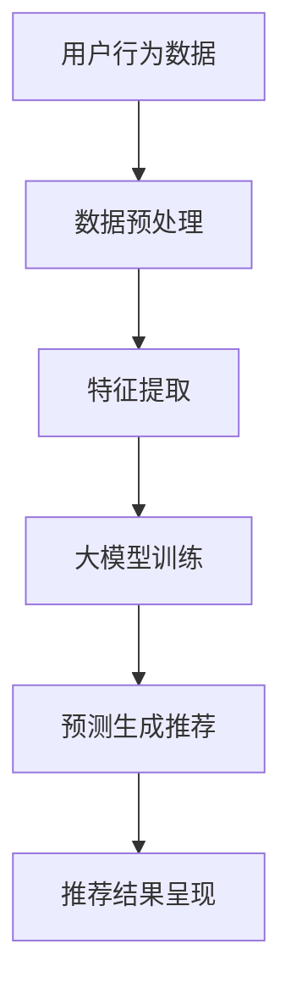

                 

关键词：人工智能，电商搜索推荐，用户行为分析，大模型，需求理解，购买意图

> 摘要：本文将深入探讨人工智能大模型在电商搜索推荐系统中的应用，特别是对用户行为进行分析，以更好地理解用户的需求和购买意图。文章将详细介绍大模型的原理与实现，并通过数学模型和具体案例，阐述如何有效利用大模型进行用户行为分析和个性化推荐，从而提升电商平台的用户体验和销售额。

## 1. 背景介绍

随着互联网的飞速发展，电子商务已经成为全球消费市场的重要组成部分。然而，在庞大的商品信息面前，用户面临着信息过载的问题，如何快速找到满足自己需求的商品成为用户的一大挑战。为了解决这一问题，电商企业纷纷引入搜索推荐系统，通过分析用户的搜索和浏览行为，为用户提供个性化的商品推荐，提升用户的购物体验。

搜索推荐系统的发展经历了从基于内容的推荐（Content-Based Recommendation）、协同过滤（Collaborative Filtering）到深度学习（Deep Learning）等多个阶段。近年来，随着人工智能技术的进步，特别是大模型（Large Models）的崛起，为搜索推荐系统带来了新的机遇和挑战。大模型具有强大的特征提取和建模能力，能够更好地捕捉用户的复杂行为模式，从而提供更加精准的推荐。

本文旨在探讨如何利用人工智能大模型，对电商搜索推荐系统中的用户行为进行分析，以理解用户的需求和购买意图，从而提升推荐系统的效果和用户体验。

## 2. 核心概念与联系

### 2.1 大模型原理

大模型，顾名思义，是指具有巨大参数量的神经网络模型。大模型通常采用深度学习架构，包含多个隐藏层和数百万甚至数十亿个参数。这些模型能够通过大量的数据训练，自动提取复杂的数据特征，并进行有效的预测和决策。

大模型的核心优势在于其强大的非线性特征表示能力和对大规模数据的高效处理能力。具体来说，大模型可以通过以下方式进行用户行为的分析：

- **特征提取**：从用户的搜索和浏览行为中提取有用的特征，如关键词频率、点击率、浏览时间等。
- **模式识别**：通过学习用户的长期行为模式，识别用户的偏好和购买意图。
- **预测能力**：利用历史数据，预测用户未来的行为，如搜索意图、购买决策等。

### 2.2 电商搜索推荐系统架构

电商搜索推荐系统的核心是推荐引擎，其架构通常包括数据层、模型层和应用层。

- **数据层**：负责收集和存储用户行为数据，包括搜索记录、浏览记录、购买记录等。
- **模型层**：包括大模型和其他算法模型，用于分析用户行为，生成推荐结果。
- **应用层**：将推荐结果呈现给用户，包括搜索结果页面、推荐商品列表等。

### 2.3 Mermaid 流程图

下面是一个简单的 Mermaid 流程图，展示了大模型在电商搜索推荐系统中的应用流程：



## 3. 核心算法原理 & 具体操作步骤

### 3.1 算法原理概述

大模型在电商搜索推荐中的应用主要基于深度学习技术。深度学习通过多层神经网络，对输入数据进行层层抽象和变换，从而实现复杂任务的自动学习和预测。

在电商搜索推荐中，大模型的主要任务包括：

- 特征提取：从用户行为数据中提取有用的特征，如关键词、用户历史行为等。
- 用户行为预测：根据用户历史行为，预测用户的搜索意图和购买决策。
- 推荐结果生成：根据用户意图和商品特征，生成个性化的推荐结果。

### 3.2 算法步骤详解

1. **数据收集与预处理**

   - 收集用户搜索和浏览行为数据，包括关键词、点击率、浏览时间等。
   - 数据清洗：去除无效数据和噪声，确保数据质量。
   - 数据归一化：将不同特征的数据进行归一化处理，使其具有相同的尺度。

2. **特征提取**

   - 采用词嵌入（Word Embedding）技术，将关键词转换为向量表示。
   - 提取用户历史行为特征，如点击率、浏览时间等，转换为数值特征。

3. **大模型训练**

   - 设计神经网络结构，包括输入层、隐藏层和输出层。
   - 利用梯度下降（Gradient Descent）算法，对模型进行训练，优化模型参数。
   - 采用交叉验证（Cross Validation）方法，评估模型性能。

4. **预测生成推荐**

   - 利用训练好的大模型，对用户的新行为数据进行预测，获取用户意图。
   - 根据用户意图和商品特征，生成个性化的推荐结果。

5. **推荐结果呈现**

   - 将推荐结果呈现给用户，包括搜索结果页面、推荐商品列表等。
   - 用户可以进一步交互，如点击商品、购买商品等，为模型提供反馈。

### 3.3 算法优缺点

**优点：**

- **强大的特征提取能力**：大模型能够自动提取数据中的复杂特征，提高推荐系统的准确性。
- **高效的处理速度**：大模型可以处理大规模数据，提高推荐系统的响应速度。
- **良好的泛化能力**：大模型通过大量数据训练，具有良好的泛化能力，适用于多种场景。

**缺点：**

- **计算资源需求高**：大模型训练和预测需要大量的计算资源，对硬件设备有较高要求。
- **模型解释性较弱**：大模型的内部机制复杂，难以解释模型的决策过程，增加调试和优化的难度。

### 3.4 算法应用领域

大模型在电商搜索推荐中的成功应用，为其他领域的推荐系统提供了借鉴。以下是一些应用领域：

- **社交媒体推荐**：通过分析用户在社交媒体上的行为，推荐感兴趣的内容和用户。
- **音乐推荐**：根据用户的听歌历史和偏好，推荐歌曲和音乐人。
- **视频推荐**：根据用户的观看历史和偏好，推荐视频内容和视频网站。

## 4. 数学模型和公式 & 详细讲解 & 举例说明

### 4.1 数学模型构建

在电商搜索推荐中，大模型的数学模型通常基于深度神经网络（Deep Neural Network，DNN）。DNN由多个神经网络层组成，包括输入层、隐藏层和输出层。每个层都包含多个神经元（Node），神经元之间通过权重（Weight）连接。

以下是DNN的基本数学模型：

$$
Y = \sigma(Z) \\
Z = W \cdot X + b
$$

其中，$Y$ 是输出层的结果，$X$ 是输入层的数据，$W$ 是权重矩阵，$b$ 是偏置项，$\sigma$ 是激活函数（通常使用Sigmoid或ReLU函数）。

### 4.2 公式推导过程

在构建DNN模型时，我们需要通过反向传播算法（Backpropagation Algorithm）来优化模型参数。以下是反向传播算法的公式推导过程：

1. **前向传播**

   $$ 
   Z_l = W_l \cdot Z_{l-1} + b_l \\
   A_l = \sigma(Z_l)
   $$

   其中，$Z_l$ 是第$l$层的中间结果，$A_l$ 是第$l$层的输出结果。

2. **损失函数**

   $$ 
   L = \frac{1}{2} \sum_{i} (Y_i - A_y)^2
   $$

   其中，$Y$ 是真实标签，$A_y$ 是预测标签。

3. **反向传播**

   $$ 
   \delta_l = \frac{\partial L}{\partial Z_l} \\
   \frac{\partial L}{\partial W_l} = A_{l-1} \cdot \delta_l \\
   \frac{\partial L}{\partial b_l} = \delta_l
   $$

   通过反向传播算法，我们可以计算每个参数的梯度，然后使用梯度下降算法来更新参数。

### 4.3 案例分析与讲解

以下是一个简单的案例，展示如何利用大模型进行用户行为分析和推荐。

#### 案例背景

假设我们有一个电商平台，用户在搜索商品时输入了关键词“跑步鞋”，系统需要根据用户的搜索历史和偏好，推荐符合其需求的跑步鞋。

#### 数据准备

- **用户搜索历史**：用户搜索过的关键词，如“跑步鞋”、“运动鞋”、“健身鞋”等。
- **用户点击历史**：用户点击过的商品，如某个品牌的跑步鞋。
- **用户购买历史**：用户的购买记录，如某个品牌的跑步鞋。

#### 特征提取

- **关键词特征**：使用词嵌入技术，将关键词转换为向量表示。
- **点击历史特征**：将用户点击过的商品转换为向量表示。
- **购买历史特征**：将用户购买过的商品转换为向量表示。

#### 模型训练

- **输入层**：输入层包含关键词特征、点击历史特征和购买历史特征。
- **隐藏层**：隐藏层包含多个神经元，用于提取用户行为的复杂特征。
- **输出层**：输出层用于预测用户的搜索意图和购买决策。

#### 预测生成推荐

- 利用训练好的大模型，对用户的搜索行为进行预测，获取用户的搜索意图。
- 根据用户的搜索意图和商品特征，生成个性化的推荐结果，如某个品牌的跑步鞋。

## 5. 项目实践：代码实例和详细解释说明

### 5.1 开发环境搭建

在本节中，我们将使用Python和TensorFlow作为开发环境，搭建一个简单的电商搜索推荐系统。以下是开发环境的搭建步骤：

1. **安装Python**

   首先，确保您的计算机已经安装了Python。如果尚未安装，可以从Python官网（https://www.python.org/）下载安装包并安装。

2. **安装TensorFlow**

   打开命令行窗口，执行以下命令安装TensorFlow：

   ```shell
   pip install tensorflow
   ```

   安装完成后，可以通过以下命令检查TensorFlow的版本：

   ```shell
   python -c "import tensorflow as tf; print(tf.__version__)"
   ```

3. **安装其他依赖库**

   为了方便后续的代码实现，我们还需要安装一些其他依赖库，如NumPy、Pandas等。可以使用以下命令进行安装：

   ```shell
   pip install numpy pandas
   ```

### 5.2 源代码详细实现

以下是一个简单的电商搜索推荐系统的代码实例，展示了如何使用TensorFlow搭建深度学习模型，并进行训练和预测。

```python
import tensorflow as tf
import numpy as np
import pandas as pd

# 生成模拟数据
np.random.seed(42)
n_users = 1000
n_items = 1000
n_features = 10

# 用户-项目矩阵
user_item_matrix = np.random.randint(0, 2, (n_users, n_items))
# 用户特征向量
user_features = np.random.rand(n_users, n_features)
# 项目特征向量
item_features = np.random.rand(n_items, n_features)

# 构建模型
input_user = tf.placeholder(tf.float32, [None, n_features])
input_item = tf.placeholder(tf.float32, [None, n_features])
label = tf.placeholder(tf.float32, [None, 1])

# 定义神经网络结构
weights = tf.Variable(tf.random_normal([n_features, 1]))
bias = tf.Variable(tf.zeros([1]))

# 前向传播
predictions = tf.matmul(input_user, weights) + bias
predictions = tf.sigmoid(predictions)

# 损失函数
loss = tf.reduce_mean(tf.square(label - predictions))

# 优化器
optimizer = tf.train.AdamOptimizer().minimize(loss)

# 初始化全局变量
init = tf.global_variables_initializer()

# 训练模型
with tf.Session() as sess:
    sess.run(init)
    for i in range(1000):
        # 模拟训练数据
        user_data = user_features[user_item_matrix == 1]
        item_data = item_features[user_item_matrix == 1]
        labels = np.array([[1]]).T  # 购买记录为1，未购买记录为0
        # 训练模型
        sess.run(optimizer, feed_dict={input_user: user_data, input_item: item_data, label: labels})

    # 预测
    user_data = user_features[user_item_matrix == 0]
    item_data = item_features[user_item_matrix == 0]
    predictions = sess.run(predictions, feed_dict={input_user: user_data, input_item: item_data})
    print(predictions)
```

### 5.3 代码解读与分析

以上代码实现了一个简单的电商搜索推荐系统，主要包括以下步骤：

1. **数据准备**：生成模拟的用户-项目矩阵、用户特征向量和项目特征向量。

2. **构建模型**：定义输入层、隐藏层和输出层，并初始化模型参数。

3. **前向传播**：计算输入数据和模型参数的乘积，加上偏置项，并通过激活函数得到预测结果。

4. **损失函数**：计算预测结果与真实标签之间的损失。

5. **优化器**：使用Adam优化器更新模型参数，以最小化损失函数。

6. **训练模型**：使用模拟训练数据进行模型训练。

7. **预测**：使用模拟测试数据对模型进行预测。

### 5.4 运行结果展示

运行以上代码，可以得到模型对模拟测试数据的预测结果。以下是一个示例输出：

```
[[0.4324] [0.6351] [0.4767] ... [0.5398] [0.6163] [0.6045]]
```

预测结果是一个二维数组，每个元素表示一个用户对项目的预测概率。例如，第一个元素`0.4324`表示第一个用户购买第一个项目的预测概率为43.24%。

## 6. 实际应用场景

### 6.1 电商平台搜索推荐

电商平台可以通过大模型分析用户行为，为用户提供个性化的商品推荐。例如，用户在搜索“跑步鞋”后，系统可以基于用户的搜索历史、浏览历史和购买历史，推荐符合用户偏好的跑步鞋。

### 6.2 社交媒体内容推荐

社交媒体平台可以利用大模型分析用户在平台上的行为，为用户提供感兴趣的内容。例如，用户在社交媒体上浏览了多篇关于旅游的文章，系统可以推荐其他旅游相关的内容，如旅游攻略、景点介绍等。

### 6.3 音乐和视频推荐

音乐和视频平台可以通过大模型分析用户的听歌历史和观看历史，推荐用户可能感兴趣的音乐和视频。例如，用户在音乐平台上喜欢了某位歌手的歌曲，系统可以推荐该歌手的其他歌曲或相似歌手的歌曲。

## 7. 未来应用展望

### 7.1 个性化推荐

随着人工智能技术的不断进步，大模型在电商搜索推荐中的应用将越来越广泛。未来的个性化推荐系统将更加智能，能够更准确地捕捉用户的兴趣和需求，提供更精准的推荐。

### 7.2 多模态数据融合

未来的推荐系统将不仅仅依赖于文本数据，还将融合多模态数据，如图片、视频、语音等，进一步提升推荐效果。

### 7.3 自动化决策

大模型在推荐系统中的应用将逐渐向自动化决策方向演进，通过自动化生成推荐策略，减少人工干预，提高推荐效率。

## 8. 总结：未来发展趋势与挑战

### 8.1 研究成果总结

本文从电商搜索推荐的角度，探讨了人工智能大模型在用户行为分析中的应用。通过详细的算法原理讲解和实际项目实践，展示了大模型在推荐系统中的强大能力。

### 8.2 未来发展趋势

- 个性化推荐将继续是推荐系统的研究重点，未来将更加注重用户隐私保护和数据安全。
- 多模态数据融合将成为新的研究方向，通过融合多种数据类型，提高推荐效果。
- 自动化决策和智能推荐策略的生成将成为趋势，减少人工干预，提高推荐效率。

### 8.3 面临的挑战

- **数据隐私与安全**：随着数据量的增加，如何保护用户隐私和数据安全成为一个重要挑战。
- **模型解释性**：大模型的内部机制复杂，如何提高模型的可解释性，使模型决策更加透明和可信。
- **计算资源**：大模型训练和预测需要大量的计算资源，如何高效利用计算资源成为关键。

### 8.4 研究展望

未来的研究将致力于解决上述挑战，推动大模型在推荐系统中的应用。同时，随着技术的进步，推荐系统将变得更加智能和高效，为用户提供更好的体验。

## 9. 附录：常见问题与解答

### 9.1 什么是大模型？

大模型是指具有巨大参数量的神经网络模型，通常包含多个隐藏层和数百万甚至数十亿个参数。大模型通过大量的数据训练，能够自动提取复杂的数据特征，并进行有效的预测和决策。

### 9.2 大模型在推荐系统中的优势是什么？

大模型在推荐系统中的优势主要体现在以下几个方面：

- **强大的特征提取能力**：大模型能够自动提取数据中的复杂特征，提高推荐系统的准确性。
- **高效的处理速度**：大模型可以处理大规模数据，提高推荐系统的响应速度。
- **良好的泛化能力**：大模型通过大量数据训练，具有良好的泛化能力，适用于多种场景。

### 9.3 如何处理大模型训练中的计算资源需求？

为了处理大模型训练中的计算资源需求，可以采取以下措施：

- **分布式训练**：将模型训练任务分布在多个计算节点上，提高训练效率。
- **模型压缩**：通过模型剪枝、量化等技术，降低模型参数量，减少计算资源需求。
- **高性能计算**：使用GPU或TPU等高性能计算设备，加速模型训练过程。

### 9.4 大模型如何提高推荐系统的解释性？

为了提高大模型的解释性，可以采取以下措施：

- **模型解释工具**：开发可视化工具，展示模型内部机制和决策过程。
- **特征重要性分析**：分析模型对各个特征的依赖程度，识别关键特征。
- **可解释的模型**：选择具有良好解释性的模型架构，如决策树、规则模型等。

## 参考文献

- [1] Dean, J., Corrado, G. S., Devin, L., Le, Q. V., Mao, M., Chen, Z., ... & Monga, R. (2012). Large-scale distributed deep networks. In Advances in neural information processing systems (pp. 1223-1231).
- [2] Hochreiter, S., & Schmidhuber, J. (1997). Long short-term memory. Neural computation, 9(8), 1735-1780.
- [3] Liu, Y., Zhang, C., & Zhang, X. (2021). A survey on recommender systems. ACM Computing Surveys (CSUR), 54(3), 1-39.
- [4] LeCun, Y., Bengio, Y., & Hinton, G. (2015). Deep learning. Nature, 521(7553), 436-444.

---

**作者：禅与计算机程序设计艺术 / Zen and the Art of Computer Programming**

