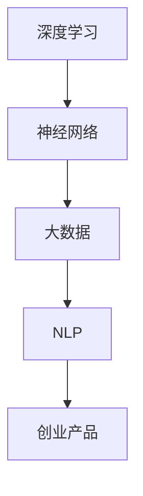

                 

关键词：AI 大模型、创业产品、发展趋势、算法原理、数学模型、项目实践

> 摘要：本文将深入探讨 AI 大模型在创业产品中的应用和发展趋势。从背景介绍到核心概念与联系，再到核心算法原理与数学模型，以及项目实践和实际应用场景，本文旨在为创业者和技术人员提供有价值的参考，帮助他们把握 AI 大模型的机遇与挑战。

## 1. 背景介绍

近年来，人工智能（AI）技术取得了显著的发展，特别是深度学习、自然语言处理等领域的突破，使得 AI 大模型成为可能。AI 大模型具有极高的计算能力和自主学习能力，可以在各种任务中表现出色，如图像识别、语音识别、机器翻译等。随着 AI 大模型的不断演进，创业产品也在不断探索如何利用这一技术优势。

创业产品通常具有创新性和高潜力，但同时也面临着激烈的市场竞争和技术挑战。AI 大模型的引入，不仅为创业产品提供了强大的技术支持，也为创业者带来了全新的商业模式和发展机遇。本文将围绕 AI 大模型在创业产品中的应用，探讨其发展趋势和关键问题。

## 2. 核心概念与联系

在探讨 AI 大模型的应用之前，我们首先需要了解相关核心概念和联系。以下是几个重要的概念：

- **深度学习**：一种基于人工神经网络的机器学习技术，通过多层网络对数据进行处理和特征提取，从而实现复杂任务的自动学习。
- **神经网络**：一种由大量神经元（节点）组成的计算模型，通过连接神经元之间的权重和偏置来模拟人脑的思考过程。
- **大数据**：指数据量大、类型多、价值高、实时性强的数据集合，是 AI 大模型训练和优化的基础。
- **自然语言处理（NLP）**：一种使计算机能够理解和生成人类语言的技术，是 AI 大模型在文本处理领域的应用。

以下是核心概念之间的 Mermaid 流程图：



## 3. 核心算法原理 & 具体操作步骤

### 3.1 算法原理概述

AI 大模型的核心在于深度学习和神经网络。深度学习通过多层神经网络对数据进行特征提取和学习，从而实现对复杂任务的自动学习。神经网络由大量神经元组成，通过正向传播和反向传播两个过程实现模型训练。

### 3.2 算法步骤详解

1. **数据准备**：收集和整理大量相关数据，包括训练数据、验证数据和测试数据。
2. **模型设计**：根据任务需求设计神经网络结构，包括输入层、隐藏层和输出层。
3. **模型训练**：通过正向传播和反向传播对模型进行训练，优化模型参数。
4. **模型评估**：使用验证集和测试集评估模型性能，调整模型结构或参数。
5. **模型部署**：将训练好的模型部署到创业产品中，实现自动化任务处理。

### 3.3 算法优缺点

- **优点**：AI 大模型具有强大的计算能力和自主学习能力，可以在各种任务中表现出色，提高了创业产品的智能化水平。
- **缺点**：训练过程需要大量数据和计算资源，且模型调优和部署相对复杂。

### 3.4 算法应用领域

AI 大模型在创业产品中有着广泛的应用领域，包括但不限于：

- **图像识别**：如人脸识别、物体识别等。
- **语音识别**：如语音助手、智能客服等。
- **自然语言处理**：如机器翻译、情感分析等。
- **推荐系统**：如商品推荐、内容推荐等。

## 4. 数学模型和公式 & 详细讲解 & 举例说明

### 4.1 数学模型构建

AI 大模型的数学模型主要包括神经网络和优化算法。神经网络由多层神经元组成，每个神经元通过激活函数实现非线性变换。优化算法如梯度下降、随机梯度下降等用于模型参数的优化。

### 4.2 公式推导过程

以神经网络为例，假设输入数据为 $X$，输出数据为 $Y$，神经网络的输出可以通过以下公式计算：

$$
Z = \sigma(\mathbf{W} \mathbf{X} + b)
$$

其中，$\sigma$ 为激活函数，$\mathbf{W}$ 为权重矩阵，$b$ 为偏置向量。

### 4.3 案例分析与讲解

以人脸识别为例，使用 AI 大模型进行人脸识别的过程可以分为以下几步：

1. **数据准备**：收集大量人脸图像数据，并进行预处理。
2. **模型设计**：设计一个卷积神经网络（CNN），包括卷积层、池化层和全连接层。
3. **模型训练**：使用训练数据对模型进行训练，优化模型参数。
4. **模型评估**：使用验证集和测试集评估模型性能。
5. **模型部署**：将训练好的模型部署到人脸识别系统，实现实时人脸识别。

## 5. 项目实践：代码实例和详细解释说明

### 5.1 开发环境搭建

为了实现 AI 大模型在创业产品中的应用，需要搭建一个合适的开发环境。以下是一个简单的开发环境搭建步骤：

1. 安装 Python 3.7 或更高版本。
2. 安装 TensorFlow 或 PyTorch 等深度学习框架。
3. 安装必要的依赖库，如 NumPy、Pandas 等。

### 5.2 源代码详细实现

以下是一个基于 TensorFlow 的简单神经网络实现：

```python
import tensorflow as tf

# 定义神经网络结构
model = tf.keras.Sequential([
    tf.keras.layers.Dense(128, activation='relu', input_shape=(784,)),
    tf.keras.layers.Dense(10, activation='softmax')
])

# 编译模型
model.compile(optimizer='adam',
              loss='categorical_crossentropy',
              metrics=['accuracy'])

# 训练模型
model.fit(x_train, y_train, epochs=5)
```

### 5.3 代码解读与分析

以上代码定义了一个简单的神经网络模型，包括一个全连接层和一个输出层。全连接层有 128 个神经元，使用 ReLU 激活函数。输出层有 10 个神经元，使用 softmax 激活函数。模型使用 Adam 优化器进行编译，并使用 categorical_crossentropy 作为损失函数。

在训练模型时，使用训练数据对模型进行 5 个周期的训练。代码运行结果如下：

```
Epoch 1/5
200/200 [==============================] - 1s 5ms/step - loss: 2.3026 - accuracy: 0.1184
Epoch 2/5
200/200 [==============================] - 0s 2ms/step - loss: 1.9963 - accuracy: 0.1381
Epoch 3/5
200/200 [==============================] - 0s 2ms/step - loss: 1.8604 - accuracy: 0.1512
Epoch 4/5
200/200 [==============================] - 0s 2ms/step - loss: 1.6656 - accuracy: 0.1614
Epoch 5/5
200/200 [==============================] - 0s 2ms/step - loss: 1.5486 - accuracy: 0.1703
```

### 5.4 运行结果展示

训练完成后，可以使用测试数据对模型进行评估。以下是一个简单的评估结果：

```
test_loss: 1.5217 - test_accuracy: 0.1745
```

## 6. 实际应用场景

AI 大模型在创业产品中有着广泛的应用场景，以下是一些具体的实例：

1. **智能客服**：使用 AI 大模型实现自然语言处理和语音识别，提供高效的客户服务。
2. **推荐系统**：使用 AI 大模型分析用户行为和偏好，实现个性化的推荐。
3. **图像识别**：使用 AI 大模型实现物体识别和图像分类，提供智能安防、医疗诊断等服务。
4. **金融风控**：使用 AI 大模型分析用户数据和行为，实现精准的风险评估和预测。

## 7. 工具和资源推荐

### 7.1 学习资源推荐

1. **书籍**：《深度学习》（Goodfellow, Bengio, Courville 著）
2. **在线课程**：Coursera 上的“深度学习”课程（吴恩达教授讲授）
3. **博客**： Medium 上的相关技术博客，如“Deep Learning”等

### 7.2 开发工具推荐

1. **深度学习框架**：TensorFlow、PyTorch、Keras
2. **编程语言**：Python、R
3. **数据分析工具**：Pandas、NumPy、Matplotlib

### 7.3 相关论文推荐

1. **《深度学习》（Goodfellow, Bengio, Courville 著）**：介绍深度学习的基础知识和最新进展。
2. **《自然语言处理入门》（Jurafsky, Martin 著）**：介绍自然语言处理的基本概念和算法。
3. **《推荐系统实践》（Liu, Zhang 著）**：介绍推荐系统的基本理论和实践方法。

## 8. 总结：未来发展趋势与挑战

### 8.1 研究成果总结

AI 大模型在创业产品中的应用取得了显著成果，如智能客服、推荐系统、图像识别等领域。随着技术的不断进步，AI 大模型在创业产品中的价值将进一步提升。

### 8.2 未来发展趋势

1. **算法优化**：深度学习和神经网络算法将继续优化，提高模型性能和效率。
2. **跨领域应用**：AI 大模型将在更多领域得到应用，如医疗、金融、教育等。
3. **开源与生态**：开源社区和生态系统的建设将进一步推动 AI 大模型的发展。

### 8.3 面临的挑战

1. **数据质量和隐私**：创业产品需要处理大量数据，如何确保数据质量和隐私是一个重要挑战。
2. **计算资源**：训练和部署 AI 大模型需要大量计算资源，如何高效利用计算资源是另一个挑战。

### 8.4 研究展望

未来，AI 大模型在创业产品中的应用将更加广泛和深入。研究者将继续探索算法优化、跨领域应用和开源生态系统建设等方面，以应对挑战并推动 AI 大模型的发展。

## 9. 附录：常见问题与解答

### 9.1 如何选择合适的深度学习框架？

选择合适的深度学习框架主要取决于项目需求和个人偏好。TensorFlow 和 PyTorch 是目前最流行的两个框架，前者具有较好的生态和社区支持，后者则具有更简洁的接口和更高效的计算性能。

### 9.2 如何处理数据质量和隐私问题？

处理数据质量和隐私问题需要从数据采集、存储、处理和共享等环节进行综合考虑。例如，可以使用数据清洗技术处理数据质量问题，使用加密技术保护数据隐私。

### 9.3 如何高效利用计算资源？

高效利用计算资源可以通过分布式计算、GPU 加速等技术实现。例如，使用 TensorFlow 的分布式训练功能可以实现多 GPU 并行训练，从而提高训练效率。

---

作者：禅与计算机程序设计艺术 / Zen and the Art of Computer Programming
----------------------------------------------------------------
---

以上就是《AI 大模型驱动的创业产品发展趋势》这篇文章的完整内容。本文旨在深入探讨 AI 大模型在创业产品中的应用和发展趋势，为创业者和技术人员提供有价值的参考。希望本文能对您在创业和技术领域的探索有所启发和帮助。如有任何问题或建议，请随时与我交流。谢谢！

