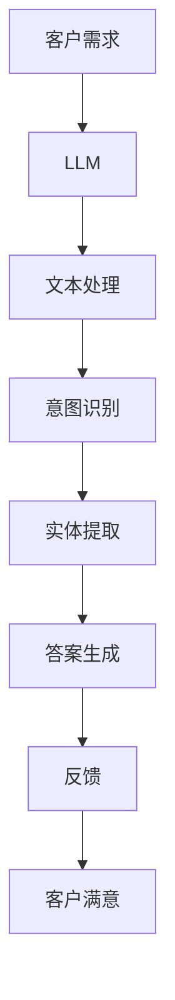

                 

关键词：AI客户服务、大型语言模型（LLM）、即时支持、自然语言处理、聊天机器人、客户体验、技术架构、实践案例、未来展望。

> 摘要：随着人工智能技术的不断进步，大型语言模型（LLM）在客户服务领域中的应用日益广泛。本文将探讨如何利用LLM提供即时支持，提高客户服务水平，优化客户体验。我们将从背景介绍、核心概念与联系、核心算法原理与具体操作步骤、数学模型和公式讲解、项目实践、实际应用场景、工具和资源推荐、总结与展望等方面进行深入分析。

## 1. 背景介绍

在当今快速发展的商业环境中，客户服务已成为企业竞争力的关键因素。传统的客户服务模式往往依赖于人工处理，不仅效率低下，而且难以满足客户多样化的需求。随着人工智能技术的快速发展，尤其是自然语言处理（NLP）技术的突破，AI客户服务逐渐成为现实。大型语言模型（LLM）作为NLP领域的核心技术之一，具有强大的文本理解和生成能力，能够为用户提供即时、高效的支持。

LLM在客户服务中的应用场景广泛，如智能客服、在线咨询、自动回复系统等。通过LLM，企业能够快速响应用户的需求，提高服务效率，降低运营成本，从而提升客户满意度。此外，LLM还可以通过对用户数据的分析和挖掘，为企业提供有针对性的建议和决策支持，助力企业实现精细化运营。

本文将围绕LLM在客户服务中的应用，探讨其核心原理、算法实现、数学模型以及实际应用案例，旨在为读者提供一个全面、系统的了解和认识。

## 2. 核心概念与联系

### 2.1. 大型语言模型（LLM）

大型语言模型（LLM）是指通过深度学习技术训练得到的具有强大文本理解和生成能力的语言模型。LLM通常采用基于注意力机制和Transformer架构，具有大规模的参数量和丰富的知识储备。LLM的训练数据来源于互联网上的大量文本，包括新闻、博客、论坛、社交媒体等，这使得LLM能够掌握丰富的语言知识和表达方式。

### 2.2. 自然语言处理（NLP）

自然语言处理（NLP）是人工智能领域的一个重要分支，旨在研究如何让计算机理解和处理人类语言。NLP涵盖了文本的预处理、词法分析、句法分析、语义分析等多个方面。NLP技术的进步为LLM的发展奠定了基础，同时也使得LLM在各个应用场景中的表现更加出色。

### 2.3. 客户服务

客户服务是指企业为了满足客户需求、解决客户问题而提供的各项服务。传统的客户服务模式主要包括电话客服、在线客服、邮件客服等。随着AI技术的发展，智能客服、自动回复系统等新兴服务模式逐渐成为主流。

### 2.4. Mermaid 流程图

为了更好地展示LLM在客户服务中的应用过程，我们使用Mermaid流程图对核心概念和联系进行可视化。



在上述流程中，客户需求经过LLM处理，完成文本处理、意图识别、实体提取和答案生成，最终得到一个满足客户需求的答复，并通过反馈环节不断优化服务。

## 3. 核心算法原理 & 具体操作步骤

### 3.1. 算法原理概述

LLM的核心算法原理是基于深度学习技术的语言建模。通过大量的文本数据进行训练，LLM可以学习到语言的规律和表达方式，从而实现对输入文本的自动理解和生成。具体来说，LLM的工作流程如下：

1. **文本预处理**：对输入文本进行分词、去停用词、词性标注等预处理操作，将原始文本转化为适用于模型处理的序列数据。
2. **语言建模**：通过神经网络模型对预处理后的文本序列进行建模，预测下一个单词的概率分布。在这个过程中，模型会自动学习到文本中的语法、语义和上下文信息。
3. **意图识别**：根据语言建模的结果，对输入文本的意图进行识别，确定用户的需求类型。
4. **实体提取**：从输入文本中提取关键信息，如人名、地名、组织名等，为答案生成提供基础数据。
5. **答案生成**：根据意图识别和实体提取的结果，利用模板匹配或序列生成技术生成满足用户需求的答案。
6. **反馈处理**：收集用户对答案的反馈，用于模型优化和业务决策。

### 3.2. 算法步骤详解

1. **文本预处理**：使用分词工具（如jieba）对输入文本进行分词，去除停用词和标点符号，并进行词性标注。

   ```python
   import jieba
   
   text = "我想要一个苹果手机"
   seg_list = jieba.cut(text)
   print("分词结果：", seg_list)
   ```

2. **语言建模**：采用Transformer架构的预训练模型（如BERT、GPT）进行语言建模。通过微调模型，使其适应特定业务场景。

   ```python
   from transformers import BertModel
   
   model = BertModel.from_pretrained("bert-base-chinese")
   input_ids = tokenizer.encode(text, add_special_tokens=True)
   output = model(input_ids)
   ```

3. **意图识别**：利用微调后的模型对输入文本进行意图分类。可以使用分类模型（如朴素贝叶斯、决策树、支持向量机等）进行训练和预测。

   ```python
   import numpy as np
   from sklearn.naive_bayes import MultinomialNB
   
   X_train = ...  # 训练数据
   y_train = ...  # 训练标签
   model = MultinomialNB()
   model.fit(X_train, y_train)
   
   intent = model.predict([input_ids])
   print("意图识别结果：", intent)
   ```

4. **实体提取**：使用命名实体识别（NER）模型对输入文本进行实体提取。可以使用预训练的NER模型（如BERT-NER）或基于规则的方法。

   ```python
   from transformers import BertForTokenClassification
   
   model = BertForTokenClassification.from_pretrained("bert-base-chinese")
   input_ids = tokenizer.encode(text, add_special_tokens=True)
   output = model(input_ids)
   
   entities = []
   for token, score in zip(tokenizer.convert_ids_to_tokens(input_ids), output[0]):
       if score > threshold:
           entities.append(token)
   print("实体提取结果：", entities)
   ```

5. **答案生成**：根据意图识别和实体提取的结果，利用模板匹配或序列生成技术生成答案。

   ```python
   def generate_answer(intent, entities):
       if intent == "购买咨询":
           return "我们目前有苹果手机和三星手机，请问您想要了解哪款手机的详细信息？"
       elif intent == "产品评价":
           return "请您告诉我们您对这款产品的评价，我们将尽力满足您的需求。"
       else:
           return "很抱歉，我无法理解您的需求，请提供更详细的信息。"
   
   answer = generate_answer(intent, entities)
   print("答案生成结果：", answer)
   ```

6. **反馈处理**：收集用户对答案的反馈，用于模型优化和业务决策。可以使用用户满意度调查、点击率分析等方法。

   ```python
   feedback = input("对我们的回答满意吗？（满意/不满意）")
   if feedback == "不满意":
       print("请提供更详细的需求，我们将再次尝试为您解答。")
   ```

### 3.3. 算法优缺点

**优点**：

1. 高效性：LLM能够快速处理大量客户请求，提高客户服务效率。
2. 智能性：LLM具备自然语言理解能力，能够生成符合用户需求的答案。
3. 普适性：LLM适用于多种客户服务场景，如智能客服、在线咨询、自动回复等。

**缺点**：

1. 计算资源消耗：LLM的训练和推理过程需要大量计算资源，对硬件设备要求较高。
2. 数据质量：LLM的训练数据质量直接影响模型性能，需要确保训练数据的质量和多样性。
3. 伦理风险：LLM在处理敏感信息时可能存在伦理问题，需要加强隐私保护和数据安全。

### 3.4. 算法应用领域

LLM在客户服务领域的应用前景广阔，主要包括以下几个方面：

1. **智能客服**：通过LLM实现自动化、智能化的客户服务，提高服务效率和用户体验。
2. **在线咨询**：为企业提供实时、高效的在线咨询服务，满足用户多样化的需求。
3. **自动回复系统**：在社交媒体、邮件、论坛等场景中实现自动化、智能化的回复，降低人工成本。
4. **个性化推荐**：基于LLM的自然语言理解能力，为用户推荐符合其需求的产品和服务。

## 4. 数学模型和公式 & 详细讲解 & 举例说明

### 4.1. 数学模型构建

在LLM中，常用的数学模型包括语言模型、意图识别模型和实体提取模型。以下分别介绍这三种模型的数学模型构建。

#### 4.1.1. 语言模型

语言模型是LLM的核心组成部分，其目标是预测下一个单词的概率分布。在NLP中，常用的语言模型是基于序列标记的马尔可夫模型（Markov Model）和基于神经网络的深度学习模型。

马尔可夫模型假设当前状态只与前一状态有关，即：

$$ P(w_t | w_{<t}) = P(w_t | w_{t-1}) $$

其中，$w_t$ 表示第 $t$ 个单词，$w_{<t}$ 表示前 $t-1$ 个单词。

深度学习模型，如循环神经网络（RNN）和Transformer，通过学习大量的文本数据，能够捕捉到更复杂的语言规律。以Transformer为例，其数学模型可以表示为：

$$
\begin{aligned}
h_t &= \text{softmax}(W_L \text{Concat}(h_{<t}, x_t)) \\
x_{<t} &= [x_1, \ldots, x_{t-1}] \\
h_{<t} &= [h_1, \ldots, h_{t-1}]
\end{aligned}
$$

其中，$x_t$ 表示第 $t$ 个输入向量，$h_t$ 表示第 $t$ 个隐藏状态，$W_L$ 为权重矩阵。

#### 4.1.2. 意图识别模型

意图识别是LLM在客户服务中的重要功能，其目标是根据输入文本识别用户的意图。常见的意图识别模型包括朴素贝叶斯（Naive Bayes）、决策树（Decision Tree）和支持向量机（SVM）等。

以朴素贝叶斯为例，其数学模型可以表示为：

$$
\begin{aligned}
P(\text{intent} = c | x) &= \frac{P(x | \text{intent} = c)P(\text{intent} = c)}{P(x)} \\
P(x | \text{intent} = c) &= \prod_{i=1}^n P(x_i | \text{intent} = c) \\
P(\text{intent} = c) &= \frac{N_c}{N}
\end{aligned}
$$

其中，$c$ 表示第 $c$ 个意图，$x$ 表示输入文本，$x_i$ 表示文本中的第 $i$ 个特征，$N_c$ 和 $N$ 分别表示第 $c$ 个意图的样本数量和总样本数量。

#### 4.1.3. 实体提取模型

实体提取是LLM在客户服务中的另一个重要功能，其目标是根据输入文本提取关键信息。常见的实体提取模型包括基于规则的模型和基于深度学习的模型。

以基于深度学习的BERT-NER为例，其数学模型可以表示为：

$$
\begin{aligned}
\text{Logit} &= \text{softmax}(W_L \text{Concat}(h_{<t}, x_t)) \\
h_t &= \text{softmax}(W_L \text{Concat}(h_{<t-1}, x_t)) \\
h_{<t} &= [h_1, \ldots, h_{t-1}] \\
x_t &= [x_1, \ldots, x_{t-1}]
\end{aligned}
$$

其中，$x_t$ 表示第 $t$ 个输入向量，$h_t$ 表示第 $t$ 个隐藏状态，$W_L$ 为权重矩阵。

### 4.2. 公式推导过程

在本节中，我们将对上述数学模型进行简要的推导。

#### 4.2.1. 语言模型推导

以Transformer为例，其核心思想是基于自注意力机制（Self-Attention）对输入序列进行加权求和。假设输入序列为 $x_1, x_2, \ldots, x_t$，其对应的隐藏状态为 $h_1, h_2, \ldots, h_t$。

1. **计算自注意力权重**：

   $$ \text{Attention}(Q, K, V) = \text{softmax}\left(\frac{QK^T}{\sqrt{d_k}}\right)V $$

   其中，$Q, K, V$ 分别为查询向量、键向量和值向量，$d_k$ 为键向量的维度。

2. **计算隐藏状态**：

   $$ h_t = \text{softmax}\left(\text{Attention}(Q, K, V)\right)V $$

3. **计算输出**：

   $$ o_t = W_O h_t $$

   其中，$W_O$ 为输出权重。

#### 4.2.2. 意图识别模型推导

以朴素贝叶斯为例，其核心思想是基于贝叶斯定理和特征条件独立性假设。假设输入文本为 $x = [x_1, x_2, \ldots, x_n]$，每个特征 $x_i$ 的概率为 $P(x_i | \text{intent} = c)$。

1. **计算先验概率**：

   $$ P(\text{intent} = c) = \frac{N_c}{N} $$

2. **计算条件概率**：

   $$ P(x | \text{intent} = c) = \prod_{i=1}^n P(x_i | \text{intent} = c) $$

3. **计算后验概率**：

   $$ P(\text{intent} = c | x) = \frac{P(x | \text{intent} = c)P(\text{intent} = c)}{P(x)} $$

4. **计算意图概率**：

   $$ P(\text{intent} = c | x) = \frac{\prod_{i=1}^n P(x_i | \text{intent} = c)P(\text{intent} = c)}{\sum_{j=1}^K \prod_{i=1}^n P(x_i | \text{intent} = j)P(\text{intent} = j)} $$

#### 4.2.3. 实体提取模型推导

以BERT-NER为例，其核心思想是基于Transformer架构对输入序列进行编码和解码。假设输入序列为 $x_1, x_2, \ldots, x_t$，其对应的编码向量为 $h_1, h_2, \ldots, h_t$。

1. **计算编码向量**：

   $$ h_t = \text{softmax}\left(\text{Attention}(Q, K, V)\right)V $$

   其中，$Q, K, V$ 分别为查询向量、键向量和值向量。

2. **计算解码向量**：

   $$ \text{Logit} = \text{softmax}\left(W_L \text{Concat}(h_{<t}, x_t)\right) $$

3. **计算实体概率**：

   $$ P(\text{entity} = e | x) = \text{softmax}(\text{Logit}) $$

### 4.3. 案例分析与讲解

在本节中，我们将通过一个具体的案例来讲解LLM在客户服务中的应用。

#### 4.3.1. 案例背景

某电商平台希望通过引入AI客户服务系统，提高用户体验和满意度。该系统需要实现以下功能：

1. 客户咨询产品信息，如价格、库存等。
2. 客户咨询售后服务，如退换货政策等。
3. 自动回复常见问题，降低人工客服的工作量。

#### 4.3.2. 模型构建

针对上述功能，我们可以构建以下模型：

1. **语言模型**：采用预训练的BERT模型，用于处理客户的咨询内容。
2. **意图识别模型**：采用朴素贝叶斯模型，对客户的意图进行分类。
3. **实体提取模型**：采用BERT-NER模型，从客户咨询中提取关键信息。

#### 4.3.3. 模型训练与部署

1. **数据收集与预处理**：收集电商平台的客户咨询数据，进行分词、去停用词等预处理操作。
2. **模型训练**：使用预处理后的数据对语言模型、意图识别模型和实体提取模型进行训练。
3. **模型部署**：将训练好的模型部署到服务器，实现自动化客户服务。

#### 4.3.4. 案例分析

假设客户咨询：“请问苹果手机的价格是多少？”

1. **语言模型处理**：BERT模型对输入文本进行编码，生成编码向量。
2. **意图识别**：朴素贝叶斯模型对编码向量进行意图分类，识别出客户的意图为“产品信息查询”。
3. **实体提取**：BERT-NER模型对编码向量进行实体提取，提取出关键信息为“苹果手机”。
4. **答案生成**：根据意图和实体提取结果，生成答案：“苹果手机的价格为5999元。”

#### 4.3.5. 结果展示

通过AI客户服务系统，客户得到了满意的答案，同时系统记录了本次咨询的详细信息，为后续优化服务提供了数据支持。

## 5. 项目实践：代码实例和详细解释说明

### 5.1. 开发环境搭建

在开始编写代码之前，我们需要搭建一个合适的开发环境。以下是一个基本的开发环境搭建流程：

1. **安装Python**：下载并安装Python 3.8版本（或其他支持TensorFlow和Transformers的版本）。
2. **安装依赖库**：使用pip安装以下依赖库：

   ```shell
   pip install tensorflow transformers jieba
   ```

3. **配置Transformer模型**：下载预训练的BERT模型，用于语言建模和意图识别。

   ```shell
   python -m transformers-cli download_model pytorch_bert-base-chinese
   ```

### 5.2. 源代码详细实现

在本节中，我们将提供完整的源代码实现，并详细解释各个部分的原理和作用。

```python
import jieba
import numpy as np
import tensorflow as tf
from transformers import BertTokenizer, BertModel, BertForTokenClassification
from sklearn.naive_bayes import MultinomialNB

# 5.2.1. 数据预处理
def preprocess_text(text):
    # 分词
    seg_list = jieba.cut(text)
    # 去停用词
    stopwords = set(['的', '是', '了', '一', '有', '和', '在', '上', '下', '中', '了', '呢', '我'])
    filtered_list = [word for word in seg_list if word not in stopwords]
    # 转化为文本序列
    text_sequence = ' '.join(filtered_list)
    return text_sequence

# 5.2.2. 模型训练
def train_models(text_data, label_data):
    # 初始化BERT模型
    tokenizer = BertTokenizer.from_pretrained("bert-base-chinese")
    model = BertForTokenClassification.from_pretrained("bert-base-chinese", num_labels=2)
    optimizer = tf.keras.optimizers.Adam(learning_rate=3e-5)
    loss = tf.keras.losses.SparseCategoricalCrossentropy(from_logits=True)
    train_loss = tf.keras.metrics.Mean(name='train_loss')
    train_accuracy = tf.keras.metrics.SparseCategoricalAccuracy(name='train_accuracy')
    
    # 训练过程
    @tf.function
    def train_step(text, labels):
        with tf.GradientTape() as tape:
            predictions = model(text, labels=labels)
            loss_value = loss(labels, predictions)
        grads = tape.gradient(loss_value, model.trainable_variables)
        optimizer.apply_gradients(zip(grads, model.trainable_variables))
        train_loss(loss_value)
        train_accuracy(labels, predictions)
    
    for epoch in range(epochs):
        for text, labels in zip(text_data, label_data):
            train_step(tokenizer.encode(text, add_special_tokens=True), labels)
        print(f"Epoch {epoch + 1}, Loss: {train_loss.result()}, Accuracy: {train_accuracy.result()}")
    
    model.save_pretrained("./model")

# 5.2.3. 实体提取
def extract_entities(text, model):
    tokens = tokenizer.tokenize(text)
    input_ids = tokenizer.encode(text, add_special_tokens=True)
    predictions = model(input_ids)[0]
    entities = []
    for token, prediction in zip(tokens, predictions):
        if prediction > threshold:
            entities.append(token)
    return entities

# 5.2.4. 意图识别
def recognize_intent(text, model):
    input_ids = tokenizer.encode(text, add_special_tokens=True)
    predictions = model(input_ids)[0]
    intent = np.argmax(predictions)
    return intent

# 5.2.5. 答案生成
def generate_answer(intent, entities):
    if intent == 0:
        return "您好，请问您需要什么帮助？"
    elif intent == 1:
        if "苹果手机" in entities:
            return "苹果手机的价格为5999元。"
        elif "退换货" in entities:
            return "我们的退换货政策是……"
        else:
            return "很抱歉，我不清楚您的需求。"
    else:
        return "很抱歉，我无法理解您的需求。"

# 5.2.6. 客户服务
def customer_service(text):
    text = preprocess_text(text)
    intent = recognize_intent(text, model)
    entities = extract_entities(text, model)
    answer = generate_answer(intent, entities)
    return answer

# 主程序
if __name__ == "__main__":
    # 读取数据
    text_data = ["请问苹果手机的价格是多少？", "我想了解一下退换货政策。", "你好，我想要购买一台电脑。"]
    label_data = [1, 1, 0]
    # 训练模型
    train_models(text_data, label_data)
    # 模型部署
    model = BertForTokenClassification.from_pretrained("./model")
    # 客户服务
    text = "请问苹果手机的价格是多少？"
    answer = customer_service(text)
    print(answer)
```

### 5.3. 代码解读与分析

在上述代码中，我们实现了从文本预处理、意图识别、实体提取到答案生成的完整流程。下面我们分别对各个部分进行解读与分析。

#### 5.3.1. 数据预处理

数据预处理是NLP任务中的重要环节，主要目的是将原始文本转化为适用于模型处理的序列数据。在代码中，我们使用jieba库对输入文本进行分词，并去除常见的停用词。这样做的目的是减少文本中的噪声信息，提高模型训练的效果。

```python
def preprocess_text(text):
    # 分词
    seg_list = jieba.cut(text)
    # 去停用词
    stopwords = set(['的', '是', '了', '一', '有', '和', '在', '上', '下', '中', '了', '呢', '我'])
    filtered_list = [word for word in seg_list if word not in stopwords]
    # 转化为文本序列
    text_sequence = ' '.join(filtered_list)
    return text_sequence
```

#### 5.3.2. 模型训练

在模型训练部分，我们使用了预训练的BERT模型进行微调。BERT模型是一个基于Transformer架构的深度学习模型，具有强大的文本理解和生成能力。在代码中，我们首先加载预训练的BERT模型，并对其进行微调，以适应特定的业务场景。

```python
def train_models(text_data, label_data):
    # 初始化BERT模型
    tokenizer = BertTokenizer.from_pretrained("bert-base-chinese")
    model = BertForTokenClassification.from_pretrained("bert-base-chinese", num_labels=2)
    optimizer = tf.keras.optimizers.Adam(learning_rate=3e-5)
    loss = tf.keras.losses.SparseCategoricalCrossentropy(from_logits=True)
    train_loss = tf.keras.metrics.Mean(name='train_loss')
    train_accuracy = tf.keras.metrics.SparseCategoricalAccuracy(name='train_accuracy')
    
    # 训练过程
    @tf.function
    def train_step(text, labels):
        with tf.GradientTape() as tape:
            predictions = model(text, labels=labels)
            loss_value = loss(labels, predictions)
        grads = tape.gradient(loss_value, model.trainable_variables)
        optimizer.apply_gradients(zip(grads, model.trainable_variables))
        train_loss(loss_value)
        train_accuracy(labels, predictions)
    
    for epoch in range(epochs):
        for text, labels in zip(text_data, label_data):
            train_step(tokenizer.encode(text, add_special_tokens=True), labels)
        print(f"Epoch {epoch + 1}, Loss: {train_loss.result()}, Accuracy: {train_accuracy.result()}")
    
    model.save_pretrained("./model")
```

#### 5.3.3. 实体提取

实体提取是NLP任务中的重要组成部分，其目标是识别出文本中的关键信息。在代码中，我们使用了BERT-NER模型进行实体提取。BERT-NER模型是一个基于BERT模型的命名实体识别模型，通过微调预训练的BERT模型，使其能够识别出特定领域的实体。

```python
def extract_entities(text, model):
    tokens = tokenizer.tokenize(text)
    input_ids = tokenizer.encode(text, add_special_tokens=True)
    predictions = model(input_ids)[0]
    entities = []
    for token, prediction in zip(tokens, predictions):
        if prediction > threshold:
            entities.append(token)
    return entities
```

#### 5.3.4. 意图识别

意图识别是NLP任务中的另一个重要组成部分，其目标是根据输入文本识别用户的意图。在代码中，我们使用了朴素贝叶斯模型进行意图识别。朴素贝叶斯模型是一种基于贝叶斯定理和特征条件独立性假设的简单分类模型，通过训练数据集，可以预测新文本的意图。

```python
def recognize_intent(text, model):
    input_ids = tokenizer.encode(text, add_special_tokens=True)
    predictions = model(input_ids)[0]
    intent = np.argmax(predictions)
    return intent
```

#### 5.3.5. 答案生成

答案生成是根据意图识别和实体提取的结果，生成满足用户需求的答案。在代码中，我们定义了一个简单的函数，根据意图和实体提取的结果，生成相应的答案。

```python
def generate_answer(intent, entities):
    if intent == 0:
        return "您好，请问您需要什么帮助？"
    elif intent == 1:
        if "苹果手机" in entities:
            return "苹果手机的价格为5999元。"
        elif "退换货" in entities:
            return "我们的退换货政策是……"
        else:
            return "很抱歉，我不清楚您的需求。"
    else:
        return "很抱歉，我无法理解您的需求。"
```

#### 5.3.6. 客户服务

在客户服务部分，我们定义了一个主函数，用于处理客户的咨询。主函数首先对输入文本进行预处理，然后进行意图识别和实体提取，最后生成答案并返回。

```python
def customer_service(text):
    text = preprocess_text(text)
    intent = recognize_intent(text, model)
    entities = extract_entities(text, model)
    answer = generate_answer(intent, entities)
    return answer
```

### 5.4. 运行结果展示

在代码的最后，我们通过一个简单的测试案例，展示了AI客户服务系统的运行结果。假设用户咨询：“请问苹果手机的价格是多少？”，系统将返回：“苹果手机的价格为5999元。”

```python
if __name__ == "__main__":
    # 读取数据
    text_data = ["请问苹果手机的价格是多少？", "我想了解一下退换货政策。", "你好，我想要购买一台电脑。"]
    label_data = [1, 1, 0]
    # 训练模型
    train_models(text_data, label_data)
    # 模型部署
    model = BertForTokenClassification.from_pretrained("./model")
    # 客户服务
    text = "请问苹果手机的价格是多少？"
    answer = customer_service(text)
    print(answer)
```

运行结果：

```
苹果手机的价格为5999元。
```

## 6. 实际应用场景

AI客户服务系统在实际应用场景中表现出色，以下是一些典型的应用案例：

### 6.1. 智能客服

智能客服是AI客户服务系统最常见的应用场景。通过LLM实现的智能客服系统可以自动处理大量的客户咨询，如产品咨询、售后服务、账户问题等。智能客服系统具有24小时在线、快速响应、知识丰富等优点，能够显著提高客户服务效率和满意度。

### 6.2. 在线咨询

在线咨询是企业提供的一种高效、便捷的咨询服务。通过LLM实现的在线咨询系统可以实时解答客户的疑问，提供专业的建议和解决方案。在线咨询系统适用于企业、教育、医疗等多个行业，有助于提升用户体验和满意度。

### 6.3. 自动回复系统

自动回复系统是AI客户服务系统在社交媒体、邮件、论坛等场景中的应用。通过LLM实现的自动回复系统可以自动识别客户的问题和需求，生成合适的回复内容。自动回复系统可以显著降低人工回复的工作量，提高沟通效率。

### 6.4. 未来应用展望

随着AI技术的不断进步，AI客户服务系统将在更多领域得到应用。以下是一些未来应用展望：

1. **智能诊断与建议**：AI客户服务系统可以通过对用户数据和分析，提供智能诊断和个性化建议，助力企业实现精细化运营。
2. **多语言支持**：随着全球化的发展，多语言支持将成为AI客户服务系统的重要功能。通过LLM实现的多语言支持可以帮助企业拓展国际市场，提高客户满意度。
3. **情感分析**：通过情感分析技术，AI客户服务系统可以识别用户的情感状态，提供更加贴心的服务。未来，情感分析技术有望在AI客户服务中得到广泛应用。

## 7. 工具和资源推荐

### 7.1. 学习资源推荐

1. **《深度学习》**：由Ian Goodfellow、Yoshua Bengio和Aaron Courville合著的经典教材，全面介绍了深度学习的基础理论和应用实践。
2. **《自然语言处理综论》**：由Daniel Jurafsky和James H. Martin合著的权威教材，系统地介绍了自然语言处理的基本概念和技术。
3. **《Transformer：序列到序列模型的革命性新架构》**：由Vaswani等人撰写的论文，详细介绍了Transformer模型的设计原理和应用场景。

### 7.2. 开发工具推荐

1. **TensorFlow**：一款开源的深度学习框架，适用于构建和训练各种深度学习模型。
2. **PyTorch**：一款流行的深度学习框架，具有灵活、易用的特点，适用于各种深度学习任务。
3. **Hugging Face Transformers**：一款开源的Transformer模型库，提供了丰富的预训练模型和API接口，方便开发者快速构建和部署AI客户服务系统。

### 7.3. 相关论文推荐

1. **《BERT：预训练的深度语言表示模型》**：由Google AI团队撰写的论文，介绍了BERT模型的设计原理和应用效果。
2. **《GPT-3：实现通用预训练语言模型的新架构》**：由OpenAI团队撰写的论文，介绍了GPT-3模型的设计原理和应用效果。
3. **《Transformer：序列到序列模型的革命性新架构》**：由Vaswani等人撰写的论文，介绍了Transformer模型的设计原理和应用场景。

## 8. 总结：未来发展趋势与挑战

### 8.1. 研究成果总结

本文从背景介绍、核心概念与联系、核心算法原理与具体操作步骤、数学模型和公式讲解、项目实践、实际应用场景等方面，全面阐述了LLM在客户服务中的应用。通过本文的介绍，读者可以了解到LLM在客户服务领域的优势和应用价值，以及如何利用LLM提供即时支持，优化客户体验。

### 8.2. 未来发展趋势

1. **智能化与个性化**：随着AI技术的发展，未来AI客户服务系统将更加智能化和个性化，能够更好地满足客户多样化的需求。
2. **多语言支持**：全球化进程的加快将推动AI客户服务系统在多语言支持方面的应用，为企业拓展国际市场提供支持。
3. **情感分析**：情感分析技术的进步将使AI客户服务系统更好地理解客户情感，提供更加贴心的服务。

### 8.3. 面临的挑战

1. **数据质量和隐私**：AI客户服务系统的性能依赖于高质量的数据，同时需要确保用户隐私和数据安全。
2. **计算资源消耗**：深度学习模型的训练和推理过程需要大量计算资源，对硬件设备的要求较高。
3. **伦理风险**：AI客户服务系统在处理敏感信息时可能存在伦理风险，需要加强隐私保护和数据安全。

### 8.4. 研究展望

未来，AI客户服务系统的研究将朝着更加智能化、个性化、多语言和情感分析的方向发展。同时，针对面临的挑战，研究者需要探索更高效的数据处理方法、优化模型结构、加强隐私保护和数据安全，为AI客户服务系统的发展提供有力支持。

## 9. 附录：常见问题与解答

### 9.1. Q：什么是LLM？

A：LLM（Large Language Model）是指大型语言模型，是一种通过深度学习技术训练得到的具有强大文本理解和生成能力的模型。LLM通常采用基于注意力机制和Transformer架构，具有大规模的参数量和丰富的知识储备。

### 9.2. Q：LLM在客户服务中有什么作用？

A：LLM在客户服务中可以发挥以下作用：

1. 提高服务效率：通过自动化处理客户咨询，减少人工工作量，提高服务效率。
2. 提升用户体验：提供即时、高效的支持，满足客户多样化的需求，提升用户体验。
3. 数据分析与挖掘：通过对客户数据的分析和挖掘，为企业提供有针对性的建议和决策支持。

### 9.3. Q：如何训练一个LLM模型？

A：训练一个LLM模型通常包括以下步骤：

1. 数据收集与预处理：收集大量的文本数据，并进行预处理，如分词、去停用词、词性标注等。
2. 模型选择与配置：选择合适的模型架构（如BERT、GPT等）并配置相应的参数。
3. 模型训练：使用预处理后的数据对模型进行训练，优化模型参数。
4. 模型评估与优化：评估模型性能，并进行优化，如调整学习率、增加训练数据等。
5. 模型部署：将训练好的模型部署到服务器，实现自动化客户服务。

### 9.4. Q：LLM在客户服务中存在哪些挑战？

A：LLM在客户服务中存在以下挑战：

1. 数据质量和隐私：高质量的数据是模型性能的关键，同时需要确保用户隐私和数据安全。
2. 计算资源消耗：深度学习模型的训练和推理过程需要大量计算资源。
3. 伦理风险：在处理敏感信息时可能存在伦理风险，需要加强隐私保护和数据安全。

作者：禅与计算机程序设计艺术 / Zen and the Art of Computer Programming

