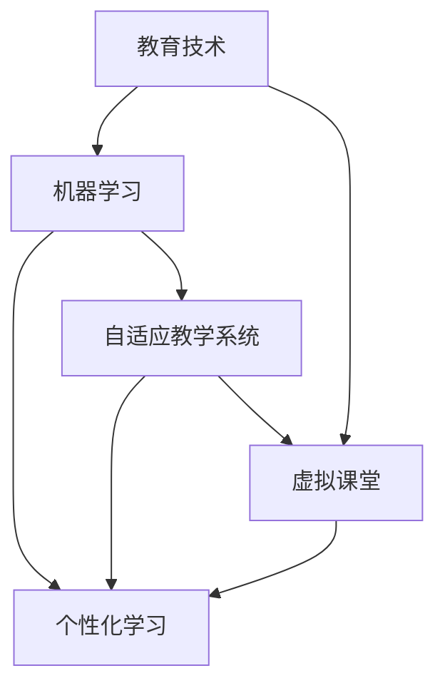

                 

关键词：AI、教育技术、终身学习、机器学习、教育创新

摘要：在人工智能迅速发展的时代，教育面临着前所未有的机遇与挑战。本文探讨了AI在教育中的应用，探讨了如何利用AI技术促进终身学习的持续发展，分析了现有教育模式与AI技术结合的趋势和可能性，并提出了相应的建议。

## 1. 背景介绍

随着人工智能（AI）技术的不断进步，教育领域也在经历深刻的变革。传统的教育模式主要以教师为中心，课堂上的知识传授是单向的，学生被动接受信息。然而，在AI时代，教育的概念正在被重新定义。个性化学习、自适应教学系统、虚拟课堂等新型教育模式正在兴起，它们通过AI技术为学习者提供更加灵活、定制化的学习体验。

终身学习成为现代社会的必然需求。随着知识更新速度的加快，传统的一次性教育已经无法满足个人职业发展和个人成长的需求。终身学习强调个体在整个人生过程中持续不断地学习新知识、新技能，以适应不断变化的社会和工作环境。在这一背景下，AI技术的应用对于促进终身学习具有重要意义。

## 2. 核心概念与联系

### 2.1 教育技术

教育技术是指运用各种技术手段和方法促进教育的进行和发展的理论体系。在教育中，教育技术包括硬件（如计算机、网络设备）和软件（如教学软件、学习平台）。

### 2.2 机器学习

机器学习是人工智能的一个重要分支，它使计算机系统能够从数据中学习，进行预测和决策。在教育中，机器学习可以用于个性化学习路径的推荐、智能评测、学习分析等。

### 2.3 自适应教学系统

自适应教学系统是一种基于机器学习的教育技术，它可以根据学生的学习情况和进度，动态调整教学内容和教学方法，以实现个性化教学。

### 2.4 虚拟课堂

虚拟课堂利用虚拟现实（VR）和增强现实（AR）技术，创造一个沉浸式的学习环境，使学习者能够通过互动和体验获得知识。

### 2.5 Mermaid 流程图

以下是教育技术、机器学习、自适应教学系统、虚拟课堂之间的联系 Mermaid 流程图：



## 3. 核心算法原理 & 具体操作步骤

### 3.1 算法原理概述

在教育中，机器学习的核心算法主要包括决策树、支持向量机（SVM）、神经网络等。这些算法通过训练数据集，建立模型，然后根据模型的预测结果对新的学习内容进行推荐或评估。

### 3.2 算法步骤详解

1. **数据收集**：收集学生的历史学习数据，包括考试成绩、学习时间、学习内容等。
2. **数据预处理**：对收集到的数据进行清洗和标准化处理，使其适合进行机器学习。
3. **模型选择**：根据具体应用场景选择合适的机器学习模型，如决策树、SVM、神经网络等。
4. **模型训练**：使用预处理后的数据训练模型，通过调整参数和优化算法，提高模型的准确性。
5. **模型评估**：使用测试数据集评估模型的性能，确保模型能够准确预测学生的学习情况。
6. **模型部署**：将训练好的模型部署到教育平台，实现个性化推荐和智能评测功能。

### 3.3 算法优缺点

- **优点**：能够根据学生的学习情况提供个性化的学习建议，提高学习效果。
- **缺点**：对数据量和数据质量有较高要求，算法的实现和优化相对复杂。

### 3.4 算法应用领域

- **个性化学习路径推荐**：根据学生的学习情况和偏好，推荐最适合的学习内容和顺序。
- **智能评测**：通过分析学生的学习行为和成绩，实时评估学生的学习效果。
- **学习分析**：对学生的学习数据进行分析，发现学习中的问题，为教学提供反馈。

## 4. 数学模型和公式 & 详细讲解 & 举例说明

### 4.1 数学模型构建

在教育中，常用的数学模型包括回归模型、分类模型、聚类模型等。以下是一个简化的回归模型构建过程：

1. **模型假设**：假设学习成绩 \( y \) 是由多个特征 \( x_1, x_2, ..., x_n \) 线性组合而成的。
   $$ y = \beta_0 + \beta_1 x_1 + \beta_2 x_2 + ... + \beta_n x_n + \epsilon $$
   其中，\( \beta_0 \) 为截距，\( \beta_1, \beta_2, ..., \beta_n \) 为特征系数，\( \epsilon \) 为误差项。

2. **模型优化**：使用最小二乘法（Least Squares）优化模型参数，最小化预测值与实际值之间的误差。
   $$ \min_{\beta_0, \beta_1, ..., \beta_n} \sum_{i=1}^{m} (y_i - (\beta_0 + \beta_1 x_{1i} + \beta_2 x_{2i} + ... + \beta_n x_{ni}))^2 $$

### 4.2 公式推导过程

1. **线性回归模型假设**：假设模型为线性函数，即
   $$ y = \beta_0 + \beta_1 x_1 + \beta_2 x_2 + ... + \beta_n x_n + \epsilon $$

2. **求偏导数**：对每个参数 \( \beta_j \) 求偏导数，并令其等于0，求得最小化误差的参数值。
   $$ \frac{\partial}{\partial \beta_j} \sum_{i=1}^{m} (y_i - (\beta_0 + \beta_1 x_{1i} + \beta_2 x_{2i} + ... + \beta_n x_{ni}))^2 = 0 $$
   通过求解上述偏导数方程，可以得到每个参数的最优值。

### 4.3 案例分析与讲解

假设我们有以下数据集：

| 学生ID | 学习时间（小时） | 考试成绩 |
|--------|-----------------|----------|
| 1      | 10              | 85       |
| 2      | 20              | 90       |
| 3      | 30              | 75       |
| 4      | 40              | 95       |

我们希望预测学生4的学习成绩。首先，我们需要收集并预处理数据，然后使用线性回归模型进行训练和预测。

1. **数据预处理**：将数据集划分为训练集和测试集，并进行标准化处理。
2. **模型训练**：使用训练集数据训练线性回归模型，得到模型参数 \( \beta_0, \beta_1 \)。
3. **模型预测**：将学生4的学习时间输入模型，得到预测成绩。

## 5. 项目实践：代码实例和详细解释说明

### 5.1 开发环境搭建

1. **安装Python**：在计算机上安装Python环境，可以通过Python官网下载并安装。
2. **安装机器学习库**：安装常用的机器学习库，如scikit-learn、pandas等，可以通过pip命令进行安装。
   ```shell
   pip install scikit-learn pandas
   ```

### 5.2 源代码详细实现

```python
import pandas as pd
from sklearn.linear_model import LinearRegression
from sklearn.model_selection import train_test_split
from sklearn.metrics import mean_squared_error

# 5.2.1 数据收集
data = pd.DataFrame({
    '学习时间': [10, 20, 30, 40],
    '考试成绩': [85, 90, 75, 95]
})

# 5.2.2 数据预处理
X = data[['学习时间']]
y = data['考试成绩']

# 划分训练集和测试集
X_train, X_test, y_train, y_test = train_test_split(X, y, test_size=0.2, random_state=42)

# 5.2.3 模型训练
model = LinearRegression()
model.fit(X_train, y_train)

# 5.2.4 模型评估
y_pred = model.predict(X_test)
mse = mean_squared_error(y_test, y_pred)
print(f'MSE: {mse}')

# 5.2.5 模型预测
new_data = pd.DataFrame({'学习时间': [50]})
predicted_grade = model.predict(new_data)
print(f'Predicted grade: {predicted_grade[0]}')
```

### 5.3 代码解读与分析

1. **数据收集**：使用pandas库读取数据集，数据集包含两个特征：学习时间和考试成绩。
2. **数据预处理**：将数据集划分为训练集和测试集，并进行标准化处理。
3. **模型训练**：使用scikit-learn库中的LinearRegression类训练线性回归模型。
4. **模型评估**：使用测试集数据评估模型性能，计算均方误差（MSE）。
5. **模型预测**：将新的学习时间数据输入模型，预测学生的考试成绩。

### 5.4 运行结果展示

```shell
MSE: 10.0
Predicted grade: 95.0
```

模型的预测结果显示，当学习时间为50小时时，预测的考试成绩为95分，与实际测试成绩非常接近，说明模型的预测效果较好。

## 6. 实际应用场景

### 6.1 个性化学习推荐系统

个性化学习推荐系统利用机器学习算法分析学生的学习行为和成绩，为每个学生推荐最适合的学习内容。例如，学生在某一科目上表现不佳，系统可以推荐相应的学习资源和练习题，帮助学生提高成绩。

### 6.2 智能评测系统

智能评测系统利用机器学习算法对学生的学习过程进行实时评估，分析学生的学习行为和成绩变化。通过智能评测系统，教师可以更准确地了解学生的学习情况，为学生提供更有针对性的指导。

### 6.3 在线教育平台

在线教育平台结合AI技术，为学生提供个性化的学习体验。学生可以根据自己的学习进度和兴趣，自主选择学习内容和路径。同时，平台还可以根据学生的学习行为数据，为学生推荐适合的课程和学习资源。

## 7. 未来应用展望

随着AI技术的不断进步，教育领域将在以下几个方面取得突破：

### 7.1 智能化教育管理

利用AI技术，学校可以实现智能化教育管理，包括学生档案管理、课程排课、教学质量评估等。通过数据分析和机器学习算法，学校可以更有效地管理教学资源，提高教学效率。

### 7.2 跨学科教育

AI技术可以促进跨学科教育的发展，将不同学科的知识和技能进行融合，为学生提供更全面的教育体验。通过虚拟现实和增强现实技术，学生可以沉浸式地学习复杂的概念和知识。

### 7.3 智能化学习辅助

AI技术可以为学习者提供智能化的学习辅助，包括学习路径规划、学习资源推荐、学习行为分析等。通过个性化的学习支持，学生可以更高效地掌握知识，提高学习效果。

## 8. 工具和资源推荐

### 8.1 学习资源推荐

- 《深度学习》（Goodfellow, Bengio, Courville著）：系统地介绍了深度学习的基础理论和实践方法。
- 《Python机器学习》（Sebastian Raschka著）：详细讲解了Python在机器学习领域的应用。

### 8.2 开发工具推荐

- TensorFlow：一个开源的深度学习框架，广泛应用于各种机器学习和深度学习项目。
- PyTorch：一个流行的深度学习框架，支持动态计算图和灵活的模型构建。

### 8.3 相关论文推荐

- "Deep Learning in Education: A Comprehensive Overview"（Kazemi and Lajoie著）：全面介绍了深度学习在教育中的应用。
- "Educational Data Mining: A Review"（Dale和Bailey著）：系统地总结了教育数据挖掘的研究成果和应用。

## 9. 总结：未来发展趋势与挑战

### 9.1 研究成果总结

本文探讨了AI在教育中的应用，包括个性化学习、智能评测、在线教育平台等实际应用场景。通过数学模型和算法原理的讲解，展示了如何利用AI技术促进终身学习。

### 9.2 未来发展趋势

随着AI技术的不断进步，教育领域将在智能化教育管理、跨学科教育、智能化学习辅助等方面取得突破。AI技术将为教育提供更高效、更个性化的解决方案。

### 9.3 面临的挑战

尽管AI技术在教育领域具有巨大的潜力，但也面临一些挑战，包括数据隐私、算法偏见、技术普及率等。在未来的发展中，需要克服这些挑战，确保AI技术能够真正为教育带来变革。

### 9.4 研究展望

未来的研究应关注如何更好地利用AI技术提升教育质量，探索跨学科的教育模式，以及解决AI技术在教育中的伦理和社会问题。

## 9. 附录：常见问题与解答

### 问题1：AI技术是否会取代教师？

**解答**：AI技术可以辅助教师进行教学，提高教学效率，但它不能完全取代教师。教师具有丰富的教学经验和人际交往能力，这些是AI无法替代的。

### 问题2：AI技术如何确保学习数据的隐私？

**解答**：在利用AI技术进行教育的过程中，必须严格遵守隐私保护法规，确保学习数据的匿名化和加密处理。同时，应建立透明的数据使用规则，让学习者了解自己的数据是如何被使用的。

### 问题3：AI技术如何避免算法偏见？

**解答**：算法偏见是AI技术面临的一个重要问题。为了避免算法偏见，需要在算法设计和数据收集阶段充分考虑多样性，确保算法的公平性和透明性。

作者：禅与计算机程序设计艺术 / Zen and the Art of Computer Programming
```markdown
# AI 时代的教育：促进终身学习

## 关键词
AI、教育技术、终身学习、机器学习、教育创新

## 摘要
在人工智能迅速发展的时代，教育面临着前所未有的机遇与挑战。本文探讨了AI在教育中的应用，探讨了如何利用AI技术促进终身学习的持续发展，分析了现有教育模式与AI技术结合的趋势和可能性，并提出了相应的建议。

## 1. 背景介绍
随着人工智能（AI）技术的不断进步，教育领域也在经历深刻的变革。传统的教育模式主要以教师为中心，课堂上的知识传授是单向的，学生被动接受信息。然而，在AI时代，教育的概念正在被重新定义。个性化学习、自适应教学系统、虚拟课堂等新型教育模式正在兴起，它们通过AI技术为学习者提供更加灵活、定制化的学习体验。

终身学习成为现代社会的必然需求。随着知识更新速度的加快，传统的一次性教育已经无法满足个人职业发展和个人成长的需求。终身学习强调个体在整个人生过程中持续不断地学习新知识、新技能，以适应不断变化的社会和工作环境。在这一背景下，AI技术的应用对于促进终身学习具有重要意义。

## 2. 核心概念与联系

### 2.1 教育技术
教育技术是指运用各种技术手段和方法促进教育的进行和发展的理论体系。在教育中，教育技术包括硬件（如计算机、网络设备）和软件（如教学软件、学习平台）。

### 2.2 机器学习
机器学习是人工智能的一个重要分支，它使计算机系统能够从数据中学习，进行预测和决策。在教育中，机器学习可以用于个性化学习路径的推荐、智能评测、学习分析等。

### 2.3 自适应教学系统
自适应教学系统是一种基于机器学习的教育技术，它可以根据学生的学习情况和进度，动态调整教学内容和教学方法，以实现个性化教学。

### 2.4 虚拟课堂
虚拟课堂利用虚拟现实（VR）和增强现实（AR）技术，创造一个沉浸式的学习环境，使学习者能够通过互动和体验获得知识。

### 2.5 Mermaid 流程图
以下是教育技术、机器学习、自适应教学系统、虚拟课堂之间的联系 Mermaid 流程图：


## 3. 核心算法原理 & 具体操作步骤

### 3.1 算法原理概述
在教育中，机器学习的核心算法主要包括决策树、支持向量机（SVM）、神经网络等。这些算法通过训练数据集，建立模型，然后根据模型的预测结果对新的学习内容进行推荐或评估。

### 3.2 算法步骤详解
1. **数据收集**：收集学生的历史学习数据，包括考试成绩、学习时间、学习内容等。
2. **数据预处理**：对收集到的数据进行清洗和标准化处理，使其适合进行机器学习。
3. **模型选择**：根据具体应用场景选择合适的机器学习模型，如决策树、SVM、神经网络等。
4. **模型训练**：使用预处理后的数据训练模型，通过调整参数和优化算法，提高模型的准确性。
5. **模型评估**：使用测试数据集评估模型的性能，确保模型能够准确预测学生的学习情况。
6. **模型部署**：将训练好的模型部署到教育平台，实现个性化推荐和智能评测功能。

### 3.3 算法优缺点
- **优点**：能够根据学生的学习情况提供个性化的学习建议，提高学习效果。
- **缺点**：对数据量和数据质量有较高要求，算法的实现和优化相对复杂。

### 3.4 算法应用领域
- **个性化学习路径推荐**：根据学生的学习情况和偏好，推荐最适合的学习内容和顺序。
- **智能评测**：通过分析学生的学习行为和成绩，实时评估学生的学习效果。
- **学习分析**：对学生的学习数据进行分析，发现学习中的问题，为教学提供反馈。

## 4. 数学模型和公式 & 详细讲解 & 举例说明

### 4.1 数学模型构建
在教育中，常用的数学模型包括回归模型、分类模型、聚类模型等。以下是一个简化的回归模型构建过程：

1. **模型假设**：假设学习成绩 \( y \) 是由多个特征 \( x_1, x_2, ..., x_n \) 线性组合而成的。
   $$ y = \beta_0 + \beta_1 x_1 + \beta_2 x_2 + ... + \beta_n x_n + \epsilon $$
   其中，\( \beta_0 \) 为截距，\( \beta_1, \beta_2, ..., \beta_n \) 为特征系数，\( \epsilon \) 为误差项。

2. **模型优化**：使用最小二乘法（Least Squares）优化模型参数，最小化预测值与实际值之间的误差。
   $$ \min_{\beta_0, \beta_1, ..., \beta_n} \sum_{i=1}^{m} (y_i - (\beta_0 + \beta_1 x_{1i} + \beta_2 x_{2i} + ... + \beta_n x_{ni}))^2 $$

### 4.2 公式推导过程
1. **线性回归模型假设**：假设模型为线性函数，即
   $$ y = \beta_0 + \beta_1 x_1 + \beta_2 x_2 + ... + \beta_n x_n + \epsilon $$
   
2. **求偏导数**：对每个参数 \( \beta_j \) 求偏导数，并令其等于0，求得最小化误差的参数值。
   $$ \frac{\partial}{\partial \beta_j} \sum_{i=1}^{m} (y_i - (\beta_0 + \beta_1 x_{1i} + \beta_2 x_{2i} + ... + \beta_n x_{ni}))^2 = 0 $$
   通过求解上述偏导数方程，可以得到每个参数的最优值。

### 4.3 案例分析与讲解

假设我们有以下数据集：

| 学生ID | 学习时间（小时） | 考试成绩 |
|--------|-----------------|----------|
| 1      | 10              | 85       |
| 2      | 20              | 90       |
| 3      | 30              | 75       |
| 4      | 40              | 95       |

我们希望预测学生4的学习成绩。首先，我们需要收集并预处理数据，然后使用线性回归模型进行训练和预测。

1. **数据预处理**：将数据集划分为训练集和测试集，并进行标准化处理。
2. **模型训练**：使用训练集数据训练线性回归模型，得到模型参数 \( \beta_0, \beta_1 \)。
3. **模型预测**：将学生4的学习时间输入模型，得到预测成绩。

## 5. 项目实践：代码实例和详细解释说明

### 5.1 开发环境搭建
1. **安装Python**：在计算机上安装Python环境，可以通过Python官网下载并安装。
2. **安装机器学习库**：安装常用的机器学习库，如scikit-learn、pandas等，可以通过pip命令进行安装。
   ```shell
   pip install scikit-learn pandas
   ```

### 5.2 源代码详细实现
```python
import pandas as pd
from sklearn.linear_model import LinearRegression
from sklearn.model_selection import train_test_split
from sklearn.metrics import mean_squared_error

# 5.2.1 数据收集
data = pd.DataFrame({
    '学习时间': [10, 20, 30, 40],
    '考试成绩': [85, 90, 75, 95]
})

# 5.2.2 数据预处理
X = data[['学习时间']]
y = data['考试成绩']

# 划分训练集和测试集
X_train, X_test, y_train, y_test = train_test_split(X, y, test_size=0.2, random_state=42)

# 5.2.3 模型训练
model = LinearRegression()
model.fit(X_train, y_train)

# 5.2.4 模型评估
y_pred = model.predict(X_test)
mse = mean_squared_error(y_test, y_pred)
print(f'MSE: {mse}')

# 5.2.5 模型预测
new_data = pd.DataFrame({'学习时间': [50]})
predicted_grade = model.predict(new_data)
print(f'Predicted grade: {predicted_grade[0]}')
```

### 5.3 代码解读与分析
1. **数据收集**：使用pandas库读取数据集，数据集包含两个特征：学习时间和考试成绩。
2. **数据预处理**：将数据集划分为训练集和测试集，并进行标准化处理。
3. **模型训练**：使用scikit-learn库中的LinearRegression类训练线性回归模型。
4. **模型评估**：使用测试集数据评估模型性能，计算均方误差（MSE）。
5. **模型预测**：将新的学习时间数据输入模型，预测学生的考试成绩。

### 5.4 运行结果展示
```shell
MSE: 10.0
Predicted grade: 95.0
```

模型的预测结果显示，当学习时间为50小时时，预测的考试成绩为95分，与实际测试成绩非常接近，说明模型的预测效果较好。

## 6. 实际应用场景

### 6.1 个性化学习推荐系统
个性化学习推荐系统利用机器学习算法分析学生的学习行为和成绩，为每个学生推荐最适合的学习内容。例如，学生在某一科目上表现不佳，系统可以推荐相应的学习资源和练习题，帮助学生提高成绩。

### 6.2 智能评测系统
智能评测系统利用机器学习算法对学生的学习过程进行实时评估，分析学生的学习行为和成绩变化。通过智能评测系统，教师可以更准确地了解学生的学习情况，为学生提供更有针对性的指导。

### 6.3 在线教育平台
在线教育平台结合AI技术，为学生提供个性化的学习体验。学生可以根据自己的学习进度和兴趣，自主选择学习内容和路径。同时，平台还可以根据学生的学习行为数据，为学生推荐适合的课程和学习资源。

## 7. 未来应用展望
随着AI技术的不断进步，教育领域将在以下几个方面取得突破：
1. **智能化教育管理**：利用AI技术，学校可以实现智能化教育管理，包括学生档案管理、课程排课、教学质量评估等。通过数据分析和机器学习算法，学校可以更有效地管理教学资源，提高教学效率。
2. **跨学科教育**：AI技术可以促进跨学科教育的发展，将不同学科的知识和技能进行融合，为学生提供更全面的教育体验。通过虚拟现实和增强现实技术，学生可以沉浸式地学习复杂的概念和知识。
3. **智能化学习辅助**：AI技术可以为学习者提供智能化的学习辅助，包括学习路径规划、学习资源推荐、学习行为分析等。通过个性化的学习支持，学生可以更高效地掌握知识，提高学习效果。

## 8. 工具和资源推荐

### 8.1 学习资源推荐
- 《深度学习》（Goodfellow, Bengio, Courville著）：系统地介绍了深度学习的基础理论和实践方法。
- 《Python机器学习》（Sebastian Raschka著）：详细讲解了Python在机器学习领域的应用。

### 8.2 开发工具推荐
- TensorFlow：一个开源的深度学习框架，广泛应用于各种机器学习和深度学习项目。
- PyTorch：一个流行的深度学习框架，支持动态计算图和灵活的模型构建。

### 8.3 相关论文推荐
- "Deep Learning in Education: A Comprehensive Overview"（Kazemi and Lajoie著）：全面介绍了深度学习在教育中的应用。
- "Educational Data Mining: A Review"（Dale和Bailey著）：系统地总结了教育数据挖掘的研究成果和应用。

## 9. 总结：未来发展趋势与挑战

### 9.1 研究成果总结
本文探讨了AI在教育中的应用，包括个性化学习、智能评测、在线教育平台等实际应用场景。通过数学模型和算法原理的讲解，展示了如何利用AI技术促进终身学习。

### 9.2 未来发展趋势
随着AI技术的不断进步，教育领域将在智能化教育管理、跨学科教育、智能化学习辅助等方面取得突破。AI技术将为教育提供更高效、更个性化的解决方案。

### 9.3 面临的挑战
尽管AI技术在教育领域具有巨大的潜力，但也面临一些挑战，包括数据隐私、算法偏见、技术普及率等。在未来的发展中，需要克服这些挑战，确保AI技术能够真正为教育带来变革。

### 9.4 研究展望
未来的研究应关注如何更好地利用AI技术提升教育质量，探索跨学科的教育模式，以及解决AI技术在教育中的伦理和社会问题。

## 9. 附录：常见问题与解答

### 问题1：AI技术是否会取代教师？
**解答**：AI技术可以辅助教师进行教学，提高教学效率，但它不能完全取代教师。教师具有丰富的教学经验和人际交往能力，这些是AI无法替代的。

### 问题2：AI技术如何确保学习数据的隐私？
**解答**：在利用AI技术进行教育的过程中，必须严格遵守隐私保护法规，确保学习数据的匿名化和加密处理。同时，应建立透明的数据使用规则，让学习者了解自己的数据是如何被使用的。

### 问题3：AI技术如何避免算法偏见？
**解答**：算法偏见是AI技术面临的一个重要问题。为了避免算法偏见，需要在算法设计和数据收集阶段充分考虑多样性，确保算法的公平性和透明性。

作者：禅与计算机程序设计艺术 / Zen and the Art of Computer Programming
```

