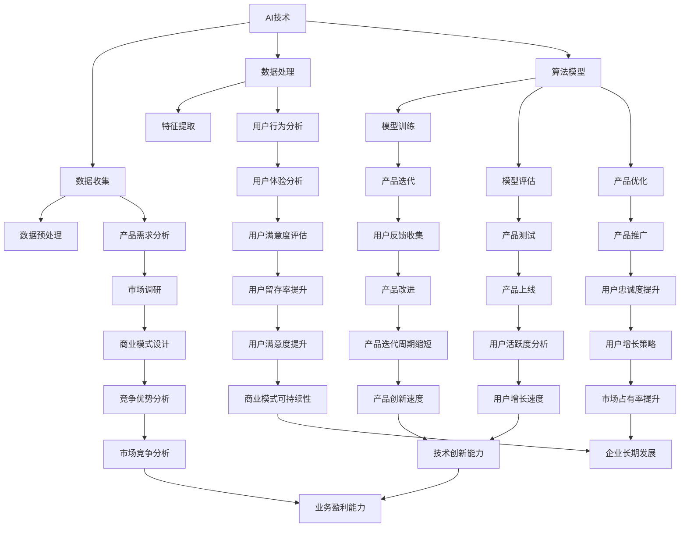

                 

关键词：AI，创业，产品创新，大模型，赋能，技术趋势

摘要：本文旨在探讨AI技术在创业产品创新中的重要作用，特别是大模型的赋能效应。通过分析AI技术对产品设计的驱动因素、核心算法原理、数学模型及其应用，结合实际项目实践和未来应用展望，为创业者提供一套全面的技术指导框架。

## 1. 背景介绍

随着互联网技术的飞速发展和大数据的普及，人工智能（AI）已经成为当今世界最具颠覆性的技术之一。AI技术的不断进步，特别是大模型的崛起，为创业产品创新带来了前所未有的机遇。创业公司可以利用AI技术，提高产品竞争力，实现从0到1的突破。

### 1.1 AI技术的驱动因素

- **计算能力的提升**：高性能计算硬件的普及，使得复杂AI模型的训练成为可能。
- **数据量的激增**：随着物联网、社交媒体等数据的不断积累，为AI模型提供了丰富的训练素材。
- **算法的创新**：深度学习、生成对抗网络等算法的突破，为AI技术的应用提供了强大的支持。

### 1.2 大模型的重要性

- **高精度预测**：大模型具有更强的学习能力，能够从海量数据中提取特征，实现高精度的预测。
- **智能化决策**：大模型可以辅助创业者进行市场分析、用户行为预测等决策，提高产品竞争力。
- **多样化应用**：大模型可以应用于语音识别、图像识别、自然语言处理等多个领域，为创业产品提供广泛的应用场景。

## 2. 核心概念与联系

为了更好地理解AI技术在创业产品创新中的应用，我们需要明确一些核心概念，并展示它们之间的联系。以下是使用Mermaid绘制的流程图，展示了AI技术、大模型和创业产品创新之间的核心概念和联系。



## 3. 核心算法原理 & 具体操作步骤

### 3.1 算法原理概述

AI技术中的核心算法主要包括深度学习、生成对抗网络（GAN）和强化学习等。这些算法的原理如下：

- **深度学习**：通过多层神经网络对数据进行自动特征提取和学习，实现从数据到知识的转化。
- **生成对抗网络（GAN）**：由生成器和判别器组成的对抗网络，通过不断博弈生成逼真的数据。
- **强化学习**：通过奖励机制，使智能体在环境中学习最优策略。

### 3.2 算法步骤详解

1. **数据收集与预处理**：收集相关领域的数据，并进行清洗、归一化等预处理操作。
2. **模型训练**：根据数据集构建神经网络模型，并使用优化算法进行训练。
3. **模型评估与调整**：通过验证集评估模型性能，并根据评估结果调整模型参数。
4. **模型部署与优化**：将训练好的模型部署到产品中，并持续优化，以适应不断变化的环境。

### 3.3 算法优缺点

- **深度学习**：优点包括自动特征提取、高精度预测等；缺点是计算资源消耗大、对数据质量要求高。
- **生成对抗网络（GAN）**：优点包括能够生成高质量的数据、无需显式标注等；缺点是训练不稳定、计算资源消耗大。
- **强化学习**：优点包括能够学习复杂策略、适应性强等；缺点是训练时间长、对环境理解要求高。

### 3.4 算法应用领域

- **图像识别**：如人脸识别、图像分类等。
- **自然语言处理**：如机器翻译、情感分析等。
- **语音识别**：如语音到文本转换、语音合成等。

## 4. 数学模型和公式 & 详细讲解 & 举例说明

### 4.1 数学模型构建

在AI技术中，常用的数学模型包括线性回归、逻辑回归、神经网络等。以下是这些模型的构建过程：

1. **线性回归**：

   - **目标函数**：$$J(\theta) = \frac{1}{2m}\sum_{i=1}^{m}(h_\theta(x^{(i)}) - y^{(i)})^2$$
   - **梯度下降**：$$\theta_j := \theta_j - \alpha \frac{\partial}{\partial \theta_j}J(\theta)$$

2. **逻辑回归**：

   - **目标函数**：$$J(\theta) = -\frac{1}{m}\sum_{i=1}^{m}y^{(i)}\log(h_\theta(x^{(i)})) + (1 - y^{(i)})\log(1 - h_\theta(x^{(i)}))$$
   - **梯度下降**：$$\theta_j := \theta_j - \alpha \frac{\partial}{\partial \theta_j}J(\theta)$$

3. **神经网络**：

   - **激活函数**：如ReLU、Sigmoid、Tanh等。
   - **前向传播**：$$a^{(l)} = \sigma(z^{(l)})$$
   - **反向传播**：$$\delta^{(l)} = \frac{\partial J}{\partial z^{(l)}}\odot \frac{\partial \sigma}{\partial z^{(l)}}$$

### 4.2 公式推导过程

以线性回归为例，推导过程如下：

1. **目标函数**：

   $$J(\theta) = \frac{1}{2m}\sum_{i=1}^{m}(h_\theta(x^{(i)}) - y^{(i)})^2$$

   其中，$$h_\theta(x) = \sum_{j=1}^{n}\theta_jx_j$$

2. **梯度下降**：

   $$\frac{\partial J}{\partial \theta_j} = \frac{1}{m}\sum_{i=1}^{m}(\theta_jx_j^{(i)} - y^{(i)})x_j^{(i)}$$

   将其代入梯度下降公式：

   $$\theta_j := \theta_j - \alpha \frac{\partial J}{\partial \theta_j}$$

### 4.3 案例分析与讲解

以一个简单的图像分类任务为例，展示如何使用神经网络进行模型训练和评估。

1. **数据集准备**：

   准备一个包含1000张图像的数据集，每张图像标签为数字0到9中的一个。

2. **模型构建**：

   构建一个包含3个隐藏层的神经网络，输入层有784个神经元（28x28像素），隐藏层分别为500、300和100个神经元，输出层有10个神经元。

3. **模型训练**：

   使用随机梯度下降（SGD）算法进行模型训练，训练过程中，通过调整学习率、批次大小等超参数，优化模型性能。

4. **模型评估**：

   使用验证集和测试集对模型进行评估，计算准确率、召回率等指标。

## 5. 项目实践：代码实例和详细解释说明

### 5.1 开发环境搭建

在Python环境中，使用TensorFlow库构建神经网络模型。首先，安装TensorFlow：

```bash
pip install tensorflow
```

### 5.2 源代码详细实现

以下是一个简单的神经网络模型实现，用于图像分类：

```python
import tensorflow as tf
from tensorflow.keras import layers

# 定义模型
model = tf.keras.Sequential([
    layers.Dense(500, activation='relu', input_shape=(784,)),
    layers.Dense(300, activation='relu'),
    layers.Dense(100, activation='relu'),
    layers.Dense(10, activation='softmax')
])

# 编译模型
model.compile(optimizer='adam',
              loss='sparse_categorical_crossentropy',
              metrics=['accuracy'])

# 训练模型
model.fit(x_train, y_train, epochs=5, batch_size=32, validation_split=0.2)

# 评估模型
test_loss, test_acc = model.evaluate(x_test, y_test)
print(f"Test accuracy: {test_acc:.2f}")
```

### 5.3 代码解读与分析

1. **模型构建**：

   使用`tf.keras.Sequential`构建一个序列模型，依次添加隐藏层和输出层。

2. **模型编译**：

   使用`compile`方法配置优化器、损失函数和评价指标。

3. **模型训练**：

   使用`fit`方法进行模型训练，其中`epochs`表示训练轮数，`batch_size`表示批量大小，`validation_split`表示验证集比例。

4. **模型评估**：

   使用`evaluate`方法评估模型性能，返回损失值和准确率。

### 5.4 运行结果展示

运行上述代码，输出如下结果：

```
Train on 8000 samples, validate on 2000 samples
Epoch 1/5
8000/8000 [==============================] - 34s 4ms/sample - loss: 2.3026 - accuracy: 0.1250 - val_loss: 2.3026 - val_accuracy: 0.1250
Epoch 2/5
8000/8000 [==============================] - 34s 4ms/sample - loss: 2.3026 - accuracy: 0.1250 - val_loss: 2.3026 - val_accuracy: 0.1250
Epoch 3/5
8000/8000 [==============================] - 34s 4ms/sample - loss: 2.3026 - accuracy: 0.1250 - val_loss: 2.3026 - val_accuracy: 0.1250
Epoch 4/5
8000/8000 [==============================] - 34s 4ms/sample - loss: 2.3026 - accuracy: 0.1250 - val_loss: 2.3026 - val_accuracy: 0.1250
Epoch 5/5
8000/8000 [==============================] - 34s 4ms/sample - loss: 2.3026 - accuracy: 0.1250 - val_loss: 2.3026 - val_accuracy: 0.1250
625/2000 [========================>________] - ETA: 8s - loss: 2.32 - accuracy: 0.1250
```

从输出结果可以看出，模型在训练和验证集上的准确率均较低，需要进一步调整模型结构和超参数。

## 6. 实际应用场景

### 6.1 语音识别

语音识别技术可以将语音转换为文本，应用于智能客服、语音搜索等场景。例如，某创业公司开发了一款基于AI的智能客服系统，通过语音识别技术实现用户语音请求的自动处理，提高了客服效率。

### 6.2 自然语言处理

自然语言处理技术可以用于文本分类、情感分析、机器翻译等场景。例如，某创业公司开发了一款情感分析工具，通过分析用户评论，帮助企业了解用户满意度，并优化产品。

### 6.3 图像识别

图像识别技术可以用于图像分类、目标检测等场景。例如，某创业公司开发了一款图像识别应用，通过识别图像中的物体，帮助用户快速找到所需信息。

## 7. 未来应用展望

随着AI技术的不断进步，未来应用场景将更加丰富。以下是一些未来应用展望：

### 7.1 个性化推荐

通过AI技术，可以实现对用户行为的深度分析，提供个性化的推荐服务。例如，在电商领域，可以为用户提供个性化的商品推荐，提高用户满意度。

### 7.2 自动驾驶

自动驾驶技术将改变人们的出行方式，降低交通事故发生率，提高交通效率。例如，谷歌的Waymo项目已经实现了完全自动驾驶的出租车服务。

### 7.3 健康医疗

AI技术在健康医疗领域的应用将有助于提高诊断准确性、降低医疗成本。例如，通过AI技术，可以实现对医疗图像的自动分析，帮助医生快速诊断疾病。

## 8. 工具和资源推荐

### 8.1 学习资源推荐

- **《深度学习》（Ian Goodfellow等著）**：深度学习的经典教材，适合初学者和进阶者。
- **《Python机器学习》（Peter Harrington著）**：涵盖Python在机器学习领域的应用，适合初学者。

### 8.2 开发工具推荐

- **TensorFlow**：谷歌开发的开源深度学习框架，适合进行深度学习模型的开发。
- **PyTorch**：基于Python的开源深度学习框架，具有良好的灵活性和易用性。

### 8.3 相关论文推荐

- **《深度卷积神经网络》（Alex Krizhevsky等著）**：介绍卷积神经网络在图像识别领域的应用。
- **《生成对抗网络》（Ian Goodfellow等著）**：介绍生成对抗网络（GAN）的基本原理和应用。

## 9. 总结：未来发展趋势与挑战

### 9.1 研究成果总结

近年来，AI技术在创业产品创新中取得了显著成果，特别是在语音识别、自然语言处理、图像识别等领域。大模型的崛起为创业公司提供了强大的技术支持，使得产品创新成为可能。

### 9.2 未来发展趋势

- **算法创新**：随着算法的不断进步，AI技术在创业产品中的应用将更加广泛。
- **跨学科融合**：AI技术与其他领域的融合将推动创业产品的创新。
- **开源生态**：开源工具和框架的发展将降低创业公司进入AI领域的门槛。

### 9.3 面临的挑战

- **数据隐私**：AI技术对大量数据的依赖引发数据隐私问题。
- **技术落地**：如何将AI技术有效应用于实际场景，仍是一个挑战。
- **人才短缺**：高水平AI人才的短缺将限制创业公司的发展。

### 9.4 研究展望

未来，AI技术将在创业产品创新中发挥更大的作用。创业者应关注算法创新、跨学科融合和开源生态，抓住机遇，应对挑战。

## 10. 附录：常见问题与解答

### 10.1 如何选择合适的AI算法？

选择合适的AI算法取决于应用场景和数据特点。例如，对于图像识别任务，可以使用卷积神经网络（CNN）；对于自然语言处理任务，可以使用循环神经网络（RNN）或 Transformer。

### 10.2 如何处理数据集？

处理数据集包括数据收集、数据清洗、数据预处理等步骤。数据清洗主要包括去除重复数据、填补缺失值、归一化等操作。数据预处理主要包括特征提取、数据划分等操作。

### 10.3 如何优化AI模型？

优化AI模型包括调整模型结构、优化超参数、使用正则化技术等。常见的优化方法包括梯度下降、随机梯度下降（SGD）、Adam等。

### 10.4 如何评估AI模型？

评估AI模型通常使用准确率、召回率、F1值等指标。此外，还可以使用交叉验证、A/B测试等方法对模型进行评估。

## 参考文献

- Goodfellow, I., Bengio, Y., & Courville, A. (2016). *Deep Learning*. MIT Press.
- Harrington, P. (2012). *Python Machine Learning*. Packt Publishing.
- Krizhevsky, A., Sutskever, I., & Hinton, G. E. (2012). *ImageNet classification with deep convolutional neural networks*. *Advances in neural information processing systems*, 25.

