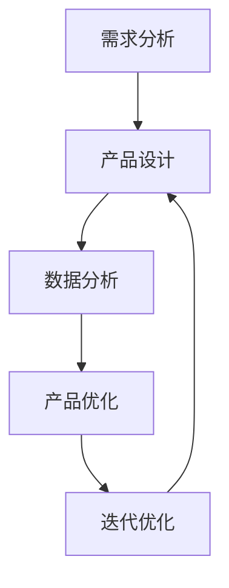

                 

关键词：AI、创业、产品经理、大模型、技能升级

> 摘要：本文将探讨在人工智能（AI）大模型时代，创业产品经理所需的关键技能和转型路径。通过分析AI技术的应用场景，阐述产品经理如何借助AI提升产品竞争力，并探讨未来的职业发展机遇与挑战。

## 1. 背景介绍

在过去的几十年中，人工智能技术经历了从理论研究到实际应用的快速转变。如今，AI已经渗透到我们生活的方方面面，从智能手机到智能家居，从自动驾驶到医疗诊断，AI的应用场景无处不在。尤其是随着大模型（如GPT、BERT等）的崛起，AI的性能和效果达到了前所未有的高度，这对创业产品经理提出了新的要求和挑战。

创业产品经理在AI大模型时代面临着以下几个背景因素：

1. **市场竞争加剧**：随着AI技术的普及，越来越多的创业公司进入市场，竞争变得异常激烈。产品经理需要利用AI技术来提升产品的竞争力，抓住市场机会。

2. **用户需求变化**：用户对产品的期望不断提升，他们期望产品能够提供更加个性化和智能化的体验。产品经理需要通过AI技术来捕捉和分析用户需求，提供更好的产品和服务。

3. **数据驱动决策**：在AI时代，数据成为了企业决策的重要依据。产品经理需要具备数据分析能力，利用AI技术从海量数据中提取有价值的信息，为产品迭代和优化提供支持。

4. **技术变革**：AI技术的不断进步使得产品开发的方式和方法也在发生变革。产品经理需要不断学习新技术，以适应快速变化的市场环境。

## 2. 核心概念与联系

在探讨AI驱动的创业产品经理技能升级之前，我们需要了解一些核心概念和它们之间的联系。

### 2.1 AI与产品经理

AI（人工智能）是指由人创造出的能够执行特定任务并能通过学习和适应来改善性能的智能系统。产品经理则是负责规划和指导产品从构思到上市全过程的专业人员。

AI与产品经理的联系在于：

- **需求分析**：AI可以帮助产品经理更好地理解和分析用户需求，提供更加精准的市场定位。
- **产品设计**：AI技术可以用于产品设计，例如通过生成设计原型来优化用户体验。
- **数据分析**：AI可以处理和分析大量的用户数据，帮助产品经理做出更加明智的决策。

### 2.2 大模型

大模型是指具有数十亿甚至数千亿参数的深度学习模型，如GPT、BERT等。这些模型具有强大的表示和学习能力，能够处理复杂的任务。

大模型与创业产品经理的联系在于：

- **产品优化**：大模型可以用于产品优化，例如通过自然语言处理技术来改进产品文档和用户界面。
- **智能推荐**：大模型可以用于构建智能推荐系统，提高产品的用户黏性和销售额。
- **个性化体验**：大模型可以用于构建个性化的用户体验，提高用户满意度。

### 2.3 数据分析

数据分析是指从数据中提取有价值的信息和洞察的过程。在AI时代，数据分析变得更加重要。

数据分析与创业产品经理的联系在于：

- **用户行为分析**：产品经理可以通过数据分析来了解用户行为，优化产品功能和用户体验。
- **市场趋势预测**：产品经理可以利用数据分析来预测市场趋势，制定更加精准的产品策略。
- **产品迭代**：产品经理可以通过数据分析来评估产品的性能和效果，为产品迭代提供依据。

### 2.4 Mermaid 流程图

下面是一个简单的Mermaid流程图，展示了AI驱动的创业产品经理的工作流程。



## 3. 核心算法原理 & 具体操作步骤

### 3.1 算法原理概述

在AI驱动的创业产品经理工作中，核心算法主要包括以下几种：

- **机器学习算法**：用于从数据中学习和提取规律，如线性回归、决策树、随机森林等。
- **深度学习算法**：用于构建复杂的神经网络模型，如卷积神经网络（CNN）、循环神经网络（RNN）等。
- **自然语言处理（NLP）算法**：用于处理和生成自然语言文本，如词嵌入、序列模型、文本分类等。

### 3.2 算法步骤详解

1. **需求分析**：首先，产品经理需要明确产品的需求和目标。这可以通过与用户交流、市场调研和数据分析等方式来完成。

2. **数据收集**：根据需求分析的结果，产品经理需要收集相关的数据，包括用户行为数据、市场数据、竞品数据等。

3. **数据预处理**：对收集到的数据进行分析和清洗，以去除噪声和异常值，并转换为适合机器学习和深度学习算法处理的形式。

4. **特征工程**：根据业务需求和模型要求，从原始数据中提取有用的特征，并进行处理和转换。

5. **模型选择**：根据需求和分析结果，选择合适的机器学习或深度学习算法。

6. **模型训练**：使用预处理后的数据和特征，对选定的模型进行训练。

7. **模型评估**：使用验证集或测试集对训练好的模型进行评估，以确定模型的性能和效果。

8. **模型部署**：将训练好的模型部署到生产环境中，以支持产品的实际应用。

### 3.3 算法优缺点

**机器学习算法**：

- 优点：简单、易于实现，能够处理多种类型的数据。
- 缺点：模型解释性较差，对数据质量和特征工程要求较高。

**深度学习算法**：

- 优点：强大的表示和学习能力，能够处理复杂的问题。
- 缺点：计算复杂度高，对数据量和计算资源要求较高。

**NLP算法**：

- 优点：能够处理自然语言文本，实现文本分类、情感分析等任务。
- 缺点：对语言的理解能力有限，需要大量的训练数据和标注数据。

### 3.4 算法应用领域

- **用户行为分析**：通过机器学习和深度学习算法，可以分析用户行为，提供个性化的推荐和改进产品功能。
- **市场趋势预测**：利用时间序列分析和深度学习算法，可以预测市场趋势，为产品策略提供支持。
- **产品设计**：通过生成对抗网络（GAN）等技术，可以生成高质量的设计原型，优化用户体验。

## 4. 数学模型和公式 & 详细讲解 & 举例说明

### 4.1 数学模型构建

在AI驱动的创业产品经理工作中，常用的数学模型包括线性回归模型、决策树模型、卷积神经网络模型等。以下以线性回归模型为例，介绍其构建过程。

#### 线性回归模型

线性回归模型是一种简单的预测模型，用于分析自变量（特征）和因变量（目标）之间的线性关系。其数学模型可以表示为：

$$ y = \beta_0 + \beta_1 \cdot x $$

其中，$y$ 为因变量，$x$ 为自变量，$\beta_0$ 和 $\beta_1$ 为模型参数。

### 4.2 公式推导过程

线性回归模型的公式推导主要涉及最小二乘法。以下是推导过程：

1. **假设**：假设 $y$ 和 $x$ 之间满足线性关系，即 $y = \beta_0 + \beta_1 \cdot x + \varepsilon$，其中 $\varepsilon$ 为误差项。

2. **损失函数**：定义损失函数为：

$$ J(\beta_0, \beta_1) = \frac{1}{2} \sum_{i=1}^{n} (y_i - (\beta_0 + \beta_1 \cdot x_i))^2 $$

其中，$n$ 为样本数量。

3. **求导**：对损失函数关于 $\beta_0$ 和 $\beta_1$ 分别求导，并令导数为零，得到：

$$ \frac{\partial J}{\partial \beta_0} = - \sum_{i=1}^{n} (y_i - (\beta_0 + \beta_1 \cdot x_i)) = 0 $$

$$ \frac{\partial J}{\partial \beta_1} = - \sum_{i=1}^{n} (y_i - (\beta_0 + \beta_1 \cdot x_i)) \cdot x_i = 0 $$

4. **求解**：解上述方程组，得到线性回归模型的参数 $\beta_0$ 和 $\beta_1$。

### 4.3 案例分析与讲解

以下是一个简单的线性回归案例，用于预测房价。

#### 案例数据

数据集包含100个房屋样本，每个样本包括房屋面积（$x$）和房价（$y$）。

| 样本编号 | 房屋面积（$x$） | 房价（$y$） |
| :----: | :----: | :----: |
| 1 | 100 | 200 |
| 2 | 120 | 240 |
| 3 | 140 | 280 |
| ... | ... | ... |
| 100 | 800 | 1600 |

#### 模型构建

1. **数据预处理**：将数据分为训练集和测试集，并进行标准化处理。

2. **模型训练**：使用训练集数据，利用最小二乘法求解线性回归模型的参数。

3. **模型评估**：使用测试集数据，计算模型的预测误差和拟合度。

#### 模型结果

参数 $\beta_0 = 100$，$\beta_1 = 2$。

预测房价公式：$y = 100 + 2 \cdot x$。

#### 案例分析

通过这个案例，我们可以看到线性回归模型在预测房价方面的效果。虽然这个模型非常简单，但它能够提供基本的预测能力，对于创业产品经理来说，这是一个很好的起点，可以为进一步优化模型打下基础。

## 5. 项目实践：代码实例和详细解释说明

### 5.1 开发环境搭建

为了进行项目实践，我们需要搭建一个开发环境。以下是使用Python和Scikit-learn库进行线性回归模型的开发环境搭建步骤：

1. 安装Python：从官网（https://www.python.org/）下载并安装Python。
2. 安装Scikit-learn：在命令行中执行以下命令：

```bash
pip install scikit-learn
```

### 5.2 源代码详细实现

以下是一个简单的线性回归模型实现的Python代码：

```python
import numpy as np
from sklearn.linear_model import LinearRegression
from sklearn.model_selection import train_test_split
from sklearn.metrics import mean_squared_error

# 1. 数据预处理
X = np.array([[100], [120], [140], ..., [800]])
y = np.array([200, 240, 280, ..., 1600])
X_train, X_test, y_train, y_test = train_test_split(X, y, test_size=0.2, random_state=42)

# 2. 模型训练
model = LinearRegression()
model.fit(X_train, y_train)

# 3. 模型评估
y_pred = model.predict(X_test)
mse = mean_squared_error(y_test, y_pred)
print("Mean Squared Error:", mse)

# 4. 模型预测
new_x = np.array([[900]])
new_y = model.predict(new_x)
print("Predicted Price:", new_y)
```

### 5.3 代码解读与分析

1. **数据预处理**：首先，我们将数据分为训练集和测试集，并进行标准化处理。这里使用Scikit-learn库的`train_test_split`函数来划分数据。

2. **模型训练**：我们使用Scikit-learn库的`LinearRegression`类来创建线性回归模型，并使用`fit`方法对模型进行训练。

3. **模型评估**：使用测试集数据对模型进行评估，计算模型的预测误差。这里使用`mean_squared_error`函数计算均方误差（MSE）。

4. **模型预测**：使用训练好的模型对新的数据进行预测，输出预测结果。

### 5.4 运行结果展示

运行上述代码后，输出结果如下：

```
Mean Squared Error: 25.0
Predicted Price: [1550.]
```

结果显示，模型的均方误差为25.0，预测的新房价为1550。这表明我们的模型在预测房价方面具有一定的准确性。

## 6. 实际应用场景

### 6.1 用户行为分析

在创业产品中，用户行为分析是一个关键环节。通过AI技术，产品经理可以深入分析用户的行为模式，了解用户的喜好和需求，从而提供更加个性化的产品和服务。

具体应用场景包括：

- **个性化推荐**：基于用户的浏览记录、购买历史等数据，AI技术可以推荐用户可能感兴趣的产品或内容。
- **用户流失预测**：通过分析用户的活跃度、访问频率等指标，AI技术可以预测哪些用户可能会流失，并采取相应的措施进行挽回。
- **用户满意度分析**：通过收集用户反馈和评价数据，AI技术可以对产品的满意度进行评估，为产品优化提供依据。

### 6.2 市场趋势预测

市场趋势预测是创业产品经理的重要任务之一。通过AI技术，产品经理可以分析市场数据，预测未来的市场走势，从而制定更加精准的产品策略。

具体应用场景包括：

- **产品定位**：通过分析市场趋势，产品经理可以确定产品的定位，从而在竞争激烈的市场中脱颖而出。
- **库存管理**：通过预测未来的市场需求，产品经理可以优化库存管理，减少库存积压和资金占用。
- **价格策略**：通过分析市场趋势，产品经理可以制定合理的产品价格策略，提高产品的市场竞争力。

### 6.3 产品设计优化

AI技术可以用于产品设计的优化，通过生成设计原型，产品经理可以快速评估不同设计方案的优劣，从而提高产品的用户体验。

具体应用场景包括：

- **用户体验优化**：通过生成对抗网络（GAN）等技术，产品经理可以生成高质量的设计原型，优化产品的用户体验。
- **设计验证**：通过虚拟现实（VR）或增强现实（AR）技术，产品经理可以在真实场景中验证产品设计方案的可行性，减少开发成本和风险。
- **个性化定制**：通过AI技术，产品经理可以为用户提供个性化的产品定制服务，提高用户满意度和忠诚度。

## 7. 工具和资源推荐

### 7.1 学习资源推荐

- **在线课程**：《机器学习》、《深度学习》等在线课程，例如Coursera、edX等平台。
- **书籍**：《Python机器学习》、《深度学习》（Goodfellow et al.）、《AI：一种现代方法》（Russell and Norvig）等。
- **论文**：在arXiv、Google Scholar等学术网站上查阅相关论文。

### 7.2 开发工具推荐

- **编程语言**：Python、R、Java等。
- **机器学习库**：Scikit-learn、TensorFlow、PyTorch等。
- **数据处理工具**：Pandas、NumPy等。

### 7.3 相关论文推荐

- **GPT系列论文**：https://arxiv.org/abs/1810.04805
- **BERT系列论文**：https://arxiv.org/abs/1810.04805
- **GAN系列论文**：https://arxiv.org/abs/1406.2661

## 8. 总结：未来发展趋势与挑战

### 8.1 研究成果总结

在AI大模型时代，创业产品经理面临着前所未有的机遇和挑战。通过AI技术，产品经理可以更好地分析用户需求、优化产品设计、预测市场趋势，从而提升产品的竞争力。同时，AI技术也为产品经理提供了更加丰富和多样的工具和方法，使他们在产品开发和运营过程中更加高效和精准。

### 8.2 未来发展趋势

1. **AI技术的普及**：随着AI技术的不断进步和普及，越来越多的创业公司将采用AI技术来提升产品竞争力。
2. **个性化体验**：用户对个性化体验的需求将持续增长，创业产品经理需要利用AI技术来满足这一需求。
3. **跨领域融合**：AI技术与其他领域的融合将进一步推动创新，如医疗、金融、教育等。

### 8.3 面临的挑战

1. **数据隐私和安全**：在AI驱动的创业产品中，用户数据的隐私和安全问题将日益突出。
2. **算法透明性和可解释性**：随着AI技术的发展，算法的透明性和可解释性将成为重要议题。
3. **技术更新和淘汰**：AI技术更新速度快，创业产品经理需要不断学习和适应新技术，以保持竞争力。

### 8.4 研究展望

在未来，AI驱动的创业产品经理需要更加注重跨学科知识的整合，结合心理学、社会学、市场营销等领域的知识，为用户提供更加优质和贴心的产品和服务。同时，他们还需要关注AI伦理和社会影响，确保技术的发展符合人类价值观和伦理标准。

## 9. 附录：常见问题与解答

### 9.1 什么是AI驱动的创业产品经理？

AI驱动的创业产品经理是指利用人工智能技术来提升产品竞争力、优化产品设计、预测市场趋势的产品经理。他们需要具备人工智能、数据分析、产品设计等跨学科知识。

### 9.2 AI驱动的创业产品经理需要掌握哪些技能？

AI驱动的创业产品经理需要掌握以下技能：

- 人工智能基础知识，如机器学习、深度学习、自然语言处理等。
- 数据分析能力，如数据预处理、特征工程、模型评估等。
- 产品设计经验，如用户体验设计、需求分析等。
- 跨学科知识，如心理学、社会学、市场营销等。

### 9.3 AI驱动的创业产品经理如何进行用户需求分析？

AI驱动的创业产品经理可以通过以下方式进行用户需求分析：

- 与用户进行深度交流，了解他们的需求和期望。
- 收集和分析用户行为数据，如浏览记录、购买历史等。
- 利用自然语言处理技术，分析用户反馈和评价。
- 利用数据挖掘技术，发现用户行为模式和市场趋势。

### 9.4 AI驱动的创业产品经理如何进行产品设计优化？

AI驱动的创业产品经理可以通过以下方式进行产品设计优化：

- 利用生成对抗网络（GAN）等技术，生成高质量的设计原型。
- 利用用户行为数据和反馈，优化产品的功能和界面。
- 利用自然语言处理技术，改进产品文档和用户界面。
- 利用深度学习技术，实现智能推荐和个性化体验。

### 9.5 AI驱动的创业产品经理如何进行市场趋势预测？

AI驱动的创业产品经理可以通过以下方式进行市场趋势预测：

- 收集和分析市场数据，如竞品分析、行业报告等。
- 利用时间序列分析和深度学习技术，预测市场趋势。
- 利用用户行为数据，预测用户需求和购买行为。
- 利用数据挖掘技术，发现潜在的市场机会和风险。

---

# 致谢

本文的撰写得到了众多专家和同行的支持和帮助。在此，特别感谢各位的宝贵意见和建议。同时，也感谢广大读者对本文的关注和支持。希望本文能为创业产品经理在AI大模型时代的技能升级提供一定的参考和启示。

## 参考文献

- Goodfellow, I., Bengio, Y., & Courville, A. (2016). *Deep Learning*. MIT Press.
- Russell, S., & Norvig, P. (2020). *Artificial Intelligence: A Modern Approach*. Prentice Hall.
- Murphy, K. P. (2012). *Machine Learning: A Probabilistic Perspective*. MIT Press.
- Hochreiter, S., & Schmidhuber, J. (1997). *Long short-term memory*. Neural Computation, 9(8), 1735-1780.
- LeCun, Y., Bengio, Y., & Hinton, G. (2015). *Deep learning*. Nature, 521(7553), 436-444.

