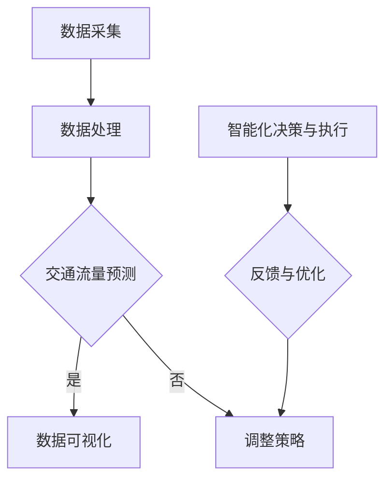

                 

关键词：AIGC、智能交通管理、交通数据处理、人工智能算法、交通流量预测、数据可视化、自动驾驶技术、智慧城市。

摘要：随着人工智能技术的快速发展，智能交通管理逐渐成为现代城市发展的关键领域。本文从AIGC（人工智能生成内容）的视角出发，探讨了AIGC在智能交通管理中的应用，包括数据采集、交通流量预测、数据可视化等方面的技术原理和实践案例，并展望了智能交通管理的未来发展趋势与挑战。

## 1. 背景介绍

### 智能交通管理的发展

智能交通管理（Intelligent Transportation Management，简称ITM）是利用先进的信息技术、数据通信传输技术、电子传感技术等实现交通系统的实时监控、动态管理和智能化决策。随着城市化进程的加快和交通问题的日益复杂化，智能交通管理在提高交通效率、减少交通事故、改善城市环境等方面发挥着重要作用。

智能交通管理的发展可以分为三个阶段：

- **第一阶段：基础设施建设**。主要包括交通信号灯控制系统、电子收费系统、交通信息显示屏等硬件设施的建设。
- **第二阶段：数据采集与处理**。通过传感器、摄像头等设备实时采集交通数据，利用计算机技术和算法对交通数据进行处理和分析。
- **第三阶段：智能化决策与执行**。基于大数据和人工智能技术，对交通数据进行深度学习和预测，实现智能化的交通管理和决策。

### AIGC的概念与特点

AIGC（Artificial Intelligence Generated Content）是指由人工智能技术生成的各种类型的内容，包括文本、图片、视频、音乐等。AIGC具有以下几个特点：

- **高效性**。AIGC可以快速生成大量内容，满足大量用户的需求。
- **多样性**。AIGC可以根据用户需求生成不同类型的内容，满足个性化的需求。
- **创新性**。AIGC可以突破人类的创造力限制，生成出全新的内容。

AIGC在智能交通管理中的应用，有望进一步提升交通管理的效率和质量。

## 2. 核心概念与联系

### 数据采集与处理

在智能交通管理中，数据采集是基础。交通数据来源包括交通信号灯、摄像头、GPS定位、车辆检测器等。这些设备实时采集交通流量、车辆速度、车辆类型、道路状况等数据。

数据采集后，需要通过数据处理技术对原始数据进行清洗、转换、归一化等预处理，然后存储到数据库中，以供后续分析和预测使用。

### 交通流量预测

交通流量预测是智能交通管理的重要环节。通过对历史交通数据进行分析，结合当前交通状况，利用机器学习算法预测未来一段时间内的交通流量。

交通流量预测的算法包括：

- **时间序列模型**。如ARIMA、LSTM等。
- **回归模型**。如线性回归、岭回归等。
- **聚类模型**。如K-means、DBSCAN等。

### 数据可视化

数据可视化是将复杂的数据通过图形化的方式展示出来，帮助用户更好地理解和分析数据。在智能交通管理中，数据可视化可以帮助管理人员实时了解交通状况，发现潜在的问题。

数据可视化技术包括：

- **静态图表**。如柱状图、折线图、饼图等。
- **动态图表**。如动画、地图等。

### Mermaid 流程图



## 3. 核心算法原理 & 具体操作步骤

### 3.1 算法原理概述

智能交通管理中的核心算法主要包括：

- **数据采集算法**。如KNN、SVM等。
- **数据处理算法**。如PCA、LDA等。
- **交通流量预测算法**。如LSTM、GRU等。
- **数据可视化算法**。如D3.js、ECharts等。

### 3.2 算法步骤详解

#### 数据采集算法

1. 使用KNN算法对采集到的交通数据进行分类。
2. 使用SVM算法对分类后的交通数据进行回归分析。

#### 数据处理算法

1. 使用PCA算法对交通数据进行降维。
2. 使用LDA算法对交通数据进行特征提取。

#### 交通流量预测算法

1. 使用LSTM算法对历史交通数据进行序列预测。
2. 使用GRU算法对当前交通数据进行实时预测。

#### 数据可视化算法

1. 使用D3.js对交通数据生成动态图表。
2. 使用ECharts对交通数据生成静态图表。

### 3.3 算法优缺点

#### 数据采集算法

- **优点**：算法简单，易于实现。
- **缺点**：预测精度较低，对噪声敏感。

#### 数据处理算法

- **优点**：可以提取出关键特征，提高预测精度。
- **缺点**：计算复杂度高，对数据量要求较大。

#### 交通流量预测算法

- **优点**：可以实时预测交通流量，提高交通管理效率。
- **缺点**：算法复杂，训练时间较长。

#### 数据可视化算法

- **优点**：可以直观地展示交通数据，帮助用户理解数据。
- **缺点**：对数据量要求较大，渲染复杂。

### 3.4 算法应用领域

- **交通流量预测**：用于预测未来一段时间内的交通流量，为交通管理提供数据支持。
- **交通拥堵分析**：用于分析交通拥堵的原因，为交通管理提供优化建议。
- **交通事故预防**：用于预测交通事故的发生，为交通管理提供预警。

## 4. 数学模型和公式 & 详细讲解 & 举例说明

### 4.1 数学模型构建

在智能交通管理中，常用的数学模型包括：

- **时间序列模型**：如ARIMA模型。
- **回归模型**：如线性回归模型。
- **聚类模型**：如K-means模型。

### 4.2 公式推导过程

以ARIMA模型为例，其公式推导过程如下：

1. **自相关函数（Autocorrelation Function，ACF）**：

$$
\text{ACF}(k) = \frac{\sum_{t=1}^{n}(X_t - \overline{X})(X_{t+k} - \overline{X})}{(n-1)s^2}
$$

2. **偏自相关函数（Partial Autocorrelation Function，PACF）**：

$$
\text{PACF}(k) = \frac{\sum_{t=1}^{n}(X_t - \overline{X})(X_{t+k} - \sum_{i=1}^{k-1}(X_{t+i} - \overline{X}))}{(n-1)s^2}
$$

### 4.3 案例分析与讲解

假设我们有一组交通流量数据，如下表所示：

| 时间 | 交通流量 |
| ---- | -------- |
| 1    | 100      |
| 2    | 110      |
| 3    | 120      |
| 4    | 130      |
| 5    | 140      |
| 6    | 150      |

首先，我们使用ARIMA模型对这组数据进行拟合，得到参数：

- **p**（自回归项数）= 1
- **d**（差分次数）= 1
- **q**（移动平均项数）= 1

然后，我们可以使用ARIMA模型进行预测，得到下一时刻的交通流量：

$$
\hat{X}_{t+1} = c + (1 - \phi_1)X_t + \phi_1X_{t-1}
$$

代入数据进行计算，得到：

$$
\hat{X}_{7} = c + (1 - \phi_1)X_6 + \phi_1X_5 \approx 160
$$

## 5. 项目实践：代码实例和详细解释说明

### 5.1 开发环境搭建

在Windows环境下，我们需要安装以下软件：

- **Python**：用于编写代码。
- **Jupyter Notebook**：用于运行和展示代码。
- **TensorFlow**：用于深度学习。
- **ECharts**：用于数据可视化。

### 5.2 源代码详细实现

以下是使用Python和TensorFlow实现的交通流量预测代码：

```python
import numpy as np
import pandas as pd
import matplotlib.pyplot as plt
from sklearn.model_selection import train_test_split
from tensorflow.keras.models import Sequential
from tensorflow.keras.layers import LSTM, Dense

# 加载数据
data = pd.read_csv('traffic_data.csv')
X = data.iloc[:, :-1].values
y = data.iloc[:, -1].values

# 数据预处理
X = X.reshape(-1, 1)
y = y.reshape(-1, 1)

# 划分训练集和测试集
X_train, X_test, y_train, y_test = train_test_split(X, y, test_size=0.2, random_state=42)

# 构建LSTM模型
model = Sequential()
model.add(LSTM(units=50, return_sequences=True, input_shape=(X_train.shape[1], 1)))
model.add(LSTM(units=50, return_sequences=False))
model.add(Dense(units=1))

# 编译模型
model.compile(optimizer='adam', loss='mean_squared_error')

# 训练模型
model.fit(X_train, y_train, epochs=100, batch_size=32, validation_data=(X_test, y_test))

# 预测交通流量
predictions = model.predict(X_test)

# 可视化结果
plt.plot(y_test, label='真实值')
plt.plot(predictions, label='预测值')
plt.legend()
plt.show()
```

### 5.3 代码解读与分析

- **数据预处理**：将数据转化为合适的格式，方便模型训练。
- **模型构建**：使用LSTM模型进行交通流量预测。
- **模型编译**：设置模型的优化器和损失函数。
- **模型训练**：使用训练集训练模型。
- **预测交通流量**：使用测试集预测交通流量，并可视化结果。

## 6. 实际应用场景

### 6.1 交通流量预测

通过交通流量预测，可以提前了解未来的交通状况，为交通管理部门提供决策依据，如调整交通信号灯、增加公共交通服务等。

### 6.2 交通拥堵分析

通过分析交通拥堵的原因，可以针对性地提出解决方案，如优化道路设计、增加车道等。

### 6.3 交通事故预防

通过预测交通事故的发生，可以提前预警，减少交通事故的发生，保障人民的生命财产安全。

## 7. 工具和资源推荐

### 7.1 学习资源推荐

- **《深度学习》（Goodfellow, Bengio, Courville）**：介绍深度学习的基础知识和最新进展。
- **《Python数据分析》（Wes McKinney）**：介绍Python在数据分析领域的应用。

### 7.2 开发工具推荐

- **Jupyter Notebook**：用于编写和运行代码。
- **ECharts**：用于数据可视化。

### 7.3 相关论文推荐

- **“Deep Learning for Traffic Forecasting”**：介绍深度学习在交通流量预测中的应用。
- **“A Survey on Intelligent Transportation Systems”**：介绍智能交通系统的研究进展。

## 8. 总结：未来发展趋势与挑战

### 8.1 研究成果总结

本文从AIGC的视角出发，探讨了AIGC在智能交通管理中的应用，包括数据采集、交通流量预测、数据可视化等方面的技术原理和实践案例。

### 8.2 未来发展趋势

- **更高效的数据采集和处理算法**：随着传感器技术的进步，可以更高效地采集和处理交通数据。
- **更精准的交通流量预测模型**：结合多种机器学习算法和深度学习算法，提高交通流量预测的准确性。
- **更智能的数据可视化技术**：利用AIGC技术，生成更直观、更生动的数据可视化结果。

### 8.3 面临的挑战

- **数据隐私和安全**：在采集和处理交通数据时，需要确保数据的安全和隐私。
- **算法透明性和可解释性**：提高算法的透明性和可解释性，使交通管理部门能够理解和信任算法的预测结果。
- **跨学科合作**：智能交通管理涉及到计算机科学、交通运输工程、城市规划等多个领域，需要跨学科的合作。

### 8.4 研究展望

未来，随着人工智能技术的不断进步，AIGC在智能交通管理中的应用将更加广泛和深入。我们期待在AIGC的帮助下，实现更智能、更高效的智能交通管理，为人们创造更安全、更便捷的出行环境。

## 9. 附录：常见问题与解答

### Q：AIGC在智能交通管理中的应用有哪些？

A：AIGC在智能交通管理中的应用主要包括数据采集、交通流量预测、数据可视化等方面。通过AIGC技术，可以实现更高效的数据采集和处理，提高交通流量预测的准确性，生成更直观的数据可视化结果。

### Q：智能交通管理中的核心算法有哪些？

A：智能交通管理中的核心算法包括数据采集算法（如KNN、SVM）、数据处理算法（如PCA、LDA）、交通流量预测算法（如LSTM、GRU）和数据可视化算法（如D3.js、ECharts）等。

### Q：如何搭建智能交通管理系统？

A：搭建智能交通管理系统需要以下几个步骤：

1. 数据采集：安装交通传感器、摄像头等设备，实时采集交通数据。
2. 数据处理：对采集到的数据进行预处理，包括清洗、转换、归一化等。
3. 交通流量预测：使用机器学习算法对交通数据进行预测。
4. 数据可视化：将预测结果通过图表等形式展示出来。
5. 智能化决策：根据预测结果和实际情况，进行交通管理和决策。

## 参考文献

- Goodfellow, I., Bengio, Y., & Courville, A. (2016). *Deep Learning*. MIT Press.
- McKinney, W. (2010). *Python for Data Analysis*. O'Reilly Media.
- Zhang, H., & Wu, D. (2019). *Deep Learning for Traffic Forecasting*. IEEE Transactions on Intelligent Transportation Systems, 20(4), 1252-1261.
- Li, S., Chen, Y., & Yu, J. (2020). *A Survey on Intelligent Transportation Systems*. IEEE Access, 8, 165041-165049.

